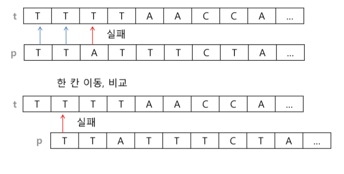
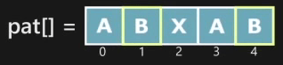
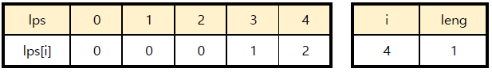
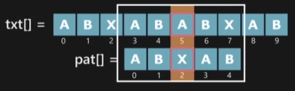
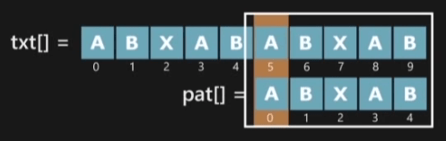
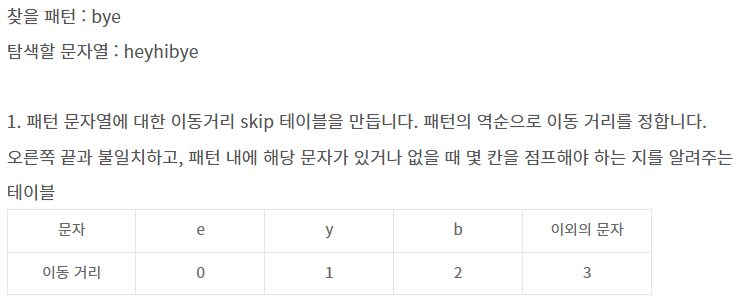
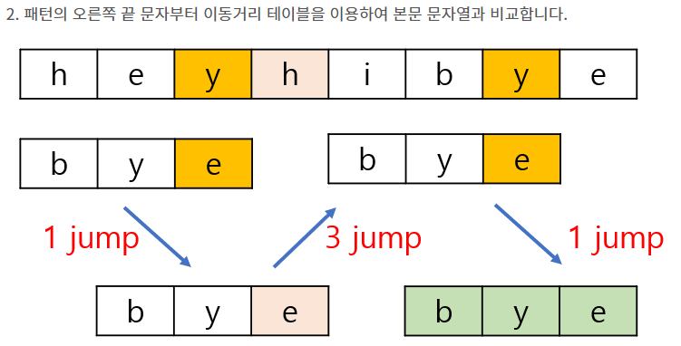

# 03. 문자열 (String)


> 문자의 표현
- 메모리는 숫자만을 저장
- 영어는 52개, 6비트면 표현가능 (64가지)
- 지역별 코드 체계 상이 -> 표준안 (ASCII)
- ASCII : 7bit 인코딩으로 128문자 표현, 33개 출력 불가 제어문자, 공백을 비롯한 95개 출력가능 문자
- '' : false / ' ' : True
- A : 65 / a : 97
- 확장 아스키 : 표준 문자 외 악센트, 도형, 특수문자, 특수기호 등 128개 추가 
- 표준 아스키는 7bit / 확장 아스키는 1B내 8bit 모두 사용
- 표준 아스키는 세계적 통용/ 대부분 ASCII형식을 사용
- 미국 외 나라들에서는 자국 문자 표현을 위해 코드체계를 만들어 사용
- 다국어 처리를 위해 표준을 마련 -> 유티코드 
- 우리나라 -> 한글 코드체계 (조합형 VS. 완성형)
- 유니코드
  - UCS-2
  - UCS-4
  - 유니코드를 저장하는 변수 크기 정의
  - BUT 바이트 순서에 대해 표준화하지 못함
  - 파일이 UCS-2인지 UCS-4인지 인식 후 각 경우를 구분해 모두 다르게 구현해야함
  - 적당한 외부 인코딩 필요
- little-endian: 12|34 / big-endian: 34|12 (메모리가 더적음)
- 유니코드 인코딩
  - UTF-8 (in web)
    - MIN : 8bit, MAX:32bit (1 Byte * 4)
  - UTF-16 (in windows, java)
    - MIN : 16bit, MAX : 32bit (2 Byte * 2)
  - UTF-32 (in unix)
    - MIN : 32bit, MAX: 32bit (4 Byte * 1)
- Python 인코딩
  - 3.x버전에서는 유니코드 UTF-8 생략가능
  - **cp-949**는 윈도우에서 사용하는 인코딩인데 이것때문에 오류 가끔 발생


> 문자열
  - fixed length
  - variable length
    - length controlled (java)
    - delimited (C)

> Python에서의 문자열 처리
- char 타입 없음
- 텍스트 데이터 취급방법 통일
- 문자열 기호
  - ', '', ''',"""
  - '+' (연결)
  - '*' (반복)
- 문자열은 시퀀스 자료형 (인덱싱, 슬라이싱 가능) **
- replace(), split(), isalpha(), find()
- 문자열은 튜플과 같이 요소값 변경 불가 (immutable) ***

---

> 문자열 뒤집기
- 자기문자열에서 뒤집기 / 새로운 빈 문자열 만들어 소스 뒤에서 부터 읽어서 타겟에 쓰는 방법
- s = s[::-1]
- s = 'abcd
- s = list(s)
- s.reverse()
- s = ''.join(S)
- ```python
    s = 'Reverse this String.'

    new_s = ''
    for i in range(len(s)-1,-1,-1):
        new_s += s[i]
    print(new_s)


    list_s = list(s)
    for idx in range(len(s)//2):
        list_s[idx], list_s[-1-idx] = list_s[-1-idx], list_s[idx]
    print(''.join(list_s))
  ```


> 문자열 비교
- is : 값, 객체 / == : 값
- ```python
    s1 = 'abc'
    s2 = 'abc'
    s3 = 'def'
    s4 = s1
    s5 = s1[:2] + 'c'
    print(s1 == s5) # True
    print(s1 is s5) # False 다른 문자열의 조합이라 메모리가 같지않음!!!
  ```
---

## Brute Force 알고리즘
- 본문 문자열을 처음부터 끝까지 차례대로 순회하면서 패턴 내의 문자들을 일일이 비교하는 방식


- ```python
    p = 'is'
    t = 'This is a book~!'
    M = len(p)  # 찾을 패턴 길이
    N = len(t)  # 전체 텍스트 길이

    def bruteforce(p, t):
        j = 0
        i = 0

        while j < M and i < N:
            if t[i] != p[j]:    # 값이 다르면
                i = i-j     # 비교할 시작값을 배열 한칸 우측으로 이동
                j = -1      # 패턴 시작 값은 0으로 변경해서 다시 비교 (아래 코드가 실행되어 j+1을 해줘서 j = 0이 되고, i = i - j + 1이 됨)
            i += 1
            j +=1

        if j == M:
            return i - j
        else:
            return -1

    print(bruteforce(p,t))  # 2
    -----------------------------

    def bruteforce2(p, t):
        j = 0
        i = 0

        while i != N and j != M:
            if t[i] == p[j]:
                i += 1
                j += 1
            else:
                i = i - j + 1
                j = 0
        return i - j if j == M else -1
  ```
  
- 시간 복잡도
    - 최악의 경우 모든 위치에서 패턴을 비교해야 하므로 O(MN)이 됨


---

## KMP 알고리즘
- 불일치가 발생한 텍스트 문자열의 앞 부분에 어떤 문자가 있는지를 미리 알고있으므로, 불일치가 발생한 앞 부분에 대하여 다시 비교하지 않고 매칭을 수행
- 패턴내에서 반복하는 구간이 있을것이라는 전제하에 진행, 반복이 없다면 무의미함
- 시간 복잡도 : O(M + N)






- 전처리 (Preprocessing)
    - 패턴에 대한 리턴 인덱스를 생성하는 것이 목적
    - 패턴은 패턴 내에 최전단 문자부터 일정길이가 중복되어야 한다.
    - 1부터 M-1까지 인덱스 i에 대해서 문자에 대해 j위치의 문자와 동일한지 확인
        - j는 문자가 일치할 때만 0 ~ M-1까지 증가
    - 일치하면 리턴인덱스 리스트에 j + 1(중복횟수  + 1) 저장
    - 불일치할 경우 j = 0
        - edge case : 해당 문자가 패턴 최전단 문자와 일치할 경우 lps에 1 저장, j += 1

- KMP
    - 패턴과 텍스트 내에 문자마다 비교
        - 일치 : 인덱스 증가시키기
        - 불일치
            - edge case : 패턴 비교 위치가 최전단 문자였을 땐 텍스트 위치 한 칸 이동
                - j = 0일 때 i += 1
            - 비교 위치가 패턴의 최전단 문자가 아니였다면 j = lps[j - 1]

- ```python
    text = 'babab cdabcdabcef ij'
    pattern = 'abcdabcef' # 000012300

    def pre_process(p):
        lps = [0] * len(p)

        j = 0   

        for i in range(1, len(p)):  # 항상 lps[0]==0이므로 while문은 i==1부터 시작
            if p[i] == p[j]:
                lps[i] = j + 1  
                j += 1
            else:
                j = 0
                if p[i] == p[j]:
                    lps[i] = j + 1
                    j += 1
        return lps

    def KMP(t, p):
        lps = pre_process(p)
        i = 0
        j = 0

        while i < len(t):
            if p[j] == t[i]:    # 문자열이 같은 경우 양쪽 인덱스를 모두 증가시킴
                i += 1
                j += 1
            else:
                if j != 0:  # Pattern을 찾지 못한 경우
                    j = lps[j-1]    # j!=0인 경우는 짧은 lps에 대해 재검사
                else:
                    i +=1   # j==0이면 일치하는 부분이 없으므로 인덱스 증가
            if j == len(p):
                return i - j
        else:
            return -1

    print(KMP(text,pattern))    # 8
   ```
---
## Boyer Moore 알고리즘
- 패턴 문자열의 오른쪽 끝 부분에서부터 왼쪽 앞부분 방향으로 문자를 비교하는 방식
- 보통 상황에서 문자열 앞부분보다 뒷부분이 불일치가 일어날 확률이 높다는 성질을 이용한 알고리즘
- 패턴문자열에 대한 이동거리 skip table을 만들어놓고 적절한 이동 거리만큼 점프해가며 비교함
- 시간 복잡도 : 일반적으로 O(N) 보다 적음 (최악의 경우 O(MN))
  - 찾으려는 문자열 패턴 길이 M, 총 문자열 길이 N
- 장점 : 원본 문자열을 모두 보지 않아도 검색 가능
- 단점 : 구현이 비교적 복잡함



- ```python
    def pre_process(pattern):
        M = len(pattern)  # 패턴의 길이

        skip_table = dict()
        for i in range(M-1):
            skip_table[pattern[i]] = M - i - 1

        return skip_table


    def boyer_moore(text, pattern):
        skip_table = pre_process(pattern)
        M = len(pattern)

        i = 0  # text index
        while i <= len(text) - M:
            j = M - 1   # 뒤에서부터 비교해야 되기 때문 j를 끝에 index
            k = i + (M-1)  # 비교를 시작할 위치 (현재위치 + M번째 인덱스)

            # 비교할 j가 남아있고, text와 pattern이 일치하면
            # 그 다음 앞에 글자를 비교하기 위해 인덱스 감소
            while j >= 0 and pattern[j] == text[k]:
                j -= 1
                k -= 1

            if j == -1:  # 일치 함
                return i
            # 일치하지 않는다면
            else:
                # i를 비교할 시작 위치를 skip table에서 가져온다.
                i += skip_table.get(text[i+M-1], M) # text의 y에서 틀린 경우 1칸점프, h에서 틀린경우 M=3칸 점프 

        return -1  # 일치되는 패턴이 없음


    text = 'ABC ABCDAB ABCDABCDABDE'
    pattern = 'ABCDABD'

    print(boyer_moore(text, pattern))   # 15
  ```