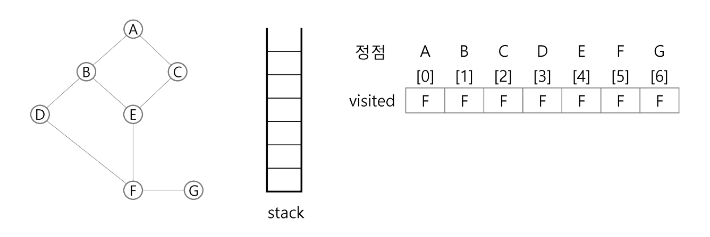
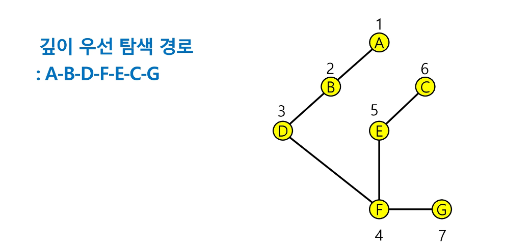

# 4. 스택 1 (Stack 1)

> 스택의 특성
- 자료를 쌓아올린 형태의 자료구조
- 스택에 저장된 자료는 선형 구조를 갖는다
  - 선형구조 : 자료 간의 관계가 1:1
  - 비선형구조 : 자료 간의 관계가 1:N
- 스택에 자료를 삽입하거나 스택에서 자료를 꺼낼 수 있다
- 마지막에 삽입한 자료를 가장 먼저 꺼낸다 (후입선출 LIFO)

> 스택을 프로그램에서 구현하기 위해서 필요한 자료구조와 연산
- 자료구조 : 자료를 선형으로 저장할 저장소
- 배열을 사용할 수 있다
- 저장소 자체를 스택이라 부르기도 함
- 스택에서 마지막 삽입된 원소의 위치를 top (stack pointer)

> 연산
- 삽입 : 저장소에 자료를 저장 (push)
- 삭제 : 저장소에서 자료를 꺼냄. 꺼낸 자료는 삽입한 자료의 역순으로 꺼냄. (pop)
- 스택이 공백인지 아닌지를 확인 (isEmpty -> 비어있으면 True/ 아니면 False)
- 스택의 top에 있는 item을 반환 (peek)

>  스택의 삽입/삭제 과정
- push A -> top++ / stack[top] = A
- push B -> top++ / stack[top] = B
- pop B -> top-- / stack[top] = A

> 스택의 push 알고리즘
- ```python
  def push(item):
    s.append(item)
  -------------------------
  def push(item, size):
    global top
    top += 1
    if top == size:
        print('overflow!')  # 디버깅용
    else:
        stack[top] = item
  -------------------------

    # 추천 push 코드
    size = 10
    stack = [0] * size
    top = -1

    push(10, size)


    # 아래 코드도 push(20)과 동일하게 동작
    top += 1
    stack[top] = 20
  ```

> 스택의 pop 알고리즘
- ```python
  def pop():
    if len(s) == 0:
        # underflow
        return
    else:
        return s.pop(-1);
  ------------------------
  def pop():
    global top
    if top == -1:
        print('underflow')
        return 0
    else:
        top -= 1
        return stack[top+1] # 파이썬은 return을 먼저 받을 수 없기때문에 top 줄여주고나서(top -= 1) top이 가리키는 원소(stack[top+1])를 return
    
    print(pop())

  -------------------------
  # 아래 코드도 pop()과 동일하게 동작
  if top > -1:
    top -= 1
    print(stack[top+1])
  ```
> 스택 구현
- ```python
    stackSize = 10
    stack = [0] * stackSize
    top = -1

    top += 1    # push(1)
    stack[top] = 1

    top += 1    # push(2)
    stack[top] = 2

    top -= 1
    temp = stack[top+1]
    print(temp) # 2

    temp = stack[top]
    top -= 1
    print(temp) # 1

    stack2 = []
    stack2.append(10)
    stack2.append(20)
    print(stack2.pop()) # 20
    print(stack2.pop()) # 10
  ```

> 스택 구현 고려 사항
- 1차원 배열을 사용하여 구현할 경우 구현이 용이하다는 장점이 있지만, 스택의 크기를 변경하기 어려움
- 이를 해결하기 위한 방법으로 저장소를 동적으로 할당하여 스택을 구현하는 방법 존재
- 동적 연결리스트 이용하여 구현
- 구현이 복잡하지만 메모리를 효율적으로 사용 (생략)

> 스택의 응용1 : 괄호검사
- 괄호 종류 : 대괄호 [] 중괄호 {} 소괄호 ()
- 조건 : 
    - 왼쪽 괄호의 개수와 오른쪽 괄호의 개수가 같아야함
    - 같은 괄호에서 왼쪽 괄호는 오른쪽 괄호보다 먼저 나와야함
    - 괄호 사이에는 포함 관계만 존재
- if( ( i == 0 ) && ( j == 0)
    - push('(') pop(')') 하여 비교
    - 괄호 수식이 끝났는데 스택에 괄호가 남아있으면 오류
- 문자열 괄호를 차례대로 조사
- 왼쪽 괄호를 만나면 스택에 삽입, 오른쪽 괄호를 만나면 스택에서 top괄호를 삭제한 후 오른쪽 괄호와 짝이 맞는지 검사
- 스택이 비어있으면 조건1 또는 조건 2에 위배되고 괄호의 짝이 맞지않으면 조건 3에 위배
- 마지막 괄호 조사이후에도 스택에 괄호가 남아있으면 조건 1에 위배


> 스택의 응용2 : function call
- Function cal
    - 함수 내부에서 또다른 함수 호출하면 스택 쌓임
    - 프로그램에서의 함수 호출과 복귀에 따른 수행 순서를 관리
    - 가장 마지막에 호출된 함수가 가장 먼저 실행을 완료하고 복귀하는 후입선출 구조, 후입선출 구조의 스택을 이용하여 수행순서 관리
    - 함수 호출이 발생하면 호출한 함수 수행에 필요한 지역변수, 매개변수 및 수행 후 복귀할 주소 등의 정보를 스택 프레임에 저장하여 시스템 스택에 삽입
    - 함수 실행이 끝나면 시스템 스택의 top 원소(스택프레임)를 삭제(pop)하면서 프레임에 저장되어있던 복귀 주소를 확인하고 복귀
    - 함수 호출과 복귀에 따라 이 과정을 반복하여 전체 프로그램 수행이 종료되면 시스템 스택은 공백이 됨


> 재귀 호출
- 추후 dfs를 위해 재귀 작성 연습 필요!!! ***
- 자기 자신을 호출하여 순환 수행되는 것
- 함수에서 실행해야하는 작업의 특성에 따라 일반적인 호출방식보다 재귀호출방식을 사용하여 함수를 만들면 프로그램의 크기를 줄이고 간단하게 작성
- ex) 팩토리얼, 피보나치
- 호출된 단계의 메모리 영역(스택)에 어떤 값이 저장되는지가 중요!
- ```python
  # 재귀
    # f(i, N) <- i : 현재단계 / N : 목표
    # 크기가 N인 배열의 모든 원소에 접근하는 재귀함수
    def f(i,N):
        if i == N:      # 배열을 벗어남
            return
        else:           # 남은 원소가 있는 경우
            B[i] = A[i]

            f(i+1, N)   # 다음 원소로 이동

    N = 3
    A = [1, 2, 3]
    B = [0] * N
    f(0, N)             # 0번 원소부터 N개의 원소에 접근
    print(B)            # [1, 2, 3]
  ```
> Memoization
- 피보나치 수열의 Call Tree
  - 엄청난 중복 호출 (O(2^N))
- 메모이제이션은 컴퓨터 프로그램을 실행할때 이전에 계산한 값을 메모리에 저장해서 매번 다시 계산하지 않도록 하여 전체적 실행속도를 빠르게 하는 기술 (동적 계획법의 핵심이 되는 기술)
- 피보나치 알고리즘에서 fibo(n) 값을 계산하자마자 저장하면, 실행시간을 O(N)으로 줄일 수 있다
- ```python
  # memo를 위한 배열을 할당, 모두 0으로 초기화
  # memo[0]을 0으로, momo[1]은 1로 초기화
  # n = 7 일때 fib(2)~fib(6)값을 memo에 저장에서 사용 (함수 반복 호출 x)
    def fibo1(n):
        if n<2:
            return n
        else:
            return fibo1(n-1) + fibo1(n-2)

    for i in range(21):
        print(i,fibo1(i))
    #-----------------------------------------   

    def fibo2(n):    # memoization
        if memo[n] == -1:
            memo[n] = fibo2(n-1) + fibo2(n-2)
        return memo[n]


    memo = [-1] * 101
    memo[0] = 0
    memo[1] = 1
    for i in range(101):    # 훨씬 빠름
        print(i,fibo2(i))
  ```

---

> DP (Dynamic Programming)
- 동적 계획 알고리즘은 그리디 알고리즘과 같이 최적화 문제를 해결하는 알고리즘임
- 먼저 입력크기가 작은 부분 문제들을 모두 해결한 후에 그 해들을 이용하여 보다 큰 크기의 부분 문제들을 해결하여, 최종적으로 원래 주어진 문제를 해결하는 알고리즘

> 피보나치 수 DP 적용
- 피보나치 수는 부분 문제의 답으로부터 본 문제의 답을 얻을 수 있으므로 최적 부분 구조로 이루어짐
    - 부분 문제로 나눔
    - 가장 작은 부분 문제부터 해를 구함
    - 결과를 **테이블**에 저장, 저장된 부분문제 해를 이용하여 상위 문제 해를 구함
- ```python
  def fibo_dp(n):
    table[0] = 0
    table[1] = 1
    for i in range(2, n+1):
        table[i] = table[i-1] + table[i-2]
    return

    table = [0] * 101       # 미리 구해서 한번에 채워놓고 꺼내씀!
    fibo_dp(100)
    print(table[20])

    #---------------------------------

    a = 0
    b = 1
    n = 20
    for _ in range(n-1):
        a, b = b, a+b
    print(b)
  ```

> DP의 구현 방식
- recursive 방식 : fib1()
- iterative 방식 : fib2()
- memoization을 재귀적 구조에 사용하는 것 보다 반복적 구조로 DP를 구현한 것이 성능 면에서 보다 효율적
- 재귀적 구조는 내부에 시스템 호출 스택을 사용하는 오버헤드가 발생하기 때문

---

> DFS (깊이우선탐색)   *** 중요!!!!!
- 비선형구조인 그래프 구조는 그래프로 표현된 모든 자료를 빠짐없이 검색하는 것이 중요
- 두가지 방법
  - 깊이 우선 탐색 (Depth First Search, DFS) *
  - 너비 우선 탐색 (Breadth First Search, BFS)
- ex) 선형 - 1:1 / 1:n - 트리 / n:n - 그래프
- 시작 **정점(출발점)**의 한 방향으로 갈 수 있는 경로가 있는 곳까지 깊이 탐색해 가다가 더이상 갈 곳이 없게 되면, 가장 마지막에 만났던 갈림길 간선이 있는 정점으로 되돌아와서 다른 방향의 정점으로 탐색을 계속 반복하여 결국 **모든 정점을 방문**하는 순회 방법
-  가장 **마지막에 만났던 갈림길의 정점**으로 되돌아가서 **다시 깊이 우선 탐색**을 반복해야하므로 **후입선출 구조의 스택** 사용
   -  스택 / 재귀 호출 둘다 경로 저장 가능
   -  스택을 사용해서 dfs가 아니라 그냥 모든 정점을 방문하는 방식 자체인 것!
- 1) **시작 정점 v**를 결정하여 방문
- 2) 정점 v에 인접한 정점 중
  - 1. **방문하지 않은 정점 w**가 있으면, **정점 v를 스택에 push**하고 **정점 w를 방문**, 그리고 **w를 v로** 하여 다시 2)를 반복
  - 2. **방문하지 않은 정점이 없으면**, 탐색 방향을 바꾸기 위해 **스택을 pop**하여 받은 **가장 마지막 방문 정점을 v**로 하여 다시 2)를 반복
- 3) **스택이 공백이 될 때까지** 2)를 반복
- ```python
  visited[], stack[] 초기화
  DFS(v)
    시작점 v 방문;
    visited[v] <- true;
    while {
        if ( v의 인접 정점 중 방문 안 한 정점 w가 있으면)
            push(v);
            v <- w; ( w에 방문 )
            visited[w] <- true;
        else
            if ( 스택이 비어있지 않으면 )
                v <- pop(stack);
            else
                break
    }
  end DFS()
  ```
  
  

    0) 초기상태 : 배열 visited를 False로 초기화하고, 공백 스택을 생성
    1) 정점 A를 시작으로 깊이 우선 탐색 시작
        - visited[A] <- true;
    2) 정점 A에 방문하지 않은 정점 B,C가 있으므로 A를 스택에 push하고, 인접 정점 B와 C중에서 오름차순에 따라 B를 선택하여 탐색 계속
        - push(A); visited[B] <- true;
    3) 정점 B에 방문하지 않은 정점 D,E가 있으므로 B를 스택에 push하고, 인접정점 D와 E중에서 오름차순에 따라 D를 선택하여 탐색 계속
        - push(B); visited[D] <- true;
    4) 정점 D에 방문하지 않은 정점 F가 있으므로 D를 스택에 push하고, 인접정점 F를 선택하여 탐색 계속
        - push(D); visited[F] <- true;
    5) 정점 F에 방문하지 않은 정점 E,G가 있으므로 F를 스택에 push하고, 인접정점 E와 G중에서 오름차순에 따라 E를 선택하여 탐색 계속
        - push(F); visited[E] <- true;
    6) 정점 E에 방문하지 않은 정점 C가 있으므로 E를 스택에 push하고, 인접정점 C를 선택하여 탐색 계속
        - push(E); visited(C) <- true;
    7) 정점 C에서 방문하지 않은 인접정점이 없으므로, 마지막 정점으로 돌아가기 위해 스택을 pop하여 받은 정점 E에 대해서 방문하지 않은 인접정점이 있는지 확인
        - pop(stack);
    8) 정점 E는 방문하지 않은 인접정점이 없으므로, 다시 스택을 pop하여 받은 정점 F에 대해서 방문하지 않은 인접정점이 있는지 확인
        - pop(stack);
    9) 정점 F에 방문하지 않은 정점 G가 있으므로 F를 스택에 push하고, 인접정점 G를 선택하여 탐색을 계속
        - push(F); visited[G] <- true;
    10) 정점 G에서 방문하지 않은 인접정점이 없으므로, 다시 마지막 정점으로 돌아가기위해 스택을 pop하여 정점 A까지 확인 -> 스택이 비면 종료

- ```python
    # A~6 -> 0~6
    # 인접 정점 리스트
    adjList = [[1,2],       # 0
            [0,3,4],     # 1
            [0,4],       # 2
            [1,5],       # 3
            [1,2,5],     # 4
            [3,4,6],     # 5
            [5]]         # 6

    def dfs(v, N):
        visited = [0] * N           # visited 생성
        stack = [0] * N             # stack 생성
        print(v)
        top = -1


        visited[v] = 1              # 시작점 방문 표시
        while True:
            for w in adjList[v]:    # if (v의 인접 정점 중 방문 안 한 정점 w가 있으면)
                if visited[w] == 0:
                    top += 1
                    stack[top] = v  # push(v)
                    v = w           # v <- w (w에 방문)
                    print(v)
                    visited[w] = 1
                    break
            else:                   # w가 없으면
                if top != -1:       # 스택이 비어있지 않은 경우
                    v = stack[top]  # pop
                    top -= 1
                else:               # 스택이 비어있으면
                    break           # while 빠져나옴


    dfs(0,7)
  ```

- ```python
    # input으로 adjList 생성하는 방법 (스택)
    def dfs(v, N):
        visited = [0] * N           # visited 생성
        stack = [0] * N             # stack 생성
        print(v)
        top = -1


        visited[v] = 1              # 시작점 방문 표시
        while True:
            for w in adjList[v]:    # if (v의 인접 정점 중 방문 안 한 정점 w가 있으면)
                if visited[w] == 0:
                    top += 1
                    stack[top] = v  # push(v)
                    v = w           # v <- w (w에 방문)
                    print(v)
                    visited[w] = 1
                    break
            else:                   # w가 없으면
                if top != -1:       # 스택이 비어있지 않은 경우
                    v = stack[top]  # pop
                    top -= 1
                else:               # 스택이 비어있으면
                    break           # while 빠져나옴


    V, E = map(int, input().split())
    N = V + 1
    adjList = [[] for _ in range(N)]

    for _ in range(E):
        a, b = map(int,input().split())
        adjList[a].append(b)
        adjList[b].append(a)
    visited = [0] * N
    stack = [0] * N
    dfs(0,7)
  ```
- ```python
    # 재귀로 dfs
    def dfs(v):
        print(v)    # v방문
        visited[v] = 1
        for w in adjList[v]:
            if visited[w] == 0:     # 방문하지않은 w
                dfs(w)


    V, E = map(int, input().split())
    N = V + 1
    adjList = [[] for _ in range(N)]

    for _ in range(E):
        a, b = map(int, input().split())
        adjList[a].append(b)
        adjList[b].append(a)
    visited = [0] * N
    stack = [0] * N
    dfs(0)
  ```