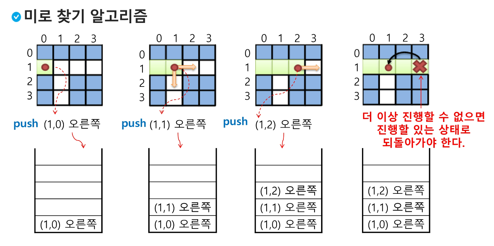
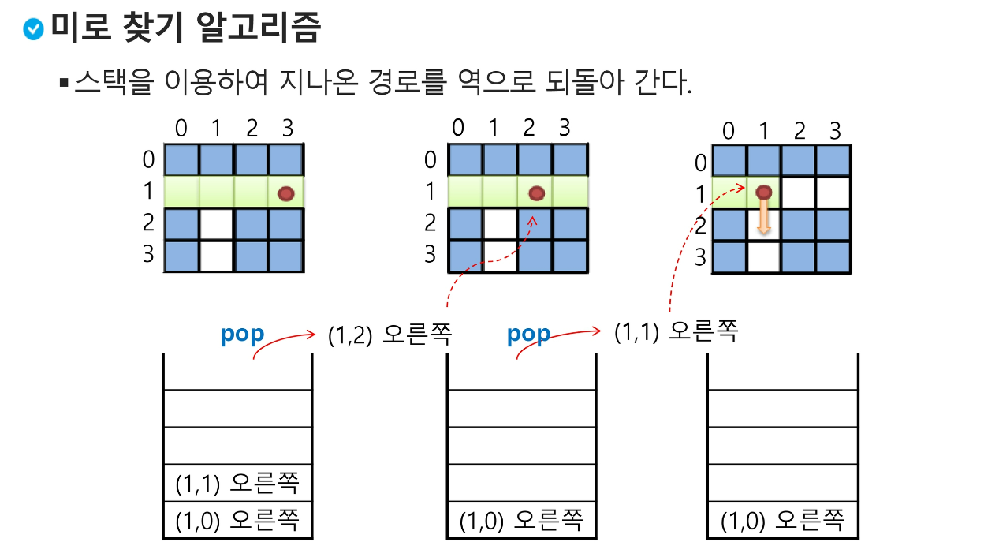
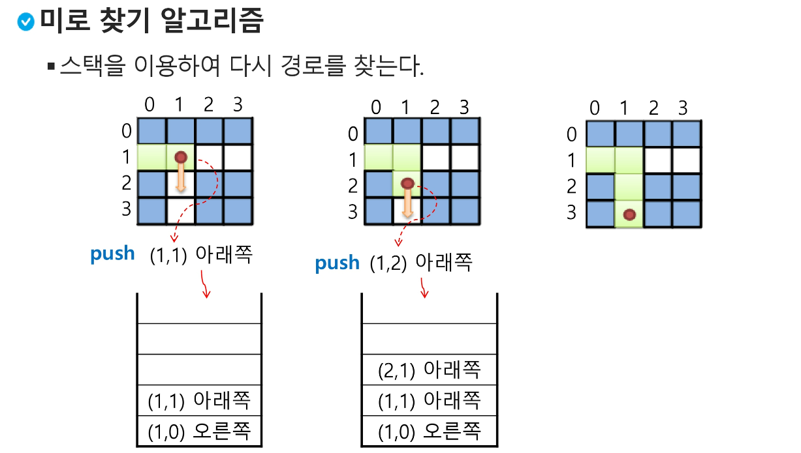

# 5. 스택 2 (Stack 2)

> ### 계산기 1
- step1. 중위 표기법의 수식을 후위 표기법으로 변경 (스택 이용)
- step2. 후위 표기법의 수식을 스택을 이용하여 계산
- 중위표기법 (infix notation):
  - 연산자를 피연산자의 가운데 표기하는 방법 ex) A + B
- 후위표기법 (postfix notation):
  - 연산자를 피연산자 뒤에 표기하는 방법 ex) AB +

> 중위 표기법으로 표현된 수식 예
- (6 + 5 * (2 - 8) / 2)
  - 1) 토큰 하나 가져오기
  - 2) 피연산자면 출력
  - 3) 연산자면 스택 top과 비교
    - 높으면 push (여는괄호 push), top 변경
    - 아니면 스택 top 연산자의 우선순위가 토큰의 우선순위보다 작을때까지 스택에서 pop한후 토큰 연산자를 push (top에 연산자가 없으면 push)
  - 5) 토큰이 오른쪽 괄호 ')'이면 스택 top에 왼쪽 괄호 '('가 올때까지 pop하고 pop한 연산자 출력 / 왼쪽 괄호 만나면 pop만 수행, 출력x
  - 6) 중위 표기식에 더 읽을게 없으면 중지/ 있다면 1부터 다시 반복
  - 7) 스택에 남아있는 연산자를 모두 pop하여 출력
    - 스택 밖의 왼쪽 괄호는 우선순위가 가장 높으며, 스택 안 왼쪽괄호는 우선순위 가장 낮음

> 연습문제1
- 중위표기법 : 2 + 3 * 4 / 5
  - ```python
    stack = []
    print(2, end=' ')
    stack.append('+')
    print(3, end = ' ')
    stack.append('*')
    print(4, end = ' ')
    stack.append('/')
    print(5, end = ' ')
    temp1 = stack.pop()
    print(temp1, end = ' ')
    temp2 = stack.pop()
    print(temp2, end = ' ')
    temp3 = stack.pop()
    print(temp3, end = ' ')

    # 2 3 4 5 / * + 
    ```

> ### 계산기 2
- 1) 피연산자를 만나면 스택에 push
- 2) 연산자를 만나면 필요한 만큼의 피연산자를 스택에서 pop하여 연산, 연산 결과를 다시 스택에 push
- 3) 수식이 끝나면 마지막으로 스택을 pop하여 출력
- ```python
  oper = ['+','-','*','/']

    equation = '6528-*2/+'

    stack = []

    i = 0
    while i < len(equation):

        if equation[i] not in oper:
            stack.append(equation[i])
        elif equation[i] in oper:

            temp1 = int(stack.pop())
            temp2 = int(stack.pop())

            if equation[i] == '+':
                stack.append(temp2 + temp1)
            elif equation[i] == '-':
                stack.append(temp2 - temp1)
            elif equation[i] == '*':
                stack.append(temp2 * temp1)
            elif equation[i] == '/':
                stack.append(temp2 / temp1)
        i += 1
    print(stack.pop())  # -9
    ```

> ### 백트래킹 (Backtracking)
- 해를 찾는 도중에 막히면 (즉 해가 아니면) 되돌아가서 다시 해를 찾아가는 기법
- 최적화 문제와 결정 문제를 해결 가능
  - 결정 문제 : 문제의 조건을 만족하는 해가 존재하는지 여부를 yes or no가 답하는 문제
    - 미로찾기, n-Queen, Map coloring, 부분집합의 합 문제 등

> 미로찾기
- 입구와 출구가 주어진 미로에서 입구부터 출구까지의 경로를 찾는 문제
- 이동 가능 방향은 4방향으로 제한
  
  
  

> 백트래킹과 깊이우선탐색과의 차이
- 어떤 노드에서 출발하는 경로가 해결책으로 이어질 것 같지 않으면 더이상 그 경로를 따라가지 않음으로써 시도의 횟수를 줄임 (Prunning 가지치기)
- 깊이우선탐색 - 모든경로 추적 / 백트래킹 - 불필요한 경로 조기 차단
- 깊이우선탐색이 N!가지 경우의 수일때 처리 불가능, 백트래킹 사용하면 경우의 수가 줄어들지만, 이역시 최악 경우에는 지수함수 시간을 요함

> 백트래킹 기법
- 어떤 노드의 유망성을 점검한 후, 유망(promising)하지 않다고 결정되면 그 노드의 부모로 되돌아가 다음 자식 노드로 감
- 어떤 노드를 방문했을때 그 노드를 포함한 경로가 해답이 될 수 없으면 그 노드는 유망하지 않음, 해답 가능성이 있으면 유망
- 가지치기(pruning) : 유망하지 않은 노드가 포함된 경로는 더이상 고려 x


> Powerset(부분집합) 생성
- loop 이용
- ```python
  bit = [0,0,0,0]
  for i in range(2):
    bit[0] = i
    for j in range(2):
        bit[1] = j
        for k in ragne(2):
            bit[2] = k
            for l in range(2):
                bit[3] = l
                print(bit)
                