# 7. 트리 (Tree)

## 트리

### 트리의 개념
- 비선형 구조
- 순환될 수 없는 구조
- 그래프의 하위 개념
- 원소들 간에 1:n 관계를 가지는 자료구조
- 원소들 간에 계층관계를 가지는 계층형 자료구조
- 상위 원소에서 하위 원소로 내려가면서 확장되는 트리(나무)모양의 구조
- 한 개 이상의 노드로 이루어진 유한 집합
  - 노드 중 최상위 노드를 루트(root)라 함
  - 나머지 노드들은 n(>=0)개의 분리 집합 T1,...,TN으로 분리 가능
- 이들 T1,...,TN은 각각 하나의 트리가 되며(재귀적 정의) 루트의 부 트리(subtree)라 함

### 트리 용어 정리

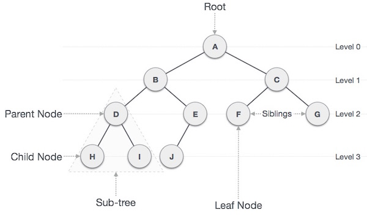
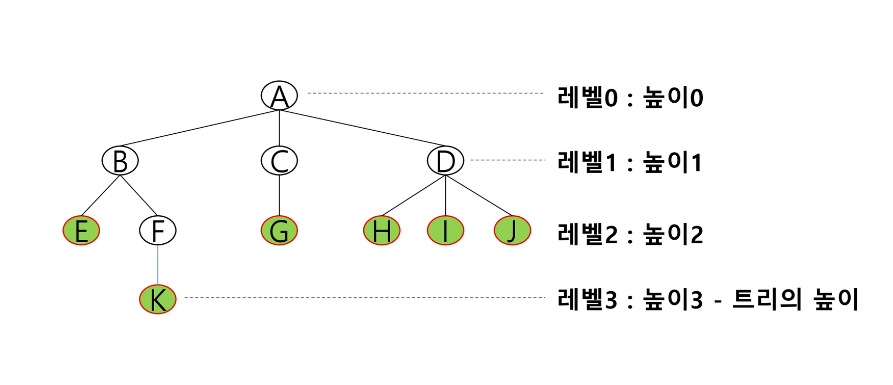

- 노드(node) - 트리의 원소
- 간선(edge) - 노드를 연결하는 선. 부모노드와 자식노드를 연결
- 루트노드(root node) - 트리의 시작 노드
- 형제노드(sibling node) - 같은 부모 노드의 자식 노드들
- 조상노드 - 간선을 따라 루트 노드까지 이르는 경로에 있는 모든 노드들
- 서브트리(subtree) - 부모 노드와 연결된 간선을 끊었을 때 생성되는 트리
- 자손노드 - 서브트리에 있는 하위 레벨의 노드들
- 차수(degree)
  - 노드의 차수 : 노드에 연결된 자식 노드의 수
  - 트리의 차수 : 트리에 있는 노드의 차수 중에서 가장 큰 값
  - 단말 노드(리프노드) : 차수가 0인 노드, 자식 노드가 없는 노드
- 높이
  - 노드의 높이 : 루트에서 노드에 이르는 간선의 수. 노드의 레벨
  - 트리의 높이 : 트리에 있는 노드의 높이 중에서 가장 큰 값. 최대 레벨

---
## 이진트리

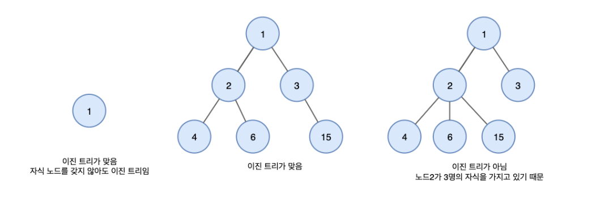

- 모든 노드들이 2개의 서브트리를 갖는 특별한 형태의 트리
- 각 노드가 자식 노드를 최대한 2개 까지만 (둘 이하의 자식!) 가질 수 있는 트리
  - 왼쪽 자식 노드(left child node)
  - 오른쪽 자식 노드(right child node)

### 이진트리 - 특성 **

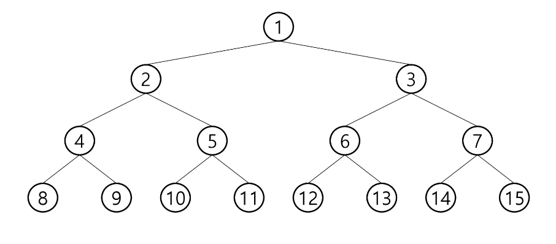

- 레벨 i에서의 노드의 최대 개수는 2^i 개
- 높이가 h인 이진트리가 가질 수 있는 노드의 최소 개수는 (h+1)개가 되며, 최대 개수는 (2^(h+1) - 1)개가 됨

### 이진트리 - 종류
- **포화 이진 트리 (Full Binary Tree)**
  - 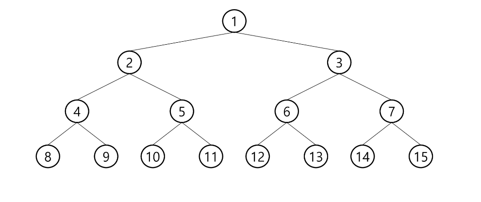
  - **모든 레벨에 노드가 포화상태**로 차 있는 이진 트리
  - 높이가 h일때, 최대의 노드 개수인 (2^(h+1) - 1)의 노드를 가진 이진 트리
  - 루트를 1번으로 하여 (2^(h+1) - 1)까지 정해진 위치에 대한 노드 번호를 가짐
- **완전 이진 트리 (Complete Binary Tree)**
  - 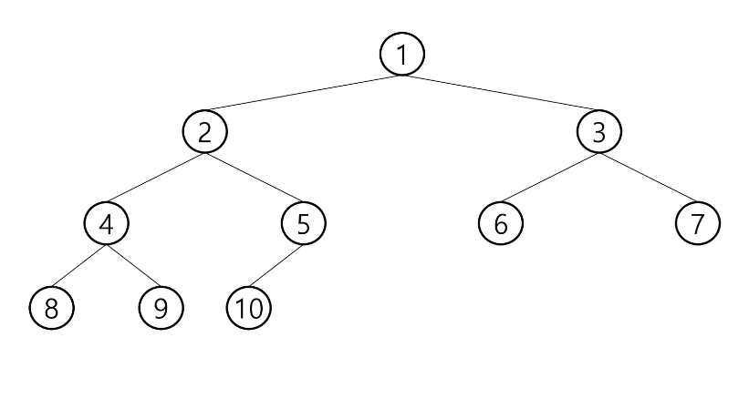
  - 높이가 h이고 노드 수가 n개 일때 (단, h+1 <= n <= (2^(h+1) - 1)), 포화 이진 트리의 노드 번호 **1번부터 n번까지 빈 자리가 없는** 이진 트리
- **편향 이진 트리 (Skewed Binary Tree)**
  - 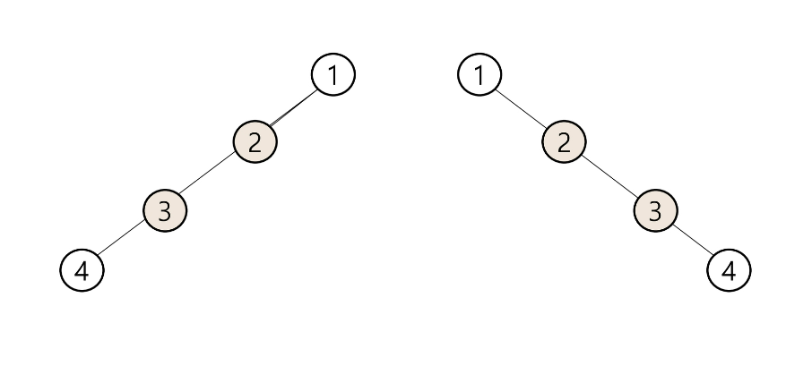
  - 높이 h에 대한 최소 개수의 노드를 가지면서 한쪽 방향의 자식 노드만을 가진 이진 트리
    - 왼쪽 편향 이진 트리
    - 오른쪽 편향 이진 트리
    - 최악의 시간 복잡도

### 이진트리 - 순회 (traversal)
- **순회(traversal)**란 트리의 각 노드를 중복되지 않게 전부 방문(visit)하는 것을 말하는데 트리는 비 선형 구조이기 때문에 선형구조에서와 같이 선후 연결 관계를 알 수 없다.
- 순회(traversal) : 트리의 노드들을 체계적으로 방문하는 것
- **전위 순회 (preorder traversal)** : VLR
  - 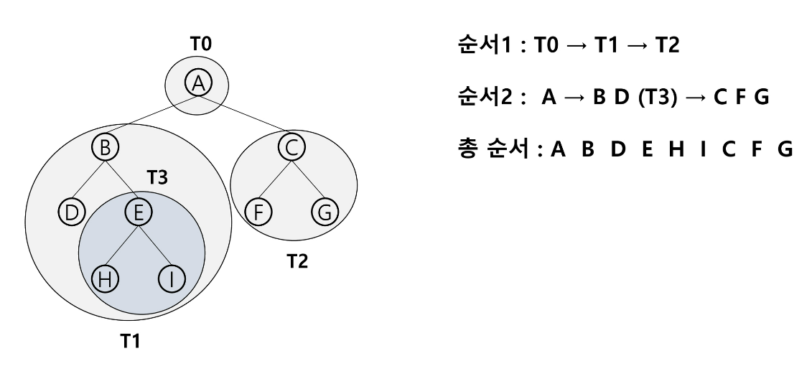
  - 부모 노드 방문 후, 자식 노드를 좌,우 순서로 방문
- **중위 순회 (inorder traversal)** : LVR
  - 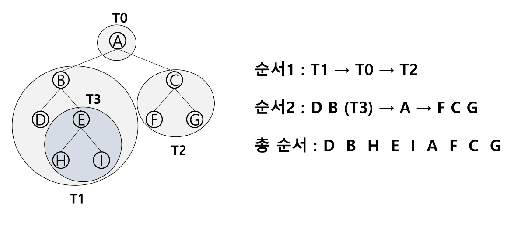
  - 왼쪽 자식 노드, 부모 노드, 오른쪽 자식 노드 순으로 방문
- **후위 순회 (postorder traversal)** : LRV
  - 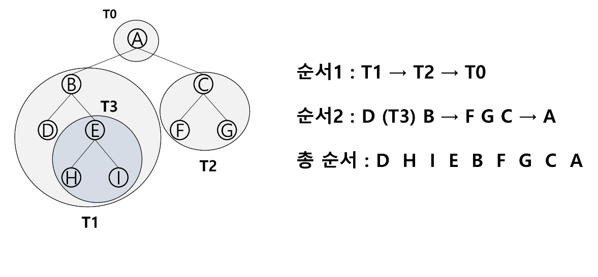
  - 자식 노드를 좌,우 순서로 방문 후, 부모 노드로 방문
  

### 전위 순회 (preorder traversal)
- 수행 방법
  - 1. 현재 노드 n을 방문하여 처리 -> V
  - 2. 현재 노드 n의 왼쪽 서브트리로 이동 -> L
  - 3. 현재 노드 n의 오른쪽 서브트리로 이동 -> R
- 전위 순회 알고리즘
```python
def preorder_traversal(T):
    if T:   # T is not None
        visit(T)    # print(T.item)
        preorder_traversal(T.left)
        preorder_traversal(T.right)
```

### 중위 순회 (inorder traversal)
- 수행 방법
  - 1. 현재 노드 n의 왼쪽 서브트리로 이동 -> L
  - 2. 현재 노드 n을 방문하여 처리 (**왼쪽에서 되돌아올때 방문처리!!!**) -> V
  - 3. 현재 노드 n의 오른쪽 서브트리로 이동 -> R
- 중위 순회 알고리즘
```python
def inorder_traversal(T):
    if T:   # T is not None
        inorder_traversal(T.left)
        visit(T)    # print(T.item)
        inorder_traversal(T.right)
```

### 후위 순회 (postorder traversal)
- 수행 방법
  - 1. 현재 노드 n의 왼쪽 서브트리로 이동 -> L
  - 2. 현재 노드 n의 오른쪽 서브트리로 이동 -> R
  - 3. 현재 노드 n을 방문하여 처리 -> V

- 후위 순회 알고리즘
```python
def postorder_traversal(T):
    if T:   # T is not None
        postorder_traversal(T.left)
        postorder_traversal(T.right)
        visit(T)    # print(T.item)
        
```

### 이진트리의 표현 - 배열
- 포화 or 완전 이진 트리의 경우에 한해서!!
- 이진 트리에 각 노드 번호를 다음과 같이 부여
- **루트 번호를 1로 함**
- 레벨 n에 있는 노드에 대하여 왼쪽부터 오른쪽으로 2^n부터 2^(n+1)-1 까지 번호를 차례로 부여
- 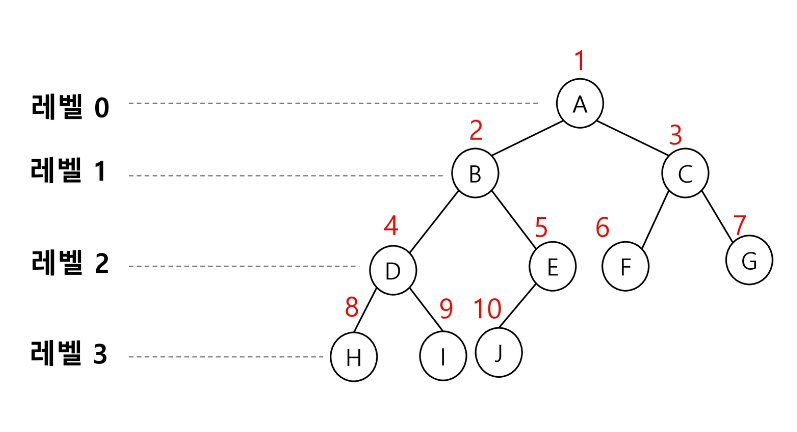
- **노드 번호의 성질**
  - 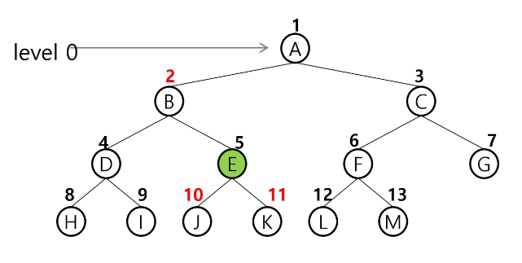
  - 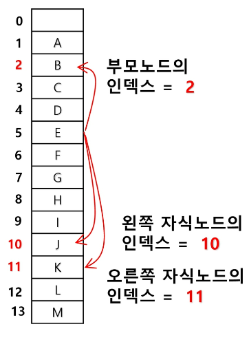
  - 노드 번호가 i인 노드의 부모 노드 번호 : i/2
  - 노드 번호가 i인 노드의 왼쪽 자식 노드 번호 : 2*i
  - 노드 번호가 i인 노드의 오른쪽 자식 노드 번호 : 2*i+1
  - 레벨 n의 노드 번호 시작 번호 : 2^n

- 노드 번호를 배열의 인덱스로 사용
- 높이가 h인 이진 트리를 위한 배열의 크기는?
- 레벨 i의 최대 노드 수는 2^i
- 따라서 1+2+4+8+...+2^i = 2^(h+1)-1
- 높이가 3일때 배열 크기는 15
- 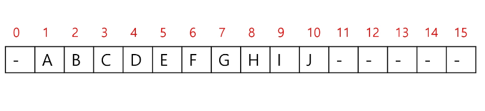
- 리스트로 표현
- 편향 이진 트리의 경우에 사용하지 않는 배열 원소에 대한 메모리 공간 낭비 발생
- 트리 중간에 새로운 노드를 삽입하거나 기존 노드를 삭제할 경우 배열의 크기 변경이 어려워 비효율적

### 이진트리의 저장
- 1. 부모 번호를 인덱스로 자식 번호를 저장 (왼쪽자식노드 리스트/ 오른쪽자식노드 리스트)
  - 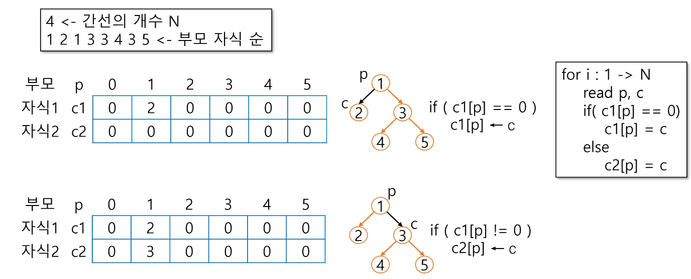
  - 순회 할 때 유용
  - 자식은 들어온 순서대로 해당 인덱스가 비어있을때만!
  - 트리에서 간선수 + 1 = 정점수 (E = V - 1)
- 2. 자식 번호를 인덱스로 부모 번호를 저장
  - 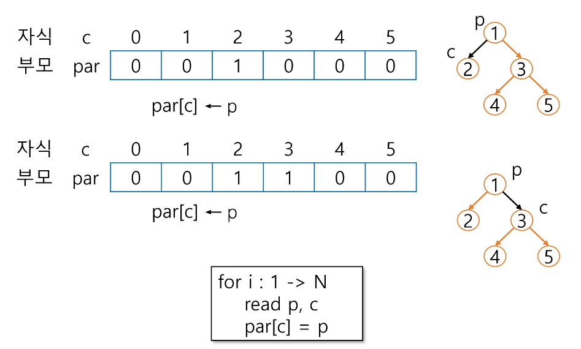
  - 루트 찾기, 조상 찾기에 유용

```python
# 정점 번호 1 ~ (E+1)
# 간선 수
# 부모-자식 순
# 4
# 1 2 1 3 3 4 3 5

def preorder(n):    # 전위순회
    if n:
        print(n)    # visit(n)
        preorder(ch1[n])
        preorder(ch2[n])


def inorder(n):     # 중위순회
    if n:
        inorder(ch1[n])
        print(n)    # visit(n)
        inorder(ch2[n])

def postorder(n):   # 후위순회
    if n:
        postorder(ch1[n])
        postorder(ch2[n])
        print(n)    # visit(n)


def find_root(V):
    for i in range(1, V+1):
        if par[i] == 0:     # 부모가 없으면 root임
            return i


E = int(input())
arr = list(map(int,input().split()))
V = E + 1
root = 1

# 부모를 인덱스로 자식 번호 저장
ch1 = [0]*(V+1)
ch2 = [0]*(V+1)

# 자식을 인덱스로 부모 번호 저장
par = [0]*(V+1)

for i in range(E):
    p, c = arr[i*2], arr[i*2+1]
    
    if ch1[p] == 0:     # 아직 자식이 없으면
        ch1[p] = c      # 자식1로 저장
    else:
        ch2[p] = c

    par[c] = p

root = find_root(V)
print(root)

preorder(root)  # 1 2 3 4 5
inorder(root)   # 2 1 4 3 5
postorder(root) # 2 4 5 3 1
```

### 연습문제
```python
# 전위 순회
#13 정점 개수
#1 2 1 3 2 4 3 5 3 6 4 7 5 8 5 9 6 10 6 11 7 12 11 13   부모-자식 간선


import sys
sys.stdin = open('input.txt')

def preorder(n):
    if n:
        print(n, end=' ')
        preorder(ch1[n])
        preorder(ch2[n])


V = int(input())
E = V - 1
edges = list(map(int,input().split()))
root = 1

ch1 = [0]*(V+1)
ch2 = [0]*(V+1)

for i in range(E):
    p, c = edges[i*2], edges[i*2+1]

    if ch1[p] == 0:
        ch1[p] = c
    else:
        ch2[p] = c

preorder(root)

```

### 수식 트리

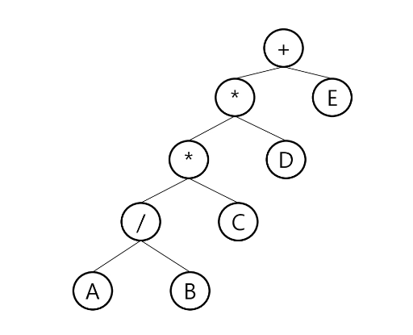

- 수식을 표현하는 이진 트리
- 수식 이진 트리 (Expression Binary Tree)라고 부르기도 함.
- 연산자는 루트 노드이거나 가지 노드
- 피연산자는 모두 잎 노드
- 중위 순회 : A / B * C * D + E
- 후위 순회 : A B / C * D * E +
- 전위 순회 : + * * / A B C D E

---

### 이진 탐색 트리

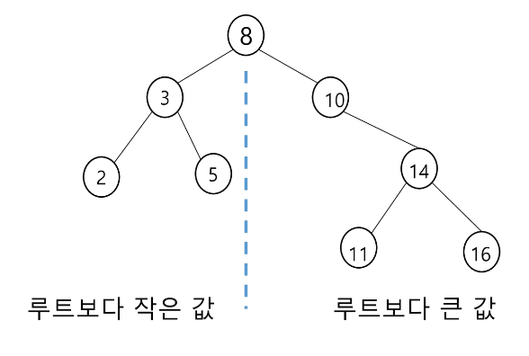

- 탐색작업을 효율적으로 하기 위한 자료구조
- 모든 원소는 서로 다른 유일한 키를 갖는다.
- key(왼쪽 서브트리) < key(루트 노드) < key(오른쪽 서브트리)
- 왼쪽 서브트리 : 루트보다 작은 값 / 오른쪽 서브트리 : 루트보다 큰 값
- 왼쪽 서브트리와 오른쪽 서브트리도 이진 탐색 트리다.
- 중위 순회하면 오름차순으로 정렬된 값을 얻을 수 있다.

### 탐색연산

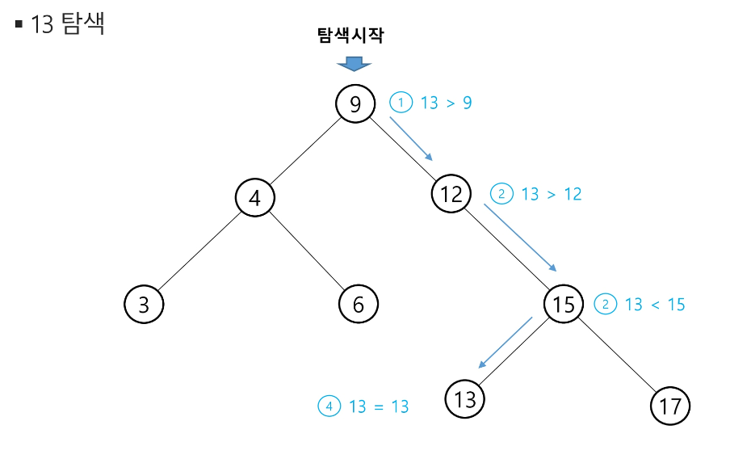

- 루트에서 시작
- 탐색할 키 값 x를 루트 노드의 키 값과 비교
  - (키 값 x = 루트노드 키 값) : 원하는 원소를 찾았으므로 탐색연산 성공
  - (키 값 x < 루트노드 키 값) : 루트노드의 왼쪽 서브트리에 대해 탐색연산 수행
  - (키 값 x > 루트노드 키 값) : 루트노드의 오른쪽 서브트리에 대해 탐색연산 수행
- 서브트리에 대해 순환적으로 탐색 연산 반복

### 삽입 연산

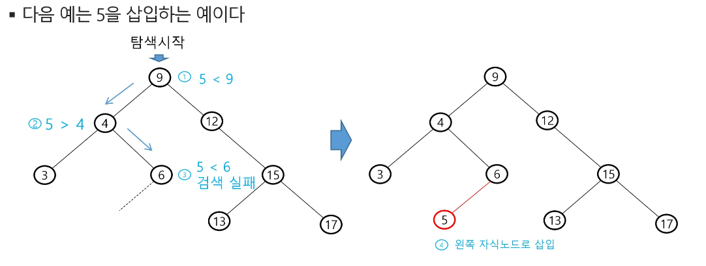

- 먼저 탐색 연산을 수행
  - 삽입할 원소와 같은 원소가 트리에 있으면 삽입할 수 없으므로, 같은 원소가 트리에 있는지 탐색하여 확인
  - 탐색에서 탐색 실패가 결정되는 위치가 삽입 위치가 됨
- 탐색 실패한 위치에 원소를 삽입


### 삭제 연산

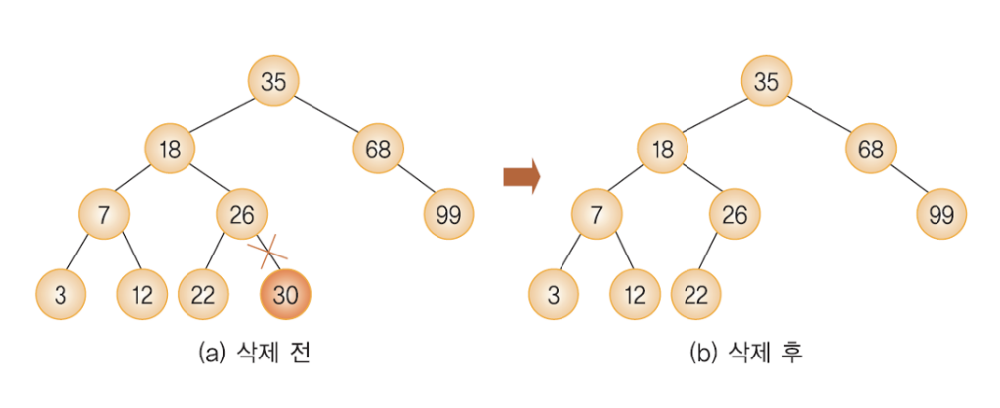

- 1. 삭제하려는 노드가 단말 노드인 경우
  - 삭제하고자 하는 단말 노드를 삭제

  
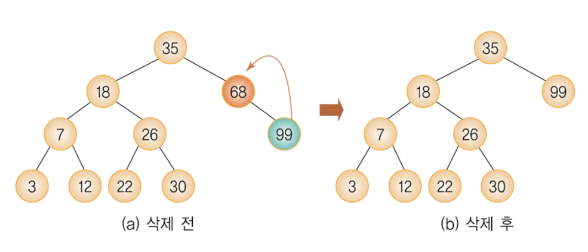

- 2. 삭제하려는 노드가 하나의 왼쪽이나 오른쪽 자식 노드 중 하나만 가지고 있는 경우
  - 왼쪽 혹은 오른쪽 자식 노드 중 하나만 갖고 있을 때, 삭제하고자 하는 노트는 삭제, 자식 노드를 삭제하고자 하는 노드의 위치에 붙여 준다.

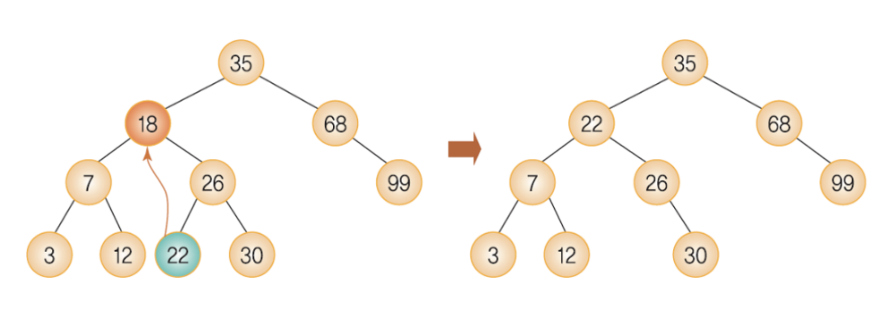
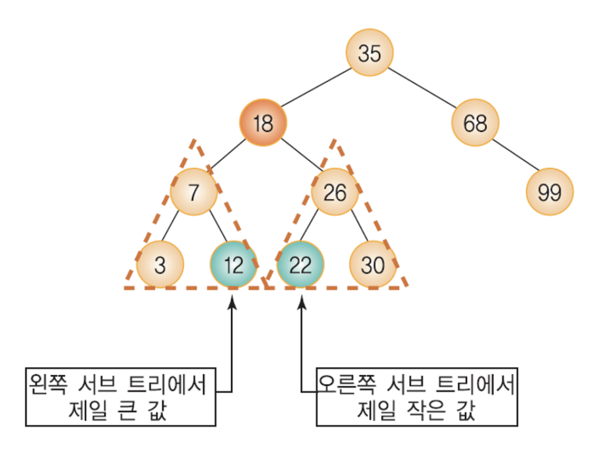

- 3. 삭제하려는 노드가 두 개의 서브 트리 모두 가지고 있는 경우
  - 삭제하고자 하는 노드와 가장 비슷한 값을 가진 노드를 삭제 노트 위치로 가져온다.
  - 왼쪽 서브 트리에서 제일 큰값, 오른쪽 서브 트리에서 제일 작은 값을 기준으로 가장 비슷한 값의 노드를 찾을 수 있다.

## 이진 탐색 트리 - 성능
- 탐색(searching), 삽입(insertion), 삭제(deletion) 시간은 트리의 높이 만큼 시간이 걸림
  - O(h), h : BST의 깊이(height)
- 평균의 경우
  - 이진 트리가 균형적으로 생성되어 있는 경우
  - O(log n)
- 최악의 경우
  - 한쪽으로 치우친 경사 이진트리의 경우
  - O(n)
  - 순차탐색과 시간복잡도가 같음
- 검색 알고리즘 비교
  - 배열에서의 순차검색 : O(N)
  - 정렬된 배열에서의 순차검색 : O(N)
  - 정렬된 배열에서의 이진탐색 : O(logN)
    - 고정 배열 크기와 삽입, 삭제 시 추가 연산 필요
  - 이진 탐색트리에서의 평균 : O(logN)
    - 최악의 경우 : O(N)
    - 완전 이진 트리 또는 균형트리로 바꿀 수 있다면 최악의 경우를 없앨 수 있다.
    - 새로운 원소를 삽입할 때 삽입 시간을 줄인다.
    - 평균과 최악의 시간이 같다. O(logN)
  - 해쉬 검색 : O(1)
    - 추가 저장 공간이 필요


## 힙(heap)
- **완전 이진 트리**에 있는 노드 중에서 **키값이 가장 큰 노드**나 **키값이 가장 작은 노드**를 찾기 위해서 만든 자료구조
  
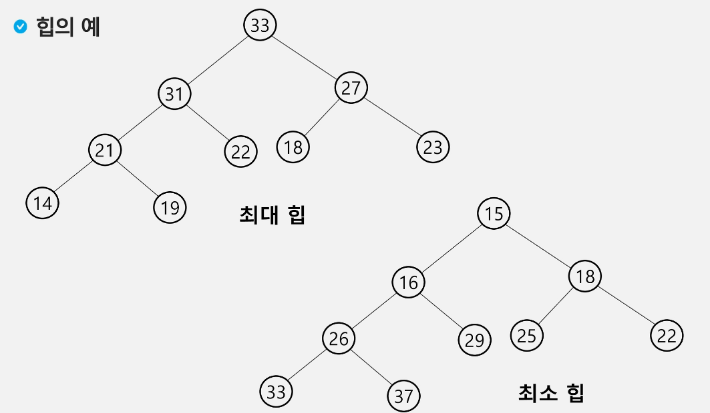

- 최대 힙(max heap)
  - 키값이 가장 큰 노드를 찾기 위한 완전 이진 트리
  - (부모노드의 키값 > 자식노드의 키값)
  - 루트 노드 : 키값이 가장 큰 노드
- 최소 힙(min heap)
  - 키값이 가장 작은 노드를 찾기 위한 완전 이진 트리
  - (부모노드의 키값 < 자식노드의 키값)
  - 루트 노드 : 키값이 가장 작은 노드


### **정렬관점에서 heap**

- 원소가 계속 추가되고 정렬값을 얻어야 하는 상황에서 heap이 quick sort보다 빠른 경우도 있음

## - 1. 삽입연산
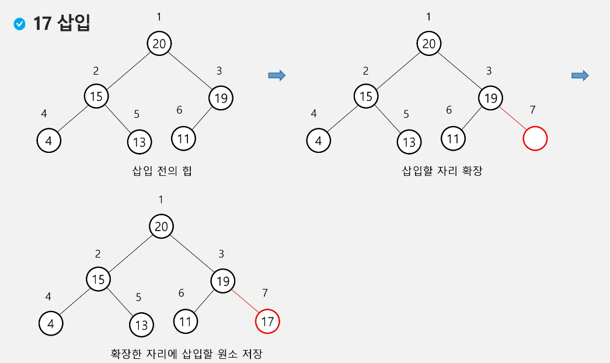
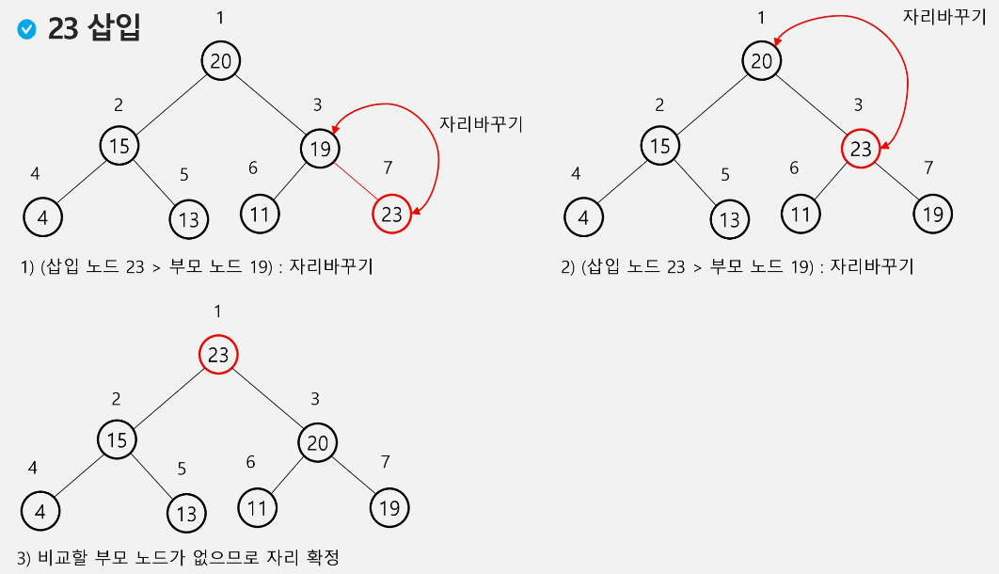

1. 삽입할 자리 확장
2. 확장한 자리에 삽입할 원소 저장
3. 삽입 노드 23 > 부모 노드 19 : 자리 바꾸기
4. 삽입 노드 23 > 부모노드 20 : 자리 바꾸기
5. 비교할 부모 노드가 없으므로 자리 확정

## -2. 삭제 연산(최대 힙)
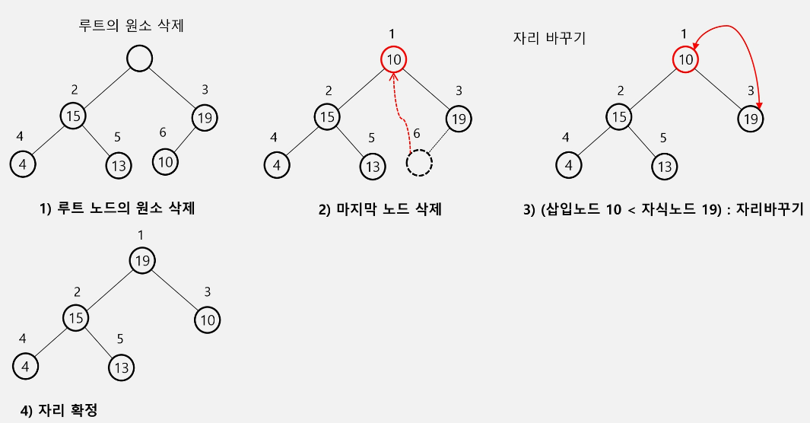

- 힙에서는 루트 노드의 원소만을 삭제할 수있다.
- 루트 노드의 원소를 삭제하여 반환
- 힙의 종류에 따라 최대값 또는 최소 값 구할 수 있음
1. 루트 원소 삭제
2. 마지막 노드를 삭제 및 루트에 저장
3. 삽입 노드 10 < 자식 노드 19 : 자리 바꾸기
    1. 자식노드가 2개라면, 둘 중 큰 값과 비교
4. 비교할 자식 노드 없으므로 자리 확정

```python
#  최대 힙

# 삽입 연산
def enq(n):
    global last
    last += 1           # 마지막 정점 추가
    heap[last] = n      # 마지막 정점에 KEY 추가
    
    c = last
    p = c // 2  # 완전이진트리에서 부모 정점 번호
    while p and heap[p] < heap[c]:  # 부모가 있고, 부모 < 자식인 경우 자리 교환
        heap[p], heap[c] = heap[c], heap[p]
        c = p
        p = c// 2

# 삭제 연산
def deq():
    global last
    
    tmp = heap[1]           # 루트 백업
    heap[1] = heap[last]    # 삭제할 노드의 키를 루트에 복사
    last -= 1               # 마지막 노드 삭제
    p = 1                   # 루트에 옯긴 값을 자식과 비교
    c = p * 2               # 왼쪽 자식
    while c <= last:        # 자식이 하나라도 있으면
        if c+1 <= last and heap[c+1]> heap[c]:     # 오른쪽 자식이 있꼬 오른쪽 자식이 더 크면
            c += 1          # 비교 대상을 오른쪽 자식으로 정함

        if heap[p] < heap[c]:   # 자식이 더 크면 최대 힙 규칙에 어긋나므로
            heap[p], heap[c] = heap[c], heap[p]
            p = c               # 자식을 새로운 부모로
            c = p*2             # 왼쪽 자식 번호를 계산
        else:                   # 부모가 더 크면 중단
            break
    return tmp
            
heap = [0] * 100
last = 0

enq(2)
enq(5)
enq(7)
enq(3)
enq(4)
enq(6)
print(heap)
while last:
    print(deq(), end=' ')
```

# 힙을 이용한 우선순위 큐

- 루트에 항상 최소, 최대값을 가지는 heap을 활용하려 우선순위 큐를 구현할 수 있다.
- 관련링크 : http://pages.cswisc.edu/~vernon/cs367/notes/11,PRIORITY-Q.html
  


