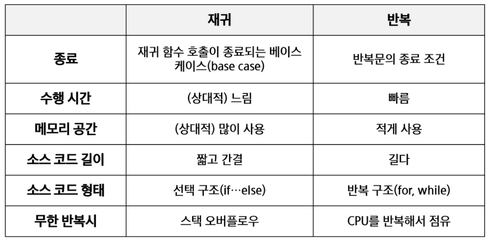
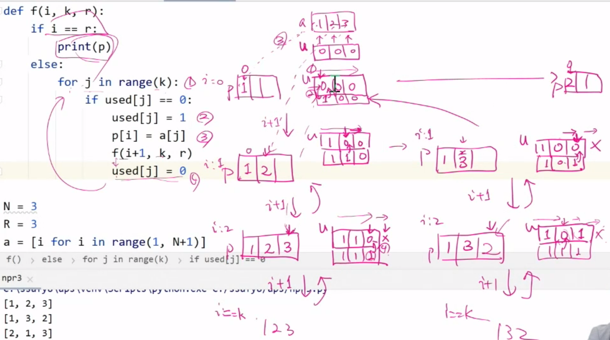
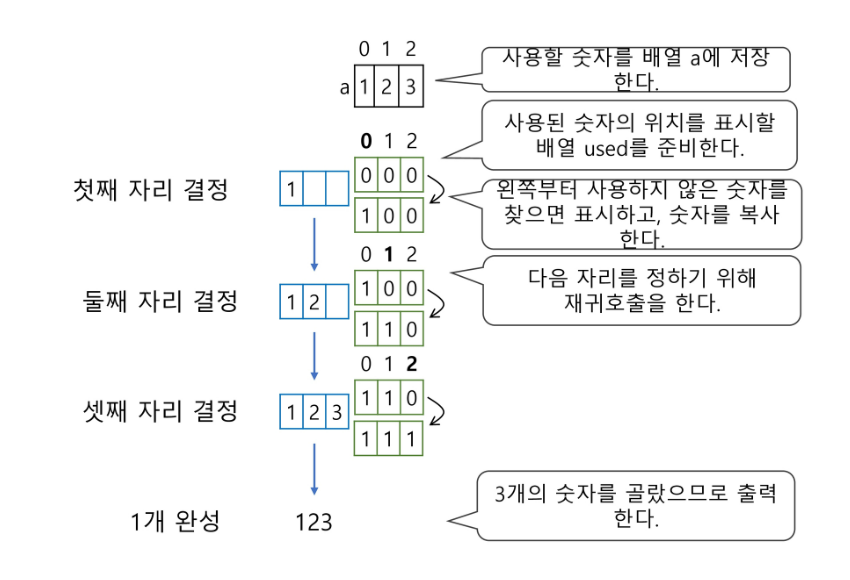
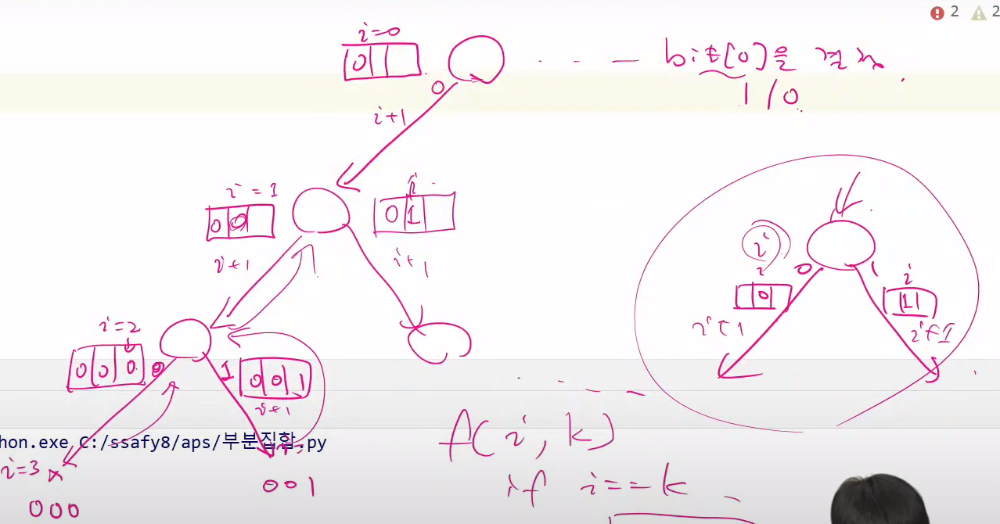
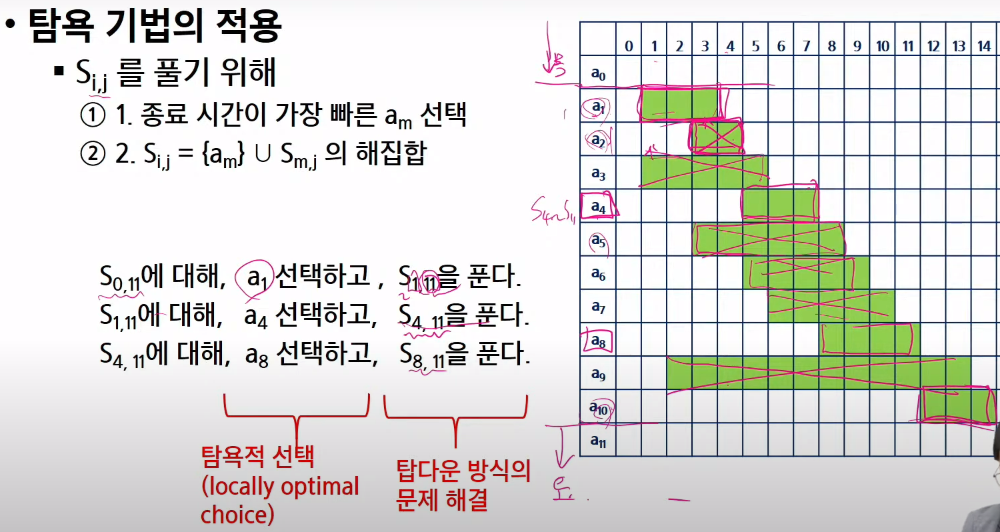
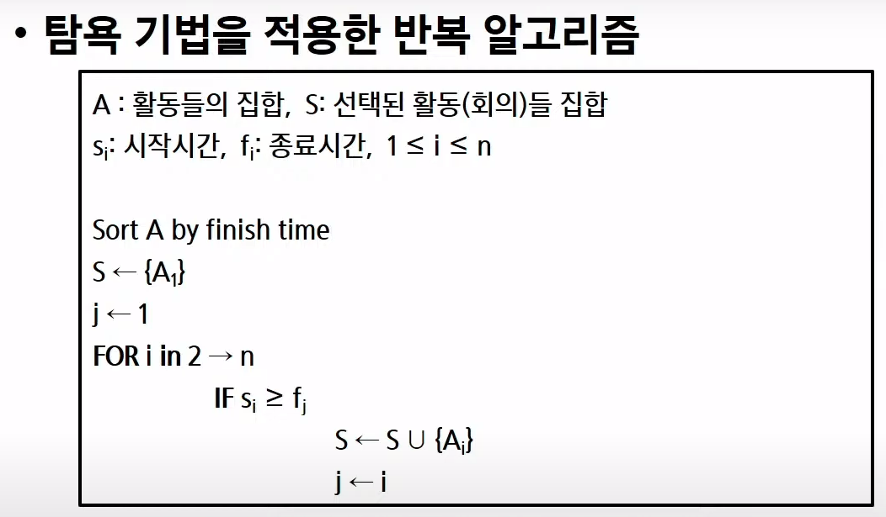
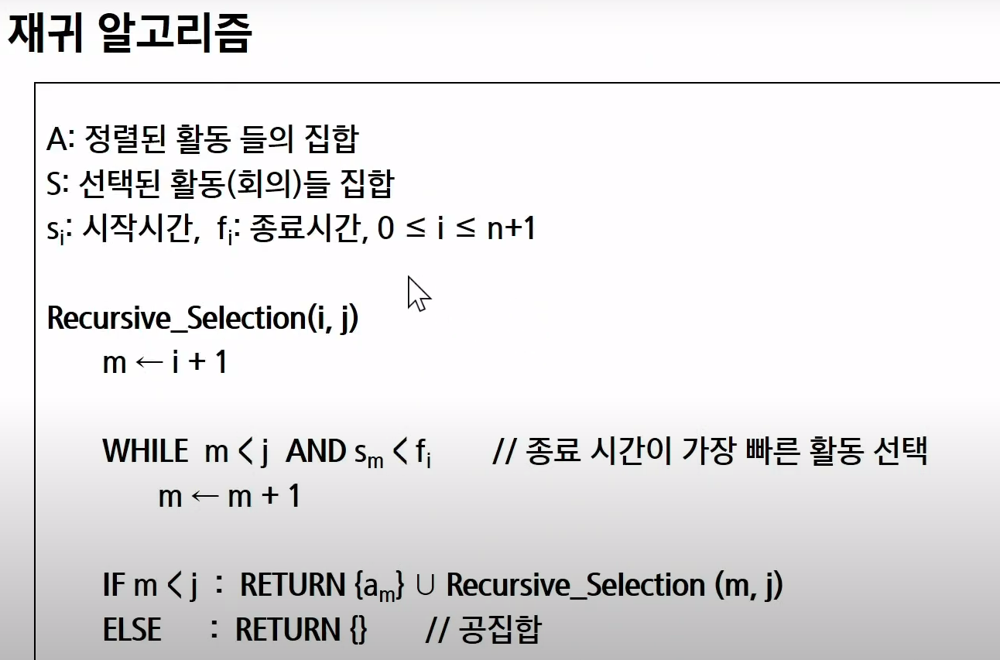
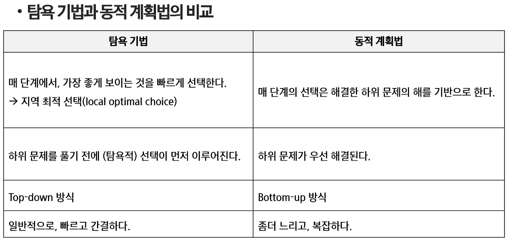
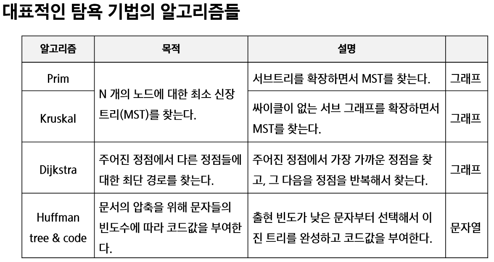

# 10. 완전 검색 & 그리디

## 반복과 재귀
### 재귀함수
- 함수 내부에서 직간접적으로 자기자신을 호출하는 함수
- 기본부분 (basis part), 유도부분 (inductive part)
- 반복적인 스택 사용, 많은 메모리와 연산 필요
- 입력값 n이 커질수록 비효율적
- 추상자료형의 알고리즘은 재귀적 구현이 간단하고 자연스러움
```python
def fact(n):
    if n <= 1:                  # basis part
        return 1
    else:
        return n * fact(n-1)    # Inductive part
```


## 완전 검색
- Brute-force
  - 문제 해결위한 간단하고 쉬운 접근법
  - 상대적으로 빠른 시간에 문제 해결 가능 (빠른속도 x)
  - 문제에 포함된 자료크기가 작다면 유용
- Brute-force 탐색 (sequential search)
  - 완전검색은 조합적 문제 (순열, 조합, 부분집합)에 대한 brute-force 방법
  - 자료들의 리스트에서 키값을 찾기위해 첫번째 자료부터 비교하며 진행
  - 모든 경우의수를 생성하고 테스트
  - 수행속도는 느리지만 해답 찾을 가능성이 많음
  - 이를 기반으로 그리디나 dp 가능

### Baby-gin (완전검색)
- 순열로 모든 경우의 수 생성
  

## 순열
- 서로 다른 것들 중 몇개를 뽑아 한줄로 나열
- 다수의 알고리즘 문제들은 순서화된 요소들의 집합에서 최선의 방법을 찾는 것과 관련
  - ex) TSP (Traveling Salseman Problem)
- N개의 요소들에 대해 n!개의 순열들이 존재
```python
# 단순하게 순열 생성
# {1,2,3} 포함하는 모든 순열

for i1 in range(1,4):
    for i2 in range(1,4):
        if i2 != i1:
            for i3 in range(1,4):
                if i3 != i1 and i3 != i2:
                    print(i1,i2,i3)
```
```python
# 순서변경을 통한 순열 생성

def f(i,k):
    if i == k:  # 인덱스 i == 원소 개수
        print(p)
    else:
        for j in range(i,k):
            p[i], p[k] = p[k], p[i]
            f(i+1, k)
            p[i], p[j] = p[j], p[i] # 원상복구
p = [1,2,3,4,5]
f(0,5)
```




```python
# 사용 표시 이용한 순열 생성
def f(i,k):
    if i == k:
        print(p)
    else:
        for j in range(k):
            if used[j] == 0:    # a[j]가 아직 사용되지 않았으면
                used[j] = 1     # a[j] 사용됨으로  표시
                p[i] = a[j]     # p[i]는 a[j]로 결정
                f(i+1, k)       # p[i+1] 값을 결정하러 이동
                used[j] = 0     # a[j]를 다른 자리에서 쓸 수 있도록 해제
N = 3
a = [i for i in range(1,N+1)]
used = [0] * N
p = [0] * N
f(0,N)


# 10개중에 3개만 골라서 순열 생성

def f(i,k,r):
    if i == r:
        print(p)
    else:
        for j in range(k):
            if used[j] == 0:    # a[j]가 아직 사용되지 않았으면
                used[j] = 1     # a[j] 사용됨으로  표시
                p[i] = a[j]     # p[i]는 a[j]로 결정
                f(i+1, k, r)       # p[i+1] 값을 결정하러 이동
                used[j] = 0     # a[j]를 다른 자리에서 쓸 수 있도록 해제
N = 5
R = 3
a = [i for i in range(1,N+1)]
used = [0] * N
p = [0] * R
f(0,N,R)
```

```python
# SWEA 4881 배열최소합
# NxN 배열에 있는 숫자를 한줄에 하나씩 N개의 숫자를 골라 합이 최소가 되도록 하여 최소 합 출력

def f(i,k):
    global minV

    if i == k:  # 인덱스 i == 원소 개수
        s = 0   # 모든 l행에서 p[l]열을 골랐을 때의 합
        for l in range(k):
            s += arr[l][p[l]]
        if minV > s:
            minV = s
    else:
        for j in range(i,k):
            p[i], p[k] = p[k], p[i]
            f(i+1, k)
            p[i], p[j] = p[j], p[i] # 원상복구


T = int(input())

for tc in range(1,T+1):
    N = int(input())
    arr = [list(map(int, input().split())) for _ in range(N)]
    p = [l for l in range(N)]   # p[l] : l행에서 선택한 열번호
    minV = N*10
    f(0,N)
    print(f'#{tc} {minV}')
```


## 부분집합
- 집합에 포함된 원소들 선택
- 최적의 부분집합 찾기 (ex. 배낭짐싸기 knapsack)
- N개의 원소 포함 집합: 공집합 포함 2^n개


### 반복문 이용
```python
# 단순하게 모든 부분집합 생성

for i1 in range(0,2):
    bit[0] = i1                 # 0번째 원소
    for i2 in range(0,2):
        bit[1] = i2             # 1번째 원소
        for i3 in range(0,2):
            bit[2] = i3         # 2번째 원소
            for i4 in range(0,2):
                bit[3] = i4     # 3번째 원소
                print_array()   # 생성된 부분집합
```

### 바이너리 카운팅을 통한 사전적 순서 (Lexicographic Order)
- 원소 수에 해당하는 N개의 비트열을 이용
- n번째 비트값이 1이면 n번째 원소가 포함됨
```python
arr = [3,6,7,1,5,4]
n = len(arr)

for i in range(0, (1<<n)):  # 1<<n : 부분집합 개수 (공집합 제외하려면 range(1,1<<n))
    for j in range(0,n):    # 원소의 수만큼 비트 비교
        if i & (1<<j):      # i의 j번째 비트가 1이면 j번째 원소 출력
            print('%d'%arr[j], end='')
    print()
```

### 재귀 이용한 부분집합 생성



```python
def f(i,k):
    if i == k:
        for j in range(k):
            if bit[j]:
                print(arr[j], end = ' ')
        print()
    else:
        bit[i] = 0
        f(i+1, k)
        bit[i] = 1
        f(i+1, k)


arr = [3,6,7]
n = len(arr)

bit = [0] * n   # bit[i] : arr[i]가 부분집합의 원소인지 표시
```

## 조합
- 서로 다른 n개의 원소 중 r개를 순서없이 골라낸 것

```python
# N개중 3개를 고르는 조합

N = 10

for i in range(N-2):
    for j in range(i+1, N-1):
        for k in range(j+1, N):
            print(i, j, k)
```

```python
# n개중 r개를 고르는 조합, s는 선택할 수 있는 구간의 시작

def nCr(n, r, s):
    if r == 0:
        print(*comb)
    else:
        for i in range(s, n-r+1):
            comb[r-1] = A[i]
            nCr(n, r-1, i+1)

A = [1,2,3,4,5]
n = len(A)
r = 3
comb = [0] * r
nCr(n, r, 0)
```

## 탐욕 알고리즘 (Greedy)
- 그 순간에 최적이라고 생각되는 것을 선택하여 최종 해답에 도달
- but, 지역적으로는 최적이지만 최종이 최적이라는 보장은 없음
- 한번 선택된 것은 번복 x, 단순하며 제한적인 문제들에 적용
- 최적화문제란 가능한 해들 중 가장 좋은 해를 찾는 것
- Greedy 동작과정
  - 1) 해 선택
  - 2) 실행 가능성 검사
  - 3) 해 검사

### 배낭 짐싸기 (Knapsack)
- 배낭에 담을 수 있는 물건 총 무게 W
- 창고에는 n개 물건들이 있고 각각 무게와 값이 정해짐
- 배낭 수용 가능 무게를 초과하지 않으면서, 값이 최대가 되는 물건들을 담아야함

- S = {item1,item2,...itemn} 물건들의 집합
- wi : itemi의 무게, Pi : itemi의 값
- W : 배낭이 수용가능한 총 무게

- 문제유형
  - 0-1 Knapssack
    - 배낭에 물건을 통째로 담아야함
    - 물건을 쪼갤 수 없음
    - 완전 검색 방법
      - 집합 S에 대한 모든 부분집합구함
      - 총무게가 W 초과하는 부분집합은 버리고, 나머지에서 총 값이 가장 큰 집합 선택
      - 물건 수 증가하면 시간 복잡도 지수적 증가 
    - 탐욕적 방법으로 접근이 어려움!
  - Fractional Knapsack
    - 물건을 부분적으로 담는 것이 허용
    - 물건을 쪼갤 수 있음
    - 값이 큰 물건을 담다가 남은 자리에 나머지 중 하나를 잘라서 담는다! (탐욕적 접근 가능)

### 활동 선택 (Activity-selection problem) 문제
- 시작시간과 종료시간 (si, fi)이 있는 n개의 활동들의 집합 A = {A1, A2, ...An}, 1<=i<=n에서 서로 겹치지 않는 (non-overlapping) 최대갯수의 활동들의 집합 S를 구하는 문제
- 양립 가능한 활동들의 크기가 최대가 되는 S_0,n+1 의 부분집합을 선택하는 문제
  - 종료 시간 순으로 활동들을 정렬
  - S_0,n+1 는 a0의 종료시간부터 an+1 의 시작시간 사이에 포함된 활동들
  - S_0,n+1 = {a1,a2,a3,a4,a5,a6,a7,a8,a9,a10} = S



- 종료 시간이 빠른 순서로 활동들을 정렬
- 첫번째 활동 (A1)을 선택
- 선택한 활동 (A1)의 종료시간보다 빠른 시작 시간을 가지는 활동을 모두 제거
- 남은 활동들에 대해 앞의 과정 반복








## Baby-gin
```python
# 순열 이용

'''
5
123123
124467
333444
444456
123444
'''

def f(i,k):
    if i==k:
        run = 0
        tri = 0
        if card[0] == card[1] and card[1] == card[2]:
            tri += 1
        if card[0] + 1 == card[1] and card[1] + 1 == card[2]:
            run += 1
        if card[3] == card[4] and card[4] == card[5]:
            tri += 1
        if card[3] + 1 == card[4] and card[4] + 1 == card[5]:
            run += 1

        if tri + run == 2:
            return 1
        else:
            return 0
        
        
    else:
        for j in range(i,k):
            card[i], card[j] = card[j], card[i]
            if f(i+1, k) == 1:
                return 1
            card[i], card[j] = card[j], card[i]
        return 0


T = int(input())

for tc in range(1, 1+T):
    card = list(map(int,input()))
    ans = f(0,6)
    
    if ans:
        print(f'#{tc} Baby Gin')
    else:
        print(f'#{tc} Lose')
```
    
```python

T = int(input())
for tc in range(1,1+T):
    card = int(input())
    c = [0] * 12    # triplet 검사위해 2칸 추가

    i = 0
    while i < 6:
        c[card % 10] += 1
        card //= 10
        i += 1
    
    tri = 0
    run = 0
    i = 1
    while i < 10:
        if c[i] >= 3:
            c[i] -= 3
            tri += 1
            continue
        if c[i] >= 1 and c[i+1] >= 1 and c[i+2] >= 1:
            c[i] -= 1
            c[i+1] -= 1
            c[i+2] -= 1
            run += 1
            continue
        i += 1

    if run + tri == 2:
        print(f'#{tc} Baby Gin')
    else:
        print(f'#{tc} Lose')
```

## 연습

### 순열에서 한 자리 값을 고정하고 싶을때

```python
def f(i,k,r):
    if i == r:
        print(p)
    else:
        for j in range(k):
            if used[j] == 0:    # a[j]가 아직 사용되지 않았으면
                used[j] = 1     # a[j] 사용됨으로  표시
                p[i] = a[j]     # p[i]는 a[j]로 결정
                f(i+1, k, r)       # p[i+1] 값을 결정하러 이동
                used[j] = 0     # a[j]를 다른 자리에서 쓸 수 있도록 해제
N = 5
R = 3
a = [i for i in range(1,N+1)]
used = [0] * N
p = [0] * R

p[0] = 2        # 첫번째 원소를 2로 고정
used[1] = 1     # 2는 used[1] 자리에 있으니까 사용 표시

f(1,N,R)        # 1번째 인덱스부터 시작
```

### 배열 최소합

```python
def f(i,k):
    global cnt
    global minV
    
    cnt += 1

    if i == k:  # 인덱스 i == 원소 개수
       
        if minV > s:
            minV = s
    elif s >= minV:     # 끝까지 오기전에, 구해놓은 합이 minV를 넘어버리면 컷
        return

    else:
        for j in range(i,k):
            p[i], p[k] = p[k], p[i]
            f(i+1, k, s + arr[i][p[i]]) # 합을 계산 하면서 돌리는 구조
            p[i], p[j] = p[j], p[i] # 원상복구


T = int(input())

for tc in range(1,T+1):
    N = int(input())
    arr = [list(map(int, input().split())) for _ in range(N)]
    p = [l for l in range(N)]   # p[l] : l행에서 선택한 열번호
    minV = N*10
    f(0,N)
    cnt = 0
    print(f'#{tc} {minV} {cnt}')
```