# 11. 분할 정복 & 백트래킹

## 분할 정복


### 분할 정복 기법
- 분할 (Divide) : 해결할 문제를 여러 개의 작은 부분으로 나눈다
- 정복 (Conquer) : 나눈 작은 문제를 각각 해결한다
- 통합 (Combine) : (필요하다면) 해결된 해답을 모은다

### 병합 정렬 (Merge Sort)
- 여러 개의 정렬된 자료의 집합을 병합하여 한 개의 정렬된 집합으로 만드는 방식
- 자료를 최소 단위 문제까지 나눈 후에 차례대로 정렬하여 최종결과 얻어냄
- top-down
- O(nlogn)
- 병합 정렬 과정
  - 분할 : 전체 자료 집합에 대해 최소 크기 부분집합이 될 때까지 분할 작업 계속
  - 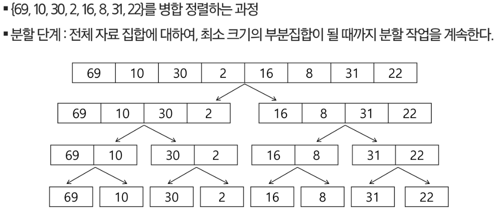
  - 병합 : 2개의 부분 집합을 정렬하면서 하나의 집합으로 병합
  - 
```python
# 쉽게 설명한 병합 정렬
# 입력: 리스트 a
# 출력: 정렬된 새 리스트

def merge_sort(a):
    n = len(a)
    # 종료 조건: 정렬할 리스트의 자료 개수가 한 개 이하이면 정렬할 필요 없음
    if n <= 1:
        return a
    # 그룹을 나누어 각각 병합 정렬을 호출하는 과정
    mid = n // 2  # 중간을 기준으로 두 그룹으로 나눔
    g1 = merge_sort(a[:mid]) # 재귀 호출로 첫 번째 그룹을 정렬
    g2 = merge_sort(a[mid:]) # 재귀 호출로 두 번째 그룹을 정렬
    # 두 그룹을 하나로 병합
    result = []       # 두 그룹을 합쳐 만들 최종 결과
    while g1 and g2:  # 두 그룹에 모두 자료가 남아 있는 동안 반복
        if g1[0] < g2[0]: # 두 그룹의 맨 앞 자료 값을 비교
            # g1의 값이 더 작으면 그 값을 빼내어 결과로 추가
            result.append(g1.pop(0))
        else:
            # g2의 값이 더 작으면 그 값을 빼내어 결과로 추가
            result.append(g2.pop(0))
    # 아직 남아 있는 자료들을 결과에 추가
    # g1과 g2 중 이미 빈 것은 while을 바로 지나감
    while g1:
        result.append(g1.pop(0))
    while g2:
        result.append(g2.pop(0))
    return result

d = [6, 8, 3, 9, 10, 1, 2, 4, 7, 5]
print(merge_sort(d))
```


### 퀵 정렬
- 주어진 배열을 두 개로 분할하고, 각각을 정렬한다.
- 병합 정렬은 그냥 두 부분으로 나누지만, 퀵 정렬은 분할할 때 기준 아이템 (pivot item)을 중심으로 이보다 작은 것은 왼편, 큰 것은 오른편에 위치
- 각 부분 정렬이 끝난 후, 병합 정렬은 "병합"이란 후처리 작업이 필요하나, 퀵 정렬은 필요하지 않음
- O(NlogN)
- Hoare-Partition 알고리즘
  
- 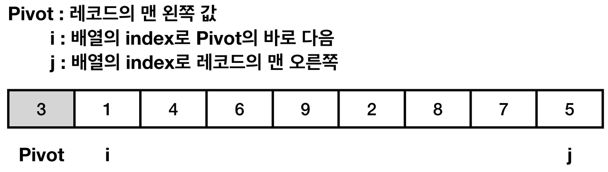
- 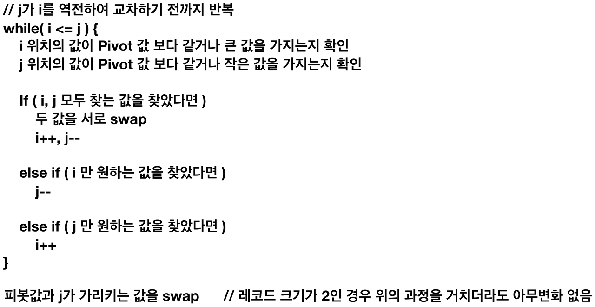
- 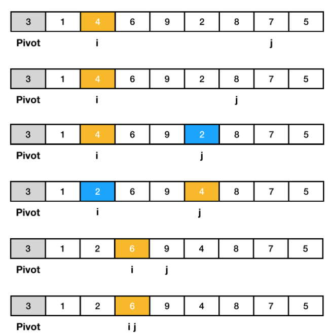
- 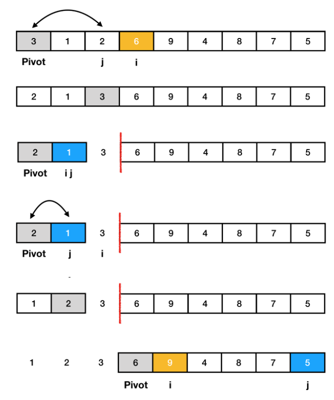
- 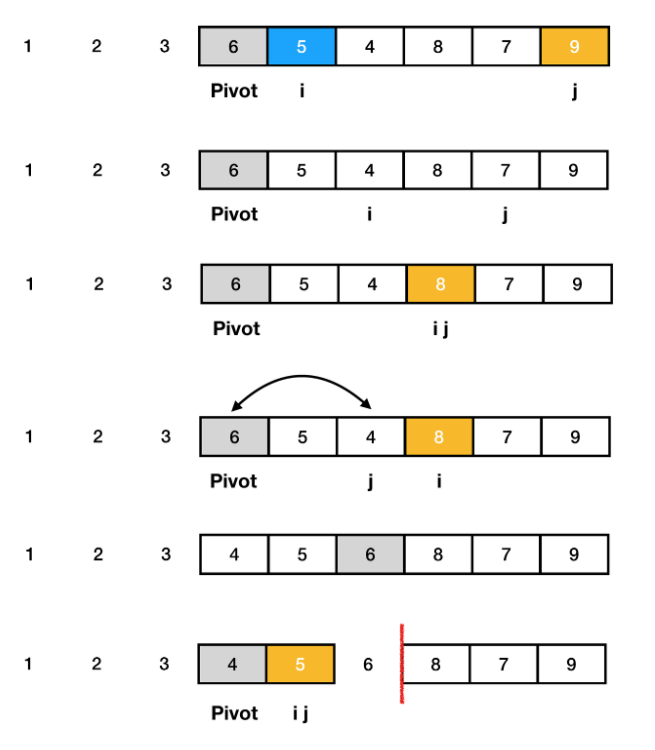
- 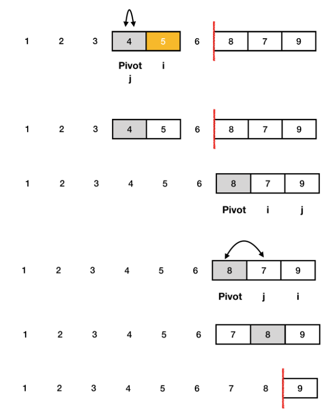


```python
# 퀵 정렬 

# 코드 1 (Hoare-Partition)
def partition(l,r):
    pivot = A[l]
    i, j = l, r
    while i<=j:
        while i<=j and A[i] <= pivot:
            i += 1
        while i<=j and A[j] >= pivot:
            j -= 1
        if i < j:
            A[i], A[j] = A[j], A[i]
    A[l], A[j] = A[j], A[l]
    return j

def qsort(l,r):
    if l < r:
        s = partition(l, r)
        qsort(l, s-1)
        qsort(s+1, r)

A = [7,2,5,3,4,5]
N = len(A)
qsort(0, N-1)
print(A)


# 코드 2 (Hoare-Partition)
array = [5,7,9,0,3,1,6,2,4,8]

def quick_sort(array, start, end):
    if start >= end:    # 원소가 1개인 경우 종료
        return
    pivot = start       # 피벗은 첫번째 원소
    left = start + 1
    right = end
    while left <= right:
        # 피벗보다 큰 데이터를 찾을 때까지 반복
        while left <= end and array[left] <= array[pivot]:
            left += 1
        # 피벗보다 작은 데이터를 찾을 때까지 반복
        while right > start and array[right] >= array[pivot]:
            right -= 1
        if left > right:    # 엇갈렸다면 작은 데이터와 피벗을 교체
            array[right], array[pivot] = array[pivot], array[right]
        else:   # 엇갈리지 않았다면 작은 데이터와 큰 데이터를 교체
            array[left], array[right] = array[right], array[left]
    # 분할 이후 왼쪽 부분과 오른쪽 부분에서 각각 정렬 수행
    quick_sort(array, start, right-1)
    quick_sort(array, right+1, end)

quick_sort(array, 0, len(array)-1)
print(array)


# 코드 3 (Hoare-Partition)
def quick_sort(array):
    # 리스트가 하나 이하의 원소만을 담고있다면 종료
    if len(array) <= 1:
        return array

    pivot = array[0]    # 피벗은 첫번째 원소
    tail = array[1:]    # 피벗을 제외한 리스트

    left_side = [x for x in tail if x <= pivot] # 분할된 왼쪽 부분
    right_side = [x for x in tail if x > pivot] # 분할된 오른쪽 부분

    # 분할 이후 왼쪽 부분과 오른쪽 부분에서 각각 정렬을 수행하고 전체 리스트를 반환
    return quick_sort(left_side) + [pivot] + quick_sort(right_side)

print(quick_sort(array))
```


- Lomuto-Partition 알고리즘

- 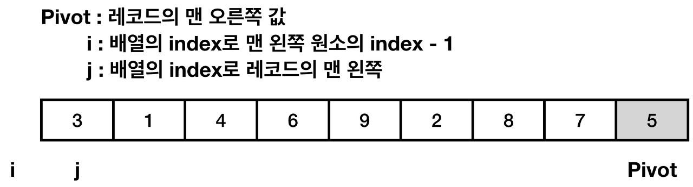
- 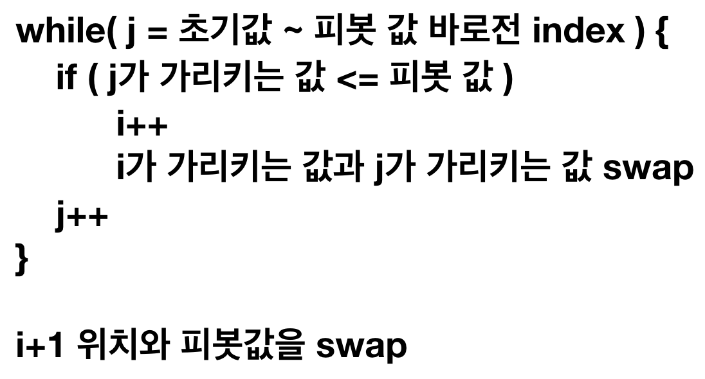
- 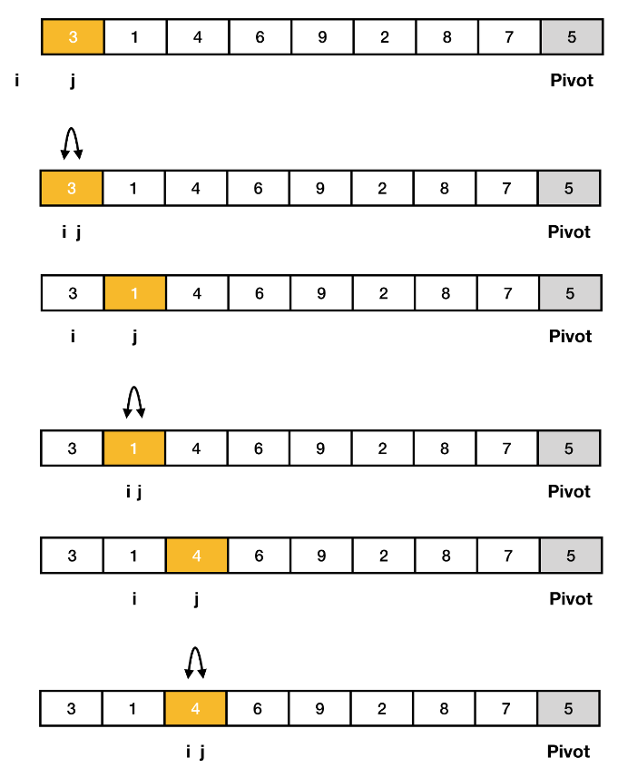
- 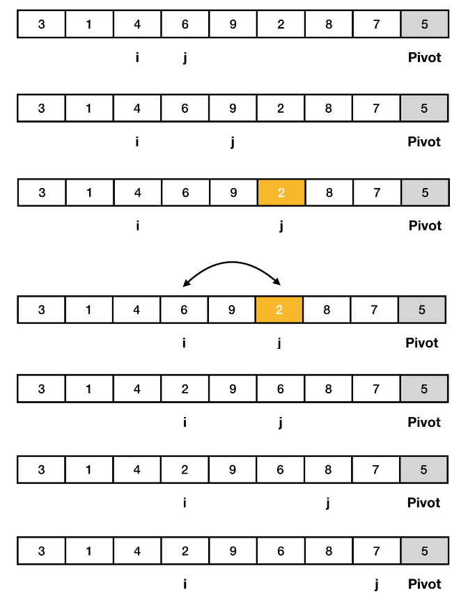
- 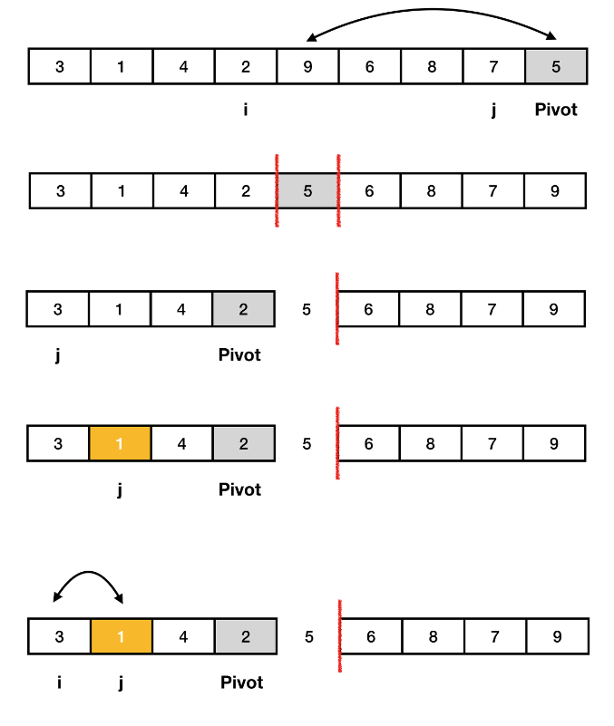

```python
def LomutoPartition(arr, l, r):
      p = arr[r]

      i = l - 1

      for j in range(l, r):
        if arr[j] < p:
          i += 1
          arr[i], arr[j] = arr[j], arr[i]

      arr[i + 1], arr[r] = arr[r], arr[i + 1]
      return i + 1

  def qsort(arr, l, r):
      if l < r:
          s = LomutoPartition(arr, l, r)
          qsort(arr, l, s - 1)
          qsort(arr, s + 1, r)
```


## 이진 검색 (Binary Search)


- 자료의 가운데에 있는 항목의 키 값과 비교하여 다음 검색의 위치를 결정하고 검색을 계속 진행하는 방법
- 목적 키를 찾을 때까지 이진 검색을 순환적으로 반복 수행함으로써 검색 범위를 반으로 줄여가면서 보다 빠르게 검색을 수행
- 이진 검색을 하기 위해서는 자료가 정렬된 상태여야 함
- 검색과정  
  - 1) 자료 중앙에 있는 원소를 고른다
  - 2) 중앙 원소의 값과 찾고자 하는 목표 값을 비교
  - 3) 목표 값이 중앙 원소 값보다 작으면 자료의 왼쪽 반에 대해서 새로 검색, 크다면 오른쪽 반에 대해 새로 검색 수행
  - 4) 찾고자 하는 값을 찾을 때까지 1~3 과정 반복

```python
# 이진 검색
def binary_search(target, data):
    data.sort()
    start = 0
    end = len(data) - 1

    while start <= end:
        mid = (start + end) // 2

        if data[mid] == target:
            return mid # 함수를 끝내버린다.
        elif data[mid] < target:
            start = mid + 1
        else:
            end = mid -1

    return None

# 이진 검색 (재귀)
def binary_search_recursion(target, start, end, data):
    if start > end:
        return None

    mid = (start + end) // 2

    if data[mid] == target:
        return mid
    elif data[mid] > target:
        end = mid - 1
    else:
        start = mid + 1        

    return binary_search_recursion(target, start, end, data)
```


## 분할 정복의 활용
- 병합 정렬은 외부 정렬의 기본이 되는 정렬 알고리즘
- 또한 멀티코어 CPU나 다수의 프로세서에서 정렬 알고리즘을 병렬화하기 위해 병합 정렬 알고리즘이 활용됨
- 퀵 정렬은 매우 큰 입력 데이터에 대해 좋은 성능을 보이는 알고리즘


## 백트래킹
- 여러가지 옵션들이 존재하는 상황에서 한가지 선택
- 선택이 이루어지면 새로운 선택지들의 집합이 생성됨
- 올바른 선택을 계속하면 목표 상태에 도달
- 백트래킹과 DFS의 차이
  - 어떤 노드에서 출발하는 경로가 해결책으로 이어질 것 같지 않으면 더이상 그 경로를 따라가지 않음으로써 시도의 횟수를 줄임 (Prunning 가지치기)
  - DFS가 모든 경로를 추적하는데 비해 백트래킹은 불필요한 경로를 조기에 차단
  - DFS를 하기에는 경우의 수가 너무나 많을때 (N! 가지 경우의 수를 가진 문제) 처리 불가능
  - 백트래킹 알고리즘을 적용하면 일반적으로 경우의 수가 줄어들지만 이 역시 최악의 경우에는 여전히 지수 함수 시간을 요하므로 처리 불가능 

### 백트래킹 개념
- 예시) N-Queen
- 모든 후보를 검사하지 않음
- 백트래킹 기법
  - 어떤 노드의 유망성을 점검 후 유망(promising)하지 않다고 결정되면 그 노드의 부모로 되돌아가(backtracking) 다음 자식 노드로 감
  - 어떤 노드를 방문하였을 때 그 노드를 포함한 경로가 해답이 될 수 없으면 그 노드는 유망하지 않다고 하며, 반대로 해답의 가능성이 있으면 유망하다고 한다.
  - 가지치기 (prunning): 유망하지 않는 노드가 포함되는 경로는 더이상 고려 x
  - 백트래킹 적용
    - 1) 상태 공간 트리의 DFS 실시
    - 2) 각 노드가 유망한지 점검 (조건 추가)
    - 3) 만일 그 노드가 유망하지 않으면, 그 노드의 부모 노드로 돌아가서 검색 계속 진행

```python
# 부분집합의 합
# {1,2,3,4,5,6,7,8,9,10}의 powerset 중 원소의 합이 10인 부분집합을 모두 출력

def f1(i, k, t): # 재귀횟수, 목표횟수, 목표 합
    global cnt
    if i == k:
        s = 0
        for j in range(10):
            if bit[j]:
                s += arr[j]
        if s == t:
            for j in range(10):
                if bit[j]:
                    print(arr[j], end=' ')
            print()
    else:
        bit[i] = 0
        f1(i + 1, k, t)
        bit[i] = 1
        f1(i + 1, k, t)


def f2(i, k, t, s, rs): # 재귀횟수, 목표횟수, 목표 합, 지금까지의 합, 앞으로 더해질 수 있는 남은 원소들의 합
    global cnt
    cnt += 1

    if s > t:
        return
    if t > s + rs:  # 지금까지 합이랑 앞으로 더해질 수 있는 합을 합한게 목표합보다 작으면 의미 없음
        return

    if i == k:  # 모든 원소에 대한 검사가 끝났을 때
        if s == t:
            for j in range(10):
                if bit[j]:
                    print(arr[j], end = ' ')
            print()
    else:
        bit[i] = 0
        f2(i + 1, k, t, s, rs - arr[i])
        bit[i] = 1
        f2(i + 1, k, t, s + arr[i], rs - arr[i])


arr = [i for i in range(1, 11)]
bit = [0] * 10
cnt = 0
# f1(0, 10, 10)
f2(0, 10, 10, 0, sum(arr))
print(cnt)
```

