# 12. 그래프

## 그래프
- 그래프는 아이템 (사물 또는 추상적 개념)들과 이들 사이의 연결관계를 표현
- 정점(Vertex)들의 집합과 이들을 연결하는 간선(Edge)들의 집합으로 구성된 자료 구조
- |V| : 정점의 개수, |E| : 그래프에 포함된 간선의 개수
- |V|개의 정점을 가지는 그래프는 최대 |V|(|V| - 1)/2 간선이 가능
  - ex) 5개 정점이 있는 그래프의 최대 간선 수는 10개 (=5*4/2)
- 선형 자료구조나 트리 자료구조로 표현하기 어려운 N:N 관계를 가지는 원소들을 표현하기에 용이

### 그래프 유형
- 무향 그래프 (Undirected Graph)
- 유향 그래프 (Directed Graph)
- 가중치 그래프 (Weighted Graph)
- 사이클 없는 방향 그래프 (DAG, Directed Acyclic Graph)
- 완전 그래프
  - 정점들에 대해 가능한 모든 간선들을 가진 그래프
- 부분 그래프
  - 원래 그래프에서 일부의 정점이나 간선을 제외한 그래프

### 인접 정점
- 인접 (Adjacency)
  - 두개의 정점에 간선이 존재(연결됨)하면 서로 인접
  - 완전 그래프에 속한 임의의 두 정점들은 모두 인접

### 그래프 경로
- 경로란 간선들을 순서대로 나열한 것
  - 간선들 : (0,2), (2,4), (4,6)
  - 정점들 : 0 - 2 - 4 - 6
- 경로 중 한 정점을 최대한 한번만 지나는 경로 -> 단순 경로
- 시작한 정점에서 끝나는 경로 -> 사이클(Cycle)

### 그래프 표현
- 간선의 정보를 저장하는 방식, 메모리나 성능 고려해서 결정
- 인접 행렬 (Adjacent matrix)
  - |V| x |V| 크기의 2차원 배열을 이용해 간선 정보를 저장
  - 배열의 배열
- 인접 리스트 (Adjacent List)
  - 각 정점마다 해당 정점으로 나가는 간선 정보 저장
- 간선의 배열
  - 간선(시작정점, 끝정점)을 배열에 연속적으로 저장

### 인접 행렬
- 두 정점을 연결하는 간선의 유무를 행렬로 표현
- |V| x |V| 정방 행렬
- 행번호와 열번호는 그래프의 정점
- 두 정점이 인접하면 1, 아니면 0
- 무향 그래프
  - i번째 행의 합 = i번째 열의 합 = Vi의 차수
- 유향 그래프
  - 행 i의 합 = Vi의 진출 차수 (i번 노드에서 갈 수 있는 노드의 개수)
  - 열 i의 합 = Vi의 진입 차수 (i번 노드로 갈 수 있는 다른 노드의 개수)
- 정점이 10000개다? 인접 행렬 사용 x (2차원은 1000x1000 까지만 사용하자!)

### 인접 리스트
- 각 정점에 대한 인접 정점들을 순차적으로 표현
- 하나의 정점에 대한 인접 정점들을 각각 노드로 하는 연결 리스트로 저장
- 무방향 그래프
  - 노드 수 = 간선 수 * 2
  - 각 정점의 노드 수 = 정점의 차수
- 방향 그래프
  - 노드 수 = 간선 수
  - 각 정점의 노드 수 = 정점의 진출 차수

```python
'''
6 8     마지막 정점번호 (0번 부터 시작), E 간선수
0 1 0 2 0 5 0 6 3 4 3 5 6 4 5 4 
'''
V, E = map(int,input().split())

# 인접 행렬
adjM = [[0]*(V+1) for _ in range(V+1)]

# 인접 리스트
adjL = [[] for _ in range(V+1)]

for _ in range(E):
    n1, n2 = arr[i*2], arr[i*2+1]
    adjM[n1][n2] = 1
    adjM[n2][n1] = 1    # 방향이 없는 경우에만

    adjL[n1].append(n2)
    adjL[n2].append(n1)
```

## DFS

### 그래프 순회(탐색)
- 그래프 순회는 비선형구조인 그래프로 표현된 모든 자료(정점)를 빠짐없이 탐색하는 것
- 깊이 우선 탐색 (DFS)
- 너비 우선 탐색 (BFS)

### DFS (깊이 우선 탐색)
- 시작 정점의 한 방향으로 갈 수 있는 경로가 있는 곳까지 깊이 탐색해 가다가 더이상 갈 곳이 없게 되면, 가장 마지막에 만났던 갈림길 간선이 있는 정점으로 되돌아와서 다른 방향의 정점으로 탐색을 계속 반복하여 결국 모든 정점을 방문하는 순회 방법
- 가장 마지막에 만났던 갈림길의 정점으로 되돌아가서 다시 깊이 우선 탐색을 반복해야 하므로 후입선출 구조의 스택 사용

### 스택
- 물건을 쌓아 올리듯 자료를 쌓아 올린 형태의 자료구조
- 선형구조 : 자료 간의 관계가 1대1의 관계를 갖음
  - 비선형구조 : 자료 간 관계가 1대N의 관계를 갖음(ex. 트리)
- 마지막에 삽입한 자료를 가장 먼저 꺼냄
  - 후입 선출(LIFO)

### 스택의 구현
- 스택을 구현하기 위해 필요한 저장소와 연산
  - 자료를 선형으로 저장할 저장소
  - C언어에서는 배열 사용 가능
  - 저장소 자체를 스택이라 부르기도 함
  - 스택에서 마지막 삽입된 원소 위치를 top이라 함
  - 연산
    - push : 삽입
    - pop : 꺼냄
    - isEmpty : 스택이 공백인지 아닌지
    - peek : 스택 top에 있는 원소 반환


### SWEA 5521. 상원이의 생일파티 (DFS/BFS)


---

## 서로소 집합들
### 서로소 집합 (Disjoint-sets)
- 서로소 또는 상호배타 집합들은 서로 중복 포함된 원소가 없는 집합들
- 다시말해 교집합이 없음
- 집합에 속한 하나의 특정 멤버를 통해 각 집합들을 구분
- 이를 대표자 (representative)라고 함
- 상호 배타 집합을 표현하는 방법
  - 연결 리스트
  - 트리
- 상호 배타 집합 연산
  - **Make-Set(x)** : **x가 대표자인 집합을 만들기**
  - **Find-Set(x)** : **x가 속한 집합의 대표자 반환**
  - **Union(x,y)**
    - 1) **x의 대표 원소를 찾고**
    - 2) **y의 대표 원소를 찾아서**
    - 3) **y의 대표원소를 x의 대표원소로 교체**

### 상호 배타 집합 표현 - 연결리스트
- 같은 집합의 원소들은 하나의 연결리스트로 관리
- 연결리스트 맨 앞의 원소를 집합의 대표 원소로 삼는다
- 각 원소는 집합의 대표원소를 가리키는 링크를 갖는다

### 상호 배타 집합 표현 - 트리
- 하나의 집합(a disjoint set)을 하나의 트리로 표현
- 자식 노드가 부모 노드를 가리키며 루트 노드가 대표자가 됨


### 상호 배타 집합에 대한 연산
- Make-Set(x) : 유일한 멤버 x를 포함하는 새로운 집합을 생성하는 연산
- Find-Set(x) : x를 포함하는 집합을 찾는 연산
- Union(x,y) : x와 y를 포함하는 두 집합을 통합하는 연산

---

## 최소 신장 트리 (MST)
- 그래프에서 최소 비용 문제
  - 1) 모든 정점을 연결하는 간선들의 가중치의 합이 최소가 되는 트리 (MST)
  - 2) 두 정점 사이의 최소 비용의 경로 찾기 (Dijkstra)


### 신장 트리 (Spanning Tree)
- 그래프 내의 **모든 정점을 포함**하는 트리
- Spanning Tree = 신장트리 = 스패닝 트리
- 그래프의 **최소 연결 부분 그래프**
  - 최소 연결 = 간선 수가 가장 적다
  - n개의 정점을 가지는 그래프의 **최소 간선 수는 (n-1)개**이고, (n-1)개의 간선으로 연결되어 있으면 필연적으로 트리형태가 되고 이것이 바로 Spanning Tree가 됨
- 즉 그래프에서 일부 간선을 선택해서 만든 트리
- n개의 정점으로 이루어진 **무방향 그래프**에서 n개의 정점과 n-1개의 간선으로 이루어진 트리

### Spanning Tree 특징
- DFS, BFS 이용하여 그래프에서 신장 트리 찾을 수 있다
  - 탐색 도중에 사용된 간선만 모으면 만들 수 있다
- 하나의 그래프에는 많은 신장 트리가 존재할 수 있다
- Spanning Tree는 트리의 특수 형태이므로 **모든 정점들이 연결**되어있어야하고, **사이클을 포함해선 안된다**
- 따라서 Spanning Tree는 그래프에 있는 **n개의 정점을 정확히 (n-1)개의 간선으로 연결**한다

### 최소 신장 트리 (Minimum Spanning Tree)
- Spanning Tree중, 사용된 간선들의 가중치 합이 최소인 트리
- MST = Minimum Spanning Tree = 최소 신장 트리
- 각 간선의 가중치가 동일하지 않을때, 단순히 가장 적은 간선을 사용한다고 해서 최소 비용이 얻어지는 건 아니다
- MST는 간선에 가중치를 고려하여 최소비용의 Spanning Tree를 선택하는 것을 말한다
- 즉, 네트워크에 있는 모든 정점들을 **가장 적은 수의 간선과 비용**으로 연결하는 것
- **무방향 가중치 그래프**에서 신장 트리를 구성하는 간선들의 가중치의 합이 최소인 신장 트리

### MST 특징
- **간선의 가중치의 합이 최소**여야함
- **n개의 정점**을 가지는 그래프에 대해 **반드시 (n-1)개의 간선**만을 사용해야함
- **사이클이 포함되면 안됨**

### MST 표현
- 그래프
- 간선들의 배열
- 인접 리스트
- 부모 자식 관계와 가중치에 대한 배열

```python
V, E = map(int,input().split())

# 인접 행렬
adjM = [[0]*(V+1) for _ in range(V+1)]

# 인접 리스트
adjL = [[] for _ in range(V+1)]

for _ in range(E):
    u, v, w = map(int,input().split())
    adjM[u][v] = w
    adjM[v][u] = w    # 가중치가 있는 무방향 그래프

    adjL[u].append((v,w))
    adjL[v].append((u,w))
```

### Prim MST 알고리즘
- 정점 선택 기반 알고리즘
- 하나의 정점에서 연결된 간선들 중에 하나씩 선택하면서 MST를 만들어 가는 방식 (**단계적으로 확장**)
  - 1) **임의 정점을 하나 선택**해서 시작
  - 2) 선택한 정점과 **인접하는 정점**들 중의 **최소비용의 간선이 존재하는 정점** (가장 낮은 가중치)을 선택 (**사이클이 만들어지면 안됨!**)
  - 3) 모든 정점이 선택될 때 까지 ((N-1)개의 간선을 가질 때 까지) 1, 2 과정을 반복
- 서로소인 2개의 집합(2 disjoint sets) 정보를 유지
  - 트리 정점들 (tree vertices) - MST를 만들기 위해 선택된 정점들
  - 비트리 정점들 (nontree vertices) - 선택 되지 않은 정점들

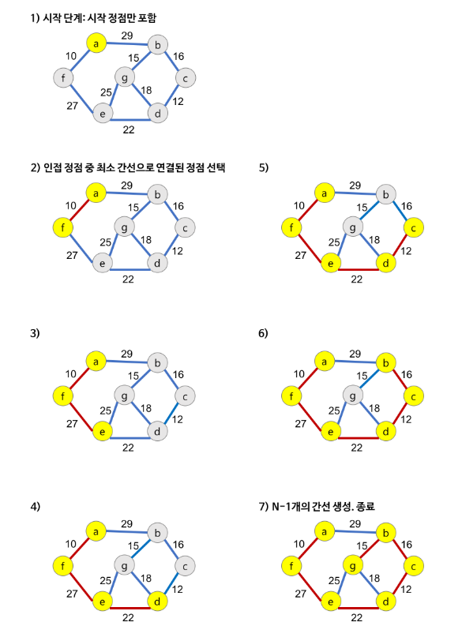
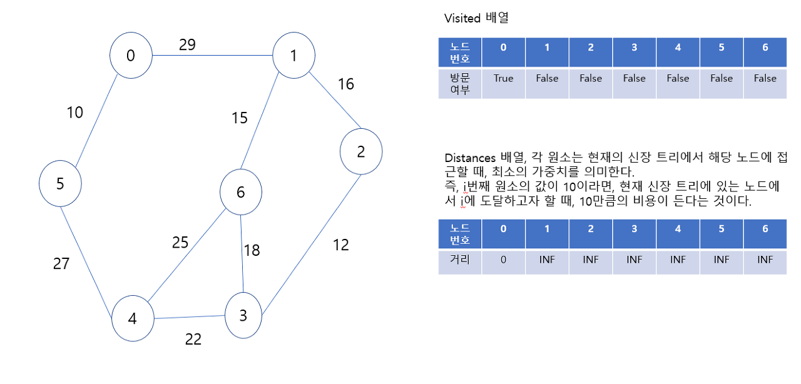
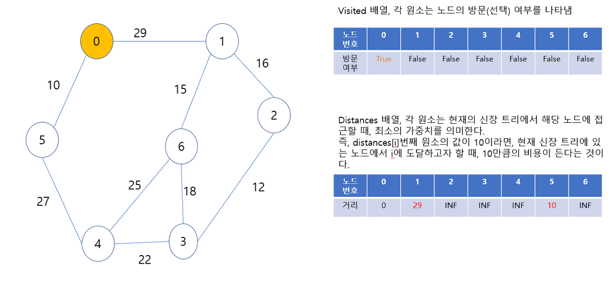
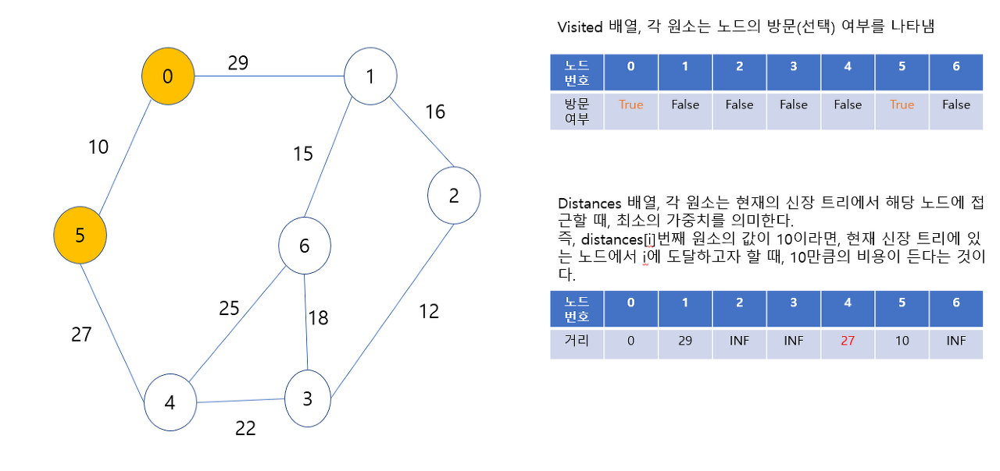
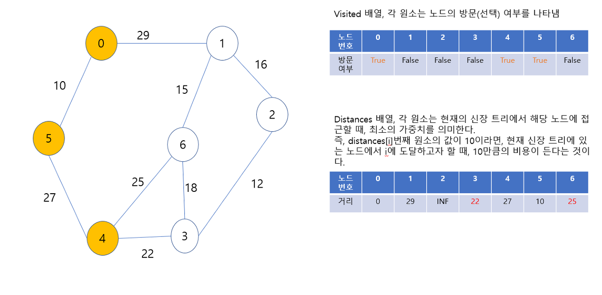
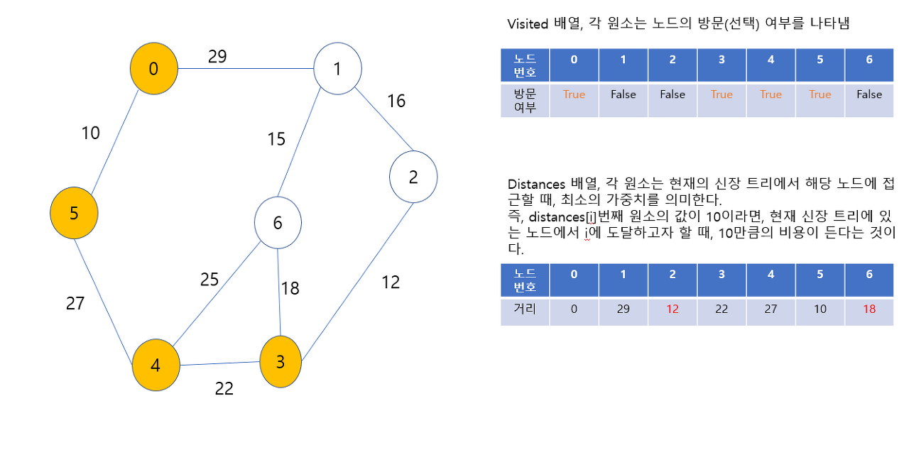
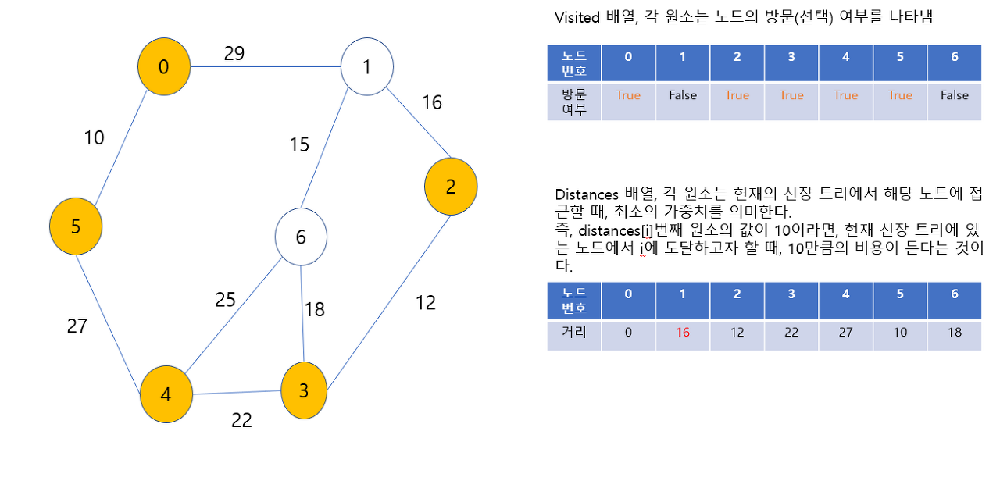
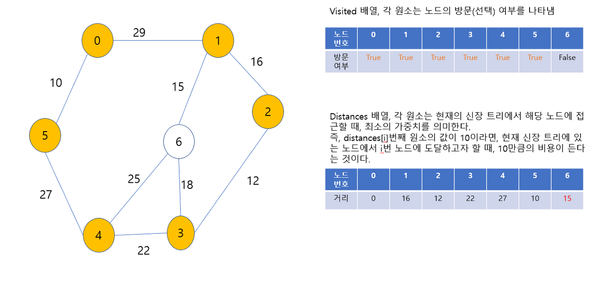
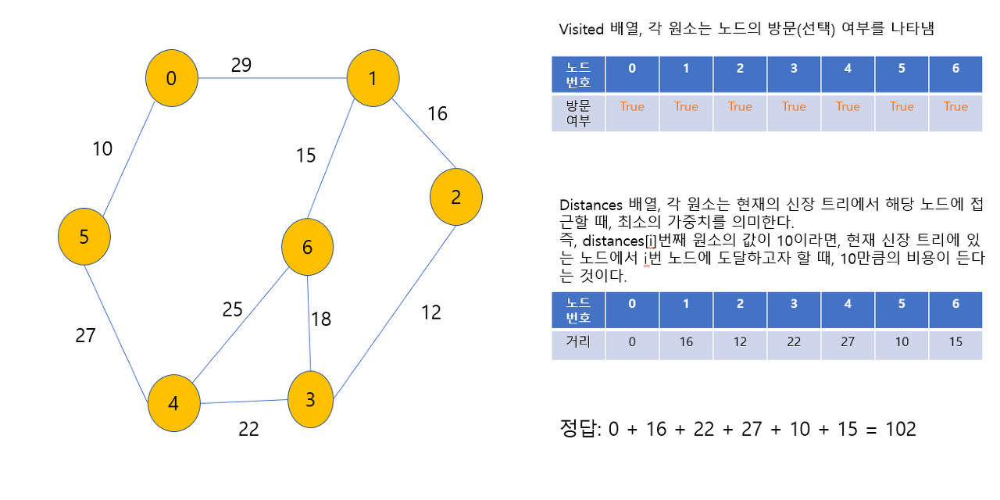


```python
'''
6 11
0 1 32
0 2 31
0 5 60
0 6 51
1 2 21
2 4 46
2 6 25
3 4 34
3 5 18
4 5 40
4 6 51
'''

def prim1(r, V):
    MST = [0]*(V+1)     # MST 포함여부
    key = [10000]*(V+1) # 가중치의 최대값 이상으로 초기화. key[v]는 v가 MST에 속한 정점과 연결될 때의 가중치
    key[r] = 0          # 시작정점의 key
    for _ in range(V):  # V+1개의 정점 중 V개를 선택
        # MST에 포함되지 않은 정점 중(MST[u]==0), key가 최소인 u 찾기
        u = 0
        minV = 10000
        for i in range(V+1):
            if MST[i]==0 and key[i]<minV:
                u = i
                minV = key[i]
        MST[u] = 1                  # 정점 u를 MST에 추가
        # u에 인접인 v에 대해, MST에 포함되지 않은 정점이면
        for v in range(V+1):
            if MST[v]==0 and adjM[u][v]>0:
                key[v] = min(key[v], adjM[u][v])     # u를 통해 MST에 포함되는 비용과 기존 비용을 비교, 갱신
    return sum(key)         # MST 가중치의 합

def prim2(r, V):
    MST = [0]*(V+1)     # MST 포함여부
    MST[r] = 1
    s = 0
    for _ in range(V):
        u = 0
        minV = 10000
        for i in range(V+1):    # MST에 포함된 정점i와 인접한 정점j 중 MST에 포함되지 않고 가중치가 최소인 정점 u찾기
            if MST[i]==1:
                for j in range(V+1):
                    if adjM[i][j]>0 and MST[j]==0 and minV>adjM[i][j]:
                        u = j
                        minV = adjM[i][j]
        s += minV
        MST[u] = 1
    return s

V, E = map(int, input().split())
adjM = [[0]*(V+1) for _ in range(V+1)]
adjL = [[] for _ in range(V+1)]
for _ in range(E):
    u, v, w = map(int, input().split())
    adjM[u][v] = w
    adjM[v][u] = w  # 가중치가 있는 무방향 그래프
    adjL[u].append((v, w))
    adjL[v].append((u, w))
print(adjM)
print(adjL)
#print(prim1(0, V))
print(prim2(0, V))
```


### Kruskal MST 알고리즘
- 간선을 하나씩 선택해서 MST를 찾는 알고리즘
- 1) 최초, **모든 간선을 가중치에 따라 오름차순으로 정렬**
- 2) **가중치가 가장 낮은 간선부터 선택**하면서 트리를 증가시킴
  - **사이클이 존재하면 다음으로 가중치가 낮은 간선 선택**
- 3) n-1개의 간선이 선택될 때까지 2번 과정 반복

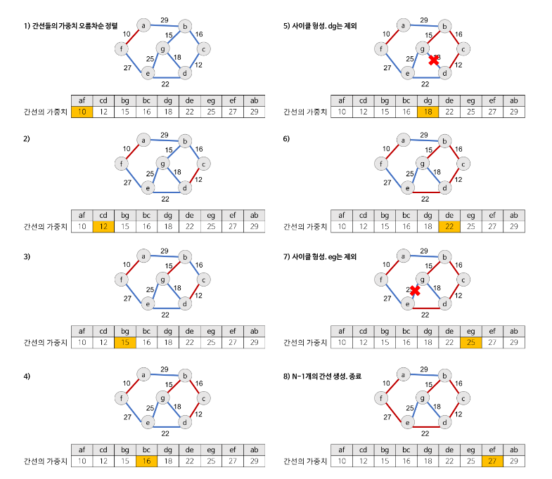

```python
'''
6 11
0 1 32
0 2 31
0 5 60
0 6 51
1 2 21
2 4 46
2 6 25
3 4 34
3 5 18
4 5 40
4 6 51
'''

import sys
sys.stdin = open('input.txt', 'r')

def find_set(x):
    while x != rep[x]:  # 대표원소가 아니면
        x = rep[x]   # x가 가리키는 정점으로 이동
    return x

V, E = map(int, input().split())
edge = []
for _ in range(E):
    u, v, w = map(int, input().split())
    edge.append((w,u,v))
edge.sort()  # 가중치 기준 오름차순 정렬
rep = [i for i in range(V+1)]  # 대표원소 초기화
# N개의 정점이 있으면 사이클이 생기지 않도록 N-1개의 간선을 선택
# MST에 포함된 간선의 가중치의 합 구하기
N = V+1  # 0~V번 까지의 정점
cnt = 0
total = 0  # 가중치의 합
for w, u, v in edge:  # N-1개의 간선 선택 루프
    if find_set(u) != find_set(v):  # 사이클을 형성하지 않으면 선택
        cnt += 1
        total += w  # 가중치의 합
        # union(u, v) 와 동일
        rep[find_set(v)] = find_set(u)  # v의 대표원소를 u의 대표원소로 바꿈
        if cnt == N-1:
            break
print(total)
```

---

## 최단 경로
- 최단경로란
  - 간선의 가중치가 있는 그래프에서 두 정점 사이의 경로들 중에 간선의 가중치의 합이 최소인 경로
- 하나의 시작 정점에서 끝 정점까지의 최단 경로
  - 다익스트라 (dijkstra) 알고리즘
    - 음의 가중치를 허용하지 않음
  - 벨만-포드 (Bellman-Ford) 알고리즘
    - 음의 가중치 허용
- 모든 정점들에 대한 최단 경로
  - 플로이드-워샬 (Floyd-Warshall) 알고리즘

### Dijkstra 알고리즘
- 시작 정점에서 거리가 최소인 정점을 선택해 나가면서 최단 경로를 구하는 방식
- 시작정점(s)에서 끝정점(t)까지의 최단 경로에 정점 x가 존재
- 이때 최단경로는 s에서 x까지의 최단 경로와 x에서 t까지의 최단경로로 구성됨
- 탐욕 기법을 사용한 알고리즘으로 MST의 프림 알고리즘과 유사

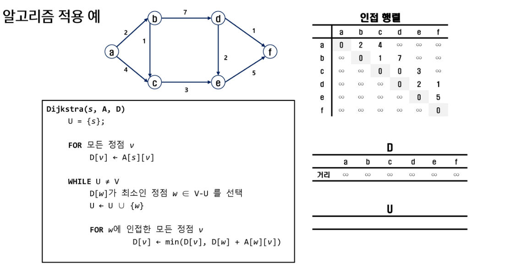
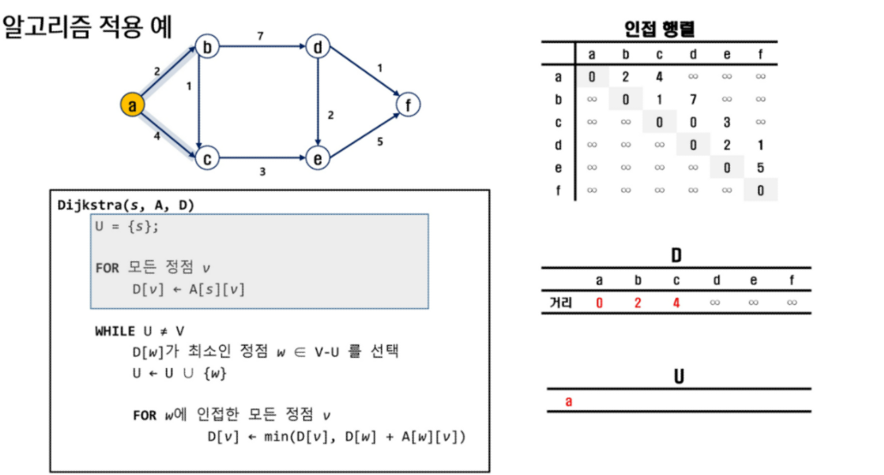
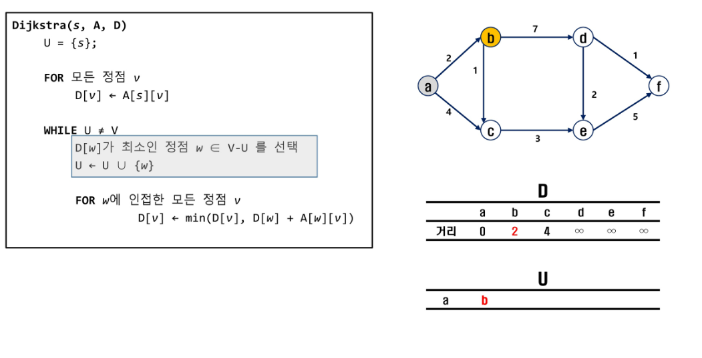
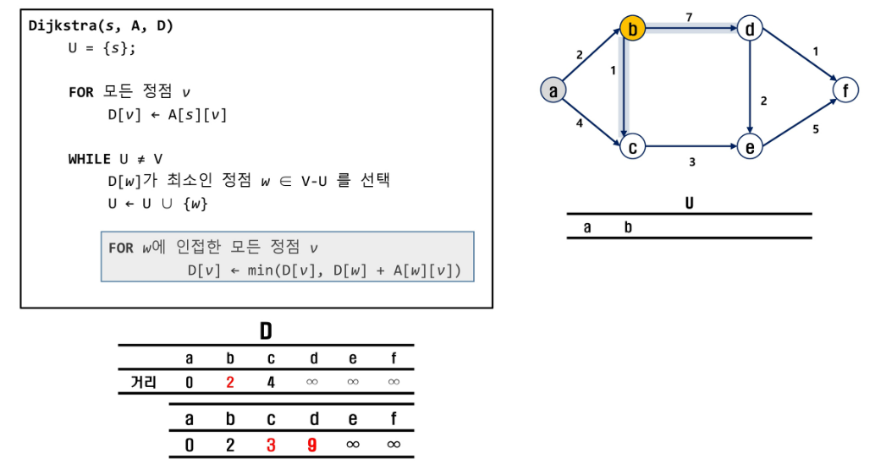
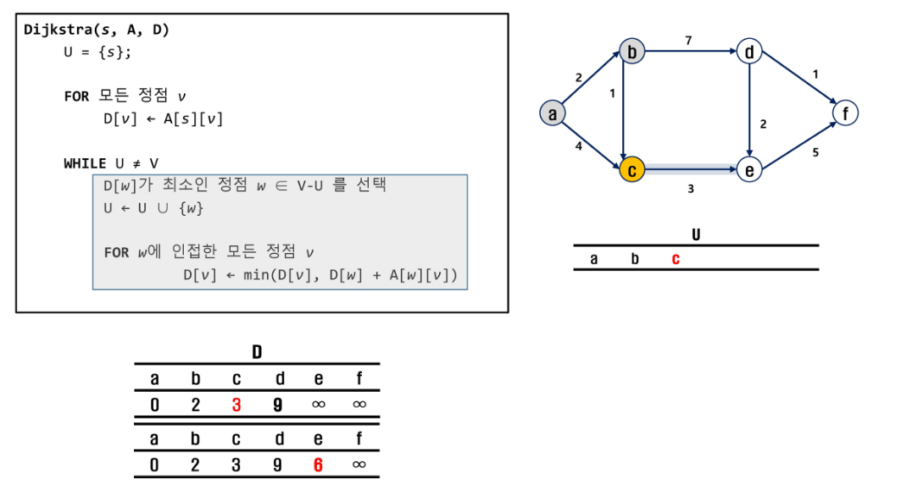
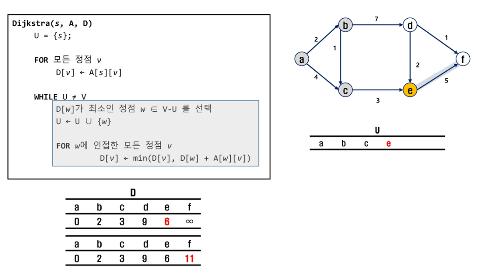
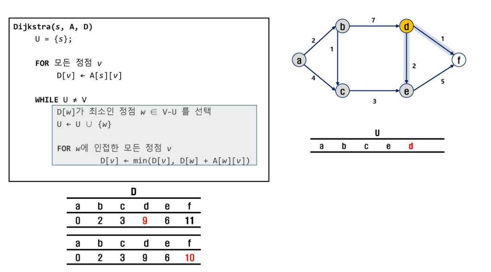
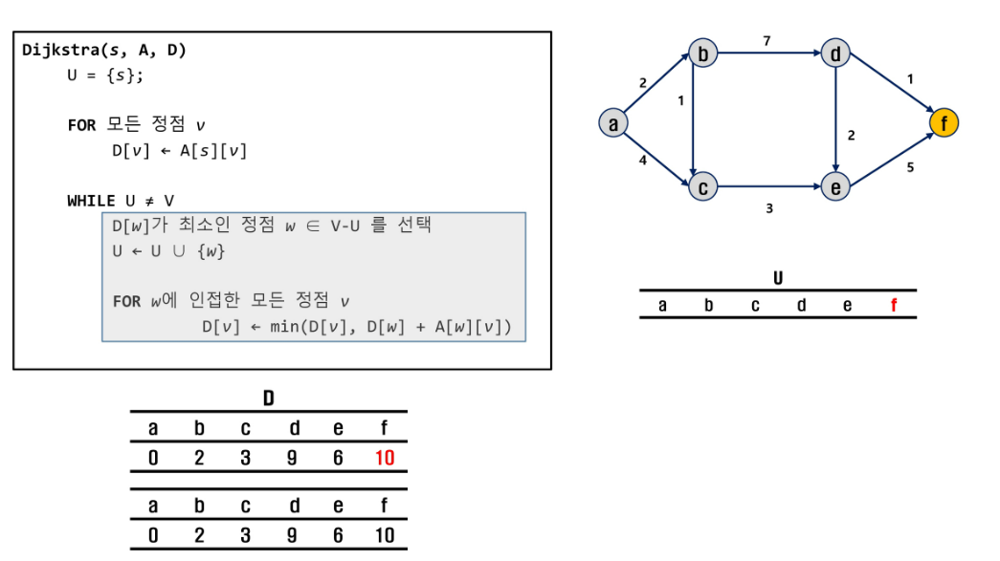
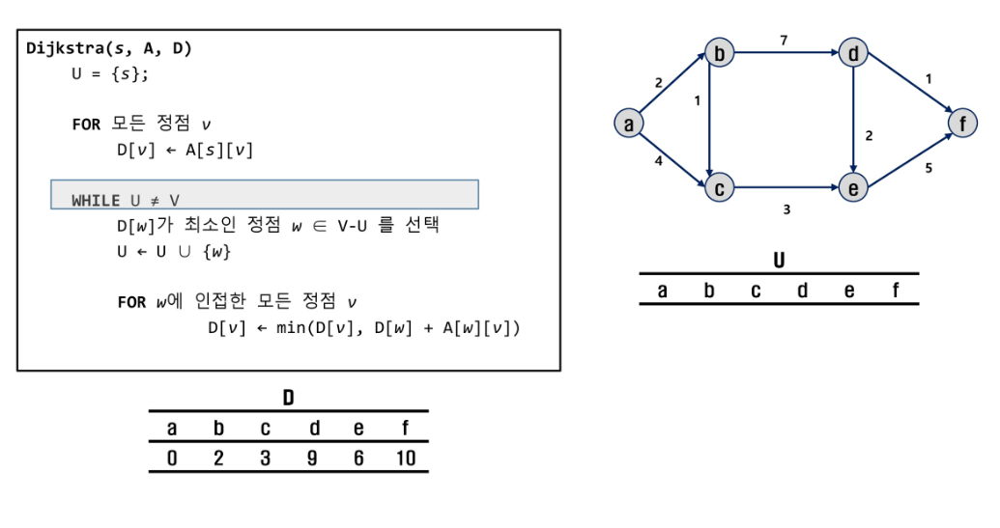

```python
'''
5 11
0 1 3
0 2 5
1 2 2
1 3 6
2 1 1
2 3 4
2 4 6
3 4 2
3 5 3
4 0 3
4 5 6
'''

# dijkstra 1
import sys
sys.stdin = open('input.txt', 'r')

def dijkstra(s, V): # 시작정점 s, 마지막 정점 V
    U = [0] * (V+1)
    U[s] = 1
    for v in range(V+1):
        D[v] = adj[s][v]  # 시작 점에서 갈 수 있는 값 

    #while len(U) != V:
    for _ in range(V):  # V = 정점개수-1과 같으므로..남은 정점개수와 같음
        minV = INF
        w = 0
        for i in range(V+1):
            if U[i]==0 and minV>D[i]:
                minV = D[i]
                w = i
        U[w] = 1  # 선택된 집합에 포함

        for v in range(V+1):   # 정점 v가
            if 0 < adj[w][v] < INF:  # w에 인접이면 , 시작정점에서 w를 거쳐 v로 가능 비용과
                D[v] = min(D[v], D[w]+adj[w][v])  # 시작정점에서 v로 가는 기존 비용을 비교 후 선택


INF = 10000
V, E = map(int, input().split())
adj = [[INF]*(V+1) for _ in range(V+1)]
for i in range(V+1):
    adj[i][i] = 0
for _ in range(E):
    u, v, w = map(int, input().split())
    adj[u][v] = w  # 방향성 그래프

D = [0]*(V+1)
dijkstra(0, V)
print(D)  # 시작 정점 0에서 각 정점으로 가는 최소 비용


# dijkstra 2

import sys
sys.stdin = open('input.txt', 'r')


def digkstra():
    while Q:
        print(Q, visited)
        now, dist = Q.pop(0)   # 정점 정보와 거리 

        if D[now] < dist:      # 주어진 거리보다 저장된 거리가 더 작으면 skip
            continue

        visited[now] = True
        # 현재 정점의 인접 정점을 선택하여 그 인접 정점을 확인
        for v in range(len(adj_list[now])):
            n_v, n_dist = adj_list[now][v]   # 연결된 정점과 그 거리
            if not visited[n_v]:
                # 현재까지의 거리와 연결된 정점의 거리를 더한 값이 
                # 저장된 값보다 작다면 갱신
                if dist + n_dist < D[n_v]:
                    D[n_v] = dist + n_dist
                    Q.append((n_v, D[n_v]))   # 다음 정점과 갱신된 거리를 Queue에 등록


INF = 987654321
V, E = map(int, input().split())
# 인접 리스트
adj_list = [[] for _ in range(V+1)]

for _ in range(E):
    s, v, d = map(int, input().split())
    adj_list[s].append((v, d))

D = [INF] * (V+1)
D[0] = 0
for v, d in adj_list[0]:   # 시작 정점에서 인접한 정점 거리 저장
    D[v] = d

visited = [False] * (V+1)
visited[0] = True

Q = [*adj_list[0]]  # Queue 에 시작점으로 부터 이어진 값을 넣는다.
digkstra()
print(D)


# visited 를 지우면 0 까지 체크되면서 되돌아 오는 거리를 구할 수 있음
```

### SWEA 1795. 인수의 생일 파티