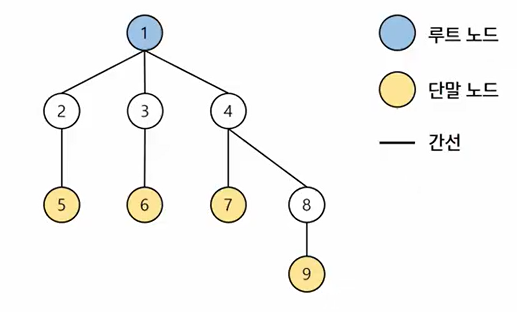
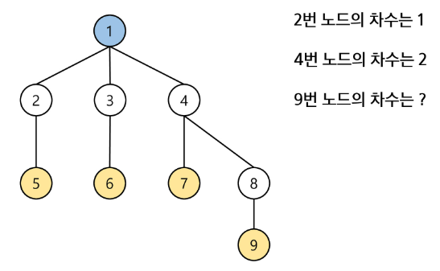
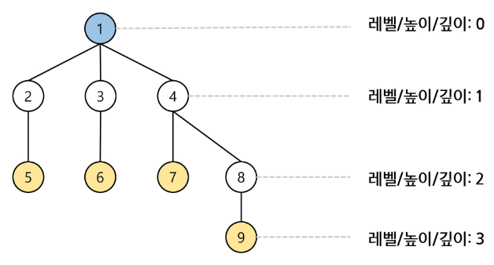
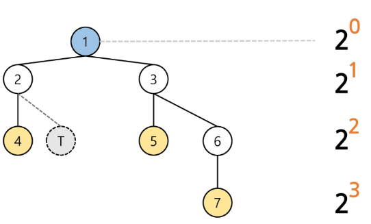
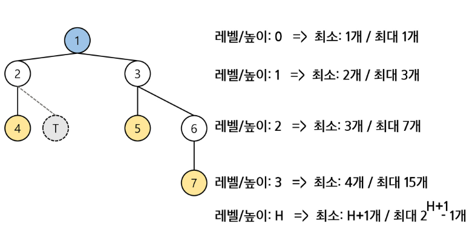
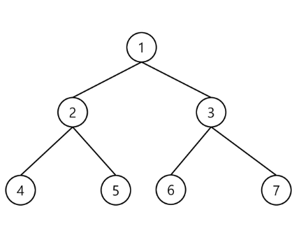
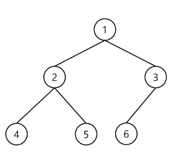

# 13. Tree 심화

## Tree
- 노드 간 계층과 1:N 관계를 갖는 자료구조

### Degree (차수)

- 노드에 연결된 자식 노드의 개수

### Level, Height, Depth (레벨 == 높이 == 깊이)

- 일반적으로 루트 노드부터 가장 높은 레벨 (루트로부터의 거리)

### Binary Tree (이진트리)
- 모든 노드가 최대 2개의 자식 노드를 가질 수 있는 트리
- 특정 레벨에서의 최대 노드의 개수?

  - 2^0 2^1, 2^2, 2^3, 2^4 ...

- 높이가 H일때, Binary Tree가 가질 수 있는 노드의 수?

  - 최소: H+1 / 최대: 2^(H+1) -1

### Full Binary Tree (포화 이진 트리)

- 모든 노드가 2개의 노드를 가지고 있는 트리

### Complete Binary Tree (완전 이진 트리)

- 높이가 H이고 노드의 개수가 N일때, 빈 자리 없이 채워지는 트리
- 노드의 개수 <= N < 2^(H+1)-1

### Skewed Binary Tree (편향 이진 트리)
- 높이가 H일때, 최소 노드 개수를 가지면서 한쪽 방향으로 노드를 가지는 트리

### Traversal (순회)
- 트리의 각 노드를 중복되지 않게 전부 방문하는 것
- 비 선형구조로, 선형구조처럼 선후 연결 관계를 알 수 없다

### 전위 순회
- 현재 노드 n을 방문 처리 -> V
  - L//2 , R//2
- 현재 노드 n의 왼쪽 서브 트리로 이동 -> L
  - V * 2 
- 현재 노드 n의 오른쪽 서브 트리로 이동 -> R
  - V * 2 + 1

---

## Segment Tree

- 어떤 데이터가 존재할 때, 특정 구간의 결과값을 구하는데 사용하는 자료구조
- 누적합은 값의 수정에 취약함
- Segment Tree는 Binary Tree(이진트리) 구조를 갖고 있음
- 적절한 조합을 찾아야함
- 

