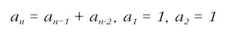
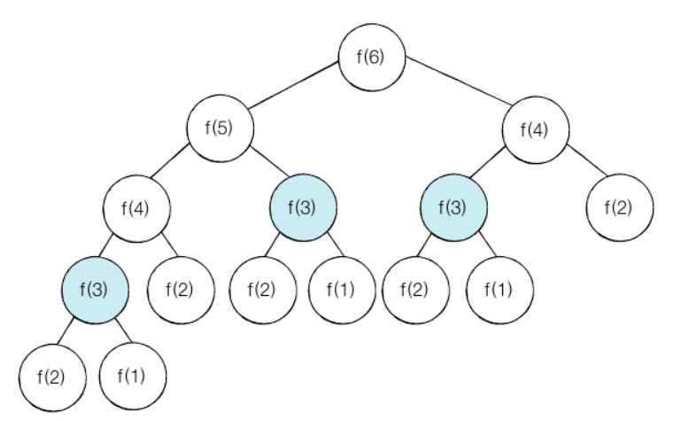
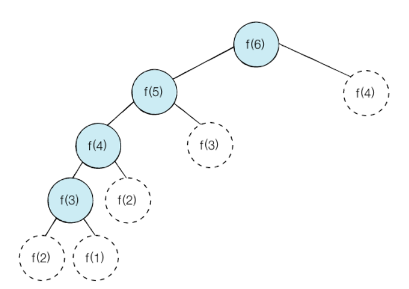

# 다이나믹 프로그래밍
- 한 번 계산한 문제는 다시 계산하지 않도록 하는 알고리즘
- 큰 문제를 작게 나누고, 같은 문제라면 한 번씩만 풀어 문제를 효율적으로 해결하는 알고리즘 기법
- 다이나믹 프로그래밍 vs 분할 정복
  - 분할 정복 예시 : 퀵정렬
    - 정렬 수행 시 정렬할 리스트를 분할하며 전체적으로 정렬이 될 수 있도록 하는 기법
    - 한 번 기준 원소(pivot)가 자리를 변경해서 자리잡게되면 그 기준 원소의 위치는 더이상 바뀌지 않고 그 피벗값을 다시 처리하는 부분 문제는 존재하지 않음
  - 반면 다이나믹 프로그래밍은 한 번 해결했던 문제를 다시금 해결함
  - 그렇기 때문에 이미 해결된 부분 문제에 대한 답을 저장해 놓고, 이 문제는 이미 해결됐던 것이니 다시 해결할 필요가 없다고 반환 하는 것

### 대표적 예시 - 피보나치 수열



- n번째 피보나치 수 = (n-1)번째 피보나치 수 + (n-2)번째 피보나치 수
- 단, 1번째 피보나치 수 = 1, 2번째 피보나치 수 = 1

```python
# 재귀
# O(2^n)

def fibo(x):
    if x == 1 or x == 2:
        return 1
    return fibo(x-1) + fibo(x-2)

pritn(fibo(4))
```

  


- 재귀는 동일 함수가 반복적으로 호출
- 다이나믹 프로그래밍을 사용하면 문제를 효육적으로 해결 가능
- But, 다이나믹 프로그래밍을 항상 사용할 수는 없다.

### <mark>다이나믹 프로그래밍의 조건</mark>
- **1. 큰 문제를 작은 문제로 나눌 수 있다.**
- **2. 작은 문제에서 구한 정답은 그것을 포함하는 큰 문제에서도 동일하다.**

### <mark>**메모이제이션 (Memoization)** 기법</mark>
- 한 번 구한 결과를 메모리 공간에 메모해두고 같은 식을 다시 호출하면 메모한 결과를 그대로 가져오는 기법
- 재귀 함수를 이용
- 큰 문제를 해결하기 위해 작은 문제를 호출한다고 하여 **탑 다운 (Top-Down)** 방식이라고 함
- 값을 저장하는 방법이므로 캐싱이라고도 한다.

```python
# 메모이제이션 (재귀적)
# 탑 다운 (Top-Down)
# O(N)

# 한 번 계산된 결과를 메모이제이션하기위한 리스트 초기화
d = [0] * 100   

def fibo(x):

    # 종료 조건 (1 혹은 2일때 1을 반환)
    if x == 1 or x == 2:
        return 1
    
    # 이미 계산한 적 있는 문제라면 그대로 반환
    if d[x] != 0:
        return d[x]
    
    # 아직 계산하지 않은 문제라면 점화식에 따라서 피보나치 결과 반환
    d[x] = fibo(x-1) + fibo(x-2)
    return d[x]

print(fibo(99))
```


- 다이나믹 프로그래밍을 적용했을 때의 피보나치 수열 알고리즘
- 시간 복잡도는 O(N)
- f(1)을 구한 다음 그 값이 f(2)를 푸는데 사용되고, f(2)의 값이 f(3)를 푸는 데 사용되는 방식으로 이어지기 때문

- 재귀 함수를 사용하면 컴퓨터 시스템에서는 함수를 다시 호출했을때 메모리 상에 적재되는 일련의 과정을 따라야 하므로 오버헤드가 발생할 수 있다.
- recursion depth 관련 오류 발생을 막기위해 sys 라이브러리에 포함된 <mark>setrecursionlimit()</mark> 함수를 호출하여 재귀 제한을 완화 가능
- 재귀 함수 대신에 반복문을 사용하여 오버헤드를 줄일 수 있다.
- 일반적으로 **반복문을 이용한 다이나믹 프로그래밍 성능이 더 좋음**

### <mark>**태뷸레이션 (Tabulation)** 기법</mark>
- 단순히 반복문을 이용하여 코드 작성
- 작은 문제부터 차근차근 답을 도출한다고 하여 **보텀업 (Bottom-Up)** 방식이라고 함

```python
# 태뷸레이션 (반복적)
# 보텀업 (Bottom-Up)
# O(N)

# 앞서 계산된 결과를 저장하기 위한 DP 테이블 초기화
d = [0] * 100

# 첫번째 피보나치 수와 두번째 피보나치 수는 1
d[1] = 1
d[2] = 2
n = 99

# 피보나치 함수 반목문으로 구현
for i in range(3, n+1):
    d[i] = d[i-1] + d[i-2]

print(d[n])
```

### 수열의 표현
- 배열이나 리스트로 표현 가능
- 수열처럼 연속적이지 않은 경우에는 딕셔너리 사용
- An을 계산하고자 할 때 A0~An-1 모두가 아닌 일부의 작은 문제에 대한 해답만 필요한 경우

## 실전문제

### 1로 만들기
```python
# 1로 만들기
# 연산 4개 사용해서 1 만들기위한 최소 연산 횟수
# Tabulation

# 1<= X <= 30000
# x가 5로 나누어떨어지면 5로 나눈다.
# x가 3로 나누어떨어지면 3로 나눈다.
# x가 2로 나누어떨어지면 2로 나눈다.
# X에서 1을 뺀다.
x = int(input())

# 연산 횟수를 저장할 dp 테이블
d = [0] * 30001

for n in range(2, x+1):
    d[n] = d[n-1] + 1

    if n % 2 == 0:
        d[n] = min(d[n], d[n//2] + 1)
    if n % 3 == 0:
        d[n] = min(d[n], d[n//3] + 1)
    if n % 5 == 0:
        d[n] = min(d[n], d[n//5] + 1)

print(d[x])
```

### 개미전사 
```python
# 개미전사
# tabulation
# 최소한 한 칸 이상 떨어진 식량창고를 약탈해야함
# 개미전사가 얻을 수 있는 식량의 최댓값 구하기
# 3 <= N <= 100

# dp 테이블은 i번째 식량창고까지 털 수 있는 최대 식량

# i번째 창고를 터는 경우와 안터는 경우의 최대식량 비교 후,
# 최댓값으로 dp 테이블의 i번째 값을 업데이트

# i번째 창고를 터는 경우, i번째 창고까지의 최대 식량
# = i-2번째 창고까지의 최대 식량 + i번째 창고의 식량
# i번째 창고를 안터는 경우, i번째 창고까지의 최대 식량
# = i-1번째 창고까지의 최대 식량

# (i-3)번째 이하의 식량창고에 대해서는 고려할 필요 x
# 한 칸 이상 떨어진 식량창고는 항상 털 수 있기 때문
# d[i-1]과 d[i-2]를 구하는 과정에서 이미 고려되었기 때문

import sys
sys.stdin = open('input.txt')

n = int(input())
arr = list(map(int,input().split()))

d = [0] * 100

d[0] = arr[0]
d[1] = max(arr[0], arr[1])

for i in range(2,n):
    d[i] = max(d[i-1], d[i-2]+arr[i])

print(d[n-1])
```

### 바닥공사
```python
# 바닥 공사
# tabulation

# 가로 N x 세로 2인 직사각형 형태의 바닥
# 해당 바닥을 1x2, 2x1, 2x2 덮개를 이용해 채우고자 함
# 바닥을 채우는 방법의 수를 796796으로 나눈 나머지 출력

# (i-1)까지 이미 채워져 있는 경우, 2x1 덮개로 채우는 경우밖에 없음
# (i-2)까지만 채워져 있는 경우, 1x2 덮개 2개, 2x2 덮개 1개 이렇게 두가지 경우밖에 없음
# -> 2x1 두개로 덮는 경우는 위에서 고려했으므로 제외!


N = int(input())

d = [0] * 1001

d[1] = 1    # 2 x 1 덮개 1개
d[2] = 3    # 1 x 2 덮개 2개 / 2 x 1 덮개 2개 / 2 x 2 덮개 1개

for i in range(3,N+1):
    d[i] = (d[i-1] + d[i-2] * 2) % 796796

print(d[N])
```

### 효율적인 화폐 구성
```python
# 효율적인 화폐 구성
# N개의 화폐를 이용해 M원을 만드는 최소한의 화폐 개수
# 불가능할땐 -1 출력
# 1<=N<=100, 1<=M<=10000

# DP 테이블은 금액 i를 만들 수 있는 최소한의 화폐 개수
# 주어진 화폐의 단위를 k라고 할때,
# DP(i-k)를 만드는 방법이 존재할 경우: DP(i) = min(DP(i), DP(i-k) + 1)
# DP(i-k)를 만드는 방법이 존재하지 않을 경우 : DP(i) = 10001

import sys
sys.stdin = open('input.txt')

N, M = map(int,input().split())

coin = []

for _ in range(N):
    coin.append(int(input()))

d = [10001] * (M+1)

for i in range(N):
    for j in range(coin[i], M+1):
        if d[j - coin[i]] != 10001: # (i-k)원을 만드는 방법이 존재하는 경우
            d[j] = min(d[j], d[j - coin[i]] + 1)

if d[M] == 10001:   # 최종적으로 M원을 만드는 방법이 없는 경우
    print(-1)
else:
    print(d[M])
```


