# 그래프

## 그래프란?
- 노드(node)와 노드 사이에 연결된 **간선(edge)의 정보**를 가지고 있는 자료구조
- 문제를 접햇을 때 **'서로 다른 개체가 연결되어 있다'**는 이야기를 들으면 가장 먼저 그래프 알고리즘을 떠올려야 함
- 그래프 자료구조 중에서 트리(tree) 자료구조는 다양한 알고리즘에서 사용됨 

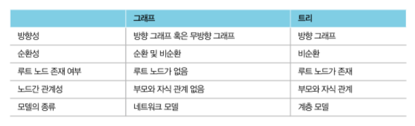

## 그래프 구현 방법
- **인접 행렬 (Adjacency Matrix)** : 2차원 배열을 사용하는 방식
- **인접 리스트 (Adjacency List)** : 리스트를 사용하는 방식
- 메모리 측면 (간선 정보 저장 시)
  - 노드 개수 : V / 간선 개수 : E
  - 인접 행렬은 O(V^2) 메모리 공간 필요
  - 인접 리스트는 O(E) 메모리 공간 필요
- 속도 측면 (특정 노드에서 다른 특정 노드로 이어진 간선의 비용을 알고싶을때)
  - 노드 개수 : V / 간선 개수 : E
  - 인접 행렬은 O(1)의 시간으로 즉시 파악 가능
  - 인접 리스트는 O(V)만큼의 시간 소요
- 다익스트라 최단 경로 알고리즘은 인접 리스트 이용
  - **최단 경로** 찾을때 **노드와 간선 개수가 많으면** 우선 순위큐를 이용하는 **다익스트라 알고리즘이 유리**
- 플로이드 워셜 알고리즘은 인접 행렬 이용
  - 최단 경로 찾을때 노드 수가 적은 경우엔 플로이드 워셜이 유리

## 서로소 집합
- **서로소 집합 (Disjoint Sets)** : 공통원소가 없는 두 집합
- 서로소 집합 자료구조란
  - 서로소 부분 집합들로 나누어진 원소들의 데이터를 처리하기 위한 자료구조
  - **union 연산** : 2개의 원소가 포함된 집합을 하나의 집합으로 합치는 연산
  - **find 연산** : 특정한 원소가 속한 집합이 어떤 집합인지 알려주는 연산
  - 서로소 집합 자료구조 = **union-find 자료구조**

## 서로소 집합 자료구조
- 트리를 이용해 집합 표현
- union(A,B)
  - A와 B의 루트 노드 A, B를 각각 찾는다
  - A를 B의 부모노드로 설정한다 (B가 A를 가리키도록 한다)
- {1,2,3,4,5,6}
- union(1,4) , union(2,3), union(2,4), union(5,6)

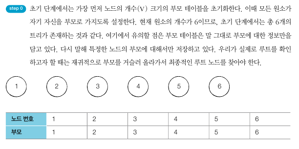
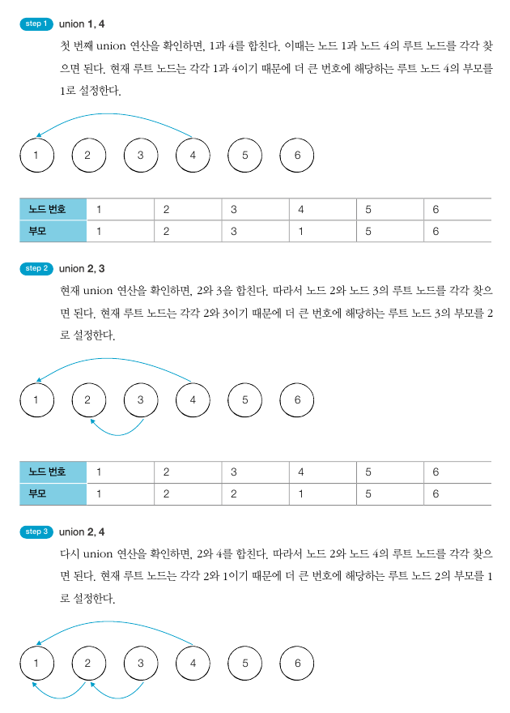


## 기본적인 서로소 집합 알고리즘

```python
# 특정 원소가 속한 집합을 찾기
def find_parent(parent, x):
    # 루트 노드가 아니라면, 루트 노드를 찾을 때까지 재귀적으로 호출
    if parent[x] != x:
        parent[x] = find_parent(parent, parent[x])
    return parent[x]

# 두 원소가 속한 집합을 합치기
def union_parent(parent, a, b):
    a = find_parent(parent, a)
    b = find_parent(parent, b)

    if a < b:
        parent[b] = a
    else:
        parent[a] = b


# 노드의 개수와 간선(union 연산)의 개수 입력받기
v, e = map(int,input().split())
parent = [0] * (v+1)

# 부모 테이블 상에서 부모를 자기 자신으로 초기화
for i in range(1, v+1):
    parent[i] = i

# union 연산을 각각 수행
for i in range(e):
    a, b = map(int,input().split())
    union_parent(parent, a, b)

# 각 원소가 속한 집합 출력
for i in range(1,v+1):
    print(find_parent(parent, i), end=" ")

# 부모 테이블 내용 출력
for i in range(1,v+1):
    print(parent[i], end=" ")
```

## 서로소 집합을 활용한 사이클 판별
- **무방향 그래프** 내에서의 사이클 판별 가능
- 1. 각 간선을 확인하며 두 노드의 루트 노드를 확인
  - 루트 노드가 서로 다르다면 두 노드에 대해 union 연산 수행
  - 루트 노드가 서로 같다면 사이클(cycle)이 발생한 것
- 2. 그래프에 포함되어 있는 모든 간선에 대해 1번 과정 반복

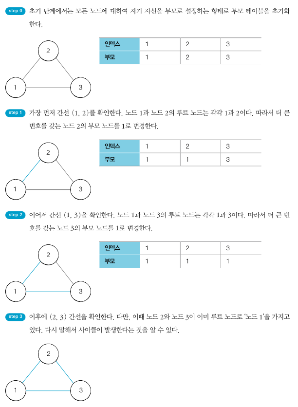

```python
# 특정 원소가 속한 집합을 찾기
def find_parent(parent, x):
    # 루트 노드가 아니라면, 루트 노드를 찾을 때까지 재귀적으로 호출
    if parent[x] != x:
        parent[x] = find_parent(parent, parent[x])
    return parent[x]

# 두 원소가 속한 집합을 합치기
def union_parent(parent, a, b):
    a = find_parent(parent, a)
    b = find_parent(parent, b)

    if a < b:
        parent[b] = a
    else:
        parent[a] = b


# 노드의 개수와 간선(union 연산)의 개수 입력받기
v, e = map(int,input().split())
parent = [0] * (v+1)

# 부모 테이블 상에서 부모를 자기 자신으로 초기화
for i in range(1, v+1):
    parent[i] = i

cycle = False   # 사이클 발생 여부

for i in range(e):
    a, b = map(int, input().split())
    # 사이클이 발생한 경우 종료
    if find_parent(parent, a) == find_parent(parent, b):
        cycle = True
        break
    # 사이클이 발생하지 않았다면 합집합(union) 수행
    else:
        union_parent(parent, a, b)
```

## 신장 트리 (Spanning Tree)
- 하나의 그래프가 있을 때 **모든 노드를 포함**하면서 **사이클이 존재하지 않는** 부분 그래프
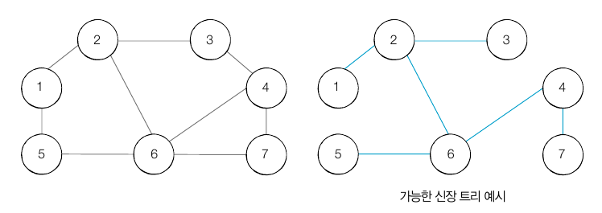

## 크루스칼 알고리즘 (Kruskal Algorithm)
- "가장 거리가 짧은 간선부터 차례대로 집합에 추가하며 사이클을 발생시키는 간선은 제외!"
- 대표적인 최소 신장 트리 알고리즘 (MST)
- 최소한의 비용으로 신장 트리 찾기
- 크루스칼 알고리즘을 사용하면 가장 적은 비용으로 모든 노드를 연결 가능 (그리디로 분류)
- 1. 간선 데이터를 비용에 따라 오름차순으로 정렬
- 2. 간선을 하나씩 확인하며 현재의 간선이 사이클을 발생시키는지 확인
  - 사이클이 발생하지 않는 경우 MST에 포함
  - 발생하는 경우 포함 X
- 3. 모든 간선에 대해 2번 과정 반복
- 최종적으로 신장 트리에 포함되는 간선의 개수는 '노드의 개수 - 1'
- 시간 복잡도 O(ElogE)

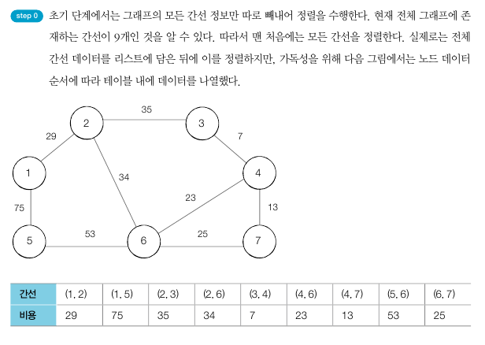
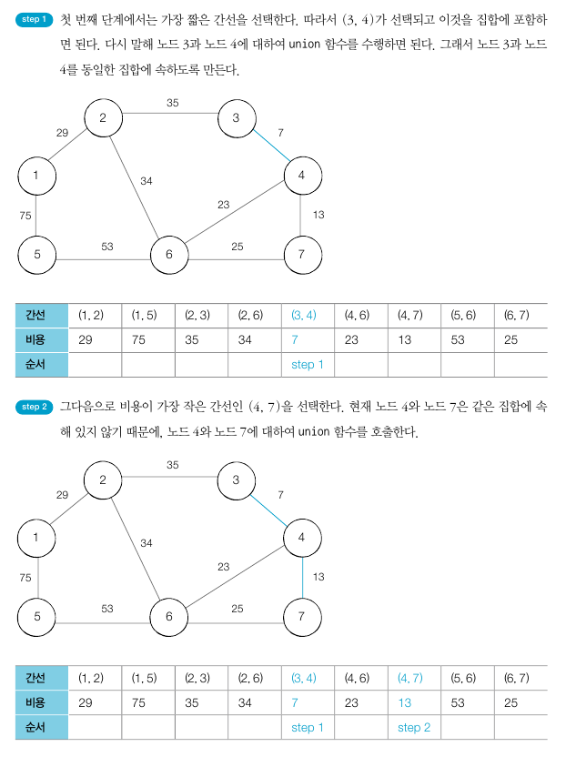
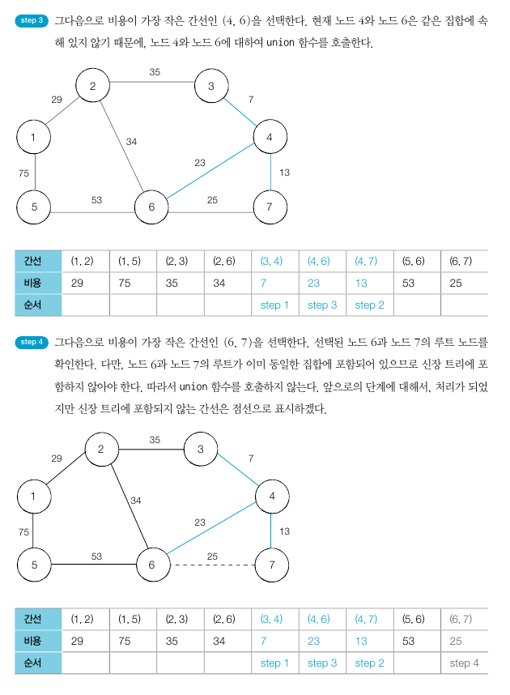
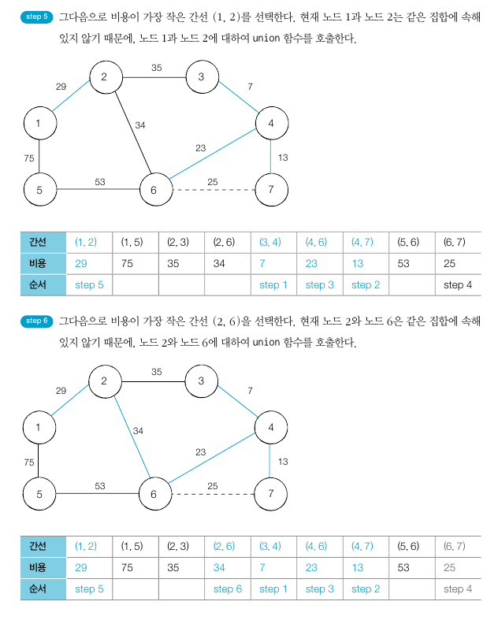
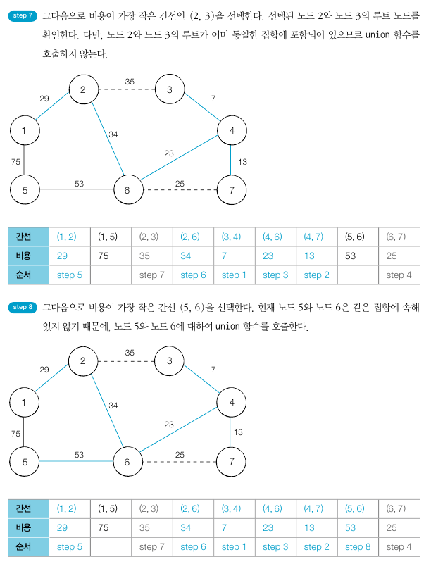
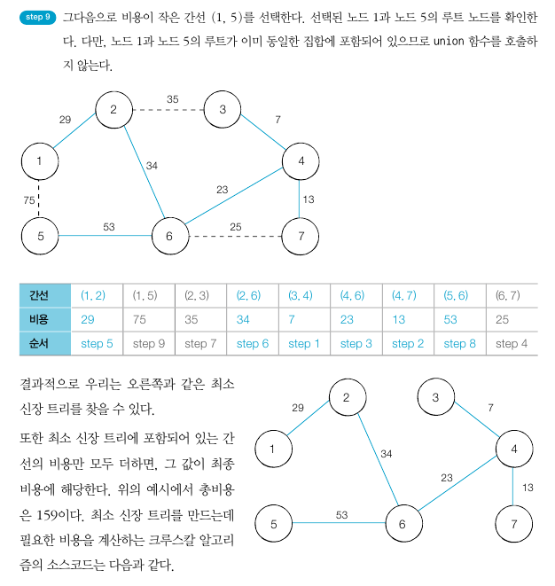

```python
# 특정 원소가 속한 집합을 찾기
def find_parent(parent, x):
    # 루트 노드가 아니라면, 루트 노드를 찾을 때까지 재귀적으로 호출
    if parent[x] != x:
        parent[x] = find_parent(parent, parent[x])
    return parent[x]

# 두 원소가 속한 집합을 합치기
def union_parent(parent, a, b):
    a = find_parent(parent, a)
    b = find_parent(parent, b)
    if a < b:
        parent[b] = a
    else:
        parent[a] = b

# 노드의 개수와 간선 (union 연산)의 개수 입력받기
v, e = map(int,input().split())
parent = [0] * (v+1) # 부모 테이블 초기화

# 모든 간선을 담을 리스트와 최종 비용을 담을 변수
edges = []
result = 0

# 부모 테이블 상에서 부모를 자기 자신으로 초기화
for i in range(1, v+1):
    parent[i] = i

# 모든 간선에 대한 정보를 입력받기
for _ in range(e):
    a, b, cost = map(int, input().split())
    # 비용순으로 정렬하기 위해서 튜플의 첫번째 원소를 비용으로 설정
    edges.append((cost, a, b))

# 간선을 비용순으로 정렬
edges.sort()

# 간선을 하나씩 확인하며
for edge in edges:
    cost, a, b = edge
    # 사이클이 발생하지 않는 경우에만 집합에 포함
    if find_parent(parent, a) != find_parent(parent, b):
        union_parent(parent, a, b)
        result += cost

print(result)
```
## 관련 문제
### 팀 결성

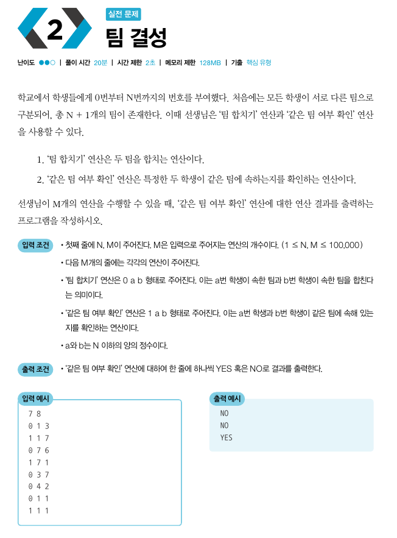

```python
def find_parent(parent, x):
    if parent[x] != x:
        parent[x] = find_parent(parent, parent[x])
    return parent[x]

def union_parent(parent, a, b):
    a = find_parent(parent, a)
    b = find_parent(parent, b)
    if a < b:
        parent[b] = a
    else:
        parent[a] = b

n, m = map(int,input().split())

parent = [0] * (n+1)

for i in range(0, n+1):
    parent[i] = i

for i in range(m):
    oper, a, b = map(int,input().split())

    if oper == 0:
        union_parent(parent, a, b)

    elif oper == 1:
        if find_parent(parent, a) == find_parent(parent, b):
            print('YES')
        else:
            print('NO')
```

### 도시 분할 계획 

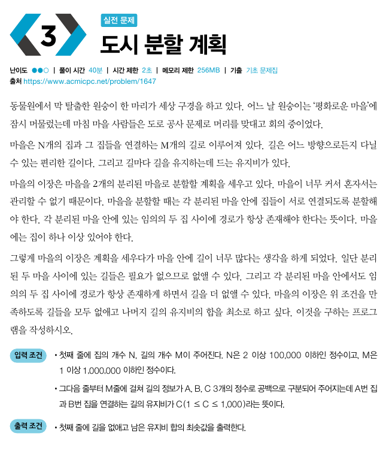
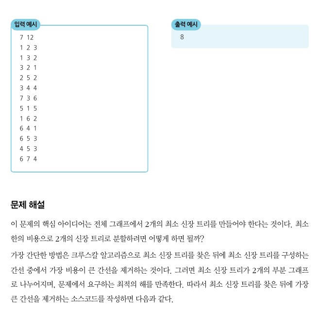

```python
def find_parent(parent, x):
    if parent[x] != x:
        parent[x] = find_parent(parent, parent[x])
    return parent[x]

def union_parent(parent, a, b):
    a = find_parent(parent, a)
    b = find_parent(parent, b)

    if a < b:
        parent[b] = a
    else:
        parent[a] = b

v, e = map(int,input().split())
parent = [0] * (v+1)

edges = []
result = 0

for i in range(1, v+1):
    parent[i] = i

for _ in range(e):
    a, b, cost = map(int,input().split())
    edges.append((cost, a, b))

edges.sort()
last = 0    # 최소 신장 트리에 포함되는 간선 중에서 가장 비용이 큰 간선

for edge in edges:
    cost, a, b = edge
    if find_parent(parent, a) != find_parent(parent, b):
        union_parent(parent, a, b)
        result += cost
        last = cost     # 정렬되어있으므로 마지막 cost가 last에 담겨있을 것임

print(result - last)
```

