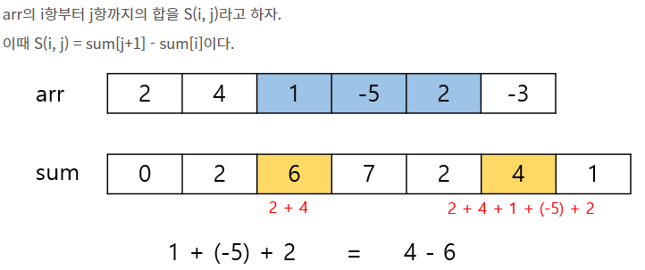
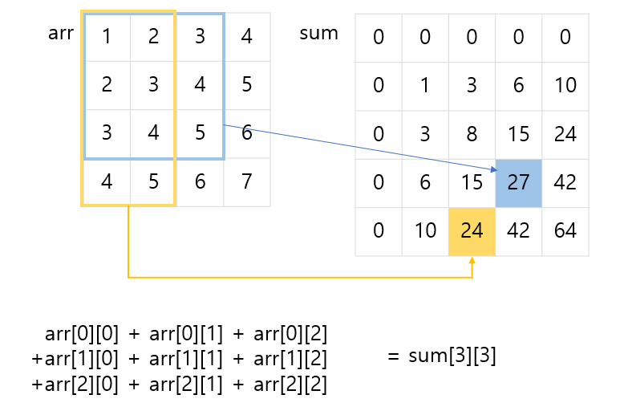
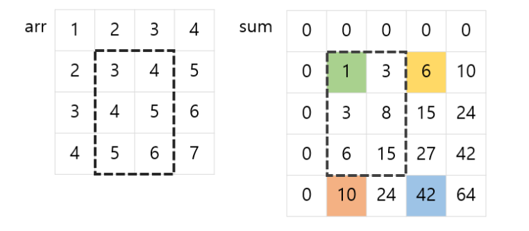

# Prefix Sum (누적합)

- 배열의 일부 구간에 대한 합을 매우 빠르게 구할 수 있게 해주는 스킬
- 원래 N개의 원소로 이루어진 배열이 주어졌을 때 반복문을 통해 부분 배열의 합을 구하려면 O(N)
- 누적합을 이용하면 O(1)

## 1차원 배열

- arr을 순차 탐색하면서 sum 배열 만들기
- sum[i]에는 arr[0] + arr[1] + arr[2] + ... + arr[i-1]



## 2차원 배열

- sum[i][j]에는 arr[0][0]부터 arr[i-1][j-1]까지의 합이 담김



### **sum_arr[i][j] = arr[i-1][j-1] + sum_arr[i-1][j] + sum_arr[i][j-1] - sum_arr[i-1][j-1]**

- sum_arr[i][j]를 구하기 위해 먼저 sum_arr[i-1][j] (=15) + sum_arr[i][j-1] (=15)
- sum_arr[i-1][j-1] (=8) 까지의 합이 두번씩 합해지고, arr[i-1][j-1] (=5) 값이 없는 상태
- sum_arr[i-1][j-1] 값을 한 번 빼주고, arr[i-1][j-1] 값을 더해줌


```python
arr = [[1,2,3,4],
       [2,3,4,5],
       [3,4,5,6]]

m = 4
n = 3

sum_arr = [[0 for _ in range(m+1)] for _ in range(n+1)]
for i in range(1, n+1):
    for j in range(1, m+1):
        sum_arr[i][j] = arr[i-1][j-1] + sum_arr[i-1][j] + sum_arr[i][j-1] - sum_arr[i-1][j-1]
```

### 2차원 누적합 활용법
```python
### arr의 (x1, y1) 부터 (x2, y2) 까지의 누적합 S
S = sum_arr[x2+1][y2+1] - sum_arr[x1][y2+1] - sum_arr[x2+1][y1] + sum_arr[x1][y1]

print(S)
```



- (x2, y2)까지의 누적합에서 제외되는 부분의 누적합을 빼는데 교차되는 부분을 두번 빼게 되므로 한번 더해줌
- (x2, y2)까지의 누적합 -> sum_arr[x2+1][y2+1] (=42)
- 제외되는 부분 두 개 -> sum_arr[x1][y2+1] (=6), sum_arr[x2+1][y1] (=10)
- 교차되는 부분 -> sum_arr[x1][y1] (=1)
- 42 - 6 - 10 + 1 = 27