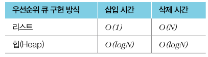
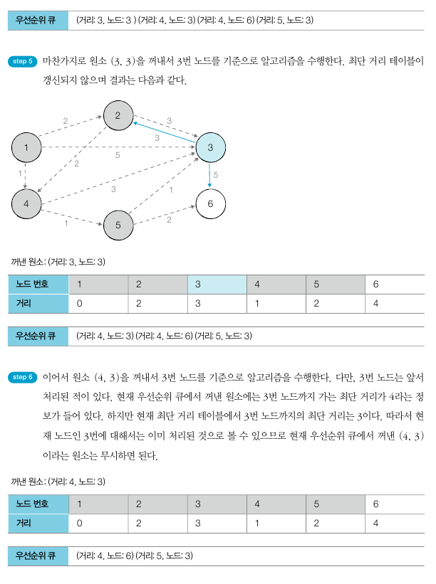

# 최단 경로 (Shortest Path)

## 가장 빠른 길 찾기
- 최단 경로 알고리즘 : 가장 짧은 경로를 찾는 알고리즘. 길찾기 문제
- 그리디 및 DP의 한 유형

## 다익스트라 (Dijkstra) 최단 경로 알고리즘
- 그래프에서 여러개의 노드가 있을 때, 특정 노드에서 출발하여 다른 노드로 가는 각각의 최단 경로를 구해주는 알고리즘
- '음의 간선'이 없을때 정상적 작동
- 기본적으로 그리디 알고리즘으로 분류됨
- 1. 출발 노드 설정
- 2. 최단 거리 테이블 초기화
- 3. 방문하지 않은 노드중에서 최단 거리가 가장 짧은 노드를 선택
- 4. 해당 노드를 거쳐 다른 노드로 가는 비용을 계산하여 최단 거리 테이블 갱신
- 5. 위 과정에서 3과 4번을 반복
- 최단 경로를 구하는 과정에서 '각 노드에 대한 현재까지의 최단 거리' 정보를 항상 1차원 리스트에 저장하며 리스트를 계속 갱신
- 매번 현재 처리하고 있는 노드를 기준으로 주변 간선을 확인


## 방법 1. 간단한 다익스트라 알고리즘
- 단계마다 '방문하지 않은 노드 중에서 최단 거리가 가장 짧은 노드를 선택'하기 위해 매 단계마다 1차원 리스트의 모든 원소를 확인(순차탐색)
- 시간 복잡도 O(V^2)

```python
'''
6 11
1
1 2 2
1 3 5
1 4 1
2 3 3
2 4 2
3 2 3
3 6 5
4 3 3
4 5 1
5 3 1
5 6 2
'''

import sys
input = sys.stdin.readline
INF = int(1e9)  # 무한을 의미하는 값으로 10억을 설정

# 노드의 개수, 간선의 개수 입력받기
n, m = map(int,input().split())
# 시작 노드 번호를 입력 받기
start = int(input())
# 각 노드에 연결되어 있는 노드에 대한 정보를 담는 리스트를 만들기
graph = [[] for i in range(n+1)]
# 방문한 적이 있는지 체크하는 목적의 리스트를 만들기
visited = [FALSE] * (n+1)
# 최단거리 테이블을 모두 무한으로 초기화
distance = [INF] * (n+1)

# 모든 간선 정보를 입력 받기
for _ in range(m):
    a, b, c = map(int,input().split())
    # a번 노드에서 b번 노드로 가는 비용이 c라는 의미
    graph[a].append((b,c))

# 방문하지 않은 노드 중에서, 가장 최단 거리가 짧은 노드의 번호를 반환
def get_smallest_node():
    min_value = INF
    index = 0   # 가장 최단 거리가 짧은 노드(인덱스)
    for i in range(1, n+1):
        if distance[i] < min_value and not visited[i]:
            min_value = distance[i]
            index = i
    return index

def dijkstra(start):
    # 시작노드에 대해 초기화
    distance[start] = 0
    visited[start] = True
    for j in graph[start]:
        distance[j[0]] = j[1]
    # 시작노드 제외한 전체 n-1개의 노드에 대해 반복
    for i in range(n-1):
        # 현재 최단 거리가 가장 짧은 노드를 꺼내서, 방문 처리
        now = get_smalles_node()
        visited[now] = True
        # 현재 노드와 연결된 다른 노드를 확인
        for j in graph[now]:
            cost = distance[now] + j[1]
            # 현재 노드를 거쳐서 다른 노드로 이동하는 거리가 더 짧은 경우
            if cost < distance[j[0]]:
                distance[j[0]] = cost

# 다익스트라 알고리즘 수행
dijkstra(start)

# 모든 노드로 가기 위한 최단 거리를 출력
for i in range(1, n+1):
    # 도달할 수 없는 경우, 무한(INFINITY)라고 출력
    if distance[i] == INF:
        print("INFINITY")
    else:
        print(distance[i])
``` 

## 방법 2. 개선된 다익스트라 알고리즘
- 최악의 경우에도 시간 복잡도 O(ElogV)
- 힙 (Heap) 자료구조 사용
- 특정 노드까지의 최단 거리에 대한 정보를 힙에 담아서 처리하므로 출발 노드로부터 가장 거리가 짧은 노드를 더욱 빠르게 찾을 수 있다

### 힙
- 우선순위 큐(Priority Queue)를 구현하기 위해 사용하는 자료구조
- 우선순위가 가장 높은 데이터를 가장 먼저 삭제
- heapq 라이브러리가 더빠르게 동작
- 우선순위 큐 라이브러리에 데이터 묶음을 넣으면, 첫번째 원소를 기준으로 우선순위 설정
- (가치, 물건)
- 우선순위 큐 구현 시, 내부적으로 최소 힙 또는 최대 힙 사용
- 최소 힙 - 값이 낮은 데이터 먼저 삭제 / 최대 힙 - 값이 큰 데이터 먼저 삭제
- 파이썬 라이브러리에서는 기본적으로 최소 힙 구조 이용, 다익스트라도 최소 힙 구조 기반
- 
- 단순히 우선순위 큐를 이용해서 시작노드로부터 거리가 짧은 노드 순서대로 큐에서 나올 수 있도록 다익스트라 알고리즘 작성
- **현재 가장 가까운 노드를 저장하기 위한 목적으로만 우선순위 큐 추가로 이용**
- 시간 복잡도 O(logN)
- 최단 거리가 가장 짧은 노드를 선택하는 과정을 다익스트라 최단 경로 함수 안에서 우선순위 큐를 이용하는 방식으로 대체





```python
import heapq
import sys
input = sys.stdin.readline
INF = int(1e9)

n, m = map(int,input().split())
start = int(input())
graph = [[] for _ in range(n+1)]
distance = [INF] * (n+1)

for _ in range(m):
    a, b, c = map(int,input().split())
    graph[a].append((b,c))

def dijkstra(start):
    q = []
    # 시작 노드로 가기 위한 최단 경로는 0으로 설정하여, 큐에 삽입
    heapq.heappush(q, (0, start))
    distance[start] = 0
    while q:    # 큐가 비어있지 않다면
        # 가장 최단 거리가 짧은 노드에 대한 정보 꺼내기
        dist, now = heapq.heappop(q)
        # 현재 노드가 이미 처리된 적이 있는 노드라면 무시
        if distance[now] < dist:
            continue
        # 현재 노드와 연결된 다른 인접한 노드들을 확인
        for i in graph[now]:
            cost = dist + i[1]
            # 현재 노드를 거쳐서, 다른 노드로 이동하는 거리가 더 짧은 경우
            if cost < distance[i[0]]:
                distance[i[0]] = cost
                heapq.heqppush(q, (cost, i[0]))

dijkstra(start)

for i in range(1, n+1):
    if distance[i] == INF:
        print('INFINITY')
    else:
        print(distance[i])
```


## 관련문제
### 전보


```python
import heapq
import sys

input = sys.stdin.readline
INF = int(1e9)

n, m, start = map(int,input().split())
graph = [[] for i in range(n+1)]
distance = [INF] * (n+1)

for _ in range(m):
    x, y, z = map(int,input().split())
    graph[x].append((y,z))  # x번 노드에서 y번 노드로 가는 비용이 z

def dijkstra(start):
    q = []
    heapq.heappush(q, (0, start))
    distance[start] = 0

    while q:
        dist, now = heapq.heappop(q)
        if distance[now] < dist:
            continue
        for i in graph[now]:
            cost = dist + i[1]
            if cost < distance[i[0]]:
                distance[i[0]] = cost
                heapq.heqppush(q, (cost, i[0]))

dijkstra(start)

# 도달할 수 있는 노드의 개수
count = 0
# 도달할 수 있는 노드 중에서, 가장 멀리 있는 노드와의 최단 거리
max_distance = 0
for d in distance:
    # 도달할 수 있는 노드인 경우
    if d != INF:
        count += 1
        max_distance = max(max_distance, d)

# 시작 노드 제외 count -1
print(count -1, max_distance)
```