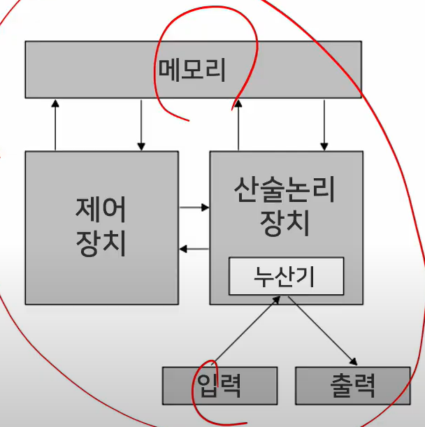

# 소프트웨어 공학

## 소프트웨어 공학 기출문제
- 소프트웨어 위기에 대해 설명하시오
- 소프트웨어 공학이 필요한 이유는 무엇인지 설명하시오
- 소프트웨어 개발 경험과 소프트웨어 개발 시 적용한 개발 방법론이 있다면 설명하시오
- 소프트웨어 프로젝트 진행 경험에 대해 설명하시오

### 소프트웨어 개발 생명 주기
> 계획 단계에서 유지보수 단계에 이르기까지 일어나는 일련의 절차

- 정의 단계 (WHAT)
  - 타당성 분석 -> 개발 계획 -> 요구사항 분석
  - 사용자의 요구사항 확인 및 타당성 검토
  - 개발에 필요한 요구사항 명세화
- 개발 단계 (HOW)
  - 설계 -> 개발 -> 테스트
  - 코딩을 통한 프로그램 개발
  - 단위/통합/시스템/인수/설치테스트
- 유지보수 단계 (CHANGE)
  - 유지보수 -> 폐기
  - 시스템 운영 및 운영 중 발생한 문제점들에 대한 유지보수
  - 새로운 시스템 개발로 인한 기존 시스템 폐기

### 소프트웨어 개발프로세스 정의
> 작업(task)순서의 집합 + 제약 조건(일정, 예산, 자원)을 포함하는 일련의 활동

- 좁은 의미
  - 사용자의 요구사항을 SW로 구현하기 위한 절차, 과정
- 넓은 의미
  - 사용자의 목적을 이루기 위한 기획, 프로젝트 관리 등을 포함한 절차, 과정, 방법
- 소프트웨어개발 7단계
  - 계획 -> 요구분석 -> 설계 -> 구현 -> 테스트 -> 반영 -> 유지보수

### Q1) 소프트웨어 위기에 대해 설명하시오
> 답변 point
- 소프트웨어 위기에 대한 정형화된 답보다는 실제 사례를 들어서 설명
> 답변 사례 예시
- 2000년대 초반 많은 사람들이 이용했던 싸이월드가 이제는 사용되지 않는 것은 서비스에 대한 다양한 수요를 예측하지 못하고 반영하지 못한 대표적인 사례
- 소프트웨어 위기는 소프트웨어가 더이상 사용자들의 요구를 충족할 수 없어서 사용자들로부터 외면받는 것을 이야기함

### 기존 소프트웨어 프로세스 모델
- 폭포수 모델
- 프로토타입 모델
- 나선형 모델
- 통합프로세스 모델

### 애자일 프로세스 모델
- agile : 날렵한, 민첩한
- **고객 요구에 민첩하게 대응**하고 그때그때 주어지는 문제를 풀어나가는 방법론
- 프로세스와 도구중심이 아닌 **상호 소통** 중시
- 문서 중심이 아닌 **실행가능한 소프트웨어** 중시
- 계양과 협상 중심이 아닌 **고객과의 협력** 중시
- 계획 중심이 아닌 **변화에 민첩한 대응** 중시

### Q2) 소프트웨어 공학이 필요한 이유는 무엇인지 설명하시오
- 답변 point
  - 소프트웨어공학의 적용에 대해 예시를 들어 설명
  - 소프트웨어들을 비교하면 설명이 쉬움
- 답변 사례 예시
  - 소프트웨어공학은 소프트웨어의 개발, 운용, 유지보수 등의 단계를 체계적으로 다루는 학문
  - SSAFY에서 진행한 프로젝트에서 단기간에 원하는 목적을 이루기 위해 소프트웨어를 기획하고, 설계하고, 구현하고, 테스트하고, 보완하는 과정을 거쳤는데, 이 과정을 체계적으로 정리하고 이를 공유하는 과정이 곧 소프트웨어 공학이 아닌가 생각함

### 소프트웨어 아키텍처
> 소프트웨어에 대한 전체적인 구조
- 데이터 중심형 모델
- Client-Server 모델
- Layering 모델
- Model/View/Controller 모델

### Q3) 소프트웨어 개발 경험과 소프트웨어 개발 시 적용한 개발 방법론이 있다면 설명하시오
- 답변 point
  - 소프트웨어개발의 경험을 생각해보면 1개 이상의 방법론이 적용된 것을 알 수 있음
  - 개발 시 고려한 개발 방법론이 없더라도 개발했던 경험을 복기해서 가장 적절한 개발 방법론을 적용
- 답변 사례 예시
  - SSAFY에서 프로젝트를 진행하면서 린 개발 방법을 찾아 적용했었음
  - 린 개발 방법론의 가장 큰 특징은 낭비요소를 제거하고, 지속적인 개선과 수행속도의 향상과 더불어 품질을 효과적으로 개선하는 것
  - 프로젝트 기간이 짧아 어려움을 겪었음
  - 초기 서비스에 대한 방향성을 자신할 수 없어 지속적으로 서비스를 향상할 수 있는 방법론이 필요했고, 그래서 린 개발 방법론을 찾아 적용하게 되었음
  - 경험이 많지 않아 린 개발 방법론의 적용이 쉽진 않았지만, 단기간에 프로젝트를 완성하는데는 도움이 되었음

### Q4) 소프트웨어 프로젝트 진행 경험에 대해 설명하시오
- 답변 point
  - 소프트웨어 진행 경험은 '무엇을 개발하였다'라기보단 '어떻게 개발하였다'라고 말하는 것이 필요
  - 그 안에는 개발방법론이나 소프트웨어 아키텍처를 들어서 설명하는 것이 필요
- 답변 사례 예시
  - 대학교 졸업을 위한 프로젝트로 빅데이터를 통한 관광정보 제공 서비스를 개발하였음
  - 관광정보에 대한 빅데이터를 수집하고 분석하여 이용자의 특성(연령 성별 지역)에 맞추어 관광정보를 제공하는 서비스를 개발하였음
  - 린 개발 방법론이 짧은 기간 개발에 적용하기에 적절하다고 하여 적용하였음

---
# 프로그래밍

## 프로그래밍 기출문제
- 자바와 C의 차이를 설명하시오
- JVM 가비지컬렉션 동작 과정을 설명하시오
- JAVA에 적용된 OOP에 대해 설명하시오
- 형상관리 활용 경험을 설명하시오 (C+Z/Y)
- 리팩토링이란 무엇인지 설명하시오

### 컴퓨터 프로그래밍
- 컴퓨터 프로그램
  - 어떤 목표를 이루기 위해 컴퓨터에 제시하는 계획
- 코드 (Code)
  - 암호 혹은 부호 - 모스 부호 (Morse Code)
  - "코드 짜기" - 컴퓨터가 이해하기 쉬운 암호를 작성
- 빌드 (Build)
  - 작성한 코드를 컴퓨터가 이해할 수 있는 형태로 번역하는 작업

### 프로그래밍 언어
- 저급 언어
  - 컴퓨터가 이해하기 쉬운 언어
  - 기계어
- 고급 언어
  - 인간이 이해하기 쉬운 언어
  - 기계어로 바꾸는 과정 필요
- 기계어
- 어셈블리어
- 포트란
- 코볼
- 파스칼
- C
  - 유닉스 운영 체제
- C ++
  - C언어에 객체지향 프로그래밍을 지원
- JAVA
  - 객체 지향적 프로그래밍 언어
- PHP
  - 동적 웹 페이지를 만들기 위해 설계됨
- Python
  - 플랫폼 독립적, 인터프리터식, 객체지향적, 동적 타이핑 대화형 언어
  - 범용 언어
- 블록프로그래밍

### 데이터분석 언어
- Python
  - 좀더 범용 개발 언어
- R
  - 통계 쪽 특화 패키지 많음

### 인공지능 언어
- 주로 범용 언어들
- Python
- JAVA
- C/C++
- 자바스크립트
- 루아
- 줄리아
- 텐서플로우용 스위프트

## 객체지향
### 객체지향 개요
- 소프트웨어 객체는 현실 세계의 객체를 필드와 메서드로 모델링한 것
- 소프트웨어 객체는 상태를 필드로 정의, 동작을 메서드로 정의
- 필드는 객체 내부에 '선언된 변수', 메서드는 객체 내부에 '정의된 동작'
- 절차지향
  - 일련의 동작 중심
- 객체지향
  - 현실 세계를 객체 단위로 프로그래밍
  - 소프트웨어 개발과 보수 간편

### 객체지향 주요개념
- 캡슐화(정보은닉)
  - 필드와 메서드를 하나의 캡슐처럼 포장해 세부 내용을 외부에서 알 수 없도록 감추는 것
- 상속
  - 상위 객체를 상속받은 하위 객체가 상위 객체의 메서드와 필드를 사용하는 것
- 다형성
  - 대입되는 객체에 따라서 메서드를 다르게 동작하도록 구현하는 기술
  - 실행 도중 동일한 이름의 다양한 구현체 중에서 메서드를 선택 가능

## 객체지향프로그래밍 언어 - Java
- Java 목적
  - Write Once Run Anywhere
  - platform independent
- Java 언어의 개발 목적
  - Program 개발을 쉽게 함
  - Interpreted 환경
  - 한개이상의 thread 사용 가능
  - 동적으로 program 변화 가능

- Java Virtual Machine
  - Java는 platform independent해서 운영체제 마다 다른 JVM
- Garbage Collection
  - Java는 프로그래머에게 메모리를 release (최적화)하게 하는 책임을 지우지 않음

- Process
  - MAC (운영체제) -> JVM (Process) -> Class (Thread)
  - 프로세스 : 실행을 위해 메모리에 올라온 동적인 상태
- Thread
  - 프로세스에서 실행 제어만 분리한 실행 단위 (프로세스 시행부)

- 멀티태스킹
  - 운영체제가 CPU에 작업을 줄 때 시간을 잘게 나누어 배분
- 멀티프로세싱
  - CPU를 여러개 사용하여 여러개의 Thread를 동시에 처리하는 작업환경
- CPU 멀티 Thread
  - 하드웨어적인 방법으로 하나의 CPU에서 여러 Thread를 동시에 처리하는 병렬 처리 기법
- **멀티 Thread**
  - 운영체제가 소프트웨어적으로 프로세스를 작은 단위의 Thread로 분할하여 운영하는 기법

- 병행성(concurrency) 문제
  - 두개 이상의 Thread가 어떤 객체에 있는 하나의 데이터에 접근하게 되는 경우
- Thread에서의 동기화
  - 다중 Thread 환경에서 한번에 하나의 쓰레드 만이 공유 데이터를 접근할 수 있도록 제어

### Q5) 자바와 C의 차이를 설명하시오
- 답변 point
  - 절차지향 vs 객체지향 / 하드웨어 최적화 vs 하드웨어 독립적 등의 여러 관점에서 비교 설명

- 답변 사례 예시
  - C언어는 아두이노를 활용한 IoT 수업에 사용하였었고, 자바는 안드로이드 어플 제작할 때 사용
  - 하드웨어를 제어할 때 C언어가 적합
  - 자바 사용할 땐 다양한 유형의 데이터를 정의, 데이터 간 관계 설정, 사용자의 동작을 정의, 구현하는 과정을 거쳤음
    - 실제 업무와 유사하여 규모있는 프로젝트를 개발할때 자바가 적합

- 개발 환경에 있어서도 윈도우 환경에서 개발한 프로그램을 그대로 리눅스 기반으로 알고있는 안드로이드 환경에 적용하는 것을 통해서 하드웨어 독립적으로 운영 가능한 것이 C언어와 차이

### Q6) JVM 가비지컬렉션 동작 과정을 설명하시오
- 답변 point
  - 가비지 컬렉션은 메모리와 연관됨
  - 소프트웨어 개발 경험 중 메모리 부족현상을 겪은 경험이 있으면, 경험을 토대로 설명

- 답변 사례 예시
  - 가비지컬렉션은 JVM에서 메모리 관리를 하는 방법으로 더이상 사용하지 않는 메모리에 대해 수집해서 스스로 동작해 사용을 해제하는 기능
  - C언어를 사용할 땐 코드에서 메모리의 할당과 함께 해제를 같이 처리해주었는데, 자바에서는 직접 해제하는 기능은 없었고, 사용하지 않는 메모리에 대해선 메모리의 참조변수에 null 을 대입해서 참조변수와 연결된 메모리가 더이상 사용하지 않음을 JVM에 알려주는 것만으로 메모리해제 요청을 하였음

### Q7) JAVA에 적용된 OOP에 대해 설명하시오
- 답변 point
  - 실제 작업한 사례를 통해 설명
  - 설계한 객체와 클래스를 비교해 설명
- 답변 사례 예시
  - [관광정보 제공 서비스 프로젝트 개발]
    - 서비스에서 제공되는 주요 정보인 관광지/ 식당/ 호텔 등을 객체로 정의
    - 관광지를 모델링 한 것을 객체/ 모델링한 관광지를 자바의 코드로 정의한 것은 클래스
    - 각 클래스에 실제 관광지의 값을 대입하여 메모리에 올린 것은 인스턴스

## 형상관리
- 정의
  - SW 개발 및 유지보수 과정에서 발생하는 변경사항들을 관리하기 위해 개발된 일련의 활동
- 목적
  - 소프트웨어 개발의 전체 비용을 줄이고, 개발 과정의 여러 방해 요인이 최소화되도록 보증함
- 주요기능
  - 버전 관리
  - 리비전 관리
  - 소스 관리
  - 소스코드 관리

- 버전관리 프로그램 종류
  - SVN, git, Mercurial, Bazaar
  - SVN
    - 중앙 집중
    - 소규모 시스템
  - git
    - 분산 개발
    - 대규모 시스템

## 빌드도구
- 소스코드를 컴파일, 테스트, 정적 분석 등을 실시하여 실행 가능한 애플리케이션으로 자동 생성하는 프로그램
- ANT
- MAVEN
- Gradle

## 프로그래밍 언어 - 디자인 패턴
- 자주 사용하는 설계 형태를 정형화
- 유형별로 설계 템플릿을 만들어둔 것
- GoF
- 대표적 예시 : MVC 패턴
- 디자인 패턴의 3가지 유형
  - Creational
  - Structural
  - Behavioral

## 리팩토링
- 결과의 변경없이, 코드의 구조를 재조정함
- 설계 개선
  - 요구 변경에 유연한 모델
  - 구현레벨에서의 코드 유연성 향상
- 나쁜 구조
  - 중복된 코드, 너무 긴 메소드, ..
  - 비슷한 코드는 한 곳으로
  
- 리팩토링 방법
  - (SW의) 외부적인 행동은 바꾸지 않음
  - 내부구조를 다듬음
  - 작업은 한 스텝씩 진행하고 안전하게 변경 수행

### Q8) 형상관리 활용 경험을 설명하시오
- 답변 point
  - 형상 관리 경험이 있다면 해당 경험 이야기
  - 없다면 회사에서 제공하는 서비스나 소프트웨어를 대상으로 필요성을 설명
- 답변 사례 예시
  - 4명의 팀원과 프로젝트 진행
  - 2명은 라이브러리 개발, 1명은 서버측, 1명은 사용자 화면 및 동작 개발
  - 동시에 같이 개발하며 서로 코드를 참조하고 확인하기 위해 SVN을 이용해 형상관리 진행
  - SVN을 활용한 형상관리를 하면서 코드 작업 후 업데이트할때 오류가 있는 코드를 업데이트하거나 업데이트 시 정확한 코멘트를 남기지 않아서 애를 먹은 경험
  - 초반에는 혼란 겪었지만 수시로 베이스라인 변경과 통제를 통해 형상관리 프로젝트를 체계적으로 관리

### Q9) 리팩토링이란 무엇인지 설명하시오
- 답변 point
  - 프로그래밍 시 사용했던 리팩토링 경험을 이야기하거나, 작성했던 코드를 개선하는 방향으로 답변
- 답변 사례 예시
  - 리팩토링은 결과의 변경없이 코드의 구조를 재조정하여 가독성을 높이고 유지보수를 편하게 하는데 적용되는 방법
  - 4명의 팀원과 함께 프로젝트를 진행하였고, 프로젝트를 진행하면서 서로의 코드를 리뷰하는 시간을 가졌고, 코드 리뷰를 하며 지속적으로 개선함

---
# 자료구조

## 자료구조의 분류
- 단순 구조
- 선형 구조
- 비선형 구조
- 파일 구조

### 순차 자료구조
- 논리적 순서로 메모리에 연속 저장
- 논리적 순서 == 물리적 순서
- 배열 이용
- 선형 리스트

### 연결 자료구조
- 링크에 의해 논리적 순서 표현
- 포인터 이용
- 연결 리스트
- 스택
- 큐
- 데크
- 트리
  - 이진트리
    - 포화
    - 완전
    - 편향
- 그래프
  - 무방향
  - 방향
  - 완전
  - 부분
  - 가중, 네트워크

## 알고리즘
- 문제해결 방법 추상화
- 입력
- 출력
- 명확성
- 유한성
- 효과성
- 알고리즘 성능 기준
  - 정확성
  - 명확성
  - 수행량
  - 메모리 사용량
  - 최적성

- 정렬
  - 선택
  - 버블
  - 퀵
  - 삽입
- 검색
  - 탐색 키
  - 삽입/삭제 작업에서의 검색
  - 수행위치에 따른 분류
    - 내부검색
    - 외부검색
  - 검색방식에 따른 분류
    - 비교검색
    - 계산검색
  - 순차검색, 선형검색
  - 색인 순차검색
  - 이진검색, 이분검색, 보간검색
  - 이진트리 검색
  - 해싱

### Q10) Stack과 Queue의 차이점에 대해 설명하시오
- 스택은 바스켓 형태, 처음에 들어간 것이 나중에 나오는 형태
- 큐는 파이프 형태, 처음에 들어간 것이 처음에 나옴
- 웹 브라우저에서 페이지 이동시 페이지 주소를 저장하고 있다가 뒤로가기를 하면 이전페이지를 불러 호출하는 것 -> 스택
- 선착순 접수를 구현할 때 순서대로 처리하는 것 구현 -> 큐

### Q11) Java에서 Stack, Heap 설명하시오

---
# 데이터베이스

## 데이터베이스 기출문제
- View에 대해 설명하시오
- 인덱스에 대해 설명하시오
- No SQL(비정형데이터)이 갖는 장점을 설명하시오

## 데이터의 분류
- 데이터 -> 정보 -> 지식 -> 지혜
- 정형 데이터
  - 엑셀 스프레드, 데이터베이스 테이블
- 반정형 데이터
  - HTML, XML, JSON
- 비정형 데이터
  - 소셜데이터 텍스트, 영상, 이미지, 워드, PDF

## 데이터베이스 관리시스템의 정의
- 1세대
  - 네트워크 DBMS, 계층 DBMS
- 2세대 (관계 DBMS)
  - 데이터베이스를 테이블 형태로 구성
  - 오라클, MS SQL 서버, My SQL
- 3세대 (객체지향 DBMS, 객체관계 DBMS)
  - 객체지향
    - 객체이용해 데베 구성
    - 오투, 온투스, 젬스톤
  - 객체관계
    - 객체 + 관계
- 4세대 (NoSQL, NewSQL DBMS)
  - NoSQL
    - 비정형 데이터 처리
    - 몽고디비, 카산드라
  - NewSQL
    - 관계 DBMS 장점 + NoSQL의 확장성,유연성
    - 구글 스페너, 볼트DB, 누오DB

## 데이터베이스
- 스키마
  - 데이터구조와 제약조건 정의
- 인스턴스
  - 스키마에 따라 데베에 실제 저장된 값
- 데이터 독립성
  - 하위스키마 변경되도 상위스키마 영향 받지 않음

### 데이터베이스 언어
- 데이터 정의어 (DDL)
- 데이터 조작어 (DML)
- 데이터 제어어 (DCL)

### View의 정의
- 관계DB의 SQL에서 하나이상의 테이블에서 원하는 모든 데이터를 선택해 그들을 사용자 정의하여 나타내것
- 데이터를 실제로 저장하지 않고 논리적으로만 존재하는 테이블
- 일반 테이블과 동일한 방법으로 사용

### Q12) View에 대해 설명하시오
- 하나의 쿼리로 데이터를 불러오는 것이 쉽지않아 관광정보의 목록을 보여주는 View와 관광지의 정보를 보여주는 View를 만들어서 사용함

### 인덱스
- 테이블에 대한 동작 속도를 높여주는 자료 구조

### Q13) 인덱스에 대해 설명하시오
- 인덱스를 사용할때와 사용하지 않을때의 결과를 비교해서 설명
- 관광정보 후기 정보의 수집건수가 만 건 이상이 되면서 조회속도와 **검색 속도**가 많이 늦어짐
- 이부분 해결을 위해 검색 대상이 되는 필드에 대해 인덱스를 설정하여 속도를 향상하였음

## 관계 데이터 모델 키
- 릴레이션에서 튜플들을 유일하게 구별하느는 속성
- 유일성
- 최소성
- 키 종류
  - 슈퍼키
  - 후보키
  - 기본키
  - 대체키
  - 외래키

## 제약조건
- 무결성
- 개체 무결성
  - 기본키 구성 속성은 널 값 x
- 참조 무결성
  - 외래키는 참조 x

## 데이터 베이스
### 데이터 모델링
- 현실 데이터를 데이터베이스로 옮김
- 개념적 데이터 모델링
  - 개념세계로 옮김
- 논리적 데이터 모델링
  - 데이터베이스에 저장
  - ERD
  - 관계 데이터 모델
  - 계층 데이터 모델
  - 네트워크 데이터 모델

### 개체-관계 모델
- 개체 관계 모델
  - 개체, 속성, 관계
- ERD

### 관계데이터모델
- 하나의 개체에 대한 데이터를 하나의 릴레이션(고객, 상품..)에 저장
- 논리적 데이터 모델

### 데이터베이스 구성
- 스키마
- 인스턴스

## 데이터베이스 정규화
### 이상현상
- 불필요한 데이터 중복
- 릴레이션에 대한 데이터 삽입 수정 삭제 연산을 수행할때 발생
- 삽입 이상
- 갱신 이상
- 삭제 이상

### 정규화
- 이상현상 제거
- 함수적 종속성 판단
  - 속성들 간 관련성
- 정규형
  - 각 정규형마다 제약조건

## 객체지향 데이터베이스
- 객체지향
  - 객체지향 기반
- 객체관계
  - 관계 데베 기반

## 분산 데이터베이스
- 신뢰성 가용성 증대
- 지역 자치성 효율성 증대
- 확장성 증대
- BUT 중앙집중식에 비해 설계 구축 비용 증가
- 관리 복잡
- 추가 통신 비용 처리비용 발생

## No SQL
### 빅데이터 이전 데이터 vs 빅데이터
- 빅데이터 이전 데이터
  - 관계 db로 충분
- 빅데이터
  - 정형, 반정형, 비정형
  - 하둡, NoSQL
  - 텍스트마이닝, 오피니언마이닝, 소셜네트워크분석, 군집분석
  - R언어
- 빅데이터 등장으로 관계 DB 대신할 대안 필요
  - 다양한 유형 비정형 데이터
  - 여러컴퓨터가 연결되어 하나의 시스템을 구성하는 클러스터 환경
- 새로운 대안으로 NoSQL 등장

### 관계 DB vs NoSQL
- 관계 DB
  - 기업의 인사, 회계 자료같이 일관성이 중요하고 조인과 같은 복잡한 질의 처리가 필요한 정형화된 데이터 관리
- NoSQL
  - SNS에 게시된 이미지, 텍스트, CCTV, 센싱 데이터 같이 빠른 속도로 엄청난 양이 생성되지만 수정보단 삽입 연산 위주의 데이터를 저장하고 관리하는 용도

### NoSQL 종류
- 키-값
  - 다이나모, 레디스
- 문서 기반
  - 몽고, 카우치
- 컬럼 기반
  - 빅테이블, H베이스, 카산드라
- 그래프 기반
  - 오리엔트, 아젠스그래프

## 데이터엔지니어링
### 빅데이터 처리 과정과 기술
- 데이터소스
- 수집
- 저장
- 처리
- 분석
- 표현

### 빅데이터 소스 생성과 수집 기술
- 내부데이터 수집
- 외부데이터 수집

### 빅데이터 저장 기술
- 분산파일 시스템
- NoSQL
- 병렬 DBMS
- 네트워크 구성 저장 시스템

### 빅데이터 처리 기술
- 맵리듀스
- R
- 하둡
- NoSQL
- 빅데이터 일괄 처리 기술
- 빅데이터 실시간 처리 기술
  
### 빅데이터 분석 기술
- 텍스트 마이닝
- 웹 마이닝
- 오피니언 마이닝
- 리얼리티 마이닝
- 소셜 네트워크 분석
- 분류
- 군집화
- 기계학습

### 빅데이터 표현 기술

### Q14) NoSQL(비정형데이터)이 갖는 장점을 설명하시오
- NoSQL은 빅데이터를 저장할때 많이 사용
- NoSQL과 관계형 DB를 비교해서 설명
- NoSQL은 비관계형이기 때문에 정해진 테이블에 하나씩 데이터를 집어넣어 사용 가능
- 다른 데이터 구조를 가져와서 사용 가능
- 대규모 데이터 유연하게 처리
- 설계 단순, 확장에 유리
- 대량의 데이터를 무한대로 추가하여 저장 가능
- 가변성 있는 데이터 저장 용이
- 결과적으로 보수 비용 적음

---
# 운영체제

## 폰노이만 구조

- CPU, 메모리, 입출력장치, 저장장치가 버스로 연결

## 컴퓨터 시스템 구성요소
- 프로세서
  - 운영체제와 가장 밀접한 하드웨어
  - 각 부분의 동작 제어 및 연산 수행
- 버스
  - 프로세서를 포함한 각 장치 간 또는 서브 시스템을 서로 연결하여 정보를 주고받을 수 있게하는 통로
- 레지스터
  - 프로세서에 위치한 고속 메모리
  - 프로세서가 바로 사용가능한 데이터 저장
- 메모리
- 주변장치

## 운영체제 아키텍쳐

- 모놀리식 커널
  - 모든 컴포넌트 커널에 포함
  - 호출 기능만으로 다른 구성요소와 통신 가능
  - 컴퓨터 시스템에 제한 없이 접근
  - 높은 성능
  - 오류나 악성 코드에 취약
- 마이크로 커널
  - 소수 서비스만 제공
  - 커널 규모 감소, 규모 확장성 향상
  - 구성 요소를 낮은 수준의 권한으로 커널 외부에서 실행
  - 확장성, 이식성, 규모 확장성 향상
  - 모듈 간의 통신이 많아 성능 감소 우려

## 커널

- 프로세스 관리, 메모리 관리, 저장장치 관리 같은 운영체제 핵심 기능 모아놓은 것
- 단일형 구조 커널
- 계층형 구조 커널
- 마이크로 구조 커널

## 가상머신
- 운영체제와 응용 프로그램 사이에서 작동하는 프로그램
- 자바의 JVM

## 시스템의 주요개념
- 캐시
  - 고속 메모리
- 버퍼
- 스풀링

  - 목적은 모두 속도

- 폴링
  - CPU가 직접 입출력장치 상태를 지속적으로 검사하여 데이터 처리
- 인터럽트
  - 입출력 관리자가 대신 입출력
  - 외부
  - 내부
  - 시그널   

## 리눅스 시스템 구성
- 사용자 레벨 (응용 프로그램 레벨)
  - 리눅스 명령어, 프로그램 실행파일 (프로세스)
- 커널 레벨
  - 하드웨어 인터페이스와 인터럽트 등을 통해 하드웨어와 통신
  - 사용자 프로레스와는 시스템 콜을 이용해 통신
- 하드웨어 레벨
  - CPU, 메모리, 하드디스크 같은 물리적 자원

## 리눅스 커널

- 기본적으로 인터럽트, 시스템 콜에 의해 수행
- CPU, 메모리, 하드디스크등 하드웨어 자원 제어, 운영체제 기본적 기능을 사용자에게 제공

## 임베디드 시스템
- 하드웨어와 소프트웨어가 조합되어 특정한 목적 수행
- 마이크로 프로세서와 입출력 장치 내장
- 이를 제어하기 위한 프로그램 내장
- 소형, 경량, 저전력
- 안정성 필요
- Real-time 기능 필요

## 리얼타임 시스템
- 주어진 입력 조건을 주어진 시간 내에 처리하는 시스템
- 하드
- 소프트

## 임베디드 시스템 설계 절차

## 커널 포팅

---
# 네트워크

## 네트워크 기출문제
- https://www.test.com이라면 어떻게 동작하는지 설명하시오
- IPv4와 IPv6에 대해 비교 설명하시오

## OSI 7 Layer

- 국제표준화기구(ISO)에서 개발한 모델
- 컴퓨터 네트워크 프로토콜 (약속) 디자인과 통신을 계층으로 나누어 설명

## TCP / IP
- 국제표준통신규약
- TCP
  - 전송 제어 프로토콜
- IP
  - 인터넷 프로토콜

## TCP/IP vs OSI 7

- 실제구현된건 TCP/IP

## TCP/IP 주소
- 물리주소
  - 근거리 하나의 네트워크안에서 데이터 주고받기위한 주소
- 인터넷주소
  - IP 주소
- 포트주소
  - 데이터 전송을 위한 주소
  
### IP 주소
- IPv4
- 네트워크 주소와 호스트 주소로 구분
- 네트워크 주소가 차지하는 바이트 크기에 따라 A,B,C,D,E 클래스로 구분
  - IP 주소 효율적 배정 위함

## Routing
- 패킷의 전송 경로를 지정
- 전송 경로 결정시 고려 사항
- 공평원칙
- 효율원칙
- 정적 라우팅
- 동적 라우팅
  - 네트워크 상황에 따라

### 라우터
- 서로 구조가 다른 망 연결
- 근거리 통신망(LAN)과 대도시 통신망(MAN), 광대역 통신망(WAN)을 연결

## HTTP 프로토콜
- 웹 기본 통신 프로토콜
- 상태가 없는 프로토콜
- 메소드, 상태코드 ...

### HTTP Request & HTTP Response
- 브라우저 (클라이언트) <-> 서버

### Q15) https://www.test.com 이라면 어떻게 동작하는지 설명하시오
- 네트워크 관점에서 동작 설명
- 웹 브라우저에서 www.test.com 도메인에 대한 실제 IP ADDRESS를 .RP 프로토콜을 이용해 DNS에 조회하게 됨
- 그 이후에 실제 IP ADDRESS를 이용해서 서버의 80포트를 통해서 서비스를 제공하는 웹 서버에 해당 도메인에 대한 컨텐츠를 요청
- 웹서버는 웹브라우저를 위한 별도의 포트에 소켓을 개설하고, 그 소켓은 웹브라우저와 연결됨
- 웹 서버는 요청받은 컨텐츠를 웹 브라우저로 보내게 됨

### Q16) IPv4와 IPv6에 대해 비교 설명하시오
- IPv4가 확장성과 용량 면에서 그 한계가 드러나면서 인터넷 요구사항의 폭증을 수용하기 위해 IPv6가 개발
- IPv6의 개선점
  - 패킷을 단편화 하지않고 효율적 라우팅 제공
  - 시간지연에 민감한 패킷을 구분하는 기본적인 Quality of Service 제공
  - NAT를 없앰으로써 주소공간을 128비트로 확장
  - 네트워크 레이어 보안을 내장 (IPsec)
  - 손쉬운 네트워크 관리를 위한 스테이트리스 주소 자동 구성하고 처리, 오버헤드가 줄어든 개선된 헤더구조

---

# 보안

## 서비스 거부 공격 (DoS)
- 취약점 공격형
- 랜드 공격
- 자원 고갈 공격형
- SYN 플러딩 공격
- HTTP GET 플러딩 공격
- 스머프 공격
- 메일 폭탄 공격

## 분산 서비스 거부 공격 (DDoS)

## 스니핑
- 도청

## 스푸핑
- 속이는것

## 세션 하이재킹
- 세션 가로채기

## 보안 프로토콜
- SSL (표준)
- IPSec

---

## CS 필요성
- 소통하기위해

## CS SUMMARY
- 소프트웨어 공학
  - 소프트웨어 개발 주기
  - 프로세스
  - 아키텍쳐
- 프로그래밍
  - 프로그래밍 언어 종류
  - 객체지향
  - 데이터분석 주요 언어
  - 인공지능 주요 언어
  - IOT 사물 인터넷
  - 형상관리
  - 디자인 패턴
  - 리팩토링
- 웹/모바일 서비스
  - 웹서비스
  - 웹서버
  - 모바일서비스
- 데이터베이스
  - 데이터분류
  - DB 관리시스템
  - DB 용어
  - DB 언어
  - View 정의
  - Index 정의
  - 데이터 모델링
  - 정규화
- 네트워크
  - OSI 7 layer
  - TCP/IP
  - Routing

