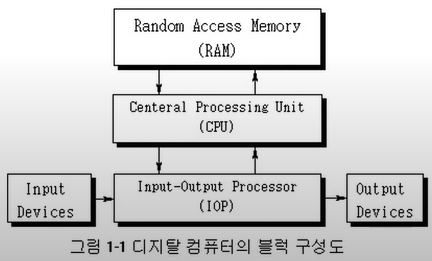

영상: [CSA2021 컴퓨터시스템구조](https://www.youtube.com/playlist?list=PLc8fQ-m7b1hCHTT7VH2oo0Ng7Et096dYc)

## 강의 소개
- 

## [제 1장 Part-1](https://www.youtube.com/watch?v=SG89LOgT7Vc&list=PLc8fQ-m7b1hCHTT7VH2oo0Ng7Et096dYc&index=2)

### 디지털 컴퓨터(Digitial Computer)

- 정의
  - **이진 시스템**을 사용하여 계산을 수행하는 디지털 시스템
  - 비트의 그룹을 사용하여 숫자, 문자 및 기타 정보를 표시하거나 처리
- 컴퓨터 하드웨어
  - `CPU` - 중앙 처리 장치. **컴퓨터 그 자체**. 산술 논리 처리와 데이터의 저장, 제어 기능 수행
  - 주변장치 - 메모리(RAM/ROM), 저장장치(Storage), 입출력 장치(IO devices)
- 컴퓨터 소프트웨어
  - `운영체제`
    - OS - Operating System
  - `시스템프로그램`
    - 유틸리티, 데이터베이스, Editor
    - OS에 포함되거나 연결되어 시스템 운영을 보조
  - `응용프로그램`

### 논리 게이트(Logic Gates)
- 이진 정보의 표시
  - **0과 1의 전압 신호**
  - **(0V - 5V) 시스템**
  - (0.5V - 3V) 시스템
- 논리 게이트
  - 기본 게이트
  - 진리표로 동작 정의

  - 

### [부울 대수(Boolean Algebra)](/이산-수학/명제,추론,귀납,부울대수/부울-대수.md)
- 이진 변수와 논리 동작을 취급하는 대수
- 기본 대수 동작 : AND, OR, NOT
- 부울 대수의 예
  - `F = x + y'z (y를 not한것을 z와 and한 결과를, x와 or한 것❕)`
- 부울 대수의 사용 이유
  - 변수 사이의 진리표 관계를 대수적으로 표시
  - 논리도의 입출력 관계를 대수 형식으로 표시
  - 같은 기능을 가진 더 간단한 회로 발견
- 부울 대수의 기본 관계
  - 항등원
    - 집합 S의 임의의 원소 a와 원소 e를 연산한 결과가 a가 될 때 e를 연산에 대한 항등원 이라고 함.
      - `10 + 0 = 10 --> 덧셈에 대한 항등원 0`
      - `10 x 1 = 10 --> 곱셈에 대한 항등원 1`
  - 역원
    - 집합 S의 임의의 원소 a와 x를 연산한 결과가 항등원 e가 될 떄 x를 연산에 대한 a의 역원 이라고 함.
    - 항등원이 나오게 하는 수
      - `10 + -10 = 0 --> 10의 덧셈에 대한 역원 -10`
      - `10 x 1/10 --> 10의 곱셈에 대한 역원 1/10`
  - 교환법칙
  - 결합법칙
  - 드모르강의 법칙

- 부울 대수의 간략화와 등가 회로
  - `F = ABC + ABC' + A'C = AB(C+C') + A'C = AB + A'C`
  - 
- 부울 대수의 보수
  - `F = AB + C'D' + B'D`
  - `F' = (A'+B')(C+D)(B+D')`

### 맵의 간소화 (Karnaugh Map)
- [4강 동치 관계](/이산-수학/이산수학-기초/동치-관계.md)

- 맵 방식의 부울 수식 간소화
  - 부울 함수를 visual diagram을 통하여 간소화
  - **Karnaugh map**, Veitch diagram
  - **Minterm**, Maxterm을 이용한 간소화

- 논리합의 논리곱
  - 1항의 간소화
  - 0항의 간소화
  - 
- 무정의 조건 (Don't Care Condition)
  - 사용하지 않는 항을 활용하여 간소화
  - F = (A,B,C) = Σ(0,2,6)
  - d(A,B,C) = Σ(1,3,5)
  - 
    - F = A' + BC'

## [제 1장 Part-2](https://www.youtube.com/watch?v=gn5z3Un_qqM&list=PLc8fQ-m7b1hCHTT7VH2oo0Ng7Et096dYc&index=3)

### 조합회로 (Combinational Circuit)
- 

### 플립플롭 (Flip-Flop)
- 

### 순차회로 (Sequential Circuit)
- 