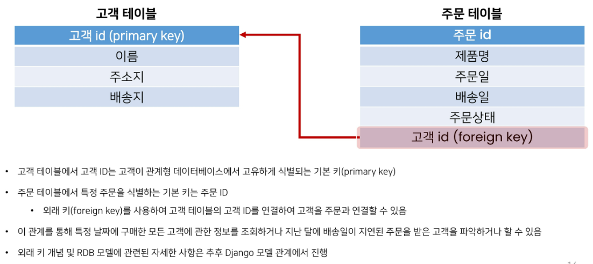
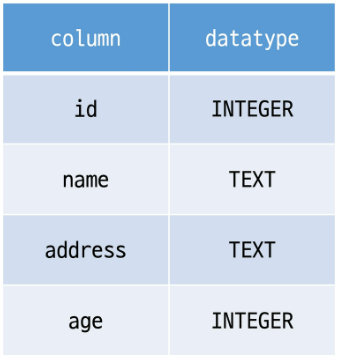
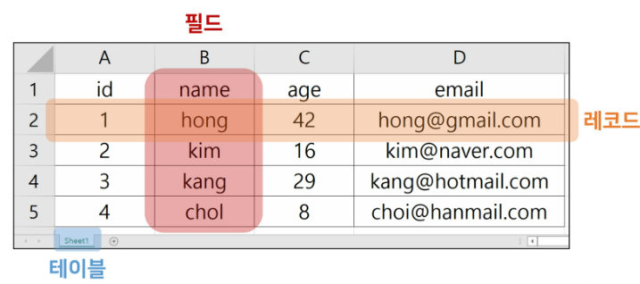
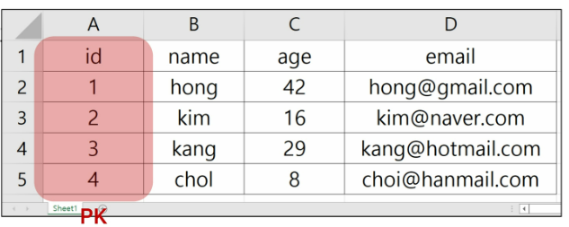
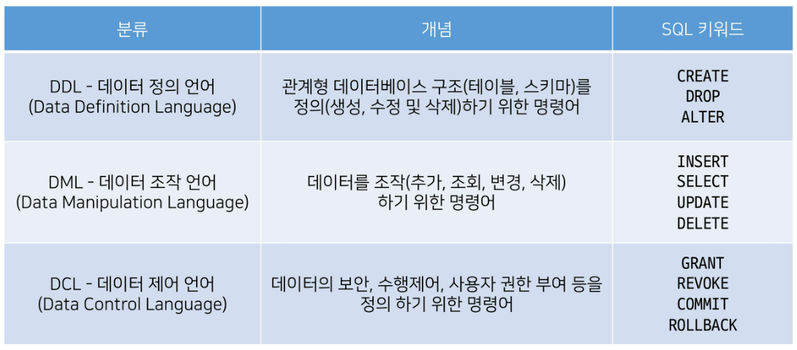
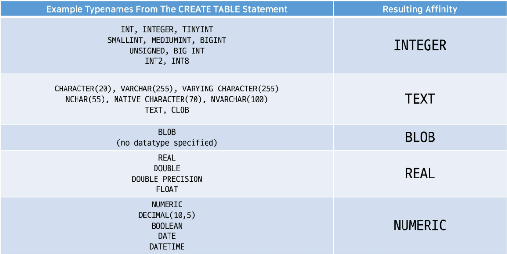
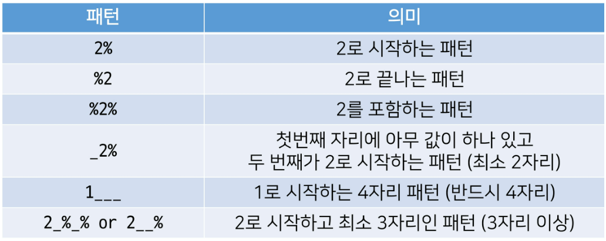

# Database

## Database의 등장
- 파일
- 스프레드 시트
- 데이터 베이스
  - RDB (Relational Database)

## Database 정의
- 체계화된 데이터의 모임
- 여러 사람이 공유하고 사용할 목적으로 통합 관리되는 정보의 집합
- 검색, 구조화 같은 작업을 보다 쉽게 하기 위해 조직화된 데이터를 수집하는 저장 시스템
  - 내용을 고도로 구조화 함으로써 검색과 갱신의 효율화를 꾀한 것
  - 자료 파일을 조직적으로 통합하여 자료 항목의 중복을 없애고 구조화하여 기억시켜 놓은 자료의 집합체
- Database를 조작하는 프로그램 = DBMS(Database Management System)
  - Oracle, MySQL, SQLite
  - DBMS에서 Database를 조작하기 위해 사용하는 언어 : SQL
- 웹 개발에서 대부분 DB는 '관계형 데이터베이스 관리 시스템(RDBMS)'을 사용하여 SQL로 데이터와 프로그래밍을 구성

---
# RDB

## RDB 란
- Relational Database(관계형 데이터베이스)
- 데이터를 테이블, 행, 열 등으로 나누어 구조화
- 자료를 여러 테이블로 나누어 관리, 테이블간 관계를 설정해 여러 데이터를 쉽게 조작 가능
- SQL을 사용하여 데이터를 조회, 조작

> [참고] 테이블간 관계 설정 예시




## RDB 기본 구조
### 스키마(Schema)



- 테이블의 구조(Structure)
- 데이터베이스에서 자료의 구조, 표현방법, 관계 등 전반적인 명세를 기술

### 테이블(Table)



- 필드와 레코드를 사용해 조직된 데이터 요소들의 집합
- 관계(Relation)라고도 부름
1. 필드(field)
- 속성, 컬럼(Column)
2. 레코드(record)
- 튜플, 행(Row)
3. PK (Primary Key)



- 기본키
- 각 레코드의 고유한 값 (각 데이터를 구분할 수 있는 고윳값)
- 기술적으로 다른 항목과 절대 중복 불가한 **단일 값**(unique)

## 관계형 DB의 이점
- 데이터를 직관적으로 표현
- 관련 각 데이터에 쉽게 접근 가능
- 대량 데이터도 효율적 관리

## RDBMS
- Relational Database Management System (관계형 데이터베이스 관리 시스템)
- 관계형 데이터베이스를 만들고 업데이트하고 관리하는 데 사용하는 프로그램
- ex) **SQLite**, MySQL, PostgreSQL, Microsoft SQL Server, Oracle Database 등

## SQLite
- 응용 프로그램에 파일 형식으로 넣어 사용하는 비교적 가벼운 데이터베이스
- 안드로이드, iOS, macOS에 기본적으로 탑재
- 임베디드 소프트웨어에서도 많이 활용
- 오픈소스 프로젝트이기때문에 자유롭게 사용가능
- 단점
  - 대규모 동시 처리작업은 적합X
  - 다른 RDBMS에서 지원하는 SQL기능을 지원하지 않을 수 있음
- 학습 이유
  - 어떤 환경에서나 실행가능한 호환성
  - 데이터 타입이 비교적 적고 강하지 않기 때문에 유연한 학습 환경 제공
  - Django Framework 기본 데이터베이스

---

# SQL

## SQL 이란
- "Structured Query Language"
- RDBMS의 데이터를 관리하기 위해 설계된 **특수 목적 프로그래밍 언어**
- RDBMS에서 데이터베이스 스키마를 생성 및 수정 가능
- 테이블에서의 자료 검색 및 관리 가능
- 데이터베이스 객체에 대한 처리를 관리하거나 접근 권한을 설정하여 허가된 사용자만 RDBMS를 관리하도록 할 수 있음
- 많은 데이터베이스 관련 프로그램들이 SQL을 표준으로 채택

## SQL 정리
- SQL은 **데이터베이스와 상호작용하는 방법**

---
# SQL Commands
1. DDL (Data Definition Language)
2. DML (Data Manipulation Language)
3. DCL (Data Control Language)


- SQLite는 파일로 관리되는 DB이기 때문에 SQL을 이용한 접근 제한이 아닌 운영체제의 파일 접근 권한으로만 제어가능
- 그래서 SQLite에는 권한 설정을 담당하는 GRANT(권한부여)와 REVOKE(권한회수)는 지원하지 않아 DCL 부분은 생략

---
# SQL Syntax
```sql
SELECT column_name FROM table_name;
```

- 모든 SQL문(statement)는 SELECT, INSERT, UPDATE 등과 같은 키워드로 시작
- 하나의 statement는 세미콜론(;)으로 끝남
  - 세미콜론은 각 SQL문을 구분하는 표준 방법
- SQL 키워드는 대소문자 구분 X
  - 하지만 대문자 작성 권장

## Statement & Clause
- Statement (문)
  - 독립적으로 실행가능한 완전한 코드 조각
  - statement는 clause로 구성
- Clause (절)
  - statement의 하위 단위

---

# DDL
- "Data definition"
- SQL 데이터 정의 언어를 사용하여 테이블 데이터베이스 개체를 만드는 방법 학습
- 테이블 구조를 관리
  - CREATE, ALTER, DROP

# CREATE TABLE statement
- "Create a new table in the database."
- 데이터베이스에 새 테이블 만듦
- id 컬럼은 우리가 직접 기본키 역할의 컬럼을 정의하지 않으면 자동으로 **rowid** 라는 컬럼으로 만들어짐
```sql
CREATE TABLE table_name (
    column_1 data_type constraints, -- 컬럼 정의 (스키마)
    column_2 data_type constraints,
    column_3 data_type constraints
);
```
```sql
CREATE TABLE contacts (
    name TEXT NOT NULL,
    age INTEGER NOT NULL,
    email TEXT NOT NULL UNIQUE
);
```

## SQLite Data Types
### Data Types 종류
1. NULL
   - NULL value
   - 정보가 없거나 알 수 없음 (missing information or unknown)
2. INTEGER
   - 정수
   - 크기에 따라 0,1,2,3,4,6 또는 8바이트와 같은 가변 크기를 가짐
3. REAL
   - 실수
   - 8바이트 부동 소수점을 사용하는 10진수 값이 있는 실수
4. TEXT
   - 문자 데이터
5. BLOB (Bianary Large Object)
   - 입력된 그대로 저장된 데이터 덩어리 (대용 타입x)
   - 바이너리 등 멀티미디어 파일
   - ex) 이미지 데이터

> [참고]
1. Boolean type
   - SQLite에는 별도의 Boolean 타입이 없음
   - Boolean값은 정수 0(false)과 1(true)로 저장됨
2. Date & Time Datatype
   - SQLite에는 날짜 및 시간을 저장하기 위한 타입 x
   - SQLite의 built-in "Date And Time Functions"으로 TEXT, REAL 또는 INTEGER 값으로 저장할 수 있음
3. Binary Data
   - 데이터의 저장과 처리를 목적으로 0과 1의 이진형식으로 인코딩 된 파일
   - 기본적으로 컴퓨터의 모든 데이터는 binary data
   - 다만, 이를 필요에 따라 텍스트 타입으로 변형해서 사용

### SQLite는 다음 규칙을 기반으로 데이터 타입을 결정
- 값에 둘러싸는 따옴표와 소수점 또는 지수가 없으면 -> INTEGER
- 값이 작은 따옴표나 큰따옴표로 묶이면 -> TEXT
- 값에 따옴표나 소수점, 지수가 없으면 -> REAL 
- 값이 따옴표 없이 NULL이면 -> NULL

### SQLite Datatypes 특징
- SQLite는 다른 모든 SQL 데이터베이스 엔진(MySQL, PostgreSQL 등)의 정적이고 엄격한 타입(static, rigid typing)이 아닌
- **"동적 타입 시스템(dynamic type system)"**을 사용
  - 컬럼에 선언된 데이터 타입에 의해서가 아닌, **컬럼에 저장된 값에 따라 데이터 타입이 결정**

- 테이블을 생성할 때 컬럼에 대해 특정 데이터 타입을 선언하지 않아도 됨
  - 동일 컬럼에 정수 1을 넣을 경우 INTEGER로 타입이 지정되고, 문자 '1'을 넣을 경우는 TEXT 타입으로 지정됨
  - 이러한 SQLite의 동적 타입 시스템을 사용하면 기존에 엄격하게 타입이 지정된 데이터베이스에서는 불가능한 작업을 유연하게 수행 가능
  - 게다가 정적 타입 시스템이 지정된 데이터베이스에서 작동하는 SQL문이 SQLite에서 동일 방식으로 작동
  - 다만 이는 다른 데이터베이스와의 호환성 문제가 있기에, 테이블 생성시 결국 **데이터 타입을 지정하는 것을 권장**!

- 데이터 타입을 지정하게 되면 SQLite는 입력된 데이터의 타입을 지정된 데이터 타입으로 변환
  - TEXT 타입 컬럼에 정수 1을 저장하면 문자 타입 '1'로 저장됨
  - 허용 가능 타입 변환
  - 

- [참고] "static, rigid typing" 데이터베이스
  - statically, rigidly typed databases 라고도 부름
  - 저장되는 값의 데이터 타입은 컬럼에 선언된 데이터 타입에 의해 결정
  - ```sql
      CREATE TABLE my_table(
        a INTEGER NOT NULL,
        b TEXT NOT NULL,
      );
    ```
  - a 컬럼에 '123', b 컬럼에 456 데이터를 삽입하려는 경우, 삽입 수행 전에 문자열 '123'd을 정수 123으로, 정수 456을 문자열 '456'으로 변환

### Type Affinity



- "타입 선호도"
- 특정 컬럼에 저장된 데이터에 권장되는 타입
- 데이터 타입 작성 시 SQLite의 5가지 데이터 타입이 아닌 다른 데이터 타입을 선언한다면, 내부적으로 각 타입의 지정된 선호도에 따라 5가지 선호도로 인식됨
1. INTEGER
2. TEXT
3. BLOB
4. REAL
5. NUMERIC
- 타입 선호도 존재 이유
  - 다른 데이터베이스 엔진 간의 **호환성** 최대화
  - 정적이고 엄격한 타입을 사용하는 데이터베이스의 SQL문을 SQLite에서도 작동하도록 하기 위함

## Constraints
### 1. NOT NULL
- 컬럼이 NULL 값을 허용하지 않도록 지정
- 기본적으로 테이블의 모든 컬럼은 NOT NULL 제약 조건을 명시적으로 사용하는 경우를 제외하고는 NULL 값을 허용함
### 2. UNIQUE
- 컬럼의 모든 값이 서로 구별되거나 고유한 값이 되도록 함
```sql
CREATE TABLE contacts (
    name TEXT NOT NULL,
    age INTEGER NOT NULL,
    email TEXT NOT NULL UNIQUE
);
```
### 3. PRIMARY KEY
- 테이블에서 행의 고유성을 식별하는 데 사용되는 컬럼
- 각 테이블에는 하나의 기본 키만 있음
- 암시적으로 NOT NULL 제약 조건이 포함됨
- INTEGER 타입에만 사용 가능 (INT BIGINT 등 불가능)
```sql
CREATE TABLE table_name (
    id INTEGER PRIMARY KEY,
    ..
);
```
### 4. AUTOINCREMENT
- 사용되지 않은 값이나 이전에 삭제된 행의 값을 재사용하는 것을 방지
- INTEGER PRIMARY KEY 다음에 작성하면 해당 rowid를 다시 재사용하지 못하도록 함
- Django에서 테이블 생성시 id컬럼에 기본적으로 사용하는 제약조건
```sql
CREATE TABLE table_name (
    id INTEGER PRIMARY KEY AUTOINCREMENT,
    ..
);
```

### rowid의 특징
- 테이블 생성시 마다 rowid라는 암시적 자동 증가 컬럼이 자동 생성
- 테이블 행을 고유하게 식별하는 64비트 부호있는 정수 값
- 테이블에 새 행 삽입시 마다 정수 값을 자동으로 할당
  - 값은 1부터
  - 데이터 삽입시에 rowid또는 INTEGER PRIMARY KEY컬럼에 명시적으로 값이 지정되지 않은 경우, SQLite는 테이블에서 가장 큰 rowid보다 하나 큰 다음 순차 정수를 자동 할당 (AUTOINCREMENT 관계없이)
- 만약 INTEGER PRIMARY KEY 키워드를 가진 컬럼을 직접 만들면 이 컬럼은 rowid 컬럼의 별칭 (alias)이 됨
- 즉, 새 컬럼 이름으로 rowid에 액세스 할 수 있으며 rowid 이름으로도 여전히 액세스 가능
- 데이터가 최대 값에 도달하고 새 행을 삽입하려고 하면 SQLite는 사용되지 않는 정수를 찾아 사용
- 만약 SQLite가 사용되지 않은 정수를 찾을 수 없으면 SQLITE_FULL 에러 발생
- 일부 행을 삭제하고 새 행을 삽입하면 SQLite는 삭제된 행에서 rowid 값을 재사용하려고 시도 (AUTOINCREMENT가 없다면)


# ALTER TABLE
- "Modify the structure of an existing table."
- 기존 테이블의 구조를 수정(변경)
- SQLite의 ALTER TABLE문을 사용하면 기존 테이블을 다음과 같이 변경 가능
  - **Rename** a table (테이블명 변경)
  - **Rename** a column (컬럼명 변경)
  - **Add** a new column to a table (새 컬럼 추가)
  - **Delete** a column (컬럼 삭제)

```sql
-- 1. Rename a table
ALTER TABLE table_name RENAME TO new_table_name;
-- 예시
ALTER TABLE contacts RENAME TO new_contacts;

-- 2. Rename a column
ALTER TABLE table_name RENAME COLUMN column_name TO new_column_name;
-- 예시
ALTER TABLE new_contacts RENAME COLUMN name TO last_name;

-- 3. Add a new column to a table
ALTER TABLE table_name ADD COLUMN column_definition;
-- 예시
ALTER TABLE new_contacts ADD COLUMN address TEXT NOT NULL;

-- 4. Delete a column
ALTER TABLE table_name DROP COLUMN column_name;
-- 예시
ALTER TABLE new_contacts DROP COLUMN address;
```

> ALTER TABLE ADD COLUMN에서 만약 테이블에 기존 데이터가 있을 경우 에러 발생
- ```sql
    Cannot add NOT NULL column with default value NULL
  ```
- 이전에 이미 저장된 데이터들은 새롭게 추가되는 컬럼에 값이 없기에 NULL이 작성됨
- 그런데 새로 추가되는 컬럼에 NOT NULL 제약조건이 있기때문에 기본 값 없이는 추가될 수 없다는 에러 발생
- **DEFAULT** 제약 조건 (column 제약조건 중 하나로, 데이터 추가할 때 값을 생략 시에 기본값을 설정) 을 사용하여 해결 가능
- ```sql
    ALTER TABLE new_contacts ADD COLUMN address TEXT NOT NULL DEFAULT 'no address';
  ```
- 이렇게 하면 address 컬럼이 추가되면서 기존에 있던 데이터들의 address 컬럼 값은 'no address'가 됨

> ALTER TABLE DROP COLUMN 에서 삭제하지 못하는 경우 존재
- 컬럼이 다른 부분에서 참조되는 경우
  - FOREIGN KEY(외래키) 제약 조건에서 사용되는 경우
  - PRIMARY KEY인 경우
  - UNIQUE 제약 조건이 있는 경우
  - ```sql
      ALTER TABLE new_contacts DROP COLUMN email;
      Cannot drop UNIQUE column: "email"
    ```


# DROP TABLE
- "Remove a table from the database."
- 데이터베이스에서 테이블을 제거
```sql
DROP TABLE table_name;
-- 예시
DROP TABLE new_contacts;
```
- 존재하지 않는 테이블을 제거하면 SQLite에서 오류 발생
```sql
no such table: table_name
```
- 한번에 하나의 테이블만 삭제 가능
- 여러 테이블 제거하려면 여러 DROP TABLE 문 실행
- DROP TABLE 문은 실행 취소하거나 복구 불가
- 각별히 주의하여 수행

# DDL 정리
- "데이터 정의 언어"
- CREATE TABLE
  - 데이터 타입과 제약 조건
- ALTER TABLE
  - RENAME
  - RENAME COLUMN
  - ADD COLUMN
  - DROP COLUMN
- DROP TABLE

---

# DML
- DML을 통해 데이터 조작하기 (CRUD)
- INSERT (C), **SELECT** (R), UPDATE (U), DELETE (D)

# Simple query
- **SELECT**문 사용하여 간단하게 단일 테이블에서 데이터 조회
```sql
SELECT column1, column2 FROM table_name;
```
- "Query data from a table"
- 특정 테이블에서 데이터를 조회하기 위해 사용
- 문법 규칙
  - SELECT 절에서 컬럼 또는 쉼표로 구분된 컬럼 목록을 지정
  - FROM 절(clause)에서 데이터를 가져올 테이블을 지정

## SELECT statement 실습
### 이름과 나이 조회하기
```sql
SELECT first_name, age
FROM users;
```

### 전체 데이터 조회하기
```sql
SELECT * FROM users;
```

### rowid 컬럼 조회
```sql
SELECT rowid, first_name FROM users;
```

# Sorting rows
- **ORDER BY**절을 사용하여 쿼리 결과 정렬
```sql
SELECT select_list FROM table_name
ORDER BY column_1 ASC, column_2 DESC;
```
- "Sort a result set of a query"
- SELECT 문에 추가하여 결과를 정렬
- ORDER BY 절은 FROM 절 뒤에 위치
- 하나 이상의 컬럼을 기준으로 결과를 오름차순, 내림차순 정렬 가능
  - ASC : 오름차순 (기본값)
  - DESC : 내림차순 

## ORDER BY clause 실습
### 이름과 나이를 나이가 어린 순서대로 조회하기
```sql
SELECT first_name, age FROM users
ORDER BY age ASC;
```
### 이름과 나이를 나이가 많은 순서대로 조회하기
```sql
SELECT first_name, age FROM users
ORDER BY age DESC;
```
### 이름, 나이, 계좌 잔고를 나이가 어린순으로, 만약 같은 나이라면 계좌 잔고가 많은 순으로 정렬해서 조회하기
```sql
SELECT first_name, age, balance FROM users
ORDER BY age ASC, balance DESC;
```
- ORDER BY절은 하나 이상의 컬럼을 정렬할 경우 첫번째 열을 사용하여 행을 정렬하고,
- 그런 다음 두번째 컬럼을 사용하여 정렬 되어있는 행을 정렬하는 방식
- 즉, 먼저 age를 기준으로 오름차순 정렬하고, 이 결과를 balance를 기준으로 내림차순 정렬한 것

> [참고] Sorting NULLs
- NULL의 정렬 방식
- 정렬과 관련하여 SQLite는 NULL을 다른 값보다 작은 것으로 간주
- 즉, ASC를 사용하는 경우 결과의 시작부분에 NULL이 표시되고,
- DESC를 사용하는 경우 결과 끝에 NULL이 표시됨


# Filtering data
- 데이터를 필터링하여 중복 제거, 조건 설정 등 쿼리를 제어하기
- Clause
  - SELECT DISTINCT
  - WHERE
  - LIMIT
- Operator
  - LIKE
  - IN
  - BETWEEN

## **SELECT DISTINCT** clause
```sql
SELECT DISTINCTT select_list FROM table_name;
```
- "Remove duplicate rows in the result"
- 조회 결과에서 중복된 행을 제거
- DISTINCT 절은 SELECT 에서 선택적으로 사용가능한 절
- 문법규칙
  - DISTINCT 절은 SELECT 키워드 바로 뒤에 나타나야함
  - DISTINCT 키워드 뒤에 컬럼 또는 컬럼 목록을 작성

## SELECT DISTINCT 실습
### 모든 지역 조회하기
```sql
SELECT country FROM users;
```

### 중복없이 모든 지역 조회하기
```sql
SELECT DISTINCT country FROM users;
```

### 지역 순으로 오름차순 정렬하여 중복없이 모든 지역 조회하기
```sql
SELECT DISTINCT country FROM users
ORDER BY country;
```

### 이름과 지역이 중복없이 모든 이름과 지역 조회하기
```sql
SELECT DISTINCT first_name, country FROM users;
```
- 각 컬럼의 중복을 따로 계산하는 것이 아니라 두 컬럼을 하나의 집합으로 보고 중복을 제거!

### 이름과 지역 중복없이 지역 순으로 오름차순 정렬하여 모든 이름과 지역 조회하기
```sql
SELECT DISTINCT first_name, country FROM users
ORDER BY country;
```

> [참고] NULL with DISTINCT
- SQLite는 NULL 값을 중복으로 간주
- NULL 값이 있는 컬럼에 DISTINCT 절을 사용하면 SQLite는 NULL값의 한 행을 유지

## **WHERE** clause
```sql
SELECT column_list FROM table_name
WHERE search_condition;
```
- "Specify the search condition for rows returned by the query"
- 조회 시 특정 검색 조건을 지정
- WHERE 절은 SELECT 문에서 선택적으로 사용가능 한 절
  - SELECT 문 외에도 UPDATE 및 DELETE 문에서 WHERE 절을 사용 가능함
  - FROM 절 뒤에 작성

### WHERE의 검색 조건 작성 형식
```
left_expression [COMPARISON_OPERATOR] right_expression
```

```sql
WHERE column_1 = 10
WHERE column_2 LIKE 'Ko%'
WHERE column_3 IN (1,2)
WHERE column_4 BETWEEN 10 AND 20
```

### SQLite comparison operators (비교연산자)
- 두 표현식이 동일한지 테스트
  - '='
  - '<>' or '!='
  - '<'
  - '>'
  - '<='
  - '>='

### SQLite logical operators (논리연산자)
- 일부 표현식의 truth를 테스트할 수 있음
- 1,0 또는 NULL 값 반환
- SQLite는 Boolean 데이터 타입을 제공하지 않으므로 1은 TRUE를 의미하고 0은 FALSE를 의미
- ALL, AND, ANY, BETWEEN, IN, LIKE, NOT, OR 등

## WHERE 실습

### 나이가 30살 이상인 사람들의 이름, 나이, 계좌 잔고 조회하기
```sql
SELECT first_name, age, balance FROM users
WHERE age >= 30;
```

### 나이가 30살 이상이고 계좌 잔고가 50만원 초과인 사람들의 이름, 나이, 계좌 잔고 조회하기
```sql
SELECT first_name, age, balance FROM users
WHERE age >= 30 AND balance > 500000;
```

## **LIKE** operator
- "Query data based on pattern matching"
- 패턴 일치를 기반으로 데이터를 조회
- SELECT, DELETE, UPDATE 문의 WHERE 절에서 사용
- 기본적으로 대소문자를 구분하지 않음
  - 'A' LIKE 'a'는 true
- SQLite는 패턴 구성을 위한 두개의 와일드카드(wildcards) 제공
  - % (percent)
    - 0개 이상의 문자가 올 수 있음
  - _ (underscore)
    - 단일(1개) 문자가 있음을 의미

### '%' wildcard 예시
- '영%' 패턴은 영으로 시작하는 모든 문자열과 일치 (영, 영미, 영미리 등)
- '%도' 패턴은 도로 끝나는 모든 문자열과 일치 (도, 수도, 경기도 등)
- '%강원%' 패턴은 강원을 포함하는 모든 문자열과 일치 (강원, 강원도, 강원도에 살아요 등)

### '_' wildcard 예시
- '영_' 패턴은 영으로 시작하고 총 2자리인 문자열과 일치 (영미, 영수, 영호 등)
- '_도' 패턴은 도로 끝나고 총 2자리인 문자열과 일치 (수도, 과도 등)



> [참고] "wildcards" character
- 파일을 지정할 때, 구체적인 이름 대신에 여러 파일을 동시에 지정할 목적으로 사용하는 특수 기호
  - '*', '?' 등
- 주로 특정한 패턴이 있는 문자열 혹은 파일을 찾거나, 긴 이름을 생략할 때 쓰임
- 텍스트 값에서 알 수 없는 문자를 사용할 수 있는 특수 문자로, 유사하지만 동일한 데이터가 아닌 여러 항목을 찾기에 매우 편리한 문자
- 지정된 패턴 일치를 기반으로 데이터를 수집하는 데도 도움이 될 수 있음


## LIKE 실습

### 이름에 '호'가 포함되는 사람들의 이름과 성 조회하기
```sql
SELECT first_name, last_name FROM users
WHERE first_name LIKE '%호%';
```

### 이름이 '준'으로 끝나는 사람들의 이름 조회하기
```sql
SELECT first_name FROM users
WHERE first_name LIKE '%준';
```

### 서울 지역 전화번호를 가진 사람들의 이름과 전화번호 조회하기
```sql
SELECT first_name, phone FROM users
WHERE phone LIKE '02-%';
```

### 나이가 20대인 사람들의 이름과 나이 조회하기
```sql
SELECT first_name, age FROM users
WHERE age LIKE '2_';
```

### 전화번호 중간 4자리가 51로 시작하는 사람들의 이름과 전화번호 조회하기
```sql
SELECT first_name, phone FROM users
WHERE phone LIKE '%-51__-%'
```


## **IN** operator
- "Determine whether a value matches any value in a list of values"
- 값이 값 목록 결과에 있는 값과 일치하는지 확인
- 표현식이 값 목록의 값과 일치하는지 여부에 따라 true 또는 false를 반환
- IN 연산자의 결과를 부정하려면 **NOT IN** 연산자를 사용

## IN 실습

### 경기도 혹은 강원도에 사는 사람들의 이름과 지역 조회하기
```sql
SELECT first_name, country FROM users
WHERE country IN ('경기도','강원도');

SELECT first_name, country FROM users
WHERE country ='경기도' or country = '강원도';
```

### 경기도 혹은 강원도에 살지 않는 사람들의 이름과 지역 조회하기
```sql
SELECT first_name, country FROM users
WHERE country NOT IN ('경기도','강원도');
```


## **BETWEEN** operator
```
text_expression BETWEEN low_expression AND high_expression
```
- "Test whether a value is in a range of values."
- 값이 값 범위에 있는지 테스트
- 값이 지정된 범위에 있으면 true를 반환
- SELECT, DELETE, 및 UPDATE 문의 WHERE 절에서 사용 가능
- BETWEEN 연산자의 결과를 부정하려면 **NOT BETWEEN** 연산자를 사용 

## BETWEEN 실습

### 나이가 20살 이상, 30살 이하인 사람들의 이름과 나이 조회하기
```sql
SELECT first_name, age FROM users
WHERE age BETWEEN 20 AND 30;

SELECT first_name, age FROM users
WHERE age>=20 AND age<=30;
```

### 나이가 20살 이상, 30살 이하가 아닌 사람들의 이름과 나이 조회하기
```sql
SELECT first_name, age FROM users
WHERE age NOT BETWEEN 20 AND 30;

SELECT first_name, age FROM users
WHERE age<20 OR age>30;
```

## LIMIT clause
```sql
SELECT column_list FROM table_name LIMIT row_count;
```
- "Constrain the number of rows returned by a query."
- 쿼리에서 반환되는 행 수를 제한
- SELECT 문에서 선택적으로 사용할 수 있는 절
- row_count는 반환되는 행 수를 지정하는 양의 정수를 의미

## LIMIT 실습

### 첫 번째부터 열 번째 데이터까지 rowid와 이름 조회하기
```sql
SELECT rowid, first_name FROM users
LIMIT 10;
```

### 계좌 잔고가 가장 많은 10명의 이름과 계좌 잔고 조회하기
```sql
SELECT first_name, balance FROM users
ORDER BY balance DESC LIMIT 10;
```
- ORDER BY 절과 함께 사용하여 지정된 순서로 여러 행을 가져 올 수도 있음
- LIMIT 절에 지정된 행 수를 가져오기 전에 결과를 정렬하기 때문

### 나이가 가장 어린 5명의 이름과 나이 조회하기
```sql
SELECT first_name, age FROM users
ORDER BY age LIMIT 5;
```


## OFFSET keyword
- LIMIT 절을 사용하면 첫 번째 데이터부터 지정한 수 만큼의 데이터를 받아올 수 있지만, OFFSET과 함께 사용하면 특정 지정된 위치에서부터 데이터를 조회 가능
- 11번째부터 20번째 데이터의 rowid와 이름 조회하기
```sql
SELECT rowid, first_name FROM users
LIMIT 10 OFFSET 10;
```


# Grouping data

## **GROUP BY** clause
```sql
SELECT column_1, aggregate_function(column2)
FROM table_name
GROUP BY column_1, column_2;
```
- "Make a set of summary rows from a set of rows."
- 특정 그룹으로 묶인 결과를 생성
- 선택된 컬럼 값을 기준으로 데이터(행)들의 공통 값을 묶어서 결과로 나타냄
- SELECT 문에서 선택적으로 사용가능한 절
- SELECT 문의 FROM 절 뒤에 작성
  - WHERE 절이 포함된 경우 WHERE 절 뒤에 작성
- 각 그룹에 대해 MIN, MAX, SUM, COUNT 또는 AVG와 같은 집계 함수 (aggregate function)를 적용하여 각 그룹에 대한 추가적인 정보를 제공 가능

## Aggregate function
- "집계 함수"
- 값 집합의 최대값, 최소값, 평균, 합계 및 개수를 계산
- 값 집합에 대한 계산을 수행하고 단일 값을 반환
  - 여러 행으로부터 하나의 결과 값을 반환하는 함수
- SELECT 문의 GROUP BY 절과 함께 종종 사용됨
- 제공하는 함수 목록
  - AVG(), COUNT(), MAX(), MIN(), SUM()
- AVG(), MAX(), MIN(), SUM()는 숫자를 기준으로 계산이 되어져야 하기 때문에 반드시 컬럼의 데이터 타입이 숫자(INTEGER)일 때만 사용 가능

```sql
-- users 테이블의 전체 행 수 조회하기
SELECT COUNT(*) FROM users;

-- 나이가 30살 이상인 사람들의 평균 나이 조회하기
SELECT AVG(age) FROM users WHERE age>=30;

-- 각 지역별로 몇 명씩 살고 있는지 조회하기
SELECT country, COUNT(*) FROM users GROUP BY country;
-- 각 지역별로 그룹이 나뉘어졌기 때문에 COUNT(*)는 지역별 데이터 개수를 세게 됨
```

> [참고] COUNT 참고사항
- 이전 쿼리에서 COUNT(), COUNT(age), COUNT(last_name) 등 어떤 컬럼을 넣어도 결과는 같음
- 현재 쿼리에서는 그룹화된 country를 기준으로 카운트 하는 것이기 때문에 어떤 컬럼을 카운트해도 전체 개수는 동일


## GROUP BY 실습

### 각 성씨가 몇 명씩 있는지 조회하기
```sql
SELECT last_name, COUNT(*) AS number_of_name FROM users
GROUP BY last_name; 
-- AS 키워드 사용해 컬럼명을 임시로 변경하여 조회 가능
```

### 인원이 가장 많은 성씨 순으로 조회하기
```sql
SELECT last_name, COUNT(*) FROM users
GROUP BY last_name
ORDER BY COUNT(*) DESC;
```

### 각 지역별 평균 나이 조회하기
```sql
SELECT country, AVG(age) FROM users
GROUP BY country;
```


# Changing data
- 데이터를 삽입, 수정, 삭제하기
  - INSERT
  - UPDATE
  - DELETE

> 사전 준비
- 실습 편의 위해 새 테이블 생성
```sql
CREATE TABLE classmates (
    name TEXT NOT NULL,
    age INTEGER NOT NULL,
    address TEXT NOT NULL
);
```

## **INSERT** statement
```sql
INSERT INTO table_name (column1, column2, ...)
VALUES (value1, value2, ...);
```
- "Insert new rows into a table."
- 새 행을 테이블에 삽입
- 문법 규칙
  - 먼저 INSERT INTO 키워드 뒤에 데이터를 삽입할 테이블의 이름을 지정
  - 테이블 이름 뒤에 쉼표로 구분된 컬럼 목록 추가
    - 컬럼 목록은 선택 사항이지만 컬럼 목록을 포함하는 것이 권장됨
  - VALUES 키워드 뒤에 쉼표로 수분된 값 목록 추가
    - 만약 컬럼 목록을 생략하는 경우 값 목록의 모든 컬럼에 대한 값을 지정해야 함
    - 값 목록의 값 개수는 컬럼 목록의 컬럼 개수와 같아야 함

### INSERT 사용해보기
- 단일 행 삽입하기
```sql
INSERT INTO classmates (name, age, address)
VALUES ('홍길동', 23, '서울');

INSERT INTO classmates
VALUES ('홍길동', 23, '서울');
```
- 여러 행 삽입하기
```sql
INSERT INTO classmates
VALUES
    ('김철수',30,'경기'),
    ('이영미',31,'강원'),
    ('박진성',26,'전라'),
    ('최지수',12,'충청'),
    ('정요한',28,'경상');
```

## **UPDATE** statement
```sql
UPDATE table_name
SET column_1 = new_value_1,
    column_2 = new_value_2
WHERE
    search_condition;
```
- "Update existing rows in a table."
- 테이블에 있는 기존 행의 데이터를 업데이트
- 문법 규칙
  - UPDATE 절 이후에 업데이트 할 테이블을 지정
  - SET 절에서 테이블의 각 컬럼에 대해 새 값을 설정
  - WHERE 절의 조건을 사용하여 업데이트 할 행을 지정
    - WHERE 절은 선택 사항이며, 생략하면 UPDATE문은 테이블의 모든 행에 있는 데이터를 업데이트함
  - 선택적으로 ORDER BY 및 LIMIT 절을 사용하여 업데이트할 행 수를 지정 가능

## UPDATE 실습

### 2번 데이터의 이름을 '김철수한무두루미', 주소를 '제주도'로 수정하기
```sql
UPDATE classmates 
SET name="김철수한무두루미",
    address="제주도"
WHERE rowid = 2;
```

## DELETE statement
```sql
DELETE FROM table_name
WHERE search_condition
```
- "Delete rows from a table."
- 테이블에서 행을 제거
- 테이블의 한 행, 여러 행 및 모든 행을 삭제 가능
- 문법 규칙
  - DELETE FROM 키워드 뒤에 행을 제거하려는 테이블의 이름 지정
  - WHERE 절에 검색 조건을 추가하여 제거할 행을 식별
    - WHERE 절은 선택 사항이며, 생략하면 DELETE 문은 테이블의 모든 행을 삭제
  - 선택적으로 ORDER BY 및 LIMIT 절을 사용하여 삭제할 행 수를 지정 가능

### DELETE 사용해보기
- 5번 데이터 삭제하기
```sql
DELETE FROM classmates WHERE rowid=5;
```

## DELETE 실습
### 이름에 '영'이 포함되는 데이터 삭제하기
```sql
DELETE FROM classmates
WHERE name LIKE '%영%';
```

### 테이블의 모든 데이터 삭제하기
```sql
DELETE FROM classmates;
```

---

# SUMMARY
- Database
  - RDB
- SQL
- DDL
  - CREATE TABLE
    - Data Type
    - Constraints
  - ALTER TABLE
  - DROP TABLE
- DML
  - SELECT
    - SELECT DISTINCT
  - ORDER BY
  - WHERE
    - LIKE, IN, BETWEEN
  - LIMIT, OFFSET
  - GROUP BY
    - Aggregate Function
  - INSERT / UPDATE / DELETE

## 데이터 구조화의 중요성
- 다루고자 하는 데이터를 구조화해서 저장하면 데이터의 가공 및 확장이 용이
- 모든 서비스는 데이터를 효율적으로 다루는 것이 필수적
  - 빅데이터, 인공지능과 같은 대규모 데이터로부터 의미있는 분석결과를 뽑아낼 수 있음

## 데이터베이스의 미래
- 인터넷에서의 방대한 데이터 수집은 세상을 빠르게 변화
- 저장된 데이터를 분석하고 활용하는 시대
  - 기업들은 이러한 분석을 통해 더나은 의사결정, 기업 확장성과 민첩성 높임
- 데이터에 대한 액세스 및 처리량을 최적화 하는 것이 중요
- 데이터베이스는 점점 자동화 되어 클라우드 기술, 머신러닝 등을 사용해 더 고도화된 데이터를 다루고 처리하게 될 것