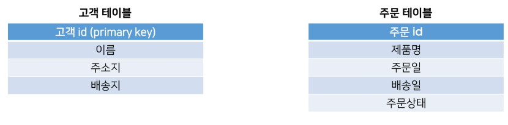
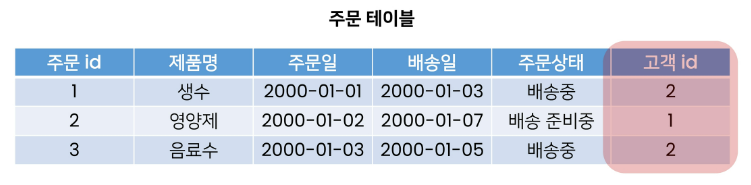
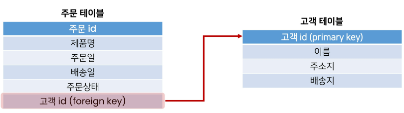
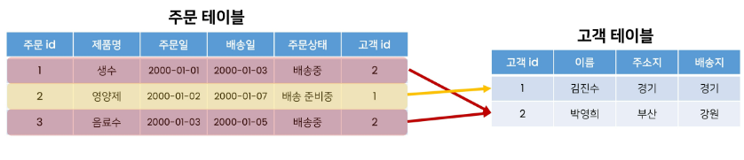
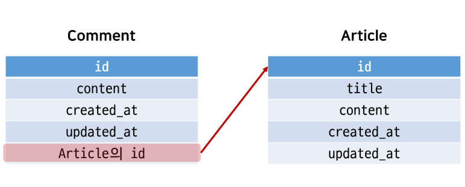
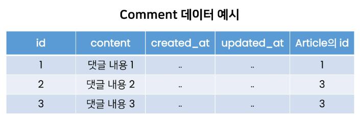
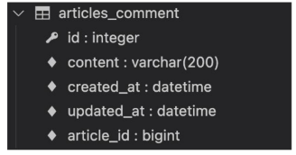
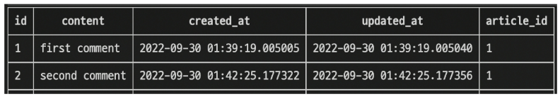

# Database

## A many-to-one relationship
- 관계형 데이터베이스에서의 외래 키 속성을 사용해 모델간 N:1 관계 설정하기

## RDB
- 데이터를 테이블, 행, 열 등으로 나누어 구조화
- RDB의 모든 테이블에는 행에서 고유하게 식별 가능한 기본키 속성이 존재
- **외래키**를 사용하여 각 행에서 서로 다른 테이블 간의 **관계**를 만드는 데 사용 가능

> [참고] 관계 (Relationship)
- 테이블 간의 상호작용을 기반으로 설정되는 여러 테이블 간의 논리적인 연결

## 테이블 간 관계 예시



- 고객테이블에는 고객 데이터 , 주문 테이블에는 주문에 관한 거래 정보
- 배송지 주소를 갖고있는 고객테이블의 정보를 포함해야함



- 주문테이블에서 고객테이블 정보를 포함하려면 고객정보의 기본 키인 **고객 id정보**를 저장
  - 고객이름으로 저장할 경우 이름이 같은 다른 사용자 구분 x
- 이처럼 관계형 데이터베이스에서 한 테이블의 필드 중 다른 테이블의 행을 식별할 수 있는 키를 **외래키(foreign key, FK)**라 함



- 두 테이블은 공유된 고객 id를 기반으로 연결, 다양한 명령 처리 진행 가능


## RDB에서의 관계
1. 1:1
   - One-to-one relationships
   - 한 테이블의 레코드 하나가 다른 테이블의 레코드 단 한개와 관련
2. **N:1**
   - Many-to-one relationships
   - 한 테이블 (주문) 의 0개 이상의 레코드가 다른 테이블 (고객) 의 레코드 한 개와 관련된 경우
   - 기준 테이블에 따라 (1:N, One-to-many relationships)이라고도 함
3. M:N
   - Many-to-many relationships
   - 한 테이블의 0개 이상의 레코드가 다른 테이블의 0개 이상의 레코드와 관련된 경우
   - 양쪽 모두에서 N:1 관계를 가짐


## Many-to-one relationships 예시



- 여러 개의 주문 입장에서, 각각 어떤 주문에 속해 있는지 표현해야함
- 고객 테이블의 PK를 주문 테이블에 FK로 집어 넣어 관계를 표현
- 고객(1)은 여러 주문(N)을 진행 가능
  - 만약 고객이 단 한개의 주문만 생성할 수 있다면 두 테이블은 1:1 관계


## Foreign Key

### 개념
- 외래키 (외부키)
- 관계형 데이터베이스에서 한 테이블의 필드 중 다른 테이블의 행을 식별할 수 있는 키
- **참조하는 테이블**에서 **1개의 키**에 해당하고, 이는 **참조되는 측 테이블**의 **기본키(Primary Key)**를 가리킴
- 참조하는 테이블의 행 1개의 값은, 참조되는 측 테이블의 행 값에 대응됨
  - 이 때문에 참조하는 테이블의 행에는, **참조되는 테이블에 나타나지 않는 값을 포함할 수 없음**
- 참조하는 테이블 행 여러개가, **참조되는 테이블의 동일한 행을 참조 가능**

### 특징
- 키를 사용하여 부모 테이블의 유일한 값을 참조 (by **참조 무결성**)
- 외래키의 값이 반드시 부모테이블의 **기본키일 필요는 없지만**, **유일한 값**이어야함!

> [참고] 참조 무결성
- 데이터베이스 관계 모델에서 관련된 2개 테이블 간의 일관성을 말함
- 외래 키가 선언된 테이블의 외래 키 속성(열)의 값은 그 테이블의 부모가 되는 테이블의 기본 키 값으로 존재해야 함

---

## N:1 (Comment-Article)
### 개요
- Comment(N) - Article(1)
- Comment 모델과 Article 모델 간 관계 설정
- "0개 이상의 댓글은 1개의 게시글에 작성 될 수 있음"

## 모델 관계 설정
- 게시판의 게시글과 N:1 관계를 나타낼 수 있는 댓글 구현
- N:1 관계에서 댓글을 담당할 Comment 모델은 N, Article 모델은 1이 될 것




- 1번 게시글에는 1개의 댓글이, 3번 게시글에는 2개의 댓글이 작성

## Django Relationship fields

1. OneToOneField()
- A one-to-one relationship

2. **ForeignKey()**
- A many-to-one relationship

3. ManyToManyField()
- A many-to-many relationship

### ForeignKey(to, on_delete, **options)
- A many-to-one relationship을 담당하는 Django의 모델 필드 클래스
- Django 모델에서 관계형 데이터베이스의 외래 키 속성을 담당
- 2개의 **필수 위치 인자**가 필요
1. 참조하는 **model class**
2. **on_delete** 옵션


## Comment Model
```python
# articles/models.py

class Comment(models.Model):
    # 참조하는 모델 클래스 이름의 단수형(소문자)
    article = models.ForeignKey(Article, on_delete=models.CASCADE)
    user = models.ForeignKey(settings.AUTH_USER_MODEL, on_delete=models.CASCADE)
    content = models.TextField()
    created_at = models.DateTimeField(auto_now_add=True)
    updated_at = models.DateTimeField(auto_now=True)

    def __str__(self):
        return self.content
```
- 외래 키 필드는 ForeignKey 클래스를 작성하는 위치와 관계없이 필드의 마지막에 작성됨
- **ForeignKey() 클래스의 인스턴스 이름**은 **참조하는 모델 클래스 이름의 단수형(소문자)**으로 작성하는 것을 권장

## ForeignKey arguments - **on_delete**
- 외래 키가 참조하는 객체가 사라졌을 때, 외래 키를 가진 객체를 어떻게 처리할 지를 정의
- 데이터 무결성을 위해서 매우 중요한 설정
- on_delete 옵션 값
  - **CASCADE** : 부모 객체(참조 된 객체)가 삭제 됐을 때 이를 참조하는 객체도 삭제
  - PROTECT, SET_NULL, SET_DEFAULT ... 등 여러 옵션 값들이 존재

> [참고] 데이터 무결성 (Data Integrity)
- 데이터의 정확성과 일관성을 유지하고 보증하는 것
- 데이터베이스나 RDBMS의 중요한 기능
- 무결성 제한의 유형
  - 개체 무결성 (Entity Integrity)
  - 참조 무결성 (Referential Integrity)
  - 범위 무결성 (Domain Integrity)


## Migration 과정 진행
- models.py 에 모델에 대한 수정사항 발생 ->  migration 과정 진행
```python
$ python manage.py makemigrations
```
- 마이그레이션 파일 0002_comment.py 생성 확인
- migrate 진행
```python
$ python manage.py migrate
```


- ForeignKey 모델 필드로 작성된 컬럼의 이름이 **article_id**
- 이와같이 명시적인 모델 관계 파악을 위해 참조하는 클래스 이름의 소문자(단수형)로 작성하는 것이 권장되었음


## 댓글 생성 연습하기
- shell_plus 실행

1. 댓글 생성

```python
$ python manage.py shell_plus

# Comment 클래스의 인스턴스 comment 생성
comment = Comment()

# 인스턴스 변수 저장
comment.content = 'first comment'

# DB에 댓글 저장
comment.save()

# 에러 발생
django.db.utils.IntegrityError: NOT NULL constraint failed: articles_comment.article_id
# articles_comment 테이블의 ForeignKeyField, article_id 값이 저장시 누락되었기 때문

# 게시글 생성 및 확인
article = Article.objects.create(title='title', content='content')
article
=> <Article: title>

# 외래 키 데이터 입력
# 다음과 같이 article 객체 자체를 넣을 수 있음
comment.article = article
# 또는 comment.article_id = article.pk 처럼 pk값을 직접 외래 키 컬럼에 넣어 줄 수도 있으나 권장 x

# DB에 댓글 저장 및 확인
comment.save()
comment
=> <Comment: first comment>
```

2. 댓글 속성 값 확인
```python
comment.pk
=> 1

comment.content
=> 'first comment'

# 클래스 변수명인 article로 조회시 해당 참조하는 게시물 객체를 조회 가능
comment.article
=> <Article: title>

# article_pk는 존재하지 않는 필드이기 때문에 사용 불가
comment.article_id
=> 1
```

3. comment 인스턴스를 통한 article 값 접근하기
```python
# 1번 댓글이 작성된 게시물의 pk 조회
comment.article.pk
=> 1

# 1번 댓글이 작성된 게시물의 content 조회
comment.article.content
=> 'content'
```

4. 두번째 댓글 작성해보기
```python
comment = Comment(content='second comment', article=article)
comment.save()

comment.pk
=> 2

comment
=> <Comment: second comment>

comment.article_id
=> 1
```

5. 작성된 댓글 확인 해보기




## 관계 모델 참조

## **Related Manager**
- Related manager는 N:1 혹은 M:N 관계에서 사용 가능한 문맥(context)
- Django는 모델 간 N:1 혹은 M:N관계가 설정되면 **역참조** 할 때에 사용할 수 있는 manager 생성
  - 이전에 모델 생성 시 **objects** 라는 매니저를 통해 queryset api를 사용했던 것 처럼 related manager 를 통해 queryset api를 사용할 수 있게 됨
- 지금은 N:1 관계에서의 related manager 만 학습

## 역참조
- 나를 참조하는 테이블(나를 외래 키로 지정한)을 참조하는 것
- 즉, 본인을 외래 키로 참조 중인 다른 테이블에 접근하는 것
- N:1관계에서는 1이 N을 참조하는 상황
  - 외래 키를 가지지 않은 1이 외래 키를 가진 N을 참

```python
article.comment_set.method()
```
- Article 모델이 Comment 모델을 참조(**역참조**)할 때 사용하는 매니저
- article.comment 형식으로는 댓글 객체를 참조 할 수 없음
  - 실제로 Article 클래스에는 Comment와의 어떠한 관계도 작성되어 있지 않음
- 대신 Django가 역참조 할 수 있는 **comment_set** manager를 자동으로 생성해 article.comment_set 형태로 댓글 객체를 참조할 수 있음
  - N:1 관계에서 생성되는 Related manager의 이름은 **참조하는 "모델명_set"** 이름 규칙으로 만들어짐
- 반면 참조 상황 (**Comment -> Article**) 에서는 실제 ForeignKey 클래스로 작성한 인스턴스가 Comment 클래스의 클래스 변수이기 때문에 **comment.article** 형태로 작성 가능


## Related manager 연습하기
- shell_plus 실행
```python
$ python manage.py shell_plus
```

1. 1번 게시글 조회하기
```python
article = Article.objects.get(pk=1)
```

2. dir()함수 사용해 클래스 객체가 사용 가능한 메서드 확인
```python
dir(article)
[
    'comment_set',
    ...
]
```

3. 1번 게시글에 작성된 모든 댓글 조회하기 (역참조)
```python
article.comment_set.all()
=> <QuerySet [<Comment: first comment>, <Comment: second comment>]>
```

4. 1번 게시글에 작성된 모든 댓글 출력하기
```python
comments = article.comment_set.all()

for comment in comments:
    print(comment.content)
```

## ForeignKey arguments - **related_name**
```python
# articles/models.py

class Comment(models.Model):
    article = models.ForeignKey(Article, on_delete=models.CASCADE, related_name = 'comments')
```
- ForeignKey 클래스의 선택 옵션
- 역참조 시 사용하는 매니저 이름(model_set manager)을 변경 가능
- 작성 후, migration 과정 필요
- 선택 옵션이지만 상황에 따라 반드시 작성해야하는 경우도 생김
- 작성 후 다시 원래 코드로 복구
  - 변경하면 기존 article.comment_set은 더이상 사용 불가, article.comments로 대체


## admin site 등록
- 새로 작성한 Comment 모델을 admit site에 등록
```python
# articles/admin.py

from .models import Article, Comment

admin.site.register(Article)
admin.site.register(Comment)
```

## Comment 구현

## CREATE
### 사용자로부터 댓글 데이터를 입력 받기 위한 CommentFrom 작성
```python
# articles/forms.py

from .models import Article, Comment

class CommentForm(forms.ModelForm):
    class Meta:
        model = Comment
        fields = '__all__'
```

### detail 페이지에서 CommentForm 출력 (view 함수)
```python

# articles/views.py

from .forms import ArticleForm, CommenForm

def detail(request, pk):
    article = Article.objects.get(pk=pk)
    comment_form = CommentForm()
    context = {
        'article': article,
        'comment_form': comment_form,
    }
    return render(request, 'articles/detail.html', context)

# 기존 ArticleForm 클래스의 인스턴스 명을 form으로 작성했기에 헷갈리지 않도록 comment_form
```

### detail 페이지에서 CommentForm 출력 (Template)
```html
<!-- articles/detail.html -->



  <a href="">back</a>
  <hr>
  <form action="#" method="POST">
     
     {{ comment_form }}
     <input type="submit">
  </form>

```  

### detail페이지에 출력된 CommentForm
- 실제로는 댓글 작성 시 어떤 게시글에 작성하는지 직접 게시글 번호를 선택하지 않음
- 해당 게시글에 댓글을 작성하면 자연스럽게 댓글이 작성되어야함
- Comment 클래스의 외래키 필드 article 또한 데이터 입력이 필요하기때문에 출력되고 있는 상황
- But, 외래키 필드는 **사용자 입력이 아닌, view 함수 내에서 받아 별도로 처리되어 저장되어야함!!!**


### 외래키 필드를 출력에서 제외
```python
# articles/forms.py

class CommentForm(forms.ModelForm):

  class Meta:
    model = Comment
    exclude = ('article',)
```

### 출력에서 제외된 외래키 데이터는 어디서 받아올까?
- detail 페이지의 url을 보면 path('**<int:pk>**/', views.detail, name='detail')
- url에 해당 게시글의 pk 값이 사용되고 있음
- 댓글의 외래 키 데이터에 필요한 정보가 바로 게시글의 pk값
- url을 통해 변수를 넘기는 **variable routing** 사용

```python
# articles/urls.py
urlpatterns = [
  ...,
  path('<int:pk>/comments/', views.comments_create, name='comments_create'),
]
```

```html
<!-- articles/detail.html-->

<form action="" method="POST">
  
  {{ comment_form }}
  <input type="submit">
</form>
```
```python
# articles/views.py

def comments_create(request,pk):
  article = Article.objects.get(pk=pk)
  comment_form = CommentForm(request.POST)  
  if comment_form.is_valid(): # 유효성 검사
    # article 객체 저장이 이루어질 타이밍을 번다!
    comment = comment_form.save(commit=False) # 데베 저장은 잠시 미루고, 저장될 객체를 반환!!!
    comment.article = article
    comment.save()
  return redirect('articles:detail', article.pk)
```

> The save() method
- save(commit=False)
- "Create, but don't save the new instance."
- 아직 데베에 저장되지 않은 인스턴스를 반환
- 저장 전에 객체에 대한 사용자 지정 처리를 수행할때 사용


## READ
### 작성한 댓글 목록 출력하기 
### 특정 article에 있는 모든 댓글을 가져온 후 context에 추가
```python
# articles/views.py

from .models import Article, Comment

def detail(request, pk):
  article = Article.objects.get(pk=pk)
  comment_form = CommentForm()
  comments = article.comment_set.all()
  context = {
    'article': article,
    'comment_form': comment_form,
    'comments': comments,
  }
  return render(request, 'articles/detail.html', context)
```

### detail 템플릿에서 댓글 목록 출력하기
```html
<!-- articles/detail.html-->



  ...
  <a href="">back</a>
  <hr>
  <h4>댓글 목록</h4>
  <ul>
      
        <li>{{ comment.content }}</li>
      
  </ul>
  <hr>
  ...

```

## DELETE
### 댓글 삭제 구현하기 (url, view)

```python
# articles/urls.py

urlpatterns = [
  ...,
  path('<int:article_pk>/comments/<int:comment_pk>/delete/', views.comments_delete, name='comments_delete'),
]


# articles/views.py

def comment_delete(request, article_pk, comment_pk):
  comment = Comment.objects.get(pk=comment_pk)
  comment.delete()
  return redirect('articles:detail', article_pk)
```

### 댓글 삭제 버튼을 각 댓글 옆에 출력
```html
<!-- articles/detail.html-->



  ...
  <a href="">back</a>
  <hr>
  <h4>댓글 목록</h4>
  <ul>
      
        <li>
          {{ comment.content }}
          <form action="" method="POST">
            
            <input type="sumit" value="DELETE">
          </form>
        </li>
      
  </ul>
  <hr>
  ...

```

## Comment 추가 사항
- 댓글 개수 출력하기
  - DTL filter - length 사용
  - Queryset API - count() 사용
- 댓글이 없는 경우 대체 컨텐츠 출력하기


### DTL filter - **length** 사용
```html
{{ comments|length }}
{{ article.comment_set.all|length }}
```

### Queryset API - **count()** 사용
```html
{{ comments.count }}
{{ article.comment_set.count }}
```

```html
<!-- articles/detail.html-->
<h4>댓글 목록</h4>

  <p><b>{{ comments|length }}개의 댓글이 있습니다.</b></p>

```

### DTL **for empty** 활용
```html
<!-- articles/detail.html-->



  ...
  <a href="">back</a>
  <hr>
  <h4>댓글 목록</h4>
  <ul>
      
        <li>
          {{ comment.content }}
          <form action="" method="POST">
            
            <input type="sumit" value="DELETE">
          </form>
        </li>
      
        <p>댓글이 없어요....</p>
      
  </ul>
  <hr>
  ...

```

--- 

## N:1 (Article - User)

### 개요
- Article(N) - User(1)
- Article 모델과 User 모델 간 관계 설정
- "0개 이상의 게시글은 1개의 회원에 의해 작성될 수 있음"

## Referencing the User model
## Django에서 User 모델을 참조하는 방법

### 1. **settings.AUTH_USER_MODEL**
- 반환 값: 'accounts.User' (문자열)
- User 모델에 대한 외래 키 또는 M:N 관계 정의 시 사용
- **models.py 의 모델 필드에서 User 모델 참조 시 사용**

### 2. **get_user_model()**
- 반환 값: User Object (객체)
- 현재 활성화(active)된 User 모델 반환
- 커스터마이징한 User모델이 있을 경우 Custom User 모델, 그렇지 않으면 User를 반환
- **models.py 가 아닌 다른 모든 곳에서 유저 모델을 참조할 때 사용**

## 모델 관계 설정
```python
# articles/models.py

from django.conf import settings

class Article(models.Model):
  user = models.ForeignKey(settings.AUTH_USER_MODEL, on_delete=models.CASCADE)
  ...
```

## Migration 진행
- 기존 존재하던 테이블에 새로운 컬럼 추가되는 상황이기에 migrations 파일이 곧바로 만들어지지 않고 일련의 과정이 필요
```python
$ python manage.py makemigrations
```
> 첫번째 화면
- 기본적으로 모든 컬럼은 NOT NULL 제약조건이 있기에, 데이터가 없이는 새로 추가되는 외래 키 필드 user_id 가 생성 x
- 그래서 기본값을 어떻게 작성할 것인지 선택해야함
- 1을 입력하고 Enter 진행 (다음 화면에서 직접 기본값 입력)

> 두번째 화면
- article의 user_id에 어떤 데이터를 넣을것인지 직접 입력
- 마찬가지로 1 입력하고 Enter 
- 그러면 기존 작성된 게시글이 있다면 모두 1번 회원이 작성한 것으로 처리

```python
$ python manage.py migrate
```

## CREATE
### 개요
- 인증된 회원의 게시글 작성 구현하기
- 작성하기 전 로그인을 먼저 진행한 상태로 진행 

### ArticleForm
- ArticleForm 출력을 확인해보면 create 템플릿에서 불필요한 필드(user)가 출력
- 이전에 CommentForm에서 외래 키 필드 article이 출력되는 상황과 동일
- user 필드에 작성해야하는 user객체는 view함수의 request 객체를 활용해야함!
- ArticleForm 출력 필드 수정
```python
# articles/forms.py

class ArticleForm(forms.ModelForm):
  
  class Meta:
    model = Article
    fields = ('title', 'content',)
```

> 외래 키 데이터 누락
- 게시글 작성 시 NOT NULL constraint failed: articles_article.user_id 에러 발생
- "NOT NULL 제약조건이 실패했다. articles_article 테이블의 user_id 컬럼에서"
- 게시글 작성 시 외래 키에 저장되어야 할 작성자 정보가 누락되었기 때문
- 게시글 작성 시 작성자 정보가 함께 저장될 수 있도록 save의 commit 옵션 활용

```python
# articles/views.py

@login_required
@require_http_method(['GET','POST'])
def create(request):
  if request.method == 'POST':
    form = ArticleForm(request.POST)
    if form.is_valid():
      article = form.save(commit=False)
      article.user = request.user
      article.save()
      return redirect('articles:detail', article.pk)
```


## DELETE
### 게시글 작성 시 작성자 확인
- 이제 게시글에는 작성자 정보가 함께 들어있기 때문에 현재 삭제를 요청하려는 사람과 게시글을 작성한 사람을 비교하여 본인의 게시글만 삭제

```python
# articles/views.py

@require_POST
def delete(request, pk):
  article = Article.objects.get(pk=pk)
  if request.user.is_authenticated:
    if request.user == article.user:
      article.delete()
      return redirect('articles:index')
  return redirect('articles:detail', article.pk)
```

## UPDATE
### 게시글 수정 시 작성자 확인
- 수정도 마찬가지로 수정을 요청하려는 사람과 게시글을 작성한 사람을 비교하여 본인의 게시글만 수정할 수 있도록 함
```python
# articles/views.py

@login_required
@require_http_methods(['GET','POST'])
def update(request, pk):
  article = Article.objects.get(pk=pk)
  if request.user == article.user:
    if request.method == 'POST':
      form = ArticleForm(request.POST, instance=article)
      if form.is_valid():
        form.save()
        return redirect('articles:detail', article.pk)
    else:
      form = ArticleForm(instance=article)
  else:
    return redirect('articles:index')
```

- 추가로 해당 게시글의 작성자가 아니라면, 수정/삭제 버튼 출력하지 않도록 함
```html
<!-- articles/detail.html-->



  ...
  
    <a href="">UPDATE</a>
    <form action="" method="POST">
      
      <input type="submit" value="DELETE">
    </form>
  
  ...

```

## READ
### 게시글 작성자 출력
- index 템플릿과 detail 템플릿에서 각 게시글의 작성자 출력
```html
<!-- articles/index.html-->





  ...
  
    <p><b>작성자 : {{ article.user }}</b></p>
    <p>글 번호 : {{ article.pk }}</p>
    <p>글 제목 : {{ article.title }}</p>
    <p>글 내용 : {{ article.content }}</p>
    <a href="">DETAIL</a>
    <hr>
  

```

---

## N:1 (Comment - USER)
### 개요
- Comment(N) - User(1)
- Comment 모델과 User 모델 간 관계 설정
- "0개이상의 댓글은 1개의 회원에 의해 작성 될 수 있음"

## 모델 관계 설정
### Comment 모델에 User 모델을 참조하는 외래 키 작성
```python
# articles/models.py

class Comment(models.Model):
  article = models.ForeignKey(Article, on_delete=models.CASCADE)
  user = models.ForeignKey(settings.AUTH_USER_MODEL, on_delete=models.CASCADE)
  ...
```

### Migration 진행
- 이전에 User와 Article 모델 관계 설정과 마찬가지로 기존에 존재하던 테이블에 새로운 컬럼이 추가되어야 하는 상황이기에 migrations 파일이 곧바로 만들어지지않고 일련의 과정이 필요
```python
$ python manage.py makemigrations
```

> 첫번째 화면
- 기본적으로 모든 컬럼은 NOT NULL 제약조건이 있기에, 데이터가 없이는 새로 추가되는 외래 키 필드 user_id 가 생성 x
- 그래서 기본값을 어떻게 작성할 것인지 선택해야함
- 1을 입력하고 Enter 진행 (다음 화면에서 직접 기본값 입력)

> 두번째 화면
- comment의 user_id에 어떤 데이터를 넣을것인지 직접 입력
- 마찬가지로 1 입력하고 Enter 
- 그러면 기존 작성된 댓글이 있다면 모두 1번 회원이 작성한 것으로 처리

- migrations 파일 생성 후 migrate 진행
```python
$ python manage.py migrate
```

- comment 테이블 스키마 변경 및 확인


## CREATE
### 개요
- 인증된 회원의 댓글 작성 구현하기
- 작성하기 전 로그인을 먼저 진행한 상태로 진행

### CommentForm
- CommentForm 출력을 확인해보면 create 템플릿에서 불필요한 필드(user) 출력
- user 필드에 작성해야하는 user 객체는 view 함수의 request 객체를 활용해야함
- CommentForm의 출력 필드 수정
```python
# articles/forms.py

class CommentForm(forms.ModelForm):

  class Meta:
    model = Comment
    exclude = ('article', 'user',)
```

> 외래 키 데이터 누락
- 댓글 작성 시 NOT NULL constraint failed: articles_comment.user_id 에러 발생
- "NOT NULL 제약조건이 실패했다. articles_comment 테이블의 user_id 컬럼에서"
- 댓글 작성 시 외래 키에 저장되어야 할 작성자 정보가 누락되었기 때문
- 댓글 작성 시 작성자 정보가 함께 저장될 수 있도록 save의 commit 옵션 활용

```python
# articles/views.py

def comment_create(request, pk):
  article = Article.objects.get(pk=pk)
  comment_form = CommentForm(request.POST)
  if comment_form.is_valid():
    comment = comment_form.save(commi=False)
    comment.article = article
    comment.user = request.user
    comment.save()
  return redirect('articles:detail', article.pk)
```

## READ
### 댓글 작성자 출력
- detail 템플릿에서 각 게시글의 작성자 출력
```html
<!-- articles/detail.html-->





  ...
  <h4>댓글 목록</h4>
  ...
  <ul>
      
        <li>
            {{ comment.user }} - {{ comment.content }}
            <form action="" method="POST">
              
              <input type="submit" value="DELETE">
            </form>


