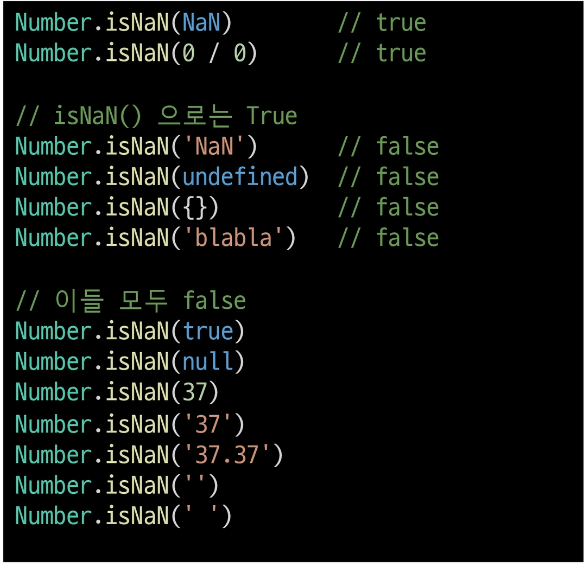

# JavaScript

## JavaScript 시작하기

### Web 기술의 기반이 되는 언어
- HTML 문서의 콘텐츠를 **동적으로 변경**할 수 있는 언어
- Web이라는 공간에서 채팅, 게임 등 다양한 동작을 할 수 있게 된 기반

## JavaScript의 역사

### 웹 브라우저의 역할
- JavaScript는 Web을 조작하기 위한 언어인 만큼 **Web Browser와도 깊은 연관 관계가 있음**
- URL을 통해 Web(WWW)을 탐색함
- **HTML/CSS/JavaScript를 이해한 뒤 해석**해서 사용자에게 하나의 화면으로 보여줌
- 웹 서비스 이용 시 클라이언트의 역할을 함
- 즉, 웹 페이지 코드를 이해하고, 보여주는 역할을 하는 것이 바로 웹 브라우저

### 웹 브라우저와 스크립트 언어
- **1993, Mosaic Web Browser** (GUI 기반)
- **1994, Netscape Navigator** (후속작, 점유율 80%)
- 이때까지, 단순히 정적 웹페이지를 보여주는 용도
- 웹 브라우저에 탑재해서 웹 페이지를 동적으로 바꿔줄 Script 언어 개발 필요
  - Script 언어
    - 소스코드를 기계어로 바꿔주는 컴파일러 없이 바로 실행 가능한 언어 (속도가 느림)
- Netscape에서 **Mocha**라는 Script언어 개발
- **LiveScript**로 이름 변경 뒤 브라우저에 LiveScript를 해석해주는 Engine을 내장
- **JavaScript**로 이름 변경 (자바와 관련 없음)
- **1995, Microsoft Internet Explorer**
  - JavaScript를 그대로 복사한 **JavaScriptcript** 언어 제작 후 이를 탑재한 Web Browser인 Internet Explorer 출시
  - 이후 JavaScript와 JavaScriptcript는 각자 기능 추가 시작
  - 개발자들은 Netscape Navigator와 Internet Explorer 각각에 대한 코드를 작성해야함
- **1996-2000, ECMA 표준 발의**
  - Netscape가 ECMA에게 JavaScript기반의 표준안 발의 제안, ECMAScript1 출시
  - 문법 추가와 함께 버전 상승
  - 점유율 95%의 Microsoft는 더이상 ECMAScript 표준안을 지키지 않겠다 선언
- **2001-2004, 다양한 웹 브라우저의 등장**
  - ActionScript3라는 스크립트 언어 기반 Firefox 웹 브라우저 출시
  - 개발자들은 Netscape Navigator & Internet Explorer & Firefox 지원 위해 고통
- **jQuery 등의 라이브러리 등장**
  - 각 브라우저 엔진에 맞는 스크립트를 여러번 쓰는게 고통
  - 중간에 하나의 레이어를 두고 코딩하는 것 = jQuery
    - jQuery 문법에 맞춰 작성하면 브라우저별 엔진에 맞는 스크립트 변환을 알아서 실행
- **2008, Google Chrome 등장, 대통합 시대**
  - V8라는 강력 엔진 탑재 Chrome 등장
    - JavaScript 해석 월등히 빠른 브라우저
  - 다른 웹 브라우저들이 함께 표준안 만들자 제안
- 2009, ECMAScript5 (ES5) 표준안 제정
- 2015, **ECMAScript6 (ES6) 표준안** 제정
- 이후에도 버전 업데이트, BUT 큰 변화는 ES6에서

### 정리
- 웹브라우저는 JavaScript를 해석하는 엔진 보유
- 더이상 jQuery등의 라이브러리 필요 x (모든 웹브라우저가 표준안을 따름)
- Chrome V8의 경우 매우 빠른 JavaScript 번역 속도
  - 다른 개발에서도 활용해보자!
  - node.JavaScript, react.JavaScript, electron 등의 내부 엔진
  - back-end, mobile, desktop app 모두 개발 가능

---

## JavaScript 실행환경 구성
### JavaScript 실행하기

### 1. Web Browser로 실행하기
- Web Browser에는 JavaScript를 해석가능한 엔진이 존재해 실행 가능
- 1. HTML 파일에 JavaScript 작성후 웹브라우저로 파일 열기
- 2. .js 확장자 파일에 JavaScript 작성 후 해당파일을 HTML에 작성
- Chrome 개발자도구 - Console 탭에서 결과 확인
- 웹브라우저의 Console에서 바로 JavaScript 입력도 가능
- 웹브라우저에서 바로 실행가능한 JavaScript 문법들을 Vanilla JavaScript라 함

```html
<!--hello.html-->

<!DOCTYPE html>
<html lang="en">
<head>
    <meta charset="UTF-8">
    <meta http-equiv="X-UA-Compatible" content="IE=edge">
    <meta name="viewport" content="width=device-width, initial-scale=1.0">
    <title>Document</title>
</head>
<body>
    <!--1번-->
    <script>
        console.log('hello, javascript')
    </script>
</body>
<!--2번-->
<script src="hello.js"></script>
</html>
```

```javascript
// hello.js

console.log('hello,javascript')
```

### 2. Node.JavaScript로 실행하기

```
$ node hello.js
```

---

## JavaScript 기초 문법

## 코드 작성법

### 세미콜론
- 선택적 사용
- ASI (Automatic Semicolon Insertion 자동 세미콜론 삽입 규칙)에의해 자동 삽입

### 들여쓰기와 코드블럭
- python은 4칸, JavaScript는 **2칸 들여쓰기**
- **블럭(block)**은 if, for, 함수에서 중괄호 {} 내부를 말함
  - python은 들여쓰기로 코드 블럭 구분
  - JavaScript는 **중괄호 {}** 를 사용해 구분
```javascript
if (isClean) {
    console.log('clean!')
}
```
### 코드 스타일 가이드
- **Airbnb Style Guide** 사용 예정

### 주석
- 한 줄 주석 (//), 여러줄 주석 (/* */)


## 변수와 식별자

### 식별자 정의와 특징
- 식별자는 변수를 구분 할 수 있는 변수명
- 반드시 문자, 달러($), 밑줄(_) 로 시작
- 대소문자 구분, 클래스명 외에는 모두 소문자로 시작
- 예약어 (for, if, function) 사용 불가

- 카멜 케이스(camelCase, lower-camel-case)
  - 변수, 객체, 함수에 사용
- 파스칼 케이스(PascalCase, upper-camel-case)
  - 클래스, 생성자에 사용
- 대문자 스네이크 케이스(SNAKE_CASE)
  - 상수(constants)에 사용
  - 개발자 의도와 상관없이 변경 가능성 없는 값
    - 값이 바뀌지 않을 상수, 재할당이 일어나지 않는 변수

### 변수 선언 키워드
- let
  - 블록 스코프 지역 변수를 선언 (추가로 동시에 값을 초기화)
- const
  - 블록 스코프 읽기 전용 상수를 선언 (추가로 동시에 값을 초기화)
- var
  - 변수를 선언 (추가로 동시에 값을 초기화)


> [참고] 선언, 할당, 초기화
- 선언 (Declaration)
  - 변수를 생성하는 행위 또는 시점
- 할당 (Assignment)
  - 선언된 변수에 값을 저장하는 행위 또는 시점
- 초기화 (Initialization)
  - 선언된 변수에 처음으로 값을 저장하는 행위 또는 시점

```javascript
let foo             // 선언
console.log(foo)    // undefined

foo = 11            // 할당
console.log(foo)    // 11

let bar = 0         // 선언 + 할당
console.log(bar)    // 0
```

> [참고] 블록 스코프 (block scope)
- if, for, 함수 등의 중괄호 내부를 가리킴
- 블록 스코프를 가지는 변수는 블록 바깥에서 접근 불가능

```javascript
let x = 1

if (x===1) {
    let x = 2
    console.log(x)  // 2
}

console.log(x)      // 1
```

### 변수 선언 키워드 - let
- let
  - 재할당 가능 & 재선언 불가능
  - 블록 스코프를 갖는 지역변수를 선언
  - 선언과 동시에 원하는 값으로 초기화 가능

### 변수 선언 키워드 - const
- const
  - 재할당, 재선언 불가능
  - 선언 시 반드시 초기값 설정, 이후 값 변경 불가
  - let과 동일하게 블록 스코프를 가짐

### 변수 선언 키워드 - var
- var
  - 재할당, 재선언 가능
  - ES6 이전 사용
  - "호이스팅" 때문에 문제 발생 가능
  - ES6 이후엔 const, let 사용 권장
  - 함수 스코프를 가짐
  - default 변수선언 키워드

> [참고] 함수 스코프 (function scope)
- 함수의 중괄호 내부를 가리킴
- 함수 스코프를 가지는 변수는 함수 바깥에서 접근 불가

```javascript
function foo() {
    var x = 5
    console.log(x)  // 5
}

console.log(x)  // ReferenceError
```

> [참고] 호이스팅 (hoisting)
- 변수를 선언 이전에 참조 가능
- var로 선언된 변수
- 변수 선언 이전 위치에서 접근 시 undefined 반환

```javascript
console.log(name)       // undefined

var name = '홍길동'     // 선언

// 암묵적 이해
var name
console.log(name)

var name = '홍길동'
```
- 실행시 변수들은 코드 최상단으로 끌어 올려지게 됨
- var 선언 변수는 선언시에 undefined로 값이 초기화되는 과정이 동시 발생
- let, const는 호이스팅 발생시 에러 발생!
- 변수 선언 전 접근 가능하면 코드 논리 흐름 깨짐
- 이를 방지 위해 let, const 추가

### 변수 선언 키워드 정리


- Airbnb 스타일 가이드에서는 const 사용 권장
- 재할당해야하는 경우만 let

---
## 데이터 타입

### 데이터 타입
- JavaScript 모든 값은 특정한 데이터 타입을 가짐
- 원시타입 (Primitive type) / 참조타입 (Reference type)


### Number
- 정수 또는 실수형 숫자 표현


### Number - NaN
- NaN
  - Not-A-Number
  - Number.isNaN() 의 경우 주어진 값의 유형이 Number이고 값이 NaN이면 true, 아니면 false




### String
- 문자열
- 작은, 큰 따옴표 가능
- 곱셈, 나눗셈, 뺄셈 불가/ 덧셈 통해 문자열 붙이기 가능
- Quote 사용하면 선언 시 줄바꿈 불가
- 대신 escape sequence 사용 가능하므로 \n 사용


- **Template Literal** 사용시 줄바꿈 가능, 문자열 사이 변수 삽입 가능
- 단, escape sequnce 사용 불가 == python "f-string"


