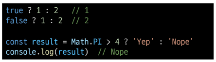
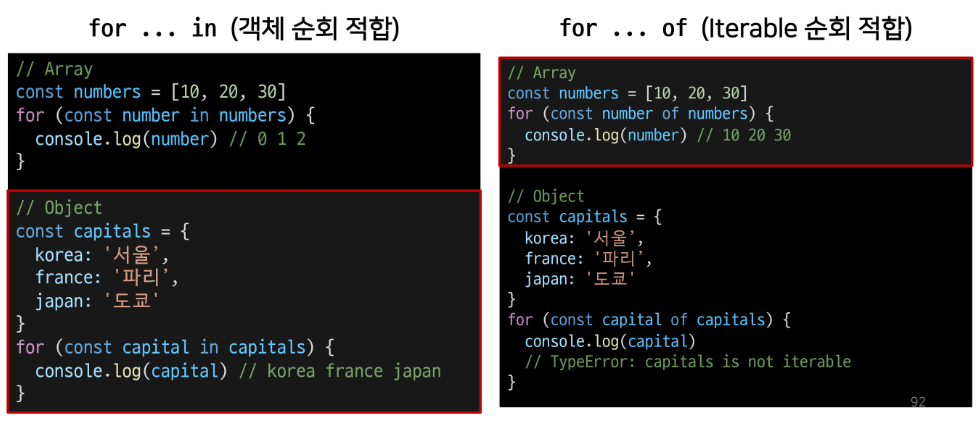

# JavaScript

## JavaScript 시작하기

### Web 기술의 기반이 되는 언어
- HTML 문서의 콘텐츠를 **동적으로 변경**할 수 있는 언어
- Web이라는 공간에서 채팅, 게임 등 다양한 동작을 할 수 있게 된 기반

## JavaScript의 역사

### 웹 브라우저의 역할
- JavaScript는 Web을 조작하기 위한 언어인 만큼 **Web Browser와도 깊은 연관 관계가 있음**
- URL을 통해 Web(WWW)을 탐색함
- **HTML/CSS/JavaScript를 이해한 뒤 해석**해서 사용자에게 하나의 화면으로 보여줌
- 웹 서비스 이용 시 클라이언트의 역할을 함
- 즉, 웹 페이지 코드를 이해하고, 보여주는 역할을 하는 것이 바로 웹 브라우저

### 웹 브라우저와 스크립트 언어
- **1993, Mosaic Web Browser** (GUI 기반)
- **1994, Netscape Navigator** (후속작, 점유율 80%)
- 이때까지, 단순히 정적 웹페이지를 보여주는 용도
- 웹 브라우저에 탑재해서 웹 페이지를 동적으로 바꿔줄 Script 언어 개발 필요
  - Script 언어
    - 소스코드를 기계어로 바꿔주는 컴파일러 없이 바로 실행 가능한 언어 (속도가 느림)
- Netscape에서 **Mocha**라는 Script언어 개발
- **LiveScript**로 이름 변경 뒤 브라우저에 LiveScript를 해석해주는 Engine을 내장
- **JavaScript**로 이름 변경 (자바와 관련 없음)
- **1995, Microsoft Internet Explorer**
  - JavaScript를 그대로 복사한 **JavaScriptcript** 언어 제작 후 이를 탑재한 Web Browser인 Internet Explorer 출시
  - 이후 JavaScript와 JavaScriptcript는 각자 기능 추가 시작
  - 개발자들은 Netscape Navigator와 Internet Explorer 각각에 대한 코드를 작성해야함
- **1996-2000, ECMA 표준 발의**
  - Netscape가 ECMA에게 JavaScript기반의 표준안 발의 제안, ECMAScript1 출시
  - 문법 추가와 함께 버전 상승
  - 점유율 95%의 Microsoft는 더이상 ECMAScript 표준안을 지키지 않겠다 선언
- **2001-2004, 다양한 웹 브라우저의 등장**
  - ActionScript3라는 스크립트 언어 기반 Firefox 웹 브라우저 출시
  - 개발자들은 Netscape Navigator & Internet Explorer & Firefox 지원 위해 고통
- **jQuery 등의 라이브러리 등장**
  - 각 브라우저 엔진에 맞는 스크립트를 여러번 쓰는게 고통
  - 중간에 하나의 레이어를 두고 코딩하는 것 = jQuery
    - jQuery 문법에 맞춰 작성하면 브라우저별 엔진에 맞는 스크립트 변환을 알아서 실행
- **2008, Google Chrome 등장, 대통합 시대**
  - V8라는 강력 엔진 탑재 Chrome 등장
    - JavaScript 해석 월등히 빠른 브라우저
  - 다른 웹 브라우저들이 함께 표준안 만들자 제안
- 2009, ECMAScript5 (ES5) 표준안 제정
- 2015, **ECMAScript6 (ES6) 표준안** 제정
- 이후에도 버전 업데이트, BUT 큰 변화는 ES6에서

### 정리
- 웹브라우저는 JavaScript를 해석하는 엔진 보유
- 더이상 jQuery등의 라이브러리 필요 x (모든 웹브라우저가 표준안을 따름)
- Chrome V8의 경우 매우 빠른 JavaScript 번역 속도
  - 다른 개발에서도 활용해보자!
  - node.JavaScript, react.JavaScript, electron 등의 내부 엔진
  - back-end, mobile, desktop app 모두 개발 가능

---

## JavaScript 실행환경 구성
### JavaScript 실행하기

### 1. Web Browser로 실행하기
- Web Browser에는 JavaScript를 해석가능한 엔진이 존재해 실행 가능
- 1. HTML 파일에 JavaScript 작성후 웹브라우저로 파일 열기
- 2. .js 확장자 파일에 JavaScript 작성 후 해당파일을 HTML에 작성
- Chrome 개발자도구 - Console 탭에서 결과 확인
- 웹브라우저의 Console에서 바로 JavaScript 입력도 가능
- 웹브라우저에서 바로 실행가능한 JavaScript 문법들을 Vanilla JavaScript라 함

```html
<!--hello.html-->

<!DOCTYPE html>
<html lang="en">
<head>
    <meta charset="UTF-8">
    <meta http-equiv="X-UA-Compatible" content="IE=edge">
    <meta name="viewport" content="width=device-width, initial-scale=1.0">
    <title>Document</title>
</head>
<body>
    <!--1번-->
    <script>
        console.log('hello, javascript')
    </script>
</body>
<!--2번-->
<script src="hello.js"></script>
</html>
```

```javascript
// hello.js

console.log('hello,javascript')
```

### 2. Node.JavaScript로 실행하기

```
$ node hello.js
```

---

## JavaScript 기초 문법

## 코드 작성법

### 세미콜론
- 선택적 사용
- ASI (Automatic Semicolon Insertion 자동 세미콜론 삽입 규칙)에의해 자동 삽입

### 들여쓰기와 코드블럭
- python은 4칸, JavaScript는 **2칸 들여쓰기**
- **블럭(block)**은 if, for, 함수에서 중괄호 {} 내부를 말함
  - python은 들여쓰기로 코드 블럭 구분
  - JavaScript는 **중괄호 {}** 를 사용해 구분
```javascript
if (isClean) {
    console.log('clean!')
}
```
### 코드 스타일 가이드
- **Airbnb Style Guide** 사용 예정

### 주석
- 한 줄 주석 (//), 여러줄 주석 (/* */)


## 변수와 식별자

### 식별자 정의와 특징
- 식별자는 변수를 구분 할 수 있는 변수명
- 반드시 문자, 달러($), 밑줄(_) 로 시작
- 대소문자 구분, 클래스명 외에는 모두 소문자로 시작
- 예약어 (for, if, function) 사용 불가

- 카멜 케이스(camelCase, lower-camel-case)
  - 변수, 객체, 함수에 사용
- 파스칼 케이스(PascalCase, upper-camel-case)
  - 클래스, 생성자에 사용
- 대문자 스네이크 케이스(SNAKE_CASE)
  - 상수(constants)에 사용
  - 개발자 의도와 상관없이 변경 가능성 없는 값
    - 값이 바뀌지 않을 상수, 재할당이 일어나지 않는 변수

### 변수 선언 키워드
- let
  - 블록 스코프 지역 변수를 선언 (추가로 동시에 값을 초기화)
- const
  - 블록 스코프 읽기 전용 상수를 선언 (추가로 동시에 값을 초기화)
- var
  - 변수를 선언 (추가로 동시에 값을 초기화)


> [참고] 선언, 할당, 초기화
- 선언 (Declaration)
  - 변수를 생성하는 행위 또는 시점
- 할당 (Assignment)
  - 선언된 변수에 값을 저장하는 행위 또는 시점
- 초기화 (Initialization)
  - 선언된 변수에 처음으로 값을 저장하는 행위 또는 시점

```javascript
let foo             // 선언
console.log(foo)    // undefined

foo = 11            // 할당
console.log(foo)    // 11

let bar = 0         // 선언 + 할당
console.log(bar)    // 0
```

> [참고] 블록 스코프 (block scope)
- if, for, 함수 등의 중괄호 내부를 가리킴
- 블록 스코프를 가지는 변수는 블록 바깥에서 접근 불가능

```javascript
let x = 1

if (x===1) {
    let x = 2
    console.log(x)  // 2
}

console.log(x)      // 1
```

### 변수 선언 키워드 - let
- let
  - 재할당 가능 & 재선언 불가능
  - 블록 스코프를 갖는 지역변수를 선언
  - 선언과 동시에 원하는 값으로 초기화 가능

### 변수 선언 키워드 - const
- const
  - 재할당, 재선언 불가능
  - 선언 시 반드시 초기값 설정, 이후 값 변경 불가
  - let과 동일하게 블록 스코프를 가짐

### 변수 선언 키워드 - var
- var
  - 재할당, 재선언 가능
  - ES6 이전 사용
  - "호이스팅" 때문에 문제 발생 가능
  - ES6 이후엔 const, let 사용 권장
  - 함수 스코프를 가짐
  - default 변수선언 키워드

> [참고] 함수 스코프 (function scope)
- 함수의 중괄호 내부를 가리킴
- 함수 스코프를 가지는 변수는 함수 바깥에서 접근 불가

```javascript
function foo() {
    var x = 5
    console.log(x)  // 5
}

console.log(x)  // ReferenceError
```

> [참고] 호이스팅 (hoisting)
- 변수를 선언 이전에 참조 가능
- var로 선언된 변수
- 변수 선언 이전 위치에서 접근 시 undefined 반환

```javascript
console.log(name)       // undefined

var name = '홍길동'     // 선언

// 암묵적 이해
var name
console.log(name)

var name = '홍길동'
```
- 실행시 변수들은 코드 최상단으로 끌어 올려지게 됨
- var 선언 변수는 선언시에 undefined로 값이 초기화되는 과정이 동시 발생
- let, const는 호이스팅 발생시 에러 발생!
- 변수 선언 전 접근 가능하면 코드 논리 흐름 깨짐
- 이를 방지 위해 let, const 추가

### 변수 선언 키워드 정리


- Airbnb 스타일 가이드에서는 const 사용 권장
- 재할당해야하는 경우만 let

---
## 데이터 타입

### 데이터 타입
- JavaScript 모든 값은 특정한 데이터 타입을 가짐
- 원시타입 (Primitive type) / 참조타입 (Reference type)


### Number
- 정수 또는 실수형 숫자 표현


### Number - NaN
- NaN
  - Not-A-Number
  - Number.isNaN() 의 경우 주어진 값의 유형이 Number이고 값이 NaN이면 true, 아니면 false

```javascript
isNaN(NaN);       // 참
isNaN(undefined); // 참
isNaN({});        // 참

isNaN(true);      // 거짓
isNaN(null);      // 거짓
isNaN(37);        // 거짓

// 문자열
isNaN("37");      // 거짓: "37"은 NaN이 아닌 숫자 37로 변환됩니다
isNaN("37.37");   // 거짓: "37.37"은 NaN이 아닌 숫자 37.37로 변환됩니다
isNaN("123ABC");  // 참: parseInt("123ABC")는 123이지만 Number("123ABC")는 NaN입니다
isNaN("");        // 거짓: 빈 문자열은 NaN이 아닌 0으로 변환됩니다
isNaN(" ");       // 거짓: 공백이 있는 문자열은 NaN이 아닌 0으로 변환됩니다

// dates
isNaN(new Date());                // 거짓
isNaN(new Date().toString());     // 참

// 이것이 허위 양성이고 isNaN이 완전히 신뢰할 수 없는 이유이다.
isNaN("blabla")   // 참: "blabla"는 숫자로 변환됩니다.
                  // 이것을 숫자롯 parsing 하는 것을 실패하고 NaN을 반환한다.
```


### String
- 문자열
- 작은, 큰 따옴표 가능
- 곱셈, 나눗셈, 뺄셈 불가/ 덧셈 통해 문자열 붙이기 가능
- Quote 사용하면 선언 시 줄바꿈 불가
- 대신 escape sequence 사용 가능하므로 \n 사용


- **Template Literal** 사용시 줄바꿈 가능, 문자열 사이 변수 삽입 가능
- 단, escape sequnce 사용 불가 == python "f-string"


### Template literals (템플릿 리터럴)
- 내장된 표현식을 허용하는 문자열 작성 방식
- ES6+
- Backtick(``)
- 여러줄 가능
- 변수를 문자열안에 바로 연결
- 표현식 넣기 가능 ${expression}

### Empty Value
- null
  - 변수 **값이 없음을 의도적으로 표현**
```javascript
let lastName = null
console.log(lastName) // null
```

- undefined
  - 값이 정의되어있지 않음을 표현
  - 변수 선언 후 **직접 값 할당안하면 자동 할당**
```javascript
let firstName
console.log(firstName)  // undefined
```

```javascript
type of null        // "object"
type of undefined   // "undefined"
```

- null이 원시타입인데 object로 출력
  - 설계당시 버그 해결 못함

### Boolean
- true / false
- 조건문 or 반복문에서 boolean이 아닌 데이터 타입은 자동 형변환 규칙에 따라 true or false로 변환


---

## 연산자

### 할당 연산자
- 오른쪽 피연산자의 평가결과를 왼쪽 피연산자에 할당
- 단축 연산자 지원
- Increment Decrement
  - Increment(++) : 피연산자 값 1 증가
  - Decrement(--) : 피연산자 값 1 감소
  - **+=** or **-=** 권장


### 비교 연산자
- 피연산자들(숫자, 문자, boolean)을 비교, 결과값을 boolean으로 반환
- 문자열은 유니코드 값 사용, 표즌 사전 순서 기반 비교
  - 알파벳 후순위가 더크고, 소문자가 대문자보다 더큼


### 동등 연산자 (**==**)
- 두 피연산자가 같은 값으로 평가되는지 비교 후 boolean 반환
- **암묵적 타입 변환** -> 타입 일치 시킨 후 비교
- 두 피연산자가 모두 객체인 경우 메모리의 같은 객체를 바라보는지 판별
- 예상치 못한 결과 발생 가능성 -> 특별 경우 제외하고 사용 x


### 일치 연산자 (**===**)
- 값 타입 모두 같아야 true
- 같은 객체를 가리키거나, 같은 타입,같은 값인지 비교
- 엄격한 비교, **암묵적 타입 변환 x**


### 논리 연산자
- and : '&&'
- or : '||'
- not : '!'

- 단축 평가 지원


### 삼항 연산자 (Ternary Operator)
- 3개의 피연산자를 사용하여 조건에 따라 값을 반환하는 연산자
- 가장 앞의 조건식이 참이면 :(콜론) 앞의 값이 반환, 그 반대는 : 뒤의 값이 반환
- 삼항 연산자의 결과 값이기 때문에 변수에 할당 가능



---

## 조건문

### **if** statement
- 조건 표현식의 결과값을 **boolean 타입으로 변환 후 참/거짓 판단**
- if, else if, else
  - 조건은 **소괄호** 안에 작성
  - 실행할 코드는 **중괄호** 안에 작성
  - 블록 스코프 생성


### **switch** statement
- 조건 표현식의 결과값이 **어느 값(case)에 해당하는지 판별**
- 주로 특정 변수의 값에 따라 조건을 분기할 때 활용
  - 조건이 많아질 경우 if문보다 가독성이 나을 수 있음
- 표현식(expression)의 결과값을 이용한 조건문
- 표현식의 결과값과 case문의 오른쪽 값을 비교
- break 및 defualt문은 [선택적]으로 사용 가능
- break문에 없는 경우 break문을 만나거나 default문을 실행할 때까지 다음 조건문 실행
- 블록 스코프 생성


- 모든 console이 출력되는 **Fall-through 현상**
- **break** 작성하면 의도대로 동작


### if / switch
- 조건이 많은 경우 switch문을 통해 가독성 향상 기대 가능
- 일반적으로 중첩 else if문은 유지보수가 힘들다는 문제 존재

---

## 반복문

### while
- 조건문이 참이기만 하면 문장을 계속해서 수행
```javascript
while (조건문) {
  // do something
}


// 예시
let i = 0

while (i<6) {
  console.log(i)
  i += 1
}
// 0, 1, 2, 3, 4, 5
```

### for
- 특정한 조건이 거짓으로 판별될 때까지 반복
```javascript
for ([초기문]; [조건문]; [증감문]) {
  // do something
}

// 예시
for (let i=0; i<6; i++) {
  console.log(i)
}
// 0,1,2,3,4,5
```
1. 반복문 진입 및 변수 i 선언
2. 조건문 평가 후 코드 블럭 실행
3. 코드 블럭 실행 이후 i 값 증가

### for ... in
- 객체의 **속성을 순회**
- 배열도 순회 가능하지만 인덱스 순으로 순회한다는 보장이 없으므로 권장 x

```javascript
for (variable in object) {
  statements
}

// 예시
const fruits = { a: 'apple', b: 'banana'}

for (const key in fruits) {
  console.log(key)  // a, b
  console.log(fruits[key])  // apple, banana
}
```

### for ... of
- 반복 가능한 객체를 순회할 때 사용
- **Array, Set, String**

```javascript
for (variable of object) {
  statements
}

// 예시
const numbers = [0,1,2,3]

for (const number of numbers) {
  console.log(number) // 0,1,2,3
}
```

### for...in 과 for...of 차이
- for...in은 "속성 이름"을 통해 반복
- for...of는 "속성값"을 통해 반복

```javascript
const arr = [3,5,7]

for (const i in arr) {
  console.log(i)  // 0 1 2
}

for (const i of arr) {
  console.log(i)  // 3 5 7
}
```



> [참고] for...in, for...of 와 const
- **for문**
```javascript
for (let i=0; i<arr.length; i++) {

}
```
- 위의 경우에는 최초 정의한 i를 **재할당**하면서 사용하기 때문에 **const 를 사용하면 에러 발생**

- **for...in, for...of**
  - 재할당이 아니라, 매 반복 시 해당 **변수를 새로 정의**하여 사용하므로 **에러 발생** x

### 조건문과 반복문 정리


---
## 함수

- 참조 타입 중 하나로써 function 타입에 속함
- JavaScript에서의 함수 정의 방법
  - 함수 선언식 (function statement)
  - 함수 표현식 (function expression)

## 함수의 정의

### 함수 선언식 (Function declaration)
- 일반적인 프로그래밍 언어의 함수 정의 방식
```javascript
function 함수명() {
  // do something
}

// 예시
function add(num1, num2) {
  return num1 + num2
}

add(2,7)  // 9
```

### 함수 표현식 (Function expression)
- 표현식 내에서 함수를 정의하는 방식
- 함수 표현식은 함수의 이름을 생략한 익명함수로 정의가능

```javascript
변수키워드 함수명 = function () {
  // do something
}

// 예시
const sub = function (num1, num2) {
  return num1 - num2
}
sub(7,2) // 5
```

- 표현식에서 함수 이름을 명시하는 것도 가능
- but, 함수 이름은 호출에 사용되지 못하고 디버깅 용도!
  - 호출시 ReferenceError


### 기본 인자 (Default arguments)
- 인자 작성 시 '='문자 뒤 기본 인자 선언 가능
```javascript
const greeting = function (name = 'Anonymous') {
  return `Hi ${name}`
}
console.log(greeting())  // Hi Anonymous
```

### 매개변수와 인자의 개수 불일치 허용

- 매개변수보다 인자의 개수가 많을 경우


- 매개변수보다 인자의 개수가 적을 경우


### Spread syntax (**...**)
- 전개구문
- 배열이나 문자열 같이 반복 가능한 객체를 배열의 경우는 요소, 함수의 경우는 인자로 확장 가능

- 배열과의 사용 (배열 복사)


- 함수와의 사용 (**Rest parameters**)
  - 정해지지 않은 수의 매개변수를 배열로 받을 수 있음


---

## 선언식과 표현식

### 함수의 타입
- 선언식, 표현식 함수 모두 타입은 **function**


### 호이스팅 - 선언식
- 함수 선언식으로 정의한 함수는 var로 정의한 변수처럼 호이스팅 발생
- 즉, 함수 호출 이후에 선언해도 동작


### 호이스팅 - 표현식
- 반면 함수 표현식으로 선언한 함수는 함수 정의 전에 호출 시 에러 발생
- 함수 표현식으로 정의된 함수는 변수로 평가되어 변수의 scope 규칙 따름


### 선언식과 표현식 정리


---

## Arrow Function

### 화살표 함수 (Arrow Function)
- 함수를 비교적 간결하게 정의할 수 있는 문법
- function 키워드와 중괄호를 이용한 구문을 짧게 사용하기 위함
1. **function** 키워드 생략가능
2. 함수의 매개변수가 하나 뿐이라면 매개변수의 '**()**' 생략 가능
3. 함수의 내용이 한 줄이라면 '**{}**'와 '**return**'도 생략 가능
- 화살표 함수는 항상 익명 함수
  - 함수 표현식에서만 사용 가능


### 즉시 실행 함수 (IIFE, Immediately Invoked Function Expression)
- 선언과 동시에 실행되는 함수
- 함수의 선언 끝에 '()'를 추가하여 선언되자 마자 실행하는 형태
- '()'에 값을 넣어 인자로 넘겨줄 수 있음
- 즉시 실행 함수는 선언과 동시에 실행되기 때문에 같은 함수를 다시 호출할 수 없음
- 그래서 초기화 부분에 많이 사용
- 일회성 함수이므로 익명함수로 사용하는것이 일반적


---

## Array와 Object

- JavaScript의 데이터 타입 중 참조 타입(reference)에 해당하는 타입은 **Array**와 **Object**이며, 객체라고도 말함
- 객체는 속성들의 모음 (collection) 

### 배열 (Array)
- 키와 속성들을 담고 있는 참조 타입의 객체
- 순서 보장
- 대괄호 이용 생성
- 0 포함 양의 정수 인덱스로 특정값 접근 가능
- 배열 길이 array.length
  - 배열 마지막 원소는 array.length - 1


### 배열 메서드 기초


- **array.reverse()**
  - 원본 배열 요소들의 순서를 반대로 정렬


- **array.push()**
  - 배열 가장 뒤에 요소 추가
- **array.pop()**
  - 배열 마지막 요소 제거


- **array.includes(value)**
  - 배열에 특정 값이 존재하는지 판별 후 true or false 반환


- **array.indexOf(value)**
  - 배열에 특정 값이 존재하는지 확인 후 가장 첫번째로 찾은 요소의 인덱스 반환
  - 만약 해당 값이 없을 경우 -1 반환


- **array.join([seperator])**
  - 배열의 모든 요소를 연결하여 반환
  - seperator 구분자는 선택적으로 지정 가능, 생략시 쉼표를 기본값으로 함


---
## 배열 메서드 심화

### Array Helper Methods
- 배열을 순회하며 특정 로직을 수행하는 메서드
- 메서드 호출 시 인자로 callback 함수를 받는 것이 특징
  - callback 함수: 어떤 함수 내부에서 실행될 목적으로 인자로 넘겨받는 함수


> [참고] Django callback 함수


### forEach

```javascript
array.forEach(callback(element[, index[,array]]))
```
- 인자로 주어지는 콜백함수를 배열의 각 요소에 대해 한 번씩 실행
- **element** : 배열의 요소
- **index** : 배열 요소의 인덱스
- **array** : 배열 자체
- **반환 값(return) 없음**

```javascript
//1. 반환값이 없음 (바로 출력!)
// 안에서 반복만 돌고 말기 때문에 return 값 유무는 상관없음
const colors = ['red', 'blue', 'green']

const printClr = function (color) {
    console.log(color)
}

colors.forEach(printClr)

//2. 함수를 배열 각 요소에다 한번씩 실행 ! python의 map 과 유사!

colors.forEach(function (color) {
    console.log(color)
})


//3. 최종형

colors.forEach((color) => {
    console.log(color)
})

colors.forEach((color) => console.log(color))
```

### map
```javascript
array.map(callback(element[, index[, array]]))
```

- 배열의 각 요소에 대해 콜백함수를 한번씩 실행
- **콜백함수의 반환값을 요소로 하는 새로운 배열 반환**
- 기존 배열 전체를 다른 형태로 바꿀때 유용
  - **forEach + return**

```javascript
const numbers = [1,2,3,4,5]

//1. forEach + return !!
// return 값을 원소로 사용
// return 값을 결과로 새로운 배열 생성
const doubleEle = function (number) {
    return number * 2
}

const newArray = numbers.map(doubleEle) // 반환값이 존재

console.log(newArray)

//2.
const newArray = numbers.map(function (number) {
    return number * 2
})

//3. 가장 흔하게 쓰는 단계
const newArray = numbers.map((number) => {
    return number * 2
})

//4.
const newArray = numbers.map((number) => number * 2)
```

### filter
```javascript
array.filter(callback(elememt[, index[, array]]))
```
- 배열 각 요소에 대해 콜백함수 한번씩 실행
- **콜백함수 반환 값이 true인 요소들만 모아서 새로운 배열 반환**
- 기존 배열의 요소들을 필터링할때 유용

```javascript
const products = [
    { name: 'cucumber', type: 'vegetable'},
    { name: 'banana', type: 'fruit'},
    { name: 'carrot', type: 'vegetable'},
    { name: 'apple', type: 'fruit'},
]

// return 값이 참인지 거짓인지 확인 -> true라면 원소로 사용!!! (false는 사용x)


//1. True / False로 반환
const fruitFilter = function (product) {
    return product.type === 'fruit'
}

const newArray = products.filter(fruitFilter)

console.log(newArray)

//2.
const newArray = products.filter(function (product) {
    return product.type === 'fruit'
})

//3.
const newArray = products.filter((product) => {
    return product.type === 'fruit'
})

//4.
const newArray = products.filter((product) => product.type === 'fruit')
```

### reduce
```javascript
array.reduce(callback(acc, element, [index[, array]])[, initialValue])
```
- 인자로 주어지는 콜백함수를 배열의 각 요소에 대해 한번씩 실행해서, 하나의 결과 값을 반환
- 즉, 배열을 하나의 값으로 계산하는 동작이 필요할때 사용 (총합, 평균)
- map, filter등 여러 배열 메서드 동작을 대부분 대체 가능
- reduce 주요 매개 변수
  - acc
    - 이전 콜백함수의 반환 값이 누적되는 변수
  - initialValue (optional)
    - 최초 콜백함수 호출 시 acc에 할당되는 값, default 값은 배열 첫번째 값
- reduce 첫번째 매개변수인 콜백함수의 첫번째 매개변수 acc는 누적된 값(전단계까지의 결과)
- reduce 두번째 매개변수인 initialValue는 누적될 값의 초기값, 지정하지 않을시 첫번째 요소
- 빈 배열의 경우 initialValue 제공하지 않으면 에러발생

```javascript
const numbers = [90, 80, 70, 100]

// 원소를 다 제거하고 하나의 값만 만들어서 reduce임!


// ex) 총합 반환!
// 첫번째 인자 result가 누적값!

//1. 초기값 안넣으면 첫번째 값이 초기값으로 자동설정
const sumNum = numbers.reduce(function (result, number) {
    console.log(result)
    return result + number
})

console.log(sumNum)


// 초기값 설정
const sumNum = numbers.reduce(function (result, number) {return result + number}, 0)

console.log(sumNum)

//2.
const sumNum = numbers.reduce((result, number) => {return result + number}, 0)


//3. 평균값 구하기
const avgNum = numbers.reduce((result,number) => result + number, 0) / numbers.length
```

### find
```javascript
array.find(callback(element[, index[, array]]))
```
- 배열의 각 요소에 대해 콜백함수를 한번씩 실행
- 콜백함수의 반환값이 true면, 조건을 만족하는 첫번째 요소 반환
- 찾는 값이 배열에 없으면 undefined 반환

```javascript
const avengers = [
    { name: 'Tony Stark', age: 45 },
    { name: 'Steve Rogers', age: 32},
    { name: 'Thor', age: 40},
]

// return 값이 참이면 해당 요소 반환 후 실행 종료
// 조건 만족하는 첫번째 요소 반환
// 찾는 값이 배열에 없으면 undefined 반환

// filter는 새로운 배열 생성
// find는 원소 출력


const avenger = avengers.find((avenger) => {
    return avenger.name === 'Tony Stark'
})

console.log(avenger)
```

### some
```javascript
array.some(callback(element[, index[, array]]))
```

- 배열의 **요소 중 하나라도** 주어진 판별 함수를 통과하면 true 반환
- 모든 요소가 통과하지 못하면 false
- 빈배열은 항상 false

```javascript
const arr = [1,2,3,4,5]

// 조건을 하나라도 만족하는지 체크

//1. 하나만 통과해도 true !! , 빈배열은 false
const result = arr.some((elem) => elem % 2 === 0)
console.log(result)
```

### every
```javascript
array.every(callback(element[, index[, array]]))
```

- 배열의 **모든 요소**가 주어진 판별함수를 통과하면 true
- 하나라도 통과못하면 false
- 빈 배열은 항상 true

```javascript
// 배열 모든 요소가 판별 함수 통과해야 true
// 하나라도 통과못하면 false
// 빈 배열은 항상 true

const arr = [1,2,3,4,5]


const result = arr.every((elem) => elem % 2 === 0)
console.log(result)
```

### 배열 순회 비교


--- 
## 객체 (object)

- 객체는 속성의 집합, 중괄호 내부에 key와 value 쌍으로 표현
- key
  - 문자열 타입 only
  - key 이름에 띄어쓰기 등 구분자가 있으면 따옴표로 묶어서 표현
- value
  - 모든 타입(함수포함)
- 객체 요소 접근
  - 점 or 대괄호
  - key 이름에 띄어쓰기 등 구분자 있으면 only 대괄호

```javascript
const myInfo = {
    name: 'jack',
    phoneNumber: '123456',
    //띄어쓰기있을땐 콜론써서 키 정의
    'samsung products': {
        buds: 'Galaxy Buds pro',
        galaxy: 'Galaxy s99'
    },
}

console.log(myInfo.name)
console.log(myInfo['name'])
console.log(myInfo['samsung products'].galaxy)
```

## 객체 관련 문법
- ES6에 새로 도입, 객체 생성 및 조작에 유용
1. 속성명 축약
2. 메서드명 축약
3. 계산된 속성명 사용하기
4. 구조 분해 할당
5. 객체 전개 구문 (Spread Operator)

### 1. 속성명 축약
- 객체 정의 시 key와 할당하는 변수의 이름이 같으면 축약 가능


### 2. 메서드명 축약

- 메서드 선언 시 function 키워드 생략 가능


```javascript
// 2. 메서드 명 축약
const obj = {
    name: 'jack',
    greeting() {
        console.log('hi!')
    }
}

console.log(obj.name)
console.log(obj.greeting())
```

### 3. 계산된 속성 (computed property name)
- 객체 정의 시 key 이름을 표현식을 이용해 동적으로 생성 가능


```javascript
// 3. 계산된 속성
// 객체 정의 시 key의 이름을 표현식을 이용해 동적으로 생성 가능
const key = 'ssafy'
const value = ['한국', '미국', '일본', '중국']

const myObj = {
    [key]: value,
}
console.log(myObj)
console.log(myObj.ssafy)
```

### 4. 구조 분해 할당 (destructing assignment)
- 배열 또는 객체를 분해하여 속성을 변수에 쉽게 할당할 수 있는 문법


```javascript
// 4. 구조 분해 할당
// 배열 또는 객체를 분해하여 속성을 변수에 쉽게 할당 가능

const { name, phoneNumber } = myInfo
```

### 5. Spread syntax (...)
- 배열과 마찬가지로 전개구문을 사용해 객체 내부에서 객체 전개 가능
- 얕은 복사에 활용 가능


```javascript
// 5. Spread syntax (...)
// 배열과 마찬가지로 전개구문 사용해 객체 내부에서 객체 전개 가능
// 얕은 복사에 활용

const obj = {b:2, c:3}
const newObj = {a:1, ...obj, d:4}

console.log(newObj) 
```

### JSON

- JavaScript Object Notation
- Key-Value 형태로 이루어진 자료 표기법
- JavaScript의 Object와 유사한 구조를 가지고 있지만,
- Object는 그자체로 타입
- JSON은 형식이 있는 "문자열"
- **즉, JSON을 Object로 사용하기 위해서는 변환 작업이 필요!**

```javascript
//JSON
const jsonData = {
    coffe: 'Americano',
    iceCream: 'Mint Choco',
}

// Object -> json
const objToJson = JSON.stringify(jsonData)

console.log(objToJson)  // {"coffe":"Americano","iceCream":"Mint Choco"}

console.log(typeof objToJson) // string


// json -> Object (중요***- api와 소통할때)
// django가 json을 주면 자바스크립트가 parse해서 object로 바꿔서 적당한 위치에 배분 ...

const jsonToObj = JSON.parse(objToJson)

console.log(jsonToObj)  // { coffe: 'Americano', iceCream: 'Mint Choco' }

console.log(typeof jsonToObj)   // object

console.log(jsonToObj.iceCream) 
```

> [참고] 배열은 객체임
- 배열은 키와 속성들을 담고있는 참조 타입의 객체
- 배열은 인덱스를 키로 가지며 length 프로퍼티를 갖는 특수한 객체


---

# SUMMARY

- JavaScript 기초 문법
  - 세미콜론
  - 들여쓰기와 코드블럭
  - 스타일 가이드
  - 변수와 식별자
  - 타입과 연산자
    - 원시 자료형
  - 조건문
  - 반복문

- 함수
  - 선언식과 표현식
  - 화살표 함수

- Array와 Object
  - 배열
    - Array Helper Method
  - 객체
    - ES6+ 객체 문법