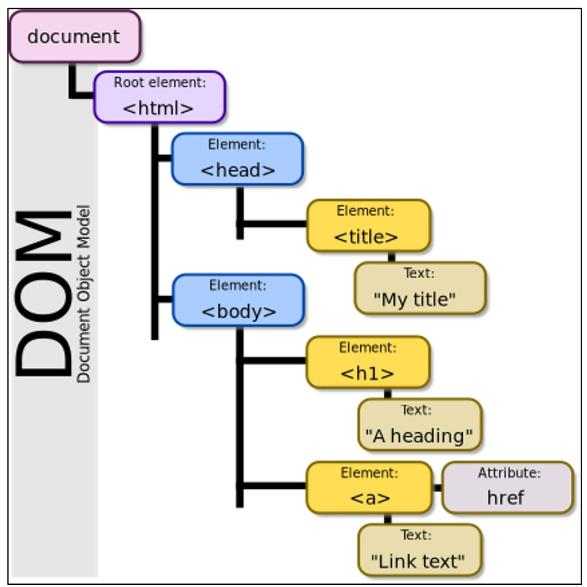
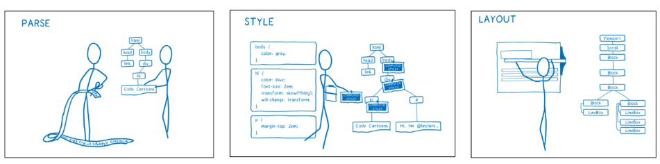

# JavaScript

## DOM

### 개요
- "브라우저에서의 JavaScript"
  - 웹 페이지에서 복잡한 기능을 구현하는 스크립트 언어
  - 정적인 정보만 보여주는 것이 아닌 주기적으로 갱신되거나, 사용자와 상호작용이 가능하거나, 애니메이션이 적용된 그래픽 등에 관여
> [참고] 스크립트 언어 (Script Language)
- 응용 소프트웨어를 제어하는 컴퓨터 프로그래밍 언어

### Browser APIs
- 웹 브라우저에 내장된 API로, 현재 컴퓨터 환경에 관한 데이터를 제공하거나 여러가지 유용하고 복잡한 일을 수행
- 종류
  - `DOM`
  - Geolocation API
  - WebGL

### DOM
- **문서 객체 모델** (Document Object Model)
- 문서의 구조화된 표현을 제공하며 프로그래밍 언어가 DOM 구조에 접근할 수 있는 방법을 제공
  - **문서 구조, 스타일, 내용 등을 변경**할 수 있게 도움
  - **HTML 콘텐츠를 추가, 제거, 변경**하고, **동적으로 페이지에 스타일을 추가**하는 등 HTML/CSS를 조작할 수 있음
- 문서가 구조화되어 있으며 각 요소는 `객체(object)`로 취급
- 단순한 **속성 접근**, **메서드 활용** 뿐만 아니라 **프로그래밍 언어적 특성을 활용한 조작** 가능
- DOM은 문서를 논리 트리로 표현
- DOM 메서드를 사용하면 프로그래밍적으로 트리에 접근할 수 있고 이를 통해 문서의 구조, 스타일, 컨텐츠를 변경 가능



- 웹 페이지는 일종의 문서 (document)
- 이 문서는 웹 브라우저를 통해 그 내용이 해석되어 웹 브라우저 화면에 나타나거나 HTML 코드 자체로 나타나기도 함
- DOM은 동일한 문서를 표현하고, 저장하고, 조작하는 방법을 제공
- `DOM`은 **웹 페이지의 객체 지향 표현**이며, **JavaScript와 같은 스크립트 언어를 이용해 DOM을 수정 가능**

### DOM에 접근하기
- DOM 사용을 위해 특별히 해야할 일은 없음
- 모든 웹 브라우저는 스크립트 언어가 손쉽게 웹 페이지의 요소에 접근할 수 있도록 만들기 위해 DOM 구조를 항상 사용
- `DOM의 주요 객체들`을 활용하여 문서를 조작하거나 특정 요소들을 얻을 수 있음

### DOM의 주요 객체
- `window`
- `document`
- navigator, location, history, screen 등

### `window` object
- DOM을 표현하는 **창**
- **가장 최상위 객체** (작성 시 **생략 가능**)
- 탭 기능이 있는 브라우저에서는 **각각의 탭**을 각각의 window 객체로 나타냄

- window의 메서드 예시
  - 새탭열기
    - window.open()
  - 경고 대화 상자 표시
    - window.alert()
  - 인쇄 대화 상자 표시
    - window.print()

### `document` object
- 브라우저가 불러온 웹 페이지
- 페이지 컨텐츠의 진입점 역할을 하며, `<body>`등과 같은 수 많은 다른 요소들을 포함
- document의 속성 예시
  - 현재 문서의 제목 (HTML의 `<title>`값)
    - document.title
- document는 window의 속성임
  - window.document


> [참고] 파싱 (Parsing)
- 구문 분석, 해석
- 브라우저가 문자열을 해석하여 DOM Tree로 만드는 과정
- PARSE - STYLE - LAYOUT



---

## DOM 조작

### 개요
- Document가 제공하는 기능을 사용해 웹 페이지 문서 조작하기
- DOM 조작 순서 [<u>선택</u>하고, <u>조작</u>한다!!!!!]
  - 1)`선택 (Select)`
  - 2)`조작 (Manipulation)`
      - 생성, 추가, 삭제 등

### 선택 관련 메서드
- `document.querySelector(selector)`
  - 제공한 선택자와 일치하는 element 한 개 선택
  - 제공한 CSS selector를 만족하는 **첫번째 element**를 반환 (없다면 null 반환)
- `document.querySelectorAll(selector)`
  - 제공한 선택자와 일치하는 여러 element 선택
  - 매칭 할 하나 이상의 셀렉터를 포함하는 유효한 CSS selector를 인자(문자열)로 받음
  - 제공한 CSS selector를 만족하는 NodeList를 반환

### 선택 관련 메서드 실습
```html
<!--01_select.html-->
<!DOCTYPE html>
<html lang="en">
<head>
  <meta charset="UTF-8">
  <meta http-equiv="X-UA-Compatible" content="IE=edge">
  <meta name="viewport" content="width=device-width, initial-scale=1.0">
  <title>Document</title>
</head>
<body>
  <h1 id="title">DOM 조작</h1>
  <p class="text">querySelector</p>
  <p class="text">querySelectorAll</p>
  <ul>
    <li>Javascript</li>
    <li>Python</li>
  </ul>
  <p>

  </p>
  <a href=""></a>

  <script>
    console.log(document.querySelector('#title'))
    // <h1 id="title">DOM 조작</h1>
    console.log(document.querySelectorAll('.text'))
    // NodeList(2) [p.text, p.text]
    console.log(document.querySelector('.text'))
    // <p class="text">querySelector</p>
    console.log(document.querySelectorAll('body > ul > li'))
    // NodeList(2) [li, li]
    
    liTags = document.querySelectorAll('body > ul > li')

    liTags.forEach(element => {
      console.log(element)
    })

  </script>
</body>
</html>
```

> [참고] NodeList
- index로만 각 항목에 접근 가능
- 배열의 forEach 메서드 및 다양한 배열 메서드 사용 가능
- querySelectorAll()에 의해 반환되는 **NodeList는 DOM의 변경사항을 실시간으로 반영하지 않음**
  - 변경사항이 **실시간으로 반영**된다면 **인덱스가 지속적으로 변경**되어버림! (코드 작성이 어려워짐)


### 조작 관련 메서드 (생성)
- `document.createElement(tagName)`
  - 작성한 tagName의 **HTML요소를 생성**하여 반환

### 조작 관련 메서드 (입력)
- `Node.innerText`
  - Node 객체와 그 자손의 텍스트 컨텐츠(DOMString)를 표현 (**해당 요소 내부의 raw text**)
  - 사람이 읽을 수 있는 요소만 남김
  - 즉, 줄바꿈을 인식하고 숨겨진 내용을 무시하는 등 최종적으로 스타일링이 적용된 모습으로 표현

### 조작 관련 메서드 (추가)
- `Node.appendChild()`
  - 한 Node를 특정 부모 Node의 자식 NodeList 중 **마지막 자식으로 삽입**
  - 한번에 오직 하나의 Node만 추가 가능
  - 추가된 Node 객체를 반환
  - 만약 주어진 Node가 이미 문서에 존재하는 다른 Node를 참조한다면 현재 위치에서 새로운 위치로 이동

### 조작 관련 메서드 (삭제)
- `Node.removeChild()`
  - DOM에서 **자식 Node를 제거**
  - 제거된 Node를 반환

### 조작 관련 메서드 실습
```html
<!--02_create_append.html-->
<!DOCTYPE html>
<html lang="en">
<head>
  <meta charset="UTF-8">
  <meta http-equiv="X-UA-Compatible" content="IE=edge">
  <meta name="viewport" content="width=device-width, initial-scale=1.0">
  <title>Document</title>
</head>
<body>
  <div></div>
  
  <script>
    // 태그(h1 요소) 생성
    const h1Tag = document.createElement('h1')

    // 태그안에 컨텐츠를 작성(텍스트 추가)하고
    h1Tag.innerText = 'DOM 조작' 

    // 부모 div 태그를 가져와서
    const div = document.querySelector('div')

    // div 태그의 자식 요소로 추가
    div.appendChild(h1Tag)

    // div의 h1 요소 삭제
    div.removeChild(h1Tag)
  </script>
</body>
</html>
```

### 조작 관련 메서드 (속성 조회 및 설정)
- `Element.getAttribute(attributeName)`
  - 해당 요소의 지정된 값(문자열)을 반환
  - 인자(attributeName)는 값을 얻고자 하는 속성의 이름
- `Element.setAttribute(name, value)`
  - 지정된 요소의 값을 설정
  - 속성이 이미 존재하면 값을 갱신, 존재하지 않으면 지정된 이름과 값으로 새 속성을 추가

### 조작 관련 메서드 실습
```html
<!--03_attribute.html-->
<!DOCTYPE html>
<html lang="en">
<head>
  <meta charset="UTF-8">
  <meta http-equiv="X-UA-Compatible" content="IE=edge">
  <meta name="viewport" content="width=device-width, initial-scale=1.0">
  <title>Document</title>
  <style>
    .red { 
      color: red;
    }
    .blue {
      color: blue;
    }
  </style>
</head>
<body>
  <h1 class="red">안녕하세요</h1>
  <div></div>

  <script>
    // a tag 생성 + href 속성 및 컨텐츠 추가
    const aTag = document.createElement('a')
    aTag.setAttribute('href', 'https://google.com')
    aTag.innerText = '구글'
    console.log(aTag.getAttribute('href'))

    // div 태그의 자식 태그로 a 태그 추가
    const divTag = document.querySelector('div')
    divTag.appendChild(aTag)

    // h1 tag 선택 및 클래스 목록 조회
    const h1Tag = document.querySelector('h1')
    console.log(h1.classList)

    // 클래스 존재하면 제거하고 false 반환,
    // 존재하지 않으면 클래스 추가하고 true 반환
    h1Tag.classList.toggle('blue')
    console.log(h1.classList)
  </script>
</body>
</html>
```

### DOM 조작 정리
1. 선택한다
   - querySelector()
   - querySelectorAll()
2. 조작한다
   - innerText
   - setAttribute()
   - getAttribute()
   - createElement()
   - appendChild()

---


## Event
- `Event`란 프로그래밍하고 있는 시스템에서 일어나는 사건(action) 혹은 발생(occurrence)인데, 우리가 원한다면 그것들에 어떠한 방식으로 응답할 수 있도록 시스템이 말해주는 것
  - 예를들어 사용자가 웹페이지 버튼을 클릭한다면 우리는 클릭이라는 사건에 대한 결과를 응답 받기를 원할 수 있음
- 클릭 말고도 웹에서는 각양각색의 Event가 존재
  - 키보드 키 입력, 브라우저 닫기, 데이터 제출, 텍스트 복사 등

## Event Intro
### Event object
- 네트워크 활동이나 사용자와의 상호작용 같은 사건의 발생을 알리기 위한 객체
- Event 발생
  - 마우스를 클릭하거나 키보드를 누르는 등 사용자 행동으로 발생할 수도 있고
  - 특정 메서드를 호출하여 프로그래밍적으로도 만들어 낼 수 있음
- DOM 요소는 Event를 받고("**수신**")
- 받은 Event를 "**처리**"할 수 있음
  - Event 처리는 주로 `addEventListener()`라는 Event 처리기(Event handler)를 사용해 다양한 html 요소에 "**부착**"하게 됨

### Event handler - addEventListener()
- "대상에 특정 Event가 발생하면, 할 일을 등록하자"
- `EventTarget.addEventListener(type, listener[, options])`
  - 지정한 Event가 대상에 전달될 때마다 호출할 함수를 설정
  - Event를 지원하는 모든 객체(Element, Document, Window 등)를 대상(EventTarget)으로 지정 가능
  - `type`
    - 반응 할 Event 유형을 나타내는 대소문자 구분 문자열
    - 대표 이벤트
      - input, click, submit
      - 다양한 이벤트 확인 (https://developer.mozilla.org/ko/docs/Web/Events)
  - `listener`
    - 지정된 타입의 Event를 수신할 객체
    - JavaScript function 객체(콜백 함수)여야 함
    - 콜백 함수는 발생한 Event의 데이터를 가진 Event 기반 객체를 유일한 매개변수로 받음


## Event 실습

### 01_button.html
- 버튼을 클릭하면 특정 변수 값 변경하기

```html
<!DOCTYPE html>
<html lang="en">
<head>
  <meta charset="UTF-8">
  <meta http-equiv="X-UA-Compatible" content="IE=edge">
  <meta name="viewport" content="width=device-width, initial-scale=1.0">
  <title>Document</title>
</head>
<body>
  <button id="btn">버튼</button>
  <p id="counter">0</p>
  
  <script>
    // id가 btn인 요소를 선택
    const btn = document.querySelector('#btn')
    
    // 초기값
    let countNum = 0
    
    // btn이 클릭 되었을 때마다 함수가 실행됨
    btn.addEventListener('click', function (event) {
      //console.log(event)
      const pTag = document.querySelector('#counter')
      
      // countNum을 증가시키고
      countNum += 1

      // pTag안의 내용을 변경시킴
      pTag.innerText = countNum
    })
  </script>
</body>
</html>
```

### 02_input.html
- input에 입력하면 입력 값을 실시간으로 출력하기

```html
<!DOCTYPE html>
<html lang="en">
<head>
  <meta charset="UTF-8">
  <meta http-equiv="X-UA-Compatible" content="IE=edge">
  <meta name="viewport" content="width=device-width, initial-scale=1.0">
  <title>Document</title>
</head>
<body>
  <input type="text" id="text-input">
  <p></p>
  <script>
    // 1. input 선택
    const inputTag = document.querySelector('#text-input')

    // 2. 이벤트 핸들러 부착
    inputTag.addEventListener('input', function (event) {
      
      console.log(event)
      // input은 이벤트의 대상
      console.log(event.target)
      // input의 value를 받아오기
      console.log(event.target.vaule)

      // 3. input에 작성한 값을 p태그에 출력하기
      const pTag = document.querySelector('p')
      pTag.innerText = event.target.value
    })
  </script>
</body>
</html>
```

### 03_button_input.html
- input에 입력하면 입력 값을 실시간으로 출력하고 버튼을 클릭하면 출력된 값의 클래스를 토글하기

```html
<!DOCTYPE html>
<html lang="en">
<head>
  <meta charset="UTF-8">
  <meta http-equiv="X-UA-Compatible" content="IE=edge">
  <meta name="viewport" content="width=device-width, initial-scale=1.0">
  <title>Document</title>
  <style>
    .blue {
      color: blue;
    }
  </style>
</head>
<body>
  <h1></h1>
  <button id="btn">클릭</button>
  <input type="text">

  <script>
    const btn = document.querySelector('#btn')

    // btn이 클릭되면 함수 실행
    btn.addEventListener('click', function (event) {
      // h1 태그를 선택해서
      const h1Tag = document.querySelector('h1')
      // 클래스 blue를 토글하기
      h1Tag.classList.toggle('blue')

    })
    // input
    const inputTag = document.querySelector('input')

    // input에 값이 입력되면 함수 실행
    inputTag.addEventListener('input', function (event) {
      // h1 태그를 선택해서
      const h1Tag = document.querySelector('h1')
      // input값을 태그의 컨텐츠로 채우기
      h1Tag.innerText = event.target.value
    })
  </script>
</body>
</html>
```

### addEventListener 정리
- "~하면 ~한다."
  - "클릭하면, 경고창을 띄운다."
  - "특정 Event가 발생하면, 할 일(콜백 함수)을 등록한다."

## Event 취소
### `event.preventDefault()` ⭐
- 현재 Event의 기본 동작을 중단
- HTML 요소의 기본 동작을 작동하지 않게 막음
- HTML 요소의 기본 동작 예시
  - a 태그: 클릭 시 특정 주소로 이동
  - form 태그: form 데이터 전송

## Event 취소 실습
### 04_prevent.html
- 웹 페이지 내용을 복사하지 못하도록 하기

```html
<!DOCTYPE html>
<html lang="en">
<head>
  <meta charset="UTF-8">
  <meta http-equiv="X-UA-Compatible" content="IE=edge">
  <meta name="viewport" content="width=device-width, initial-scale=1.0">
  <title>Document</title>
</head>
<body>
  <div>
    <h1>정말 중요한 내용</h1>
  </div>
  
  <script>
    const h1Tag = document.querySelector('h1')
    h1Tag.addEventListener('copy', function (event) {
      // copy event의 기본 동작을 막기
      event.preventDefault()
      alert('복사 할 수 없습니다!!!')
    })
  </script>
</body>
</html>
```


## Event 종합 실습
### 05_lotto.html
- 버튼을 클릭하면 랜덤 로또 번호 6개를 출력하기

```html
<!DOCTYPE html>
<html lang="en">
<head>
  <meta charset="UTF-8">
  <meta http-equiv="X-UA-Compatible" content="IE=edge">
  <meta name="viewport" content="width=device-width, initial-scale=1.0">
  <title>프로젝트</title>
  <style>
    /* 스타일은 수정하지 않습니다. */
    .ball {
      width: 10rem;
      height: 10rem;
      margin: .5rem;
      border-radius: 50%;
      text-align: center;
      line-height: 10rem;
      font-size: xx-large;
      font-weight: bold;
      color: white;
    }
    .ball-container {
      display: flex;
    }
  </style>
</head>
<body>
  <h1>로또 추천 번호</h1>
  <button id="lotto-btn">행운 번호 받기</button>
  <div id="result"></div>

  <script src="https://cdn.jsdelivr.net/npm/lodash@4.17.21/lodash.min.js"></script>
  <script>
    const btn = document.querySelector('#lotto-btn')
    btn.addEventListener('click', function (event) {

      // 공이 들어갈 컨테이너 생성
      const ballContainer = document.createElement('div')
      ballContainer.classList.add('ball-container')

      // 랜덤한 숫자 6개 만들기 (lodash)
      const numbers = _.sampleSize(_.range(1,46), 6)
      console.log(numbers)

      // 공 만들기
      numbers.forEach((number) => {
        const ball = document.createElement('div')
        ball.innerText = number
        ball.classList.add('ball')
        ball.style.backgroundColor = 'crimson'
        ballContainer.appendChild(ball)
      })
      // 공 컨테이너는 결과 영역의 자식으로 넣기
      const resultDiv = document.querySelector('#result')
      resultDiv.appendChild(ballContainer)
    })

  </script>
</body>
</html>
```

> [참고] lodash
- 모듈성, 성능 및 추가 기능을 제공하는 JavaScript 유틸리티 라이브러리
- array, object 등 자료구조를 다룰 때 사용하는 유용하고 간편한 유틸리티 함수들을 제공
- 함수 예시
  - reverse, sortBy, range, random ...
- https://lodash.com/

### 06_todo.html
- CREATE, READ 기능을 충족하는 todo app 만들기

```html
<!DOCTYPE html>
<html lang="en">
<head>
  <meta charset="UTF-8">
  <meta http-equiv="X-UA-Compatible" content="IE=edge">
  <meta name="viewport" content="width=device-width, initial-scale=1.0">
  <title>Document</title>
</head>
<body>
  <form action="#">
    <input type="text" class="inputData">
    <input type="submit" value="Add">
  </form>
  <ul></ul>

  <script>
    // form 의 기본 동작을 막아야함 preventdefault
    const formTag = document.querySelector('form')


    // 콜백함수 밖으로 빼기!
    const addTodo = function (event) {
      event.preventDefault()
      //console.log(event)

      const inputTag = document.querySelector('.inputData')
      const data = inputTag.value
      //console.log(data)

      // 내용이 있어야 추가 가능
      if (data.trim()) {
        const liTag = document.createElement('li')
      liTag.innerText = data

      const ulTag = document.querySelector('ul')
      ulTag.appendChild(liTag)
      event.target.reset()
      } else {
        alert('내용을 입력하세요!')
      }
    }
    formTag.addEventListener('submit', addTodo)
  </script>
</body>
</html>
```

---

## this

- 어떠한 object를 가리키는 키워드
  - `java`에서의 `this`와 `python`에서의 `self`는 인스턴스 자기자신을 가리킴
- JavaScript의 함수는 호출될 때 this를 암묵적으로 전달 받음
- JavaScript에서의 this는 일반적인 프로그래밍 언어에서의 this와 조금 다르게 동작
- JavaScript는 해당 `함수 호출 방식`에 따라 this에 바인딩 되는 객체가 달라짐
- 즉, 함수를 선언할 때 this에 객체가 결정되는 것이 아니고,
- 함수를 호출할 때 `함수가 어떻게 호출되었는지에 따라 동적으로 결정`됨!

### this INDEX
- 전역 문맥에서의 this
- 함수 문맥에서의 this
  - 단순 호출
  - Method (객체의 메서드로서)
  - Nested

### 전역 문맥에서의 this
- 브라우저의 전역 객체인 window를 가리킴
  - 전역 객체는 모든 객체의 유일한 최상위 객체를 의미
```javascript
console.log(this) // window
```

### 함수 문맥에서의 this
- 함수의 this 키워드는 다른 언어와 조금 다르게 동작
  - this의 값은 **함수를 호출한 방법에 의해 결정**됨
  - 함수 내부에서 this의 값은 함수를 호출한 방법에 의해 좌우됨

1. 단순 호출
   - 전역 객체를 가리킴
   - 전역은 브라우저에서는 window, Node.js는 global을 의미함
   - ```javascript
     const myFunc = function() {
       console.log(this)
     }

     //브라우저
     myFunc() // window

     //Node.js
     myFunc() // global
     ```

2. <u>Method</u> (Function in Object, 객체의 메서드로서) ⭐
   - 메서드로 선언하고 호출한다면, 객체의 메서드이므로 <u>**해당 객체가 바인딩**</u>
   - ```javascript
      const myObj = {
        data: 1,
        myFunc() {
          console.log(this) // myObj
          console.log(this.data) // 1
        }
      }
      myObj.myFunc() 
      ```


3. Nested (Function 키워드)
   - **forEach의 콜백 함수**에서의 this가 메서드의 **객체를 가리키지 못하고 전역 객체 window를 가리킴**
   - **단순 호출 방식**으로 사용되었기 때문
   - 이를 해결하기 위해 등장한 함수 표현식이 바로 "**화살표 함수**"
   - ```javascript
      const myObj = {
        numbers: [1],
        myFunc() {
          console.log(this) // myObj
          this.numbers.forEach(function (number) {
            console.log(number) // 1
            console.log(this) // window
          })
        }
      }
      myObj.myFunc() 
      ```

3. <u>Nested (화살표 함수)</u> ⭐
   - 이전에 일반 function 키워드와 달리 <u>**메서드의 객체를 잘 가리킴**</u>
   - 화살표 함수에서 this는 자신을 감싼 정적 범위
   - 자동으로 한 단계 상위의 scope의 context를 바인딩
   - ```javascript
      const myObj = {
        numbers: [1],
        myFunc() {
          console.log(this) // myObj
          this.numbers.forEach((number) => {
            console.log(number) // 1
            console.log(this) // myObj
          })
        }
      }
      myObj.myFunc() 
      ```


### 화살표 함수
- 화살표 함수는 호출의 위치와 상관없이 상위 스코프를 가리킴 (Lexical scope this)
- `Lexical scope`
  - 함수를 어디서 호출하는지가 아니라 `어디에 선언`하였는지에 따라 결정
  - Static scope라고도하며 대부분의 프로그래밍 언어에서 따르는 방식
- 따라서 함수 내의 함수 상황에서 화살표 함수를 쓰는 것을 권장

### <u>this와 addEventListener</u> ⭐
- 하지만, **addEventListener에서의 콜백 함수**는 특별하게 **function 키워드**의 경우 addEventListener를 호출한 대상을 (**event.target**) 뜻함
- 반면 **화살표 함수**의 경우 **상위 스코프를 지칭**하기 때문에 **window 객체**가 바인딩 됨
- 결론
  - `this`를 사용할거면, "`addEventListener의 콜백 함수`는 `function 키워드`를 사용하기" !!
```html
<!DOCTYPE html>
<html lang="en">
<head>
  <meta charset="UTF-8">
  <meta http-equiv="X-UA-Compatible" content="IE=edge">
  <meta name="viewport" content="width=device-width, initial-scale=1.0">
  <title>Document</title>
</head>
<body>
  <button id="function">function</button>
  <button id="arrow">arrow function</button>

  <script>

    const functionButton = document.querySelector('#function')
    const arrowButton = document.querySelector('#arrow')

    functionButton.addEventListener('click', function(event) {
      console.log(this) // <button id="function">function</button>
    })

    arrowButton.addEventListener('click', event => {
      console.log(this) // window (화살표함수)

    })
  </script>
</body>
</html>
```

---
# SUMMARY
- DOM
  - DOM 조작
- Event
  - addEventListener
- this
  - "function" vs "arrow function"