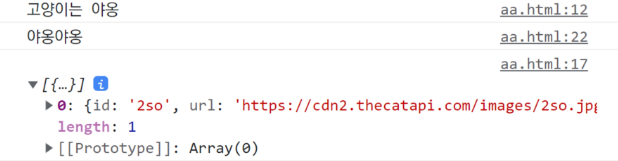
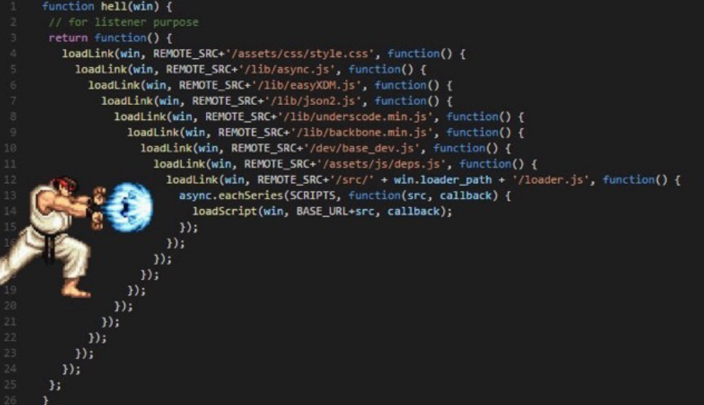
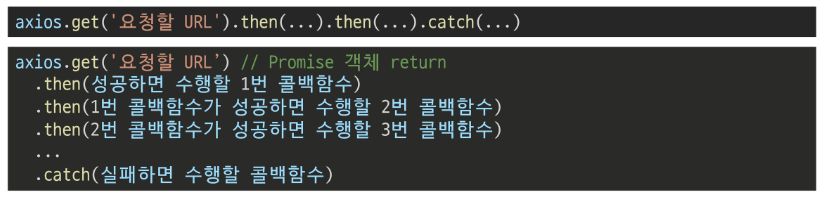
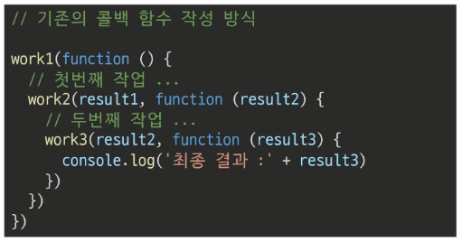
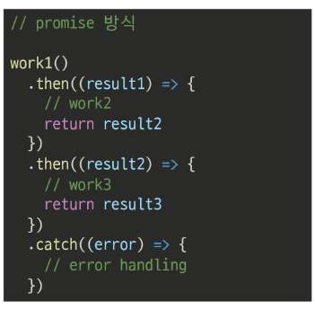
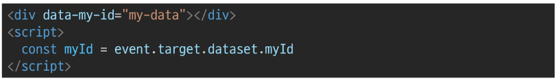
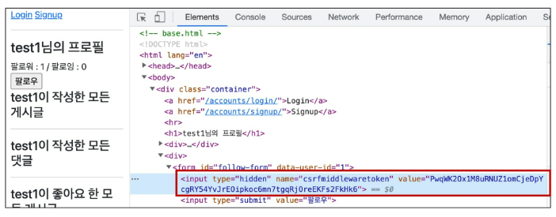

# JavaScript

## 동기와 비동기

### 동기 (Synchronous)
- 모든일 `순서대로 하나씩` 처리
- 이전작업이 끝나면 다음작업 시작 (순서대로 처리)
- 그동안 작성했던 Python 코드들
- 요청을 보내고 응답이 올때까지 기다렸다가 다음 로직을 처리

### 비동기 (Asynchronous)
- 작업 시작 후 `결과를 기다리지 않고` 다음 작업 처리 (병렬적 수행)
- 시간이 필요한 작업들은 요청 보낸뒤 응답이 빨리오는 작업부터 처리
- ex) Gmail에서 메일 전송을 누르면 목록 화면으로 전환되지만 실제로 메일을 보내는 작업은 병렬적으로 뒤에서 처리됨

```javascript
function slowRequest(callBack) {
  console.log('1. 오래 걸리는 작업 시작 ...')
  setTimeout(function () {  
    callBack()
  }, 3000)
}

function myCallBack() {
  console.log('2. 콜백함수 실행됨')
}

slowRequest(myCallBack)
console.log('3. 다른 작업 실행')


// 1. 오래 걸리는 작업 시작 ...
// 3. 다른 작업 실행
// 2. 콜백함수 실행됨
```

### 비동기 사용 이유
- `사용자 경험`
  - 아주 큰 데이터를 불러온 뒤 실행되는 앱
  - 동기로 처리하면,
  - 데이터 모두 불러온 뒤에야 앱 실행 로직 수행
  - 사용자들은 앱이 멈춘 것과 같은 경험
  - 즉, 동기식은 특정 로직 실행 동안 다른 로직 실행 차단
  - `비동기 처리`하면,
  - `먼저 처리되는 부분부터 보여줄 수 있음`
  - 사용자 경험에 긍정적 효과
  - 많은 웹 기능은 비동기 로직을 사용해서 구현되어 있음

---

## JavaScript의 비동기 처리

### Single Thread 언어, JavaScript
- 그럼 응답이 먼저 오는 순서대로 처리하지 말고, 아예 여러 작업을 동시에 처리하면 되지 않을까?
- `JavaScript는 한번에 하나의 일만 수행할 수 있는 Single Thread 언어`
- 동시 여러 작업 처리 불가
  - > [참고] Thread란?
    - 작업을 처리할 때 실제로 작업 수행하는 주체 
    - multi-thread는 업무 수행 가능 주체가 여러개  
- 즉, `JavaScript는 하나의 작업을 요청한 순서대로 처리`할 수 밖에 없음
  - 그러면 Single Thread인 JavaScript가 어떻게 비동기 처리?

### JavaScript Runtime
- JavaScript가 비동기 처리할 수 있도록 도와주는 환경 필요
- 특정 언어가 동작할 수 있는 환경 : `런타임`
- JavaScript에서 `비동기 관련 작업은 브라우저 or Node 환경에서 처리`
- 브라우저 환경에서의 비동기 동작은 아래 요소들로 구성
  - JavaScript Engine의 **`Call Stack`**
  - **`Web API`**
  - **`Task Queue`**
  - **`Event Loop`**

### 비동기 처리 동작 방식
- 브라우저 환경에서의 JavaScript 비동기는 아래와 같이 처리
  - 모든 작업은 `Call Stack`(LIFO)으로 들어간 후 처리
  - 오래 걸리는 작업이 Call Stack으로 들어오면 `Web API`로 보내서 별도로 처리하도록 함
  - Web API에서 처리가 끝난 작업들은 곧바로 Call Stack으로 들어가지 못하고 `Task Queue`(FIFO)에 순서대로 들어감
  - `Event Loop`가 Call Stack이 비어있는 것을 계속 체크하고 Call Stack이 빈다면 Task Queue에서 가장 오래된(가장 앞에 있는) 작업을 Call Stack으로 보냄

### Call Stack
- 요청이 들어올 때 마다 순차적으로 처리하는 Stack(LIFO)
- 기본적인 JavaScript의 Single Thread 작업 처리

### Web API
- JavaScript 엔진이 아닌 브라우저에서 제공하는 runtime 환경으로
- 시간이 소요되는 작업을 처리 (setTimeout, DOM Event, AJAX 요청 등)

---

## Axios
- JavaScript의 HTTP 웹 통신을 위한 라이브러리
- 확장 가능한 인터페이스와 쉽게 사용할 수 있는 비동기 통신 기능을 제공
- node 환경은 npm 이용해서 설치 후 사용할 수 있고,
- browser환경은 CDN을 이용해서 사용할 수 있음
- Axios 공식 문서 및 github
  - https://axios-http.com/kr/docs/intro
  - https://github.com/axios/axios

```html
<script src="https://cdn.jsdelivr.net/npm/axios/dist/axios.min.js"></script>
<script>
  axios.get('요청할 URL')
    .then(성공하면 수행할 콜백함수)
    .catch(실패하면 수행할 콜백함수)
</script>
```
- get, post 등 여러 method 사용 가능
- `then`을 이용해서 성공하면 수행할 로직을 작성
- `catch`를 이용해서 실패하면 수행할 로직을 작성

### 고양이 사진 가져오기
- The Cat API
  - 이미지를 요청해서 가져오는 작업을 비동기로 처리

- Python으로 요청해보기 (동기)
```python
import requests 

print('고양이는 야옹')

cat_image_search_url = 'https://api.thecatapi.com/v1/images/search'
response = requests.get(cat_image_search_url)

if response.status_code == 200:
    print(response.json())
else: 
    print('실패했다옹')
    
print('야옹야옹')


# 고양이는 야옹
# [{'id': '9u3', 'url': 'https://cdn2.thecatapi.com/images/9u3.jpg', 'width': 480, 'height': 360}]
# 야옹야옹
```

- Axios로 요청해보기 (비동기)
```html
<!DOCTYPE html>
<html lang="en">
<head>
  <meta charset="UTF-8">
  <meta http-equiv="X-UA-Compatible" content="IE=edge">
  <meta name="viewport" content="width=device-width, initial-scale=1.0">
  <title>Document</title>
</head>
<body>
  <button>야옹아 이리온</button>

  <script src="https://cdn.jsdelivr.net/npm/axios/dist/axios.min.js"></script>
  <script>
    console.log('고양이는 야옹')
    const catImageSearchURL = 'https://api.thecatapi.com/v1/images/search'
    
    
    // 버튼 추가하고 이벤트 리스너 달기
    const btn = document.querySelector('button')

    btn.addEventListener('click', function () {
      axios.get(catImageSearchURL)
        // 비동기 요청을 보내고, 응답이 오면 처리하기
        .then((response) => {
          imgElem = document.createElement('img')
          imgElem.setAttribute('src', response.data[0].url)
          document.body.appendChild(imgElem)
        })
        .catch((error) => { 
          console.log('실패했다옹')
        })
        console.log('야옹야옹') 
    })
  </script>
</body>
</html>
```



- 동기식 코드(python)는 위에서부터 순서대로 처리가 되기때문에 첫번째 print가 출력되고 이미지를 가져오는 처리를 기다렸다가 다음 print가 출력되는 반면
- 비동기식 코드(javascript)는 바로 처리가 가능한 작업(console.log)은 바로 처리하고, 오래걸리는 작업인 이미지를 요청하고 가져오는 일은 요청을 보내놓고 기다리지 않고 다음 코드로 진행 후 완료가 된 시점에 결과 출력이 진행됨
  - 버튼을 누르면 `console.log`가 먼저 출력되고, 이미지 요청을 보냄
  - 버튼을 여러번 누르면 먼저 로딩되는 이미지부터 나옴

### 정리
- axios는 비동기로 데이터 통신을 가능하게 하는 라이브러리
- 같은 방식으로 우리가 배운 Django REST API로 요청을 보내서 데이터를 받아온 후 처리가능

---
## Callback과 Promise
### 비동기 처리의 단점
- 비동기 처리 핵심은 Web API로 들어오는 순서가 아니라, **작업이 완료되는 순서에 따라 처리한다**는 것!
- 코드 실행 순서가 불명확하다는 단점!
- **실행 결과를 예상하면서 코드를 작성할 수 없게 함**
  - `콜백함수` 사용!

## 콜백 함수 (Callback Function)

### 콜백 함수란?
- **다른 함수의 인자로 전달되는 함수**
- 동기, 비동기 상관 x
- 시간이 걸리는 **비동기 작업이 완료된 후 실행할 작업을 명시하는 데 사용**되는 콜백함수 == `비동기 콜백` (asynchronous callback)
- ex) JavaScript의 Event Listener / Django의 View Function

### 콜백함수 사용 이유
- 명시적 호출이 아닌 특정한 조건 혹은 행동에 의해 호출되도록 작성 가능
- "요청이 들어오면", "이벤트가 발생하면", "데이터를 받아오면" 등의 조건으로 이후 로직을 제어 가능
- **비동기 처리를 순차적으로 동작할 수 있게 함**
- 비동기 처리를 위해선 콜백 함수 형태가 반드시 필요

### 콜백 지옥
- 콜백 함수는 연쇄적으로 발생하는 비동기 작업을 순차적으로 동작할 수 있게함
- 보통 어떤 기능의 실행 결과를 받아서 다른 기능을 수행하기 위해 많이 사용
- 이 과정을 작성하다보면 비슷한 패턴이 계속 발생



### 정리
- 콜백함수는 비동기 작업을 순차적으로 실행할 수 있게 하는 반드시 필요한 로직
- 비동기 코드를 작성하다 보면 콜백 함수로 인한 콜백 지옥은 반드시 나타나는 문제
  - 코드의 가독성을 해치고
  - 유지보수가 어려워짐

## 프로미스 (Promise)

### 프로미스
- Callback Hell 문제를 해결하기 위해 등장한 비동기 처리를 위한 객체
- "작업이 끝나면 실행 시켜줄게"라는 약속
- `비동기 작업의 완료 또는 실패를 나타내는 객체`
- Promise 기반의 클라이언트가 `Axios` 라이브러리
  - 성공에 대한 약속 `then()`
  - 실패에 대한 약속 `catch()`
- `then(callback)`
  - 요청한 작업이 성공하면 callback 실행
  - callback은 **이전 작업의 성공 결과를 인자로 전달 받음**
- `catch(callback)`
  - then()이 하나라도 실패하면 callback실행
  - callback은 이전 작업의 실패 객체를 인자로 전달 받음

- then과 catch 모두 항상 promise 객체 반환
- 즉, 계속해서 **chaining을 할 수 있음**
- **axios로 처리한 비동기 로직이 항상 promise 객체를 반환**
- 그래서 then을 계속 이어나가면서 작성할 수 있었던 것







- promise 방식은 비동기 처리를 마치 우리가 일반적으로 위에서 아래로 적는 방식처럼 코드를 작성할 수 있음

### Promise 가 보장하는 것 (vs 비동기 콜백)
- 비동기 콜백 작성 스타일과 달리 Promise가 보장하는 특징
  - callback 함수는 javascript의 Event Loop가 현재 실행 중인 Call Stack을 완료하기 이전에는 절대 호출되지 않음
    - Promise callback 함수는 Event Queue에 배치되는 엄격한 순서로 호출됨
  - 비동기 작업이 성공하거나 실패한 뒤에 .then() 메서드를 이용하여 추가한 경우에도 1번과 똑같이 동작
  - .then() 을 여러번 사용하여 여러개의 callback함수를 추가할 수 있음(chaining)
    - 각각의 callback은 주어진 순서대로 하나하나 실행하게 됨
    - Chaining은 Promise의 가장 뛰어난 장점


---

## AJAX
### AJAX란?
- 비동기 통신을 이용하면 **화면 전체를 새로고침 하지 않아도** 서버로 요청을 보내고, 데이터를 받아 **화면의 일부분만 업데이트** 가능
- 이러한 '`비동기 통신 웹 개발 기술`'을 Asynchronous Javascript And XML(AJAX)라고 함
- `AJAX 특징`
  - **페이지 새로고침 없이 서버에 요청**
  - **서버로부터 응답(데이터)을 받아 작업을 수행**
- 이러한 비동기 웹 통신을 위한 라이브러리 중 하나가 `Axios`

## 비동기(Async) 적용하기
### 사전준비
- 마지막 Django 프로젝트 준비하기 (M:N 까지 진행한 프로젝트)
  - 05_js/axios_with_django
- 가상 환경 생성 킻 활성화, 패키지 설치

### 팔로우 (follow)
- 각각의 템플릿에서 script 코드를 작성하기 위한 block tag 영역 작성

```html
<!DOCTYPE html>
<html lang="en">
<head>
  <meta charset="UTF-8">
  <meta http-equiv="X-UA-Compatible" content="IE=edge">
  <meta name="viewport" content="width=device-width, initial-scale=1.0">
  <link href="https://cdn.jsdelivr.net/npm/bootstrap@5.2.0/dist/css/bootstrap.min.css" rel="stylesheet" integrity="sha384-gH2yIJqKdNHPEq0n4Mqa/HGKIhSkIHeL5AyhkYV8i59U5AR6csBvApHHNl/vI1Bx" crossorigin="anonymous">  <title>Document</title>
</head>
<body>
  <div class="container">
    
      <h3>{{ user }}</h3>
      <a href="">내 프로필</a>
      <form action="" method="POST">
        
        <input type="submit" value="Logout">
      </form>
      <form action="" method="POST">
        
        <input type="submit" value="회원탈퇴">
      </form>
      <a href="">회원정보수정</a>
    
      <a href="">Login</a>
      <a href="">Signup</a>
    
    <hr>
    
    
  </div>
  <script src="https://cdn.jsdelivr.net/npm/bootstrap@5.2.0/dist/js/bootstrap.bundle.min.js" integrity="sha384-A3rJD856KowSb7dwlZdYEkO39Gagi7vIsF0jrRAoQmDKKtQBHUuLZ9AsSv4jD4Xa" crossorigin="anonymous"></script>
  <!-- 각각의 템플릿에서 script 코드를 작성하기 위한 block tag 영역 작성 -->
  
  
</body>
</html>
```

- axios CDN 작성
- form 요소 선택을 위해 id 속성 지정 및 선택
- 불필요해진 action과 method 속성은 삭제 (요청은 axios로 대체되기 때문)
- form 요소에 이벤트 핸들러 작성 및 submit 이벤트 취소
- axios 요청 준비

- 현재 axios로 POST 요청을 보내기 위해 필요한 것
  - `url에 작성할 user pk는 어떻게 작성해야 할까?`
    - url에 작성할 user pk 가져오기 (HTML -> JavaScript)
    - > data-* attributes
      - 사용자 지정 데이터 특성을 만들어 임의의 데이터를 HTML과 DOM사이에서 교환할 수 있는 방법
      - 
      - 모든 사용자 지정 데이터는 dataset속성을 통해 사용 가능
      - 예를 들어 `data-test-value`라는 이름의 특성을 지정했다면
      - javascript에서는 `element.dataset.testValue`로 접근 가능
      - 속성명 작성 시 주의사항
        - 대소문자 여부에 상관없이 xml로 시작하면 안됨!
        - 세미콜론 포함 x
        - 대문자 포함 x
  - `csrftoken은 어떻게 보내야 할까?`
    - 먼저 hidden 타입으로 숨겨져있는 csrf 값을 가진 input 태그를 선택해야함
    - 
    - AJAX로 csrf 토큰 보내기


```html
<!--accounts/profile.html-->



  <h1>{{ person.username }}님의 프로필</h1>
  <div>
    팔로워 : <span id="followers-count">{{ person.followers.all|length }}</span> / 팔로잉 : <span id="followings-count">{{ person.followings.all|length }}</span>
  </div>


  
  <div>
    <!-- form 요소 선택을 위해 id 속성 지정 및 선택 -->
    <!-- url에 작성할 user pk 가져오기 (HTML -> JavaScript) -->
    <form id="follow-form" data-user-id="{{ person.pk }}">
      
      
        <input type="submit" value="언팔로우">
      
        <input type="submit" value="팔로우">
      
    </form>
  <div>
  

  <h2>{{ person.username }}이 작성한 모든 게시글</h2>
  
    <div>{{ article.title }}</div>
  

  <hr>

  <h2>{{ person.username }}이 작성한 모든 댓글</h2>
  
    <div>{{ comment.content }}</div>
  

  <hr>

  <h2>{{ person.username }}이 좋아요 한 모든 게시글</h2>
  
    <div>{{ article.title }}</div>
  

  <a href="">back</a>

  

  <!-- axios CDN 작성 -->
  <script src="https://cdn.jsdelivr.net/npm/axios/dist/axios.min.js"></script>
  <script>
    // form 요소 선택을 위해 id 속성 지정 및 선택
    const form = document.querySelector('#follow-form')
    // hidden 타입으로 숨겨져있는 csrf 값을 가진 input 태그를 선택해야함
    const csrftoken = document.querySelector('[name=csrfmiddlewaretoken]').value
    // form 요소에 이벤트 핸들러 작성 및 submit 이벤트 취소
    form.addEventListener('submit', function (event) {
      event.preventDefault()
      // console.log(event.target.dataset)
      
      // url에 작성할 user pk 가져오기 (HTML -> JavaScript)
      const userId = event.target.dataset.userId

      // axios 요청 준비
      axios({
        method: 'post',
        url: `/accounts/${userId}/follow/`, // url 작성 마치기 (dataset 이용!)
        // AJAX로 csrftoken을 보내는 방법
        headers: {'X-CSRFToken': csrftoken,}
      })
        .then((response) => {
          // console.log(response)
          // console.log(response.data)
    
          // 버튼 토글
          const isFollowed = response.data.is_followed
          const followBtn = document.querySelector('#follow-form > input[type=submit]')
          
          if (isFollowed === true) {
            followBtn.value = '언팔로우'
          } else {
            followBtn.value = '팔로우'
          }
    
          // 팔로우, 팔로워 인원 수 
          const followersCountTag = document.querySelector('#followers-count')
          const followingsCountTag = document.querySelector('#followings-count')
          const followersCount = response.data.followers_count
          const followingsCount = response.data.followings_count
          followersCountTag.innerText = followersCount
          followingsCountTag.innerText = followingsCount
        })
        .catch((error) => {
          console.log(error.response)
        })
    })
  </script>

```

- 팔로우 버튼을 토글하기 위해서는 현재 팔로우가 된 상태인지 여부 확인이 필요
- axios 요청을 통해 받는 response 객체를 활용해 view 함수를 통해서 팔로우 여부를 파악할 수 있는 변수를 담아 JSON 타입으로 응답하기
  - 팔로우 여부를 확인하기 위한 is_followed 변수 작성 및 JSON 응답
  - view 함수에서 응답한 is_followed를 사용해 버튼 토글하기

```python
# accounts/views.py

from django.http import JsonResponse

@require_POST
def follow(request, user_pk):
    if request.user.is_authenticated:
        User = get_user_model()
        me = request.user
        you = User.objects.get(pk=user_pk)
        if me != you:
            # 팔로우 여부를 확인하기 위한 is_followed 변수 작성 및 JSON 응답
            if you.followers.filter(pk=me.pk).exists():
                you.followers.remove(me)
                is_followed = False
            else:
                you.followers.add(me)
                is_followed = True
            context = {
                'is_followed': is_followed,
                'followers_count': you.followers.count(),
                'followings_count': you.followings.count(),
            }
            return JsonResponse(context)
        return redirect('accounts:profile', you.username)
    return redirect('accounts:login')
```

```html
<!--accounts/profile.html-->
<script>
  ...
  axios({
        method: 'post',
        url: `/accounts/${userId}/follow/`,
        headers: {'X-CSRFToken': csrftoken,}
      })
        .then((response) => {
          // view 함수에서 응답한 is_followed를 사용해 버튼 토글하기
          const isFollowed = response.data.is_followed
          const followBtn = document.querySelector('#follow-form > input[type=submit]')
          
          if (isFollowed === true) {
            followBtn.value = '언팔로우'
          } else {
            followBtn.value = '팔로우'
          }
        })
</script>
```

> [참고] XHR
- "XMLHttpRequest"
- AJAX 요청을 생성하는 JavaScript API
- XHR의 메서드로 브라우저와 서버 간 네트워크 요청을 전송 가능
- Axios는 손쉽게 XHR을 보내고 응답 결과를 Promise 객체로 반환해주는 라이브러리


### 팔로워 & 팔로잉 수 비동기 적용
- 해당 요소를 선택할 수 있도록 span 태그와 id 속성 작성

```html
<!--accounts/profile.html-->



  <h1>{{ person.username }}님의 프로필</h1>
  <div>
    <!-- 해당 요소를 선택할 수 있도록 span 태그와 id 속성 작성 -->
    팔로워 : <span id="followers-count">{{ person.followers.all|length }}</span> / 
    팔로잉 : <span id="followings-count">{{ person.followings.all|length }}</span>
  </div>
```

- 직전에 작성한 span 태그를 각각 선택
```html
<script>
   ...
      axios({
        method: 'post',
        url: `/accounts/${userId}/follow/`,
        headers: {'X-CSRFToken': csrftoken,}
      })
        .then((response) => {
         ...
          // 팔로우, 팔로워 인원 수 
          // 직전에 작성한 span 태그를 각각 선택
          const followersCountTag = document.querySelector('#followers-count')
          const followingsCountTag = document.querySelector('#followings-count')
          // view 함수에서 응답한 연산 결과를 사용해 각 태그의 인원 수 값 변경하기
          const followersCount = response.data.followers_count
          const followingsCount = response.data.followings_count
          followersCountTag.innerText = followersCount
          followingsCountTag.innerText = followingsCount
        })
        .catch((error) => {
          console.log(error.response)
        })
</script>
```
- 팔로워, 팔로잉 인원 수 연산은 view 함수에서 진행하여 결과를 응답으로 전달
- view 함수에서 응답한 연산 결과를 사용해 각 태그의 인원 수 값 변경하기

```python
# accounts/views.py

from django.http import JsonResponse

@require_POST
def follow(request, user_pk):
    if request.user.is_authenticated:
        User = get_user_model()
        me = request.user
        you = User.objects.get(pk=user_pk)
        if me != you:
            # 팔로우 여부를 확인하기 위한 is_followed 변수 작성 및 JSON 응답
            if you.followers.filter(pk=me.pk).exists():
                you.followers.remove(me)
                is_followed = False
            else:
                you.followers.add(me)
                is_followed = True
            context = {
                'is_followed': is_followed,
                # 팔로워, 팔로잉 인원 수 연산은 view 함수에서 진행하여 결과를 응답으로 전달
                'followers_count': you.followers.count(),
                'followings_count': you.followings.count(),
            }
            return JsonResponse(context)
        return redirect('accounts:profile', you.username)
    return redirect('accounts:login')
```

### 최종 코드
```html
<!--accounts/profile.html-->



  <h1>{{ person.username }}님의 프로필</h1>
  <div>
    팔로워 : <span id="followers-count">{{ person.followers.all|length }}</span> / 팔로잉 : <span id="followings-count">{{ person.followings.all|length }}</span>
  </div>


  
  <div>
    <form id="follow-form" data-user-id="{{ person.pk }}">
      
      
        <input type="submit" value="언팔로우">
      
        <input type="submit" value="팔로우">
      
    </form>
  <div>
  

  <h2>{{ person.username }}이 작성한 모든 게시글</h2>
  
    <div>{{ article.title }}</div>
  

  <hr>

  <h2>{{ person.username }}이 작성한 모든 댓글</h2>
  
    <div>{{ comment.content }}</div>
  

  <hr>

  <h2>{{ person.username }}이 좋아요 한 모든 게시글</h2>
  
    <div>{{ article.title }}</div>
  

  <a href="">back</a>

  

  <script src="https://cdn.jsdelivr.net/npm/axios/dist/axios.min.js"></script>
  <script>
    const form = document.querySelector('#follow-form')
    const csrftoken = document.querySelector('[name=csrfmiddlewaretoken]').value
    
    form.addEventListener('submit', function (event) {
      event.preventDefault()
      // console.log(event.target.dataset)
      
      const userId = event.target.dataset.userId
    
      axios({
        method: 'post',
        url: `/accounts/${userId}/follow/`,
        headers: {'X-CSRFToken': csrftoken,}
      })
        .then((response) => {
          // console.log(response)
          // console.log(response.data)
    
          // 버튼 토글
          const isFollowed = response.data.is_followed
          const followBtn = document.querySelector('#follow-form > input[type=submit]')
          
          if (isFollowed === true) {
            followBtn.value = '언팔로우'
          } else {
            followBtn.value = '팔로우'
          }
    
          // 팔로우, 팔로워 인원 수 
          const followersCountTag = document.querySelector('#followers-count')
          const followingsCountTag = document.querySelector('#followings-count')
          const followersCount = response.data.followers_count
          const followingsCount = response.data.followings_count
          followersCountTag.innerText = followersCount
          followingsCountTag.innerText = followingsCount
        })
        .catch((error) => {
          console.log(error.response)
        })
    })
  </script>

```
```python
# accounts/views.py

@require_POST
def follow(request, user_pk):
    if request.user.is_authenticated:
        User = get_user_model()
        me = request.user
        you = User.objects.get(pk=user_pk)
        if me != you:
            if you.followers.filter(pk=me.pk).exists():
                you.followers.remove(me)
                is_followed = False
            else:
                you.followers.add(me)
                is_followed = True
            context = {
                'is_followed': is_followed,
                'followers_count': you.followers.count(),
                'followings_count': you.followings.count(),
            }
            return JsonResponse(context)
        return redirect('accounts:profile', you.username)
    return redirect('accounts:login')
```


### 좋아요 (like)
- 좋아요 비동기 적용은 "팔로우와 동일한 흐름 + `forEach()` & `querySelectorAll()`"
  - index 페이지 각 게시글에 좋아요 버튼이 있기 때문
- **내가 누른 버튼의 DOM 조작하기 (DOM)**
  - form을 전부 선택 후 (`querySelectorAll`) -> `eventListener` 추가 (`forEach`)
  - 몇번째 버튼인지를 몰라서 
  - 몇번째 정보를 속성으로 (article.pk) 정보 전달
    - `dataset` 사용 (각 버튼들의 구분을 위해!)
      - HTML : data-변수명="값" (변수명 : article-id)
      - JS : dataset.변수명 (변수명 자동 변환 : articleId)
- **axios 요청으로 좋아요 보내기 (Ajax)**
  - axios 이용해서 `url`, `method` 설정 요청했는데
  - 동작 x (403 ForBidden Error) -> `CSRF TOKEN` 필요
  - 로 생성된 값을 추출
    - 속성 선택자(querySelector) `[name=csrfmiddlewaretoken]` 요소 선택해서 value값 추출
  - headers 라는 곳에 `headers: {'X-CSRFToken': csrftoken}` 전달 (정상적 요청)
- **응답받은 data로 DOM 변경 (DOM)**
  - views.py (백) 에서 버튼이 눌렸는지 여부를 전달해주는 `is_like` 변수 만들고, json으로 응답 (`JsonResponse`)
  - 좋아요 누른 사람 수를 보여주기 위해 '`like_cnt`': article.like_users.count()도 같이 JsonResponse로 전달해줌
- JS에서 isLike와 likeCnt로 data 가져와주고,
- likeCntText 변수로 좋아요 수 span 태그 선택하고 innerText를 likeCnt로 변경!


### 최종 코드
```html
<!--articles/index.html-->



  <h1>Articles</h1>
  
    <a href="">CREATE</a>
  
  <hr>
  
    <p>
      <b>작성자 : <a href="">{{ article.user }}</a></b>
    </p>
    <p>글 번호 : {{ article.pk }}</p>
    <p>제목 : {{ article.title }}</p>
    <p>내용 : {{ article.content }}</p>
    <div>
      <form class="like-forms" data-article-id="{{ article.pk }}">
        
        
          <input type="submit" value="좋아요 취소" id="like-{{ article.pk }}">
        
          <input type="submit" value="좋아요" id="like-{{ article.pk }}">
        
      </form>
    </div>
    <a href="">상세 페이지</a>
    <hr>
  



  <script src="https://cdn.jsdelivr.net/npm/axios/dist/axios.min.js"></script>
  <script>
    const forms = document.querySelectorAll('.like-forms')
    const csrftoken = document.querySelector('[name=csrfmiddlewaretoken]').value

    forms.forEach((form) => {
      form.addEventListener('submit', function (event) {
        event.preventDefault()
        // onsole.log(event.target.dataset)

        const articleId = event.target.dataset.articleId

        axios({
          method: 'post',
          url: `http://127.0.0.1:8000/articles/${articleId}/likes/`,
          headers: {'X-CSRFToken': csrftoken},
        })
          .then((response) => {
            // console.log(response)
            // console.log(response.data)

            const isLiked = response.data.is_liked

            const likeBtn = document.querySelector(`#like-${articleId}`)
            if (isLiked === true) {
              likeBtn.value = '좋아요 취소'
            } else {
              likeBtn.value = '좋아요'
            }
            // likeBtn.value = isLiked ? '좋아요 취소' : '좋아요'
          })
          .catch((error) => {
            console.log(error.response)
          })
      })
    })
  </script>

```

```python
# articles.views.py

from django.http import JsonResponse

@require_POST
def likes(request, article_pk):
    if request.user.is_authenticated:
        article = Article.objects.get(pk=article_pk)

        if article.like_users.filter(pk=request.user.pk).exists():
            article.like_users.remove(request.user)
            is_liked = False
        else:
            article.like_users.add(request.user)
            is_liked = True
        context = {
            'is_liked': is_liked,
        }
        return JsonResponse(context)
    return redirect('accounts:login')
```

---
# SUMMARY
- 동기와 비동기
- JavaScript의 비동기 처리
  - Call Stack, Web API, Task Queue, Event Loop
- Axios 라이브러리
  - then & catch
- Async Callback과 Promise
- AJAX

