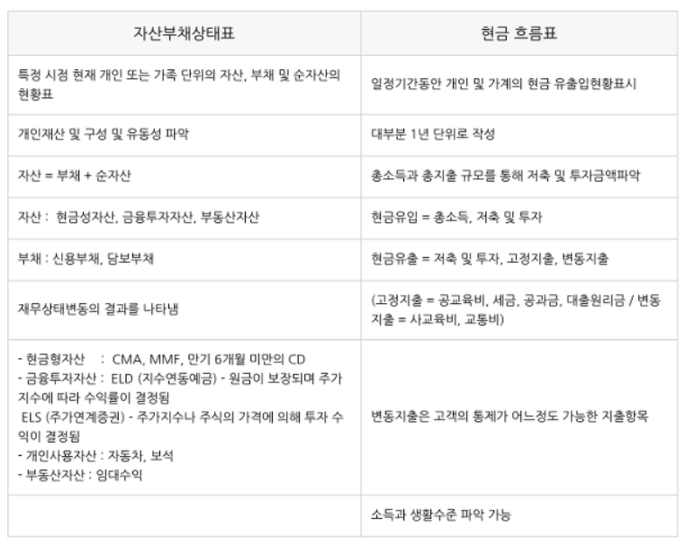

# 1-1. 재무설계의 의의 및 재무설계 프로세스

## 개인 재무 설계의 의미
- 재무 목표 달성을 위한 개인 및 가계의 재무적 및 **비재무적** 자원을 적절하게 관리하는 과정
- 재무상담을 통한 중장기적 목표 달성
- 고객의 목표에서 시작 = `재무설계`, 고객의 문제 평가에서 시작 = `재무상담`

## 개인 재무 설계의 필요성
1) `사회 경제적 배경`
  - 자산 및 부채의 증가
  - 금융시장 개방 및 국제화
  - 금융상품 다양화 및 금융관련법규 강화

2) `인구 통계적 배경`
  - 1인 가구 증가
  - 저출산화 및 고령화
  - 노동환경의 변화
  - `노년부양비 = 노년인구 / 생산가능인구`
  - 2026년 대한민국은 초고령 사회 진입
  - `노령화지수 = 노년인구 / 유년인구`

3) `소비자 의식의 변화`
  - 개인주의 사고방식과 개별성 추구
  - 비재무적 요구의 증가
  - 재무설계의 중요성 인식

## 계약 체결 기법
- `예화법`
  - 고객과 조건이 동일한 제 3자의 거래 성공사례 등을 인용해 거절에 대응하는 방법
- `손해암시법`
  - 가입을 미루는 고객에게 손해를 암시하여 계약 체결을 유도하는 방법
- `묵시적동의법`
  - 고객이 동의하지 않았지만, 동의한 것 치고 진행하는 방법
- `양자택일법`
  - 계약상 2가지의 상품을 두고 선택하게 하는 방법

## 최초 면담 시 자산관리사가 활용할 유용한 질문
- 상황파악질문
- 문제인식질문
- `시사질문`
  - 고객 문제로 인해 발생하여 파급되는 결과에 대한 심각성을 고객 스스로 인지하게끔 하는 질문
- 해결질문

## 개인 재무설계 절차
1) 고객과의 **관계 정립** (유망고객 찾기, 면담 준비)
2) **고객정보** 수집 및 **재무목표** 설정 (우선순위 결정), 정보 수집
3) 고객의 **재무상태 분석** 및 평가 (자산부채상태표, 현금흐름표)
4) 재무설계 제안 (제안 시 고려사항 확인)
5) 재무설계 진행
6) 정기점검 및 사후관리

> [참고] 유망고객
- 재무목표가 있는 사람
- 금융상품에 가입할 경제적 능력이 있는 사람
- 만남 가능성이 있는 사람
- 실행력이 있는 사람

## 생애주기별 재무목표
- 청년기
  - 직장을 구하고 결혼자금을 마련
- 가족형성기
  - 자녀출생준비자금 마련, 자동차구매자금 마련
- 자녀양육기
  - 교육자금 마련, 주택자금 마련
- 자녀성장기
  - 자녀들의 결혼자금 및 주택확장
- 가족축소기
  - 노후자금 마련, 기타목적자금 마련
- 은퇴 및 노후기
  - 상속 및 증여

## 개인 재무제표

## 연령대별 재무설계제안
- 20대
  - 종자돈모으기, 장기적 관점 갖기, 합리적 소비 습관화
- 30대
  - 기간별 제한된 부동산 투자, 3층 보장
- 40대
  - 연금투자, 재무재조정, 보장자산, 은퇴준비
- 50대
  - 주택조정, 재취업의 삶

## 고객유형별 재무설계 제안
- 개인사업자
  - 4대보험, 퇴직연금, 법인사업전환
- 근로소득자
  - 생애별 우선순위달성, 각종절세상품, 퇴직후창업

