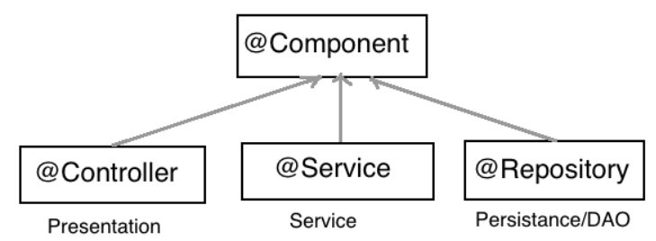

# Bean과 의존성 주입 (Dependency Injection)

## IoC 컨테이너 (Inversion Of Control Container)
- 기존의 모든 제어를 클라이언트의 코드가 가지도록 구현하던 것을 Framwork가 제어를 나누어 가져가 의존 관계의 방향이 달라지게 되는 것
- 즉, IoC는 Spring Framwork로 `객체를 관리`하고 `객체의 생성을 책임`지고, `의존성까지 관리`해주는 컨테이너
- **Spring Framwork의 IoC가 객체의 생명주기를 관리하며 DI(Dependency Injection) 패턴을 제공하여 클라이언트는 비즈니스 로직에 집중할 수 있도록 해주는 것❗**

## Bean 이란?
- Bean은 `Spring Framwork의 IoC가 관리하는 객체`❗
- 즉, IoC에 의해서 자바 객체가 생성되면 이 객체를 Bean라 한다.
- Bean은 @Bean, @Component, @Service, @Repository와 같은 어노테이션으로 생성될 수 있으며, application.xml와 같은 XML 파일에 Bean을 직접 설정해주는 것도 가능 (application.xml 파일에 Bean을 직접 등록하는 것은 고전적인 방법)

## 어노테이션으로 Bean 추가
- Spring Boot의 경우 `@Component`, `@Service`, `@Controller`, `@RestController`, `@Repository`, @Bean, @Configuration 등오로 필요한 Bean을 등록할 수 있다. 



- 각 어노테이션들은 @Component 어노테이션을 상속받고 있다. 이러한 @Controller, @Service, @Repository 어노테이션은 @Component 어노테이션보다 조금 더 구체적


## 의존성 주입(DI, Dependency Injection)
- 의존성 주입이란, Spring Framwork의 IoC에서 관리하고 있는 Bean들 중에서 필요한 것을 객체에 주입하는 것❗
1. 생성자를 통해 Bean의 의존성 주입하기

```java
@Component
public class SampleController {
    private SampleRepository sampleRepository;
 
    @Autowired
    public SampleController(SampleRepository sampleRepository) {
        this.sampleRepository = sampleRepository;
    }
}
```

2. 필드(Property)에 직접 @Autowired 어노테이션을 추가해 의존성을 주입하기

```java
@Component
public class SampleController {
    @Autowired
    private SampleRepository sampleRepository;
}
```

3. Setter를 통해 의존성을 주입하기

```java
@Component
public class SampleController {
    private SampleRepository sampleRepository;
 
    @Autowired
    public void setSampleRepository(SampleRepository sampleRepository) {
        this.sampleRepository = sampleRepository;
    }
}
```