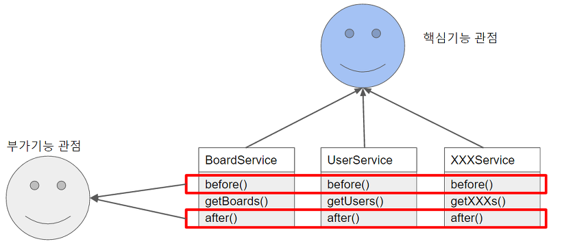

# AOP (Aspect Oriented Programming)

- OOP(Object Oriented Programming) 의 단점을 보완하기 위한 프로그래밍 방식
- 여러 곳에서 사용되는 공통 기능을 모듈화하고, 쓰이는 곳에 필요할 때 연결함으로써 유지보수, 재사용성에 용이하도록 프로그래밍 하는 것



- 공통 기능 before(), after() 메서드가 존재하는 것을 확인할 수 있고, 이를 AOP를 적용해 공통된 요소로 추출하는 것
- 결국 공통된 기능을 재사용하는 기법

# Exception Handler with AOP

- 일반화된 예외를 처리하기 위해 AOP를 활용해 Exception Handler를 구현하는 방법
- @ExceptionHandler 어노테이션을 사용할 경우 하나의 클래스에 대해서 발생하는 예외를 처리해주는 Exception Handler를 추가할 수 있음
- 그렇다면 하나의 클래스가 아니라 모든 클래스(컨트롤러 등)에서 발생하는 예외를 처리하고 싶으면 어떻게 할까?
- *이때 사용할 수 있는 개념이 바로 AOP❗*

- `@ControllerAdvice` 어노테이션은 **모든 컨트롤러에서 발생할 수 있는 예외를 해당 어노테이션을 추가한 클래스에 존재하는 Exception Handler로 처리할 수 있도록 해줌**


### ExceptionResponse 클래스
- ExceptionResponse는 에러가 발생했을때 Client에게 보여줄 정보를 포함하는 객체

```java
package com.example.restfulwebservice.exception;

import lombok.AllArgsConstructor;
import lombok.Data;
import lombok.NoArgsConstructor;

import java.util.Date;

// 예외처리위한 클래스 (일반화된 예외)
// 예외가 발생하면 해당 객체에 값을 넣어 사용자에게 전달할 클래스
// 에러가 발생했을때 Client에게 보여줄 정보를 포함하는 객체
@Data
@AllArgsConstructor
@NoArgsConstructor
public class ExceptionResponse {
    private Date timestamp; // 예외 발생 날짜
    private String message; // 예외 메세지
    private String details; // 예외가 어느 요청에서 났는지 확인
}
```


### UserNotFoundException 클래스

```java
package com.example.restfulwebservice.user;
// HTTP Status code
// 2XX : OK
// 4XX : Client
// 5XX : Server

import org.springframework.http.HttpStatus;
import org.springframework.web.bind.annotation.ResponseStatus;
// 데이터 존재하지않을때의 오류처리위함
@ResponseStatus(HttpStatus.NOT_FOUND)
public class UserNotFoundException extends RuntimeException {
    public UserNotFoundException(String message) {
        super(message);
    }
}
```

### CustomizedResponseEntityExceptionHandler 클래스

```java
package com.example.restfulwebservice.exception;

import com.example.restfulwebservice.user.UserNotFoundException;
import org.springframework.http.HttpStatus;
import org.springframework.http.ResponseEntity;
import org.springframework.web.bind.annotation.ControllerAdvice;
import org.springframework.web.bind.annotation.ExceptionHandler;
import org.springframework.web.bind.annotation.RestController;
import org.springframework.web.context.request.WebRequest;
import org.springframework.web.servlet.mvc.method.annotation.ResponseEntityExceptionHandler;

import java.util.Date;

// 에러메세지 커스텀

// 일반화된 Exception
@RestController
@ControllerAdvice   // 모든 컨트롤러 실행될때 해당 bean이 실행됨 (모든 예외상황이 발생할때 해당 핸들러에서 처리하도록)
public class CustomizedResponseEntityExceptionHandler extends ResponseEntityExceptionHandler {
    @ExceptionHandler(Exception.class)
    public final ResponseEntity<Object> handleAllException(Exception ex, WebRequest request){
        ExceptionResponse exceptionResponse =
                new ExceptionResponse(new Date(), ex.getMessage(), request.getDescription(false));

        return new ResponseEntity(exceptionResponse, HttpStatus.INTERNAL_SERVER_ERROR);
        // ResponseEntity<Object> 객체는 HTTP Status를 다르게해 Client에게 보낼때 사용하는 객체
    }


    // UsernotfoundException 발생했을때
    @ExceptionHandler(UserNotFoundException.class)
    public final ResponseEntity<Object> handleUserNotFoundException(Exception ex, WebRequest request){
        ExceptionResponse exceptionResponse =
                new ExceptionResponse(new Date(), ex.getMessage(), request.getDescription(false));

        return new ResponseEntity(exceptionResponse, HttpStatus.NOT_FOUND);

    }

}
```


