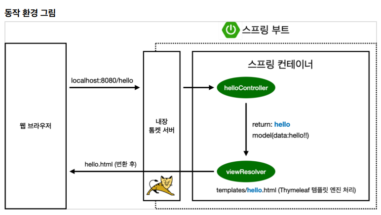

# Spring
## 라이브러리 살펴보기
> Gradle은 의존관계가 있는 라이브러리를 함께 다운로드 함

### 스프링 부트 라이브러리
- `spring-boot-starter-web`
  - spring-boot-starter-tomcat: 톰캣 (웹서버)
  - spring-webmvc: 스프링 웹 MVC
- spring-boot-starter-thymeleaf: 타임리프 템플릿 엔진(View)
- spring-boot-starter(공통): 스프링 부트 + 스프링 코어 + 로깅
  - spring-boot
    - spring-core
  - spring-boot-starter-logging
    - logback, slf4j

### 테스트 라이브러리
- spring-boot-start-test
  - junit: 테스트 프레임워크
  - mockito: 목 라이브러리
  - assertj: 테스트 코드를 좀 더 편하게 작성하게 도와주는 라이브러리
  - spring-test: 스프링 통합 테스트 지원

---

## View 환경설정
### Welcom Page 만들기

```html
<!--resources/static/index.html -->

<!DOCTYPE HTML>
<html>
<head>
 <title>Hello</title>
 <meta http-equiv="Content-Type" content="text/html; charset=UTF-8" />
</head>
<body>
Hello
<a href="/hello">hello</a>
</body>
</html>
```
- 스프링 부트가 제공하는 Welcome Page 기능
  - static/index.html 을 올려두면 Welcome page 기능을 제공한다

### thymeleaf 템플릿 엔진

```java
@Controller
public class HelloController {
    @GetMapping("hello")
    public String hello(Model model) {
        model.addAttribute("data","hello!!");
        return "hello";
    }
}
```

```html
<!-- resources/templates/hello.html -->

<!DOCTYPE HTML>
<html xmlns:th="http://www.thymeleaf.org">
<head>
 <title>Hello</title>
 <meta http-equiv="Content-Type" content="text/html; charset=UTF-8" />
</head>
<body>
<p th:text="'안녕하세요. ' + ${data}" >안녕하세요. 손님</p>
</body>
</html>
```

### thymeleaf 템플릿 엔진 동작 확인



- 컨트롤러에서 리턴 값으로 문자를 반환하면 뷰 리졸버(viewResolver)가 화면을 찾아서 처리
  - 스프링 부트 템플릿엔진 기본 viewName 매핑
  - `resources:template/` + {ViewName} + `.html`