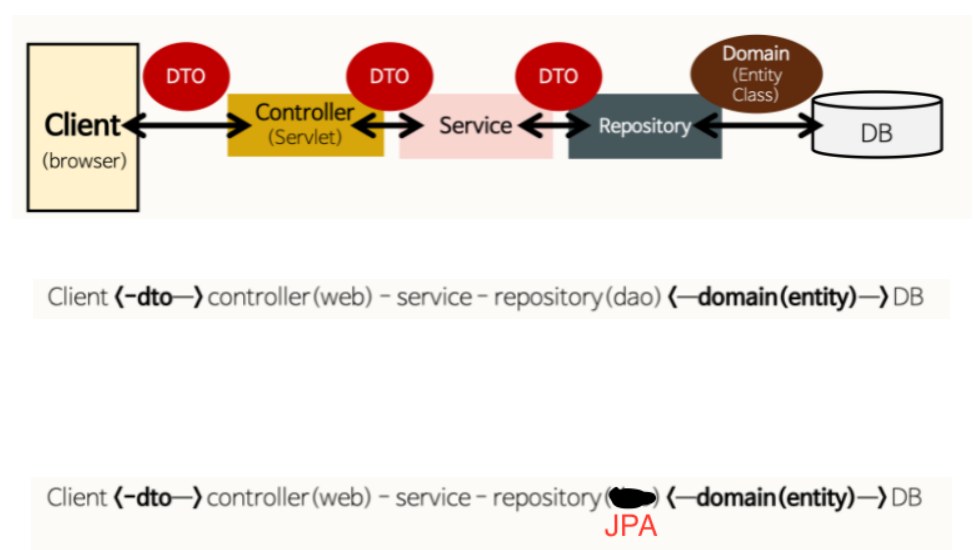

> Controller가 무엇인지 알기 전에 MVC 패턴에 대하여 먼저 아는 것이 중요❗

# MVC 패턴이란?
- Model-View-Controller의 약자로서 개발을 할 때 3가지 형태로 역할을 나누어 개발하는 방법론
- **Model**
  - 어플리케이션이 무엇을 할 것인지 정의하는 부분 
  - 즉 `DB와 연동하여 사용자가 입력한 데이터나 사용자에게 출력할 데이터를 다룸`
- **View**
  - 사용자에게 시각적으로 보여주는 부분 (`UI`)
- **Controller**
  - Model이 데이터를 어떻게 처리할지 알려주는 역할
  - 사용자에 의해 `클라이언트가 보낸 데이터`가 있으면 모델을 호출하기전에 `적절히 가공을 하고 모델을 호출`
  - 그런다음 `모델이 업무 수행을 완료`하면 그결과를 가지고 `View에게 전달`하는 역할을 함


# **Controller**란?⭐
- 사용자의 요청을 처리 한 후 지정된 뷰에 모델 객체를 넘겨주는 역할
- 즉 `사용자의 요청이 진입하는 지점`이며 요청에 따라 `어떤 처리를 할지 결정을 Service에 넘겨줌`
- 그후 `Service에서 실질적으로 처리한 내용을 View에게 넘겨줌`

## @RestController
- JSON/XML형태로 객체 데이터 반환을 목적

```java
@RestController // JSON으로 데이터를 주고받음을 선언합니다.
public class ProductRestController {

    private final ProductService productService;
    private final ProductRepository productRepository;

    // 등록된 전체 상품 목록 조회
    @GetMapping("/api/products")
    public List<Product> getProducts() {
        return productRepository.findAll();
    }
}
```

# **Service**란?⭐

1. **Client가 Request**를 보낸다.(Ajax, Axios, fetch등..)
2. **Request URL에 알맞은 Controller가 수신** 받는다. (@Controller , @RestController)
3. Controller 는 넘어온 요청을 처리하기 위해 **Service 를 호출**한다.
4. **Service는 알맞은 정보를 가공**하여 **Controller에게 데이터를 넘긴다.**
5. Controller 는 Service 의 **결과물을 Client 에게 전달**해준다.


> Service가 알맞은 정보를 가공하는 과정을 '비즈니스 로직을 수행한다.' 라고 한다.
> Service가 비즈니스 로직을 수행하고 데이터베이스에 접근하는 DAO를 이용해서 결과값을 받아 온다.

# **DAO**(Data Access Object)란?⭐

- 단순하게 페이지를 불러오고 DB정보를 한번에 불러오는 간단한 프로젝트의 경우 Service와 DAO는 차이가 거의 없을 수 있음
- DAO 는 쉽게 말해서 `Mysql 서버에 접근하여 SQL문을 실행할 수 있는 객체`

## DAO 와 JPA(Java Persisitence API)
- Spring Data **JPA**는 매우 적은 코드로 DAO를 구현할 수 있도록 해줌
- 즉 **인터페이스를 만드는 것 만으로도 Entity (@Entity)클래스에 대한 insert, Update, Delete, Select 를 실행할 수 있게 해줌**
- 뿐만 아니라 인터페이스에 메소드를 선언하는 것 만으로 라이트한 쿼리를 수행하는 코드를 만드는것과 동등한 작업을 수행
- 하지만 JPA가 만들 수 있는 코드는 매우 가볍고 쉬운 쿼리를 대체하는 것이라서 복잡도가 높아지면 사용하기가 매우 어려움
- **복잡도가 높은 곳은 DAO로 같이 사용**


# **Repository**란?⭐
- Entity에 의해 생성된 DB에 접근하는 메서드 들을 사용하기 위한 인터페이스
- **@Entity라는 어노테이션으로 데이터베이스 구조**를 만들었다면 여기에 **CRUD**를 해야함. 즉, 이것을 어떻게 할 것인지 정의해주는 계층!
- JPA로 Reposity를 만들어보자!

```java
public interface ContentRepository extends JpaRepository<Content, Integer>{
    // Repository에 Method 정의해 커스텀 가능!
    public List<Content> findTop1000ByOrderByUidDesc();

}
```

- 이렇게 ContentRepository라는 인터페이스에 **JpaRepository를 상속**해주면됨
- 저기서의 Content는 Entity 클래스 명이고 Integer은 그 Entity클래스의 PK의 자료형을 넣어주면 됨
- 그러면 이 ContentRepository에 JPA가 기본적으로 제공되는 메서드를 사용할수 있게됨

