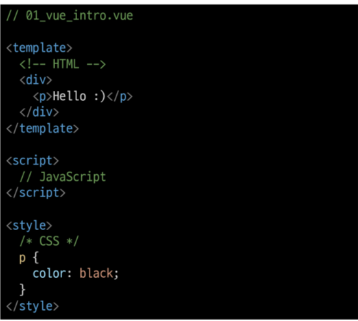

# Vue
## Vue intro
-  VSCode Vetur extension 설치
-  Chrome Vue devtools extension 설치
- Vue.js == JavaScript Front-end Framework

### Front-end(FE) 개발이란?
- 사용자에게 보여주는 화면 만들기
- `Web App`(SPA)을 만들 때 사용하는 도구
  - SPA - Single Page Application

### Web App이란?
- 웹 브라우저에서 실행되는 어플리케이션 소프트웨어
- 개발자 도구 > 디바이스 모드
- 웹페이지가 그대로 보이는 것이 아닌 `디바이스에 설치된 App`처럼 보이는 것
- 웹페이지가 디바이스에 맞는 적절한 UX/UI로 표현되는 형태

### SPA (Single Page Application)
- **서버에서 최초 1장의 HTML만 전달**받아 모든 요청에 대응하는 방식
  - 이전까진 사용자의 요청에 적절한 페이지 별 template을 반환
- `CSR (Client Side Rendering)` 방식으로 요청을 처리
  - 기존 요청처리방식은 `SSR (Server Side Rendering)`

> [참고] SSR 이란?


- Server가 사용자의 요청에 적합한 HTML을 렌더링하여 제공하는 방식
- 전달받은 새 문서를 보여주기 위해 브라우저는 **새로고침**을 진행

### CSR (Client Side Rendering) 이란?
- 최초 한 장의 HTML을 받아오는 것은 동일
- 단, **server로부터 최초로 받아오는 문서는 빈 html문서**
- 각 요청에 대한 대응을 JavaScript를 사용하여 **필요한 부분만 다시 렌더링**
  - 새로운 페이지를 서버에 `AJAX`로 요청
  - 서버는 화면을 그리기 위해 필요한 데이터를 **JSON** 방식으로 전달
  - `JSON` 데이터를 JavaScript로 처리, DOM 트리에 반영 (렌더링)
  - 


### CSR 방식 사용 이유
- 모든 HTML 페이지를 서버로부터 받는 것이 아니기 때문
  - 클라이언트 - 서버 간 통신 즉, 트래픽이 감소
  - 트래픽이 감소 == 응답 속도가 빨라짐
- 매번 새 문서를 받아 새로고침하는 것이 아니라 필요한 부분만 고쳐 나가므로 각 요청이 끊김없이 진행 (UX 향상)
- BE와 FE의 작업 영역을 명확히 분리 가능 (협업 용이)

### CSR은 만능?
- 첫 구동 시 필요한 데이터가 많으면 최초 작동 시작까지 오랜 시간 소요
- `검색 엔진 최적화(SEO, Search Engine Optimization)` 가 어려움
  - 서버가 제공하는 것은 텅 빈 HTML
  - 내용을 채우는 것은 AJAX 요청으로 얻은 JSON 데이터로 클라이언트가(브라우저) 진행
- 대체적으로 HTML에 작성된 내용을 기반으로 하는 검색 엔진에 빈 HTML을 공유하는 SPA 서비스가 노출되기는 어려움


> [참고] SEO (Search Engine Optimization)
- google, bind과 같은 검색 엔진 등에 내 서비스나 제품 등이 효율적으로 검색 엔진에 노출되도록 개선하는 과정을 일컫는 작업
- `검색` = 각 사이트가 운용하는 검색엔진에 의해 이루어지는 작업
- `검색 엔진` = 웹 상에 존재하는 가능한 모든 정보들을 긁어 모으는 방식으로 동작
  - 정보의 대상은 주로 HTML에 작성된 내용
  - JavaScript가 실행된 이후의 결과를 확인하는 과정이 없음
- 최근에는 SPA, 즉 CSR로 구성된 서비스의 비중이 증가
  - SPA 서비스도 검색 대상으로 넓히기 위해 JS를 지원하는 방식으로 발전
- 단, 단순 HTML만을 분석하는 것 보다 몇 배의 리소스가 필요한 작업이기에 여전히 CSR의 검색 엔진 최적화 문제가 모두 해결된 것은 아님


### **CSR vs SSR**
- 내 서비스에 적합한 렌더링 방식을 적절히 활용
- SPA 서비스에서도 SSR을 지원하는 Framework가 발전 중
  - Vue Nuxt.js
  - React Next.js
  - Angular Universal

---

## Why Vue
- Vue 구조는 매우 직관적



### Vue 없이 코드 작성하기

- 입력 받은 값을 name 뒤에 출력하기
  - input tag 선택
  - p tag 선택
  - addEventListener 추가

```html
<body>
  <div id="app">
    <p id="name">name :</p>
    <input id="inputName" type="text">
  </div>

  <script>
    const name = document.querySelector('#name')
    const input = document.querySelector('#inputName')
    input.addEventListener('input', function (e) {
      name.innerText = 'name : ' + e.target.value
    })
  </script>
    
</body>
```

- 입력 받은 데이터를 p tag에 추가하려고 한다면
- 기존에 갖고있던 text도 신경써야함
  - data를 관리하기 위한 추가작업 필요

 ```javascript
 input.addEventListener('input', function (e) {
  name.innerText = name.innerText + e.target.value
 })
 ```

### Vue CDN
- Vue CDN위해 Vue2 공식문서 접속
  - https://v2.vuejs.org/
  - 1.Getting Started
  - 2.Installation
  - 3.Development version CDN 복사


### Vue로 코드 작성하기

```html
<!DOCTYPE html>
<html lang="en">
<head>
  <meta charset="UTF-8">
  <meta http-equiv="X-UA-Compatible" content="IE=edge">
  <meta name="viewport" content="width=device-width, initial-scale=1.0">
  <title>Document</title>
</head>
<body>
  <!--View-->
  <div id="app">
    <p id="name">name : {{ message }}</p>
    <input id="inputName" type="text" v-model="message">
  </div>
  <script src="https://cdn.jsdelivr.net/npm/vue@2/dist/vue.js"></script>
  <script>
    // CODE HERE
    // View Model
    const app = new Vue({
      el: '#app',
      data : {
        message: '',  // Model
      }
    })
  </script>
</body>
</html>
```


- Vue CND 가져오기
- **Vue instance 생성** 
  - Vue instance - 1개의 object
  - 정해진 속성명을 가진 object
- `el, data` 설정
  - **data**에 관리할 속성 정의
- 선언적 렌더링 `{{}}`
  - Vue data를 화면에 렌더링

- input tag에 `v-model` 작성
  - input에 값 입력 -> Vue data 반영
  - Vue data -> DOM 반영


> [참고] Dev Tools 확인


- Vue devtools에서 data 변경 -> DOM 반영
- 눈에 보이는 화면을 조작하는 것이 아닌 Vue가 가진 data를 조작


### Facebook 예시
- 한 명의 유저가 이름을 변경한다면 화면에서 조작해야 할 영역이 매우 많음
  - Vanilla JS만으로 모든 데이터 조작 -> 불필요한 코드 반복
  - Vue를 통해 데이터를 관리한다면 -> 변경 사항도 한 번에 반영 (하나의 data로 관리)


---

## Vue2 vs Vue3
- 2022년 2월부터 vue 기본버전이 3으로 전환
- 대체적 설정들이 vue3을 기본으로 적용
  - 공식문서, CDN, npm
- But, 여전히 vue2가 많이 사용 (legacy code)
  - 상대적으로 많은 문서, 참고자료, 질문/답변
  - 안정적

---

## Vue instance

### MVVM Pattern


- 소프트웨어 아키텍처 패턴의 일종
- 마크업 언어로 구현하는 그래픽 사용자 인터페이스(`view`)의 개발을 Back-end(`model`)로부터 분리시켜 view가 어느 특정한 모델 플랫폼에 종속되지 않도록 함
- DOM : `View`
  - 우리눈에 보이는 부분
- Vue : `ViewModel`
  - View를 위한 Model
  - View와 연결(binding)되어 action 주고받음
  - Model이 변경되면 View Model도 변경되고 바인딩된 View도 변경
  - View에서 사용자가 데이터를 변경하면 View Model 데이터가 변경되고 바인딩된 다른 View도 변경
- 실제 데이터 (JSON) : `Model`

- view는 model을 모르고, model도 view를 모름 (독립성 증가, 적은 의존성)
  - DOM은 data를 모르고, data도 DOM을 모름


  
### Vue instance
- Vue CDN 가져오기
- `new` 연산자 사용한 생성자 함수 호출
  - vue instance 생성
- 인스턴스 출력 및 확인
    - Vue instance는 1개의 객체!
    - 아주 많은 속성과 메서드를 가지고있어서, 이러한 기능들을 사용하는 것!

```html
<!DOCTYPE html>
<html lang="en">
<head>
  <meta charset="UTF-8">
  <meta http-equiv="X-UA-Compatible" content="IE=edge">
  <meta name="viewport" content="width=device-width, initial-scale=1.0">
  <title>Document</title>
</head>
<body>
  <div id="app">

  </div>
  <!-- Vue CDN -->
  <script src="https://cdn.jsdelivr.net/npm/vue@2/dist/vue.js"></script>
  <script>
    // CODE HERE
    // 1. Vue instance constructor
    const vm = new Vue()
    console.log(vm)
  </script>
</body>
</html>
```

> [참고] 생성자 함수
- JS에서 객체를 하나 생성한다고 한다면?
  - 하나의 객체를 선언하여 생성
- 동일 객체를 또 만든다면?
  - 또 다른 객체를 선언하여 생성
- 동일 구조 객체를 여러개 만들고 싶다면?
- 생성자 함수는 특별한 함수를 의미하진 않음
- `new 연산자`로 사용하는 함수
  - 함수 이름은 반드시 **대문자**로 시작
  - 생성자 함수 사용 시 반드시 new 연산자 사용!

```javascript
const member = {
  name: 'aiden',
  age: 22,
  sId: 2022311491,
}

const member2 = {
  name: 'haley',
  age: 20,
  sId: 2022311492,
}

function Member(name, age, sId) {
  this.name = name
  this.age = age
  this.sId = sId
}

const member3 = new Member('isaac', 21, 2022654321)
```


### el (element)
- Vue instance와 DOM을 mount(연결)하는 옵션
  - View와 Model을 연결
  - HTML id 혹은 class와 마운트 가능
- Vue instance와 **연결되지 않은 DOM 외부는 Vue의 영향을 받지 않음**
  - Vue 속성 및 메서드 사용 불가

```html
<!DOCTYPE html>
<html lang="en">
<head>
  <meta charset="UTF-8">
  <meta http-equiv="X-UA-Compatible" content="IE=edge">
  <meta name="viewport" content="width=device-width, initial-scale=1.0">
  <title>Document</title>
</head>
<body>
  <div id="app">
    {{ message }}
  </div>
  <div>
    {{ message }}
  </div>
  <!-- Vue CDN -->
  <script src="https://cdn.jsdelivr.net/npm/vue@2/dist/vue.js"></script>
  <script>
    // CODE HERE
    // 1. Vue instance constructor
    // const vm = new Vue()
    // console.log(vm)

    // 2. el
    const app = new Vue({
      el: '#app',
    })
    console.log(app)
  </script>
```

- 새로운 Vue instance 생성
- 생성자 함수 첫번째 인자로 `Object` 작성
- el 옵션에 `#app` 작성 = DOM 연결
- 인스턴스 출력
- Vue와 연결되지 않은 div 생성
  - 두 div 모두에 `{{ message }}` 작성
  - 결과 확인
- `message` 속성이 정의 되지 않았다는 경고와
- `{{ message }}` 가 그대로 출력되는 차이

### data

```html
  <div id="app">
    {{ message }}
  </div>
  <!-- Vue CDN -->
  <script src="https://cdn.jsdelivr.net/npm/vue@2/dist/vue.js"></script>
  <script>
    // CODE HERE
    // 1. Vue instance constructor
    // const vm = new Vue()
    // console.log(vm)

    // 2. el
    const app = new Vue({
      el: '#app',
    //   // 3. data
      data: {
        message: 'Hello, Vue!'
      },
    })
  </script>
```

- Vue instance의 `데이터 객체` 혹은 `인스턴스 속성`
- 데이터 객체는 반드시 기본 객체 `{} (object)`여야함
- 객체 내부 아이템들은 value로 모든 타입의 객체를 가질 수 있음
- 정의된 속성은 `interpolation {{}}` 을 통해 view에 렌더링 가능
- Vue instance에 `data` 객체 추가
- data 객체에 `message` 값 추가
- 결과 확인
- 추가된 객체의 각 값들은 `this.message` 형태로 접근 가능!


### methods

```html
<script>
    // CODE HERE
    // 1. Vue instance constructor
    // const vm = new Vue()
    // console.log(vm)

    // 2. el
    const app = new Vue({
      el: '#app',
    //   // 3. data
      data: {
        message: 'Hello, Vue!'
      },

    //   // 4. methods
      methods: {
        print: function () {
          console.log(this.message)
        },
      

        bye: function () {
          this.message = 'Bye, Vue!'
        },
      }
    })
</script>
```

- 마지막 s 주의!
- Vue instance의 `method`들을 정의하는 곳
- `methods` 객체 정의
  - 객체 내 **print method** 정의
  - print method 실행시 Vue instance의 data내 message 출력
  - methods도 object임!
- 콘솔창에서 app.print()
  
- method를 호출하여 data 변경 가능
  - 객체 내 **bye method** 정의
  - print method 실행 시 
  - Vue instance의 data내 message 변경
- 콜솔창에서 app.bye()
  - DOM에 바로 변경된 결과 반영
  - Vue 의 강력한 반응성 (reactivity)


> [주의] methods with Arrow Function

```html
<script>
    // CODE HERE
    // 1. Vue instance constructor
    // const vm = new Vue()
    // console.log(vm)

    // 2. el
    const app = new Vue({
      el: '#app',
    //   // 3. data
      data: {
        message: 'Hello, Vue!'
      },

    //   // 4. methods
      methods: {
        print: function () {
          console.log(this.message)
        },
      

        bye: function () {
          this.message = 'Bye, Vue!'
        },

    //   //   // 4-1. arrow function
        arrowBye: () => {
          // arrowfunction은 메서드 정의시 쓰면 안됨! this가 window 객체를 가르킴
          // 콜백함수 내에선 써도됨!
          this.message = 'Arrow Function?'
          console.log(this)
        }
      }
    })
    console.log(app)
</script>
```

- **methods에서 메서드 정의할때는 arrow function 사용 x!!!!!!**
  - Arrow Function의 this는 함수가 선언될 때 상위 스코프를 가리킴
  - 즉 this가 상위 객체 window를 가리킴
  - 호출은 문제없이 가능하나 this로 Vue의 data를 변경 못함

---

## Basic of Syntax

### Template Syntax
- Vue2 guide > template syntax 참고
- `렌더링된 DOM`을 기본 Vue instance의 data에 `선언적으로 바인딩`할 수 있는 `HTML 기반 template syntax`를 사용
  - 렌더링 된 DOM - 브라우저에 의해 보기 좋게 그려질 HTML 코드
  - HTML 기반 template syntax - HTML 코드에 직접 작성할 수 있는 문법 제공
  - 선언적으로 바인딩 - Vue instance와 DOM을 연결

### Template Interpolation

```html
<!-- 1. Text interpolation -->
  <div id="app">
    <p>메시지: {{ msg }}</p>   
    <p>HTML 메시지 : {{ rawHTML }}</p>

  <script src="https://cdn.jsdelivr.net/npm/vue@2/dist/vue.js"></script>
  <script>
    // 1. Text interpolation
    const app = new Vue({
      el: '#app',
      data: {
        msg: 'Text interpolation',
        rawHTML: '<span style="color:red"> 빨간 글씨</span>'
      }
    })
  </script>
```

- 가장 기본적인 바인딩(연결) 방법
- 중괄호 2개
- DTL 과 동일한 형태
- Template interpolation 방법은 HTML을 `일반 텍스트`로 표현

### RAW HTML

```html
  <!-- 1. Text interpolation -->
  <div id="app">
    <p>메시지: {{ msg }}</p>   
    <p>HTML 메시지 : {{ rawHTML }}</p>
    <p>HTML 메시지 : <span v-html="rawHTML"></span></p>
    <!--표현식 형태로 작성 가능-->
    <p>{{ msg.split('').reverse().join('') }}</p>
  </div>

  <script src="https://cdn.jsdelivr.net/npm/vue@2/dist/vue.js"></script>
  <script>
    // 1. Text interpolation
    const app = new Vue({
      el: '#app',
      data: {
        msg: 'Text interpolation',
        rawHTML: '<span style="color:red"> 빨간 글씨</span>'
      }
    })
  </script>
```

- `v-html` directive을 사용하여 data와 바인딩
- directive - HTML 기반 template syntax
- HTML 기본 속성이 아닌 Vue가 제공하는 특수 속성의 값으로 data 작성

> [참고] JS 표현식
- 표현식 형태로 작성 가능


---
## Directives
### Directives 기본 구성


- `v-접두사`가 있는 특수 속성에는 값을 할당할 수 있음
  - 값에는 JS 표현식을 작성할 수 있음
- directive의 역할은 **표현식의 값이 변경될 때 반응적으로 DOM에 적용**하는 것
- `:`을 통해 전달인자를 받을 수 있음
- `.`으로 표시되는 특수 접미사 - directive를 특별한 방법으로 바인딩 해야함


### 새 Vue instance 생성
- 각각의 instance들은 연결된 DOM element에만 영향을 미침
- 연결되지 않은 DOM이 Vue의 영향을 받지 않았던 것과 동일 상황

```html
  <div id="app">
    ...
  </div>

  <div id="app2">
    ...
  </div>

  <script src="https://cdn.jsdelivr.net/npm/vue@2/dist/vue.js"></script>
  <script>

    const app = new Vue({
      ...
    })

    const app2 = new Vue({
      el: '#app2',
      ...
    })
  </script>
```

### v-text
- Template Interpolation과 함께 가장 기본적인 바인딩 방법
- `{{ }}` 와 유사한 역할

### v-html
- RAW HTML을 표현할 수 있는 방법
- 단, **사용자가 입력하거나 제공하는 컨텐츠에는 절대 사용 금지**
  - XSS 공격 참고
  - 
```html
<!-- 2. v-text & v-html -->
  <div id="app2">
    <!-- 2-1. v-text & {{}} -->
    <p v-text="message"></p>
    <!-- 같음 -->
    <p>{{ message }}</p>

    <!-- 2-2. v-html -->
    <!--사용자 입력이 필요한 부분엔 사용 X -> 보안에 취약!-->
    <p v-html="html"></p>
  </div>

  <script src="https://cdn.jsdelivr.net/npm/vue@2/dist/vue.js"></script>
  <script>

    // 2. v-text && v-html
    const app2 = new Vue({
      el: '#app2',
      data: {
        message: 'Hello!',
        html: '<a href="https://www.google.com">GOOGLE</a>'
      }
    })

  </script>
```

### **v-show** (Expensive initial load, cheap toggle)
- 표현식에 작성된 값에 element를 보여줄 것인지 결정
  - boolean 값이 변경 될 때 마다 반응
- **toggle 비용은 저렴**하나, **렌더링 비용은 비쌈**!!!
  - **표현식 결과와 관계없이 렌더링**
  - **CSS의 display 속성**을 이용해 block or none 값만 바꾸면 되기때문
- 화면에서만 사라졌을 뿐, **DOM에는 존재**!

### **v-if** (Cheap initial load, expensive toggle)
- v-show와 사용 방법은 동일
- isActive의 값이 변경될 때 반응
- 단, 값이 false면 **DOM에서 사라짐!**
- **toggle 비용이 비싸지만, 초기 렌더링 비용은 낮음**
  - 표현식 결과가 false인 경우 렌더링조차 되지 않기 때문!
  - 단, 표현식 값이 자주 변경되는 경우 잦은 재 렌더링으로 비용이 증가할 수 있음
- **v-if v-else-if v-else** 형태로 사용


```html
<!-- 3. v-show && v-if -->
  <div id="app3">
    <p v-show="isActive">보이니? 안보이니?</p>
    <p v-if="isActive">안보이니? 보이니?</p>
  </div>

  <script src="https://cdn.jsdelivr.net/npm/vue@2/dist/vue.js"></script>
  <script>
    const app3 = new Vue({
      el: '#app3',
      data: {
        isActive: false
      }
    })
  </script>
```

### v-for

- `for .. in ..` 형식으로 작성
- 반복된 데이터 타입에 모두 사용 가능
- index를 함께 출력하고자 한다면 `(char, index)` 형태로 사용 가능
- 배열 역시 문자열과 동일하게 사용 가능
- 각 요소가 객체면 `dot notation` 접근 가능
- 객체 순회 시 value가 할당되어 출력
- 2번째 변수 할당 시 key 출력 가능

> [참고] 특수 속성 key
- `"v-for 사용 시 반드시 key 속성을 각 요소에 작성!!!!!!"`
- 주로 v-for directive 작성 시 사용
- vue 화면 구성 시 이전과 달라진 점을 확인하는 용도로 활용
  - 따라서 key가 중복되면 안됨
- 각 요소가 고유한 값을 가지고 있지 않다면 생략 가능
```html
<!-- 3. v-for -->
  <div id="app">
    <h2>String</h2>
    <div v-for="char in myStr">
      {{ char }}
    </div>
      
    <div v-for="(char, index) in myStr" :key="index">
      <p>{{ index }}번째 문자열 {{ char }}</p>
    </div>

    <h2>Array</h2>
    <div v-for="(item, index) in myArr" :key="index">
      <p>{{ index }}번째 아이템 {{ item }}</p>
    </div>
    <!--특수속성 key-->
    <div v-for="(item, index) in myArr2" :key="`arry-${index}`">
      <p>{{ index }}번째 아이템</p>
      <!--각 요소가 객체면 `dot notation` 접근 가능-->
		  <p>{{ item.name }}</p>
    </div>

    <h2>Object</h2>
    <div v-for="value in myObj">
      <p>{{ value }}</p>
    </div>
    <!--객체 순회 시 value가 할당되어 출력, 2번째 변수 할당 시 key 출력 가능-->
    <div v-for="(value, key) in myObj"  :key="key">
      <p>{{ key }} : {{ value }}</p>
    </div>
  </div>

  <script src="https://cdn.jsdelivr.net/npm/vue@2/dist/vue.js"></script>
  <script>
    const app = new Vue({
      el: '#app',
      data: {
        // 1. String
        myStr: 'Hello, World!',

        // 2-1. Array
        myArr: ['python', 'django', 'vue.js'],

        // 2-2. Array with Object
        myArr2: [
          { id: 1, name: 'python', completed: true},
          { id: 2, name: 'django', completed: true},
          { id: 3, name: 'vue.js', completed: false},
			  ],
        
        // 3. Object
        myObj: {
          name: 'harry',
          age: 27
        },
      }
    })
  </script>
```

### v-on
- addEventListener와 유사
- `:`을 통해 전달받은 인자를 확인
- 값으로 JS표현식 작성
- 대기하고 있던 이벤트가 발생하면 할당된 표현식 실행
- method를 통한 data 조작도 가능
- method에 인자를 넘기는 방법은 일반 함수를 호출할 때와 동일 방식
- `:`을 통해 전달된 인자에 따라 특별한 modifiers(수식어)가 있을 수 있음
  - ex) v-on:keyup.enter 등
  - vue2 가이드 > api > v-on 파트 참고
- `'@'` shortcut
  - ex) @keyup.click

```html
<div id="app">
    <button v-on:click="number++">increase Number</button>
    <p>{{ number }}</p>
</div>

<script src="https://cdn.jsdelivr.net/npm/vue@2/dist/vue.js"></script>
<script>
  const app = new Vue({
    el: '#app',
    data: {
      number: 0,
    },
  })
</script>
```


### v-bind
- HTML 기본 속성에 Vue data를 연결
- class의 경우 다양한 형태로 연결 가능
  - `조건부 바인딩`
    - {'class Name': '조건 표현식'}
    - 삼항 연산자도 가능
  - `다중 바인딩`
    - ['JS 표현식','JS 표현식',...]
- Vue data 의 변화에 반응하여 DOM에 반영하므로 상황에 따라 유동적 할당 가능
- `':'` shortcut
  - ex) :class

```html
<div id="app2">
    <a v-bind:href="url">Go To GOOGLE</a>

    <p v-bind:class="redTextClass">빨간 글씨</p>
    <p v-bind:class="{ 'red-text': true }">빨간 글씨</p>
    <p v-bind:class="[redTextClass, borderBlack]">빨간 글씨, 검은 테두리</p>

    <p :class="theme">상황에 따른 활성화</p>
    <button @click="darkModeToggle">dark Mode {{ isActive }}</button>
</div>

<script src="https://cdn.jsdelivr.net/npm/vue@2/dist/vue.js"></script>
<script>
  const app2 = new Vue({
    el: '#app2',
    data: {
      url: 'https://www.google.com/',
      redTextClass: 'red-text',
      borderBlack: 'border-black',
      isActive: true,
      theme: 'dark-mode'
    },
    methods: {
      darkModeToggle() {
        this.isActive = !this.isActive
        if (this.isActive) {
          this.theme = 'dark-mode'
        } else {
          this.theme = 'white-mode'
        }
      }
    }
  })
</script>
```


### v-model
- 사용자 입력 받는 곳에서 사용!
- Vue instance와 DOM의 `양방향 바인딩`
- Vue data 변경 시 v-model로 연결된 사용자 입력 element에도 적용

```html
<div id="app">
    <h2>1. Input -> Data</h2>
    <h3>{{ myMessage }}</h3>
    <input @input="onInputChange" type="text">
    <hr>

    <h2>2. Input <-> Data</h2>
    <h3>{{ myMessage2 }}</h3>
    <input v-model="myMessage2" type="text">
    <hr>
</div>

<script src="https://cdn.jsdelivr.net/npm/vue@2/dist/vue.js"></script>
<script>
  const app = new Vue({
    el: '#app',
    data: {
      myMessage: '',
      myMessage2: '',
    },
    methods: {
      onInputChange: function (event) {
        this.myMessage = event.target.value
      },
    }
  })
</script>
```

---

## Vue advanced
### computed
- Vue instance의 options중 하나
- computed 객체에 정의한 함수를 페이지가 최초로 렌더링 될 때 호출하여 계산
  - 계산 결과가 변하기 전까지 **함수를 재호출하는 것이 아닌 계산된 값을 반환**
- methods와의 차이 확인!

```html
<div id="app">
    <h1>data_01 : {{ number1 }}</h1>
    <h1>data_02 : {{ number2 }}</h1>
    <hr>
    <h1>add_method : {{ add_method() }}</h1>
    <h1>add_method : {{ add_method() }}</h1>
    <h1>add_method : {{ add_method() }}</h1>
    <hr>
    <h1>add_computed : {{ add_computed }}</h1>
    <h1>add_computed : {{ add_computed }}</h1>
    <h1>add_computed : {{ add_computed }}</h1>
    <hr>
    <button v-on:click="dataChange">Change Data</button>
  </div>

  <script src="https://cdn.jsdelivr.net/npm/vue@2/dist/vue.js"></script>
  <script>
    const app = new Vue({
      el: '#app',
      data: {
        number1: 100,
        number2: 100
      },
      computed: {
        add_computed: function () {
          console.log('computed 실행됨!')
          return this.number1 + this.number2
        }
      },
      methods: {
        add_method: function () {
          console.log('method 실행됨!')
          return this.number1 + this.number2
        },
        dataChange: function () {
          this.number1 = 200
          this.number2 = 300
        }
      }
    })
  </script>
```


### **method vs computed** 
- `method` (**동작**)
  - 호출 될 때마다 함수를 실행
  - 같은 결과여도 매번 새롭게 계산
- `computed` (**값**)
  - 함수 종속대상의 변화에 따라 계산 여부가 결정됨
  - **사용하는 변수가 변하면 계산을 새로함**
    - 메모리에 저장 (cache)
  - 종속대상이 **변하지 않으면 항상 저장(캐싱)된 값을 반환**

### watch (**동작**)
- 특정 데이터의 변화를 감지
  - **특정 데이터가 변경되면 실행하여라!**
  - 따로 호출 필요 x!
  - 1.watch 객체를 정의
  - 2.감시할 대상 data를 지정
  - data가 변할 시 실행할 함수 정의
- 첫번째 인자는 변동 전 data / 두번째 인자는 변동 후 data
- **실행 함수를 Vue method로 대체 가능**
  - 감시 대상 data의 이름으로 객체 생성
  - 실행하고자 하는 method를 handler에 문자열 형태로 할당
- Array, Object의 내부요소변경을 감지하기 위해서는 `deep` 속성 추가 필요

```html
<div id="app">
    <h3>Increase number</h3>
    <p>{{ number }}</p>
    <button @click="number++">+</button>
    <hr>

    <h3>Change name</h3>
    <p>{{ name }}</p>
    <input type="text" v-model="name">
    <hr>

    <h3>push myObj</h3>
    <p>{{ myObj }}</p>
    <button @click="itemChange">change Item</button>
</div>

<script src="https://cdn.jsdelivr.net/npm/vue@2/dist/vue.js"></script>
<script>
  const app = new Vue({
    el: '#app',
    data: {
      number: 0,
      name: '',
      myObj: {completed: true}
    },
    methods: {
      nameChange: function () {
        console.log('name is changed')
      },

      itemChange: function () {
        this.myObj.completed = !this.myObj.completed
      }
    },
    watch: {
      number: function (val, oldVal) {
        console.log(val, oldVal)
      },

      name: {
        handler: 'nameChange'
      },

      myObj: {
        handler: function (val) {
          console.log(val)
        },
        deep: true
      },
    }
  })
</script>
```

### filters
- Vue의 옵션
- 텍스트 형식화를 적용할 수 있는 필터
- interpolations 혹은 v-bind 이용할 때 사용 가능
- 필터는 자바스크립트 표현식 마지막에 `|`(파이프)와 함께 추가되어야함
- chaining(이어서 사용) 가능
- return 필수!

```html
<div id="app">
    <p>{{ numbers | getOddNums | getUnderTenNums }}</p>
</div>

<script src="https://cdn.jsdelivr.net/npm/vue@2/dist/vue.js"></script>
<script>
  const app = new Vue({
    el: '#app',
    data: {
      numbers: [1, 2, 3, 4, 5, 6, 7, 8, 9, 10, 11, 12, 13, 14, 15],
    },
    filters: {
      getOddNums: function (nums) {
        const oddNums = nums.filter((num) => {
          return num % 2
        })
        return oddNums
      },
      
      getUnderTenNums: function (nums) {
        const underTen = nums.filter((num) => {
          return num < 10
        })
        return underTen
      }
    }
  })
</script>
```


---
# Vue 스타일 가이드

## Always use key with v-for

## Never use v-if on the same element as v-for
- v-if 가 v-for보다 높은 우선순위
