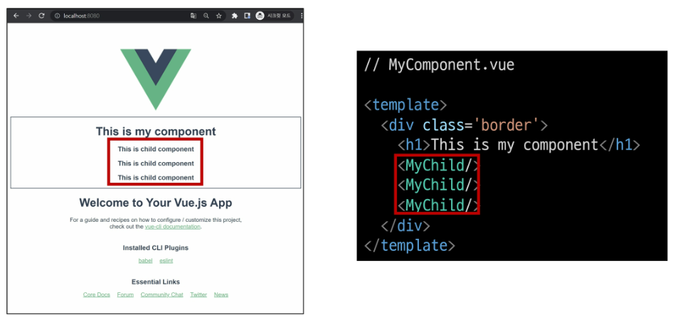
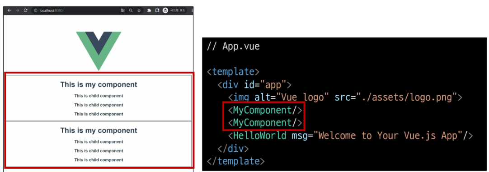
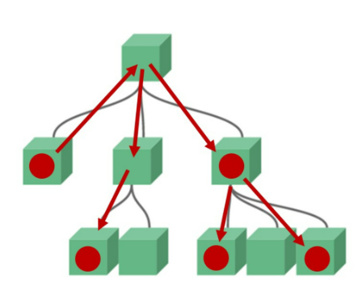
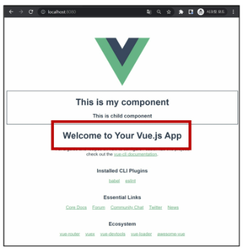
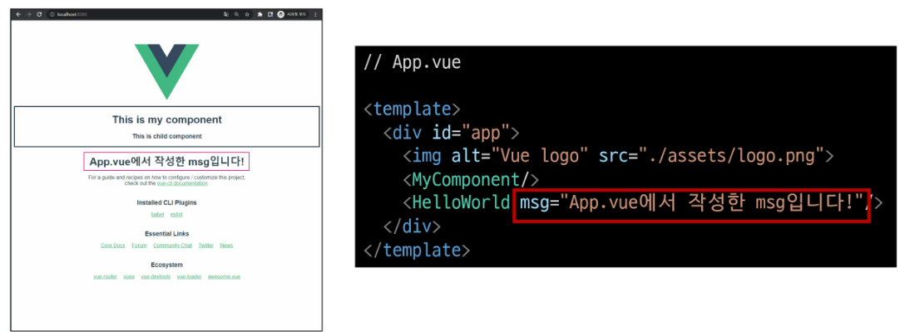

# Vue CLI

## Node.js
- 자바스크립트는 브라우저를 조작하는 유일한 언어
  - 하지만 브라우저 밖에서는 구동 x
- 자바스크립트를 구동하기 위한 런타임 환경인 Node.js로 인해 브라우저가 아닌 환경에서도 구동 가능
  - Chrome V8엔진을 제공하여 여러 OS 환경에서 실행할 수 있는 환경을 제공
  - Browser만 조작 가능했으나, Server-Side-Programming 또한 가능

### NPM (Node Package Manage)
- 자바스크립트 패키지 관리자
  - Python에 pip가 있다면 Node.js에는 npm
  - pip와 마찬가지로 다양한 의존성 패키지 관리
- Node.js의 기본 패키지 관리자
- Node.js 설치 시 함께 설치됨

## Vue CLI
- Vue 개발을 위한 표준 도구
- 프로젝트의 구성을 도와주는 역할
- 확장 플러그인, GUI, Babel 등 다양한 tool 제공

### Vue CLI Quick Start
- 설치 (글로벌 환경)
```
$ npm install -g @vue/cli
```
- 프로젝트 생성
  - **vscode terminal** 에서 진행
```
$ vue create vue-cli
```
- Vue 버전 선택 (Vue 2)
- 프로젝트 생성 성공
- 프로젝트 디렉토리로 이동
```
$ cd vue-cli
```
- node_modules 다운
```
$ npm install
```

- 프로젝트 실행
```
$ npm run serve
```

## Vue CLI 프로젝트 구조
- git init이 이미 되어있는 상태로 시작
  - TIL 안에 만들어버리면 push 안됨
  - push 할땐 .git 지워야 커밋 가능할 것!
### node_modules
- 가상환경 역할
- 서로 의존성이 매우 높은 모듈들
- git ignore에 이미 적혀있음
### node_modules-`Babel`
- JavaScript compiler
- ES6+ 코드를 구버전으로 번역/변환 해주는 도구
- 원시코드(최신버전)를 목적코드(구버전)으로 옮기는 번역기
```javascript
// 원시 코드 (Babel Input)
[1,2,3].map((n) => n+1);

// 목적 코드 (Babel Output)
[1,2,3].map(function(n) {
    return n+1;
});
```
### node_modules-`Webpack`
- static module bundler
- 모듈 간의 의존성 문제를 해결하기 위한 도구
- 프로젝트에 필요한 모든 모듈을 매핑하고 내부적으로 종속성 그래프를 빌드함
### Module
- 개발하는 애플리케이션의 크기가 커지고 복잡해지면 파일 하나에 모든 기능을 담기가 어려워짐
- 따라서 자연스럽게 파일을 여러개로 분리하여 관리를 하게됨 
- 이때 분리된 파일 각각이 모듈 즉, js 파일 하나가 하나의 모듈
- 모듈은 대개 기능 단위로 분리
- 클래스 하나 혹은 특정한 목적을 가진 복수의 함수로 구성된 라이브러리 하나로 구성됨
- 여러 모듈 시스템
  - ESM (ECMA Script Module), AMD, CommonJS, UMD

### Module 의존성 문제
- 모듈 수가 많아지고 라이브러리 혹은 모듈 간의 의존성이 깊어지면서
- 특정한 곳에서 발생한 문제가 어떤 모듈간의 문제인지 파악 어려움
  - Webpack은 이 모듈간의 의존성 문제를 해결하기 위해 등장

### Bundler
- 모듈 의존성 문제를 해결해주는 작업이 Bundling
- 이러한 일을 해주는 도구가 Bundler, Webpack은 다양한 Bundler중 하나
- 모듈들을 하나로 묶어주고 묶인 파일은 하나(혹은 여러개)로 만들어짐
- Bundling된 결과물은 개별 모듈의 실행 순서에 영향을 받지않고 동작하게 됨
- `Vue CLI는 이러한 Babel, Webpack에 대한 초기 설정이 자동으로 되어있음`

### Webpack - static module bundler
- 의존성을 Webpack이 담당해주므로 개발자는 npm install을 사용해 다양한 모듈을 한번에 설치하고 각 모듈을 사용해 개발에 집중 가능

### package.json
- 프로젝트의 종속성 목록과 지원되는 브라우저에 대한 구성 옵션을 포함

### package-lock.json
- node_modules에 설치되는 모듈과 관련된 모든 의존성을 설정 및 관리
- 협업 및 배포 환경에서 정확히 동일한 종속성을 설치하도록 보장하는 표현
- 사용할 패키지의 버전을 고정
- 개발 과정간의 의존성 패키지 충돌 방지
- python의 requirements.txt 역할
- 알아서 업데이트 되기때문에 직접 수정할 필요 x

### public/favicon.ico
- 서버 실행할때 탭 아이콘

### public/index.html
- Vue 앱의 뼈대가 되는 html 파일
- Vue 앱과 연결될 요소가 있음

### src/
- src/assets
  - 정적 파일을 저장하는 디렉토리
- src/components
  - 하위 컴포넌트들이 위치
- src/App.vue
  - 최상위 컴포넌트
  - public/index.html과 연결
    - `<div id="app"></div>`
- src/main.js
  - webpack이 빌드를 시작할때 가장 먼저 불러오는 entry point
  - public/index.html과 src/App.vue를 연결시키는 작업이 이뤄지는 곳
  - Vue 전역에서 활용 할 모듈을 등록할 수 있는 파일
  - 별도 수정 x

---

# SFC
## Component
- UI를 독립적이고 재사용 가능한 조각들로 나눈 것
  - 기능별로 분화한 코드 조각
- CS에서는 다시 사용할 수 있는 범용성을 위해 개발된 소프트웨어 구성요소를 의미
- 하나의 app을 구성할 때 중첩된 컴포넌트들의 tree로 구성하는 것이 보편적
  - web시간에 배운 HTML요소들의 중첩을 떠올려 보자
    - Body tag를 root node로하는 tree의 구조
    - 마찬가지로 Vue에서는 src/App.vue를 root node로 하는 tree의 구조
- 컴포넌트는 **유지보수**를 쉽게 만들어 주고
- **재사용성** 측면에서도 매우 강력한 기능 제공
- 우리가 사용하는 웹 서비스도 여러개의 컴포넌트로 이루어져 있음
- 하나의 컴포넌트를 만들어두면 반복되는 UI를 쉽게 처리 가능

### Django 에서의 예시
- base.html과 index.html을 분리하여 작성
- but, 하나의 화면으로 볼 수 있음
  - 즉, 하나의 화면은 여러개의 컴포넌트로 이루어질 수 있음
- 우리는 이미 재사용가능한 개발을 하고 있었음!
- base.html을 변경하면 이를 extends하는 모든 화면에 영향
  - 유지보수 쉽게 해줌

### Component based architecture 특징
- 관리 용이
  - 유지/보수 비용 감소
- 재사용성
- 확장 가능
- 캡슐화
- 독립적

## SFC
### Component in Vue
- 이름이 있는 재사용 가능한 Vue instance
  - `new Vue()` 로 만든 인스턴스
  - `const app = new Vue()`
  - 여기서 app 인스턴스가 하나의 컴포넌트가 됨

### SFC (Single File Component)
- 하나의 `.vue` 파일이 하나의 `Vue instance`이고, 하나의 `컴포넌트`
  - Single File Component
- Vue instance에서는 HTML, CSS, JavaScript 코드를 한번에 관리
  - **Vue instance**를 **기능 단위로 작성**하는 것이 핵심!
- 컴포넌트 기반 개발의 핵심 기능

### 정리
- HTML, CSS, JavaScript를 .vue라는 확장자를 가진 파일 안에서 관리하며 개발
- 이 파일을 Vue instance, 또는 Vue component라고 하며, 기능단위로 작성
- Vue CLI가 Vue를 Component based하게 사용하도록 도와줌

---
# Vue component
## Vue component 구조
- 템플릿(HTML)
  - HTML의 body 부분
  - 눈으로 보여지는 요소 작성
  - 다른 컴포넌트를 HTML 요소처럼 추가 가능
- 스크립트(JavaScript)
  - JavaScript 코드가 작성되는 곳
  - 컴포넌트 정보, 데이터, 메서드 등 vue 인스턴스를 구성하는 대부분이 작성됨
  - new Vue() 사용하지 않음
  - 파일자체가 하나의 인스턴스이기 때문!
- 스타일(CSS)
  - CSS가 작성되며 컴포넌트의 스타일을 담당

### Vue component 구조 정리
- 컴포넌트들이 tree구조를 이루어 하나의 페이지를 만듦
- root에 해당하는 최상단의 component가 App.vue
- 이 App.vue를 index.html과 연결
- 결국 index.html 파일 하나만을 rendering
  - 새로고침 X
  - 이게 바로 SPA

---
## Vue component 실습

### 현재 구조
- Vue CLI를 실행하면 이미 `HelloWorld.vue`라는 컴포넌트가 생성되어 있고 App.vue에 등록되어 사용되고 있음
  - `npm run serve` 명령어를 진행 했을 때 나온 화면의 대부분이 `HelloWorld.vue`


```javascript
<template>
  <div id="app">
    
    <HelloWorld msg="Welcome to Your Vue.js App"/>
  </div>
</template>
```

### MyComponent.vue
- 1)src/components/ 안에 `생성`
- 2)script에 `이름(name) 등록`
- 3)template에 `최상위 요소 추가`
  - 주의) templates안에는 반드시 최상단 하나의 요소만 추가 가능
    - Single File Component
    - 비어있어도 안됨
    - 해당 요소안에 추가요소를 작성해야함
    - 꼭 div 일 필요는 x!!

```javascript
// MyComponent.vue
<template>
  <!-- 반드시 컴포넌트를 구성하는 최상위 태그가 하나 있어야 에러가 나지 않음! -->
  <!-- template 태그는 렌더링과는 의미 없음 -->
  <div>
    <h1>싸피 이거는 내가 만든 새로운 컴포넌트다!</h1>
  </div>
</template>

<script>
export default {
    // name을 지정해줘야 상위 컴포넌트가 인식할수있음!
    name: 'MyComponent',
}
</script>

<style>

</style>
```


### component 등록 3단계
- 1)`불러오기`
- 2)`등록하기`
- 3)`보여주기`

```javascript
// App.vue
<template>
  <div id="app">
    
    <!-- 3. 보여주기 -->
    <MyComponent/>
    <HelloWorld msg="Welcome to Your Vue.js App"/>
  </div>
</template>

<script>
import HelloWorld from './components/HelloWorld.vue'
// 1. 불러오기
// import MyComponent from './components/MyComponent.vue'
import MyComponent from '@/components/MyComponent'


export default {
  name: 'App',
  components: {
    HelloWorld,
    // 2. 등록하기
    MyComponent,
  }
}
</script>

<style>
#app {
  font-family: Avenir, Helvetica, Arial, sans-serif;
  -webkit-font-smoothing: antialiased;
  -moz-osx-font-smoothing: grayscale;
  text-align: center;
  color: #2c3e50;
  margin-top: 60px;
}
</style>
```

### component 등록 - 불러오기
- `import {instance name} from {위치}`
- instance name은 instance 생성 시 작성한 name
- `@` 는 src의 shortcut
- `.vue` 생략 가능

### 자식 컴포넌트 작성
- MyComponent의 자식 컴포넌트
- 자식 관계 표현위해 기존 MyComponent에 간단한 border 추가

```javascript
// MyComponent.vue
<template>
  <!-- 반드시 컴포넌트를 구성하는 최상위 태그가 하나 있어야 에러가 나지 않음! -->
  <!-- template 태그는 렌더링과는 의미 없음 -->
  <div class="border">
    <h1>싸피 이거는 내가 만든 새로운 컴포넌트다!</h1>
    <!-- 3. 보여주기 -->
    <!-- 재사용성 -->
    <MyComponentItem/>
    <MyComponentItem/>
    <MyComponentItem/>
  </div>
</template>

<script>
// 1. 불러오기
import MyComponentItem from '@/components/MyComponentItem'


export default {
    // name을 지정해줘야 상위 컴포넌트가 인식할수있음!
    name: 'MyComponent',
    // 2. 등록하기
    components: {
        MyComponentItem,
    }
}
</script>

<style>
    .border {
        border: solid 1px black;
    }
</style>
```

- src/components/ 안에 MyComponentItem.vue 생성

```javascript
// MyComponentItem.vue
<template>
    <div>
        <h3>나는 MyComponent의 하위 컴포넌트</h3>
    </div>
</template>

<script>
export default {
    name: 'MyComponentItem',
}
</script>

<style>

</style>
```

- MyComponent에 MyComponentItem 등록
- component의 재사용성




### Vue.js 스타일가이드 참고
- https://vue2.hphk.io/
- 컴포넌트 이름 규칙


---
## Pass Props & Emit Events
## Data in components
- 우리는 정적 웹페이지가 아닌, 동적 웹페이지를 만들고 있음
  - 즉, 웹페이지에서 다뤄야 할 데이터가 등장
- 한 페이지 내에서 같은 데이터를 공유해야함
  - 하지만 페이지들은 component로 구분되어있음
- MyComponent에 정의된 data를 MyComponentItem에서 사용하려면 어떻게 해야할까
- MyComponentItem에도 똑같은 data를 정의?
  - 따로 정의했기때문에 동일한 데이터가 아님
  - MyComponent의 data가 변경되어도 MyComponentItem data는 변경 x
- 완전히 동일한 data를 서로 다른 Component에서 보여주려면 ??
- 필요한 컴포넌트들끼리 데이터를 주고받으면?
  - 데이터 흐름 파악이 어려움
  - 개발 속도 저하
  - 유지보수 난이도 증가
- 컴포넌트는 부모-자식 관계를 갖고 있으므로,
- `부모-자식 관계만 데이터를 주고받게 하자!`
  - 데이터 흐름 파악 용이
  - 유지보수 쉬워짐


### pass props & emit event



- `부모 => 자식`으로의 데이터 흐름
  - `pass props` (**데이터**)
- `자식 => 부모`로의 데이터 흐름
  - `emit event` (**이벤트**)

## Pass Props
### Pass Props
- 요소의 속성(property)을 사용하여 데이터 전달
- props는 부모 컴포넌트의 정보를 전달하기 위한 사용자 지정 특성
- 자식 컴포넌트는 props 옵션을 사용하여 수신하는 props를 명시적으로 선언해야함

### props in HelloWorld
- 사실 우리의 Vue app은 이미 props를 사용하고 있었음
- Vue CLI를 설치할때 만들어 주었던 App.vud의 HelloWorld 컴포넌트에는 msg라는 property가 작성되어있음
```javascript
// App.vue
<template>
  <div id="app">
    
    <!-- 3. 보여주기 -->
    <MyComponent/>
    <HelloWorld msg="Welcome to Your Vue.js App"/>
  </div>
</template>
```


- Hello.World.vue에서 msg를 사용한 것을 확인 가능
- App.vue에서 property로 넘긴 msg가 출력되는 것을 확인 가능
```javascript
// HelloWorld.vue
<template>
  <div class="hello">
    <h1>{{ msg }}</h1>
    <p>
```


  
### props in HelloWorld 정리
- App.vue의 `<HelloWorld/>`요소에 `msg="~"`라는 property를 설정하였고,
- 하위 컴포넌트인 HelloWorld는 자신에게 부여된 msg property를 template에서 `{{ msg }}` 의 형태로 사용한 것
- msg property의 value를 바꾸면 화면에 보이는 문장이 달라짐!



### Pass Props
- 이렇게 **부모 => 자식**으로의 data 전달 방식을 **pass props**라고 함
- 정적인 데이터를 전달하는 경우 static props라고 명시하기도 함
- 요소에 속성을 작성하듯이 사용 가능하여,
- `prop-data-name="value"` 의 형태로 데이터를 전달
  - 이때 속성의 키 값은 **kebab-case**를 사용

```html
<!-- MyComponent.vue -->

<template>
  <!-- 반드시 컴포넌트를 구성하는 최상위 태그가 하나 있어야 에러가 나지 않음! -->
  <!-- template 태그는 렌더링과는 의미 없음 -->
  <div class="border">
    <h1>싸피 이거는 내가 만든 새로운 컴포넌트다!</h1>
    <!-- 3. 보여주기 -->
    <!-- 재사용성 -->
    <!-- 자식으로 보낼때는 kebab-case! -->

    <MyComponentItem 
    static-props="MyComponent에서 보낸 데이터"
    />
   
  </div>
</template>
```

- Prop 명시
- 데이터를 받는 쪽, 즉 하위 컴포넌트에서도 props에 대해 명시적으로 작성 해주어야 함!
- 전달받은 props를 type과 함께 명시
- 컴포넌트를 문서화할 뿐만 아니라, 잘못된 타입이 전달하는 경우 브라우저의 자바스크립트 콘솔에서 사용자에게 경고

```html
<!-- MyComponentItem.vue -->

<template>
    <div>
        <h3>나는 MyComponent의 하위 컴포넌트</h3>
        <p>{{ staticProps }}</p>
    </div>
</template>


<script>
export default {
    name: 'MyComponentItem',
    // 부모에게서 받을때는 camelCase
    props: {
        staticProps: String,
    },
}
</script>
```

### Pass Props convention
- **부모**에서 넘겨주는 props
  - `kebab-case`
  - HTML 속성명은 대소문자 구분하지 않기 때문
- **자식**에서 받는 props
  - `camelCase`
- 부모 템플릿(html)에서 kebab-case로 넘긴 변수를
- 자식 스크립트(vue)에서 자동으로 camelCase로 변환하여 인식함

### Dynamic props
- 변수를 props로 전달 가능
- v-bind directive를 사용해 데이터를 동적으로 바인딩
- 부모 컴포넌트의 데이터가 업데이트 되면
- 자식 컴포넌트로 전달되는 데이터 또한 업데이트 됨

```html
<!-- MyComponent.vue -->

<template>
  <!-- 반드시 컴포넌트를 구성하는 최상위 태그가 하나 있어야 에러가 나지 않음! -->
  <!-- template 태그는 렌더링과는 의미 없음 -->
  <div class="border">
    <h1>싸피 이거는 내가 만든 새로운 컴포넌트다!</h1>
    <!-- 3. 보여주기 -->
    <!-- 재사용성 -->
    <!-- 자식으로 보낼때는 kebab-case! -->

    <MyComponentItem 
    static-props="MyComponent에서 보낸 데이터"
    :dynamic-props="dynamicProps"
    />
   
  </div>
</template>

<script>
// 1. 불러오기
import MyComponentItem from '@/components/MyComponentItem'


export default {
    // name을 지정해줘야 상위 컴포넌트가 인식할수있음!
    name: 'MyComponent',
    // 2. 등록하기
    components: {
        MyComponentItem,
    },
    data() {
        return {
            dynamicProps: '이건 동적인 데이터!',
        }
    },
}
</script>
```

```html
<!-- MyComponentItem.vue -->

<template>
    <div>
        <h3>나는 MyComponent의 하위 컴포넌트</h3>
        <p>{{ staticProps }}</p>
        <p>{{ dynamicProps }}</p>
    </div>
</template>

<script>
export default {
    name: 'MyComponentItem',
    // 부모에게서 받을때는 camelCase
    props: {
        staticProps: String,
        // dynamic-props의 camelCase
        dynamicProps: String,
    },
}
</script>
```

### 컴포넌트의 data 함수
- 각 vue 인스턴스는 같은 data 객체를 공유하므로
- 새로운 data 객체를 반환(return)하여 사용해야함

```javascript
data : function () {
  return {
    // component's data in here
  }
}
```

### Pass Props
- `:dynamic-props="dynamicProps"`는 앞의 key값(`dynamic-props`)이란 이름으로 뒤의 `" "`안에 오는 데이터(`dynamicProps`)를 전달하겠다는 뜻
- 즉, `:my-props="dynamicProps"`로 데이터를 넘긴다면, 자식 컴포넌트에서 `myProps`로 데이터를 받아야함
- `v-bind`로 묶여있는 `" "`안의 구문은 javascript의 구문으로 볼 수 있음
  - 따라서 dynamicProps라고하는 변수에 대한 data를 전달할 수 있는 것
- **숫자**를 **props로 전달**하기 위해선 어떤게 맞을까?

```javascript
// 1
<SomeComponent num-props="1"/>

// 2
<SomeComponent :num-props="1"/>
```
- 첫번째 방식은 static props로 string으로써의 "1"을 전달
- 두번째 방식은 dynamic props로 숫자로써의 1을 전달

### **단방향 데이터 흐름**
- 모든 props는 부모에서 자식으로 즉 아래로 단방향 바인딩을 형성
- 부모 속성이 업데이트되면 자식으로 흐르지만 반대 방향은 아님
  - 부모 컴포넌트가 업데이트될 때마다 자식 컴포넌트의 모든 prop들이 최신 값으로 새로고침 됨
- 목적
  - 하위 컴포넌트가 실수로 상위 컴포넌트 상태를 변경하여 앱의 데이터 흐름을 이해하기 힘들게 만드는 것을 방지
- 하위 컴포넌트에서 prop을 변경하려고 시도해서는 안되며
- 그렇게 하면 Vue는 콘솔에서 경고를 출력함

---


## Emit Event

### Emit Event
- 부모 컴포넌트에서 자식 컴포넌트로 데이터를 전달할 때는 `이벤트를 발생 시킴`
- 이벤트를 발생시키는게 어떻게 데이터를 전달하는 것이냐?
  - 1.데이터를 이벤트 리스너의 **콜백함수의 인자로 전달**
  - 2.상위 컴포넌트는 해당 **이벤트를 통해 데이터를 받음**

### $emit
- $emit 메서드를 통해 부모 컴포넌트에 이벤트를 발생
  - `$emit('event-name')`형식으로 사용하며 부모 컴포넌트에 `event-name`이라는 이벤트가 발생했다는 것을 알림
  - 마치 사용자가 **마우스 클릭**을 하면 **click** 이벤트가 발생하는 것 처럼
  - `$emit('event-name')`가 실행되면 `event-name`이벤트가 발생하는 것

> [참고] `$`
- javascript는 변수에 _, $ 두개의 특수문자 사용 가능
- 이때, 기존에 사용하던 변수, 메서드들과 겹치지 않게 하기위해 vue는 $emit를 이벤트 전달을 위한 방식으로 택함

### Emit Event
1. 자식 컴포넌트에 버튼을 만들고 클릭 이벤트를 추가
2. **$emit**을 통해 부모 컴포넌트에 **child-to-parent** 이벤트를 트리거

```html
<!-- MyComponentItem.vue -->

<template>
    <div>
        <h3>나는 MyComponent의 하위 컴포넌트</h3>
        <p>{{ staticProps }}</p>
        <p>{{ dynamicProps }}</p>
        <button @click="childToParent">클릭!</button>
    </div>
</template>

<script>
export default {
    name: 'MyComponentItem',
    // 부모에게서 받을때는 camelCase
    props: {
        staticProps: String,
        // dynamic-props의 camelCase
        dynamicProps: String,
    },

    methods: {
        childToParent: function () {
            // 기본속성값 emit
            // 이름, 추가데이터
            this.$emit('child-to-parent', '나는 자식이 보낸 데이터다')

        },
    },
}
</script>
```

- emit된 이벤트를 상위 컴포넌트에서 청취 후 핸들러 함수 실행

```html
<!--MyComponent.vue-->

<template>
  <!-- 반드시 컴포넌트를 구성하는 최상위 태그가 하나 있어야 에러가 나지 않음! -->
  <!-- template 태그는 렌더링과는 의미 없음 -->
  <div class="border">
    <h1>싸피 이거는 내가 만든 새로운 컴포넌트다!</h1>
    <!-- 3. 보여주기 -->
    <!-- 재사용성 -->
    <!-- 자식으로 보낼때는 kebab-case! -->

    <MyComponentItem 
    static-props="MyComponent에서 보낸 데이터"
    :dynamic-props="dynamicProps"

    @child-to-parent="parentGetEvent"
    />
   
  </div>
</template>

<script>
// 1. 불러오기
import MyComponentItem from '@/components/MyComponentItem'


export default {
    // name을 지정해줘야 상위 컴포넌트가 인식할수있음!
    name: 'MyComponent',
    // 2. 등록하기
    components: {
        MyComponentItem,
    },
    data() {
        return {
            dynamicProps: '이건 동적인 데이터!',
        }
    },

    methods: {
        parentGetEvent: function (childData) {
            console.log('자식 컴포넌트에서 발생한 emit 이벤트를 들었다!!')
            console.log(childData)
        },
    }
}
</script>
```

### Emit Event 흐름 정리
1. **자식** 컴포넌트에 있는 **버튼 클릭 이벤트**를 청취하여 **연결된 핸들러 함수** (ChildToParent) 호출
2. 호출된 함수에서 **$emit**을 통해 **상위 컴포넌트에 이벤트** (child-to-parent) 발생
3. **상위** 컴포넌트는 자식 컴포넌트가 발생시킨 이벤트 (child-to-parent) 를 **청취**하여 **연결된 핸들러 함수** (parentGetEvent) 호출

### emit with data
- 이벤트 발생(emit)시킬 때 인자로 데이터 전달 가능

```html
<!--MyComponentItem-->

<template>
    <div>
        <button @click="childToParent">클릭!</button>
    </div>
</template>

<script>
export default {
    ...
    methods: {
        childToParent: function () {
            // 기본속성값 emit
            // 이름, 추가데이터
            this.$emit('child-to-parent', '나는 자식이 보낸 데이터다')

        },
    },
}
</script>
```
- 이렇게 전달한 데이터는 이벤트와 연결된 부모 컴포넌트의 핸들러 함수의 인자로 사용가능

```html
<!--MyComponent.vue-->

<template>
  <!-- 반드시 컴포넌트를 구성하는 최상위 태그가 하나 있어야 에러가 나지 않음! -->
  <!-- template 태그는 렌더링과는 의미 없음 -->
  <div class="border">
    <h1>싸피 이거는 내가 만든 새로운 컴포넌트다!</h1>
    <!-- 3. 보여주기 -->
    <!-- 재사용성 -->
    <!-- 자식으로 보낼때는 kebab-case! -->

    <MyComponentItem 
    ...
    @child-to-parent="parentGetEvent"
    />
   
  </div>
</template>

<script>
// 1. 불러오기
import MyComponentItem from '@/components/MyComponentItem'


export default {
    ...
    methods: {
        parentGetEvent: function (childData) {
            console.log('자식 컴포넌트에서 발생한 emit 이벤트를 들었다!!')
            console.log(`자식 컴포넌트로부터 ${childData}를 받음!`)
        },
    }
}
</script>
```

### emit with data 흐름 정리
1. 자식 컴포넌트에 있는 버튼 클릭 이벤트를 청취하여 연결된 핸들러 함수 (ChildToParent) 호출
2. 호출된 함수에서 $emit을 통해 부모 컴포넌트에 이벤트 (child-to-parent) 를 발생
   - 이벤트에 데이터 (child data) 함께 전달
3. 부모 컴포넌트는 자식 컴포넌트의 이벤트 (child-to-parent)를 청취하여 연결된 함수 (parentGetEvent) 호출, 함수의 인자로 전달된 데이터 (child data)가 포함되어 있음
4. 호출된 함수에서 console.log(`~child data~`) 실행


### emit with dynamic data
- pass props와 마찬가지로 동적인 데이터도 전달 가능
- 자식 컴포넌트에서 입력받은 데이터를 부모 컴포넌트에게 전달하여 출력해보자

```html
<!--MyComponentItem.vue-->

<template>
    <div>
        ...
        <input type="text" 
        v-model="childInputData"
        @keyup.enter="childInput">
    </div>
</template>

<script>
export default {
    ...
    data: function () {
        return {
            childInputData: null,
        }
    },
    methods: {
        ...
        childInput: function () {
            this.$emit('child-input', this.childInputData)
            this.childInputData = null
        }
    },
}
</script>
```

```html
<!--MyComponen.vue-->

<template>
  <!-- 반드시 컴포넌트를 구성하는 최상위 태그가 하나 있어야 에러가 나지 않음! -->
  <!-- template 태그는 렌더링과는 의미 없음 -->
  <div class="border">
    <h1>싸피 이거는 내가 만든 새로운 컴포넌트다!</h1>
    <!-- 3. 보여주기 -->
    <!-- 재사용성 -->
    <!-- 자식으로 보낼때는 kebab-case! -->

    <MyComponentItem 
    ...
    @child-input="getDynamicData"
    />
   
  </div>
</template>

<script>
// 1. 불러오기
import MyComponentItem from '@/components/MyComponentItem'


export default {
    ...
    methods: {
        ...
        // 인자 명은 아무렇게나 가능
        getDynamicData: function (childInputData) {
            console.log(`사용자가 입력한 값은 ${childInputData}입니다.`)
        }
    }
}
</script>
```

### emit with dynamic data 흐름 정리
1. 자식 컴포넌트에 있는 keyup.enter 이벤트를 청취하여 연결된 핸들러 함수 (ChildInput) 호출
2. 호출된 함수에서 $emit을 통해 부모 컴포넌트에 이벤트 (child-input)를 발생
   - 이벤트에 v-model로 바인딩 된 입력받은 데이터를 전달
3. 상위 컴포넌트는 자식 컴포넌트의 이벤트 (child-input)를 청취하여 연결된 핸들러 함수 (getDynamicData) 호출, 함수의 인자로 전달된 데이터가 포함되어 있음
4. 호출된 함수에서 console.log(`~입력받은 데이터~`) 실행


### 정리
- 자식 컴포넌트에서 부모 컴포넌트로 이벤트를 발생시킴
  - 이벤트에 데이터를 담아 전달 가능
- 부모 컴포넌트에서는 자식 컴포넌트의 이벤트를 청취
  - 전달받은 데이터는 이벤트 핸들러 함수의 인자로 사용

### pass props / emit event 컨벤션
- **HTML** 요소에서 사용할땐 **kebab-case**
- **JavaScript**에서 사용할땐 **camelCase**
- **props**
  - 상위 => 하위 흐름에서 HTML요소로 내려줌 : `kebab-case`
  - 하위에서 받을때 JavaScript에서 받음 : `camelCase`
- **emit**
  - emit 이벤트를 발생시키면 HTML 요소가 이벤트를 청취함 : `kebab-case`
  - 메서드, 변수명 등은 JavaScript에서 사용함 : `camelCase`

---
# SUMMARY
- Vue CLI
- SFC
- Pass Props & Emit Events