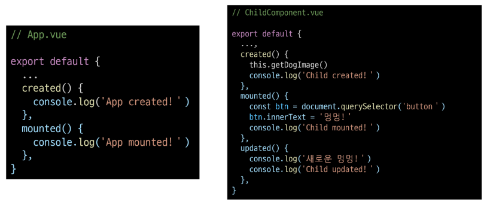
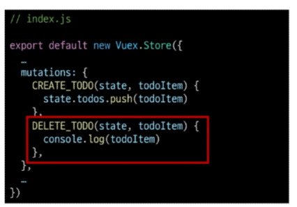
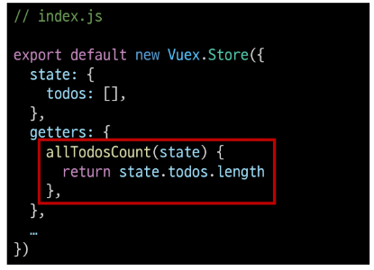

# Vuex

## State Management

### 상태 관리
- 상태(state)란?
  - `현재에 대한 정보(data)`
- Web Application에서의 상태는
  - `현재 App이 가지고있는 Data로 표현`
- 여러개의 component를 조합해서 하나의 App을 만들고 있음
- 각 component는 독립적, 각각의 상태(data)를 가짐
- 하지만, 이들이 모여 하나의 App을 구성할 예정
  - 즉, `여러개의 component가 같은 상태(data)를 유지할 필요가 있음`
    - 상태 관리 필요!

### Pass Props & Emit Event


- 지금까지 props, event를 이용해 상태관리를 하고있음
- 각 컴포넌트는 독립적으로 데이터를 관리
- `같은 데이터를 공유`하고 있으므로,
- 각 컴포넌트가 동일한 상태를 유지하고 있음
- 데이터 흐름을 직관적으로 파악 가능
- 그러나 컴포넌트의 중첩이 깊어지면 데이터 전달이 쉽지않음
- 공통의 상태를 유지해야하는 컴포넌트가 많아지면 데이터 전달 구조가 복잡해짐
- 만약 A에서 B로 데이터를 전달해야 한다면?
  - 어떻게하면 쉽게 해결할 수 있을까?

### Centralized Store


- `중앙저장소(store)에 데이터를 모아서 상태관리`
- 각 컴포넌트는 중앙저장소의 데이터를 사용
- 컴포넌트의 **계층에 상관없이** 중앙저장소에 접근해서 데이터를 얻거나 변경 가능
- 중앙저장소의 데이터가 변경되면 각각의 컴포넌트는 해당 데이터의 변화에 반응하여 새로 변경된 데이터를 반영함
- 규모가 크거나 컴포넌트 중첩이 깊은 프로젝트의 관리가 매우 편리


### Vuex
- "state management pattern + Library" for vue.js
- (상태 관리 패턴 + 라이브러리)
- 중앙 저장소를 통해 상태관리를 할 수 있도록 하는 라이브러리
- 데이터가 예측 가능한 방식으로만 변경될 수 있도록하는 `규칙을 설정하며, Vue의 반응성을 효율적으로 사용하는 상태 관리 기능`을 제공
- Vue의 공식 도구로써 다양한 기능을 제공

---
## Vuex 시작하기

```javascript
$ vue create vuex-app   // Vue 프로젝트 생성
$ cd vuex-app           // 디렉토리 이동
$ vue add vuex          // Vue CLI를 통해 vuex plugin 적용
```

### 프로젝트 with vuex
- scr / store / index.js 가 생성됨
- vuex의 핵심 컨셉 4가지
  - 1.state
  - 2.getters
  - 3.mutations
  - 4.actions


### Vue와 Vuex 인스턴스 비교


### 1.State
- vue 인스턴스의 `data`에 해당
- `중앙에서 관리하는 모든 상태 정보`
- 개별 컴포넌트는 state에서 데이터를 가져와서 사용
  - 개별 컴포넌트가 관리하던 data를 중앙저장소(Vuex Store의 state)에서 관리하게 됨
- state의 데이터가 변화하면 해당 데이터를 사용(공유)하는 컴포넌트도 자동으로 다시 렌더링
- `$store.state`로 state 데이터에 접근 (read_only)


### 2.Mutations ⭐
- `실제로 state를 변경하는 **유일한 방법**`
- vue 인스턴스의 methods에 해당하지만 Mutations에서 호출되는 핸들러(handler) 함수는 반드시 `동기적`이어야함
  - 비동기 로직으로 mutations를 사용해서 state를 변경하는 경우, **state의 변화의 시기를 특정할 수 없기 때문**
- 첫번째 인자로 `state`를 받으며,
- 컴포넌트 혹은 Actions에서 `commit()` 메서드로 호출됨
- mutaion, action에서 호출되는 함수를 handler 함수라고 함

### 3.Actions ⭐
- mutations와 비슷하지만 `비동기` 작업을 포함할 수 있다는 차이가 있음
- `state를 직접 변경하지 않고 commit() 메서드로 mutations를 호출해서 state를 변경함`
- **context** 객체를 인자로 받으며, 이 객체를 통해 store.js의 모든 요소와 메서드에 접근할 수 있음
  - == 즉 state를 직접 변경할 수 있지만 하지 않아야 함
- 컴포넌트에서 `dispatch()` 메서드에 의해 호출됨 (저장해야할때 dispatch 호출!)

### Mutations & Actions


- vue component의 methods 역할이 vuex에서는 아래와 같이 분화됨
- Mutations
  - state를 변경
- Actions
  - state 변경을 제외한 나머지 로직
  - 외부 API와 소통하는 코드 포함

### 4.Getters
- vue 인스턴스의 computed에 해당
- `state를 활용하여 계산된 값❗(return 필수) 을 얻고자 할 때 사용`
- state의 원본 데이터를 건들지 않고 계산된 값을 얻을 수 있음
- computed와 마찬가지로 getters의 결과는 캐시(cache)되며,
- 종속된 값이 변경된 경우에만 재계산됨
- getters에서 계산된 값은 state에 영향을 미치지 않음
- 첫번째 인자로 `state`, 두번째 인자로 `getter`를 받음

### 그럼 이제 모든 데이터를 Vuex에서 관리해야 할까?
- Vuex를 사용한다고 해서 모든 데이터를 state에 넣어야 하는 것은 아님
- Vuex에서도 여전히 pass props, emit event를 사용하여 상태를 관리할 수 있음
- 개발 환경에 따라 적절하게 사용하는 것이 필요
- 공통적으로 관리하는 요소들이나, depth가 깊어지는 경우엔 Vuex에서 관리!

### 정리
- state
  - 중앙에서 관리하는 `모든 상태 정보`
- mutations
  - `state를 변경`하기 위한 methods
- actions
  - `비동기 작업이 포함될 수 있는 (외부 API와의 소통 등)` methods
  - state를 변경하는 것 외의 모든 로직 진행
- getters
  - state를 활용해 `계산한 새로운 변수 값`
- 컴포넌트에서 데이터를 조작하기 위한 데이터의 흐름
  - **component => (actions) => mutations => state**
- 컴포넌트에서 데이터를 사용하기 위한 데이터의 흐름
  - **state => (getters) => component**

---
## Vuex 실습
- 시작하기 전 - Object method shorthand
  - 이제부턴 객체 메서드 축약형 사용
```javascript
// before
const obj1 = {
    addValue: function (value) {
        return value
    },
}

// after
const obj2 = {
    addValue(value) {
        return value
    },
}
```

### src / store / index.js


- vuex의 핵심 컨셉 4가지
  - state
  - getters
  - mutations
  - actions


### state
- 중앙에서 관리하는 모든 상태 정보
- `$store.state`로 접근 가능
- store의 state에 message 데이터 정의

```javascript
import Vue from 'vue'
import Vuex from 'vuex'

Vue.use(Vuex)

export default new Vuex.Store({
  state: {
    message: 'message in store',
  },
  getters: {
   
  },
  mutations: {
    
  },
  actions: {
    
  },
  modules: {
  }
})
```


- component에서 state 사용

```javascript
// App.vue

<template>
  <div id="app">
    <h1>{{ $store.state.message }}</h1>
  </div>
</template>
```

- $store.state로 바로 접근하기 보다 `computed`에 정의 후 접근하는 것을 권장

```javascript
<template>
  <div id="app">
    <h1>{{ message }}</h1>
  </div>
</template>

<script>
export default {
  name: 'App',
  computed : {
    message() {
      return this.$store.state.message
    },
  },
}
</script>
```


### actions
- state를 변경할 수 있는 `mutations 호출`
- component에서 `dispatch()에 의해 호출됨`
- `dispatch(A, B)`
  - A: 호출하고자 하는 actions 함수 == 값을 전달하는 위치
  - B: 넘겨주는 데이터(payload) == 저장하고자 하는 데이터

- actions에 정의된 changeMessage 함수에 데이터 전달하기
- component에서 actions는 `dispatch()`에 의해 호출됨

```javascript
// App.vue

<template>
  <div id="app">
    <h1>{{ message }}</h1>
    <h2>입력된 문자의 길이는 {{ messageLength }}</h2>
    <input 
    type="text"
    @keyup.enter="changeMessage"
    v-model="inputData"
    >
  </div>
</template>

<script>

export default {
  name: 'App',
  data() {
    return {
      inputData: null,

    }
  },
  computed : {
    message() {
      return this.$store.state.message
    },
    messageLength() {
      return this.$store.getters.messageLength
    },
  },
  methods : {
    changeMessage() {
      const newMessage = this.inputData
      this.$store.dispatch('changeMessage', newMessage)
    }
    
  }
}
</script>
```

- actions의 첫번째 인자는 `context`
  - context는 store의 전반적인 속성을 모두 가지고 있으므로 context.state와 context.getters를 통해 mutations를 호출하는 것이 모두 가능
  - dispatch()를 사용해 다른 actions도 호출 가능
  - **단, actions에서 state를 직접 조작하는 것은 삼가야 함**
- actions의 두번째 인자는 `payload`
  - 넘겨준 데이터를 받아서 사용

### mutations

```javascript
export default new Vuex.Store({
  ...
  actions: {
    changeMessage(context, newMessage) {
      // console.log(context)
      // console.log(newMessage)
      context.commit('CHANGE_MESSAGE',newMessage)
    },
  },
  ...
})
```

- "actions에서 commit()을 통해 mutations 호출하기"
- mutations는 state를 변경하는 유일한 방법
- component 또는 actions에서 `commit()에 의해 호출됨`

- `commit(A,B)`
  - A: 호출하고자 하는 mutations 함수
  - B: payload

- "mutations 함수 작성하기"
- mutations는 state를 변경하는 유일한 방법
- mutations 함수의
  - 첫번째 인자는 **state**
  - 두번째 인자는 **payload**

### getters
- `getters는 state를 활용한 새로운 변수`
- getters 함수의
  - 첫번째 인자는 **state**
  - 두번째 인자는 **getters**

```javascript
// store/index.js
export default new Vuex.Store({
  ...
  getters: {
    messageLength(state) {
      return state.message.length
    },
    // messageLength를 이용해서 새로운 값 계산
    doubleLength(state, getters) {
      return getters.messageLength * 2
    },
  },
  ...
})
```
- "getters 출력하기"
- getters 역시 state와 마찬가지로 computed에 정의해서 사용하는 것을 권장

```javascript
// App.vue
<script>

export default {
  ...
  computed : {
    message() {
      return this.$store.state.message
    },
    messageLength() {
      return this.$store.getters.messageLength
    },
    doubleLength() {
      return this.$store.getters.doubleLength
    },
  },
  ...
}
</script>
```

```javascript
// App.vue
...
<template>
  <div id="app">
    <h1>{{ message }}</h1>
    <h2>입력된 문자의 길이는 {{ messageLength }}</h2>
    <h2>x2 : {{ doubleLength }}</h2>
    <input 
    type="text"
    @keyup.enter="changeMessage"
    v-model="inputData"
    >
  </div>
</template>
```

---

## Lifecycle Hooks
- 각 Vue 인스턴스는 생성과 소멸의 과정 중 단계별 초기화 과정을 거침
  - Vue 인스턴스가 **생성**된 경우, 인스턴스를 DOM에 **마운트**하는 경우,
  - 데이터가 변경되어 DOM를 **업데이트**하는 경우 등
- 각 단계가 트리거가 되어 특정 로직을 실행할 수 있음
- 이를 Lifecycle Hooks이라고 함


### created ⭐
- Vue instance가 생성된 후 호출됨
- data, computed 등의 설정이 완료된 상태
- 서버에서 받은 데이터를 vue instance의 data에 할당하는 로직을 구현하기 적합
- 단, mount 되지 않아 요소에 접근할 수 없음
- JavaScript에서 학습한 Dog API 활용 실습의 경우
- 버튼을 누르면 강아지 사진을 보여줌
- 버튼을 누르지 않아도 첫 실행 시 기본 사진이 출력되도록 하고 싶다면
- created 함수에 강아지 사진을 가져오는 함수를 추가

```javascript
// components/DogComponent.vue

export default {
  ...
  created() {
    this.getDogImage()
  },
}
```

### mounted ⭐
- Vue instance가 요소에 mount된 후 호출됨
- mount된 요소를 조작할 수 있음

```javascript
// components/DogComponent.vue

export default {
  ...
  mounted() {
      const button = document.querySelector('button')
      button.innerText = '멍멍!'
  },
}
```

### updated ⭐
- 데이터가 변경되어 DOM에 변화를 줄 때 호출됨

```javascript
// components/DogComponent.vue

export default {
  ...
  updated() {
    console.log('새로운 멍멍이!')
    console.log('Child updated!')
  },
}
```

### Lifecycle Hooks 예제 - get Cat Image

```javascript
// index.js
import Vue from 'vue'
import Vuex from 'vuex'
import axios from 'axios'
Vue.use(Vuex)

export default new Vuex.Store({
  state: {
    catImg: null,
  },
  getters: {
    catImage(state) {
      return state.catImg
    }
  },
  mutations: {
    SAVE_CAT_IMG (state, catImg) {
      state.catImg = catImg
    }
  },
  actions: {
    getCat(context) {
      const catURL = "https://api.thecatapi.com/v1/images/search"
      axios({
        method: 'GET',
        url: catURL,
      })
      .then( res => {
        const catImg = res.data[0].url
        context.commit('SAVE_CAT_IMG', catImg)
      })
      .catch( err => {
        console.log(err)
      })
    }
  },
  modules: {
  }
})
```
```javascript
// App.vue
<template>
  <div id="app">
    <h1>Cat Image</h1>
    <button @click="getCat">Get Cat</button>
    
  </div>
</template>

<script>

export default {
  name: 'App',
  components: {
   
  },
  methods: {  
    getCat() {
      this.$store.dispatch('getCat')
    }
  },
  computed: {
    catImage() {
      return this.$store.getters.catImage
    }
  },
  created() {
    this.getCat()
  },
  updated() {
    console.log('이미지 리소스가 업데이트 되었습니다.')
  }
}
</script>

<style>
#app {
  font-family: Avenir, Helvetica, Arial, sans-serif;
  -webkit-font-smoothing: antialiased;
  -moz-osx-font-smoothing: grayscale;
  text-align: center;
  color: #2c3e50;
  margin-top: 60px;
}
</style>
```


### Lifecycle Hooks 특징
- instance마다 각각의 Lifecycle을 가지고 있음



- Lifecycle Hooks는 컴포넌트별로 정의할 수 있음
- 현재 해당 프로젝트는 
  - **App.vue 생성 => ChildComponent 생성 => ChildComponent 부착 => App.vue 부착 => ChildComponent 업데이트** 순으로 동작한 것

- 부모 컴포넌트의 mounted hook이 실행되었다고 해서 자식이 mount 된 것이 아니고,
- 부모 컴포넌트가 updated hook이 실행되었다고 해서 자식이 updated 된 것이 아님
  - 부착 여부가 부모-자식 관계에 따라 순서를 가지고 있지 않은 것
- `instance마다 각각의 Lifecycle을 가지고 있기 때문`

---

## Todo with Vuex
### 개요
- Vuex를 사용한 Todo 프로젝트 만들기
- 구현 기능
  - Todo CRUD
  - Todo 개수 계산
    - 전체 Todo
    - 완료된 Todo
    - 미완료된 Todo 


- 컴포넌트 구성


- 완성 화면


### 사전 준비
- 프로젝트 생성 및 vuex 플러그인 추가
```
$ vue create todo-vuex-app
$ cd todo-vuex-app
$vue add vuex
```
- HelloWorld 컴포넌트 및 관련 코드 삭제
- 컴포넌트 작성


### Read Todo
- State 세팅
  - 출력을 위한 기본 todo 작성


- state 데이터 가져오기
  - 컴포넌트에서 Vuex Store의 state에 접근 (`$store.state`)
  - computed로 계산된 todo 목록을 가져올 수 있도록 설정


- Pass Props
  - TodoList.vue -> TodoList.vue
  - todo 데이터 내려받기


---

### Create Todo

- TodoForm
  - todoTitle을 입력받을 input 태그 생성
  - todoTitle을 저장하기 위해 data를 정의하고 input과 v-model을 이용해 양방향 바인딩
  - enter 이벤트를 사용해 createTodo 메서드 출력 확인


- Actions
  - createTodo 메서드에서 actions을 호출 (`dispatch`)
  - todoTitle까지 함께 전달하기


  - actions에는 보통 비동기 관련 작업이 진행되지만 현재 별도의 비동기 관련 작업이 불필요하기 때문에 입력 받은 todo 제목(todoTitle)을 todo 객체(todoItem)로 만드는 과정을 actions에서 작성할 예정
  - createTodo에서 보낸 데이터를 수신 후 todoItem object를 생성


- Mutations
  - CREATE_TODO mutations 메서드에 todoItem를 전달하며 호출 (`commit`)
  - mutations에서 state의 todos에 접근해 배열에 요소를 추가
  - Todos의 기존 dummy 데이터를 삭제, 빈 배열로 수정


- 공백 문자가 입력되지 않도록 처리하기
  - `v-model.trim` & `if (this.todoTitle)`
    - 좌우 공백 삭제
    - 빈 문자열이 아닐 경우만 작성


- 중간 정리
  - Vue 컴포넌트의 method에서 `dispatch()`를 사용해 actions 메서드를 호출
  - Actions에 정의된 함수는 `commit()`을 사용해 mutations를 호출
  - Mutations에 정의된 함수가 최종적으로 state를 변경

---

### Delete Todo

- TodoListItem
  - TodoListItem 컴포넌트에 삭제 버튼 및 deleteTodo 메서드 작성


- Actions
  - deleteTodo 메서드에서 deleteTodo actions 메서드 호출 (`dispatch`)
  - 삭제되는 todo를 함께 전달


  

  - deleteTodo actions 메서드에서 DELETE_TODO mutations 메서드 호출 (`commit`)


- Mutations
  - DELETE_TODO 메서드 작성



  - 전달된 todoItem에 해당하는 todo 삭제
  - 작성 후 삭제 테스트


---

### Update Todo

- TodoListItem
  - todo를 클릭하면 완료표시의 의미로 취소선 스타일을 적용하는 기능 구현
    - 즉 todo의 isCompleted값 토글하기
    - TodoListItem 컴포넌트에 클릭 이벤트를 추가 후 관련 actions 메서드 호출


- Actions
  - updateTodoStatus 메서드 작성
  - 관련 mutations 메서드 호출


- Mutations
  - UPDATE_TODO_STATUS 메서드 작성


  - map 메서드를 활용해 선택된 todo의 isCompleted를 반대로 변경 후 기존 배열 업데이트


- 취소선 스타일링
  - v-bind를 활용해 isCompleted 값에 따라 css 클래스가 토글 방식으로 적용되도록 작성


----

### 상태별 todo 개수 계산

- 전체 todo 개수
  - allTodosCount getters 작성
  - state에 있는 todos 배열의 길이 계산



  - getters에 계산된 값을 각 컴포넌트의 computed에서 사용하기


- 완료된 todo 개수
  - completedTodosCount getters 작성
  - isCompleted가 true인 todo들만 필터링한 배열을 만들고 길이 계산
  - filter를 활용하여 완료 여부에 따른 새로운 객체 목록을 작성 후 길이 반환


  - getters에 계산된 값을 각 컴포넌트의 computed에서 사용하기


- 미완료된 todo 개수
  - === 전체 개수 - 완료된 개수
- getters가 두번째 인자로 getters를 받는 것을 활용하기
- unCompletedTodosCount getters 작성


  - getters에 계산된 값을 각 컴포넌트의 computed에서 사용하기


### 최종코드
```javascript
// index.js

import Vue from 'vue'
import Vuex from 'vuex'
import createPersistedState from 'vuex-persistedstate'

Vue.use(Vuex)

export default new Vuex.Store({
  plugins: [
    createPersistedState(),
  ],
  state: {
    todos: []
  },
  getters: {
    allTodosCount(state) {
      return state.todos.length
    },
    completedTodosCount(state) {
      const completed = state.todos.filter((todo) => {
        return todo.isCompleted == true
      })
      return completed.length
    },
    unCompletedTodosCount(state, getters) {
      return getters.allTodosCount - getters.completedTodosCount
    },
  },
  mutations: {
    CREATE_TODO (state, todo) {
      state.todos.push(todo)
    },
    DELETE_TODO (state, todo) {
      const idx = state.todos.indexOf(todo)
      state.todos.splice(idx, 1)
    },
    UPDATE_TODO (state, todo) {
      state.todos = state.todos.map((data) => {
        if (data === todo) {
          data.isCompleted = !data.isCompleted
        }
        return data
      })
    }
  },
  actions: {
    createTodo(context, inputTodo) {
      const todo = {
        title: inputTodo,
        isCompleted: false,
      }
      context.commit('CREATE_TODO', todo)
    },
    deleteTodo(context, todo) {
      context.commit('DELETE_TODO', todo)
    },
    updateTodo(context, todo) {
      context.commit('UPDATE_TODO', todo)
    }
  },
  modules: {
  }
})
```

```javascript
// App.vue

<template>
  <div id="app">
    <h1>Todo List</h1>
    <h2>All Todos: {{ allTodosCount }}</h2>
    <h2>Completed Todos: {{ completedTodosCount }}</h2>
    <h2>Uncompleted Todos: {{ unCompletedTodosCount }}</h2>
    <TodoList/>
    <TodoForm/>
  </div>
</template>

<script>
import TodoList from '@/components/TodoList'
import TodoForm from '@/components/TodoForm'

export default {
  name: 'App',
  components: {
    TodoList,
    TodoForm,
  },
  computed: {
    allTodosCount() {
      return this.$store.getters.allTodosCount
    },
    completedTodosCount() {
      return this.$store.getters.completedTodosCount
    },
    unCompletedTodosCount() {
      return this.$store.getters.unCompletedTodosCount
    },
  }
}
</script>

<style>
#app {
  font-family: Avenir, Helvetica, Arial, sans-serif;
  -webkit-font-smoothing: antialiased;
  -moz-osx-font-smoothing: grayscale;
  text-align: center;
  color: #2c3e50;
  margin-top: 60px;
}
</style>
```

```javascript
// TodoList.vue

<template>
  <div>
    <TodoListItem
    v-for="(todo,index) in todos"
    :key="index"
    :todo="todo"
    />  
  </div>
</template>

<script>
import TodoListItem from '@/components/TodoListItem'
export default {
    name: 'TodoList',
    components: {
        TodoListItem,
    },
    computed: {
        todos() {
            return this.$store.state.todos
        }
    }

}
</script>

<style>

</style>
```

```javascript
// TodoListItem.vue

<template>
  <div>
    <span 
    @click="updateTodo"
    :class="{ 'is-completed' : todo.isCompleted }"
    >{{ todo.title }}</span>
    <button @click="deleteTodo">Delete</button>
    </div>
</template>

<script>
export default {
    name: 'TodoListItem',
    props: {
        todo: Object,
    },
    methods: {
        deleteTodo() {
            this.$store.dispatch('deleteTodo', this.todo)
        },
        updateTodo() {
            this.$store.dispatch('updateTodo', this.todo)
        }
    }
}
</script>

<style>
    .is-completed {
        text-decoration: line-through;
    }
</style>
```

```javascript
// TodoForm.vue

<template>
  <div>
    <input type="text"
    v-model.trim="inputTodo"
    @keyup.enter="createTodo"
    >

  </div>
</template>

<script>
export default {
    name: 'TodoForm',
    data() {
        return {
            inputTodo: null,
        }
    },
    methods: {
        createTodo() {
            if (this.inputTodo) {
                this.$store.dispatch('createTodo', this.inputTodo)
            }
            
            this.inputTodo = null
        }
    }
}
</script>

<style>

</style>
```

---

## Local Storage

- 브라우저의 Local Storage에 todo데이터를 저장하여 브라우저를 종료하고 다시 실행해도 데이터가 보존될 수 있도록 하기

### Window.localStorage
- 브라우저에서 제공하는 저장공간 중 하나인 Local Storage에 관련된 속성
- 만료되지 않고 브라우저를 종료하고 다시 실행해도 데이터가 보존됨
- 데이터가 문자열 형태로 저장됨
- 관련 메서드
  - setItem(key, value) - key, value 형태로 데이터 저장
  - getItem(key) - key에 해당하는 데이터 조회


### vuex-persistedstate
- Vuex state를 자동으로 브라우저의 Local Storage에 저장해주는 라이브러리 중 하나
- 페이지가 새로고침 되어도 Vuex state를 유지시킴
- Local Storage 에 저장된 data를 자동으로 state로 불러옴

```
$ npm i vuex-persistedstate
```


---

# SUMMARY
- Vuex
- Lifecycle Hooks
- Todo with Vuex