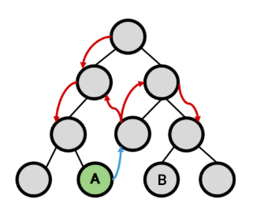

# Vuex

## State Management

### 상태 관리
- 상태(state)란?
  - `현재에 대한 정보(data)`
- Web Application에서의 상태는
  - `현재 App이 가지고있는 Data로 표현`
- 여러개의 component를 조합해서 하나의 App을 만들고 있음
- 각 component는 독립적, 각각의 상태(data)를 가짐
- 하지만, 이들이 모여 하나의 App을 구성할 예정
  - 즉, `여러개의 component가 같은 상태(data)를 유지할 필요가 있음`
    - 상태 관리 필요!

### Pass Props & Emit Event




- 지금까지 props, event를 이용해 상태관리를 하고있음
- 각 컴포넌트는 독립적으로 데이터를 관리
- `같은 데이터를 공유`하고 있으므로,
- 각 컴포넌트가 동일한 상태를 유지하고 있음
- 데이터 흐름을 직관적으로 파악 가능
- 그러나 컴포넌트의 중첩이 깊어지면 데이터 전달이 쉽지않음
- 공통의 상태를 유지해야하는 컴포넌트가 많아지면 데이터 전달 구조가 복잡해짐
- 만약 A에서 B로 데이터를 전달해야 한다면?
  - 어떻게하면 쉽게 해결할 수 있을까?

### Centralized Store


- `중앙저장소(store)에 데이터를 모아서 상태관리`
- 각 컴포넌트는 중앙저장소의 데이터를 사용
- 컴포넌트의 **계층에 상관없이** 중앙저장소에 접근해서 데이터를 얻거나 변경 가능
- 중앙저장소의 데이터가 변경되면 각각의 컴포넌트는 해당 데이터의 변화에 반응하여 새로 변경된 데이터를 반영함
- 규모가 크거나 컴포넌트 중첩이 깊은 프로젝트의 관리가 매우 편리


### Vuex
- "state management pattern + Library" for vue.js
- (상태 관리 패턴 + 라이브러리)
- 중앙 저장소를 통해 상태관리를 할 수 있도록 하는 라이브러리
- 데이터가 예측 가능한 방식으로만 변경될 수 있도록하는 `규칙을 설정하며, Vue의 반응성을 효율적으로 사용하는 상태 관리 기능`을 제공
- Vue의 공식 도구로써 다양한 기능을 제공

---
## Vuex 시작하기

```javascript
$ vue create vuex-app   // Vue 프로젝트 생성
$ cd vuex-app           // 디렉토리 이동
$ vue add vuex          // Vue CLI를 통해 vuex plugin 적용
```

### 프로젝트 with vuex
- scr / store / index.js 가 생성됨
- vuex의 핵심 컨셉 4가지
  - 1.state
  - 2.getters
  - 3.mutations
  - 4.actions


### Vue와 Vuex 인스턴스 비교


### 1.State
- vue 인스턴스의 `data`에 해당
- `중앙에서 관리하는 모든 상태 정보`
- 개별 컴포넌트는 state에서 데이터를 가져와서 사용
  - 개별 컴포넌트가 관리하던 data를 중앙저장소(Vuex Store의 state)에서 관리하게 됨
- state의 데이터가 변화하면 해당 데이터를 사용(공유)하는 컴포넌트도 자동으로 다시 렌더링
- `$store.state`로 state 데이터에 접근 (read_only)


### 2.Mutations ⭐
- `실제로 state를 변경하는 **유일한 방법**`
- vue 인스턴스의 methods에 해당하지만 Mutations에서 호출되는 핸들러(handler) 함수는 반드시 `동기적`이어야함
  - 비동기 로직으로 mutations를 사용해서 state를 변경하는 경우, **state의 변화의 시기를 특정할 수 없기 때문**
- 첫번째 인자로 `state`를 받으며,
- 컴포넌트 혹은 Actions에서 `commit()` 메서드로 호출됨
- mutaion, action에서 호출되는 함수를 handler 함수라고 함

### 3.Actions ⭐
- mutations와 비슷하지만 `비동기` 작업을 포함할 수 있다는 차이가 있음
- `state를 직접 변경하지 않고 commit() 메서드로 mutations를 호출해서 state를 변경함`
- **context** 객체를 인자로 받으며, 이 객체를 통해 store.js의 모든 요소와 메서드에 접근할 수 있음
  - == 즉 state를 직접 변경할 수 있지만 하지 않아야 함
- 컴포넌트에서 `dispatch()` 메서드에 의해 호출됨 (저장해야할때 dispatch 호출!)

### Mutations & Actions


- vue component의 methods 역할이 vuex에서는 아래와 같이 분화됨
- Mutations
  - state를 변경
- Actions
  - state 변경을 제외한 나머지 로직
  - 외부 API와 소통하는 코드 포함

### 4.Getters
- vue 인스턴스의 computed에 해당
- `state를 활용하여 계산된 값❗(return 필수) 을 얻고자 할 때 사용`
- state의 원본 데이터를 건들지 않고 계산된 값을 얻을 수 있음
- computed와 마찬가지로 getters의 결과는 캐시(cache)되며,
- 종속된 값이 변경된 경우에만 재계산됨
- getters에서 계산된 값은 state에 영향을 미치지 않음
- 첫번째 인자로 `state`, 두번째 인자로 `getter`를 받음

### 그럼 이제 모든 데이터를 Vuex에서 관리해야 할까?
- Vuex를 사용한다고 해서 모든 데이터를 state에 넣어야 하는 것은 아님
- Vuex에서도 여전히 pass props, emit event를 사용하여 상태를 관리할 수 있음
- 개발 환경에 따라 적절하게 사용하는 것이 필요
- 공통적으로 관리하는 요소들이나, depth가 깊어지는 경우엔 Vuex에서 관리!

### 정리
- state
  - 중앙에서 관리하는 `모든 상태 정보`
- mutations
  - `state를 변경`하기 위한 methods
- actions
  - `비동기 작업이 포함될 수 있는 (외부 API와의 소통 등)` methods
  - state를 변경하는 것 외의 모든 로직 진행
- getters
  - state를 활용해 `계산한 새로운 변수 값`
- 컴포넌트에서 데이터를 조작하기 위한 데이터의 흐름
  - **component => (actions) => mutations => state**
- 컴포넌트에서 데이터를 사용하기 위한 데이터의 흐름
  - **state => (getters) => component**

---
## Vuex 실습
- 시작하기 전 - Object method shorthand
  - 이제부턴 객체 메서드 축약형 사용
```javascript
// before
const obj1 = {
    addValue: function (value) {
        return value
    },
}

// after
const obj2 = {
    addValue(value) {
        return value
    },
}
```

### src / store / index.js


- vuex의 핵심 컨셉 4가지
  - state
  - getters
  - mutations
  - actions


### state
- 중앙에서 관리하는 모든 상태 정보
- `$store.state`로 접근 가능
- store의 state에 message 데이터 정의

```javascript
import Vue from 'vue'
import Vuex from 'vuex'

Vue.use(Vuex)

export default new Vuex.Store({
  state: {
    message: 'message in store',
  },
  getters: {
   
  },
  mutations: {
    
  },
  actions: {
    
  },
  modules: {
  }
})
```


- component에서 state 사용

```javascript
// App.vue

<template>
  <div id="app">
    <h1>{{ $store.state.message }}</h1>
  </div>
</template>
```

- $store.state로 바로 접근하기 보다 `computed`에 정의 후 접근하는 것을 권장

```javascript
<template>
  <div id="app">
    <h1>{{ message }}</h1>
  </div>
</template>

<script>
export default {
  name: 'App',
  computed : {
    message() {
      return this.$store.state.message
    },
  },
}
</script>
```


### actions
- state를 변경할 수 있는 `mutations 호출`
- component에서 `dispatch()에 의해 호출됨`
- `dispatch(A, B)`
  - A: 호출하고자 하는 actions 함수 == 값을 전달하는 위치
  - B: 넘겨주는 데이터(payload) == 저장하고자 하는 데이터

- actions에 정의된 changeMessage 함수에 데이터 전달하기
- component에서 actions는 `dispatch()`에 의해 호출됨

```javascript
// App.vue

<template>
  <div id="app">
    <h1>{{ message }}</h1>
    <h2>입력된 문자의 길이는 {{ messageLength }}</h2>
    <input 
    type="text"
    @keyup.enter="changeMessage"
    v-model="inputData"
    >
  </div>
</template>

<script>

export default {
  name: 'App',
  data() {
    return {
      inputData: null,

    }
  },
  computed : {
    message() {
      return this.$store.state.message
    },
    messageLength() {
      return this.$store.getters.messageLength
    },
  },
  methods : {
    changeMessage() {
      const newMessage = this.inputData
      this.$store.dispatch('changeMessage', newMessage)
    }
    
  }
}
</script>
```

- actions의 첫번째 인자는 `context`
  - context는 store의 전반적인 속성을 모두 가지고 있으므로 context.state와 context.getters를 통해 mutations를 호출하는 것이 모두 가능
  - dispatch()를 사용해 다른 actions도 호출 가능
  - **단, actions에서 state를 직접 조작하는 것은 삼가야 함**
- actions의 두번째 인자는 `payload`
  - 넘겨준 데이터를 받아서 사용

### mutations

```javascript
export default new Vuex.Store({
  ...
  actions: {
    changeMessage(context, newMessage) {
      // console.log(context)
      // console.log(newMessage)
      context.commit('CHANGE_MESSAGE',newMessage)
    },
  },
  ...
})
```

- "actions에서 commit()을 통해 mutations 호출하기"
- mutations는 state를 변경하는 유일한 방법
- component 또는 actions에서 `commit()에 의해 호출됨`

- `commit(A,B)`
  - A: 호출하고자 하는 mutations 함수
  - B: payload

- "mutations 함수 작성하기"
- mutations는 state를 변경하는 유일한 방법
- mutations 함수의
  - 첫번째 인자는 **state**
  - 두번째 인자는 **payload**

### getters
- `getters는 state를 활용한 새로운 변수`
- getters 함수의
  - 첫번째 인자는 **state**
  - 두번째 인자는 **getters**

```javascript
// store/index.js
export default new Vuex.Store({
  ...
  getters: {
    messageLength(state) {
      return state.message.length
    },
    // messageLength를 이용해서 새로운 값 계산
    doubleLength(state, getters) {
      return getters.messageLength * 2
    },
  },
  ...
})
```
- "getters 출력하기"
- getters 역시 state와 마찬가지로 computed에 정의해서 사용하는 것을 권장

```javascript
// App.vue
<script>

export default {
  ...
  computed : {
    message() {
      return this.$store.state.message
    },
    messageLength() {
      return this.$store.getters.messageLength
    },
    doubleLength() {
      return this.$store.getters.doubleLength
    },
  },
  ...
}
</script>
```

```javascript
// App.vue
...
<template>
  <div id="app">
    <h1>{{ message }}</h1>
    <h2>입력된 문자의 길이는 {{ messageLength }}</h2>
    <h2>x2 : {{ doubleLength }}</h2>
    <input 
    type="text"
    @keyup.enter="changeMessage"
    v-model="inputData"
    >
  </div>
</template>
```

---

## Lifecycle Hooks
- 각 Vue 인스턴스는 생성과 소멸의 과정 중 단계별 초기화 과정을 거침
  - Vue 인스턴스가 **생성**된 경우, 인스턴스를 DOM에 **마운트**하는 경우,
  - 데이터가 변경되어 DOM를 **업데이트**하는 경우 등
- 각 단계가 트리거가 되어 특정 로직을 실행할 수 있음
- 이를 Lifecycle Hooks이라고 함


### created ⭐
- Vue instance가 생성된 후 호출됨
- data, computed 등의 설정이 완료된 상태
- 서버에서 받은 데이터를 vue instance의 data에 할당하는 로직을 구현하기 적합
- 단, mount 되지 않아 요소에 접근할 수 없음
- JavaScript에서 학습한 Dog API 활용 실습의 경우
- 버튼을 누르면 강아지 사진을 보여줌
- 버튼을 누르지 않아도 첫 실행 시 기본 사진이 출력되도록 하고 싶다면
- created 함수에 강아지 사진을 가져오는 함수를 추가

```javascript
// components/DogComponent.vue

export default {
  ...
  created() {
    this.getDogImage()
  },
}
```

### mounted ⭐
- Vue instance가 요소에 mount된 후 호출됨
- mount된 요소를 조작할 수 있음

```javascript
// components/DogComponent.vue

export default {
  ...
  mounted() {
      const button = document.querySelector('button')
      button.innerText = '멍멍!'
  },
}
```

### updated ⭐
- 데이터가 변경되어 DOM에 변화를 줄 때 호출됨

```javascript
// components/DogComponent.vue

export default {
  ...
  updated() {
    console.log('새로운 멍멍이!')
    console.log('Child updated!')
  },
}
```

### Lifecycle Hooks 특징
- instance마다 각각의 Lifecycle을 가지고 있음


- Lifecycle Hooks는 컴포넌트별로 정의할 수 있음
- 현재 해당 프로젝트는 
  - **App.vue 생성 => ChildComponent 생성 => ChildComponent 부착 => App.vue 부착 => ChildComponent 업데이트** 순으로 동작한 것

- 부모 컴포넌트의 mounted hook이 실행되었다고 해서 자식이 mount 된 것이 아니고,
- 부모 컴포넌트가 updated hook이 실행되었다고 해서 자식이 updated 된 것이 아님
  - 부착 여부가 부모-자식 관계에 따라 순서를 가지고 있지 않은 것
- `instance마다 각각의 Lifecycle을 가지고 있기 때문`


