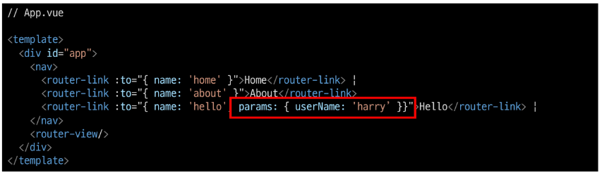
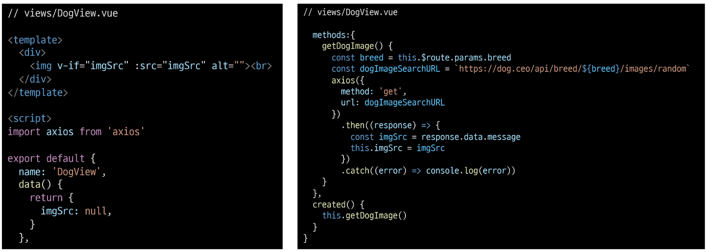
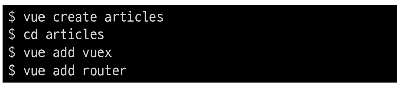
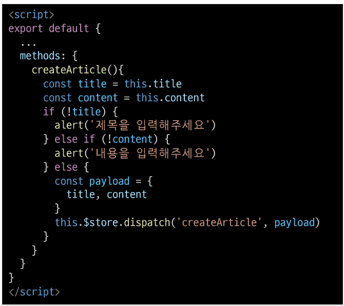

## UX & UI
### UX (User Experience)
- 유저와 가장 가까이 있는 분야, 데이터 기반으로 유저 조사, 분석해서 개발자, 디자이너가 이해할 수 있게 소통
- 유저가 느끼는 느낌, 태도 그리고 행동을 디자인

### UI (User Interface)
- 유저에게 보여지는 화면을 디자인
- UX를 고려한 디자인을 반영, 이 과정에서 기능 개선 혹은 추가가 필요한 경우 프론트엔드 개발자와 가장 많이 소통

> [참고] Interface
- 서로 다른 두개의 시스템, 장치 사이에서 정보나 신호를 주고받는 경우의 접점
  - 사용자가 기기를 쉽게 동작 시키는데 도움을 주는 시스템
- **CLI**(command-line interface)나 **GUI**(Graphic User Interface)를 사용해서 컴퓨터를 조작

### UX/UI 그리고 HCI
- GUI : 유저가 보는 일반적 시각적인 디자인
- UI : 비시각적인 부분까지 포함한 디자인
- UX : 유저가 겪는 모든 경험 (컴퓨터와 관련 없는 부분까지 포함)
- HCI (Human Computer Interaction): 인간과 컴퓨터 사이의 상호작용에 대한 학문

## Prototyping
### Software prototyping
- 애플리케이션의 프로토타입을 만드는 것
- 개발중인 소프트웨어 프로그램의 완성되기 전 버전
- 한번에 완성 버전이 나올수 없기에 중간마다 현재 상태 체크하는 과정

### Figma
- 인터페이스 디자인을 위한 협업 웹 애플리케이션
- `협업`에 중점을 두면서 UI/UX 설계에 초점
- 웹 기반 시스템
  - 매우 가벼운 환경에서 실행 가능
  - 모든 작업 내역이 웹에 저장됨
- `실시간으로 팀원들이 협업`할 수 있는 기능 제공
- 직관적이고 다양한 디자인 툴
- Figma 사용자들이 만든 다양한 플러그인 존재 (VSCode 확장 프로그램 등)
- `대부분의 기능을 무료로 사용` 가능

### 프로젝트 시작 전
- 개발부터 시작하지 말고 반드시 충분한 기획 필요
- 프로토타입
- 이런 과정을 통해 기획에서 빠진 화면이나 API등을 확인 가능
- 설계 기획이 끝난 후 개발 시작해야 체계적인 진행 가능

### 프로젝트와 협업
- 효과적 협업 위해 다양한 방법과 도구 찾기

---


# Vue Router

## Routing
- 네트워크에서 경로를 선택하는 프로세스
- 웹 서비스에서의 라우팅
  - 유저가 방문한 URL에 대해 적절한 결과를 응답하는 것
  - `/articles/index/`에 접근하면 articles의 index에 대한 결과를 보내줌

### Routing in SSR
- Server가 모든 라우팅을 통제 (view)
- URL로 요청이 들어오면 응답으로 완성된 HTML 제공
  - Django로 보낸 요청의 응답 HTML은 완성본인 상태였음
- 결론적으로, Routing(URL)에 대한 결정권을 서버가 가짐

### Routing in SPA / CSR
- 서버는 **하나의 HTML**(index.html)만을 제공
- 이후에 모든 동작은 하나의 HTML 문서 위에서 Javascript 코드를 활용
  - DOM을 그리는데 필요한 **추가적인 데이터가 있다면 axios** 같은 AJAX 요청을 보낼 수 있는 도구를 사용하여 데이터를 가져오고 처리
- 즉, `하나의 URL만 가질 수 있음`

### Why routing?
- 동작에 따라 URL이 바뀌어야하나?
  - 유저의 사용성 관점에선 필요함
- Routing이 없다면,
  - 유저가 URL을 통한 페이지의 변화를 감지할 수 없음
  - 페이지가 무엇을 렌더링 중인지에 대한 상태를 알 수 없음
    - 새로고침 시 처음 페이지로 돌아감
    - 링크 공유 시 처음 페이지만 공유가능
  - 브라우저의 뒤로가기 기능 사용 불가
---

## Vue Router
- Vue의 공식 라우터
- SPA 상에서 라우팅을 쉽게 개발할 수 있는 기능을 제공
- 라우트(routes)에 컴포넌트를 매핑한 후, 어떤 URL에서 렌더링 할지 알려줌
  - 즉, SPA를 MPA처럼 URL을 이동하면서 사용 가능
  - SPA의 단점 중 하나인 `"URL이 변경되지 않는다."를 해결`
- 페이지는 여전히 하나!

> [참고] MPA (Multiple Page Application)
- 여러개의 페이지로 구성된 애플리케이션
- SSR 방식으로 렌더링

### Vue Router 시작하기
```javascript
$ vue create vue-router-app // vue 프로젝트 생성 
$ cd vue-router-app         // 디렉토리 이동
$ vue add router            // vue CLI를 통해 router plugin 적용
```
- 기존에 프로젝트를 진행하고 있던 도중에 router를 추가하게 되면 App.vue를 덮어쓰므로, 필요한 경우 명령을 실행하기 전에 파일을 백업해두어야 함
- history mode 사용여부 -> Yes

### History mode
- 브라우저의 History API를 활용한 방식
  - 새로고침 없이 URL 이동 기록을 남길 수 있음
- 우리에게 익숙한 URL 구조로 사용 가능
  - http://localhost:8080/index
- > [참고] History mode를 사용하지 않으면 
  - Default값인 **hash mode**로 설정됨 ('#'을 통해 URL을 구분하는 방식)
  - http://localhost:8080#index


### Vue Router 시작하기
- **App.vue**
  - router-link 요소 및 router-view가 추가됨


- **router/index.js** 생성
- **views** 폴더 생성


### `router-link`
- a태그와 비슷한 기능
  - **URL을 이동**시킴
  - **routes에 등록된 컴포넌트와 매핑**됨
  - 히스토리 모드에서 router-link는 **클릭 이벤트를 차단**하여 a태그와 달리 **브라우저가 페이지를 다시 로드하지 않도록 함**
- 목표 경로는 `'to'`속성으로 지정됨
- 기능에 맞게 HTML에서 a태그로 rendering되지만, 필요에 따라 다른 태그로 바꿀 수 있음


### `router-view`
- **주어진 URL에 대해 일치하는 컴포넌트를 렌더링**하는 컴포넌트
- **실제 component가 DOM에 부착되어 보이는 자리**를 의미
- router-link를 클릭하면 routes에 매핑된 컴포넌트를 렌더링
- Django의 **block tag**와 비슷
  - **App.vue**는 **base.html**의 역할
  - **router-view**는 **block태그**로 감싼 부분

### src/router/index.js
- 라우터에 관련된 정보 및 설정이 작성되는 곳
- Django에서의 **urls.py**에 해당
- routes에 URL과 컴포넌트 매핑


### src/Views
- **router-view에 들어갈 component 작성**
- 기존에 컴포넌트를 작성하던 곳은 components 폴더 뿐이었지만 이제 두 폴더로 나눠짐
- 각 폴더 안의 .vue 파일들이 기능적으로 다른 것은 아님
- 이제 폴더별 컴포넌트 배치는 다음과 같이 진행 (규약은 아님)
- `views/`
  - **routes에 매핑되는 컴포넌트**,
  - 즉 `<router-view>`의 위치에 렌더링 되는 컴포넌트를 모아두는 폴더
  - 다른 컴포넌트와 구분하기 위해 **View로 끝나도록 만드는 것**을 권장
  - ex) App 컴포넌트 내부의 AboutView & HomeView 컴포넌트
- `components/`
  - routes에 매핑된 컴포넌트의 하위 컴포넌트를 모아두는 폴더
  - ex) HomeView 컴포넌트 내부의 HelloWorld 컴포넌트

---

## Vue Router 실습

### 주소를 이동하는 2가지 방법
- 1. 선언적 방식 네비게이션
- 2. 프로그래밍 방식 네비게이션

### 선언적 방식 네비게이션
- router-link `'to'`속성으로 주소 전달
  - routes에 등록된 주소와 매핑된 컴포넌트로 이동


- Named Routes
  - 이름을 가지는 routes
    - Django에서 path 함수의 name 인자의 활용과 같은 방식


- 동적인 값을 사용하기 때문에 v-bind를 사용해야 정상적 작동


### 프로그래밍 방식 네비게이션
- Vue 인스턴스 내부에서 라우터 인스턴스에 `$router`로 접근 할 수 있음
- 다른 URL로 이동하려면 `this.$router.push`를 사용
  - history **stack**에 이동할 URL을 넣는 (push) 방식
  - history stack에 기록이 남기 때문에 사용자가 브라우저의 **뒤로 가기** 버튼을 클릭하면 이전 URL로 이동 가능
- 결국 `<router-link :to="...">`를 클릭하는 것과 `$router.push(...)`를 호출하는 것은 같은 동작
- 동작원리는 선언적 방식과 같음


### Dynamic Route Matching
- 동적 인자 전달
  - URL의 특정 값을 변수처럼 사용 가능
- ex) Django에서의 variable routing

- HelloView.vue 작성 및 route 추가
- route 추가 시, 동적 인자를 명시


- `$route.params`로 변수에 접근 가능


- 다만 HTML에서 직접 사용하기 보다는 data에 넣어서 사용할 것을 권장


### Dynamic Route Matching - 선언적 방식 네비게이션
- App.vue에서 harry에게 인사하는 페이지로 이동해보기
- params를 이용하여 동적 인자 전달 가능



### Dynamic Route Matching - 프로그래밍 방식 네비게이션
- AboutView에서 데이터를 입력 받아 HelloView로 이동하여 입력받은 데이터에게 인사하기


### route에 컴포넌트를 등록하는 또다른 방법
- router/index.js에 컴포넌트를 등록하는 또다른 방식이 주어지고 있음 (about)


### lazy-loading
- 모든 파일을 한 번에 로드하려고 하면 모든 걸 다 읽는 시간이 매우 오래 걸림
- 미리 로드를 하지 않고 특정 라우트에 방문할 때 매핑된 컴포넌트의 코드를 로드하는 방식을 활용할 수 있음
  - 모든 파일을 한 번에 로드하지 않아도 되기 때문에 최초에 로드하는 시간이 빨라짐
  - 당장 사용하지 않을 컴포넌트는 먼저 로드하지 않는 것이 핵심

---

## Navigation Guard

### 네비게이션 가드
- Vue router를 통해 특정 URL에 접근할 때 **다른 url로 redirect**하거나 **해당 URL로의 접근을 막는** 방법
  - Ex) 사용자의 인증 정보가 없으면 특정 페이지에 접근하지 못하게 함

### 네비게이션 가드의 종류
- 전역가드
  - 애플리케이션 전역에서 동작
- 라우터 가드
  - 특정 URL에서만 동작
- 컴포넌트 가드
  - 라우터 컴포넌트 안에 정의

## 전역가드
### Global Before Guard
- 다른 url 주소로 이동할때 항상 실행
- router/index.js에 `router.beforeEach()` 를 사용하여 설정
- 콜백 함수의 값으로 3개의 인자를 받음
  - **to** : 이동할 URL 정보가 담긴 Route 객체
  - **from** : 현재 URL 정보가 담긴 Route 객체
  - **next** : 지정한 URL로 이동하기 위해 호출하는 함수
    - 콜백 함수 내부에서 반드시 한 번만 호출되어야 함
    - 기본적으로 **to**에 해당하는 URL로 이동
- URL이 변경되어 화면이 전환되기 전 **router.beforeEach()**가 호출됨
  - 화면이 전환되지 않고 대기상태가 됨
- 변경된 URL로 라우팅하기 위해서는 `next()`를 호출해줘야 함
  - `next()가 호출되기 전까지 화면이 전환되지 않음`

### Global Before Guard 실습
- '/home'으로 이동하더라도 라우팅이 되지않고 아래와 같이 로그만 출력됨
- `next()`가 호출되지 않으면 화면이 전환되지 않음


- `next()`가 호출되어야 화면이 전환됨


- About으로 이동해보기
  - to에는 이동할 url인 about에 대한 정보가,
  - from에는 현재 url인 home에 대한 정보가 들어있음


### Login 여부에 따른 라우팅 처리

- Login이 되어있지 않다면 Login페이지로 이동하는 기능 추가


- LoginView에 대한 라우터 링크 추가


- HelloView에 로그인을 해야만 접근할 수 있도록 만들어 보기
- 로그인 여부에 대한 임시변수 생성
- 로그인이 필요한 페이지를 저장
  - 로그인이 필요한 페이지들의 이름(라우터에 등록한 name)을 작성
- 앞으로 이동할 페이지(to)가 로그인이 필요한 사이트인지 확인


- isAuthRequired 값에 따라 로그인이 필요한 페이지이고 로그인이 되어있지 않으면
  - Login 페이지로 이동
- 그렇지 않으면
  - 기존 루트로 이동
- next()인자가 없을 경우 to로 이동


- isLoggedIn이 true인 경우 (로그인 상태에서 로그인이 필요한 페이지로 접속)
  - `/hello/harry`에 해당하는 컴포넌트가 정상적으로 렌더링
- isLoggedIn이 false인 경우 (비로그인 상태에서 로그인이 필요한 페이지로 접속)
  - `/hello/harry`을 렌더링하지 않고 Login 페이지로 이동됨

- Home => Login으로 이동했는데 console창에 log가 2개 찍힌 이유
  - 첫번째 출력은 /hello/harry로 접속 시도 후 전역가드에 막혀서 login으로 이동 요청 할때 출력
  - 두번째 출력은 /login으로 이동요청 할때 출력

- `/hello/:userName` 페이지를 제외하고는 전역가드에서 기존주소로 이동하기 때문에 정상적으로 작동
- 로그인이 필요한 페이지에 추가하면 비로그인 시 해당 페이지에 접근 불가


- 반대로 Login하지 않아도 되는 페이지들을 모아 둘 수도 있음


## 라우터 가드

- 전체 route가 아닌 특정 route에 대해서만 가드를 설정하고 싶을 때 사용
- `beforeEnter()`
  - route에 진입했을때 실행됨
  - 라우터를 등록한 위치에 추가
  - 단 매개변수, 쿼리, 해시 값이 변경될 때는 실행되지 않고
  - 다른 경로에서 탐색할 때만 실행됨
  - 콜백함수는 to, from, next를 인자로 받음

### Login 여부에 따른 라우팅 처리
- "이미 로그인 되어있는 경우 HomeView로 이동하기"
- 라우터 가드 실습을 위해 전역 가드 실습코드는 주석처리

- 로그인 여부에 대한 임시 변수 생성
- 로그인이 되어있는 경우 home으로 이동
- 로그인이 되어있지 않은 경우 login으로 이동


- **isLoggedIn = true** 인 경우 (로그인 상태인 경우)
  - `/login`으로 접속을 시도하면 Home으로 이동

- Login을 제외한 다른 페이지로 이동하면 라우터 가드를 따로 설정해주지 않았기 때문에 라우터 가드가 동작하지 않음
- 이런식으로 특정 라우터만 따로 가드를 하고 싶은 경우에는 라우터 가드를 사용
- isLoggedIn = false로 변경하면 Login페이지로 정상 이동 가능


## 컴포넌트 가드

- 특정 컴포넌트 내에서 가드를 지정하고 싶을 때 사용
- `beforeRouteUpdate()`
  - 해당 컴포넌트를 렌더링하는 경로가 변경될 때 실행

### Params 변화 감지
- about에서 jun에게 인사하는 페이지로 이동


- navbar에 있는 Hello를 눌러 harry에게 인사하는 페이지로 이동
  - URL은 변하지만 페이지는 변화하지 않음


- 변화하지 않는 이유
  - 컴포넌트가 재사용되었기 때문
  - 기존 컴포넌트를 지우고 새로 만드는 것보다 효율적
    - 단, lifecycle hook이 호출되지 않음
    - 따라서 $route.params에 있는 데이터를 새로 가져오지 않음

- `beforeRouteUpdate()`를 사용해서 처리
  - userName을 이동할 params에 있는 userName으로 재할당


---
## 404 Not Found

- 사용자가 요청한 리소스가 존재하지 않을 때 응답


- 직접 요청하는 방식이 아닌, 요청한 리소스가 존재하지 않을 때 404로 이동하도록 하려면?

### 요청한 리소스가 존재하지 않는 경우
- 모든 경로에 대해서 404 page로 redirect시키기
  - 기존에 명시한 경로가 아닌 모든 경로가 404 page로 redirect 됨
  - `이때, routes에 최하단부에 작성해야함!`


### 형식은 유효하지만 특정 리소스를 찾을 수 없는 경우
- 예시) Django에게 `articles/1/`로 요청을 보냈지만, 1번 게시글이 삭제된 상태
  - 이때는 path: '*'를 만나 404 page가 렌더링 되는 것이 아니라 
  - 기존에 명시한 `articles/:id/`에 대한 components가 렌더링 됨
  - 하지만 데이터가 존재하지 않기 때문에 정상적으로 렌더링 되지 않음
- 해결책
  - 데이터가 없음을 명시
  - 404 page로 이동해야 함

- Dog API문서(https://dog.ceo/dog-api/)를 참고하여 동적인자로 강아지 품종을 전달해 품종에 대한 랜덤 이미지를 출력하는 페이지를 만들어보기

- 1.Axios 설치
- 2.DogView 컴포넌트 작성
- 3.routes에 등록
  - '*'보다 상단에 등록


- Dog api 문서를 참고하여 axios 로직을 작성



- /dog/hound에 접속하면 hound 품종에 대한 랜덤 사진이 출력

- axios 요청이 오는 중 동작하고 있음을 표현하기 위한 로딩 메세지 정의


- axios 요청이 실패할 경우 자료가 없음을 표현하기


- `/dog/abc`에 접속하면 "abc는 없는 품종입니다" 출력


### 404 Not Found
- 이전처럼 메세지를 바꿀 수도 있지만
- axios 요청이 실패할 경우 404 페이지로 이동시킬 수도 있음


---

## Articles with Vue

- 지금까지 배운 내용 종합하여 Django에서 만들었던 게시판 만들기
- 구현기능
  - Index
  - Create
  - Detail
  - Delete
  - 404

- 컴포넌트 구성


- 완성 화면


### 사전 준비
- 프로젝트 시작



- App.vue는 아래 코드만 남김 (CSS 코드는 유지)


---
## Index

- articles의 목록을 보여주는 index 페이지 작성

### Index 구현
- state
- 게시글의 필드는 id, 제목, 내용, 생성일자
- DB의 AUTO INCREMENT를 표현하기 위해 article_id를 추가로 정의해줌
- (다음 article의 id로 사용 예정)


- IndexView 컴포넌트 및 라우터 작성
 


- state에서 불러온 articles 출력하기


- ArticleItem 컴포넌트 작성


- IndexView 컴포넌트에서 ArticleItem 컴포넌트 등록 및 props 데이터 전달


- props 데이터 선언 및 게시글 출력


---

## Create

### Create 구현
- CreateView 컴포넌트 및 라우터 작성


- Form 생성 및 데이터 정의


- `v-on:{event}.prevent`를 활용하여 submit 이벤트 동작을 취소하기


- actions에 여러개의 데이터를 넘길때 하나의 object로 만들어서 전달


- `v-model.trim`을 활용하여 입력값의 공백을 제거


- 데이터가 없는 경우 alert, 데이터가 있는 경우 actions로 전달



- actions에서 넘어온 데이터를 활용하여 article 생성 후 mutations 호출
  - 이때 id로 article_id 활용


- mutations에서는 전달된 article 객체를 사용해 게시글 작성
  - 다음 게시글 위해 article_id 값 1 증가


- CreateView 컴포넌트에 Index 페이지로 이동하는 뒤로가기 링크 추가


- 게시글 생성 후 Index 페이지로 이동하도록 네비게이터 작성


- IndexView 컴포넌트에 게시글 작성 페이지로 이동하는 링크 추가


---

## Detail

### Detail 구현
- DetailView 컴포넌트 및 라우터 작성
- id를 동적인자로 전달


- article 정의 및 state에서 articles 가져오기


- articles에서 동적 인자를 통해 받은 id에 해당하는 article 가져오기
- 이때, 동적 인자를 통해 받은 id는 str이므로 형변환해서 비교


- article 출력


- created lifecycle hook을 통해 인스턴스가 생성되었을 때 article을 가져오는 함수 호출


### 만약 서버에서 데이터를 가져왔다면?
- 우리는 현재 state를 통해 데이터를 동기적으로 가져오지만, 실제로는 서버로부터 가져옴
  - 데이터를 가져오는데 시간이 걸림
- created를 주석처리하고 데이터가 서버로부터 오는데 시간이 걸림을 가정해보자


- 그런데 article이 null이기 때문에 id등의 속성을 가져올 수 없음

- optional chaining(`?.`)을 통해 article 객체가 있을 때만 출려되도록 수정
- created 주석을 다시 해제


> [참고] Optional Chaining
- Optional Chaining (`?.`) 앞의 평가 대상이 undefined나 null이면 에러가 발생하지 않고 undefined를 반환
  - ES2020에서 추가된 문법


### Data in JavaScript
- JavaScript에서 시간을 나타내는 Date 객체는 1970년 1월 1일 UTC(협정 세계시) 자정과의 시간차이를 밀리초로 나타내는 정수 값을 담음
  - `Date().toLocaleString()`을 사용하여 반환

- 로컬시간으로 변환해주는 computed값 작성 및 출력


- DetailView 컴포넌트에 뒤로가기 링크 추가


- 각 게시글을 클릭하면 detail 페이지로 이동하도록 ArticleItem에 이벤트 추가
- v-on 이벤트 핸들러에도 인자 전달 가능


---

## Delete

### Delete 구현
- DetailView 컴포넌트에 삭제 버튼을 만들고, mutations를 호출


- mutations에서 id에 해당하는 게시글을 지움


- 삭제 후 index 페이지로 이동하도록 네비게이션 작성


---

## 404 Not Found

### 404 페이지 구현
- NotFound404 컴포넌트 및 라우터 작성
- Detail에 대한 route보다 먼저 등록해줘야함
  - 또한, /404로 등록하면 404번째 게시글과 혼동할 수 있게 됨


- DetailView 컴포넌트에 id에 해당하는 article이 없으면 404 페이지로 이동


- 요청한 리소스가 존재하지 않는 경우
- 없는 id가 아닌 전혀 다른 요청에도 대비하여 404 page로 **redirect** 시키기
  - `$router.push`와 마찬가지로 name을 이용하여 이동할 수 있음


---
# SUMMARY
- UX & UI
- Vue Router
- Navigation Guard
- Articles app with Vue


