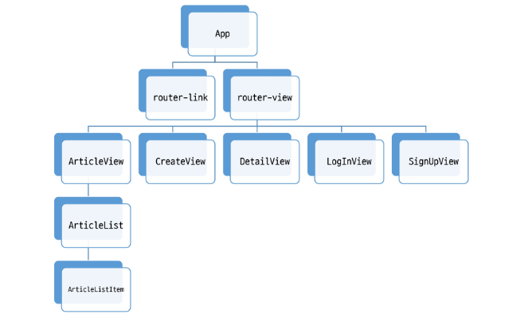
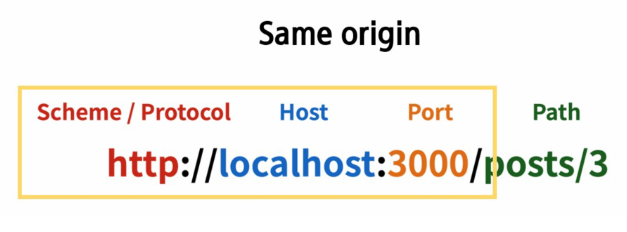
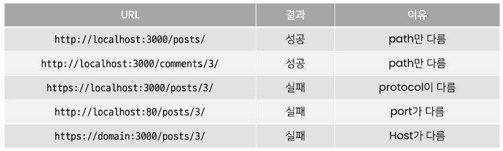

# Vue with DRF

## Server & Client

### Server
- 클라이언트에게 `정보`와 `서비스`를 제공하는 컴퓨터 시스템
- 서비스 전체를 제공 == Django Web Service
  - Django를 통해 전달받은 HTML에는 하나의 웹 페이지를 구성할 수 있는 모든 데이터가 포함
  - 즉, 서버에서 모든 내용을 렌더링 하나의 HTML 파일로 제공
  - 정보를 포함한 web 서비스를 구성하는 모든 내용을 서버 측에서 제공
- 정보를 제공 == DRF API Service
  - Django를 통해 관리하는 정보만을 클라이언트에게 제공
  - DRF를 사용하여 JSON으로 변환


### Client
- `Server가 제공하는 서비스에 적절한 요청`을 통해 
  - Server가 정의한 방식대로 요청 인자를 넘겨 요청
  - Server는 정상적인 요청에 적합한 응답 제공
- `Server로부터 반환 받은 응답을 사용자에게 표현`하는 기능을 가진 프로그램 혹은 시스템
  - 사용자의 요청에 적합한 data를 server에 요청하여 응답 받은 결과로 적절한 화면을 구성

### 정리
- Server는 정보와 서비스를 제공 (DRF)
  - DB와 통신하며 데이터를 생성, 조회, 수정, 삭제를 담당
  - 요청을 보낸 Client에게 정상적인 요청이었다면 처리한 결과를 응답
- Client는 사용자의 정보 요청을 처리, server에게 응답 받은 정보를 표현 (Vue)
  - Server에게 정보(데이터)를 요청
  - 응답 받은 정보를 가공하여 화면에 표현

---
# Again DRF

- back-server 코드 확인
- Model 구조 확인
- 요청 경로 확인 (urls.py)
- Dummy data 확인 (fixtures)
- 데이터 삽입
  - ```
    $ python manage.py migrate
    $ python manage.py loaddata articles.json comments.json
    ```
- 서버 실행 후, 전체 게시글 조회
  - Browser에서 server에 전체 게시글 조회 요청 -> 데이터 반환 확인
  - Postman에서 올바른 방법으로 요청 -> 데이터 반환 확인

---
# Back to Vue

### Skeleton code 확인
- front-server 폴더 구조 확인 및 서버 구동 준비
  - ```
    $ npm i
    $ npm run serve
    ```
### 컴포넌트 구조 확인



### 메인 페이지 구성
- views/ArticleView.vue component 확인 및 route 등록

- src/App.vue router-link 주석 해제 및 결과 확인

- components/ArticleList.vue 확인
  - 전체 게시물을 표현할 컴포넌트
  - 화면 구성을 위한 최소한의 style 포함

- views/ArticleView.vue 주석 해제
- 'ArticleList' 하위 컴포넌트 등록
  - 불러오기
  - 등록하기
  - 보여주기

- components/ArticleListItem.vue 확인
  - 각 게시글들의 정보를 표현할 컴포넌트
  - 데이터 없이 최소한의 기본 구조만 확인

- components/ArticlesList.vue 주석 해제
- 'ArticleListItem' 하위 컴포넌트 등록

- store/index.js 주석 해제
- state에 articles 배열 정의
- 화면 표현 체크용 데이터 생성

- components/ArticleList.vue 코드 수정
  - state에서 articles 데이터 가져오기 
  - v-for 디렉티브 활용하여 하위 컴포넌트에서 사용할 article 단일 객체 정보를 pass props

- components/ArticleListItem.vue 수정
  - 내려받은 prop 데이터로 화면 구성
  - prop 데이터의 타입은 명확하게 표기할 것


---
# Vue with DRF

### AJAX 요청 준비
- axios 설정    
  - 설치
```
$ npm i axios
```
  - store/index.js에서 불러오기
    - 요청보낼 API server 도메인 변수에 담기
- store/index.js 주석 해제
  - 'getArticles' 메서드 정의
  - 요청 보낼 경로 확인 필수
  - 성공시 .then
  - 실패시 .catch

- views/ArticleView.vue 주석 해제
  - 'getArticles' actions 호출
  - 인스턴스가 생성된 직후 요청을 보내기 위해 created() hook 사용

### 요청 결과 확인
- Vue와 Django 서버를 모두 켠 후 메인 페이지 접속
- Server에서는 200을 반환하였으나 Client Console에서는 Error를 확인
- 데이터를 확인할 수 없는 이유
  - CORS policy에 의해 blocked 되었기 때문


---
# CORS
## Cross-Origin Resource Sharing

### What Happened>
- 브라우저가 요청을 보내고 서버의 응답이 브라우저에 도착
  - Server의 log는 200(정상) 반환
  - 즉 Server는 정상적으로 응답했지만 브라우저가 막은 것
- 보안상의 이유로 브라우저는 동일 출처 정책(SOP)에 의해 다른 출처의 리소스와 상호작용 하는 것을 제한함

### SOP (Same-Origin Policy)
- "동일 출처 정책"
- 불러온 문서나 스크립트가 다른 출처에서 가져온 리소스와 상호작용하는 것을 제한하는 보안 방식
- 잠재적으로 해로울 수 있는 문서를 분리함으로써 공격받을 수 있는 경로를 줄임

### Origin - "출처"
- URL의 Protocol, Host, Port를 모두 포함하여 출처라고 부름
- Same Origin 예시
  - 아래 세 영역이 일치하는 경우에만 동일 출처로 인정



  - http://localhost:3000/posts/3/ 을 기준으로 출처를 비교




### CORS - 교차 출처 리소스 공유
- 추가 `HTTP Header` (응답에 헤더가 붙게됨, 서버가 응답을 줄때 헤더 데이터를 추가해서 브라우저에게 주어야함!!!) 를 사용하여, 특정 출처에서 실행중인 웹 어플리케이션이 `다른 출처의 자원에 접근할 수 있는 권한`을 부여하도록 **브라우저에 알려주는 체제**
  - 어떤 출저에서 자신의 컨텐츠를 불러갈 수 있는지 **서버에 지정**할 수 있는 방법
- 리소스가 자신의 출처와 다를 때 교차 출처 HTTP 요청을 실행
  - 만약 다른 출처의 리소스를 가져오기 위해서는 이를 제공하는 서버가 **브라우저**에게 **다른 출처지만 접근해도 된다는 사실을 알려야 함**
  - "교차 출처 리소스 공유 정책 (CORS policy)"


### CORS policy - 교차 출처 리소스 공유 정책
- 다른 출처에서 온 리소스를 공유하는 것에 대한 정책
- CORS policy에 위배되는 경우 브라우저에서 해당 응답 결과를 사용하지 않음
  - Server에서 응답을 주더라도 브라우저에서 거절
- 다른 출처의 리소스를 불러오려면 그 출처에서 `올바른 CORS header`를 포함한 응답을 반환해야 함


## How to set CORS
- CORS 표준에 의해 추가된 HTTP Response Header를 통해 이를 통제 가능
- HTTP Response Header 예시
  - `Access-Control-Allow-Origin` 
    - 단일 출처를 지정하여 브라우저가 해당 출처가 리소스에 접근하도록 허용

### django-cors-headers library 사용하기
- 응답에 CORS header를 추가해주는 라이브러리
- 다른 출처에서 Django 애플리케이션에 대한 브라우저 내 요청을 허용함


---

# Vue with DRF
## Article Read


