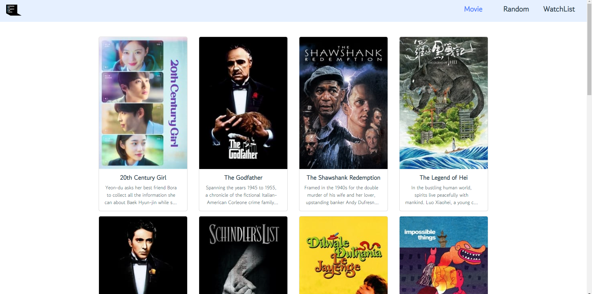
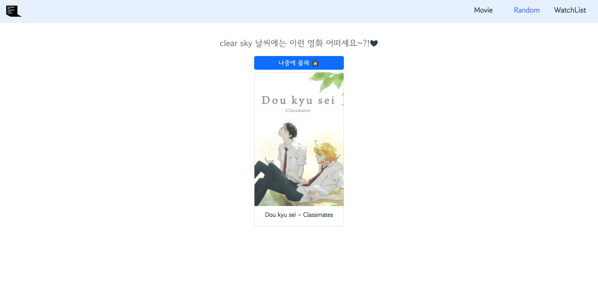
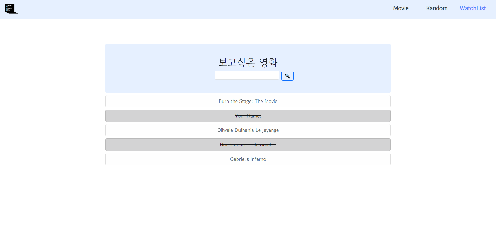
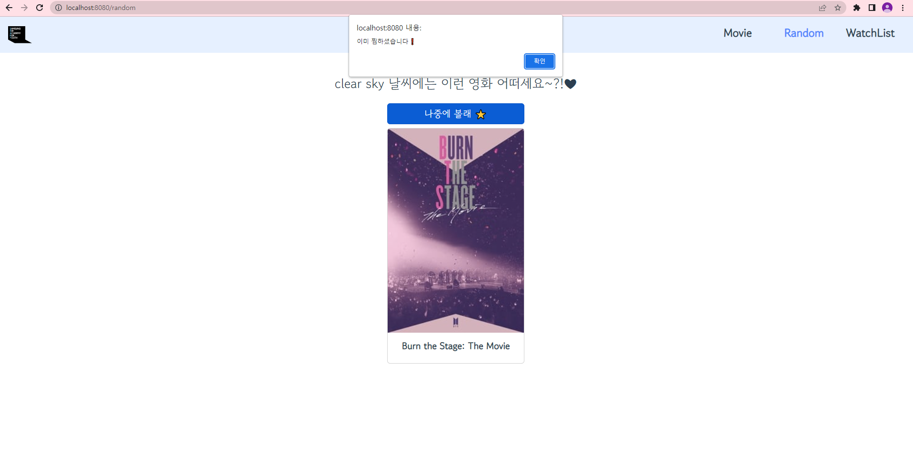

# PJT 09

### 이번 pjt 를 통해 배운 내용

> 나연

* api로 가져와서 뭘 만드는게 쉽진않구나,,,,

* 하지만 실력이 많이 느는것 같다! 

> 진우

* 라우터와 vuex를 통해 데이터 통신이 어떻게 이루어지는지에 대해 좀 더 정확히 알 수 있었다.

* CSS와 javascript를 이용해서 page가 바로바로 바뀌게 하는 것을 보며 어떻게하면 좀 더 이쁘게 만들 수 있을까 궁리할 수 있어서 좋은 시간이었다고 생각한다.

## A. 최고 평점 영화 출력

* 요구 사항 : 
* 네비게이션 바에서 Movie 링크(/movies)를 클릭하면 AJAX 통신을 이용하여
  TMDB API로 부터 JSON 데이터를 받아와 다음과 같이 영화 목록을 출력

* 결과 : 



* 문제 접근 방법 및 코드 설명
* axios로 api로 영화 정보 가져와서 적절히 변수에 배분
* movie list를 먼저 받고,  movie card에 v-for로 보내줌
* title, poster_path, overview 정보 가져와서 씀!
* title과 discription은 중앙 정렬으로 보여주고 discription은 3줄이 넘으면 ... 으로 처리해주었음.

```javascript
// App.vue
<template>
  <div id="app">
    <nav class="navbar bg-primary text-dark bg-opacity-10 p-2 mb-5">
      <div class="container-fluid">
        <a class="navbar-brand" href="#">
          

        </a>
        <div class="d-flex container justify-content-end m-0 mt-2">
          <ul class="row fs-4" style="width:450px;">
            <li class="col"><router-link :to="{ name: 'MovieView' }" @click.native ="getData">Movie </router-link></li>
            <li class="col"><router-link :to="{ name: 'RandomView' }" @click.native="[randomMovie(),todayWeather()]">Random   </router-link></li>
            <li class="col"><router-link :to="{ name: 'WatchListView' }">WatchList</router-link></li>
          </ul>


        </div>

      </div>
    </nav>


    <router-view/>
  </div>
</template>

<script>

import axios from 'axios'

const API_KEY = '812e384969b0b5de7cadaa5e861f286d'
const WEATHER_KEY = '814d648a20fbc0b72d481f655d40a075'

export default {
  name: 'app',
  methods: {
    getData(event) {
      event.preventDefault()

      axios({
            method: 'get',
            url: `https://api.themoviedb.org/3/movie/top_rated?api_key=${API_KEY}`
        })
        .then(res => {
            const movieList = res.data.results
            this.$store.commit('MOVIE_LIST', movieList)
        })
        .catch(err => {
            console.log(err)
        })
    },
    randomMovie() {
      axios({
            method: 'get',
            url: `https://api.themoviedb.org/3/movie/top_rated?api_key=${API_KEY}`
        })
        .then(res => {
            const movieList = res.data.results

            const weatherMovieList = []

            const weather = this.$store.state.weatherType


            if (weather === "Clear") {
              for (const movie of movieList) {
                if (movie.genre_ids.includes(10402)|| movie.genre_ids.includes(10749)) {
                  weatherMovieList.push(movie)
                } 
              }
            } else if (weather === "Snow") {
              for (const movie of movieList) {
                if (movie.genre_ids.includes(10751)|| movie.genre_ids.includes(18)) {
                  weatherMovieList.push(movie)
                } 
              }

            } else if (weather === "Rain") {
              for (const movie of movieList) {
                if (movie.genre_ids.includes(27)|| movie.genre_ids.includes(9648) || movie.genre_ids.includes(53)) {
                  weatherMovieList.push(movie)
                } 
              }
            } else {
              for (const movie of movieList) {

                  weatherMovieList.push(movie)

              }
            }

            this.$store.commit('MOVIE_LIST', weatherMovieList)
            this.$store.commit('RANDOM_MOVIE')
        })
        .catch(err => {
            console.log(err)
        })

    },

    todayWeather() {

      axios({
        method: 'get',
        url: `https://api.openweathermap.org/data/2.5/weather?q=Seoul,kr&appid=${WEATHER_KEY}`
      })
      .then(res => {
        const weatherType = res.data.weather[0].main
        const weather = res.data.weather[0].description
        const weatherInfo = {weatherType,weather}
        this.$store.commit('TODAY_WEATHER', weatherInfo)

      })
      .catch(err => {
        console.log(err)
      })

    }


  }
}
</script>

<style>

@import url('https://fonts.googleapis.com/css2?family=Gowun+Dodum&display=swap');


#app {
  font-family: 'Gowun Dodum', sans-serif;
  -webkit-font-smoothing: antialiased;
  -moz-osx-font-smoothing: grayscale;
  text-align: center;
  color: #2c3e50;
}

nav {
  padding: 30px;
}

nav a {
  font-weight: bold;
  color: #2c3e50;
}

nav a.router-link-exact-active {
  color: #4f86fc;
}

ul li{
  display: inline-block;
}

a {
  text-decoration: none;
}
</style>
```

```javascript
// MovieView.vue
<template>
  <div class="d-flex justify-content-evenly container pt-3">
    <div class="row row-cols-1 row-cols-md-3 g-4 justify-content-evenly">
        <MovieCard
        v-for="(movie,idx) in movieList"
        :key="idx"
        :movie="movie"
        :idx="idx"
        />


    </div>

  </div>
</template>

<script>

import MovieCard from '@/components/MovieCard'


export default {
    name: 'MovieView',
    data() {
        return {

        }
    },
    computed: {
        movieList() {
            return this.$store.state.movieList
        }
    },
    components:{
        MovieCard,
    },

}
</script>

<style>

</style>
```

```javascript
// MovieCard.vue
<template>


    <div class="card col m-2 p-0" style="width: 18rem;">
        
        <div class="card-body">
            <h5 class="card-title fw-semibold">{{ movieTitle }}</h5>
            <p class="card-text trunc">{{ movieOverview }}</p>
        </div>
    </div>


</template>

<script>
export default {
    name: 'MovieCard',
    props: {
        movie: Object,
        idx: Number,
    },
    computed: {
        movieTitle() {

            return this.movie.title
        },
        moviePoster() {
            const posterURL = this.movie.poster_path

            return  `https://image.tmdb.org/t/p/w220_and_h330_face${posterURL}`
        },
        movieOverview() {
            return this.movie.overview
        }
    }
}
</script>

<style>
.trunc {
    overflow:hidden;
    display:-webkit-box;
    -webkit-line-clamp: 3;
    -webkit-box-orient: vertical;
    white-space: normal;
    width: 240px;


}
</style>
```

* 이 문제에서 어려웠던점

* axios 요청하고 데이터 처리하는 부분!

* 내가 생각하는 이 문제의 포인트

* axios로 요청하고 응답받은 JSON 데이터 적절히 사용하기

-----

## B. 최고 평점 영화 중 랜덤 영화 한 개 출력

* 요구 사항 : 
* 네비게이션 바에서 Random 링크(/random)를 클릭하면
  저장된 최고 평점 영화 목록 중 랜덤으로 한 개를 출력
* 나중에 볼래 버튼누르면 watchlist에 담기게 함
* 추천할때 날씨 정보 이용해서 추천!
* 버튼과 영화 추천에 가벼운 말투를 적었으며, 그에 따라 덜 딱딱한 글씨체를 적용해주었음. 이 때 전체적인 통일감을 위해 다른 곳에도 같은 폰트를 적용시켜 줌.

* 결과 :



* 문제 접근 방법 및 코드 설명
* store에서 lodash이용해서 랜덤으로 영화 추출해서 randomView로 보내줌
* 버튼(나중에 볼래 ⭐) 누르면 watchlist에 담기도록 연동해주고, 이미 담겨있는 영화는 안담기고 경고 뜨도록 로직 작성함

```javascript
  // store/index.js
  import Vue from 'vue'
  import Vuex from 'vuex'
  import _ from "lodash"

  Vue.use(Vuex)


  export default new Vuex.Store({
    state: {
      movieList: null,
      randomMovieTitle: null,
      randomMovieImg: null,
      wishes: [],
      weather: null,
      weatherType: null,
      randomGenre: null,
    },
    getters: {
      wishList (state) {
        return state.wishes
      },
    },
    mutations: {
      MOVIE_LIST(state, movieList) {
        state.movieList = movieList
      },
      RANDOM_MOVIE(state) {
        const randomMovie = _.sample(state.movieList)
        state.randomMovieTitle = randomMovie.title
        state.randomMovieImg = randomMovie.poster_path
        state.randomGenre = randomMovie.genre_ids
      },
      CREATE_WISH(state, data) {
        const wish = {
          title: data,
          isCompleted: false,
        }
        state.wishes.push(wish)
      },
      UPDATE_WISH(state, data) {
        state.wishes = state.wishes.map((wish) => {
          if (wish === data) {
            wish.isCompleted = !wish.isCompleted
          }
          return wish
        })
      },
      PICK_WISH(state, data) {
        const pickWish = {
          title: data,
          isCompleted: false,
        }


        let flag = 0

        for (const x of state.wishes) {
          if (x.title === pickWish.title) {
            flag = 1
            alert("이미 찜하셨습니다 ❗")
          } 
        }

        if (flag===0) {
          state.wishes.push(pickWish)
        }

      },
      TODAY_WEATHER(state, data) {

        state.weather = data.weather
        state.weatherType = data.weatherType
        console.log(data.weather, data.weatherType)
      }
    },
    actions: {
      createWish(context, data) {
        context.commit('CREATE_WISH', data)
      },
      updateWish(context, data) {
        context.commit('UPDATE_WISH', data)
      },
      pickWish(context, data) {
        context.commit('PICK_WISH', data)
      }
    },
    modules: {
    }
  })
```

```javascript
// RandomView.vue
<template>
    <div>
        <h3 v-if="this.$store.state.randomMovieImg" class="fs-3">{{ weatherDesc }} 날씨에는 이런 영화 어떠세요~?!❤</h3>

        <button v-if="this.$store.state.randomMovieImg" type="button" class="btn btn-primary mb-2 mt-3 fs-5" @click="pickWish(randomMovieTitle)" style="width: 18rem;">나중에 볼래 ⭐</button>
        <div v-if="this.$store.state.randomMovieImg" class="m-auto card col m-2 p-0" style="width: 18rem;">


        
        <div class="card-body">
            <h5 class="card-title fw-bold">{{ randomMovieTitle }}</h5>

        </div>
    </div>
    </div>


</template>

<script>
export default {
    name: 'RandomView',
    computed: {
        randomMovieTitle() {

            return this.$store.state.randomMovieTitle
        },
        randomMovieImg() {
            const posterURL = this.$store.state.randomMovieImg

            return  `https://image.tmdb.org/t/p/w220_and_h330_face${posterURL}`

        },
        randomGenre() {
            return this.$store.state.randomGenre
        },
        weatherType() {
            return this.$store.state.weatherType
        },
        weatherDesc() {
            return this.$store.state.weather
        }

    },
    methods: {
        pickWish(data) {
            this.$store.dispatch('pickWish',data)
        }
    }
}
</script>

<style>

</style>
```

* 이 문제에서 어려웠던점

* axios를 multi로 받는 과정??

* 내가 생각하는 이 문제의 포인트

* weather api를 같이 사용하려면 조금 고민해야할 것 같다!!

-----

## C. 보고 싶은 영화 등록 및 삭제하기

* 요구 사항 : 
* 네비게이션 바에서 WatchList 링크(/watch-list)를 클릭하면
  보고 싶은 영화 제목을 등록할 수 있는 Form이 출력
* 등록된 영화 제목을 클릭하면 취소선이 그어짐

* 결과 : 



* 문제 접근 방법 및 코드 설명
* todo list했던거랑 비슷해서 쉬웠음!

```javascript
// WatchListView.vue
<template>
  <div class="p-5" style="margin:auto; width:1200px;">
        <WatchListForm/>
        <WatchListItem
        v-for="(wish, index) in wishList"
        :key="index"
        :wish="wish"
        />
  </div>
</template>

<script>

import WatchListForm from '@/components/WatchListForm'
import WatchListItem from '@/components/WatchListItem'

export default {
    name: 'WatchListView',
    components: {
        WatchListForm,
        WatchListItem,
    },
    computed: {
        wishList() {
            return this.$store.getters.wishList
        }
    }
}
</script>

<style>

</style>
```

```javascript
// WatchListForm.vue
<template>
  <div class="py-5 bg-primary p-2 text-dark bg-opacity-10 rounded-2">
    <h1>보고싶은 영화</h1>

    <input 
    type="text"
    v-model.trim="searchInput"
    @keyup.enter="createWish"
    class="me-2 ms-5 border"
    >
    <button @click="createWish" class="btn btn-outline-primary">🔍</button>
  </div>
</template>

<script>
export default {
    name: 'WatchListForm',
    data() {
      return {
        searchInput: null,
      }
    },
    methods: {
      createWish() {
        if (this.searchInput) {
          this.$store.dispatch('createWish', this.searchInput)
        }
        this.searchInput = null
      }
    }
}
</script>

<style>
.border {

  border-radius:5px;
  width: 250px;
  height: 35px;
}


</style>
```

```javascript
// WatchListItem.vue

<template>
  <div>
    <ul class="list-group">
      <li class="list-group-item list-group-item-action list-group-item-light fs-5 mt-2" @click="updateWish"
    :class="[{ 'is-completed' : wish.isCompleted }, {'list-group-item-dark' : wish.isCompleted}]">{{ wish.title }}</li>
    </ul>
    <!-- <p @click="updateWish"
    :class="{ 'is-completed' : wish.isCompleted }"
    >{{ wish.title }}</p> -->
  </div>
</template>

<script>
export default {
    name: 'WatchListItem',
    props: {
      wish: Object,
    },
    methods: {
      updateWish() {
        this.$store.dispatch('updateWish', this.wish)
      }
    }
}
</script>

<style>
  .is-completed {
    text-decoration: line-through;

  }
</style>
```

* 이 문제에서 어려웠던점

* todo list 복습느낌?

* 내가 생각하는 이 문제의 포인트

* 심플한 디자인인만큼 어떻게 디자인해야 좀 더 깔끔하게 보여줄 수 있을지를 생각해봤음. 일단 현재 디자인으로 만들었는데 미흡한 점들이 눈에 보임...

-----

## D. 현재 날씨에 따른 영화 추천하기

* 요구 사항 : 
* RandomView에서 OpenWeather API로 부터 받아온 대한민국의 날씨 정보와
  (지역 무관) 영화 데이터의 특정 정보를 사용해(ex. 장르) 영화를 랜덤으로 출력

* 결과 : 



* 문제 접근 방법 및 코드 설명
* weather API 받아와서 날씨에 따라 적절한 영화추천해주는 로직짬!

> 코드는 위와 중복 !

* 이 문제에서 어려웠던점
* 버튼 하나 누르면 movie api랑 weather api 동시에 받아오기,,,?!
  * axios에서 한 번에 2개 호출하기 vs 메소드를 2개 만들기 중 2번째 방법을 선택함.

* 내가 생각하는 이 문제의 포인트
* 어떤 날씨에 어떤 영화를 추천해야할지 센스?!

-----

....

문제 푼 내용을 기반으로 적어주세요.

# 후기

> 나연

* 오늘 프로젝트는 쉬워 보였지만 나의 착각이었다. (ㅇㄱㄹㅇ)
* api 받아와서 하는건 아직 쉽지않다,,,
* 최종을 위해 열심히 달려야지!!!!!

> 진우

- 오늘 프로젝트를 진행할 때 최종 프로젝트를 어떤 식으로 진행해야할 지에 대한 대강의 구성을 할 수 있어서 좋았다.

- 혼자 했다면 시간 안에 날씨 Api까지 절대 못했을 것 같다고 생각한다.

- 페어를 진행하면서 너무 사소한 곳에 오랫동안 생각이 갇혀있는 것 같다는 문제점을 찾았다. 장점으로 삼으려면 삼을 수는 있겠지만 기간 안에 문제를 해결하기에는 조금 문제가 될 것 같아 개선의 필요성을 느낀다.

- 그래도 css와 디자인 적인 부분에서는 집요한 부분이 도움이 되는 것 같아 기뻤다.
