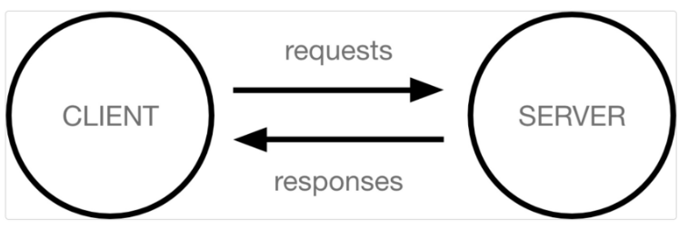
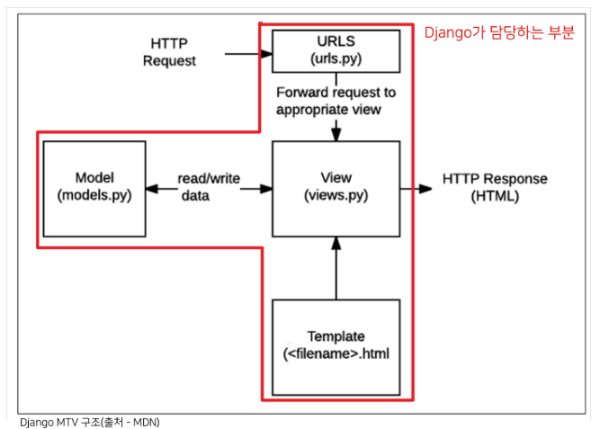
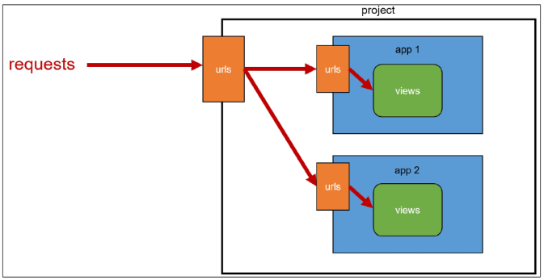

# Django 01
### 클라이언트와 서버
- 오늘날 대부분 웹서비스는 클라이언트-서버 구조 기반으로 동작
- 클라이언트와 서버는 하나의 컴퓨터
- 
- ex) 구글 홈페이지에 접속한다는 것?
- 전세계 어딘가 **구글 컴퓨터(서버)**에게 'Google홈페이지.html'파일을 요청하는 것
- 그러면 구글컴퓨터는 요청을 받고 해당 파일을 인터넷을 통해 **우리 컴퓨터(클라이언트)**에게 응답
- 전달받은 Google홈페이지.html 파일을 **웹브라우저(클라이언트)**가 우리가 볼 수 있도록 해석해주는 것
- **요청과 응답 !!!**


> 클라이언트
- 웹 사용자의 인터넷에 연결된 장치 (ex. wifi에 연결된 컴퓨터 또는 모바일)
- chrome 또는 firefox와 같은 웹 브라우저
- 서비스를 요청하는 주체

> 서버
- 웹페이지, 사이트 또는 앱을 저장하는 컴퓨터
- 클라이언트가 웹페이지에 접근하려할때 서버에서 클라이언트 컴퓨터로 웹 페이지 데이터를 응답해 사용자의 웹 브라우저에 표시됨
- 요청에 대해 서비스를 응답하는 주체

---

### Web browser와 Web page
> Web browser
- 웹 브라우저란 웹에서 페이지를 찾아 보여주고, 사용자가 하이퍼링크를 통해 다른 페이지로 이동할 수 있도록 하는 프로그램
- 웹 페이지 파일을 우리가 보는 화면으로 바꿔주는(**렌더링 rendering**) 프로그램

> Web page
- 웹에 있는 문서
- 우리가 보는 화면 각각 한장 한장
  - 1. 정적 웹페이지
  - 2. 동적 웹페이지

> 정적 웹페이지
- static web page
- 있는 그대로를 제공하는 것 (served as-is)
- 한번 작성된 html파일 내용이 변하지 않고 모든 사용자에게 동일한 모습으로 전달
- 서버에 미리 저장된 html 파일 그대로 전달된 웹페이지
- 같은 상황에서 사용자에게 동일 정보 표시

> 동적 웹페이지
- dynamic web page
- 사용자 요청에 따라 웹 페이지에 추가적인 수정이 되어 클라이언트에게 전달되는 웹페이지
- **웹 페이지의 내용을 바꿔주는 주체 == 서버**
  - 서버에서 동작하고있는 프로그램이 웹 페이지를 변경해줌
  - 이렇게 사용자 요청을 받아 적절한 응답을 만들어주는 프로그램을 쉽게 만들 수 있게 도와주는 프레임워크가 django
  - 다양한 서버 사이드 프로그래밍 언어 사용가능
  - 파일 처리하고 데베와의 상호작용이 이루어짐
  
---

  ### MTV Design Pattern
- 디자인 패턴이란 각기 다른 기능을 가진 다양한 응용 소프트웨어를 개발할때 공통적인 설계문제 존재, 이를 처리하는 해결책사이에도 공통점 존재
- 이런 유사점이 패턴
- 클라이언트-서버 구조
- **재사용** 가능한 해결책
- 시스템 디자인 중 발생하는 공통 문제들을 해결하는데 형식화된 좋은 관행
- 엔지니어들이 **일반화된 패턴으로 소프트웨어 개발을 할수있도록 한 규칙**

### Django's Design Pattern

- django에서도 디자인 패턴이 적용되어있음 -> MTV 패턴
- MTV 패턴은 MVC 디자인 패턴을 기반으로 조금 변형된 패턴

> MVC 소프트웨어 디자인 패턴
- Model - View - Controller
- 데이터 및 논리제어를 구현하는데 널리 사용되는 소프트웨어 디자인 패턴
- 하나의 큰 프로그램을 세가지 역할로 구분한 개발 방법론
  - Model : 데이터와 관련된 로직을 관리
  - View : 레이아웃과 화면을 처리
  - Controller : 명령을 model과 view 부분으로 연결
- 목적 - "관심사 분리"
- 더나은 업무 분리와 향상된 관리 제공
- 각 부분 독립적 개발 가능, 하나 수정하고싶을때 모두 건들지 않아도 됨
- == 개발 효율성 및 유지보수 용이
- == 다수 멤버로 개발하기 용이

> Django 에서의 디자인 패턴 ***
- MVC 패턴 기반 MTV 패턴 사용
- MVC :
  - Model (DB)
  - View  (HTML)
  - Controller  (DB, HTML)
- **MTV**:
  - **Model**
  - **Template**
  - **View**

> MTV 디자인 패턴
- Model
  - MVC 패턴에서 Model의 역할에 해당
  - 데이터와 관련된 로직을 관리
  - 응용프로그램의 데이터 구조를 정의하고 **데베**의 기록을 관리
- Template
  - **레이아웃과 화면**을 처리
  - 화면상의 사용자 인터페이스 구조와 레이아웃을 정의
  - MVC 패턴에서 View
- View
  - **Model & Template 관련 로직을 처리해서 응답을 반환**
  - 클라이언트 요청에 대해 처리를 분기하는 역할
  - 데이터가 필요하다면 model에 접근해서 데이터를 가져오고
  - 가져온 데이터를 template로 보내 화면을 구성하고
  - 구성된 화면을 응답으로 만들어 클라이언트에게 반환
  - MVC 패턴에서 Controller 역할에 해당
  
### MTV 구조 기억 !!!!!  *****


---


### 기본설정
- `$ python -m venv venv`
- `$ source venv/Scripts/activate`
- `$ pip install django==3.2`
- `$ pip list`
- `$ pip freeze > requirements.txt` : pip 목록
- 가상환경 만들 때
  - venv git에 올리지말기
  - `.gitinore` 생성해서 gitinore.io에서 사용언어 등록후 gitignore에 코드 저장하기
- 장고프로젝트 시작 명령어
  - `$ django-admin startproject config` : 폴더에 config 이름의 폴더가 만들어지고 다시 그안에 파일이 만들어짐
  - `$ django-admin startproject config .` : 현재폴더에서 config 파일만들기
- 장고 실행
- `$ python [manage.py](<http://manage.py/>) runserver`

### 프로젝트 생성

- `$ django-admin startproject firstpjt .`
  - project 이름에는 python이나 django에서 사용중인 키워드 및 ‘-’ 사용 불가<
  - ’.’을 붙이지 않는 경우 현재 디렉토리에 프로젝트 디렉토리를 새로 생성하고 됨

### 서버 실행

- `$ python [manage.py](<http://manage.py>) runserver`
> 프로젝트 구조
- __init__.py : python에게 이 디렉토리를 **하나의 python패키지로 다루도록** 지시
  - 별도로 추가 코드를 작성하지 않음

- asgi.py : Asynchronous Server Gateway Interface
  - Django 애플리케이션이 비동기식 웹서버와 연결 및 소통하는 것을 도움
  - 추후 배포시 사용

- **settings.py** : Django 프로젝트 설정을 관리

- **urls.py** : **사이트의 url**과 **적절한 views연결** 지정

- wsgi.py : Web Server Gateway Interface
  - Django 애플리케이션이 웹서버와 연결 및 소통하는 것을 도움
  - 추후 배포시 사용

- **manage.py** : Django 프로젝트와 다양한 방법으로 상호작용하는 커맨드라인 유틸리티

### Django Application
- 애플리케이션(앱) 생성
- 장고 프로젝트의 구성 요소 중 하나
- `$ python [manage.py](<http://manage.py>) startapp articles`
  - 일반적으로 애플리케이션 이름은 `복수형`으로 작성하는 것을 권장
  
> 애플리케이션 구조
- admin.py : 관리자용 페이지를 설정하는 곳
- apps.py : 앱의 정보가 작성된 곳, 별도로 추가 코드 작성 x
- models.py : 애플리케이션에서 사용하는 model을 정의하는 곳, mtv패턴의 m에해당
- tests.py : 프로젝트의 테스트 코드를 작성하는 곳
- views.py : view함수들이 정의되는 곳, mtv패턴의 v에 해당

> 애플리케이션 등록
- 프로젝트에 앱을 사용하기 위해선 반드시 INSTALLED_APPS (Django installation에 활성화된 모든 앱을 지정하는 문자열 목록) 리스트에 추가해야함!!
- ```python
  # settings.py

  # Application definition
  # 생성된 어플리케이션을 등록하는 곳
  INSTALLED_APPS = [
      # 유저가 생성한 어플리케이션
      'articles',

      # 중간
      # 서드파티 앱

      # 마지막
      # 장고 순수 앱
      'django.contrib.admin',
      'django.contrib.auth',
      'django.contrib.contenttypes',
      'django.contrib.sessions',
      'django.contrib.messages',
      'django.contrib.staticfiles',
  ]
  ```
> Project & Application
- Project
  - collection of apps
  - 프로젝트는 앱의 집합
  - 프로젝트에는 여러 앱이 포함될 수 있음
  - 앱은 여러 프로젝트에 있을 수 있음

- Application
  - 앱은 실제 요청을 처리하고 페이지를 보여주는 등의 역할 담당
  - 일반적으로 앱은 하나의 역할 및 기능 단위로 작성하는 것을 권장함
  - **반드시 생성후 등록!!!!!!!!!!!**


### 요청과 응답
- **URL -> VIEW -> TEMPLATE** 순의 작성 순서로 코드를 작성해보고 데이터 흐름 이해하기

> URLs

```python
# urls.py

from django.contrib import admin
from django.urls import path
from articles import views

urlpatterns = [
    path('admin/', admin.site.urls),
    # 사용자가 index라는 주소로 요청을 보낸다면
    # articles에 있는 views파일에서 index 함수를 실행할거야
    # 이 때 함수는 호출하는 것이 아님 ! 함수명만 작성
    path('index/', views.index),
    # 파이썬은 1급 객체이다.
    # 1. 함수를 변수에 저장할 수 있다.
    # 2. 함수를 리턴으로 전달할 수 있다.
    # 3. 함수를 인자로 전달할 수 있다.
]
```
> View

```python
# articles/views.py
from django.shortcuts import render

def index(request): # 항상 request인자 받아야 함
    return render(request, 'index.html') # 응답 - 보여준다 - template파일을
```

- HTTP 요청을 수신하고 HTTP 응답을 반환하는 함수 작성
- Template에게 HTTP 응답 서식을 맡김

> render()

- `render(request, template_name, context)`
- 주어진 탬플릿을 주어진 컨텍스트 데이터와 결합하고 렌더링된 텍스트와 함께 HttpResponse(응답) 객체를 반환하는 함수

1. request
  - 응답을 생성하는 데 사용되는 요청 객체
2. template_name
  - 템플릿의 전체 이름 또는 템플릿 이름의 경로
3. context
  - 템플릿에서 사용할 데이터(딕셔너리 타입으로 작성)

> Templates

```html
# <!-- articles/templates/index.html -->

<!DOCTYPE html>
<html lang="en">
<head>
    <meta charset="UTF-8">
    <meta http-equiv="X-UA-Compatible" content="IE=edge">
    <meta name="viewport" content="width=device-width, initial-scale=1.0">
    <title>Document</title>
</head>
<body>
    <h1>안녕하세요 여기는 장고입니다.</h1>
</body>
</html>
```

- 실제 내용을 보여주는데 사용되는 파일
- 파일의 구조나 레이아웃을 정의
- template 파일의 기본 경로
  - <mark>app 폴더 안의 templates폴더</mark>
  - app_name/templates/
  - <mark>탬플릿 폴더이름은 반드시 **templates**라고 지정해야 함

### 코드 작성 순서

- URLs >> View >> Template 순으로 작성
  
- `데이터의 흐름 순서`
  
  1. URL : `path(’index/’, view.index)`
    
  2. View
    
    ```python
    def index(request):
       # 딕셔너리
       context = {
           'wonil' : 'hello wonil!',
           'age' : 20,
           'lunch' : ['라멘', '갈치조림',]
    
       }
       return render(request, 'index.html', context)
    ```
    
  3. template : `articles/templates/index.html`
    

### 반환된 DB 정보를 웹에 출력하기

- views.py에서 db 정보를 같이 return한다면, html에서 db 정보 출력할 수 있음
  
  ```html
  <body>
      <h1>안녕하세요 여기는 장고입니다.</h1>
      <!-- Django Template Language(DTL)-->
      {{wonil}} <!-- DB에 작성된 정보를 반환해준다면 HTML에서 출력 가능 -->
      <p>{{age}}</p>
      <div>{{lunch}}</div>
  </body>
  ```
### 실습

```python
urlpatterns = [

    path('hello/', views.tomorrow),
]
```

```python
def tomorrow(request):
    wd = {0:'월', 1:'화', 2:'수', 3:'목', 4:'금', 5:'토', 6:'일'}
    x = dt.datetime.now()
    tmrw = wd[(x.weekday() + 1) % 7]
    result = {'day': tmrw}

    return render(request, 'tomorrow.html', result)
```

```html
<!DOCTYPE html>
<html lang="en">
<head>
    <meta charset="UTF-8">
    <meta http-equiv="X-UA-Compatible" content="IE=edge">
    <meta name="viewport" content="width=device-width, initial-scale=1.0">
    <title>Document</title>
</head>
<body>
    <p>내일은 {{day}}요일 입니다.</p>
</body>
</html>
```

### [참고] 추가설정

- language_code
  
  - 모든 사용자에게 제공되는 번역을 결정
  - 이 설정이 적용되려면 USE_I18N이 활성화(True)되어 있어야 함
  - 영어가 사료가 많아서 영어로 하기
  
  ```python
  # setting.py
  LANGUAGE_CODE = 'ko-kr'
  TIME_ZONE = 'Asia/Seoul'
  ```
  
- Time zone
  
  - 데이터 베이스 연결의 시간대를 나타내는 문자열 지정
  - USE_TZ가 True이고 이 옵션이 설정된 경우 데이터 베이스에서 날짜 시간을 읽으면,. UTC 대신 새로 설정한 시간대의 인식 날짜&시간이 반환됨
  - USE_TZ이 False인 상태로 이 값을 설정하는 것은 error가 발생함으로 주의
- USE_I18N
  
  - Django의 번역 시스템을 활성화해야 하는 지 여부를 지정
- USE_L10N
  
  - 데이터의 지역화된 형식(localized formatting)을 기본적으로 활성화할지 여부를 지정
  - True일 경우, Django는 현재 locale의 형식을 사용하여 숫자와 날짜를 표시
- USE_TZ
  
  - datetimes가 기본적으로 시간대를 인식하는지 여부를 지정
  - True일 경우 Django는 내부적으로 시간대 인식 날짜/시간을 사용

---

### Django Template


- 데이터 표현을 제어하는 도구이자 표현에 관련된 로직
- HTML 정적부분과 동적 컨텐츠 삽입

### Django Template System

- 데이터 표현을 제어하는 도구이자 표현에 관련된 로직을 담당

### Django Template Language(DTL)

- Django template에서 사용하는 built-in template system
- 조건, 반복, 변수 치환, 필터 등의 기능을 제공
  - python처럼 일부 프로그래밍 구조를 사용할 수 있지만, `python 코드로 실행되는 것은 아님`
- 프레젠테이션을 표현하기 위한 것임을 명심할 것

### DTL Syntax

1. Variable
2. Filters
3. Tags
4. Comments

### 1. Variable

- `{{varible}}` : 주로 값을 표현할 때 사용
- 변수명은 영어, 숫자, 밑줄 조합.( 밑줄 시작은 안됨)
  - 공백이나 구두점 문자 또한 사용할 수 없음
- doc(.)를 사용하여 변수 속성에 접근할 수 있음
- render()의 세번째 인자로 {’key’:value}와 같이 딕셔너리 형태로 넘겨주며, 여기서 정의한 key에 해당하는 문자열이 template에서 사용가능한 변수명이 된다.

### 2. Filters

- `{{variable|filter}}`
- 표시할 변수를 수정할 때 사용
- 예시>
  - name 변수를 모두 소문자로 출력
  - `{{name|lower}}`
- docs 참고
- 하지만 html 로딩 과정에서 시간이 오래걸릴 수 있기 때문에 지양하기

### 3. Tags(중요)

- `` : tag를 사용할 때 사용( `{{variable}}` 과 구분하기)
- 출력 텍스트를 만들거나, 반복 또는 논리를 수행하여 제어 흐름을 만드는 등 변수보다 복잡한 일들을 수행
- 일부 태그는 시작과 종료 태그가 필요
- `` , `` 등 들여쓰기는 해야하는 것들은 종료 태그 필요

### 4. comments

- `{# #}` : Django template에서 라인의 주석을 표현하기 위해 사용. 한 줄 주석
  
  - `{#  text  #}`
- 여러 줄 주석
  
  ```html
  
      여러 줄
      주석
  
  ```
  

### 실습 DTL Syntax - ‘Filters’

```python
from articles import views

urlpatterns = [
    path('dinner/', views.dinner),
]
```

```python
from django.shortcuts import render
import random

def dinner(request):
    foods = ['족발', '햄버거', '치킨', '초밥',]
    pick = random.choice(foods)
    context = {
        'pick': pick,
        'foods' : foods,
    }
    return render(request, 'dinner.html', context)
```

```html
<!DOCTYPE html>
<html lang="en">
<head>
    <meta charset="UTF-8">
    <meta http-equiv="X-UA-Compatible" content="IE=edge">
    <meta name="viewport" content="width=device-width, initial-scale=1.0">
    <title>Document</title>
</head>
<body>
    <p>{{pick}}은 {{pick|length}} 글자</p>
    <p>{{foods|join:", "}}</p>

    <ol>
        
            <li>{{food}}</li>
        
    </ol>

    <a href="/index">뒤로</a>

</body>
</html>
```

### Template inheritance

### 템플릿 상속

- 탬플릿 상속은 기본적으로 **코드의 재사용성에 초점**을 맞춤
- 사이트의 모든 공통 요소를 포함하고 하위 탬플릿이 재정의(override)할 수 있는 블록을 정의하는 기본 ‘skeleton’ 템플릿

### 템플릿 상속에 관련된 태그

- ``
  
  - **자식 템플릿이** 부모 템플릿을 확장한다는 것을 알림
  - 반드시 템플릿 최상단에 작성되어야 함(즉, 2 개 이상 사용할 수 없음)
- ``
  
  - **부모 템플릿이** 하위 탬플릿에서 재지정(overridden)할 수 있는 블록을 정의
  - 즉, 하위 템플릿이 채울 수 있는 공간
  - 가독성을 높이기 위해 선택적으로 endblock 태그에 이름을 지정
  
  ```html
  <!-- 두 코드는 같음 -->
  
  
  
  
  
  ```
  

### skeleton 템플릿 작성

- base.html
  
  ```html
  <!DOCTYPE html>
  <html lang="en">
  <head>
      <meta charset="UTF-8">
      <meta http-equiv="X-UA-Compatible" content="IE=edge">
      <meta name="viewport" content="width=device-width, initial-scale=1.0">
      <title>
          
          
      </title>
      <link href="<https://cdn.jsdelivr.net/npm/bootstrap@5.2.0/dist/css/bootstrap.min.css>" rel="stylesheet" integrity="sha384-gH2yIJqKdNHPEq0n4Mqa/HGKIhSkIHeL5AyhkYV8i59U5AR6csBvApHHNl/vI1Bx" crossorigin="anonymous">
  </head>
  <body>
      <h1>이 페이지는 base.html입니다.</h1>
      
      
      <h1>이 곳은 endblock 아래 입니다.</h1>
      <script src="<https://cdn.jsdelivr.net/npm/bootstrap@5.2.0/dist/js/bootstrap.bundle.min.js>" integrity="sha384-A3rJD856KowSb7dwlZdYEkO39Gagi7vIsF0jrRAoQmDKKtQBHUuLZ9AsSv4jD4Xa" crossorigin="anonymous"></script>
  </body>
  </html>
  ```
  
- dinner.html
  
  ```html
  
  
  
  이것은 dinner.html 파일에서 작성된 title입니다.
  
  
  
  
  <button type="button" class="btn btn-primary">Primary</button>
  
  <p>{{pick}}은 {{pick|length}} 글자</p>
  <p>{{foods|join:", "}}</p>
  
  <ol>
      
          <li>{{food}}</li>
      
  </ol>
  
  <a href="/index">뒤로</a>
  
  
  ```
  
- tomorrow.html
  
  ```html
  
  
  
      <p class = 'text-white'>내일은 {{day}}요일 입니다.</p>
      <button type="button" class="btn btn-primary">Primary</button>
  
  ```

## Variable Routing
- url 주소를 변수로 사용하는 것
- url 일부를 변수로 지정하여 view 함수의 인자로 넘길수있음
- 변수는 <>에 정의, view함수 인자로 할당
- 기본타입은 str
- 5가지 타입으로 명시 가능
- ex) path('hello/\<name>/\<int:age>/\', views.hello, name='hello'), 
- query string parameter -> 사용자의 입력 필요
- variable routing -> 주소이동할때 path의 일부분을 변수로 사용/ 사용자입력 x
- path('hello/\<name>/', views.hello)
- hello/ssafy/ -> name에 할당
- \<name> 뿐아니라 \<age>등 추가 인자 받기 가능! 
- Variable routing 사용시 주의점!
	- 1. 변수명과 views.py 함수 매개변수의 이름이 같아야한다!!
	- 2. variable routing이 설정되면 반드시 매개변수로 받아야한다!!
	- 3. variable routing이 적용된 주소는 반드시 값을 넣어야한다!!

```python
# urls.py
from django.urls import path
from . import views


app_name = 'articles'
urlpatterns = [
    path('lotto/', views.lotto, name='lotto'),  # 해당 경로의 이름을 lotto라고 정의
    path('index/',  views.index, name='index'),
    path('hello/<name>/', views.hello, name='hello'),   # variable routing

]
```
```python
# views.py

# Create your views here.
from this import d
from django.shortcuts import render
import random

def lotto(request):
    lotto_numbers = random.sample(range(1,46), 6)
    context = {
        'lotto_numbers' : lotto_numbers,
    }
    return render(request, 'articles/lotto.html', context)

def index(request):
    return render(request, 'articles/index.html')


def hello(request, name):
    print(name)
    context = {
        'name':name,
    }
    return render(request, 'articles/hello.html', context)
```
```html
# hello.html



<p>Variable Routing 예제</p>
<h2>안녕하세요!! {{ name }}!!</h2>


```
```python
# age 인자 추가로 받기 가능!!
# urls.py
from django.urls import path
from . import views


app_name = 'articles'
urlpatterns = [
    path('lotto/', views.lotto, name='lotto'),  # 해당 경로의 이름을 lotto라고 정의
    path('index/',  views.index, name='index'),
    path('hello/<name>/<age>/', views.hello, name='hello'),   # variable routing

]
```
```python
# views.py

from this import d
from django.shortcuts import render
import random


# Create your views here.
def lotto(request):
    lotto_numbers = random.sample(range(1,46), 6)
    context = {
        'lotto_numbers' : lotto_numbers,
    }
    return render(request, 'articles/lotto.html', context)

def index(request):
    return render(request, 'articles/index.html')


def hello(request, name, age):
    print(type(name), type(age))    # 디버깅용
    context = {
        'name':name,
        'age':age,
    }
    return render(request, 'articles/hello.html', context)
```
```html
# hello.html




<p>Variable Routing 예제</p>
<h2>안녕하세요!! {{ name }} ({{ age }})!!</h2>


```
---

## APP URL Mapping



### 추가 템플릿 경로 추가

- base.html의 위치를 앱 안의 template 디렉토리가 아닌 프로젝트 최상단의 templates 디렉토리에 안에 위치시키기

```python
# settings.py

TEMPLATES = [
    {
        'BACKEND': 'django.template.backends.django.DjangoTemplates',
        'DIRS': [BASE_DIR / 'templates'],
        'APP_DIRS': True,
        'OPTIONS': {
            'context_processors': [
                'django.template.context_processors.debug',
                'django.template.context_processors.request',
                'django.contrib.auth.context_processors.auth',
                'django.contrib.messages.context_processors.messages',
            ],
        },
    },
]
```

- **BASE_DIR**
  
  ```python
  # settings.py
  
  BASE_DIR = path(__file__}.resolve().parent.parent
  ```
  
  - settings.py에서 특정 경로를 절대 경로로 편하게 작성할 수 있도록 Django에서 미리 지정해둔 경로 값
  - ‘객체 지향 파일 시스템 경로’
  - 운영체제 별로 파일 경로 표기법이 다르기 때문에 어떤 운영체제에서 실행되더라도 각 운영체제 표기법에 맞기 해석될 수 있도록 하기 위해 사용

# 6. Sending and Retrieving form data

## Sending and Retrieving form data

- ‘데이터를 보내고 가져오기'

## 1. sending form data(client)

### HTML < form > element

- 데이터가 전송되는 방법을 정의
- 웹에서 사용자 정보를 입력하는 여러 방식(text, button, submit 등)을 제공하고, **사용자로부터 할당된 데이터를 서버로 전송하는역할을 담당**
- 핵심속성
  1. action
  2. method

### HTML form’s attributes

1. action
   - 입력 데이터가 전송될 url을 지정
   - 데이터를 어디로 보낼 것인지 지정하는 것이며, 이 값은 반드시 유효한 url이어야 함
   - 만약 이 속성을 지정하지 않으면 데이터는 현재 form이 있는 페이지의 url로 보내짐
2. method
   - 데이터를 어떻게 보낼 것인지 정의
   - 입력 데이터의 HTTP request methods를 지정
   - HTML form 데이터 전송방식
     1. GET
     2. POST

### HTML \<form> element 작성

```python
# urls.py

urlpatterns = [
    ...,
    path('throw/', views/throw),
]
```

```python
# articles/views.py

def throw(request):
    return render(request, 'throw.html')
```

```html
<!-- articles/templates/throw.html -->




    <h1>Throw</h1>
    <form action="#" method = "#">

    </form>

```

- 사용자로부터 데이터를 입력받기 위해 사용
- ‘type’ 속성에 따라 동작 방식이 달라진다.
- input요소의 동작방식은 type 특성에 따라 현격히 달라지므로 각각의 type은 별도로 MDN문서에서 참고하여 사용하도록 함
- default : ‘text’
- 핵심 속성
  - name

### HTML input’s attribute

- name
  - GET/POST 방식으로 서버에 전달하는 파라미터(name-key : value-value)로 매핑하는 것
  - form을 통해 데이터를 제출할 때 name 속성에 설정된 값을 서버로 전송
  - 서버는 name속성에 설정된 값을 통해 사용자가 입력한 데이터 값에 접근
  - GET방식에서 데이터 전달형식
    - `'?key=value&key=value/'`

### HTML \<input> element 작성

```html
<!-- articles/templates/throw.html -->




    <h1>Throw</h1>
    <form action="/catch/" method = "GET"> # action을 통해 입력받은 데이터 서버로 전송
        <label for="message">Throw</label>
        <input type="text" id="message" name='message'>
        <input type="submit">
    </form>

```

### HTML request methods

- HTTP
  - html문서와 같은 리소스(데이터, 자원)들을 가져올 수 있도록 해주는 프로토콜(규칙, 규약)
- 웹에서 이루어지는 모든 데이터 교환의 기초
- HTTP는 주어진 리소스가 수행할 원하는 작업을 나타내는 request methods를 정의
- 자원에 대한 행위(수행하고자 하는 동작)을 정의
- 주어진 리소스에 수행하길 원하는 행동을나타냄
- HTTP Method
  - GET, POST, PUT, DELETE

### GET

- 서버로부터 정보를 조회하는데 사용 : 서버에 리소스를 요청하기 위해 사용
- 데이터를 가져올 때만 사용해야 함
- 데이터를 서버로 전송할 때 Query String Parameters를 통해 전송
  - 데이터는 URL에 포함되어 서버로 보내짐

### GET 메서드 작성

- GET과 get 모두 대소문자 관계없이 동일하게 동작하지만, 명시적 표현을 위해 대문자 사용 권장

### Query String parameters(Query String)

- 사용자가 입력 데이터를 전달하는 방법 중 하나
- url 주소에 데이터를 파라미터를 통해 넘기는 것
- 앰퍼센트(&)로 연결된 key=value쌍으로 구성
- 기본url과 물음표(?)로 구분하며, 물음표로 Q.S 시작을 알림
  - 예시 : `http://host:port/path?key=value&key=value`

---

## 2. Retrieving the data(server)

- 데이터 가져오기(검색하기)
- key-value 쌍의 목록과 같은 데이터를 수신

### catch 작성

```python
# url.py
urlpatterns = [
    ...
    path('catch/', views.catch),
]
```

```python
# articles/views.py

def catch(request):
  pass
  return render(request, 'name.html')
```

```html
<!-- articles/templates/catch.html -->



    <h1>Catch</h1>
    <h2>여기서 데이터를 받았어</h2>
    <a href="/throw/">다시 던지러</a>

```

### 데이터 가져오기

- catch page url : `http://127.0.0.1:8000/catch/?message=데이터`

- GET method로 보내고 있기 때문에 데이터를 서버로 전송할 때 **Query String Parameters를 통해 전송**

- 즉, 데이터는 url에 포함되어 서버로 보내짐

- 모든 요청 데이터는 view함수의 첫번째 인자 request에 담겨 있음
  
  ```python
  # views.py
  from django.shortcuts import render
  
  def catch(request):
      # print(request.GET) # <QueryDict: {'message': ['데이터']}>
      # print(request.GET.get('message')) # '데이터'
      # raise # 에러 강제시켜서 페이지 하단 확인
  
      message = request.GET.get('message')
      context = {
          'message' : message
      }
  
      return render(request, 'catch.html', context)
  ```
  
  ```html
  <!-- articles/templates/catch.html -->
  
  
  
      <h1>Catch</h1>
      <h2>여기서 {{message}}를 받았어</h2>
      <a href="/throw/" class="href">다시 던지러</a>
  
  ```

### request and response objects

- 요청과 응답 객체 흐름
  1. 페이지가 요청되면 Django는 요청에 대한 메타 데이터를 포함하는 HttpRequest object를 생성
  2. 해당하는 적절한 view함수를 로드하고 httpRequest를 첫번째 인자로 전달
  3. view 함수는 HttpResponse object를 반환

### 참조

- **trailing url slashes**
  
  - Django는 url 끝에 /가 없다면 자동으로 붙여주는 것이 기본 설정
    - 모든 주소가 /로 끝나도록 구성 되어있음
  - 문제 : [foo.com/bar와](http://foo.com/bar와) [foo.com/bar/](http://foo.com/bar/를)는 서로 다른 url이다.
    - 이를 위해 Django에서는 **url 정규화**로 해결

- **url 정규화**
  
  - 정규 url을 명시하는 것
  - 복수의 페이지에서 같은 콘텐츠가 존재하는 것을 방지하기 위함
  - Django에서 trailing slash가 없는 요청에 대해 자동으로 slash를 추가하여 통합된 하나의 콘텐츠를 볼 수 있도록 함.