# Django 02

### Namespace
- 두번째 application 생성시 문제점
  - articles app index 페이지에 작성한 두번째 앱 index로 이동하는 하이퍼링크를 클릭시 현재 페이지로 다시 이동 (URL namespace)
  - pages app의 index url로 직접 이동해도 articles app의 index 페이지가 출력됨 (Template namespace)
> URL Namespace
- URL namespace를 사용하면 서로 다른 앱에서 동일한 URL 이름을 사용하는 경우에도 이름이 지정된 URL을 고유하게 사용가능
- app_name attribute를 작성해 URL namespace를 설정
- ```python
  # articles/urls.py
  app_name = 'articles'
  urlpatterns = [

  ]

  # pages/urls.py
  app_name = 'pages'
  urlpatterns = [

  ]
  ```
- 
- **appname:urlname**
- NoReverseMatch : URL 태그만 다시 확인하면됨! (app_name 지정한 이후에는 url태그에서 반드시 app_name:url_name 형태로만 사용해야함!)

> Template Namespace
- django는 기본적으로 app_name/templates (기본경로- 바꿀 수 없음!) 경로의 templates 파일들만 찾을 수 있으며, settings.py ISTALLED_APPS에 작성한 순서로 template을 검색후 렌더링
- articles/templates/**index.html**
- pages/templates/**index.html**
- INSTALLED_APPS에 articles 앱이 위에 작성되어있으므로 articles앱의 index.html을 반환함
- articles/templates/<물리적인 이름공간 생성 - articles>/**index.html**
- pages/templates/<물리적인 이름공간 생성 - pages>/**index.html**
- Django templates의 기본경로 자체를 변경할 수는 없기 때문에 물리적으로 이름공간을 만드는것!!
- 반드시 Template namespace를 고려해야할까?
  - 단일 앱으로 이뤄진 프로젝트라면 상관없음
  - 여러앱일때도 템플릿 파일이름이 겹치지 않게 하면되지만, 앱이 많아지면 같은 이름 템플릿 파일이 존재하기 마련


### Django Model
> Database
- 체계화된 데이터의 모임
- 검색 및 구조화 같은 작업을 보다 쉽게하기위해 조직화된 데이터를 수집하는 저장시스템
- 기본구조
  - 1. 스키마 (Schema)
    - 뼈대 (structure)
    - 데이터베이스에서 자료의 구조, 표현방법, 관계 등을 정의한 구조
    - 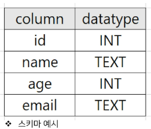

  - 2. 테이블 (Table)
    - 필드와 레코드를 사용해 조직된 데이터 요소들의 집합
    - 관계 (relation)라고도 부름
    - 1) 필드 (field) - 속성, 컬럼 (column), 각 필드에는 고유한 데이터 형식이 지정됨 (INT, TEXT 등)
    - 2) 레코드 (record) - 튜플, 행 (row) , 테이블의 데이터는 레코드에 저장됨

> PK (Primary Key)
- 기본키
- 각 레코드의 고유한 값(식별자로 사용)
- 기술적으로 다른 항목과 절대로 중복될 수 없는 단일값 (unique)
- 데이터베이스 관리 및 테이블간 관계 설정시 주요하게 활용됨
- ex) 주민등록번호


> 쿼리 (Query)
- 데이터를 조회하기 위한 명령어
- 조건에 맞는 데이터를 추출하거나 조작하는 명령어 (주로 테이블형 자료구조에서)
- "Query를 날린다." == "데이터베이스를 조작한다."

### Model 
- django는 Model을 통해 데이터에 접속하고 관리
- 단일한 데이터에 대한 정보를 가짐
- 사용하는 데이터들의 필수적 필드들과 동작들을 포함
- 저장된 데이터베이스의 구조 (layout)
- 일반적으로 각각의 모델은 하나의 데이터베이스 테이블에 매핑 (mapping)
  - 매핑 : 하나의값을 다른값으로 대응
  - 모델 클래스 1개 == 데이터베이스 테이블 1개
- Model != Database
- 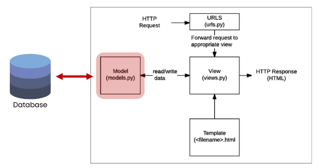

> Model 작성하기
- 새 프로젝트(crud), 앱(articles) 작성 및 앱 등록
- ```python
  $ django-admin startproject crud .
  $ python manage.py startapp articles
  # settings.py
  INSTALLED_APPS = [
    'articles',
    ...
  ]
  ```
- models.py 작성
- 모델 클래스 작성하는 것은 데이터베이스 테이블의 스키마를 정의하는 것!
- 모델 클래스 == 테이블 스키마
- 1. 클래스 변수(속성)명
  - DB 필드의 이름
- 2. 클래스 변수 값 (models 모듈의 Field클래스) 
  - DB 필드의 데이터 타입
- ```python
  class Article(models.Model):
      title = models.CharField(max_length=10)    # 길이제한 있는 텍스트 필드
      content = models.TextField()  # 길이제한 없는 텍스트 필드
  ```
- 각 모델은 **django.models.Model 클래스의 서브 클래스**
- 즉, 각 모델은 **django.db.models 모듈의 Model 클래스를 상속**받아 구성됨
- 클래스 상속 기반 형태의 Django 프레임 워크 개발
    - 프레임 워크에서는 잘 만들어진 도구를 가져다가 잘 쓰는것
- models 모듈을 통해 어떠한 타입의 DB필드 (컬럼)을 정의할 것인지 정의
- 클래스 변수 title과 content는 DB 필드를 나타냄
- Article에는 어떤 데이터 구조가 필요한지 정의

> Django Model Field
- 테이블 필드(컬럼)에 저장할 데이터 유형 (INT, TEXT등)을 정의
- DataField(), CharField(), IntegerField() 등
- CharField(max_length=None, **options)
    - **길이의 제한이 있는** 문자열
    - **max_length**
        - 필드의 최대길이 (문자)
        - CharField의 **필수인자**
        - 데이터베이스와 django의 유효성검사에서 활용됨
- TextField(**options)
    - 글자의 수가 많을 때 사용 (db에 따라 max 글자수는 다름 - django는 기본적으로 sqlite사용)
    - max_length 옵션 작성시 사용자 입력 단계에서는 반영되지만, 모델과 데이터베이스 단계에는 적용되지 않음(CharField를 사용해야함)
    - 실제로 저장될 때 길이에 대한 유효성을 검증하지 않음

> 데이터베이스 스키마
- models.py 에서 class를 이용해 데이터베이스 스키마를 설계한 것
- 이제 데이터 베이스에 테이블을 생성하기위한 설계도 작성이 필요함

### Migrations
- 모델에 대한 청사진(blueprint)를 만들고 이를 통해 테이블을 생성하는 일련의 과정
- django가 모델에 생긴 변화 (필드추가, 수정 등)를 실제 db에 반영하는 방법

> Migrations 관련 주요 명령어
- <mark>makemigrations</mark>
    - $ python manage.py makemigrations
    - '테이블을 만들기 위한 설계도를 생성하는 것'
    - 모델을 작성 혹은 변경한 것에 기반한 새로운 migration(설계도, 청사진 이하 마이그레이션)을 만들때 사용
    - 설계도 생성
    - 명령어 실행 후 migrations/0001_initial.py가 생성된 것을 확인
- <mark>migrate</mark>
    - $ python manage.py migrate
    - makemigrations로 만든 설계도를 실제 db.sqlite3 DB파일에 반영하는 과정
    - 결과적으로 모델 변경사항과 DB의 스키마가 동기화
    - '모델과 DB의 동기화'
    - 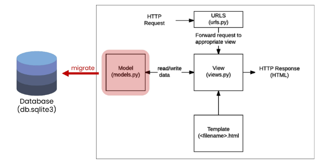

> Migrations 기타 명령어
- 1. <mark>showmigrations</mark>
    - $ python manage.py showmigrations
    - migrations 파일들이 migrate 됐는지 안됐는지 여부를 확인하는 용도
    - '[x]' 표시가 있으면 migrate가 완료되었음을 의미

- 2. <mark>sqlmigrate</mark>
    - $ python manage.py sqlmigrate articles 0001
    - 해당 migrations 파일이 SQL 문으로 어떻게 해석될 지 미리 확인 할 수 있음    

> 그런데 설계도는 어떻게, 누가 해석할까?
- makemigrations로 인해 만들어진 설계도는 파이썬으로 작성되어있음
- 그런데 SQL만 알아 들을 수 있다는 DB가 어떻게 이 설계도를 이해하고 동기화를 이룰 수 있을까?
- 바로 이 과정에서 중간에 해석을 담당하는 것이 ORM

### ORM
- Object-Relational-Mapping
- 객체지향 프로그래밍 언어를 사용하여 호환되지않는 유형의 시스템간에 (django <-> SQL) 데이터를 변환하는 프로그래밍 기술
- 객체 지향 프로그래밍에서 데이터베이스를 연동할 때, 데이터베이스와 객체 지향 프로그래밍 언어간의 호환되지않는 데이터를 변환하는 프로그래밍 기법
- Django는 내장 Django ORM을 사용
- 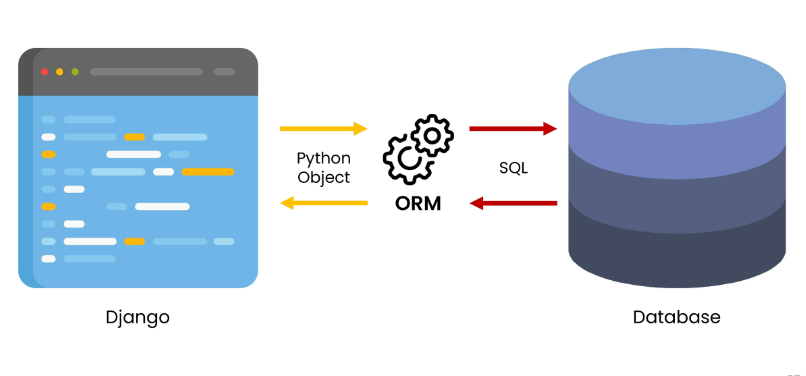

> ORM 장단점
- 장점:
    - SQL을 잘 알지못해도 객체지향 언어로 DB 조작이 가능
    - 객체지향적 접근으로 인한 높은 생산성
- 단점:
    - ORM만으로 완전한 서비스를 구현하기 어려운 경우가 있음

> ORM 사용 이유
- "생산성"
- DB를 객체로 조작하기 위해 ORM 사용

### 추가 필드 정의
> Model 변경사항 반영하기
- models.py에 변경사항이 생겼을때의 migration과정?
- 추가 모델 필드 작성 후 다시한번 makemigrations 진행
- ```python
  # articles/models.py
  class Article(models.Model):
    title = models.CharField(max_length=10)
    content = models.TextField()
    created_at = models.DateTimeField(auto_now_add=True)
    updated_at = models.DateTimeField(auto_now=True)
  ````
- $ python manage.py makemigrations
- 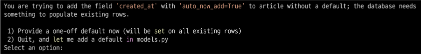
- 기존 id, title, content 컬럼을 가진 테이블에 2개의 컬럼이 추가되는 상황
- django 입장에서는 이미 존재하는 테이블에 새로운 컬럼이 추가되는 요구 사항을 받았는데, 이 컬럼들은 기본적으로 빈 값으로 추가될 수 없음
- 그래서 django는 우리에게 추가되는 컬럼에 대한 기본값을 설정해야하니 어떻게 어떤값을 설정할 것인지를 물어보는 과정을 진행
- 보기 1번 : 다음 화면으로 넘어가서 새 컬럼의 기본값을 직접 입력하는 방법
    - django가 알아서 설정
- 보기 2번 : 현재 과정에서 나가고 모델 필드에 default 속성을 직접 작성하는 방법
    - 나가서 직접 수정 후 다시 migrate로 DB에 저장
- 1을 입력 후 enter (created_at 필드에 대한 default 값 설정)
- 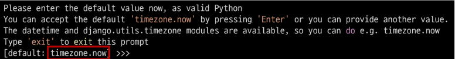
- 다음 화면에서 아무것도 입력하지 않고 enter입력하면 django에서 기본적으로 파이썬의 timezone 모듈의 now 메서드 반환값을 기본값으로 사용하도록 해줌
- 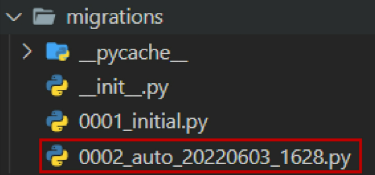
- 새로운 설계도 (마이그레이션 파일)가 만들어진 것을 확인
- 새로운 설계도를 생성했기 때문에 DB와 동기화를 진행해야 함 (아직 DB에는 변경사항이 반영되지 않았기 때문)
- $ python manage.py migrate

> 반드시 기억해야 할 migration 3단계
1. models.py에서 변경사항이 발생하면
2. migrations 파일 생성 (설계도 생성) - makemigrations
3. DB 반영 (모델과 DB의 동기화) - migrate

> **DateTimeField()**
- python의 datetime.datetime 인스턴스로 표시되는 날짜 및 시간을 값으로 사용하는 필드
- DateField를 상속받는 클래스
- 선택인자
    - 1) <mark>auto_now_add</mark>
        - 최초 생성 일자 (useful for creation of timestamps)
        - django ORM이 최초 insert (테이블에 데이터 입력)시에만 현재 날짜와 시간으로 갱신(테이블에 어떤값을 최초로 넣을때)
    - 2) <mark>auto_now</mark>
        - 최초 수정 일자 (useful for "last-modified" timestamps)
        - django ORM이 save를 할때마다 현재 날짜와 시간으로 갱신
> Model 정리
- 웹 애플리케이션의 데이터를 **구조화**하고 **조작**하기위한 도구

### QuerySet API
> 외부 라이브러리 설치 및 설정
- $ pip install ipython
- $ pip install django-extensions
- $ pip freeze > requirements.txt
- ```python
  # settings.py
  INSTALLED_APPS = [
    'articles',
    'django_extensions',
  ]
  ```
- IPython
  - 파이썬 기본 쉘보다 더 강력한 파이썬 쉘
  - django-extensions
- django-extensions
  - django 확장 프로그램 모음
  - shell_plus, graph model등 다양한 확장 기능 제공
- Shell
  - 운영체제 상에서 다양한 기능과 서비스를 구현하는 인터페이스를 제공하는 프로그램
  - 셸(껍데기)은 사용자와 운영체제 내부사이의 인터페이스를 감싸는 층이기 때문에 그러한 이름이 붙음
  - "사용자 <-> 셸 <-> 운영체제"
- Pytho Shell
  - 파이썬 코드를 실행해주는 인터프리터
  - 인터프리터 : 코드를 한줄씩 읽어내려가며 실행하는 프로그램
  - 인터렉티브 혹은 대화형 shell이라고 부름
  - python 명령어를 실행하여 그 결과를 바로 제공
  - ```python
    # git bash
    $ python -i
    ```
- Django shell
  - ORM 관련 구문 연습을 위해 파이썬 쉘 환경을 사용
  - 다만 일반 파이썬 쉘을 통해서는 장고 프로젝트 환경에 영향을 줄 수 없기 때문에 Django 환경 안에서 진행할 수 있는 Django 쉘을 사용
  - 원래는 $ python manage.py shell 명령어를 통해 django shell을 사용하지만
  - django-extension이 제공하는 더 강력한 shell_plus로 진행
    - $ python manage.py shell_plus
    - 자동 import !!!
    - 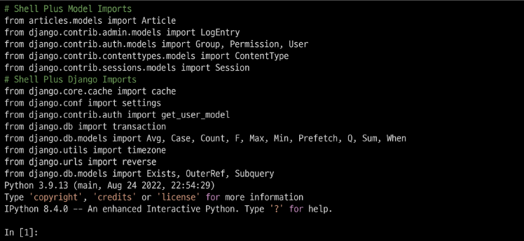
    - 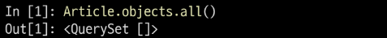

> Database API
- Django가 기본적으로 ORM을 제공함에 따른 것으로 DB를 편하게 조작할 수 있도록 도움
- Model을 만들면 django는 객체들을 만들고 읽고 수정하고 지울 수 있는 DB API를 자동으로 만듦
- 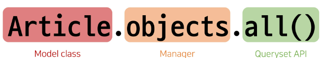

> "Objects" manager
- django 모델이 데이터베이스 쿼리 작업을 가능하게하는 인터페이스
- django는 기본적으로 모든 django 모델 클래스에 대해 objects라는 manager 객체를 자동으로 추가함
- 이 manager(objects)를 통해 특정 데이터를 조작(메서드)할 수 있음
- "DB를 Python class로 조작할 수 있도록 여러 메서드를 제공하는 manager"

> Query
- 데이터 베이스에 특정한 데이터를 보여달라는 요청
- "쿼리문을 작성한다."
  - 원하는 데이터를 얻기위해 데이터베이스에 요청을 보낼 코드를 작성한다.
- 이때 파이썬으로 작성한 코드가 ORM에 의해 SQL로 변환되어 데이터베이스에 전달되며, 데이터베이스의 응답데이터를 ORM이 **QuerySet**이라는 자료형태로 변환하여 우리에게 전달

> <mark>QuerySet</mark>
- DB 데이터를 담고있는 유사리스트!!!
- But, [-1] 등의 음수 인덱스는 사용 불가 !
- 데이터베이스에게서 전달받은 객체 목록(데이터 모음)
  - 순회 가능 데이터로써 1개이상의 데이터를 불러와 사용할 수 있음
- Django ORM을 통해 만들어진 자료형이며, **필터**를 걸거나 **정렬**등을 수행할 수 있음
- "objects" manager를 사용하여 복수의 데이터를 가져오는 queryset method를 사용할때 반환되는 객체
- 단 데이터베이스가 **단일한 객체를 반환**할때는 **QuerySet이 아닌 모델(Class)의 인스턴스**로 반환됨

> QuerySet API
- "QuerySet과 상호작용하기 위해 사용하는 도구 (메서드, 연산자 등)"
- 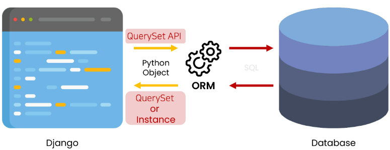

### QuerySet API 익히기
> CRUD
- Create / Read / Update / Delete
- 생성 / 조회 / 수정 / 삭제
- 대부분의 컴퓨터 소프트웨어가 가지는 기본적인 데이터 처리기능 4가지를 묶어서 일컫는 말

> CREATE
- 데이터 객체를 만드는 3가지 방법
- 1. 첫번째 방법
  - article = Article()
    - 클래스를 통한 인스턴스 생성
  - article.title
    - 클래스 변수명과 같은 이름의 인스턴스 변수를 생성 후 값 할당
  - article.save()
    - 인스턴스로 save 메서드 호출
  - 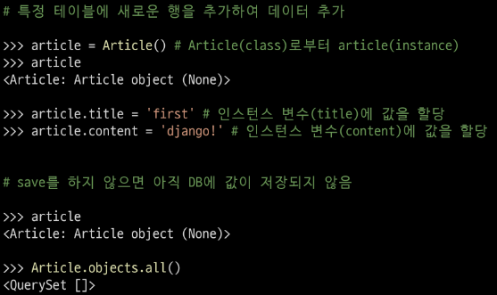
  - 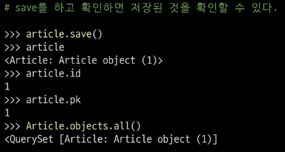
  - 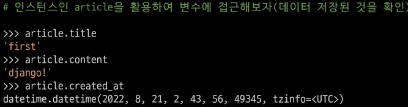
- 2. 두번째 방법
  - 인스턴스 생성 시 초기값을 함께 작성하여 생성
  - 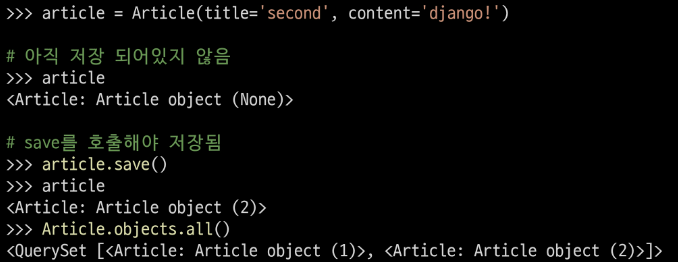
- 3. 세번째 방법
  - QuerySet API중 create() 메서드 활용
  - 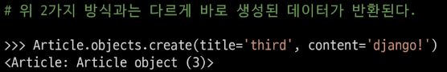
- .save()
  - "saving object"
  - 객체를 데이터베이스에 저장함
  - 데이터 생성시 save를 호출하기전에는 객체의 id값은 None
    - id값은 django가 아니라 데이터베이스에서 계산되기 때문
  - 단순히 모델 클래스를 통해 인스턴스를 생성하는 것은 DB에 영향을 미치지 않기 때문에 반드시 save를 호출해야 테이블에 레코드가 생성됨

> READ
- QuerySet API method를 사용해 데이터를 다양하게 조회하기
- QuerySet API method는 크게 2가지로 분류됨
  - 1. Methods that "return new querysets"
  - 2. Methods that "do not return querysets"
- all ()
  - 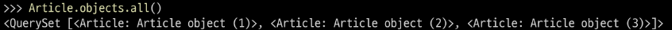
  - QuerySet return
  - 전체 데이터 조회
- <mark>get()</mark>
  - **단일 데이터 조회**
  - 객체를 찾을 수 없으면 DoesNotExist 예외를 발생시키고,
  - 둘 이상의 객체를 찾으면 MultipleObjectsReturned 예외를 발생시킴
  - 위와 같은 특징을 갖고있기 때문에 primary key와 같이 **고유성(uniqueness)을 보장하는 조회**에서 사용해야함
  - 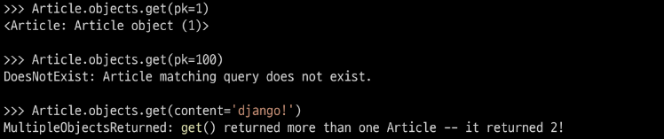
- <mark>filter()</mark>
  - 지정된 조회 매개 변수와 일치하는 객체를 포함하는 새 QuerySet을 반환
  - 없어도 오류가 안남
  - 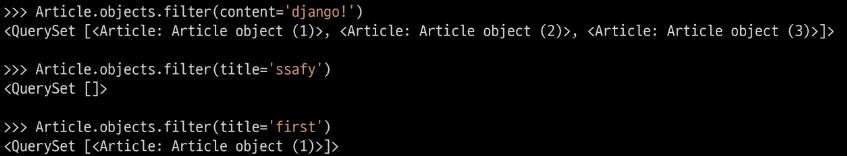
- <mark>Field lookups</mark>
  - 특정 레코드에 대한 조건을 설정하는 방법
  - QuerySet 메서드 filter(), exclude() 및 get()에 대한 키워드 인자로 지정됨
  - 다양한 built-in-lookups는 공식문서 참고
    - iexact
    - contains
    - icontains
    - in
    - gt
    - lte
    - startswith
  - 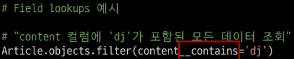

> UPDATE
- 1. 수정하고자 하는 article 인스턴스 객체를 조회 후 반환 값을 저장
- 2. article 인스턴스 객체의 인스턴스 변수 값을 새로운 값으로 할당
- 3. save() 인스턴스 메서드 호출
- 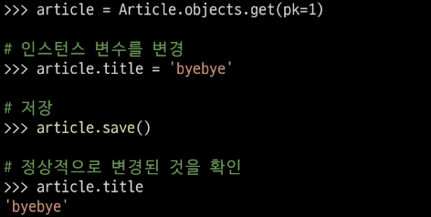

> DELETE
- 1. 삭제하고자 하는 article 인스턴스 객체를 조회 후 반환 값을 저장
- 2. delete() 인스턴스 메서드 호출
- 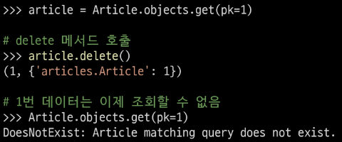
- __str__()
  - 표준 파이썬 클래스의 메서드인 str()을 정의하여 각각의 object가 사람이 읽을 수 있는 문자열을 반환(return)하도록 할 수 있음
  - 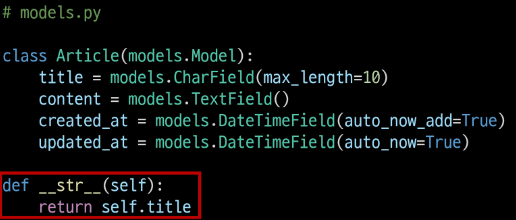
  - 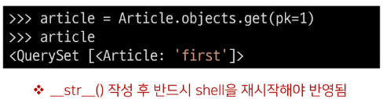


### HTTP method GET 재검토
- /articles/create/?title=11&content=22 와같은 url로 요청이 보내짐
- <mark>GET</mark>
  - 특정 리소스를 가져오도록 요청할 때 사용
  - 반드시 데이터를 가져올때만 사용해야함
  - DB에 변화를 주지않음
    - **DB에 변화를 주는 CREATE, UPDATE, DELETE에서는 사용하지않기**로 약속!!
    - **대신 POST를 사용!**
  - CRUD에서 READ를 담당
  - 길이제한이 있음

- <mark>POST</mark>
  - 서버로 데이터 전송
  - 서버에 변경사항 만듦
  - 데이터를 HTTP body에 담아 전송
  - GET의 쿼리스트링 파라미터와 다르게 URL로 데이터를 보내지 않음
  - CUD 역할


## CRUD with view functions

### base.html 작성
```html
<!-- templates/base.html -->
<!DOCTYPE html>
<html lang="en">
<head>
    <meta charset="UTF-8">
    <meta http-equiv="X-UA-Compatible" content="IE=edge">
    <meta name="viewport" content="width=device-width, initial-scale=1.0">
    <title>
        
        
    </title>
    <link href="<https://cdn.jsdelivr.net/npm/bootstrap@5.2.0/dist/css/bootstrap.min.css>" rel="stylesheet" integrity="sha384-gH2yIJqKdNHPEq0n4Mqa/HGKIhSkIHeL5AyhkYV8i59U5AR6csBvApHHNl/vI1Bx" crossorigin="anonymous">
</head>
<body>
   
    
    

    <script src="<https://cdn.jsdelivr.net/npm/bootstrap@5.2.0/dist/js/bootstrap.bundle.min.js>" integrity="sha384-A3rJD856KowSb7dwlZdYEkO39Gagi7vIsF0jrRAoQmDKKtQBHUuLZ9AsSv4jD4Xa" crossorigin="anonymous"></script>
</body>
</html>
```

```python
# settings.py
'TEMPLATES = [
    {
        ...,
        'DIRS': [BASE_DIR / 'templates',],
        ...
    }
]
```

### url 분리 및 연결
```python
# articles/urls.py

from django.urls import path

app_name = 'articles'
urlpatterns = [

]

# crud/urls.py

from django.contrib import admin
from django.urls import path, include

urlpatterns = [
    path('admin/', admin.site.urls),
    path('articles/', include('articles.urls')),
]
```

### index 페이지 작성

```python
# articles/urls.py

from django.urls import path
from . import views

app_name = 'articles'
urlpatterns = [
    path('', views.index, name='index'),
]


# articles/views.py

def index(request):
    return render(request, 'articles/index.html')

```
```html

# templates/articles/index.html




    <h1>Articles</h1>

```

## READ 1 (index page)
> 전체 게시글 조회
- index 페이지에서는 전체 게시글을 조회해서 출력
```python
# articles/views.py

from .models import Article

def index(request):
    articles = Article.objects.all()
    context = {
        'articles' : articles,
    }
    return render(request, 'articles/index.html', context)
```

---

# ***Model 기본 진행 방법

1. `[models.py](http://models.py)` 에 클래스를 정의한다.
    1. 이 때 클래스는 models.Model 을 상속 받아서 작성한다.
    2. 필요한 필드를 구성한다.
    3. 예시 코드
        
        ```python
        class Post(models.Model):
            # CharField / TextField 문자를 저장하기 위한 필드
            # CharField : 글자 제한 / Textfield : 글자 제한이 없을 때 사용
            title = models.CharField(max_length=255)  
            content = models.TextField()
        ```
        

1. 작성 완료 되었으면 DB에 적용시켜야 하는데
    1. 가장 먼저 설계도를 만들어야 한다.
        1. `python manage.py makemigrations`
    2. 설계도 생성이 되었으면 이제 DB에 적용시켜줘야 한다.
        1. `python manage.py migrate`
        
2. CREATE (3가지 방법이 존재)
    1. 빈 인스턴스 생성하는 방법
    2. 인스턴스 생성할 때 값을 주는 방법
    3. Queryset API 의 create 사용하는 방법

1. READ
    1. 전체 데이터를 읽어 오는 방법
    2. 단일 데이터를 읽어 오는 방법
        1. 어떤 글에 대한 정보를 가져오는지 글 정보를 variable routing으로 전달되어야 한다.
    
2. UPDATE
    1. 데이터를 수정하는 방법
        1. DB에서 수정할 데이터를 가져온다.
        2. 수정한다
        3. 저장한다
    2. 데이터를 수정하기 위해 필요한 정보
        1. 어떤 데이터를 수정하는지 데이터의 pk 값
        2. 클릭했을 때 해당 글의 정보를 variable routing 으로 전달해야 한다.

1. DELETE
    1. 데이터를 삭제하는 방법
        1. 삭제할 데이터를 DB에서 가져온다
        2. 삭제한다

1. CRUD의 동작은 다음 페이지 혹은 동작이 어떤 것이 되어야 하는지 고민해 보면서 정리해주세요.


