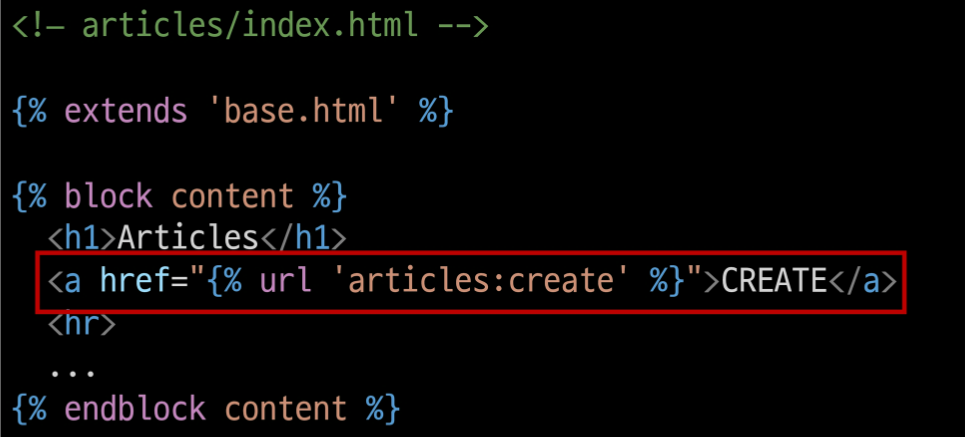

# Django 03

## Django Form

- 지금까지 HTML form, input 태그를 통해 사용자로부터 데이터를 받았음
- django 서버는 현재 들어오는 요청을 모두 수용하고 있는데, 이런 요청중에는 비정상적이거나 악의적 요청이 있다는걸 고려해야함
- <mark>**유효성 검증**</mark>이 반드시 필요 (개발 생산성 늦출 가능성 높음)
- **Django Form**은 이 과정에서 과중한 작업과 반복 코드를 줄여줌으로써 쉽게 유효성 검증 진행을 가능하게 함 (단순화, 자동화)

### Django는 Form에 관련된 작업의 세부분을 처리
- 1. 렌더링을 위한 데이터 준비 및 재구성
- 2. 데이터에 대한 HTML forms 생성
- 3. 클라이언트로부터 받은 데이터 수신 및 처리
---
## The Django Form Class

### Form Class 선언
- Model Class 선언과 비슷
- 비슷한 이름의 필드 타입 (같진 않음)
- **상속**을 통해 선언 (forms 라이브러리의 Form 클래스를 상속받음)
- ```python
    # articles/forms.py
    from socket import fromshare
    from django import forms

    class ArticleForm(forms.Form):
        title = forms.CharField(max_length=10)  # max_length는 form에선 필수 입력사항은 아님!
        content = forms.CharField   # form에선 TextField가 존재 x
  ```

### From rendering options
- \<label> & \<input> 쌍에 대한 3가지 출력 옵션
- 1. **as_p()**
    - 각 필드가 단락 (\<p> 태그)으로 감싸져서 렌더링
- 2. as_ul()
    - 각 필드가 목록 항목 (\<li> 태그)으로 감싸져서 렌더링
    - <ul> 태그는 직접 작성해야함
- 3. as_table()
    - 각 필드가 테이블(\<tr> 태그)행으로 감싸져서 렌더링
- 특별한 상황이 아니면 as_p()만 사용할 것

### Django의 2가지 HTML input 요소 표현
- 1. Form fields
    - 입력에 대한 **유효성 검사 로직**을 처리
    - 템플릿에서 직접 사용됨
    - ```python
        forms.charFrield()
      ```
- 2. Widgets
    - 웹 페이지의 HTML **input 요소 렌더링**을 담당
    - input 요소의 단순한 **출력 부분** 담당
    - Widgets은 반드시 form fields에 할당됨
    - ```python
        forms.charFrield(widget=forms.Textarea)
      ```

---
## Widgets
- HTML input element 표현 담당
- 단순히 렌더링, 출력부분 / 유효성 검사와 관련 x

```python
class ArticleForm(forms.Form):
    NATION_A = 'kr'
    NATION_B = 'ch'
    NATION_C = 'jp'
    NATIONS_CHOICES = [
        (NATION_A, '한국'),
        (NATION_B, '중국'),
        (NATION_C, '일본'),
    ]
    
    
    title = forms.CharField(max_length=10)  # max_length는 form에선 필수 입력사항은 아님!
    content = forms.CharField(widget=forms.Textarea)   # form에선 TextField가 존재 x
    nation = forms.ChoiceField(choices=NATIONS_CHOICES, widget=forms.RadioSelect) # DROPDOWN요소 -> widget써서 radio 변경
```

## Django ModelForm

- 이미 Article Model Class 필드에 대한 정보를 작성했는데, 이를 Form에 맵핑하기위해 Form Class에 필드를 재정의해야만 했음
- ModelForm 사용하면 더 쉽게 작성 가능

### ModelForm Class
- Model을 통해 Form Class를 만들 수 있는 helper class
- ModelForm은 Form과 똑같은 방식으로 View함수에서 사용

## ModelForm에서의 Meta Class
- ModelForm의 정보를 작성하는 곳
- ModelForm을 사용할 경우 참조할 모델 필요
  - Meta class의 model속성이 이를 구성함
- 참조하는 모델에 정의된 field정보를 Form에 적용
- ```python
    from socket import fromshare
    from django import forms
    from .models import Article

    class ArticleForm(forms.ModelForm):
        class Meta:
            model = Article # 호출이 아니라, 참조값으로 사용! (인스턴스 X)
            fields = '__all__'  # Article에서 사용자로부터 입력받는 모든 필드
            # exclude = ('title',)
    ```
- fields 속성에 '__all__'를 사용하여 모델의 모든 필드를 포함할 수 있음
- 또는 exclude 속성을 사용하여 모델에서 포함하지 않을 필드를 지정 가능

### Meta data
- **데이터를 표현하기 위한 데이터**
- 예시 '사진 파일'
  - 사진 데이터
  - 사진데이터의 데이터 (촬영시각, 렌즈, 조리개 값 등)
  - 사진데이터에 대한 데이터 (==사진의 Meta data)

### 참조값과 반환 값
- 참조값은 함수를 호출하지 않고 함수 자체를 전달하는 것!
- 다른 함수에서 <mark>"필요한 시점에"</mark> 호출하는 경우
- ```python
  class ArticleForm(forms.ModelForm):
        class Meta:
            model = Article # 호출이 아니라, 참조값으로 사용! (인스턴스 X)
            fields = '__all__'  # Article에서 사용자로부터 입력받는 모든 필드
  ```
- 여기서도 Article이라는 클래스를 호출하지않고 (model을 인스턴스로 만들지 않고) ArticleForm이 해당 클래스를 필요 시점에 사용하기 위함
- 또한 이 경우에는 인스턴스가 필요한 것이아닌 실제 Article모델의 참조값을 통해 해당 클래스의 필드나 속성등을 내부적으로 참조하기 위함

---

## ModelForm with view functions

### CREATE
```python
# articles/views.py

def create(request):
    # request.POST를 통째로
    # 이미 정보를 알고있기때문에 통째로 넘겨도 알아서 매핑됨!
    form = ArticleForm(request.POST)
    if form.is_valid(): # 유효성 검증 통과하면
        article = form.save()   # 데이터 저장 후 (새 글을 작성한 것, 생성된 글을 반환)
        return redirect('articles:detail', article.pk)   # 상세페이지로 redirect
    return redirect('articles:new') # 통과하지 못하면 작성페이지로 redirect
```

### "is_valid()" method
- 유효성 검사를 실행하고, 데이터가 유효한지 여부를 boolean으로 반환
- 데이터 유효성 검사를 보장하기 위한 많은 테스트에 대해 django는 is_valid()를 제공하여 개발자의 편의를 도움

### The "save()" method
- form 인스턴스에 바인딩 된 데이터를 통해 데이터베이스 객체를 만들고 저장
- ModelForm의 하위 클래스는 **키워드 인자 instance 여부**를 통해 생성할 지, 수정할 지를 결정
  - **제공되지 않은 경우** save()는 지정된 모델의 새 인스턴스를 만듦(**CREATE**)
  - **제공되면** save()는 해당 인스턴스를 수정(**UPDATE**)
  - ```python
    # CREATE (생성)
    form = ArticleForm(request.POST)
    form.save()

    # UPDATE (수정)
    form = ArticleForm(request.POST, instance=article)
    form.save()
    ```

### form 인스턴스의 errors 속성
- is_valid()의 반환 값이 False인 경우 form 인스턴스의 errors 속성에 값이 작성되는데, 유효성 검증을 실패한 원인이 딕셔너리 형태로 저장됨
```python
# articles/views.py

def create(request):
    # request.POST를 통째로
    # 이미 정보를 알고있기때문에 통째로 넘겨도 알아서 매핑됨!
    form = ArticleForm(request.POST)
    if form.is_valid(): # 유효성 검증 통과하면
        article = form.save()   # 데이터 저장 후 (새 글을 작성한 것, 생성된 글을 반환)
        return redirect('articles:detail', article.pk)   # 상세페이지로 redirect
    #print(f'에러: {form.errors}')
    context = {
        'form' : form,  # 에러난 form
    }
    #return redirect('articles:new') # 통과하지 못하면 작성페이지로 redirect
    return render(request, 'articles/new.html', context)
```
- new.html에서 title에 공백 넣고 제출해보면 "필수 항목입니다." 메세지 뜸
- 아무것도 입력하지 않았을때 뜨는 팝업은 input태그의 required속성 때문! (django와 관련 x)


## UPDATE
- ModelForm의 인자 instance는 수정 대상이 되는 객체(기존 객체)를 지정
- 1. request.POST: 사용자가 form을 통해 전송한 데이터 (새로운 데이터)
- 2. instance : 수정이 되는 대상

```python
# articles/views.py

def edit(request, pk):
    article = Article.objects.get(pk=pk)
    form = ArticleForm(instance=article)    # input에 value지정해줄 필요없이 한방에 값 사용 가능
    context = {
        'article' : article,
        'form' : form,
    }
    return render(request, 'articles/edit.html', context)
```
```html
<!--articles/templates/articles/edit.html-->




  <h1>EDIT</h1>
  <form action="" method="POST">
    
    {{ form.as_p }}
     <label for="title">Title: </label>
    <input type="text" name="title" id="title" value="{{ article.title }}"><br>
    <label for="content">Content: </label>
    <textarea name="content" id="content">{{ article.content }}</textarea>
    <input type="submit"> 
  </form>
  <hr>
  <a href="">뒤로가기</a>

```
```python
# articles/views.py 

def update(request, pk):
    article = Article.objects.get(pk=pk)
    form = ArticleForm(request.POST, instance=article)
    if form.is_valid():
        form.save()
        return redirect('articles:detail', article.pk)
    context = {
        'form' : form,
    }
    return render(request, 'articles/edit.html', context)
```

## Form과 ModelForm
- **ModelForm이 Form보다 더 좋은 것이 아니라 각자 역할이 다른 것**
- Form
  - 사용자로부터 받는 데이터가 DB와 연관되어있지 않는 경우에 사용
  - DB에 영향을 미치지 않고 단순 데이터만 사용되는 경우
  - (ex. 로그인, 사용자의 데이터를 받아 인증과정에서만 사용 후 별도로 DB에 저장 X)
- ModelForm
  - 사용자로부터 받는 데이터가 DB와 연관되어 있는 경우에 사용
  - 데이터 유효성 검사가 끝나면 데이터를 각각 어떤 레코드에 맵핑해야할지 이미 알고있기 때문에 곧바로 save() 호출이 가능

---

## Widgets
```python
# articles/forms.py

class ArticleForm(forms.ModelForm):
    title = forms.CharField(
        label='제목',
        # input의 속성값을 TextInput 클래스의 attrs 딕셔너리 안에 추가
        widget=forms.TextInput(         
            attrs={
                'class': 'my-title',
                'placeholder': 'Enter the title',
                'maxlength': 10,    # 유효성검사랑은 관련 x
            }
        ),
    )

    content = forms.CharField(
        label = '내용',
        widget=forms.Textarea(
            attrs={
                'class': 'my-content',
                'placeholder': 'Enter the content',
                'rows': 5,
                'cols': 50,
            }
        ),
        error_messages={
            'required': 'Please enter your content',
        }
    )

    class Meta:
        model = Article
        fields = '__all__
```

---

## <mark>Handling HTTP requests</mark>

- "HTTP requests 처리에 따른 view 함수 구조 변화"
- new-create, edit-update의 view 함수 역할을 잘 살펴보면 하나의 공통점과 하나의 차이점 존재
- 공통점
  - new-create는 모두 CREATE 로직을 구현하기 위한 공통목적
  - edit-update는 모두 UPDATE 로직을 구현하기 위한 공통 목적
- 차이점
  - new와 edit는 GET 요청에 대한 처리만을, (페이지 렌더링)
  - create와 update는 POST 요청에 대한 처리만을 진행 (DB조작-생성/수정)
- 이 공통점과 차이점을 기반으로, 하나의 view 함수에서 method에 따라 로직이 분리되도록 변경

### Create

- new와 create view함수를 합침
- 각각의 역할은 **request.method 값을 기준**으로 나뉨
```python
def create(request):
    if request.method == 'POST':
        # create
        form = ArticleForm(request.POST)
        if form.is_valid():
            article = form.save()
            return redirect('articles:detail', article.pk)
    else:
        # new
        form = ArticleForm()
    
    context = {
        'form' : form,  # 두가지 경우의 form이 가능
    }
    return render(request,'articles/new.html', context)
```
- 이제는 불필요해진 new의 view함수와 url path를 삭제

- new.html -> create.html 이름변경 및 action 속성 값 수정

- new.html -> create.html 이름변경으로 인한 템플릿 경로 수정

- index 페이지에 있던 new 관련 링크 수정


### Update
- edit과 update view 함수를 합침
```python
def update(request, pk):
    article = Article.objects.get(pk=pk)
    if request.method == 'POST':
        form = ArticleForm(request.POST, instance=article)
        if form.is_valid():
            form.save()
            return redirect('articles:detail', article.pk)
    else:
        form = ArticleForm(instance=article)
    context = {
        'article' : article,
        'form' : form,
    }
    return render(request, 'articles/edit.html', context)
```

```python
# articles/urls.py

app_name = 'articles'
urlpatterns = [
    path('', views.index, name='index'),
    # path('new/', views.new, name='new'),
    path('create/', views.create, name='create'), # GET / POST
    path('<int:pk>/', views.detail, name='detail'),
    path('<int:pk>/delete/', views.delete, name='delete'),
    # path('<int:pk>/edit/', views.edit, name='edit'),
    path('<int:pk>/update/', views.update, name='update'), # GET / POST
]
```

### Delete

```python
def delete(request, pk):
    if request.method == 'POST':
        article = Article.objects.get(pk=pk)
        article.delete()
    return redirect('articles:index')
```

---

## View decorators

- View decorators를 사용해 view 함수를 단단하게 만들기
- Decorator : 기존 작성된 함수에 기능을 추가하고 싶을때, 해당 함수를 수정하지 않고 기능 추가해주는 함수
- Django는 다양한 HTTP 기능 지원을 위해 view함수에 적용가능한 여러 데코레이터를 제공

### Allowed HTTP methods

- require_safe()
```python
# views.py
from django.views.decorators.http import require_safe, require_http_methods, require_POST


# GET인 요청에서만 view함수 실행!
# 요청방법이 서버에게 전달되었으나 사용불가 -> 405 Method Not Allowed
@require_safe
def index(request):
    ...

@require_safe
def index(request, pk):
    ...

@require_http_methods(['GET', 'POST'])
def create(request):
    pass

@require_http_methods(['GET', 'POST'])
def update(request, pk):
    pass

@require_POST
def delete(request, pk):
    article = Article.objects.get(pk=pk)
    article.delete()
    return redirect('articles:index')
```

## Rendering fields manually

```html
<h2>수동으로 Form 작성</h2>
<form action="#">
  <div>
    {{ form.title.errors }}
    {{ form.title.label_tag }}
    {{ form.title }}
  </div>
  <div>
    {{ form.content.errors }}
    {{ form.content.label_tag }}
    {{ form.content }}
  </div>
</form>

<h2>Looping over the form's fields</h2>
<form action="#">
  
    {{ field.error }}
    {{ field.label_tag }}
    {{ field }}
</form>
```

```python
# articles/forms.py

# 부트스트랩 폼에 적용!
# class에 form-control 추가

class ArticleForm(forms.ModelForm):
    title = forms.CharField(
        label='제목',
        widget=forms.TextInput(
            attrs={
                'class': 'my-title form-control',
                'placeholder': 'Enter the title',
                'maxlength': 10,
            }
        )
    )

    content = forms.CharField(
        label='내용',
        widget=forms.Textarea(
            attrs={
                'class': 'my-content form-control',
                'placeholder': 'Enter the content',
                'rows': 5,
                'cols': 50,
            }
        ),
        error_messages={
            'required': '내용 입력하라고..',
        }
    )

```

```python
# 외부 라이브러리 사용

$ pip install django-bootstrap-v5

# requirements.txt 업데이트
# settings.py INSTALLED_APPS에 'bootstrap5' 추가
```

```html
<h2>bootstrap v5 라이브러리 사용하기</h2>
<form action="#">
    
    
        <button type="submit" class="btn btn-primary">Submit</button>
    
</form>
