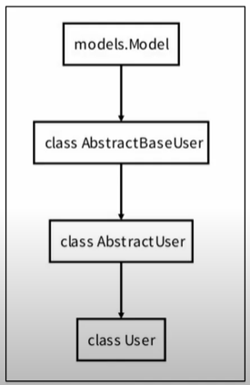
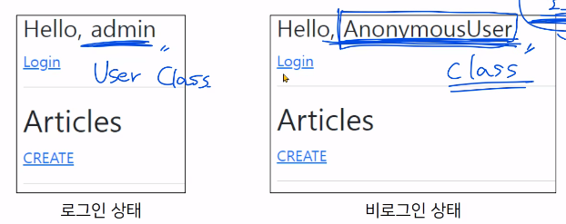

# Django 04

## The Django authentication system

- Django authentication system은 인증(Authentication)과 권한(Authorization)부여를 함께 제공(처리)하며, 이러한 기능이 어느정도 결합되어 일반적으로 인증 시스템이라고 함
- 필수 구성은 settings.py에 이미 포함되어 있으며 INSTALLED_APPS에서 확인 가능
  - **django.contrib.auth**
- Authentication (인증)
  - 신원 확인
  - 사용자가 자신이 누구인지 확인하는 것
- Authorization (권한,허가)
  - 권한 부여
  - 인증된 사용자가 수행할 수 있는 작업을 결정

- 두번째 app accounts 생성 및 등록
- $ python manage.py startapp accounts
```python
# settings.py
INSTALLED_APPS = [
    'articles',
    'accounts',
    ...
```
- url 분리 및 매핑
```python
# accounts/urls.py

from django.urls import path
from . import views


app_name = 'accounts'
urlpatterns = [

]
```
```python
# crud/urls.py
from django.contrib import admin
from django.urls import path, include

urlpatterns = [
    path('admin/', admin.site.urls),
    path('articles/', include('articles.urls')),
    path('accounts/', include('accounts.urls')),
]
```

## Substituting a custom User model
- "Custom User Model로 대체하기"
- 기본 User Model을 필수적으로 Custom User model로 대체하는 이유 이해
- 일부 프로젝트에서는 django에서 제공하는 built-in User model의 기본 인증 요구사항이 적절치 않을 수 있음
- ex) 회원가입시 username 대신 email을 식별값으로 사용하는 것이 더 적합한 사이트인 경우는 django의 User model이 기본적으로 username을 식별값으로 사용하기 때문에 기존 User model을 수정해야하나 쉽지 않은 작업이기때문
- 그래서 Django는 현재 프로젝트에서 나타낼 User를 참조하는 <mark>AUTH_USER_MODEL</mark> 설정값을 제공하여 default user model을 재정의(override)할 수 있도록 함

### AUTH_USER_MODEL

- 프로젝트에서 User를 나타낼때 사용하는 모델
- 프로젝트가 진행되는 동안 (모델을 만들고 마이그레이션 한 후) 변경할 수 없음
- 프로젝트 시작 시 설정하기 위한 것이며, 참조하는 모델은 첫번째 마이그레이션에서 사용할 수 있어야함
  - 즉 첫번째 마이그레이션 전에 확정 지어야 하는 값
- 다음과 같은 기본값을 가지고 있음
- ```python
  # settings.py
  AUTH_USER_MODEL = 'auth.User'
  ```
- AUTH_USER_MODEL은 settings.py에서 보이지 않는데, 그럼 기본값이 어디에 작성됨?
- settings.py는 global_settings.py를 상속받아 재정의하는 파일


## How to substituting a custom User model
- "Custom User Model로 대체하기"
- 공식문서 참고
- 대체하기
- 1. AbstractUser를 상속받는 커스텀 User 클래스 작성
- 기존 User 클래스도 AbstractUser를 상속받기 때문에 커스텀 User 클래스도 완전히 같은 모습을 가지게 됨
- ```python
  # accounts/models.py

  from django.contrib.auth.models import AbstractUser # import해서 

  class User(AbstractUser): # 상속받으면 대체 끝
      pass
  ```
- 2. Django 프로젝트에서 User를 나타내는데 사용하는 모델을 방금 생성한 커스텀 User 모델로 지정
- ```python
  # settings.py
  # accounts => User 정의한 app 이름
  AUTH_USER_MODE = 'accounts.User'  
  ```
- 3. admin.py에 커스텀 User 모델을 등록
- 기본 User모델이 아니기 때문에 등록하지 않으면 admin site에 출력되지 않음
- ```python
  # accounts/admin.py
  from django.contrib import admin
  # admin page에서 user관리 page의 인터페이스를 설정
  # UserAdmin : 기존 사용되던 page 인터페이스
  from django.contrib.auth.admin import UserAdmin
  # 새롭게 정의한 User 모델
  from .models import User

  admin.site.register(User, UserAdmin)
  ```

- User 모델 상속관계


### AbstractUser
- "관리자 권한과 함께 완전한 기능을 가지고있는 User model을 구현하는 추상 기본 클래스"
- Abstract base classes (추상 기본 클래스)
  - 몇가지 공통정보를 여러 다른 모델에 넣을때 사용하는 클래스
  - 데이터베이스 테이블을 만드는데 사용되지 않으며, 대신 다른 모델의 기본 클래스로 사용되는 경우 해당 필드가 하위 클래스의 필드에 추가됨

### [주의] 프로젝트 중간에 AUTH_USER_MODEL 변경하기
- 모델 관계에 영향을 미치기 때문에 훨씬 더 어려운 작업 필요
- 변경사항이 자동으로 수행될 수 없기 때문에 DB 스키마를 직접 수정하고, 이전 사용자 테이블에서 데이터를 이동하고, 일부 마이그레이션을 수동으로 다시 적용해야하는 등,,
- 결론은 중간 변경은 권장하지 않음 <mark>(프로젝트 처음에 진행하기)</mark>
  


### 데이터베이스 초기화
  - 프로젝트 중간일 경우엔 데이터베이스 초기화!
  - 수업 진행을 위한 데이터베이스 초기화 후 마이그레이션
  - 1. migrations 파일 삭제
    - migrations 폴더 및 \__init__.py는 삭제하지 않음
    - 번호가 붙은 파일만 삭제
  - 2. db.sqlite3 삭제
  - 3. migrations 진행
    - makemigrations
    - migrate


### 반드시 User 모델을 대체해야하나?
  - Django는 새 프로젝트를 시작하는 경우 비록 기본 User 모델이 충분하더라도 커스텀 User 모델을 설정하는 것을 **강력하게 권장**
  - 커스텀 User 모델을 **기본 User 모델과 동일하게 작동하면서도 필요한 경우 나중에 맞춤 설정할 수 있기 때문**
  - 단 User 모델 대체 작업은 프로젝트의 모든 migrations 혹은 첫 migrate를 실행하기 전에 이 작업을 마쳐야 함


---

## HTTP Cookies

### HTTP
- Hyper Text Transfer Protocol
- HTML 문서와 같은 리소스들을 가져올 수 있도록 해주는 프로토콜(규칙, 규약)
- 웹(WWW)에서 이루어지는 모든 데이터 교환의 기초
- 클라이언트 - 서버 프로토콜

### 요청과 응답
- 요청(requests)
  - 클라이언트(브라우저)에 의해 전송되는 메세지
- 응답(response)
  - 서버에서 응답으로 전송되는 메세지

### HTTP 특징
1. 비 연결 지향(connectionless)
   - 서버는 요청에 대한 응답을 보낸 후 연결을 끊음
   - 네이버 페이지를 보고있을때 우리는 네이버 서버와 연결된 것이 아님
   - 네이버 서버는 우리에게 메인 페이지를 응답하고 연결을 끊은 것
2. 무상태(stateless)
   - 연결을 끊는 순간 클라이언트와 서버간의 통신이 끝나며 상태정보가 유지되지 않음
   - 클라이언트와 서버가 주고받는 메세지들은 서로 완전히 독립적

### 어떻게 로그인 상태 유지?
- 그런데 우리가 로그인을 하고 웹사이트를 사용할때 페이지를 이동해도 로그인 "상태"가 유지됨
- 서버와 클라이언트 간 지속적인 상태 유지를 위해 <mark>"쿠키와 세션"</mark>이 존재

## 쿠키(Cookie)
- HTTP 쿠키는 **상태가 있는 세션**을 만들도록 해 줌
- 서버가 사용자의 웹 브라우저에 전송하는 작은 데이터 조각
- 사용자가 웹사이트를 방문할 경우 해당 웹사이트의 서버를 통해 사용자의 컴퓨터에 설치되는 작은 기록 정보 파일
  - 1. 브라우저(클라이언트)는 쿠키를 로컬에 KEY-VALUE의 데이터 형식으로 저장
  - 2. 이렇게 쿠키를 저장해놓았다가, <mark>동일한 서버에 재요청 시 저장된 쿠키를 함께 전송</mark>
- 쿠키는 두 요청이 동일한 브라우저에서 들어왔는지 아닌지 판단할 때 주로 사용됨
  - 이를 이용해 사용자의 로그인 상태를 유지할 수 있음
  - 상태가 없는(stateless) HTTP 프로토콜에서 상태 정보를 기억시켜주기 때문
- 즉, 웹페이지에 접속하면 웹페이지를 응답한 **서버로부터 쿠키를 받아 브라우저에 저장**
- 클라이언트가 같은 서버에 재요청 시마다 **요청과 함께 저장해 두었던 쿠키도 함께 전송**

### 쿠키 사용 목적
1. **세션 관리 (Session management)**
- 로그인, 아이디 자동완성, 공지 하루 안 보기, 팝업 체크, 장바구니 등의 정보 관리
2. 개인화 (Personalizaton)
- 사용자 선호, 테마 등의 설정
3. 트래킹 (Tracking)
- 사용자 행동을 기록 및 분석

### 세션 (Session)
- 사이트와 특정 브라우저 사이의 "state(상태)"를 유지시키는 것
- 클라이언트가 서버에 접속하면 서버가 특정 session id를 발급하고, 클라이언트는 session id를 쿠키에 저장
  - 클라이언트가 다시 동일한 서버에 접속하면 요청과 함께 쿠키(session id가 저장된)를 서버에 전달
  - 쿠키는 요청 때마다 서버에 함께 전송되므로 서버에서 session id를 확인해 알맞은 로직을 처리
- session id는 세션을 구별하기위해 필요하며, 쿠키에는 session id만 저장

### 쿠키 Lifetime(수명)
1. Session cookie
- 현재 세션(current session)이 종료되면 삭제됨
- 브라우저 종료와 함께 세션이 삭제됨
2. Persistent cookies
- Expires 속성에 지정된 날짜 혹은 Max-Age 속성에 지정된 기간이 지나면 삭제됨

### Session in Django
- Django는 <mark>database-backed sessions 저장 방식</mark>을 기본 값으로 사용
  - session 정보는 Django DB의 <mark>django_session 테이블</mark>에 저장
  - 설정을 통해 다른 저장방식으로 변경가능
- Django는 특정 session id를 포함하는 쿠키를 사용해서 각각의 브라우저와 사이트가 연결된 session을 알아냄
- Django는 우리가 session 메커니즘(복잡한 동작원리)에 대부분을 생각하지 않게끔 많은 도움을 줌

---
## Authentication in Web requests
- Django가 제공하는 인증 관련 built-in forms 익히기

---

## Login
- 로그인은 <mark>Session을 Create</mark>하는 과정
```python
# accounts/urls.py

from django.urls import path
from . import views


app_name = 'accounts'
urlpatterns = [
    path('login/', views.login, name='login'),
    
]
```
```html
<!--login.html-->



    <h1>LOGIN</h1>
    <form action="" method="POST">
        
        {{ form.as_p }}
        <input type="submit">
    </form>

```


### AuthenticationForm
- 일반 Form!
- 로그인을 위한 built-in form
- 로그인하고자 하는 사용자 정보를 입력받음
- 기본적으로 username과 password를 받아 데이터가 유효한지 검증
- request를 첫번째 인자로 취함
```python
from django.shortcuts import render, redirect
from django.contrib.auth.forms import AuthenticationForm
from django.contrib.auth import login as auth_login
# Create your views here.
def login(request):
    if request.method == 'POST':
        form = AuthenticationForm(request, request.POST)    # 첫번째 인자가 request!
        if form.is_valid():
            # 로그인
            # login 함수명과 겹치지 않도록 변경
            # form.get_user는 인증된 사용자 정보 제공
            auth_login(request, form.get_user)   
            return redirect('articles:index')

    else:
        # POST가 아닐때, 사용자에게 built-in form 보여줌
        form = AuthenticationForm()
    context = {
        'form' : form,
    }
    return render(request, 'accounts/login.html', context)
```

### login()
- login(request, user, backend=None)
- 인증된 사용자를 로그인시키는 로직으로 view함수에서 사용됨
- 현재 세션에 연결하려는 인증된 사용자가 있는 경우 사용
- **HttpRequest 객체**와 **User 객체**가 필요

### get_user()
- AuthenticationForm의 인스턴스 메서드
- **유효성 검사를 통과했을 경우** 로그인 한 사용자 객체를 반환

---
## Authentication with User
- 템플릿에서 인증 관련 데이터를 출력하는 방법

### 현재 로그인 되어있는 유저 정보 출력하기
- 어떻게 base.html에서 context 데이터 없이 user 변수 사용 가능?
- ```html
  <!DOCTYPE html>
  <html lang="en">
  <head>
    <meta charset="UTF-8">
    <meta http-equiv="X-UA-Compatible" content="IE=edge">
    <meta name="viewport" content="width=device-width, initial-scale=1.0">
    <link href="https://cdn.jsdelivr.net/npm/bootstrap@5.2.0/dist/css/bootstrap.min.css" rel="stylesheet" integrity="sha384-gH2yIJqKdNHPEq0n4Mqa/HGKIhSkIHeL5AyhkYV8i59U5AR6csBvApHHNl/vI1Bx" crossorigin="anonymous">  <title>Document</title>
  </head>
  <body>
    <div class="container">
      <h3>{{ user }}</h3>
      <a href="">Login</a>
      <hr>
      
      
    </div>
    <script src="https://cdn.jsdelivr.net/npm/bootstrap@5.2.0/dist/js/bootstrap.bundle.min.js" integrity="sha384-A3rJD856KowSb7dwlZdYEkO39Gagi7vIsF0jrRAoQmDKKtQBHUuLZ9AsSv4jD4Xa" crossorigin="anonymous"></script>
  </body>
  </html>
  ```
  - settings.py의 **context processors** 설정 값 때문
    - django.contrib.auth.context_processors.auth

### context processors
- 템플릿이 렌더링 될때 호출 가능한 컨텍스트 데이터 목록
- 작성된 컨텍스트 데이터는 기본적으로 템플릿에서 사용가능한 변수로 포함됨
- 즉, django에서 자주 사용하는 데이터 목록을 미리 템플릿에 로드해둔 것
```python
# settings.py
TEMPLATES = [
    {
        'BACKEND': 'django.template.backends.django.DjangoTemplates',
        'DIRS': [BASE_DIR, 'templates',],
        'APP_DIRS': True,
        'OPTIONS': {
            'context_processors': [
                'django.template.context_processors.debug',
                'django.template.context_processors.request',
                'django.contrib.auth.context_processors.auth',
                'django.contrib.messages.context_processors.messages',
            ],
        },
    },
]
```
### django.contrib.auth.context_processors.auth
- 현재 로그인한 사용자를 나타내는 User 클래스의 인스턴스가 템플릿 변수 {{ user }}에 저장됨
- 클라이언트가 로그인하지 않은 경우 AnonymousUser 클래스의 인스턴스로 생성


---

## Logout
- 로그아웃은 <mark>Session을 Delete</mark>하는 과정
- logout(request)
- HttpRequest 객체를 인자로 받고 반환 값이 없음
- 사용자가 로그인하지 않은 경우 오류를 발생시키지 않음
- 1. 현재 요청에 대한 session data를 DB에서 삭제
- 2. 클라이언트의 쿠키에서도 sessionid를 삭제
- 이는 다른 사람이 동일한 웹 브라우저를 사용하여 로그인하고, 이전 사용자의 세션 데이터에 액세스하는 것을 방지하기 위함
```python
# accounts/urls.py
from django.urls import path
from . import views


app_name = 'accounts'
urlpatterns = [
    path('login/', views.login, name='login'),
    path('logout/', views.logout, name='logout'),
    
]


# accounts/views.py

from django.shortcuts import render, redirect
from django.contrib.auth.forms import AuthenticationForm
from django.contrib.auth import login as auth_login
from django.contrib.auth import logout as auth_logout

def logout(request):
    # 로그아웃
    auth_logout(request)
    return redirect('articles:index')
```
```html
<!--base.html-->
<!DOCTYPE html>
<html lang="en">
<head>
  <meta charset="UTF-8">
  <meta http-equiv="X-UA-Compatible" content="IE=edge">
  <meta name="viewport" content="width=device-width, initial-scale=1.0">
  <link href="https://cdn.jsdelivr.net/npm/bootstrap@5.2.0/dist/css/bootstrap.min.css" rel="stylesheet" integrity="sha384-gH2yIJqKdNHPEq0n4Mqa/HGKIhSkIHeL5AyhkYV8i59U5AR6csBvApHHNl/vI1Bx" crossorigin="anonymous">  <title>Document</title>
</head>
<body>
  <div class="container">
    <h3>{{ user }}</h3>
    <a href="">Login</a>
    <form action="" method="POST">
      
      <input type="submit" value="Logout">
    </form>
    <hr>
    
    
  </div>
  <script src="https://cdn.jsdelivr.net/npm/bootstrap@5.2.0/dist/js/bootstrap.bundle.min.js" integrity="sha384-A3rJD856KowSb7dwlZdYEkO39Gagi7vIsF0jrRAoQmDKKtQBHUuLZ9AsSv4jD4Xa" crossorigin="anonymous"></script>
</body>
</html>
```

---
## Authentication with User
- User Object와 User CRUD에 대한 이해
- 회원가입, 회원탈퇴, 회원정보수정, 비밀번호 변경

### 회원 가입
- 회원가입은 User를 Create하는 것이며 UserCreationForm built-in form을 사용

### UserCreationForm
- 주어진 username과 password로 **권한이 없는 새 user**를 생성하는 ModelForm
- 3개의 필드를 가짐
  - 1. username (from the user model)
  - 2. password1
  - 3. password2

```python
# accounts/urls.py
from django.urls import path
from . import views


app_name = 'accounts'
urlpatterns = [
    path('login/', views.login, name='login'),
    path('logout/', views.logout, name='logout'),
    path('signup/', views.signup, name='signup'),
    
]

# accounts/views.py
from django.shortcuts import render, redirect
from django.contrib.auth.forms import AuthenticationForm, UserCreationForm
from django.contrib.auth import login as auth_login
from django.contrib.auth import logout as auth_logout

def signup(request):
    if request.method == 'POST':
        pass
    else:
        form = UserCreationForm()
    context = {
        'form' : form,
    }
    return render(request, 'accounts/signup.html', context)
```
```html
<!--signup.html-->



    <h1>SIGNUP</h1>
    <form action="" method="POST">
        
        {{ form.as_p }}
        <input type="submit">
    </form>

```

- 회원가입 진행 후 에러페이지 확인
- 회원가입에 사용하는 UserCreationForm이 우리가 대체한 **커스텀 유저 모델이 아닌 기존 유저 모델**로 인해 작성된 클래스이기 때문


## Custom user & Built-in auth forms

### AbstractBaseUser의 모든 subclass와 호환되는 forms
- 아래 Form 클래스는 User모델을 대체하더라도 커스텀하지 않아도 사용가능
- 1. AuthenticationForm
- 2. SetPasswordForm
- 3. PasswordChangeForm
- 4. AdminPasswordChangeForm
- 기존 User 모델을 참조하는 Form이 아니기 때문

### 커스텀 유저 모델을 사용하려면 다시 작성하거나 **확장**해야 하는 forms
- 1. UserCreationForm (회원 가입)
- 2. UserChangeForm (회원 정보 수정)
- 두 form 모두 class Meta: model = User가 등록된 form이기 때문에 반드시 커스텀(확장)해야 함
```python
# accounts/forms.py
from django.contrib.auth.forms import UserCreationForm, UserChangeForm
from django.contrib.auth import get_user_model


class CustomUserCreationForm(UserCreationForm):
    class Meta(UserCreationForm.Meta):
        model = get_user_model()    # 간접 참조를 위한 함수
        fields = UserCreationForm.Meta.fields + ('email',)  # 이메일입력란 추가

class CustomUserChangeForm(UserChangeForm):
    class Meta(UserChangeForm.Meta):
        model = get_user_model()
```

### get_user_model()
- "현재 프로젝트에서 활성화된 사용자 모델(active user model)"을 반환
- 직접 참조하지 않는 이유?
  - 예를 들어 기존 User모델이 아닌 User 모델을 커스텀 한 상황에서는 커스텀 User 모델을 자동으로 반환해주기 때문
  - Django는 User 클래스를 직접 참조하는 대신 get_user_model()을 사용해 참조해야한다고 강조하고 있음
  - User model 참조에 대한 자세한 내용은 추후 모델 관계 수업에서 다룰 예정

### 회원가입 후 곧바로 로그인 진행
```python
def signup(request):
    if request.method == 'POST':
        form = CustomUserCreationForm(request.POST)
        if form.is_valid():
            user = form.save()
            # 회원가입 후 로그인
            auth_login(request, user)
            return redirect('articles:index')
    else:
        form = CustomUserCreationForm()
    context = {
        'form' : form,
    }
    return render(request, 'accounts/signup.html', context)
```

## 회원 탈퇴
- 회원 탈퇴하는 것은 DB에서 유저를 delete하는 것
```python
# accounts/urls.py
from django.urls import path
from . import views


app_name = 'accounts'
urlpatterns = [
    path('login/', views.login, name='login'),
    path('logout/', views.logout, name='logout'),
    path('signup/', views.signup, name='signup'),
    path('delete/', views.delete, name='delete'),
]

# accounts/views.py

def delete(request):
    request.user.delete()
    auth_logout(request)    # 탈퇴하면서 해당 유저의 세션정보도 함께 지우고 싶을 경우
    # 순서주의 ! (탈퇴 -> 로그아웃)
    # 먼저 로그아웃 해버리면 해당 요청 객체 정보가 없어져서 탈퇴에 필요한 정보도 없어져버림
    return redirect('articles:index')

```

```html
<!--base.html-->
<!DOCTYPE html>
<html lang="en">
<head>
  <meta charset="UTF-8">
  <meta http-equiv="X-UA-Compatible" content="IE=edge">
  <meta name="viewport" content="width=device-width, initial-scale=1.0">
  <link href="https://cdn.jsdelivr.net/npm/bootstrap@5.2.0/dist/css/bootstrap.min.css" rel="stylesheet" integrity="sha384-gH2yIJqKdNHPEq0n4Mqa/HGKIhSkIHeL5AyhkYV8i59U5AR6csBvApHHNl/vI1Bx" crossorigin="anonymous">  <title>Document</title>
</head>
<body>
  <div class="container">
    <h3>{{ user }}</h3>
    <a href="">Login</a>
    <form action="" method="POST">
      
      <input type="submit" value="Logout">
    </form>
    <a href="">Signup</a>
    <form action="" method="POST">
      
      <input type="submit" value="회원탈퇴">
    </form>
    <hr>
    
    
  </div>
  <script src="https://cdn.jsdelivr.net/npm/bootstrap@5.2.0/dist/js/bootstrap.bundle.min.js" integrity="sha384-A3rJD856KowSb7dwlZdYEkO39Gagi7vIsF0jrRAoQmDKKtQBHUuLZ9AsSv4jD4Xa" crossorigin="anonymous"></script>
</body>
</html>
```
---

## 회원정보 수정
- 회원정보 수정은 User를 Update하는 것이며 <mark>UserChangeForm</mark> built-in form을 사용

### UserChangeForm
- 사용자의 정보 및 권한을 변경하기 위해 admin 인터페이스에서 사용되는 ModelForm
- UserChangeForm 또한 ModelForm이기 때문에 instance 인자로 기존 user 데이터 정보를 받는 구조 또한 동일함
- 이미 이전에 CustomUserChangeForm으로 확장했기 때문에 CustomUserChangeForm을 사용하기
```python
# accounts/urls.py
from django.urls import path
from . import views


app_name = 'accounts'
urlpatterns = [
    path('login/', views.login, name='login'),
    path('logout/', views.logout, name='logout'),
    path('signup/', views.signup, name='signup'),
    path('delete/', views.delete, name='delete'),
    path('update/', views.update, name='update'),
]


# accounts/views.py

def update(request):
    if request.method == "POST":
        form = CustomUserChangeForm(request.POST, instance=request.user)
        if form.is_valid():
            form.save()
            return redirect('articles:index')
    else:
        form = CustomUserChangeForm(instance=request.user)
    context = {
        'form' : form,
    }
    return render(request, 'accounts/update.html', context)
```
```html
<!--update.html-->



    <h1>회원정보수정</h1>
    <form action="" method="POST">
        
        {{ form.as_p }}
        <input type="submit">
    </form>



<!--base.html-->
<!DOCTYPE html>
<html lang="en">
<head>
  <meta charset="UTF-8">
  <meta http-equiv="X-UA-Compatible" content="IE=edge">
  <meta name="viewport" content="width=device-width, initial-scale=1.0">
  <link href="https://cdn.jsdelivr.net/npm/bootstrap@5.2.0/dist/css/bootstrap.min.css" rel="stylesheet" integrity="sha384-gH2yIJqKdNHPEq0n4Mqa/HGKIhSkIHeL5AyhkYV8i59U5AR6csBvApHHNl/vI1Bx" crossorigin="anonymous">  <title>Document</title>
</head>
<body>
  <div class="container">
    <h3>{{ user }}</h3>
    <a href="">Login</a>
    <form action="" method="POST">
      
      <input type="submit" value="Logout">
    </form>
    <a href="">Signup</a>
    <form action="" method="POST">
      
      <input type="submit" value="회원탈퇴">
    </form>
    <a href="">회원정보수정</a>
    <hr>
    
    
  </div>
  <script src="https://cdn.jsdelivr.net/npm/bootstrap@5.2.0/dist/js/bootstrap.bundle.min.js" integrity="sha384-A3rJD856KowSb7dwlZdYEkO39Gagi7vIsF0jrRAoQmDKKtQBHUuLZ9AsSv4jD4Xa" crossorigin="anonymous"></script>
</body>
</html>
```
### UserChangeForm 사용시 문제점
- 일반 사용자가 접근해서는 안 될 정보들(fields)까지 모두 수정이 가능해짐
  - admin 인터페이스에서 사용되는 ModelForm이기 때문
- 따라서 UserChangeForm을 상속받아 작성해 두었던 서브 클래스 CustomUserChangeForm에 접근 가능한 필드를 조정해야함
- ```python
  
  class CustomUserChangeForm(UserChangeForm):
      class Meta(UserChangeForm.Meta):
          model = get_user_model()
          fields = ('email', 'first_name', 'last_name',)  # 보여줄것만 적어줌 (중요한것 제외!)
  ```
---

## 비밀번호 변경

## PasswordChangeForm
- 사용자가 비밀번호를 변경할 수 있도록 하는 Form
- 이전 비밀번호를 입력하여 비밀번호를 변경할 수 있도록 함
- 이전 비밀번호를 입력하지 않고 비밀번호를 설정할 수 있는 SetPasswordForm을 상속받는 서브 클래스 (부모 클래스에 살을 붙인 것!)
- SetPasswordForm에서 user를 첫번째 인자로 받으므로, PasswordChangeForm도 !
```python
# accounts/urls.py
from django.urls import path
from . import views


app_name = 'accounts'
urlpatterns = [
    path('login/', views.login, name='login'),
    path('logout/', views.logout, name='logout'),
    path('signup/', views.signup, name='signup'),
    path('delete/', views.delete, name='delete'),
    path('update/', views.update, name='update'),
    path('password/', views.change_password, name='change_password'),
]


# accounts/views.py
from django.contrib.auth.forms import AuthenticationForm, PasswordChangeForm  # 추가

def change_password(request):
    if request.method == "POST":
        form = PasswordChangeForm(request.user, request.POST)
        if form.is_valid():
            form.save()
            return redirect('articles:index')
    else:
        form = PasswordChangeForm(request.user) # 필수인자 request.user
    context = {
        'form' : form,
    }
    return render(request, 'accounts/change_password.html', context)
```
```html
<!--change_password.html-->



    <h1>비밀번호변경</h1>
    <form action="" method="POST">
        
        {{ form.as_p }}
        <input type="submit">
    </form>

```

- 비밀번호 변경 후 로그인 상태가 지속되지 못하는 문제 발생 

### 암호 변경시 세션 무효화 방지
- 비밀번호가 변경되면 기존 세션과의 회원 인증 정보가 일치하지 않게 되어 버려 로그인 상태가 유지되지 못함
- 비밀번호는 잘 변경되었으나 비밀번호가 변경 되면서 기존 세션과의 회원 인증 정보가 일치하지 않기 때문

### update_session_auth_hash()
- update_session_auth_hash(request, user)
- 현재요청(current request)와 새 session data가 파생될 업데이트 된 사용자 객체를 가져오고, session data를 적절하게 업데이트해줌
- 암호가 변경되어도 로그아웃 되지않도록 새로운 password의 session data로 session을 업데이트
```python
# accounts/views.py
from django.contrib.auth import update_session_auth_hash

def change_password(request):
    if request.method == "POST":
        form = PasswordChangeForm(request.user, request.POST)
        if form.is_valid():
            form.save()
            update_session_auth_hash(request, form.user)    # 부모 클래스에서 user를 첫번째 인자로 받기때문에 바로 사용가능
            # user = form.save()해서 user만 넣어도됨! 
            return redirect('articles:index')
    else:
        form = PasswordChangeForm(request.user) # 필수인자 request.user
    context = {
        'form' : form,
    }
    return render(request, 'accounts/change_password.html', context)
```

---

## Limiting access to logged-in users*
- 로그인 사용자에 대한 접근 제한하기
- 로그인 사용자에 대해 접근을 제한하는 2가지 방법
  - 1. The raw way
    - <mark>is_authenticated</mark> attribute
  - 2. The <mark>login_required</mark> decorator

### is_authenticated
- User model의 속성(attributes)중 하나
- 사용자가 인증 되었는지 여부를 알 수 있는 방법
- 모든 User 인스턴스에 대해 항상 True인 읽기 전용 속성
  - AnonymoousUser에 대해서는 항상 False
- 일반적으로 request.user에서 이 속성을 사용 (request.user.is_authenticated)
- * 권한(permission)과는 관련이 없으며, 사용자가 활성화 상태(active)이거나 유효한 세션(valid session)을 가지고 있는지도 확인 x
- 단지 로그인 / 비로그인만 확인!!!

- 로그인과 비로그인 상태에서 출력되는 링크를 다르게 설정
```html
  <!DOCTYPE html>
  <html lang="en">
  <head>
    <meta charset="UTF-8">
    <meta http-equiv="X-UA-Compatible" content="IE=edge">
    <meta name="viewport" content="width=device-width, initial-scale=1.0">
    <link href="https://cdn.jsdelivr.net/npm/bootstrap@5.2.0/dist/css/bootstrap.min.css" rel="stylesheet" integrity="sha384-gH2yIJqKdNHPEq0n4Mqa/HGKIhSkIHeL5AyhkYV8i59U5AR6csBvApHHNl/vI1Bx" crossorigin="anonymous">  <title>Document</title>
  </head>
  <body>
    <div class="container">
      <!--request를 쓸 수 있는건 settings.py에 context_processors안에 설정해뒀기때문!-->
        <!--로그인 되어있을때-->
        <h3>{{ user }}</h3>
        <form action="" method="POST">
          
          <input type="submit" value="Logout">
        </form>
        <form action="" method="POST">
          
          <input type="submit" value="회원탈퇴">
        </form>
        <a href="">회원정보수정</a>
        <!--로그인 안되어있을때-->
        <a href="">Login</a>
        
        <a href="">Signup</a>
      
      <hr>
      
      
    </div>
    <script src="https://cdn.jsdelivr.net/npm/bootstrap@5.2.0/dist/js/bootstrap.bundle.min.js" integrity="sha384-A3rJD856KowSb7dwlZdYEkO39Gagi7vIsF0jrRAoQmDKKtQBHUuLZ9AsSv4jD4Xa" crossorigin="anonymous"></script>
  </body>
  </html>
```

- 인증된 사용자만 게시글 작성 링크 볼 수 있도록 처리
- But, 아직 비로그인 상태로도 URL을 직접 입력하면 게시글 작성페이지로 이동 가능
```html
<!--index.html-->



  <h1>Articles</h1>
    <!--인증된 사용자만 게시글 작성링크 볼수있도록-->
    <a href="">CREATE</a>
  
  
  <hr>
  
    <p>글 번호 : {{ article.pk }}</p>
    <p>제목 : {{ article.title }}</p>
    <p>내용 : {{ article.content }}</p>
    <a href="">상세 페이지</a>
    <hr>
  

```

- 인증된 사용자라면 로그인 로직을 수행할 수 없도록 처리
```python
# accounts/views.py
def login(request):
    if request.user.is_authenticated:   # 이미 로그인한 사용자라면 시작페이지로 되돌려보냄
        return redirect('articles:index')

    if request.method == 'POST':
        form = AuthenticationForm(request, request.POST)    # 첫번째 인자가 request!
        if form.is_valid():
            # 로그인
            # login 함수명과 겹치지 않도록 변경
            # form.get_user는 인증된 사용자 정보 제공
            auth_login(request, form.get_user)   
            return redirect('articles:index')

    else:
        # POST가 아닐때, 사용자에게 built-in form 보여줌
        form = AuthenticationForm()
    context = {
        'form' : form,
    }
    return render(request, 'accounts/login.html', context)
```

### login_required
- login_required decorator
- 사용자가 로그인 되어 있으면 정상적으로 view 함수를 실행
- 로그인 하지 않은 사용자의 경우 settings.py의 LOGIN_URL 문자열 주소로 redirect
  - LOGIN_URL의 기본값은 /accounts/login/
  - 두번째 app 이름을 accounts로 했던 이유 중 하나
- 로그인 상태에서만 글을 작성/수정/삭제 할 수 있도록 변경
```python
from django.contrib.auth.decorators import login_required

@login_required
@require_http_methods(['GET', 'POST'])
def create(request):
    pass

@login_required
@require_POST
def delete(request, pk):
    pass


@login_required
@require_http_methods(['GET', 'POST'])
def update(request, pk):
    pass

```

### login_required 적용 확인하기
- /articles/create/로 강제 접속 시도 해보기
- 로그인 페이지로 리다이렉트 후 /accounts/login/?next=/articles/create/ url 확인하기
- 인증 성공 시 사용자가 redirect 되어야하는 경로는 "next"라는 쿼리 문자열 매개 변수에 저장됨
- ex) /accounts/login/<mark>?next=/articles/create/</mark>

### "next" query string parameter
- 로그인이 정상적으로 진행되면 이전에 요청했던 주소로 redirect 하기 위해 Django가 제공해주는 쿼리 스트링 파라미터
- 해당 값을 처리할지 말지는 자유이며 별도로 처리 해주지 않으면 view에 설정한 redirect 경로로 이동하게 됨
```python
# accounts/views.py

def login(request):
    if request.user.is_authenticated:   # 이미 로그인한 사용자라면 시작페이지로 되돌려보냄
        return redirect('articles:index')

    if request.method == 'POST':
        form = AuthenticationForm(request, request.POST)    # 첫번째 인자가 request!
        if form.is_valid():
            # 로그인
            # login 함수명과 겹치지 않도록 변경
            # form.get_user는 인증된 사용자 정보 제공
            auth_login(request, form.get_user)   
            return redirect(request.GET.get('next') or 'articles:index')
```


- 만약 login 템플릿에서 form action이 작성되어 있다면 동작하지 않음
- 해당 action 주소 next 파라미터가 작성 되어있는 현재 url이 아닌 /accounts/login/으로 요청을 보내기 때문
  
```html
<!--login.html-->



    <h1>LOGIN</h1>
    <form action="" method="POST">
        
        {{ form.as_p }}
        <input type="submit">
    </form>

```

### 두 데코레이터로 인해 발생하는 구조적 문제
- 1. 먼저 비로그인 상태로 detail 페이지에서 게시글 삭제 시도
- 2. delete view 함수의 **@login_required**로 인해 **로그인 페이지로 리다이렉트**
- 3. redirect로 이동한 로그인 페이지에서 로그인 진행
- 4. delete view 함수의 @required_POST로 인해 405상태코드를 받게 됨.
  - 405(Method Not Allowed) status code 확인
- 로그인 성공 이후 GET method로 next파라미터 주소에 리다이렉트 되기 때문
- **redirect 과정에서 POST 요청 데이터의 손실**
- **redirect로 인한 요청은 GET 요청 메서드로만 요청됨**
- **@login_required**는 GET request method를 처리할 수 있는 View 함수에서만 사용해야함
  - **POST method만 허용하는 delete**같은 함수 내부에서는 **is_authenticated 속성 값을 사용해서 처리**
  - ```python
      # articles/views.py

      @require_POST
      def delete(request, pk):
        if request.user.is_authenticated:
            article = Article.objects.get(pk=pk)
            article.delete()
        return redirect('articles:index')
    ```

### accounts view 함수에 모든 데코레이터 및 속성 값 적용해보기
```python
# accounts/views.py

# Create your views here.
@require_http_methods(['GET', 'POST'])
def login(request):
    if request.user.is_authenticated:
        return redirect('articles:index')

    if request.method == 'POST':
        form = AuthenticationForm(request, request.POST)
        # form = AuthenticationForm(request, data=request.POST)
        if form.is_valid():
            # 로그인
            auth_login(request, form.get_user())
            return redirect(request.GET.get('next') or 'articles:index')
    else:
        form = AuthenticationForm()
    context = {
        'form': form,
    }
    return render(request, 'accounts/login.html', context)


@require_POST
def logout(request):
    if request.user.is_authenticated:
        auth_logout(request)
    return redirect('articles:index')


@require_http_methods(['GET', 'POST'])
def signup(request):
    if request.method == 'POST':
        form = CustomUserCreationForm(request.POST)
        if form.is_valid():
            user = form.save()
            # 회원가입 후 로그인
            auth_login(request, user)
            return redirect('articles:index')
    else:
        form = CustomUserCreationForm()
    context = {
        'form': form,
    }
    return render(request, 'accounts/signup.html', context)


@require_POST
def delete(request):
    if request.user.is_authenticated:
        request.user.delete()
        auth_logout(request)
    return redirect('articles:index')


@login_required
@require_http_methods(['GET', 'POST'])
def update(request):
    if request.method == 'POST':
        form = CustomUserChangeForm(request.POST, instance=request.user)
        # form = CustomUserChangeForm(data=request.POST, instance=request.user)
        if form.is_valid():
            form.save()
            return redirect('articles:index')
    else:
        form = CustomUserChangeForm(instance=request.user)
    context = {
        'form': form,
    }
    return render(request, 'accounts/update.html', context)


@login_required
@require_http_methods(['GET', 'POST'])
def change_password(request):
    if request.method == 'POST':
        form = PasswordChangeForm(request.user, request.POST)
        # form = PasswordChangeForm(user=request.user, data=request.POST)
        if form.is_valid():
            form.save()
            update_session_auth_hash(request, form.user)
            return redirect('articles:index')
    else:
        form = PasswordChangeForm(request.user)
    context = {
        'form': form,
    }
    return render(request, 'accounts/change_password.html', context)
```


