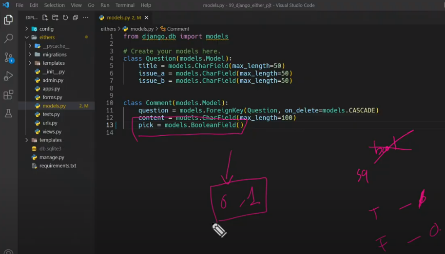
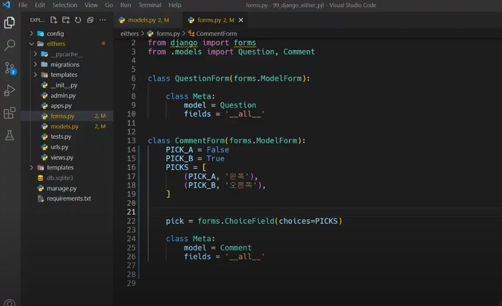
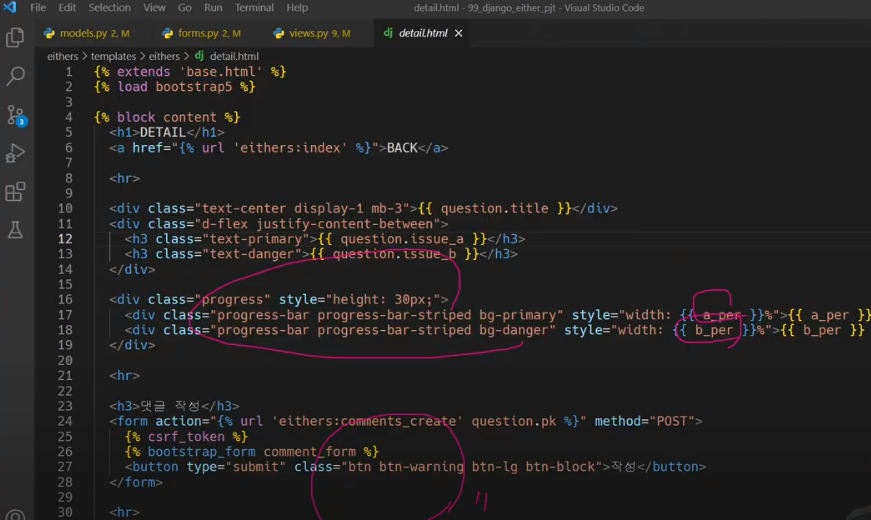

# Django 05

## Managing static files

### 개요
- 개발자가 서버에 미리 준비한 혹은 사용자가 업로드한 정적파일을 클라이언트에게 제공하는 방법

## Static files

### 정적 파일
- 응답할 때 별도의 처리 없이 파일 내용을 그대로 보여주면 되는 파일
  - 사용자의 요청에 따라 내용이 바뀌는 것이 아니라 요청한 것을 그대로 보여주면 되는 파일
- 파일 자체가 고정되어 있고, 서비스 중에도 추가되거나 변경되지 않고 고정 되어있음
  - 예를 들어 웹사이트는 일반적으로 이미지, 자바스크립트 또는 CSS와 같은 미리 준비된 추가 파일(움직이지 않는)을 제공해야 함
- Django에서는 이러한 파일들을 "static file"이라 함
  - Django는 staticfiles 앱을 통해 정적 파일과 관련된 기능을 제공

### Media File
- 미디어 파일
- 사용자가 웹에서 업로드하는 정적 파일 (user-uploaded)
- 유저가 업로드 한 모든 정적 파일

### 웹 서버와 정적 파일
- 웹 서버의 기본동작은
  - 특정 위치(URL)에 있는 자원을 요청(HTTP request) 받아서
  - 응답(HTTP response)을 처리하고 제공(serving)하는 것
- 이는 "자원과 자원에 접근 가능한 주소가 있다."라는 의미
  - 예를들어, 사진 파일은 자원이고 해당 사진 파일을 얻기 위한 경로인 웹 주소(URL)가 존재함
- 즉 웹 서버는 요청 받은 URL로 서버에 존재하는 정적 자원(static resource)을 제공


## Static files 구성하기

### Django에서 정적파일을 구성하고 사용하기 위한 몇가지 단계
1. INSTALLED_APPS에 django.contrib.staticfiles가 포함되어 있는지 확인하기
2. settings.py에서 STATIC_URL을 정의하기
3. 앱의 static 폴더에 정적 파일을 위치하기
- 예시) my_app/static/sample_img.jpg
4. 템플릿에서 static 템플릿 태그를 사용하여 지정된 경로에 있는 정적 파일의 URL 만들기
- ```html
  
  
  ```
### Django template tag
```html

```
- load tag
- 특정 라이브러리, 패키지에 등록된 모든 템플릿 태그와 필터를 로드

```html

```
- static tag
- STATIC_ROOT에 저장된 정적 파일에 연결

### Static files 관련 Core Settings
1. STATIC_ROOT
2. STATICFILES_DIRS
3. STATIC_URL

### STATIC_ROOT
- Default: None
- Django 프로젝트에서 사용하는 모든 정적 파일을 한곳에 모아 넣는 경로
- **collectstatic**이 배포를 위해 정적 파일을 수집하는 디렉토리의 절대 경로
- 개발 과정에서 settings.py의 DEBUG 값이 True로 설정되어 있으면 해당 값은 작용되지 않음
- 실 서비스 환경(배포 환경)에서 Django의 모든 정적 파일을 다른 웹 서버가 직접 제공하기 위해 사용
- **배포** 환경에서는 Django를 직접 실행하는 것이 아니라, 다른 서버에 의해 실행되기 때문에 실행하는 다른 서버는 Django에 내장되어 있는 정적 파일들을 인식하지 못함 (내장되어 있는 정적 파일들을 밖으로 꺼내는 이유)

> [참고] collectstatic
- STATIC_ROOT에 Django 프로젝트의 모든 정적 파일을 수집
```python
# settings.py
STATIC_ROOT = BASE_DIR / 'staticfiles'
```
```python
$ python manage.py collectstatic
```
- 결과를 확인하고 수집된 정적 파일을 모두 삭제한다.


> [참고] 소프트웨어 배포 (Deploy)
- 프로그램 및 애플리케이션을 서버와 같은 기기에 설치하여 서비스를 제공하는 것
- 클라우드 컴퓨팅 서비스 (AWS, Google Cloud, MS Azure 등)에 프로그램 및 애플리케이션을 설치해 제공하는 것
- 앱 서버(Local Server) -> 웹 서버(Cloud Server)

### STATICFILES_DIRS
- Default: [] (Empty list)
- app/static/ 디렉토리 경로를 사용하는 것(기본 경로) 외에 추가적인 정적 파일 경로 목록을 정의하는 리스트
- 추가 파일 디렉토리에 대한 전체 경로를 포함하는 문자열 목록으로 작성되어야 함
- 앱 폴더 외부에 static file이 존재할 때 경로 등록
```python
# 작성 예시
STATICFILES_DIRS = [
    BASE_DIR / 'static',
]
```

### STATIC_URL
- Default: None
- STATIC_ROOT에 있는 정적 파일을 참조 할 때 사용할 URL
- 기본으로 작성되어있음
- 개발 단계에서는 실제 정적 파일들이 저장되어 있는 app/static/ 경로(기본 경로) 및 STATICFILES_DIRS에 정의된 추가 경로들을 탐색
- 실제 파일이나 디렉토리가 아니며, URL로만 존재
- 비어 있지 않은 값으로 설정 한다면 반드시 slash(/)로 끝나야 함
```python
# 작성 예시
STATIC_URL = '/static/'
```

## Static files 사용하기

### static file 가져오기
- Static file을 가져오는 2가지 방법
  - 1. 기본 경로에 있는 static file 가져오기
  - 2. 추가 경로에 있는 static file 가져오기

### 기본 경로에 있는 static file 가져오기
- articles/static/articles 경로에 이미지 파일 배치하기

### 추가 경로에 있는 static file 가져오기
- 추가 경로 작성
```python
# settings.py
STATICFILES_DIRS = [
    BASE_DIR / 'static',
]
```
- static/ 경로에 이미지 파일 배치하기
- static tag를 사용해 이미지 파일 출력하기
- 이미지 출력 확인
```python
# index.html





  
  
```

### STATIC_URL 확인하기
- Django가 해당 이미지를 클라이언트에게 응답하기 위해 만든 image url 확인하기
  - 개발자도구 - Inspect 버튼을 통해 확인
- "STATIC_URL + static file 경로"로 설정됨
  - http://127.0.0.1:8000/static/articles/sample_img_1.png
- 개발자도구 - Network에서 Request URL 확인해보기
  - 클라이언트에게 이미지를 응답하기 위한 요청 URL을 만든 것

---

## Image Upload

### 개념
- Django ImageField를 사용해 사용자가 업로드한 정적 파일(미디어파일) 관리하기

## ImageField

### ImageField()
- 이미지 업로드에 사용하는 모델 필드
- FileField를 상속받는 서브 클래스이기 때문에 FileField의 모든 속성 및 메서드를 사용 가능
- 더해서 사용자에 의해 업로드 된 객체가 유효한 이미지인지 검사
- ImageField 인스턴스는 최대 길이가 100자인 문자열로 DB에 생성되며, max_length 인자를 사용하여 최대 길이를 변경 할 수 있음

### FileField()
- FileField(upload to='', storage=None, max_length=100, **options)
- 파일 업로드에 사용하는 모델 필드
- 2개의 선택 인자를 갖고 있음
  - 1. upload_to
  - 2. storage

### FileField / ImageField 를 사용하기 위한 단계
1. settings.py에 MEDIA_ROOT, MEDIA_URL 설정
2. upload_to 속성을 정의하여 업로드 된 파일에 사용할 MEDIA_ROOT의 하위 경로를 지정 (선택사항)

### MEDIA_ROOT
- Default: ''(Empty string)
- 사용자가 업로드 한 파일(미디어파일)들을 보관할 디렉토리의 절대 경로
- Django는 성능을 위해 업로드 파일은 데이터베이스에 저장하지 않음
  - 데이터베이스에 저장되는 것은 "파일 경로"
- MEDIA_ROOT는 STATIC_ROOT와 반드시 다른 경로로 지정해야 함
```python
# settings.py
MEDIA_ROOT = BASE_DIR / 'media'
```

### MEDIA_URL
- Default: ''(Empty string)
- MEDIA_ROOT에서 제공되는 미디어 파일을 처리하는 URL
- 업로드 된 파일의 주소(URL)를 만들어 주는 역할
  - 웹 서버 사용자가 사용하는 public URL
- 비어 있지 않은 값으로 설정 한다면 반드시 slash(/)로 끝나야 함
- MEDIA_URL은 STATIC_URL과 반드시 다른 경로로 지정해야 함
```python
# settings.py
MEDIA_URL = '/media/'
```

### 개발 단계에서 사용자가 업로드한 미디어 파일 제공하기
```python
# crud/urls.py

from django.conf import settings
from django.conf.urls.static import static

urlpatterns = [
    path('admin/', admin.site.urls),
    path('articles/', include('articles.urls')),
    path('accounts/', include('accounts.urls')),
    
] + static(settings.MEDIA_URL, document_root=settings.MEDIA_ROOT)
```
- 사용자로부터 업로드 된 파일이 프로젝트에 업로드 되고나서, 실제로 사용자에게 제공하기 위해서는 업로드 된 파일의 URL이 필요함
  - 업로드 된 파일의 URL == settings.MEDIA_URL
  - 위 URL을 통해 참조하는 파일의 실제 위치 == settings.MEDIA_ROOT

---

## CREATE

### ImageField 작성
```python
# articles/models.py
class Article(models.Model):
    user = models.ForeignKey(settings.AUTH_USER_MODEL, on_delete=models.CASCADE)
    title = models.CharField(max_length=10)
    content = models.TextField()
    image = models.ImageField(blank=True) # 빈 값 허용
    created_at = models.DateTimeField(auto_now_add=True)
    updated_at = models.DateTimeField(auto_now=True)
```

### Model field option
- Model field option 중 아래 2가지 사항 알아보기
1. blank
2. null

### blank
- Default: False
- True인 경우 필드를 비워 둘 수 있음
  - 이럴 경우 DB에는 ''(빈 문자열)이 저장됨
- 유효성 검사에서 사용 됨(is_valid)
  - "Validation-related"
  - 필드에 blank=True가 있으면 form 유효성 검사에서 빈 값을 입력할 수 있음

### null
- Default: False
- True인 경우 Django는 빈 값을 DB에 NULL로 저장함
  - "Database-related"
- 문자열에선 빈 값을 ''로 표현
- 그래서 null 대신 blank 사용

### null 관련 주의사항
- "CharField, TextField와 같은 문자열 기반 필드에는 null 옵션 사용을 피해야 함"
  - 문자열 기반 필드에 null=True로 설정 시 데이터 없음에 대한 표현에 "빈 문자열"과 "NULL" 2가지 모두 가능하게 됨
  - "데이터 없음"에 대한 표현에 두 개의 가능한 값을 갖는 것은 좋지 않음
  - Django는 문자열 기반 필드에서 NULL이 아닌 빈 문자열을 사용하는 것이 규칙

### Migrations
- ImageField를 사용하려면 반드시 Pillow 라이브러리가 필요
  - Pillow 설치 없이는 makemigrations 실행 불가
```python
$ pip install Pillow
$ python manage.py makemigrations
$ python manage.py migrate
$ pip freeze > requirements.txt
```

> [참고] Pillow
- 광범위한 파일 형식 지원, 효율적이고 강력한 이미지 처리 기능을 제공하는 라이브러리
- 이미지 처리 도구를 위한 견고한 기반을 제공

### ArticleForm에서 image 필드 출력 확인
- 확인 후 이미지를 첨부하여 게시글 작성 시도
- 하지만 이미지가 업로드 되지 않음
- 파일 또는 이미지 업로드 시에는 form 태그에 enctype 속성을 다음과 같이 변경해야 함
```html
<!--articles/create.html-->



  <h1>CREATE</h1>
  <form action="" method="POST" enctype="multipart/form-data">
    
    {{ form.as_p }}
    <input type="submit">
  </form>
  <hr>
  <a href="">[back]</a>

```

> [참고] form 태그의 enctype(인코딩) 속성 값
- application/x-www-form-urlencoded
  - 기본값
  - 모든 문자 인코딩
- multipart/form-data
  - 파일/이미지 업로드 시에 반드시 사용해야 함
  - 전송되는 데이터의 형식을 지정
  - <'input type="file">을 사용할 경우 사용
- text/plain

### request.FILES
- 파일 및 이미지는 request의 POST 속성 값으로 넘어가지 않고 FILES 속성 값에 담겨 넘어감
```python
# articles/views.py
@login_required
@require_http_methods(['GET', 'POST'])
def create(request):
    if request.method == 'POST':
        form = ArticleForm(request.POST, request.FILES) 
        if form.is_valid():
            article = form.save(commit=False)
            article.user = request.user
            article.save()
            return redirect('articles:detail', article.pk)
    else:
        form = ArticleForm()
    context = {
        'form': form,
    }
    return render(request, 'articles/create.html', context)
```
> [참고] request.FILES가 두번째 위치 인자인 이유
- BaseModelForm Class의 생성자 함수 살펴보기
```python
class BaseModelForm(BaseForm):
    def __init__(
        self,
        data=None,
        files=None,
        ...
    ):
```

### 이미지 첨부하기
- 이미지를 첨부해서 한번, 첨부하지 않고 한번 게시글 작성해보기
- 이미지를 첨부하지 않으면 black=True 속성으로 인해 빈 문자열이 저장되고, 이미지를 첨부한 경우는 MEDIA_ROOT 경로에 이미지가 업로드 됨
- 파일 자체가 아닌 "경로"가 저장 된다는 것을 잊지 말 것!
- 만약 같은 이름의 파일을 업로드 한다면 Django는 파일 이름 끝에 임의의 난수 값을 붙여 저장함

---

## READ

### 업로드 이미지 출력하기
- 업로드 된 파일의 상대 URL은 Django가 제공하는 url속성을 통해 얻을 수 있음
```html
<!-- articles/detail.html-->



  
  
  
  
  <h2>DETAIL</h2>
```
- article.image.url - 업로드 파일의 경로
- article.image - 업로드 파일의 이름

- 이미지를 업로드하지 않은 게시물은 detail 템플릿을 출력할 수 없는 문제 해결하기
  - 이미지 데이터가 있는 경우만 이미지 출력할 수 있도록 처리

---

## UPDATE

### 개요
- 이미지는 바이너리 데이터이기 때문에 텍스트처럼 일부만 수정하는 것은 불가능
- 때문에 새로운 사진으로 대체하는 방식을 사용

### 업로드 이미지 수정하기
- enctype 속성값 추가
```html
<!--articles/update.html-->



  <h1>UPDATE</h1>
  <form action="" method="POST" enctype="multipart/form-data">
    
    {{ form.as_p }}
    <input type="submit">
  </form>
  <hr>
  <a href="">[back]</a>

```
- 이미지 파일이 담겨있는 request.FILES 추가 작성
```python
# articles/views.py
@login_required
@require_http_methods(['GET', 'POST'])
def update(request, pk):
    article = Article.objects.get(pk=pk)
    if request.user == article.user:
        if request.method == 'POST':
            form = ArticleForm(request.POST, request.FILES, instance=article)
            if form.is_valid():
                form.save()
                return redirect('articles:detail', article.pk)
        else:
            form = ArticleForm(instance=article)
    else:
        return redirect('articles:index')
    context = {
        'article': article,
        'form': form,
    }
    return render(request, 'articles/update.html', context)
```
---

## 'upload_to' argument

### 사용자 지정 업로드 경로와 파일 이름 설정하기
- ImageField는 업로드 디렉토리와 파일이름을 설정하는 2가지 방법을 제공
1. 문자열 값이나 경로 지정 방법
2. 함수 호출 방법

### 문자열 값이나 경로 지정 방법
- upload_to 인자에 새로운 이미지 저장 경로를 추가 후 migration 과정 진행
```python
# articles/models.py
class Article(models.Model):
    user = models.ForeignKey(settings.AUTH_USER_MODEL, on_delete=models.CASCADE)
    title = models.CharField(max_length=10)
    content = models.TextField()
    #image = models.ImageField(blank=True)
    image = models.ImageField(blank=True, upload_to='images/')
    created_at = models.DateTimeField(auto_now_add=True)
    updated_at = models.DateTimeField(auto_now=True)
```
- 단순 문자열 뿐만 아니라 파이썬 time 모듈의 strftime() 형식도 포함될 수 있으며, 이는 파일 업로드 날짜/시간으로 대체 됨

```python
# articles/models.py
class Article(models.Model):
    user = models.ForeignKey(settings.AUTH_USER_MODEL, on_delete=models.CASCADE)
    title = models.CharField(max_length=10)
    content = models.TextField()
    #image = models.ImageField(blank=True)
    #image = models.ImageField(blank=True, upload_to='images/')
    image = models.ImageField(blank=True, upload_to='%Y/%m/%d/')
    created_at = models.DateTimeField(auto_now_add=True)
    updated_at = models.DateTimeField(auto_now=True)
```

### 함수 호출 방법
- upload_to는 독특하게 함수처럼 호출이 가능하며 해당 함수가 호출되면서 반드시 2개의 인자를 받음
- instance
  - FileField가 정의된 모델의 인스턴스
  - 대부분 이 객체는 아직 데이터베이스에 저장되기 전이므로 아직 PK 값이 없을 수 있으니 주의
- filename
  - 기존 파일 이름
```python
# articles/models.py
def articles_image_path(instance, filename):
    return f'images/{instance.user.username}/{filename}'


# Create your models here.
class Article(models.Model):
    user = models.ForeignKey(settings.AUTH_USER_MODEL, on_delete=models.CASCADE)
    title = models.CharField(max_length=10)
    content = models.TextField()
    #image = models.ImageField(blank=True)
    #image = models.ImageField(blank=True, upload_to='images/')
    #image = models.ImageField(blank=True, upload_to='%Y/%m/%d/')
    image = models.ImageField(blank=True, upload_to=articles_image_path)
    created_at = models.DateTimeField(auto_now_add=True)
    updated_at = models.DateTimeField(auto_now=True)
```

---

## Image Resizing

### 개요
- 실제 원본 이미지를 서버에 그대로 로드하는 것은 여러 이유로 부담이 큼
- HTML  태그에서 직접 사이즈를 조정할 수도 있지만, 업로드 될 때 이미지 자체를 resizing하는 것을 사용해 볼 것

### 사전 준비
- django-imagekit 모듈 설치 및 등록
```python
$ pip install django-imagekit
$ pip freeze > requirements.txt

# settings.py

INSTALLED_APPS = [
    'articles',
    'accounts',
    'django_extensions',
    'imagekit',
    ...
]
```
> [참고] django-imagekit
- 이미지 처리를 위한 Django 앱
- 썸네일, 해상도, 사이즈, 색깔 등을 조정할 수 있음

### 썸네일 만들기
1. 원본 이미지 저장 X
2. 원본 이미지 저장 O

### 원본 이미지 저장 X
```python
# articles/models.py
from django.db import models
from django.conf import settings
from imagekit.processors import Thumbnail
from imagekit.models import ProcessedImageField


def articles_image_path(instance, filename):
    return f'images/{instance.user.username}/{filename}'


# Create your models here.
class Article(models.Model):
    user = models.ForeignKey(settings.AUTH_USER_MODEL, on_delete=models.CASCADE)
    title = models.CharField(max_length=10)
    content = models.TextField()
    #image = models.ImageField(blank=True)
    #image = models.ImageField(blank=True, upload_to='images/')
    #image = models.ImageField(blank=True, upload_to='%Y/%m/%d/')
    #image = models.ImageField(blank=True, upload_to=articles_image_path)
    image = ProcessedImageField(
        blank=True,
        upload_to='thumbnails/',
        processors=[Thumbnail(200,300)],
        format='JPEG',
        options={'quality': 80},
    )
    created_at = models.DateTimeField(auto_now_add=True)
    updated_at = models.DateTimeField(auto_now=True)
```

> [참고] pilkit
- processors에 작성하는 여러 클래스는 해당 라이브러리 문서를 별도로 확인
- https://github.com/matthewwithanm/pilkit


### 원본 이미지 저장 O
```python
# articles/models.py
from django.db import models
from django.conf import settings
from imagekit.processors import Thumbnail
from imagekit.models import ProcessedImageField, ImageSpecField


def articles_image_path(instance, filename):
    return f'images/{instance.user.username}/{filename}'


# Create your models here.
class Article(models.Model):
    user = models.ForeignKey(settings.AUTH_USER_MODEL, on_delete=models.CASCADE)
    title = models.CharField(max_length=10)
    content = models.TextField()
    image = models.ImageField(blank=True)
    image_thumbnail = ImageSpecField(
        source='image',
        processors=[Thumbnail(200,300)],
        format='JPEG',
        options={'quality': 80},
    )
```
```html
<!--articles/detail.html-->



  
  
  
  
  
  <h2>DETAIL</h2>
```

- 처음에는 원본만 사용하며 썸네일이 사용되었을 때만 resizing
- CACHE에 저장
- 이미지가 출력되는 다른 detail 페이지에 이동할 때마다 썸네일이 생성됨

---

## QuerySet API Advanced
## ORM

### 사전 준비
1. 가상 환경 생성 및 활성화
2. 패키지 목록 설치
3. migrate 진행
4. sqlite3에서 csv 데이터 import 하기
```python
$ sqlite3 db.sqlite3

sqlite > .mode csv
sqlite > .import users.csv users_user
sqlite > .exit
```
5. 테이블 확인
6. shell_plus 실행
```python
$ python manage.py shell_plus
```

---

## CRUD 기본

### 모든 user 레코드 조회
```python
User.objects.all()
```

### user 레코드 생성
```python
User.objects.create(
   ...: first_name='길동',
   ...: last_name='홍',
   ...: age=100,
   ...: country='제주도',
   ...: phone='010-1234-5678',
   ...: balance=10000, )
```

### 101번 user 레코드 조회
```python
In [3]: user = User.objects.get(pk=101)

In [4]: user

Out[4]: <User: User object (101)>
```
### 101번 user 레코드의 last_name을 김으로 수정
```python
In [5]: user.last_name = '김'

In [6]: user.save()

In [7]: user.last_name

Out[7]: '김'
```

### 101번 user 레코드 삭제
```python
In [8]: user.delete()

Out[8]: (1, {'users.User': 1})
```

### 전체 인원 수 조회
```python
In [9]: len(User.objects.all())

Out[9]: 100

In [10]: User.objects.count()

Out[10]: 100
```
> .count()
- QuerySet과 일치하는 데이터베이스의 개체 수를 나타내는 정수를 반환
- .all()을 사용하지 않아도 됨

---

## Sorting data

### 나이가 어린 순으로 이름과 나이 조회하기
```python
In [12]: User.objects.order_by('age').values('first_name','age')

Out[12]: <QuerySet [{'first_name': '서영', 'age': 15}, {'first_name': '지후', 'age': 15}, {'first_name': '우진', 'age': 15}, {'first_name': '은정', 'age': 16}, {'first_name': '성훈', 'age': 16}, {'first_name': '유진', 'age': 16}, {'first_name': '영호', 'age': 16}, {'first_name': '광수
', 'age': 17}, {'first_name': '정수', 'age': 17}, {'first_name': '진호', 'age': 17}, {'first_name': '정호', 'age': 17}, {'first_name': '예은', 'age': 17}, {'first_name': '은정', 'age': 17}, {'first_name': '주원', 'age': 18}, {'first_name': '예지', 'age': 18}, {'first_name': '지훈', 'age': 18}, {'first_name': '하은', 'age': 18}, {'first_name': '옥자', 'age': 19}, {'first_name': '동현', 'age': 19}, {'first_name': '성수', 'age': 19}, '...(remaining elements truncated)...']>
```
> order_by()
- .order_by(*fields)
- QuerySet의 정렬을 재정의
- 기본적으로 오름차순으로 정렬하며
- 필드명에 '-'(하이픈)을 작성하면 내림차순으로 정렬
```python
In [13]: User.objects.order_by('-age').values('first_name','age')

Out[13]: <QuerySet [{'first_name': '정호', 'age': 40}, {'first_name': '미경', 'age': 40}, {'first_name': '성현', 'age': 40}, {'first_name': '상훈', 'age': 40}, {'first_name': '민서', 'age': 40}, {'first_name': '영식', 'age': 39}, {'first_name': '미경', 'age': 39}, {'first_name': '영일
', 'age': 39}, {'first_name': '승민', 'age': 39}, {'first_name': '현지', 'age': 39}, {'first_name': '민재', 'age': 39}, {'first_name': '영미', 'age': 39}, {'first_name': '은주', 'age': 38}, {'first_name': '중수', 'age': 38}, {'first_name': '경희', 'age': 38}, {'first_name': '예은', 'age': 38}, {'first_name': '종수', 'age': 38}, {'first_name': '경자', 'age': 38}, {'first_name': '정자', 'age': 37}, {'first_name': '영수', 'age': 37}, '...(remaining elements truncated)...']>
```
- 인자로 '?'를 입력하면 랜덤으로 정렬
```python
In [14]: User.objects.order_by('?').values('first_name','age')

Out[14]: <QuerySet [{'first_name': '성현', 'age': 20}, {'first_name': '미경', 'age': 40}, {'first_name': '미정', 'age': 22}, {'first_name': '하은', 'age': 32}, {'first_name': '영미', 'age': 39}, {'first_name': '정수', 'age': 17}, {'first_name': '은정', 'age': 16}, {'first_name': '미경
', 'age': 35}, {'first_name': '종수', 'age': 38}, {'first_name': '선영', 'age': 37}, {'first_name': '미영', 'age': 37}, {'first_name': '우진', 'age': 31}, {'first_name': '서영', 'age': 15}, {'first_name': '도윤', 'age': 28}, {'first_name': '현지', 'age': 39}, {'first_name': '도현', 'age': 36}, {'first_name': '영수', 'age': 37}, {'first_name': '서윤', 'age': 22}, {'first_name': '정자', 'age': 37}, {'first_name': '진호', 'age': 17}, '...(remaining elements truncated)...']>
```

> values()
- .values(*fields, **expressions)
- 모델 인스턴스가 아닌 딕셔너리 요소들을 가진 QuerySet을 반환
- *fields는 선택인자이며 조회하고자 하는 필드명을 가변인자로 입력 받음
  - 필드를 지정하면 각 딕셔너리에는 지정한 필드에 대한 key와 value만을 출력
  - 입력하지 않을 경우 각 딕셔너리에는 레코드의 모든 필드에 대한 key와 value를 출력

```python
# 미사용
In [15]: User.objects.order_by('?')

Out[15]: <QuerySet [<User: User object (86)>, <User: User object (66)>, <User: User object (74)>, <User: User object (65)>, <User: User object (30)>, <User: User object (59)>, <User: User object (93)>, <User: User object (5)>, <User: User object (82)>, <User: User object (24)>, <User: User object (14)>, <User: User object (77)>, <User: User object (12)>, <User: User object (80)>, <User: User object (9)>, <User: User object (42)>, <User: User object (32)>, <User: User object (60)>, <User: User object (35)>, <User: User object (16)>, '...(remaining elements truncated)...']>

# 사용
In [16]: User.objects.order_by('?').values('first_name','age')

Out[16]: <QuerySet [{'first_name': '은영', 'age': 30}, {'first_name': '종수', 'age': 38}, {'first_name': '성수', 'age': 19}, {'first_name': '예진', 'age': 33}, {'first_name': '은경', 'age': 19}, {'first_name': '지민', 'age': 26}, {'first_name': '보람', 'age': 28}, {'first_name': '영식
', 'age': 39}, {'first_name': '영환', 'age': 30}, {'first_name': '경자', 'age': 38}, {'first_name': '건우', 'age': 33}, {'first_name': '지원', 'age': 24}, {'first_name': '지원', 'age': 24}, {'first_name': '미숙', 'age': 19}, {'first_name': '성민', 'age': 26}, {'first_name': '영자', 'age': 27}, {'first_name': '시우', 'age': 25}, {'first_name': '지후', 'age': 15}, {'first_name': '도윤', 'age': 28}, {'first_name': '영호', 'age': 16}, '...(remaining elements truncated)...']>
```

### 이름과 나이를 나이가 많은 순서대로 조회하기

```python
In [17]: User.objects.order_by('-age').values('first_name','age')

Out[17]: <QuerySet [{'first_name': '정호', 'age': 40}, {'first_name': '미경', 'age': 40}, {'first_name': '성현', 'age': 40}, {'first_name': '상훈', 'age': 40}, {'first_name': '민서', 'age': 40}, {'first_name': '영식', 'age': 39}, {'first_name': '미경', 'age': 39}, {'first_name': '영일
', 'age': 39}, {'first_name': '승민', 'age': 39}, {'first_name': '현지', 'age': 39}, {'first_name': '민재', 'age': 39}, {'first_name': '영미', 'age': 39}, {'first_name': '은주', 'age': 38}, {'first_name': '중수', 'age': 38}, {'first_name': '경희', 'age': 38}, {'first_name': '예은', 'age': 38}, {'first_name': '종수', 'age': 38}, {'first_name': '경자', 'age': 38}, {'first_name': '정자', 'age': 37}, {'first_name': '영수', 'age': 37}, '...(remaining elements truncated)...']>
```

### 이름, 나이, 계좌 잔고를 나이가 어린순으로, 만약 같은 나이라면 계좌 잔고가 많은 순으로 정렬해서 조회하기

```python
In [18]: User.objects.order_by('age','-balance').values('first_name','age','balance')

Out[18]: <QuerySet [{'first_name': '서영', 'age': 15, 'balance': 640000}, {'first_name': '지후', 'age': 15, 'balance': 16000}, {'first_name': '우진', 'age': 15, 'balance': 300}, {'first_name': '은정', 'age': 16, 'balance': 7000}, {'first_name': '유진', 'age': 16, 'balance': 6400}, {'first_name': '성훈', 'age': 16, 'balance': 6200}, {'first_name': '영호', 'age': 16, 'balance': 6100}, {'first_name': '광수', 'age': 17, 'balance': 94000}, {'first_name': ' 
진호', 'age': 17, 'balance': 18000}, {'first_name': '예은
', 'age': 17, 'balance': 8200}, {'first_name': '은정', 'age': 17, 'balance': 970}, {'first_name': '정수', 'age': 17, 'balance': 590}, {'first_name': '정호', 'age': 17, 'balance': 570}, {'first_name': '지훈', 'age': 18, 'balance': 300000}, {'first_name': '예지', 'age': 18, 'balance': 9400}, {'first_name': '하은', 'age': 18, 'balance': 4800}, {'first_name': '주원', 'age': 18, 'balance': 390}, {'first_name': '동현', 'age': 19, 'balance': 790000}, {'first_name': '은경', 'age': 19, 'balance': 210000}, {'first_name': '미숙', 'age': 19, 'balance': 89000}, '...(remaining 
elements truncated)...']>
```
---
## Filtering data

### 중복없이 모든 지역 조회하기

```python
In [19]: User.objects.distinct().values('country')       

Out[19]: <QuerySet [{'country': '전라북도'}, {'country': 
'경상남도'}, {'country': '전라남도'}, {'country': '충청남
도'}, {'country': '충청북도'}, {'country': '경기도'}, {'country': '제주특별자치도'}, {'country': '경상북도'}, {'country': '강원도'}]>
```

### 지역 순으로 오름차순 정렬하여 중복없이 모든 지역 조회하기
```python
In [20]: User.objects.distinct().values('country').order_by('country')

Out[20]: <QuerySet [{'country': '강원도'}, {'country': '
경기도'}, {'country': '경상남도'}, {'country': '경상북도'}, {'country': '전라남도'}, {'country': '전라북도'}, {'country': '제주특별자치도'}, {'country': '충청남도'}, {'country': '충청북도'}]>
```

### 이름과 지역이 중복 없이 모든 이름과 지역 조회하기
```python
In [21]: User.objects.distinct().values('first_name','country')

Out[21]: <QuerySet [{'first_name': '정호', 'country': '전
라북도'}, {'first_name': '경희', 'country': '경상남도'}, 
{'first_name': '정자', 'country': '전라남도'}, {'first_name': '미경', 'country': '충청남도'}, {'first_name': '영환
', 'country': '충청북도'}, {'first_name': '서준', 'country': '충청북도'}, {'first_name': '주원', 'country': '경기 
도'}, {'first_name': '예진', 'country': '충청북도'}, {'first_name': '서현', 'country': '제주특별자치도'}, {'first_name': '서윤', 'country': '충청남도'}, {'first_name': '서
영', 'country': '제주특별자치도'}, {'first_name': '미정', 'country': '충청남도'}, {'first_name': '하은', 'country': '전라북도'}, {'first_name': '영일', 'country': '전라남 
도'}, {'first_name': '지원', 'country': '경상북도'}, {'first_name': '옥자', 'country': '경상남도'}, {'first_name': '병철', 'country': '충청남도'}, {'first_name': '광수', 'country': '충청북도'}, {'first_name': '성민', 'country': 
'충청남도'}, {'first_name': '정수', 'country': '경기도'}, '...(remaining elements truncated)...']>
```

### 이름과 지역 중복 없이 지역 순으로 오름차순 정렬하여 모든 이름과 지역 조회하기

```python
In [22]: User.objects.distinct().values('first_name','country').order_by('country')

Out[22]: <QuerySet [{'first_name': '은정', 'country': '강
원도'}, {'first_name': '서준', 'country': '강원도'}, {'first_name': '보람', 'country': '강원도'}, {'first_name': '준영', 'country': '강원도'}, {'first_name': '영호', 'country': '강원도'}, {'first_name': '도현', 'country': '강원 
도'}, {'first_name': '동현', 'country': '강원도'}, {'first_name': '승민', 'country': '강원도'}, {'first_name': '예
은', 'country': '강원도'}, {'first_name': '명숙', 'country': '강원도'}, {'first_name': '지훈', 'country': '강원도'}, {'first_name': '현정', 'country': '강원도'}, {'first_name': '성현', 'country': '강원도'}, {'first_name': '주원', 'country': '경기도'}, {'first_name': '정수', 'country': '경기도'}, {'first_name': '유진', 'country': '경기도'}, 
{'first_name': '미경', 'country': '경기도'}, {'first_name': '민서', 'country': '경기도'}, {'first_name': '성수', 'country': '경기도'}, {'first_name': '지원', 'country': ' 
경기도'}, '...(remaining elements truncated)...']>
```

### 나이가 30인 사람들의 이름 조회
```python
In [23]: User.objects.filter(age=30).values('first_name')

Out[23]: <QuerySet [{'first_name': '영환'}, {'first_name': '보람'}, {'first_name': '은영'}]>
```

### 나이가 30살 이상인 사람들의 이름과 나이 조회
```python
In [25]: User.objects.filter(age__gte=30).values('first_name','age')

Out[25]: <QuerySet [{'first_name': '정호', 'age': 40}, {'first_name': '경희', 'age': 36}, {'first_name': '정자', 'age': 37}, {'first_name': '미경', 'age': 40}, {'first_name': '영환', 'age': 30}, {'first_name': '예진', 'age': 33}, {'first_name': '하은', 'age': 32}, {'first_name': '영일
', 'age': 35}, {'first_name': '병철', 'age': 34}, {'first_name': '동현', 'age': 36}, {'first_name': '숙자', 'age': 33}, {'first_name': '영식', 'age': 39}, {'first_name': '성현', 'age': 40}, {'first_name': '준서', 'age': 36}, {'first_name': '영수', 'age': 37}, {'first_name': '은주', 'age': 38}, {'first_name': '영길', 'age': 37}, {'first_name': '선영', 'age': 37}, {'first_name': '중수', 'age': 38}, {'first_name': '미영', 'age': 37}, '...(remaining elements truncated)...']>
```

> Field lookups
- SQL WHERE 절의 상세한 조건을 지정하는 방법
- QuerySet 메서드 filter(), exclude() 및 get()에 대한  키워드 인자로 사용됨
- 문법 규칙
  - 필드명 뒤에 "double-underscore" 이후 작성함
  - ```python
      field_lookuptype = value
    ```

### 나이가 30살 이상이고 계좌 잔고가 50만원 초과인 사람들의 이름, 나이, 계좌 잔고 조회하기
```python
In [26]: User.objects.filter(age__gte=30, balance__gt=500000).values('first_name','age','balance') 

Out[26]: <QuerySet [{'first_name': '성현', 'age': 40, 'balance': 580000}, {'first_name': '은주', 'age': 38, 'balance': 950000}, {'first_name': '선영', 'age': 37, 'balance': 570000}, {'first_name': '중수', 'age': 38, 'balance': 780000}, {'first_name': '미경', 'age': 39, 'balance': 890000}, {'first_name': '현지', 'age': 39, 'balance': 680000}]>
```

### 이름에 '호'가 포함되는 사람들의 이름과 성 조회하기

```python
In [27]: User.objects.filter(first_name__contains='호').values('first_name','last_name')

Out[27]: <QuerySet [{'first_name': '정호', 'last_name': '유'}, {'first_name': '진호', 'last_name': '백'}, {'first_name': '준호', 'last_name': '심'}, {'first_name': '정호', 'last_name': '백'}, {'first_name': '영호', 'last_name': 
'하'}, {'first_name': '영호', 'last_name': '김'}]>  
```

### 핸드폰 번호가 011로 시작하는 사람들의 이름과 핸드폰 번호 조회
```python
In [28]: User.objects.filter(phone__startswith='011-').values('first_name','phone')      

Out[28]: <QuerySet [{'first_name': '경희', 'phone': '011-9854-5133'}, {'first_name': '정
자', 'phone': '011-4177-8170'}, {'first_name': '미경', 'phone': '011-9079-4419'}, {'first_name': '영환', 'phone': '011-2921-4284'}, {'first_name': '주원', 'phone': '011-2525-1976'}, {'first_name': '서윤', 'phone': '011-9693-6452'}, {'first_name': '영일', 'phone': '011-4448-6198'}, {'first_name': '옥자', 'phone': '011-1038-5964'}, {'first_name': '성민', 'phone': '011-6897-4723'}, {'first_name': '진호', 'phone': '011-3885-5678'}, {'first_name': '성현', 'phone': '011-2884-6546'}, {'first_name': '준서', 'phone': '011-8419-5766'}, {'first_name': '성훈', 'phone': '011-2725-8590'}, {'first_name': '선영', 'phone': '011-8272-1305'}, {'first_name': '예은', 'phone': '011-2465-6519'}, {'first_name': '명자', 'phone': '011-3545-5608'}, {'first_name': '은정', 'phone': '011-5824-4366'}, {'first_name': '준 
영', 'phone': '011-4625-3694'}, {'first_name': '영호', 'phone': '011-8615-2227'}, {'first_name': '우진', 'phone': '011-3124-1126'}, '...(remaining elements truncated)...']> 
```

### 이름이 '준'으로 끝나는 사람들의 이름 조회하기

```python
In [29]: User.objects.filter(first_name__endswith='준').values('first_name')

Out[29]: <QuerySet [{'first_name': '서준'}, {'first_name': '서준'}]>
```

### 경기도 혹은 강원도에 사는 사람들의 이름과 지역 조회하기

```python
In [30]: User.objects.filter(country__in=['강원도','경기도']).values('first_name','country')

Out[30]: <QuerySet [{'first_name': '주원', 'country': '경기도'}, {'first_name': '정수', 'country': '경기도'}, {'first_name': '은정', 'country': '강원도'}, {'first_name': '서준', 
'country': '강원도'}, {'first_name': '유진', 'country': '경기도'}, {'first_name': '보람', 'country': '강원도'}, {'first_name': '준영', 'country': '강원도'}, {'first_name': '영호', 'country': '강원도'}, {'first_name': '미경', 'country': '경기도'}, {'first_name': '도현
', 'country': '강원도'}, {'first_name': '민서', 'country': '경기도'}, {'first_name': '동 
현', 'country': '강원도'}, {'first_name': '승민', 'country': '강원도'}, {'first_name': ' 
성수', 'country': '경기도'}, {'first_name': '예은', 'country': '강원도'}, {'first_name': 
'지원', 'country': '경기도'}, {'first_name': '명숙', 'country': '강원도'}, {'first_name': '지훈', 'country': '강원도'}, {'first_name': '영호', 'country': '강원도'}, {'first_name': '현정', 'country': '강원도'}, '...(remaining elements truncated)...']>
```

### 경기도 혹은 강원도에 살지 않는 사람들의 이름과 지역 조회하기

```python
In [32]: User.objects.exclude(country__in=['강원도','경기도']).values('first_name','country')

Out[32]: <QuerySet [{'first_name': '정호', 'country': '전라북도'}, {'first_name': '경희', 'country': '경상남도'}, {'first_name': '정자', 'country': '전라남도'}, {'first_name': ' 
미경', 'country': '충청남도'}, {'first_name': '영환', 'country': '충청북도'}, {'first_name': '서준', 'country': '충청북도'}, {'first_name': '예진', 'country': '충청북도'}, {'first_name': '서현', 'country': '제주특별자치도'}, {'first_name': '서윤', 'country': '충청남 
도'}, {'first_name': '서영', 'country': '제주특별자치도'}, {'first_name': '미정', 'country': '충청남도'}, {'first_name': '하은', 'country': '전라북도'}, {'first_name': '영일', 'country': '전라남도'}, {'first_name': '지원', 'country': '경상북도'}, {'first_name': '옥자
', 'country': '경상남도'}, {'first_name': '병철', 'country': '충청남도'}, {'first_name': 
'광수', 'country': '충청북도'}, {'first_name': '성민', 'country': '충청남도'}, {'first_name': '동현', 'country': '경상북도'}, {'first_name': '숙자', 'country': '경상남도'}, '...(remaining elements truncated)...']>
```
> exclude()
- exclude(**kwargs)
- 주어진 매개변수와 일치하지 않는 객체를 포함하는 QuerySet 반환

### 나이가 가장 어린 10명의 이름과 나이 조회하기

```python
In [33]: User.objects.order_by('age').values('first_name','age')[:10]

Out[33]: <QuerySet [{'first_name': '서영', 'age': 15}, {'first_name': '지후', 'age': 15}, {'first_name': '우진', 'age': 15}, {'first_name': '은정', 'age': 16}, {'first_name': '성
훈', 'age': 16}, {'first_name': '유진', 'age': 16}, {'first_name': '영호', 'age': 16}, {'first_name': '광수', 'age': 17}, {'first_name': '정수', 'age': 17}, {'first_name': '진호', 'age': 17}]>
```

### 나이가 30이거나 성이 김씨인 사람들 조회

```python
# shell_plus 에서는 import문 생략 가능

In [37]: User.objects.filter(Q(age=30) | Q(last_name='김'))

Out[37]: <QuerySet [<User: User object (5)>, <User: User object (8)>, <User: User object 
(9)>, <User: User object (11)>, <User: User object (14)>, <User: User object (16)>, <User: User object (18)>, <User: User object (19)>, <User: User object (20)>, <User: User object (23)>, <User: User object (32)>, <User: User object (46)>, <User: User object (47)>, <User: User object (57)>, <User: User object (60)>, <User: User object (62)>, <User: User 
object (70)>, <User: User object (78)>, <User: User object (82)>, <User: User object (85)>, '...(remaining elements truncated)...']>
```

> [중요!!] 'Q' object
- 기본적으로 filter()와 같은 메서드의 키워드 인자는 AND statement를 따름
- 만약 더 복잡한 쿼리를 실행해야 하는 경우가 있다면 Q 객체가 필요함
  - 예를 들어 OR statement 같은 경우
- '&' 및 '|'를 사용하여 Q 객체를 결합할 수 있음
```python
# 예시 1

from django.db.models import Q

Q(question__startswith='What') | Q(question_startswith='Who')

# 예시 2
# 조회를 하면서 여러 Q 객체를 제공할 수도 있음

Article.objects.get(
    Q(title__startswith='Who'),
    Q(created_at=date(2005,5,2)) | Q(created_at=date(2005,5,6))
)
```
> ORM 을 SQL 문으로 변환
```python
In [38]: print(User.objects.all().query)

SELECT "users_user"."id", "users_user"."first_name", "users_user"."last_name", "users_user"."age", "users_user"."country", "users_user"."phone", "users_user"."balance" FROM "users_user"
```
---

## Aggregation (Grouping data)

### aggregate()
- "Aggregate calculates values for the entire queryset."
- 전체 queryset에 대한 값을 계산
- 특정 필드 전체의 합, 평균, 개수 등을 계산할 때 사용
- 딕셔너리를 반환
- Aggregation functions
  - Avg, Count, Max, Min, Sum 등

### 나이가 30살 이상인 사람들의 평균 나이 조회하기

```python
# shell_plus 에서는 import 안해도 됨
In [40]: User.objects.filter(age__gte=30).aggregate(Avg('age'))

Out[40]: {'age__avg': 36.2093023255814}


# 딕셔너리 key 이름 수정 가능
In [41]: User.objects.filter(age__gte=30).aggregate(ssafy=Avg('age'))

Out[41]: {'ssafy': 36.2093023255814}
```

### 가장 높은 계좌 잔액 조회하기

```python
In [43]: from django.db.models import Max

In [44]: User.objects.aggregate(Max('balance'))

Out[44]: {'balance__max': 1000000}
```

### 모든 계좌 잔액 총액 조회하기

```python
In [46]: User.objects.aggregate(Sum('balance'))

Out[46]: {'balance__sum': 14425040}
```

### annotate()
- 쿼리의 각 항목에 대한 요약 값을 계산
- SQL의 GROUP BY에 해당
- '주석을 달다'라는 사전적 의미를 가짐

### 각 지역별로 몇 명씩 살고 있는지 조회하기

```python
In [47]: from django.db.models import Count

In [48]: User.objects.values('country').annotate(Count('country'))

Out[48]: <QuerySet [{'country': '강원도', 'country__count': 14}, {'country': '경기도', 'country__count': 9}, {'country': '경상남도', 'country__count': 9}, {'country': '경상북도', 'country__count': 15}, {'country': '전라남도', 'country__count': 10}, {'country': '전라 
북도', 'country__count': 11}, {'country': '제주특별자치도', 'country__count': 9}, {'country': '충청남도', 'country__count': 9}, {'country': '충청북도', 'country__count': 14}]>   

# aggregate와 마찬가지로 딕셔너리의 key값 변경 가능
In [49]: User.objects.values('country').annotate(num_of_country=Count('country'))   

Out[49]: <QuerySet [{'country': '강원도', 'num_of_country': 14}, {'country': '경기도', 'num_of_country': 9}, {'country': '경상남도', 'num_of_country': 9}, {'country': '경상북도', 'num_of_country': 15}, {'country': '전라남도', 'num_of_country': 10}, {'country': '전라 
북도', 'num_of_country': 11}, {'country': '제주특별자치도', 'num_of_country': 9}, {'country': '충청남도', 'num_of_country': 9}, {'country': '충청북도', 'num_of_country': 14}]> 
```
### 각 지역별로 몇 명씩 살고있는지 + 지역별 계좌 잔액 평균 조회하기
- 한번에 여러 값을 계산해 조회할 수 있음

```python
In [50]: User.objects.values('country').annotate(num_of_country=Count('country'),avg_balance=Avg('balance'))

Out[50]: <QuerySet [{'country': '강원도', 'num_of_country': 14, 'avg_balance': 157895.0}, {'country': '경기도', 'num_of_country': 9, 'avg_balance': 182852.22222222222}, {'country': '경상남도', 'num_of_country': 9, 'avg_balance': 73870.0}, {'country': '경상북도', 'num_of_country': 15, 'avg_balance': 75630.0}, {'country': '전라남도', 'num_of_country': 10, 
'avg_balance': 66265.0}, {'country': '전라북도', 'num_of_country': 11, 'avg_balance': 161138.18181818182}, {'country': '제주특별자치도', 'num_of_country': 9, 'avg_balance': 351233.3333333333}, {'country': '충청남도', 'num_of_country': 9, 'avg_balance': 104304.44444444444}, {'country': '충청북도', 'num_of_country': 14, 'avg_balance': 159610.7142857143}]>
```

### 각 성씨가 몇 명씩 있는지 조회하기
```python
In [51]: User.objects.values('last_name').annotate(Count('last_name'))

Out[51]: <QuerySet [{'last_name': '고', 'last_name__count': 2}, {'last_name': '곽', 'last_name__count': 1}, {'last_name': '구', 'last_name__count': 1}, {'last_name': '권', 'last_name__count': 1}, {'last_name': '김', 'last_name__count': 23}, {'last_name': '남', 'last_name__count': 2}, {'last_name': '노', 'last_name__count': 1}, {'last_name': '류', 'last_name__count': 1}, {'last_name': '문', 'last_name__count': 2}, {'last_name': '민', 'last_name__count': 1}, {'last_name': '박', 'last_name__count': 7}, {'last_name': '배', 'last_name__count': 3}, {'last_name': '백', 'last_name__count': 3}, {'last_name': '서', 'last_name__count': 3}, {'last_name': '성', 'last_name__count': 1}, {'last_name': '손', 'last_name__count': 1}, {'last_name': '송', 'last_name__count': 2}, {'last_name': '신', 'last_name__count': 2}, {'last_name': '심', 'last_name__count': 1}, {'last_name': '안', 'last_name__count': 1}, '...(remaining elements truncated)...']>
```

> [중요!!] N:1 예시
- 만약 Comment - Article 관계가 N:1인 경우 다음과 같은 참조도 가능
```python
# 예시

Article.objects.annotate(
    number_of_comment=Count('comment'),
    pub_date=Count('comment', filter=Q(comment__created_at__lte='2000-01-01'))
)
```
- 전체 게시글을 조회하면서 (Article.objects.all())
- annotate로
- 각 게시글의 댓글 개수 (number_of_comment)와
- 2000-01-01보다 나중에 작성된 댓글의 개수 (pub_date)를 함께 조회하는 것


### either pjt








