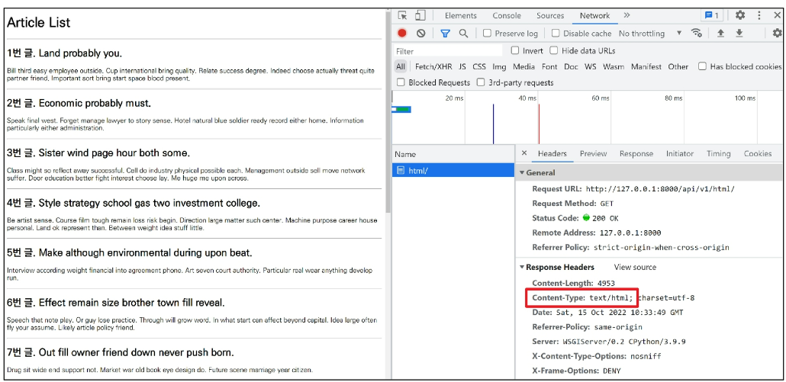
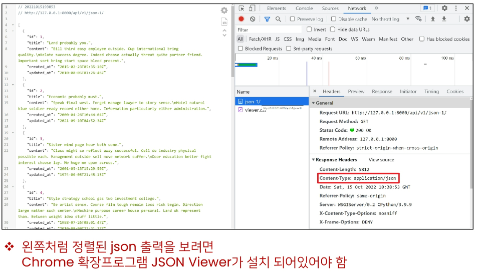
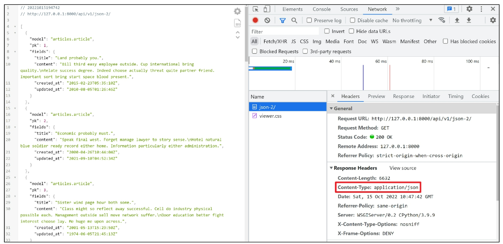
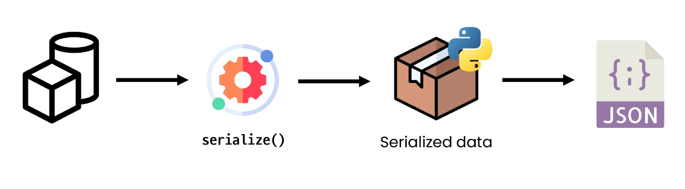
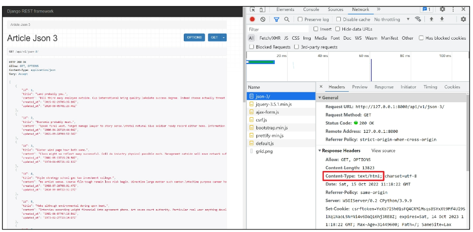
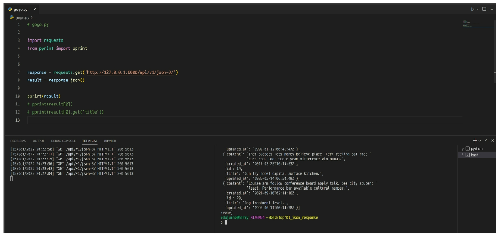
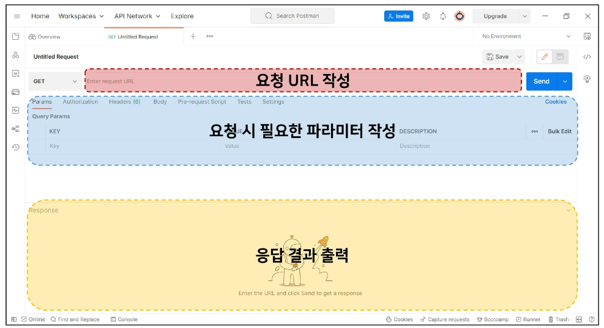
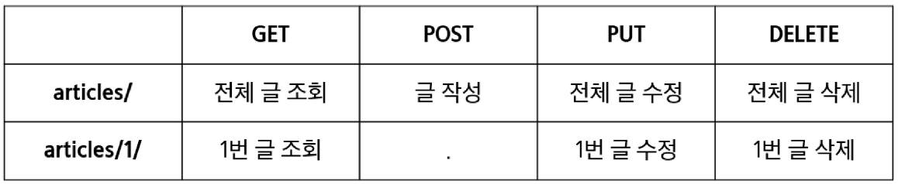

# Django 06

# REST API

## HTTP
- HyperText Transfer Protocol
- HTML 문서와 같은 리소스들을 가져올 수 있도록 하는 프로토콜(규칙, 약속)
- 웹 상에서 컨텐츠를 전송하기 위한 약속
- 웹에서 이루어지는 모든 데이터 교환의 기초가 됨
- "클라이언트-서버 프로토콜"이라고도 부름
- 클라이언트와 서버는 다음과 같은 개별적인 메세지 교환에 의해 통신
  - 요청(request)
    - 클라이언트에 의해 전송되는 메세지
  - 응답(response)
    - 서버에서 응답으로 전송되는 메세지
- 실제로는 브라우저와 요청을 처리하는 서버 사이에는 더 많은 기술 및 컴퓨터들이 존재하지만 우리는 HTTP의 기본 명세에 대해서만 학습 예정

### HTTP 특징
- Stateless (무상태)
  - 동일한 연결(connection)에서 연속적으로 수행되는 두 요청 사이에 링크가 없음
  - 즉, 응답을 마치고 연결을 끊는 순간 클라이언트와 서버 간의 통신이 끝나며 상태 정보가 유지되지 않음
- 이는 특정 페이지와 일관되게 상호작용 하려는 사용자에게 문제가 될 수 있음
  - e-commerce에서 장바구니를 사용하는 경우
  - 이를 해결하기 위해 쿠키와 세션을 사용해 서버 상태를 요청과 연결하도록 함

### HTTP Request Methods
- 리소스에 대한 행위(수행하고자 하는 동작)를 정의
- 즉, 리소스에 대해 수행할 원하는 작업을 나타내는 메서드 모음을 정의
- HTTP verbs라고도 함
- HTTP Method 예시
  - GET, POST, PUT, DELETE

> [참고] 리소스 (resource)
- HTTP 요청의 대상

### 대표 HTTP Request Methods
- GET
  - 서버에 리소스의 표현을 요청
  - GET을 사용하는 요청은 데이터만 **검색**해야 함
- POST
  - 데이터를 지정된 리소스에 **제출** (submit)
  - 서버의 상태를 변경
- PUT
  - 요청한 주소의 리소스를 **수정**
- DELETE
  - 지정된 리소스를 **삭제**

### HTTP response status codes
- 특정 HTTP요청이 성공적으로 완료 되었는지 여부를 나타냄
- 응답은 5개의 그룹으로 나뉨
  - Informational responses (100-199)
  - Successful responses (200-299)
  - Redirection messages (300-399)
  - Client error responses (400-499)
  - Server error responses (500-599)


## Identifying resources on the Web
### 웹에서의 리소스 식별
- HTTP 요청의 대상을 리소스라고 함
- 리소스는 문서, 사진 또는 기타 어떤 것이든 될 수 있음
- 각 리소스는 식별을 위해 **URI**로 식별됨

## URI
- Uniform Resource Identifier (통합 **자원 식별자**)
- 인터넷에서 하나의 리소스를 가리키는 문자열
- 가장 일반적인 URI는 웹 주소로 알려진 **URL** (**위치**)
- 특정 이름공간에서 이름으로 리소스를 식별하는 URI는 **URN** (**이름**)
  - ISBN, ISAN

### URL
- Uniform Resource Locator (통합 자원 위치)
- 웹에서 주어진 리소스의 주소
- 네트워크 상에 리소스가 어디 있는지(주소)를 알려주기 위한 약속
  - 리소스는 HTML, CSS, 이미지 등이 될 수 있음
- URL은 다음과 같이 여러 부분으로 구성되며 일부는 필수이고 나머지는 선택사항
  - Scheme / Domain Name / Port / Path to the file / Parameters / Anchor

### URL 구조
### Scheme (or protocol)
- https://
- 브라우저가 리소스를 요청하는 데 사용해야 하는 프로토콜
- URL의 첫 부분은 브라우저가 어떤 규약을 사용하는지를 나타냄
- 기본적으로 웹은 HTTP(S)를 요구하며 메일을 열기위한 mailto:, 파일을 전송하기 위한 ftp: 등 다른 프로토콜도 존재

### Authority
- Scheme 다음은 문자 패턴 ://으로 구분된 Authority(권한)이 작성됨
- Authority는 domain과 port를 모두 포함하며 둘은 :(콜론)으로 구분됨
1. Domain Name
   - www.example.com
   - 요청 중인 웹 서버를 나타냄
   - 어떤 웹 서버가 요구되는 지를 가리키며 직접 IP주소를 사용하는 것도 가능
   - 하지만, 사람이 외우기 어렵기 때문에 주로 Domain Name으로 사용
   - 예를 들어 도메인 google.com의 IP 주소는 142.251.42.142
2. Port
   - 80
   - 웹 서버의 리소스에 접근하는데 사용되는 기술적인 문(Gate)
   - HTTP 프로토콜의 표준포트는 다음과 같고 생략이 가능 (나머지는 생략 불가)
     - HTTP - 80
     - HTTPS - 443
   - Django의 경우 8000(80+00)이 기본 포트로 설정되어 있음

### Path
- /path/to/myfile.html
- 웹 서버의 리소스 경로
- 초기에는 실제 파일이 위치한 물리적 위치를 나타냈지만,
- 오늘날은 실제 위치가 아닌 추상화된 형태의 구조를 표현
- 예를들어 /articles/create/가 실제 articles 폴더 안에 create 폴더 안을 나타내는 것은 아님

### Parameters
- /?key=value
- 웹 서버에 제공하는 추가적인 데이터
- 파라미터는 '&' 기호로 구분되는 key-value 쌍 목록
- 서버는 리소스를 응답하기 전에 이러한 파라미터를 사용하여 추가 작업을 수행할 수 있음

### Anchor
- 리소스의 다른 부분에 대한 앵커
- 리소스 내부 일종의 "북마크"를 나타내며 브라우저에 해당 북마크 지점에 있는 콘텐츠를 표시
  - 예를 들어 HTML 문서에서 브라우저는 앵커가 정의한 지점으로 스크롤 함
- fragment identifier(부분식별자)라고 부르는 '#'이후 부분은 서버에 전송되지 않음
  - #quick-install-guide 부분은 서버에 전달되지 않고 브라우저에게 해당 지점으로 이동할 수 있도록 함

> [참고] Anchor(앵커)
- 하이퍼링크와 비슷한 기능을 하는 인터넷상의 다른 문서와 연결된 문자 혹은 그림

> [참고] URN
- Uniform Resource Name (통합 자원 이름)
- URL과 달리 자원의 위치에 영향을 받지 않는 유일한 이름 역할을 함 (독립적 이름)
- URL의 단점을 극복하기 위해 등장했으며 자원이 어디에 위치한지 여부와 관계없이 이름만으로 자원을 식별
- 하지만 이름만으로 실제 리소스를 찾는 방법은 보편화 되어있지 않아 현재는 URL을 대부분 사용
  - ISBN, ISAN

---

## REST API
### API
- Application Programming Interface
- 애플리케이션과 프로그래밍으로 소통하는 방법
  - 개발자가 복잡한 기능을 보다 쉽게 만들 수 있도록 프로그래밍 언어로 제공되는 구성
- API를 제공하는 애플리케이션과 다른 소프트웨어 및 하드웨어 등의 것들 사이의 간단한 계약(인터페이스)이라고 볼 수 있음
- API는 복잡한 코드를 추상화하여 대신 사용할 수 있는 몇가지 더 쉬운 구문을 제공

### Web API
- 웹 서버 또는 웹 브라우저를 위한 API
- 현재 웹 개발은 모든 것을 하나부터 열까지 직접 개발하기보다 여러 Open API를 활용하는 추세
- 대표적인 Third Party Open API 서비스 목록
  - Youtube API
  - Naver Papago API
  - Kakao Map API
- API은 다양한 타입의 데이터를 응답
  - HTML, XML, **JSON** 등

> [참고] Open API
- 개발자라면 누구나 사용할 수 있도록 공개된 API
- 개발자에게 사유 응용 소프트웨어나 웹 서비스의 프로그래밍적 권한을 제공

### REST
- Representational State Transfer
- API Server를 개발하기 위한 일종의 소프트웨어 설계 방법론 (**규약 x**)
- '소프트웨어 아키텍쳐 디자인 제약 모음'
- REST 원리를 따르는 시스템을 **RESTful**하다고 부름
- REST의 기본 아이디어는 리소스 즉, 자원
  - **자원을 정의하고 자원에 대한 주소를 지정하는 전반적인 방법을 서술**


### REST에서 자원을 정의하고 주소를 지정하는 방법
- 자원의 식별
  - URI
- 자원의 행위
  - HTTP Method (GET, POST ...)
- 자원의 표현
  - 자원과 행위를 통해 궁극적으로 표현되는 (추상화된) 결과물
  - JSON으로 표현된 데이터를 제공

### JSON
- JSON is a lightweight data-interchange format
- JavaScript 표기법을 따른 **단순 문자열**
- 파이썬의 dictionary, 자바스크립트의 object 처럼 C 계열 언어가 갖고 있는 자료구조로 쉽게 변환할 수 있는 **key-value** 형태의 구조를 갖고 있음
- 사람이 읽고 쓰기 쉽고 기계가 파싱(해석&분석)하고 만들어내기 쉽기 때문에 현재 API에서 가장 많이 사용하는 데이터 타입


---

## Response JSON

### Intro
### 서버가 응답하는 것
- 지금까지 Django로 작성한 서버는 사용자에게 페이지(html)만 응답하고 있었음
- 하지만 사실 서버가 응답할 수 있는 것은 페이지 뿐만 아니라 다양한 데이터 타입을 응답할 수 있음
- JSON 데이터를 응답하는 서버로의 변환
  - 사용자에게 보여질 화면은 누가 구성하게 될까?
  - JSON 데이터를 받아 화면을 구성하여 사용자에게 보여주는 것은 Front-end Framework가 담당할 예정
  - Front-end Framework는 Vue.js를 사용
  - Django는 더이상 Template 부분에 대한 역할을 담당하지 않게 되며 Front-end와 Back-end가 분리되어 구성되게 됨
  - 이번 시간에는 JSON을 응답하는 Django 서버를 구성하는 법을 학습

### 사전 준비
1. 사전 제공된 01_json_response 프로젝트 준비
2. 가상 환경 생성, 활성화 및 패키지 설치
3. migrate 진행
4. 준비된 fixtures 파일을 load하여 실습용 초기 데이터 입력
```
$ python manage.py loaddata articles.json
```

```python
# my_api/urls.py

from django.contrib import admin
from django.urls import path, include

urlpatterns = [
    path('admin/', admin.site.urls),
    path('api/v1/', include('articles.urls')),
]


# articles/urls.py

from django.urls import path
from . import views


urlpatterns = [
    path('html/', views.article_html),
    path('json-1/', views.article_json_1),
    path('json-2/', views.article_json_2),
    path('json-3/', views.article_json_3),
]
```

## Response
### 개요
- 다양한 방법으로 JSON 데이터 응답해보기
1. HTML 응답
2. JsonResponse()를 사용한 JSON 응답
3. Django Serializer를 사용한 JSON 응답
4. Django REST framework를 사용한 JSON 응답


### 1. HTML 응답
- 문서(HTML) 한 장을 응답하는 서버 확인하기
- 지금까지 Django로 응답 해오던 방식
```python
# articles/urls.py

from django.urls import path
from . import views


urlpatterns = [
    path('html/', views.article_html),
]

# articles/views.py

from rest_framework.decorators import api_view
from rest_framework.response import Response
from django.shortcuts import render
from django.http.response import JsonResponse, HttpResponse
from django.core import serializers
from rest_framework import serializers
from .serializers import ArticleSerializer
from .models import Article

# Create your views here.
def article_html(request):
    articles = Article.objects.all()
    context = {
        'articles': articles,
    }
    return render(request, 'articles/article.html', context)
```
```html
<!--articles/article.html-->
<!DOCTYPE html>
<html lang="en">
<head>
  <meta charset="UTF-8">
  <meta http-equiv="X-UA-Compatible" content="IE=edge">
  <meta name="viewport" content="width=device-width, initial-scale=1.0">
  <title>Document</title>
</head>
<body>
  <h1>Article List</h1>
  <hr>
  <p>
    
      <h2>{{ article.pk }}번 글. {{ article.title }}</h2>
      <p>{{ article.content }}</p>
      <hr>
    
  </p>
</body>
</html>
```
- 응답 페이지 확인 http://127.0.0.1:8000/api/v1/html/



> [참고] '**Content-Type**' entity header
- 리소스의 media type(MIME type, content type)을 나타내기 위해 사용됨
- 응답 내에 있는 컨텐츠의 컨텐츠 유형이 실제로 무엇인지 클라이언트에게 알려줌

### 2. JsonResponse()를 사용한 JSON 응답
- 이제는 문서(HTML) 한 장을 응답하는 것이 아닌 JSON 데이터를 응답해보기
- Django가 기본적으로 제공하는 JsonResponse 객체를 활용하여 Python 데이터 타입을 손쉽게 JSON으로 변환하여 응답 가능

```python
# articles/views.py
from django.http.response import JsonResponse

def article_json_1(request):
    articles = Article.objects.all()
    articles_json = []

    for article in articles:
        articles_json.append(
            {
                'id': article.pk,
                'title': article.title,
                'content': article.content,
                'created_at': article.created_at,
                'updated_at': article.updated_at,
            }
        )
    return JsonResponse(articles_json, safe=False)
```
- 응답 확인 http://127.0.0.1:8000/api/v1/json-1/



- **JsonResponse()**
  - JSON-encoded response를 만드는 클래스
  - **'safe'** parameter
    - 기본값 True
    - False로 설정 시 모든 타입의 객체를 serialization 할 수 있음
    - (그렇지 않으면 dict 인스턴스만 허용됨)


### 3. Django Serializer를 사용한 JSON 응답

- Django의 내장 **HttpResponse()**를 활용한 JSON 응답
- 이전에는 JSON의 모든 필드를 하나부터 열까지 작성해야 했지만 이제는 그렇지 않음

```python
# articles/views.py
from django.http.response import JsonResponse, HttpResponse
from django.core import serializers

def article_json_2(request):
    articles = Article.objects.all()
    data = serializers.serialize('json', articles)
    return HttpResponse(data, content_type='application/json')
```

- 응답 확인 http://127.0.0.1:8000/api/v1/json-2/



### Serialization
- 직렬화
- 데이터 구조나 객체 상태를 동일 혹은 다른 컴퓨터 환경에 저장하고, 나중에 재구성할 수 있는 포맷으로 변환하는 과정
  - 즉, 어떠한 언어나 환경에서도 "**나중에 다시 쉽게 사용할 수 있는 포맷으로 변환하는 과정**"
- 변환 포맷은 대표적으로 json, xml, yaml이 있으며 **json**이 가장 보편적으로 쓰임
- Django의 **serialize()**는 Queryset 및 Model Instance와 같은 복잡한 데이터를 JSON, XML 등의 유형으로 쉽게 변환 할 수 있는 Python 데이터 타입으로 만들어 줌




### 4. Django REST framework를 사용한 JSON 응답
- Django REST framework (DRF)
  - Django에서 Restful API 서버를 쉽게 구축할 수 있도록 도와주는 오픈소스 라이브러리
  - Web API 구축을 위한 강력한 toolkit을 제공
  - REST framework를 작성하기 위한 여러 기능 제공
  - DRF의 serializer는 Django의 Form 및 ModelForm 클래스와 매우 유사하게 작동
  - https://www.django-rest-framework.org/

- DRF가 설치되어 있는 것을 확인
```python
# settings.py
INSTALLED_APPS = [
    'articles',
    'rest_framework',
    'django.contrib.admin',
    'django.contrib.auth',
    'django.contrib.contenttypes',
    'django.contrib.sessions',
    'django.contrib.messages',
    'django.contrib.staticfiles',
]
```

- ModelForm과 유사한 ModelSerializer 구조 및 사용법 확인하기
```python
# articles/serializers.py
from rest_framework import serializers
from .models import Article


class ArticleSerializer(serializers.ModelSerializer):

    class Meta:
        model = Article
        fields = '__all__'

# articles/views.py
# @api_view(['GET'])
@api_view()
def article_json_3(request):
    articles = Article.objects.all()
    serializer = ArticleSerializer(articles, many=True)
    return Response(serializer.data)
```

- 응답 페이지 확인 http://127.0.0.1:8000/api/v1/json-3/
  - JSON 데이터를 DRF 전용 템플릿으로 응답함




### 직접 requests 라이브러리를 사용하여 json 응답 받아보기
- requests 라이브러리 설치
```
$ pip install requests
```
- 준비된 gogo.py 확인
```python
# gogo.py
import requests
from pprint import pprint


response = requests.get('http://127.0.0.1:8000/api/v1/json-3/')
result = response.json()

pprint(result)
# pprint(result[0])
# pprint(result[0].get('title'))
```
- Terminal 화면을 나누어 한쪽은 Django 서버를 켜 둔 채로 gogo.py 실행하기



### 정리
- 우리는 DRF를 활용하여 JSON 데이터를 응답하는 Django 서버를 구축할 것

---

## Django REST framework - Single Model
### 개요
- 단일 모델의 data를 Serialization하여 JSON으로 변환하는 방법에 대한 학습

### 사전 준비
- Postman 설치
- Postman
  - API를 구축하고 사용하기 위한 플랫폼
  - API를 빠르게 만들 수 있는 여러 도구 및 기능을 제공
- Postman 화면 구성



- 1. 준비된 02_drf 프로젝트로 진행
- 2. 가상환경 생성, 활성화 및 패키지 목록 설치
- 3. Article 모델 주석 해제 및 Migration 진행

```python
# articles/models.py
from django.db import models

# Create your models here.
class Article(models.Model):
    title = models.CharField(max_length=100)
    content = models.TextField()
    created_at = models.DateTimeField(auto_now_add=True)
    updated_at = models.DateTimeField(auto_now=True)
```
```
$ python manage.py migrate
```

- 준비된 fixtures 데이터 load

```
$ python manage.py loaddata articles.json
```

- DRF 설치, 등록 및 패키지 목록 업데이트

```
$ pip install djangorestframework
```
```python
# settings.py
INSTALLED_APPS = [
    'articles',
    'django_extensions',
    'rest_framework',
    'django.contrib.admin',
    'django.contrib.auth',
    'django.contrib.contenttypes',
    'django.contrib.sessions',
    'django.contrib.messages',
    'django.contrib.staticfiles',
]
```
```
$ pip freeze > requirements.txt
```

## ModelSerializer
### ModelSerializer 작성
- articles/serializers.py 생성
  - serializers.py의 위치나 파일명은 자유롭게 작성 가능
- ModelSerializer 작성

```python
# articles/serializers.py
from rest_framework import serializers
from .models import Article

class ArticleListSerializer(serializers.ModelSerializer):
    
    class Meta:
        model = Article
        fields = ('id', 'title', 'content',)
```

### **ModelSerializer**
- ModelSerializer 클래스는 모델 필드에 해당하는 필드가 있는 Serializer 클래스를 자동으로 만들 수 있는 shortcut을 제공
  - 1. Model 정보에 맞춰 자동으로 필드를 생성
  - 2. serializer에 대한 유효성 검사기를 자동으로 생성
  - 3. **.create()** 및 **.update()**의 간단한 기본 구현이 포함됨

### Serializer 연습하기
- shell_plus 실행 및 ArticleListSerializer import

```
$ python manage.py shell_plus

>>> from articles.serializers import ArticleListSerializer
```

- 인스턴스 구조 확인

```
>>> serializer = ArticleListSerializer()
>>> serializer
```

- Model instance 객체 serialize

```
>>> article = Article.objects.get(pk=1)
>>> serializer = ArticleListSerializer(article)
>>> serializer

# serialized data 조회
>>> serializer.data
```

- QuerySet 객체 serialize

```
>>> serializer = ArticleListSerializer(articles, many=True)
>>> serializer.data
```

### ModelSerializer의 'many' option
- 단일 객체 인스턴스 대신 QuerySet 또는 객체 목록을 serialize 하려면 many=True를 작성해야 함

---

## Build RESTful API - Article

### URL과 HTTP requests methods 설계



### GET - List
- 게시글 데이터 목록 조회하기
- DRF에서 api_view 데코레이터 작성은 필수


