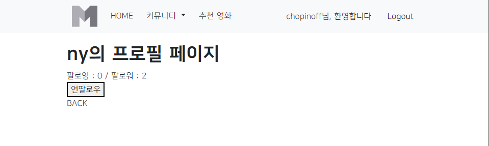
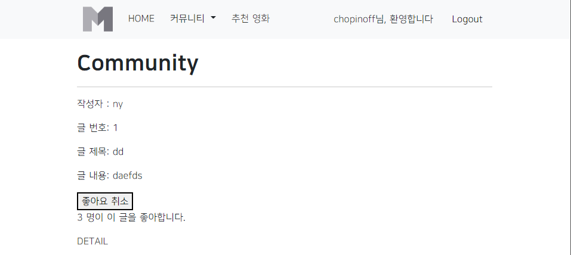
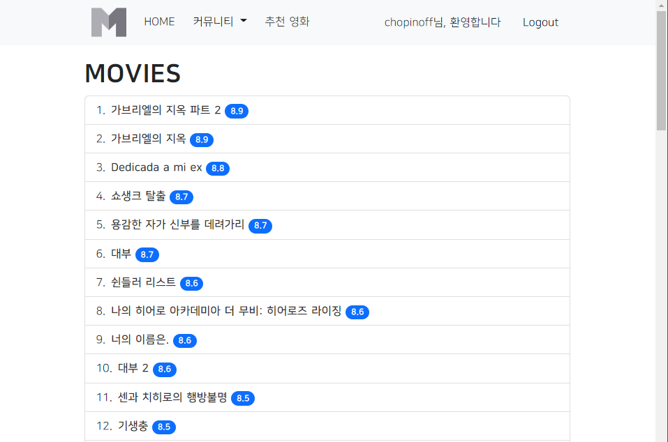
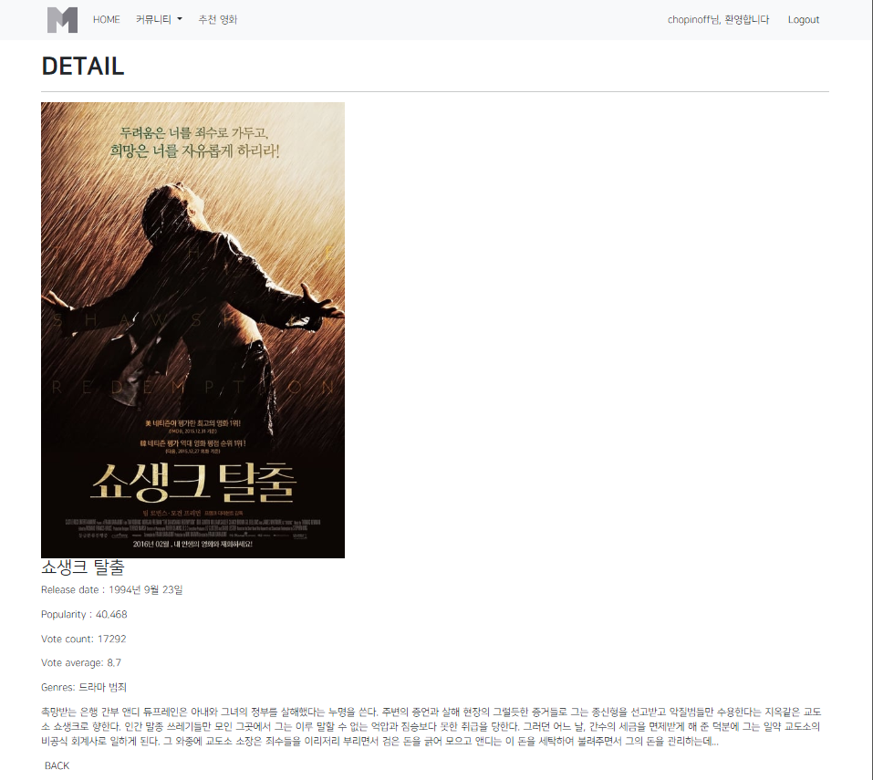
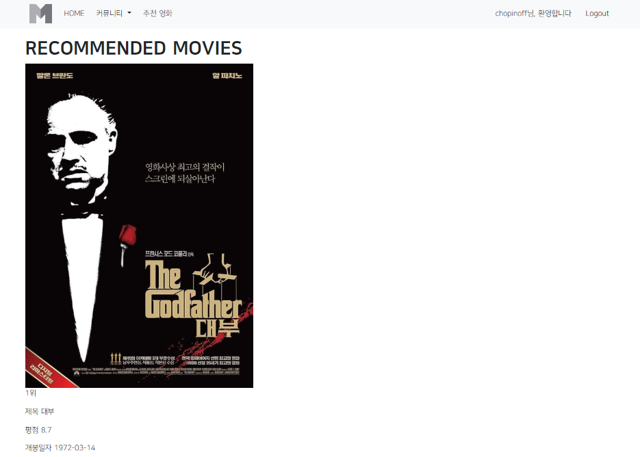
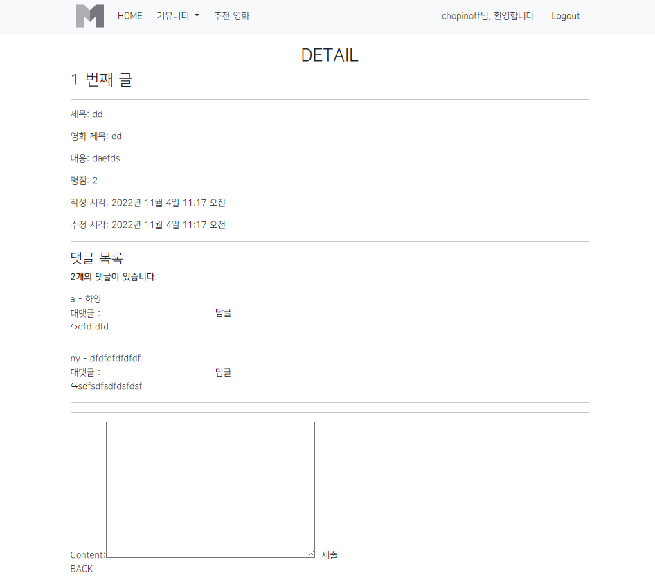

# PJT 08

### 이번 pjt 를 통해 배운 내용

* 이때까지 배운걸 한번에 다 써먹으려니까 쉽지않았다...

* 이제 혼자 토이프로젝트 만들 수 있을 것 같다! 

## A. 유저 팔로우 기능

* 요구 사항 : 
* 프로필 페이지에 팔로워 수와 팔로잉 수를 표시
* 프로필 페이지에 해당 사용자를 팔로우 할 수 있는 버튼을 표시
* 인증된 사용자만 다른 사용자를 팔로우 할 수 있으며, 사용자는 자기 자신을 팔로우 할 수 없음
* 팔로우 버튼을 클릭하는 경우, AJAX 통신을 이용하여 서버에서 JSON 데이터를 받아와 상황에 맞게 HTML 화면을 구성

* 결과 : 


  
  * 문제 접근 방법 및 코드 설명
  * form 요소 선택위해 id 속성 지정 및 선택
  * form 요소에 이벤트 핸들러 작성 및 submit 이벤트 취소
  * axios로 POST 요청하기위해 url에 작성할 user pk와 csrf token 준비
  * views.py에서 팔로우 여부를 확인하기 위한 is_followed 변수 작성 및 JSON 응답
  * view 함수에서 응답한 is_followed를 사용해 버튼 토글하기
  * 팔로워, 팔로잉 인원 수 연산은 view 함수에서 진행하여 결과를 응답으로 전달
  * view 함수에서 응답한 연산 결과를 사용해 각 태그의 인원 수 값 변경하기
  
  ```html
  <!-- accounts/profile.html-->
  

  
    <h1>{{ person.username }}의 프로필 페이지</h1>
    
      <div>
        <div>
          팔로잉 : <span id="following-cnt"></span>  
          / 팔로워 : <span id="follower-cnt"></span>
        </div>
        
          <div>
            <form id="follow-form" data-user-id="{{ person.pk }}">
              
              
                <button id="follow-btn">언팔로우</button>
              
                <button id="follow-btn">팔로우</button>
              
            </form>
          </div>
        
      </div>
    
  <a href="">BACK</a>
  
  
  <script>
    
      const followForm = document.querySelector('#follow-form')
      const csrftoken = document.querySelector('[name=csrfmiddlewaretoken]').value

      followForm.addEventListener('submit', function(event){
        event.preventDefault()
        const userId = event.target.dataset.userId
        
        axios({
          method : 'post',
          url : `/accounts/${userId}/follow/`,
          headers : { 'X-CSRFToken' : csrftoken },
        })
        .then(function (response) {
          const followBtn = document.querySelector('#follow-btn')
          if (response.data.is_follow) {
            followBtn.innerText = '언팔로우'
          } else {
            followBtn.innerText = '팔로우'
          }
          
          const followerCnt = document.querySelector('#follower-cnt')
          followerCnt.innerText = response.data.follower_cnt

          const followingCnt = document.querySelector('#following-cnt')
          followingCnt.innerText = response.data.following_cnt
        })
      })
    
      
  </script>
    
  ```
  ```python
  # accounts/views.py
  @require_POST
  def follow(request, user_pk):
      if request.user.is_authenticated:
          person = get_object_or_404(get_user_model(), pk=user_pk)
          user = request.user
          if person != user:
              if person.followers.filter(pk=user.pk).exists():
                  person.followers.remove(user)
                  is_follow = False
              else:
                  person.followers.add(user)
                  is_follow = True
      data = {
          'is_follow' : is_follow,
          'follower_cnt' : person.followers.count(),
          'following_cnt' : person.followings.count(),
      }
      return JsonResponse(data)
  ```
  
  * 이 문제에서 어려웠던점
  * axios 요청 과정? 
  
  * 내가 생각하는 이 문제의 포인트
  * axios로 요청하고 응답받은 JSON 데이터 적절히 사용하기

-----

## B. 리뷰 좋아요 기능

* 요구 사항 : 
* 전체 리뷰 목록 조회 페이지에 좋아요 버튼과 좋아요 개수를 표시
* 이미 좋아요 버튼을 누른 경우 좋아요 취소 버튼을 표시
* 인증된 사용자만 리뷰에 좋아요 할 수 있음
* 좋아요 버튼을 클릭하는 경우, AJAX 통신을 이용하여 서버에서 JSON 데이터를
받아와 상황에 맞게 HTML 화면을 구성

* 결과 :


  
  * 문제 접근 방법 및 코드 설명
  * 좋아요 비동기 적용은 "팔로우와 동일한 흐름 + forEach() & querySelectorAll()
  * index 페이지 각 게시글에 좋아요 버튼이 있기 때문
  * form을 전부 선택 후 (querySelectorAll) -> eventListener 추가 (forEach)
  * 몇번째 정보를 속성으로 (article.pk) 정보 전달
  * views.py (백) 에서 버튼이 눌렸는지 여부를 전달해주는 is_like 변수 만들고, json으로 응답 (JsonResponse)
  * 좋아요 누른 사람 수를 보여주기 위해 'like_cnt': article.like_users.count()도 같이 JsonResponse로 전달해줌
  * JS에서 isLike와 likeCnt로 data 가져와주고,likeCntText 변수로 좋아요 수 span 태그 선택하고 innerText를 likeCnt로 변경!
  
  ```html
  <!-- community/index.html-->
  

  
    <h1>Community</h1>
    <hr>
    
      <p>작성자 : <a href="">{{ review.user }}</a></p>
      <p>글 번호: {{ review.pk }}</p>
      <p>글 제목: {{ review.title }}</p>
      <p>글 내용: {{ review.content }}</p>
      <form id="like-form" data-review-id="{{ review.pk }}">
        
        
          <button id="like-{{ review.pk }}">좋아요 취소</button>
        
          <button id="like-{{ review.pk }}">좋아요</button>
        
      </form>
      <p>
        <span id="like-cnt-{{ review.pk }}"></span> 명이 이 글을 좋아합니다.
      </p>
      <a href="">DETAIL</a>
      <hr>
    
  
  
    <script>
      const formList = document.querySelectorAll("#like-form")
      formList.forEach(function (form) {
        form.addEventListener('submit', function (event) {
          event.preventDefault()
          const reviewId = event.target.dataset.reviewId
          const csrftoken = document.querySelector('[name=csrfmiddlewaretoken]').value
          axios({
            method : "post",
            url : `/community/${reviewId}/like/`,
            headers : {'X-CSRFToken' : csrftoken}
          })
          .then(function (response) {
            const isLike = response.data.is_like
            const likeBtn = document.querySelector(`#like-${ reviewId }`)

            if (isLike) {
              likeBtn.innerText = '좋아요 취소'
            } else {
              likeBtn.innerText = '좋아요'
            }
            
            const likeCnt = response.data.like_cnt
            const likeCntText = document.querySelector(`#like-cnt-${ reviewId }`)
            likeCntText.innerText = likeCnt
          })
          .catch(function (error) {
            console.log(error.response)
          })
        })
      })
    </script>
  
  ```
  ```python
  # community/views.py
  @require_POST
  def like(request, review_pk):
      if request.user.is_authenticated:
          review = get_object_or_404(Review, pk=review_pk)
          user = request.user

          if review.like_users.filter(pk=user.pk).exists():
              review.like_users.remove(user)
              is_like = False
          else:
              review.like_users.add(user)
              is_like = True
      data = {
          'is_like' : is_like,
          'like_cnt' : review.like_users.count()
      }
      return JsonResponse(data)

  ```
  
  * 이 문제에서 어려웠던점
  * forEach() & querySelectorAll() 사용해서 비동기 적용하는 과정?
  
  * 내가 생각하는 이 문제의 포인트
  * 버튼 속성 정보 전달해주기

-----

## C. Movies 앱 기능

* 요구 사항 : 
* 1.전체 영화 목록 조회 (index)
* 2.단일 영화 상세 조회 (detail)
* 3.영화 추천 기능 (recommended)


* 결과 : 






  
  * 문제 접근 방법 및 코드 설명
  * 1,2 번은 지난 PJT 내용과 겹침
  * but, detail 페이지로 데이터 받아와서 출력해주는 작업이 까다로웠음
  * 개인적으로 로직 짜서 해결!
  * 영화추천 기능은 겨울이 다가오니까! 1990년대 이전, 로맨스&드라마 장르의 고전 영화들을 평점순으로 10개 추천해줬음!!

  ```html
  <!--movies/detail.py-->
  

  
    <h1>DETAIL</h1>
    <hr>
    <div>
      
      <div>
        <h3>{{ movie.title }}</h3>
        <p>Release date : {{ movie.release_date }}</p>
        <p>Popularity : {{ movie.popularity }}</p>
        <p>Vote count: {{ movie.vote_count }}</p>
        <p>Vote average: {{ movie.vote_average }}</p>
        <p>Genres: {{ genres_list|join:" " }}</p>
        <p>{{ movie.overview }}</p>
      </div>
    </div>

    <input type="submit" value="BACK" onclick="location.href=''">
  

  
    <script>
      
    </script>
  
  ```
  ```python
  # movies/views.py
  @require_safe
  def detail(request, movie_pk):
      movie = Movie.objects.get(pk=movie_pk)    
      genres_list = []
      genresid = list(movie.genres.values())

      for genreid in genresid:
          genres_list.append(genreid['name'])
  
          
      context = {
          "movie" : movie,
          'genres_list': genres_list,
          'genresid': genresid,
      }
      return render(request, 'movies/detail.html', context)
  ```
  
  ```html

  <!-- movies/recommended.html-->
  
  
  <h1>RECOMMENDED MOVIES</h1>
    
      
      <p>{{ recom|slice:":1"|join:" " }}위</p>
      <p>제목 {{ recom|slice:"1:2"|join:" " }}</p>
      <p>평점 {{ recom|slice:"2:3"|join:" " }}</p>
      <p>개봉일자 {{ recom|slice:"3:4"|join:" " }}</p>
      <hr>
    
  
  ```
  ```python
  # movies/views.py
  @require_safe
  def recommended(request):
      movies = Movie.objects.all()
      recommended_list = []

      i = 1
      for movie in movies:
          
          genres_list = []
          genresid = list(movie.genres.values())
          for genreid in genresid:
              genres_list.append(genreid['name'])
          if int(str(movie.release_date)[:4]) < 1990 and ("드라마" in genres_list or "로맨스" in genres_list):
              recommended_list.append([str(i),movie.title, movie.vote_average, str(movie.release_date),movie.poster_path])
              i += 1
      context = {
          'recommended_list' : recommended_list[:10],
      }
      return render(request, 'movies/recommended.html', context)

  ```
  
  * 이 문제에서 어려웠던점
  * 자율주제라 흥미로웠습니다!!
  
  * 내가 생각하는 이 문제의 포인트
  * html에서 필터적용하기?!

-----
## D. 댓글 좋아요 및 대댓글 기능

* 요구 사항 : 
* 단일 리뷰 상세 조회 페이지에 댓글 좋아요 버튼과 좋아요 개수를 표시
* 각 댓글에 하위 댓글을 작성할 수 있는 대댓글 기능을 완성


* 결과 : 


  
  * 문제 접근 방법 및 코드 설명
  * Recomment 모델따로 생성해서 로직 구성!
  * create_recomment 함수도 따로 생성
  
  ```html
  <!-- community/detail.html-->
  

  
    <h2 class="text-center">DETAIL</h2>
    <h3>{{ review.pk }} 번째 글</h3>
    <hr>
    <p>제목: {{ review.title }}</p>
    <p>영화 제목: {{ review.movie_title }}</p>
    <p>내용: {{ review.content }}</p>
    <p>평점: {{ review.rank }}</p>
    <p>작성 시각: {{ review.created_at }}</p>
    <p>수정 시각: {{ review.updated_at }}</p>
    <hr>
    <h4>댓글 목록</h4>
    
      <p><b>{{ comments|length }}개의 댓글이 있습니다.</b></p>
    

    
      <div>
        {{ comment.user }} - {{ comment.content }}

      
            
        <form action="" method="POST">
          
          

            
          
            {{ recom.label }} : {{ recom }}

            
          
          

          <input type="hidden" name="comment" value={{comment.pk}}>
          <input type="submit" value="답글">

        </form>

        
        ↪{{recom}}<br>
        
      <hr>

      </div>
    
      <p><b>댓글이 없어요..</b></p>
    
    <hr>
    
      <form action="" method="POST">
        
        {{ comment_form }}
        <input type="submit">
      </form>
    
      <a href="">[댓글을 작성하려면 로그인하세요.]</a>
    
    <a href="">BACK</a>
  
  ```
  ```python
  # community/views.py
  
  @login_required
  def create_recomment(request, review_pk):
      filled_form = ReCommentForm(request.POST)
      if filled_form.is_valid():
          filled_form.save()
      return redirect('community:detail', review_pk)
    

  ```
  
  * 이 문제에서 어려웠던점
  * 댓글 좋아요기능은 구현하지 못했다ㅜㅜ
  * 나중에 따로 구현해봐야지!
  
  * 내가 생각하는 이 문제의 포인트
  * 그냥 대댓글 로직자체가 신선하고 그자체가 포인트임!!

-----

....

문제 푼 내용을 기반으로 적어주세요.

# 후기

* 오늘 프로젝트는 쉬워 보였지만 나의 착각이었다. (ㅇㄱㄹㅇ)
* 좀 자신감 붙은거같지만 더더더 열심히 해야지!
* 토이프로젝트 열정이 불탄다!

