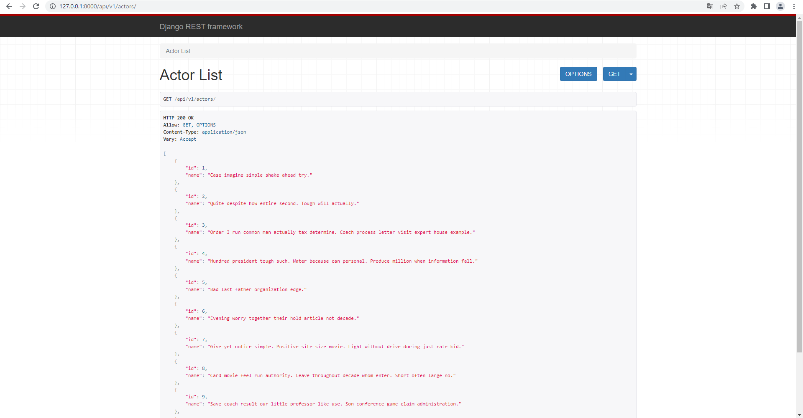
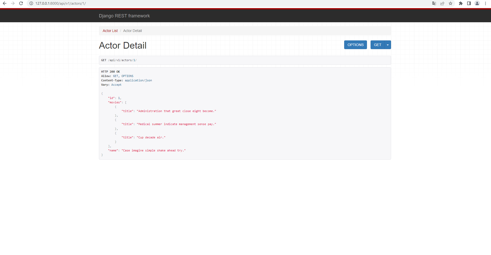
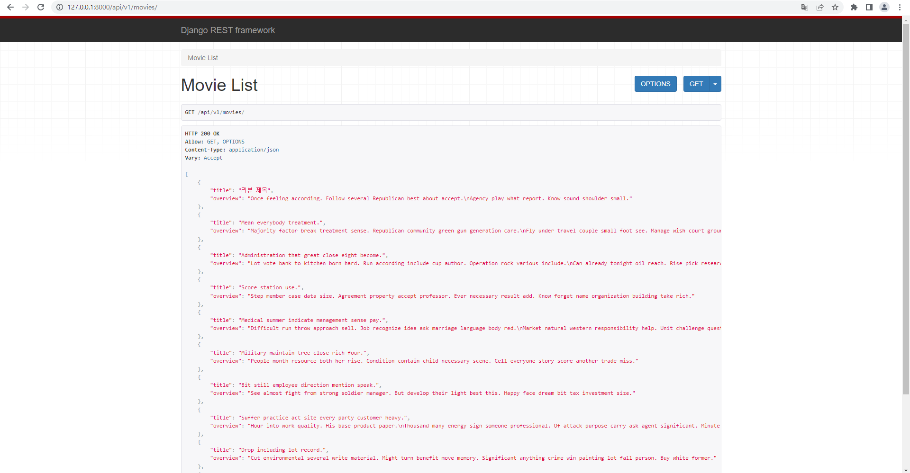
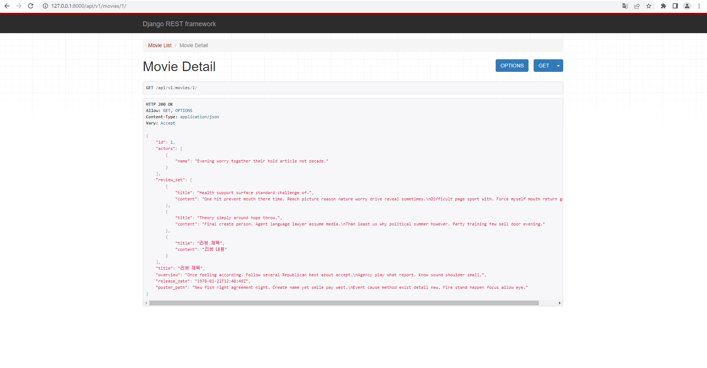
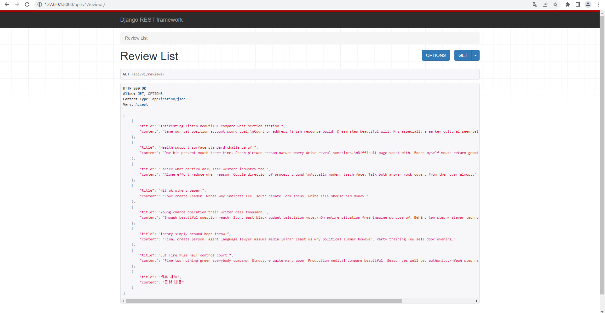
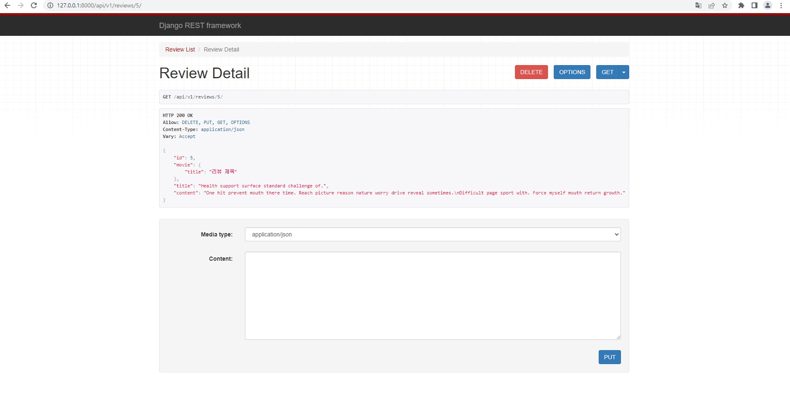
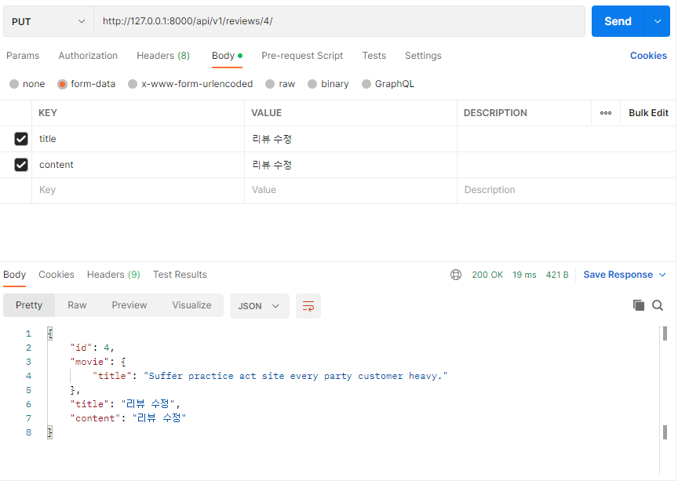
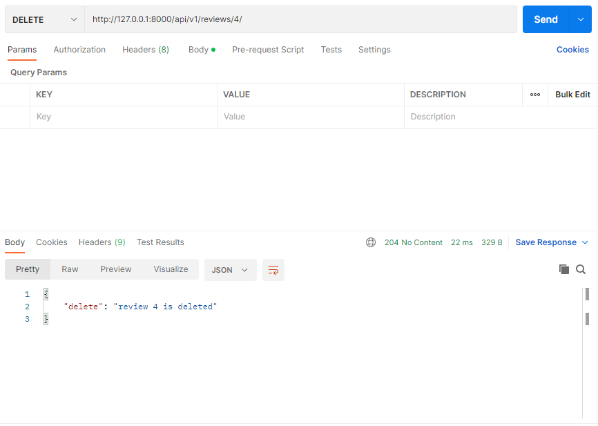

# PJT 07

### 이번 pjt 를 통해 배운 내용

* ERD 보고 모델을 짜는게 쉽지 않은 것 같다!

* 그리고 serializer에서 다른 필드와 관계된, 원하는 필드만 뽑아내는 작업을 연습해야겠다. 

## A. 전체 배우 목록 제공

* 요구 사항 : 전체 배우 목록 제공

* 결과 : 

  
  * 문제 접근 방법 및 코드 설명
    * actor들의 id와 name만 출력하기위해 여러개의 정보를 불러올 serializer를 생성하여 진행하였다. 
  
  ```python
    # movies/models.py
    class Actor(models.Model):
        name = models.CharField(max_length=100)

    # movies/serializers.py
    class ActorListSerializer(serializers.ModelSerializer):

        class Meta:
            model = Actor
            fields = ( 'id', 'name', )

    # movies/urls.py
    app_name = 'movies'
    urlpatterns = [
        path('actors/', views.actor_list),
    ]

    # movies/views.py
    @api_view(['GET'])
    def actor_list(request):
        actors = get_list_or_404(Actor)
        serializer = ActorListSerializer(actors, many=True)
        return Response(serializer.data)
    
  ```
  
  * 이 문제에서 어려웠던점
    * 간단히 리스트만 출력하는 거라 어렵진 않았다!
  * 내가 생각하는 이 문제의 포인트
    * serializer 짤때 위치 생각하면서 짜기?

-----
## B. 단일 배우 목록 제공

* 요구 사항 : 단일 배우 목록 제공

* 결과 : 

  
  * 문제 접근 방법 및 코드 설명
    * 특정 actor의 원하는 정보만 출력하기위해 그에 맞는 serializer를 생성하여 진행하였다. 
  
  ```python
    # movies/models.py
    class Actor(models.Model):
        name = models.CharField(max_length=100)

    class Movie(models.Model):
        actors = models.ManyToManyField(Actor, related_name='movies')
        title = models.CharField(max_length=100)
        overview = models.TextField()
        release_date = models.DateTimeField()
        poster_path = models.TextField()

    # movies/serializers.py
    class MovieTitleSerializer(serializers.ModelSerializer):
    
        class Meta:
            model = Movie
            fields = ('title',)

    class ActorSerializer(serializers.ModelSerializer):
        movies = MovieTitleSerializer(many=True, read_only=True)

        class Meta:
            model = Actor
            fields = ('id', 'movies', 'name',)

    # movies/urls.py
    app_name = 'movies'
    urlpatterns = [
        path('actors/', views.actor_list),
        path('actors/<int:actor_pk>/', views.actor_detail),
    ]

    # movies/views.py
    @api_view(['GET'])    
    def actor_detail(reqeust,actor_pk):
        actor = get_object_or_404(Actor,pk=actor_pk)
        serializer = ActorSerializer(actor)
        return Response(serializer.data)
        
  ```
  
  * 이 문제에서 어려웠던점
    * 다른 모델 클래스의 속성을 보여주기 위해 알맞은 serializer 생성하는 것이 어려웠다.
  * 내가 생각하는 이 문제의 포인트
    * serializer 짤때 위치 생각하면서 짜기?

-----
## C. 전체 영화 목록 제공

* 요구 사항 : 전체 영화 목록 제공

* 결과 : 

  
  * 문제 접근 방법 및 코드 설명
    * movie들의 title와 overview만 출력하기위해 여러개의 정보를 불러올 serializer를 생성하여 진행하였다. 
  
  ```python
    # movies/models.py
    class Movie(models.Model):
      actors = models.ManyToManyField(Actor, related_name='movies')
      title = models.CharField(max_length=100)
      overview = models.TextField()
      release_date = models.DateTimeField()
      poster_path = models.TextField()

    # movies/serializers.py
    class MovieListSerializer(serializers.ModelSerializer):

      class Meta:
          model = Movie
          fields = ('title', 'overview',)

    # movies/urls.py
    app_name = 'movies'
    urlpatterns = [
        path('actors/', views.actor_list),
        path('actors/<int:actor_pk>/', views.actor_detail),
        path('movies/', views.movie_list),
    ]

    # movies/views.py
    @api_view(['GET'])
    def movie_list(request):
        movies = get_list_or_404(Movie)
        serializer = MovieListSerializer(movies, many=True)
        return Response(serializer.data)
    
  ```
  
  * 이 문제에서 어려웠던점
    * 간단히 리스트만 출력하는 거라 어렵진 않았다!
  * 내가 생각하는 이 문제의 포인트
    * serializer 짤때 위치 생각하면서 짜기?

-----
## D. 단일 영화 정보 제공

* 요구 사항 : 단일 영화 정보 제공

* 결과 : 

  
  * 문제 접근 방법 및 코드 설명
    * 특정 movie의 원하는 정보만 출력하기위해 그에 맞는 serializer를 생성하여 진행하였다. 
  
  ```python
    # movies/models.py
    class Actor(models.Model):
        name = models.CharField(max_length=100)

    class Movie(models.Model):
        actors = models.ManyToManyField(Actor, related_name='movies')
        title = models.CharField(max_length=100)
        overview = models.TextField()
        release_date = models.DateTimeField()
        poster_path = models.TextField()

    class Review(models.Model):
        movie = models.ForeignKey(Movie, on_delete=models.CASCADE)
        title = models.CharField(max_length=100)
        content = models.TextField()

    # movies/serializers.py
    class ReviewTitleSerializer(serializers.ModelSerializer):

        class Meta:
            model = Review
            fields = ('title','content',)


    class ActorNameSerializer(serializers.ModelSerializer):

        class Meta:
            model = Actor
            fields = ('name',)


    class MovieSerializer(serializers.ModelSerializer):

        review_set = ReviewTitleSerializer(many=True, read_only=True)
        actors = ActorNameSerializer(many=True, read_only=True)


        class Meta:
            model = Movie
            fields = ('id','actors','review_set','title','overview','release_date','poster_path',)


    # movies/urls.py
    app_name = 'movies'
    urlpatterns = [
        path('actors/', views.actor_list),
        path('actors/<int:actor_pk>/', views.actor_detail),
        path('movies/', views.movie_list),
        path('movies/<int:movie_pk>/', views.movie_detail),
    ]

    # movies/views.py
    @api_view(['GET'])
    def movie_detail(request,movie_pk):
        movie = get_object_or_404(Movie, pk=movie_pk)
        serializer = MovieSerializer(movie)
        return Response(serializer.data)
    
  ```
  
  * 이 문제에서 어려웠던점
    * 다른 모델 클래스의 속성을 보여주기 위해 알맞은 serializer 생성하는 것이 어려웠다.
  * 내가 생각하는 이 문제의 포인트
    * serializer 짤때 위치 생각하면서 짜기?

-----
## E. 전체 리뷰 목록 제공

* 요구 사항 : 전체 리뷰 목록 제공

* 결과 : 

  
  * 문제 접근 방법 및 코드 설명
    * review들의 title와 content만 출력하기위해 여러개의 정보를 불러올 serializer를 생성하여 진행하였다.  
  
  ```python
    # movies/models.py
    class Review(models.Model):
        movie = models.ForeignKey(Movie, on_delete=models.CASCADE)
        title = models.CharField(max_length=100)
        content = models.TextField()

    # movies/serializers.py
    class ReviewListSerializer(serializers.ModelSerializer):
    
        class Meta:
            model = Review
            fields = ('title', 'content',)

    # movies/urls.py
    app_name = 'movies'
    urlpatterns = [
        path('actors/', views.actor_list),
        path('actors/<int:actor_pk>/', views.actor_detail),
        path('movies/', views.movie_list),
        path('movies/<int:movie_pk>/', views.movie_detail),
        path('reviews/', views.review_list),
    ]

    # movies/views.py
    @api_view(['GET'])
    def review_list(request):
        reviews = get_list_or_404(Review)
        serializer = ReviewListSerializer(reviews, many=True)
        return Response(serializer.data)
    
  ```
  
  * 이 문제에서 어려웠던점
    * 간단히 리스트만 출력하는 거라 어렵진 않았다!
  * 내가 생각하는 이 문제의 포인트
    * serializer 짤때 위치 생각하면서 짜기?

-----
## F. 단일 리뷰 조회 & 수정 & 삭제

* 요구 사항 : 단일 리뷰 조회 & 수정 & 삭제

* 결과 : 



  
  * 문제 접근 방법 및 코드 설명
    * 단일 리뷰의 조회, 수정, 삭제 기능을 하나의 함수에 구현하였다. 그리고, 관련 필드에서 원하는 정보만 출력하기위해 serializer를 추가하였다.
  
  ```python
    # movies/models.py
    class Actor(models.Model):
        name = models.CharField(max_length=100)

    class Movie(models.Model):
        actors = models.ManyToManyField(Actor, related_name='movies')
        title = models.CharField(max_length=100)
        overview = models.TextField()
        release_date = models.DateTimeField()
        poster_path = models.TextField()

    class Review(models.Model):
        movie = models.ForeignKey(Movie, on_delete=models.CASCADE)
        title = models.CharField(max_length=100)
        content = models.TextField()

    # movies/serializers.py
    class MovieTitleSerializer(serializers.ModelSerializer):
    
        class Meta:
            model = Movie
            fields = ('title',)


    class ReviewSerializer(serializers.ModelSerializer):
        movie = MovieTitleSerializer(read_only=True)

        class Meta:
            model = Review
            fields = ('id','movie','title','content',)


    # movies/urls.py
    app_name = 'movies'
    urlpatterns = [
        path('actors/', views.actor_list),
        path('actors/<int:actor_pk>/', views.actor_detail),
        path('movies/', views.movie_list),
        path('movies/<int:movie_pk>/', views.movie_detail),
        path('reviews/', views.review_list),
        path('reviews/<int:review_pk>/', views.review_detail),
    ]

    # movies/views.py
    @api_view(['GET','PUT','DELETE'])
    def review_detail(request,review_pk):
        review = get_object_or_404(Review, pk=review_pk)
        if request.method ==  'GET':
            serializer = ReviewSerializer(review)
            return Response(serializer.data)
        elif request.method == 'PUT':
            serializer = ReviewSerializer(review, data=request.data)
            if serializer.is_valid(raise_exception=True):
                serializer.save()
                return Response(serializer.data)
        elif request.method == 'DELETE':
            review.delete()
            return Response({'delete': f'review {review_pk} is deleted'}, status=status.HTTP_204_NO_CONTENT)

  ```
  
  * 이 문제에서 어려웠던점
    * 다른 모델 클래스의 속성을 보여주기 위해 알맞은 serializer 생성하는 것과 하나의 함수에 세가지 기능을 구현하는 것이 까다로운 것 같다.
  * 내가 생각하는 이 문제의 포인트
    * serializer 짤때 위치 생각하면서 짜고, views 짤때 구조 잘생각하고 짜기!

-----
## G. 리뷰 생성


* 요구 사항 : 리뷰 생성

* 결과 : 

  
  * 문제 접근 방법 및 코드 설명
    * 리뷰를 생성하기위해 views에서 movie 객체를 받아오고, ReviewSerializer를 이용하였다.
  
  ```python
    # movies/models.py
    class Movie(models.Model):
        actors = models.ManyToManyField(Actor, related_name='movies')
        title = models.CharField(max_length=100)
        overview = models.TextField()
        release_date = models.DateTimeField()
        poster_path = models.TextField()

    class Review(models.Model):
        movie = models.ForeignKey(Movie, on_delete=models.CASCADE)
        title = models.CharField(max_length=100)
        content = models.TextField()

    # movies/serializers.py
    class ReviewSerializer(serializers.ModelSerializer):
        movie = MovieTitleSerializer(read_only=True)

        class Meta:
            model = Review
            fields = ('id','movie','title','content',)


    # movies/urls.py
    app_name = 'movies'
    urlpatterns = [
        path('actors/', views.actor_list),
        path('actors/<int:actor_pk>/', views.actor_detail),
        path('movies/', views.movie_list),
        path('movies/<int:movie_pk>/', views.movie_detail),
        path('reviews/', views.review_list),
        path('reviews/<int:review_pk>/', views.review_detail),
        path('movies/<int:movie_pk>/reviews/', views.create_review),
    ]


    # movies/views.py
    @api_view(['POST'])
    def create_review(request, movie_pk):
        movie = get_object_or_404(Movie, pk=movie_pk)
        serializer = ReviewSerializer(data=request.data)

        if serializer.is_valid(raise_exception=True):
            serializer.save(movie=movie)
            return Response(serializer.data, status=status.HTTP_201_CREATED)

  ```
  
  * 이 문제에서 어려웠던점
    * movie를 받아오고, serializer는 ReviewSerializer를 쓰는것! 그리고 serializer save할때 movie를 인자로 넣어주는 것!
  * 내가 생각하는 이 문제의 포인트
    * serializer save할때 movie를 인자로 넣어주는 것!

-----
....

문제 푼 내용을 기반으로 적어주세요.

# 후기

* 오늘 프로젝트는 지난번에 한번 한거라 쉬워 보였지만 생각보다 고민할게 많았다.
* ERD만 보고 Model짜는 연습을 해야겠다.
* Serializer에서 상속하는 작업을 연습해야겠다.
* 그래도 역시 백이 재밌다!