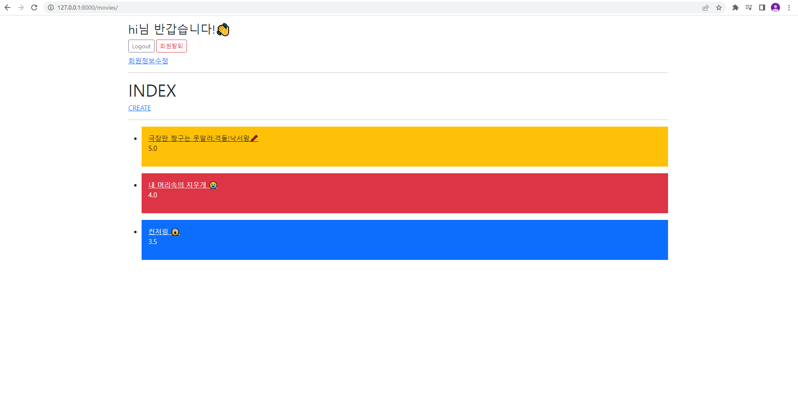
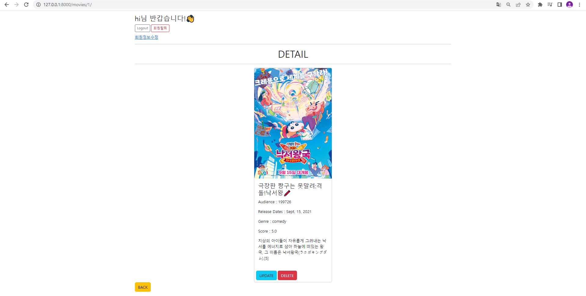
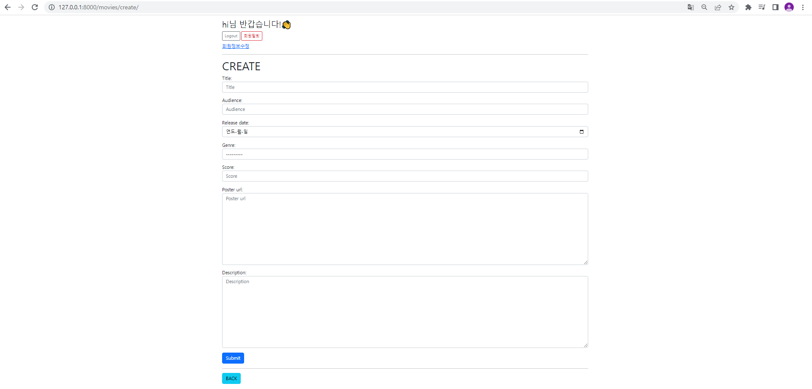
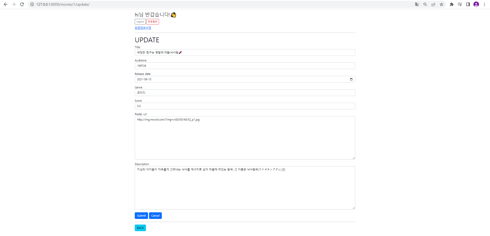

# PJT 05

### 이번 pjt 를 통해 배운 내용

* back이랑 같이하니까 front도 재밌는 것 같다! 😎


## A. index.html

* 요구 사항 : 
  * “전체 영화 목록 조회 페이지”
  * 데이터베이스에 존재하는 모든 영화의 목록을 표시
  * 적절한 HTML 요소를 사용하여 영화 제목 및 평점을 표시
  * 제목을 클릭 시 해당 영화의 상세 조회 페이지(detail.html)로 이동

* 결과 : 
  * 
  
  * 문제 접근 방법 및 코드 설명
    * accounts 앱 생성해서 회원가입 / 회원탈퇴 / 로그인 / 로그아웃 / 회원정보수정 / 패스워드 변경 기능도 함께 구현함!
    * 로그인 되어있는 경우에만 게시글 create 할 수 있도록!
    * 장르별로 게시글의 배경색을 다르게 해줌
  
  ```html
  <!--movies/index.html-->
  

  
    <h1>INDEX</h1>
    
      <a href="">CREATE</a>
    
    <hr>
    <ul>
    
      <li>
          
              <div class="text-bg-danger p-3 mt-3">
                  <a href="" class="link-light">{{ movie.title }}</a>
                  <p>{{ movie.score }}</p>
              </div>
          
              <div class="text-bg-warning p-3 mt-3">
                  <a href="" class="link-dark">{{ movie.title }}</a>
                  <p>{{ movie.score }}</p>
              </div>
          
              <div class="text-bg-primary p-3 mt-3">
                  <a href="" class="link-light">{{ movie.title }}</a>
                  <p>{{ movie.score }}</p>
              </div>
          
      </li>
    
  </ul>
   
  ```
  ```python
  # movies/views.py
  @require_safe
  def index(request):
      movies = Movie.objects.all()
      context = {
          'movies':movies,
      }
      return render(request, 'movies/index.html', context)
  ```

  
  * 이 문제에서 어려웠던점
    * 페이지 예쁘게 만들기,,,,

  * 내가 생각하는 이 문제의 포인트
    * 장르별로 다른 게시글 배경색?!

-----

## B. detail.html

* 요구 사항 : 
  * “영화 상세 정보 페이지”
  * 특정 영화의 상세 정보를 표시
  * Bootstrap Card Component를 사용
  * 해당 영화의 수정 및 삭제 버튼을 표시
  * 전체 영화 목록 조회 페이지(index.html)로 이동하는 링크를 표시

* 결과 : 
  * 
  
  * 문제 접근 방법 및 코드 설명
    * 로그인 되어있는 경우에만 게시글 update, delete 가능하도록!
    * back 버튼누르면 index 페이지로 가도록함
  
  ```html
  <!--movies/detail.html-->
  

  
      <h1 class="d-flex justify-content-center">DETAIL</h1>
      <hr>

      <div class="card mx-auto" style="width: 20rem;">
          
          <div class="card-body">
              <h4>{{ movie.title }}</h4>
              <p>Audience : {{ movie.audience }}</p>
              <p>Release Dates : {{ movie.release_date }}</p>
              <p>Genre : {{ movie.genre }}</p>
              <p>Score : {{ movie.score }}</p>
              <p>{{ movie.description }}</p>
          </div>
          <div class='d-flex m-2'>
              
                  <input class="btn btn-info" type="submit" value="UPDATE" onclick="location.href=''">
                  <form action="" method="POST">
                  

                  <input class="btn btn-danger ms-1" type="submit" value="DELETE" onclick="location.href=''">
                  </form>
              
          </div>
      </div>
    <input class="btn btn-warning" type="submit" value="BACK" onclick="location.href=''">

  
  ```
  ```python
  # movies/views.py
  @require_safe
  def detail(request,pk):
      movie = Movie.objects.get(pk=pk)
      
      context = {
          'movie': movie,
      }
      return render(request, 'movies/detail.html', context)


  @require_POST
  def delete(request,pk):
      movie = Movie.objects.get(pk=pk)
      if request.user.is_authenticated:
          if request.user == movie.user:
              movie.delete()
              return redirect('movies:index')
          return HttpResponseForbidden
      return HttpResponse(status=401)
  ```

  * 이 문제에서 어려웠던점
    * Bootstrap 버튼써서 기능 넣는 과정

  * 내가 생각하는 이 문제의 포인트
    * 예쁜 디자인,,,

  
-----


## C. create.html

* 요구 사항 : 
  * “영화 생성 페이지”
  * 특정 영화를 생성하기 위한 HTML form 요소를 표시
  * 표시되는 form은 Movie 모델 클래스에 기반한 ModelForm
  * 작성한 정보는 제출(submit)시 단일 영화 데이터를 저장하는 URL로 요청과 함께 전송
  * 전체 영화 목록 조회 페이지(index.html)로 이동하는 링크를 표시

* 결과 : 
  * 
  
  * 문제 접근 방법 및 코드 설명
    * ModelForm 기반으로 영화 생성 폼 생성
    * widget 이용해서 각 필드의 속성 구현
    * submit 버튼누르면 단일 영화 데이터를 저장하는 URL로 요청과 함께 전송
    * back 버튼누르면 index 페이지로 가도록함
  
  ```html
  <!--movies/create.html-->
  

  
    <h1>CREATE</h1>
    <form action="" method="POST">
      
      {{ form.as_p }}
      <button class="btn btn-primary" type="submit">Submit</button>
      
    </form>
    <hr>

    <input class="btn btn-info" type="submit" value="BACK" onclick="location.href=''">

  
  ```
  ```python
  # movies/models.py
  from django.db import models
  from django.conf import settings

  GENRE_CHOICES = (
      ('comedy','코미디'),
      ('horror','공포'),
      ('romance','로맨스'),
  )


  # Create your models here.
  class Movie(models.Model):
      user = models.ForeignKey(settings.AUTH_USER_MODEL, on_delete=models.CASCADE)
      title = models.CharField(max_length=20)
      audience = models.IntegerField()
      release_date = models.DateField()
      genre = models.CharField(max_length=30, choices=GENRE_CHOICES)
      score = models.FloatField()
      poster_url = models.TextField()
      description = models.TextField()

      def __str__(self):
          return self.title
  
  
  # movies/forms.py
  from dataclasses import field
  from logging import PlaceHolder
  from django import forms
  from .models import Movie

  class MovieForm(forms.ModelForm):


      class Meta:
          model = Movie
          exclude = ('user',)
          labels = {
              'title': 'Title',
              'audience': 'Audience',
              'release_date': 'Release date',
              'genre': 'Genre',
              'score': 'Score',
              'poster_url': 'Poster url',
              'description': 'Description',
          }

          widgets = {
              'title': forms.TextInput(attrs={'placeholder': 'Title', 'class':'form-control'}),
              'audience': forms.NumberInput(attrs={'placeholder':'Audience','class':'form-control'}),
              'release_date': forms.DateInput(format=('%Y-%m-%d'), attrs={
                  'placeholder':'연도-월-일', 'type':'date','class':'form-control'
              }),
              'genre': forms.Select(attrs={'placeholder': '코미디','class':'form-control'}),
              'score': forms.NumberInput(attrs = {
                  'step': 0.5,
                  'min' : 0,
                  'max' : 5,
                  'class':'form-control',
                  'placeholder': 'Score'

                  }
              ),
              'poster_url': forms.Textarea(attrs={'placeholder': 'Poster url','class':'form-control'}),
              'description': forms.Textarea(attrs={'placeholder': 'Description','class':'form-control'}),

          }


  # movies/views.py
  @login_required
  @require_http_methods(['GET','POST'])
  def create(request):
      if request.method == 'POST':
          form = MovieForm(request.POST)
          if form.is_valid():
              movie = form.save(commit=False)
              movie.user = request.user
              movie.save()
              return redirect('movies:detail', movie.pk)
      else:
          form = MovieForm()
      context = {
          'form': form,
      }
      return render(request, 'movies/create.html', context)
  ```

  * 이 문제에서 어려웠던점
    * 각 필드 속성을 폼에서 완벽히 구현하기
    * Bootstrap 버튼써서 기능 넣는 과정

  * 내가 생각하는 이 문제의 포인트
    * 필드 속성 구현하기!
    * 예쁜 디자인,,,^^

-----

## D. update.html

* 요구 사항 : 
  * “영화 수정 페이지”
  * 특정 영화를 수정하기 위한 HTML form 요소를 표시
  * 표시되는 form은 Movie 모델 클래스에 기반한 ModelForm
  * HTML input 요소에는 기존 데이터를 출력
  * Cancel 버튼은 사용자의 모든 입력을 초기 값으로 재설정
  * 작성한 정보는 제출(submit)시 단일 영화 데이터를 수정하는 URL로 요청과 함께 전송
  * 영화 상세 정보 페이지(detail.html)로 이동하는 링크를 표시

* 결과 : 
  * 
  
  * 문제 접근 방법 및 코드 설명
    * 자신의 게시글만 update할 수 있도록!
    * POST요청이 아닐땐 form = MovieForm(instance=movie) 로 처리해서 폼에 기존 데이터 출력해줌
    * reset 버튼 이용해서 cancel 누르면 사용자 입력이 초기 값으로 재설정
    * submit 버튼누르면 단일 영화 데이터를 수정하는 URL로 요청과 함께 전송
    * back 버튼누르면 index 페이지로 가도록함
  
  ```html
  <!--movies/update.html-->
  

  
    <h1>UPDATE</h1>
    <form action="" method="POST">
      
      {{ form.as_p }}

      <button class="btn btn-primary" type="submit">Submit</button>

      <input class="btn btn-primary" type="reset" value="Cancel">

    </form>
    <hr>
    
    <input class="btn btn-info" type="submit" value="BACK" onclick="location.href=''">
  
  ```
  ```python
  # movies/views.py
  @login_required
  @require_http_methods(['GET','POST'])
  def update(request,pk):
      movie = Movie.objects.get(pk=pk)
      if request.user == movie.user:
          if request.method == 'POST':
              form = MovieForm(request.POST, instance=movie)

              if form.is_valid():
                  form.save()
                  return redirect('movies:detail', movie.pk)
          else:
              form = MovieForm(instance=movie)
      else:
          return redirect('movies:index')
      context = {
          'form': form,
          'movie': movie,
      }
      return render(request, 'movies/update.html', context)
  ```
  
  * 이 문제에서 어려웠던점
    * 수정 시 기존 데이터를 그대로 출력해주는 것?!

  * 내가 생각하는 이 문제의 포인트
    * 기능빼먹지 않고 흐름 생각하면서 넣기!

-----

# 후기

* 계속 해왔던거라 빨리 끝날 줄 알았는데, 하다보니 욕심이나서 시간이 꽤 오래걸렸다!
* back이랑 같이 진행하니까 front도 꽤 재밌는 것 같다!
* 풀 스택이 되기위해 노력해야겠다,,,,!

